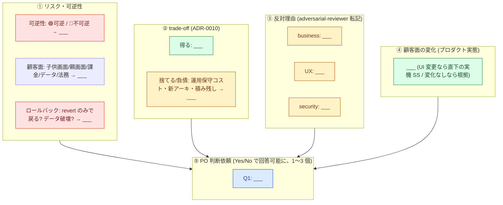

## PO 決裁ブリーフ (po-decision:required)

<!-- #3862 / #3918: pr-review skill「Step 0: PO 決裁 triage」該当 PR にのみ添付する条件付きセクション。
     PR template 共通セクションの後ろに append する (PR_TEMPLATE_SECTIONS.json の必須セクション外)。

     様式 = 一枚絵 (PO 恒久要件 2026-07-23): PO は下の mermaid 図 1 枚 (+ UI 変更時は実機 SS) だけを
     見て Yes/No を判断できること。長文説明を主成果物にしない (補足は折りたたみへ)。
     記入原則: 各 node は 1 行 15〜25 字で言い切る / 5 秒で要点把握 (ADR-0012 整合、装飾より情報設計) /
     深刻度は 🔴🟡🟢 絵文字 + classDef 色で二重表現 / 「___」を全て置換してから起票する。 -->

<!-- UI 変更時: mermaid 直下に実機 SS (screenshots branch) を embed する。図 + SS の 2 点で完結させる。
     mermaid で表現しきれない複雑な構図 (アーキ図等) が要る場合のみ画像 SS 添付に切替可 (GitHub 上で
     直接視認できる形が必須。外部ツールを開かせない)。 -->

補足 (PO は原則読まなくてよい — 図の根拠・詳細)

<!-- 図に収まらない根拠のみ簡潔に。③ の反対理由は tmp/adversarial-evidence/<pr>.json を
     .claude/skills/adversarial-reviewer/SKILL.md の手順で生成してから転記する
     (AI 要約への過信を構造的に打ち消す)。未生成のまま ③ を埋めない -->

