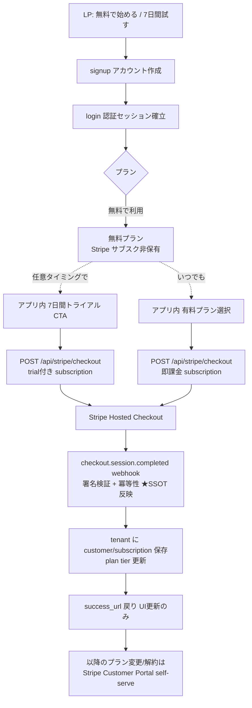

# ライセンスキー撤廃 + Stripe Subscription SSOT 化 — 方針書 (PO レビュー用)

| 項目 | 内容 |
|------|------|
| 版数 | 0.1 (PO レビュー待ち) |
| 作成日 | 2026-05-27 |
| 関連 Epic | #2514 (上位 Epic 新規起票予定、#2514 を Phase 6 子に) |
| ステータス | 調査完了 (現状把握 / 業界標準 / 任意タイミングトライアル) → 方針 PO レビュー |
| 配置 | レビュー段階のため tmp/reviews。確定後 docs/design へ昇華 |

> **本書の位置づけ**: 全体計画 (要件定義 → UX → UI → 動線 → アーキ → 実装詳細 → 実装) の**最上流 = 基本方針**。本書を PO が承認後、詳細設計書 (購入/契約/トライアル/解約/データ/セキュリティ/法務 の各フロー) に展開する。

---

## 1. 背景・課題

- **ライセンスキーは顧客が触れるコア機能**だった (購入の証 + アクティベーションの鍵)。その撤廃は顧客体験・要求仕様・プロダクトのコア機能の根本変更であり、技術的削除では済まない。
- **現状、正しく購入してライセンスを紐づけられた実績がない未完成状態**。「`?direct=true` が dead」「lifetime は Stripe で売れない宙ぶらりん」等は、未完成ゆえの妥当な現象。現状実装を「正解」として踏襲せず、**あるべき姿をゼロベースで設計**する。
- license key 方式で 23 回失敗。3 つの期限 SSOT 並存 / 2 つの認可経路 / 設計書 TODO 6 件 1.5 ヶ月放置 という構造的問題が露見。
- 本 Epic 実装後、**LP → サインアップ → サインイン → 有料アップグレードの導線を PO テスト + 顧客テスト**予定。体験が悪ければ全面作り直しになるため、すべての設計に十分な根拠・裏付け・妥当性を持つ。

---

## 2. スコープ

| 区分 | 内容 |
|------|------|
| **含む** | 購入導線 / 契約 / Stripe 紐づけ / トライアル / プラン管理 UI・UX / 解約 / マーケティング導線 (LP 表現) / 購入セキュリティ (なりすまし・ただ乗り・誤紐づけ防止) / 法務文言への影響 / ② 課金ライフサイクル / ③ データライフサイクル |
| **含まない** | プラン構造 (free/standard/family) と各プランの capability (どのプランで何ができるか) — **既存維持** |
| **別 Epic** | marketplace (#2362、他チーム作業中) |

---

## 3. 基本方針

1. **課金フローは差別化要素ではない → 業界標準・Stripe 公式推奨をそのまま採択** (独自設計しない)。コア価値は子供のゲーミフィケーション体験であり、購入フローで差別化しない (`feedback_oss_first_principle` 整合)。
2. **license key 撤廃 → Stripe Subscription をプラン状態の唯一 SSOT に**。3 SSOT 並存・2 認可経路を解消。
3. **lifetime (買い切り) 廃止 → subscription 一本化**。NUC セルフホストの「無制限」は買い切り課金ではなく **Edition 配布形態 (ADR-0051 NUC-SaaS Bifurcation)** として表現。
4. **account-first** (signup → login → checkout)。未ログイン購入 → 後紐づけは**不採用** (誤紐づけ・乗っ取りの温床、Stripe 公式も非推奨)。
5. **webhook が権限付与の SSOT**。`checkout.session.completed` 等の webhook でプラン状態を確定。redirect / success_url では権限付与しない。
6. **任意タイミングトライアル** (カード登録なし、無料プラン共存、1 回制限は自社管理)。

---

## 4. 採択する業界標準フロー (Stripe 公式 SaaS ガイド)

**紐づけ**: `tenantId` をサーバ側 `locals.context` から取得 (改ざん不可) + `client_reference_id=tenantId` + `subscription_data.metadata.tenantId`。

---

## 5. トライアル設計方針

- **無料プラン = Stripe サブスク非保有** (plan tier = free、恒久的に無料で使い続けられる)
- **任意のタイミング**で「7 日間試す」→ Checkout で trial 付き subscription (`trialing`) を作成 (signup 時だけでなく無料プラン利用後でも可)
- **カード登録なし**: `payment_method_collection=if_required` + `subscription_data.trial_period_days=7`
- **7 日後カード未登録 → 自動 cancel → 無料プランに戻る** (`trial_settings.end_behavior.missing_payment_method=cancel`)
- カード登録済 → 課金開始 (有料継続)
- 終了 3 日前 `customer.subscription.trial_will_end` webhook → カード登録 CTA
- **1 回制限**: Stripe に built-in なし → 自社 `hasUsedTrial` フラグ管理 (Stripe 公式が「アプリ側で管理せよ」と明言)。単位は **family (tenant) 単位を推奨** (1 家族 1 回)
- **注意**: Stripe の新 "Trial Offer API" は Checkout 非互換。従来の `trial_period_days` を使い、API バージョンを stable 固定

---

## 6. lifetime 廃止方針

- **subscription 一本化** (standard/family × 月額/年額 の 4 SKU のみ)
- 根拠: lifetime は SaaS のコア課金として非標準 (継続コストと一回収入の構造的ミスマッチ)。Stripe Billing の全機能 (trial / Portal / proration / dunning) が subscription 前提。子供/家族向け SaaS 実例も全て subscription
- NUC セルフホストの「無制限」は lifetime 課金 SKU ではなく **Edition 配布形態** (ADR-0051) として整理。課金軸と分離
- ※ trust but verify 注記: lifetime 失敗率の数値は二次情報依拠。「subscription 一本化が標準」自体は Stripe 設計思想 + 実例で裏付け済み。**最終的な買い切り廃止は PO 事業判断** (本方針書で承認を仰ぐ)

---

## 7. 現状実装との差分

| 区分 | 内容 |
|------|------|
| **既に標準に沿う (維持)** | tenantId サーバ側取得 / owner-parent 限定 / metadata 紐づけ / webhook 署名検証 / ALREADY_SUBSCRIBED ガード / open-redirect 防止 |
| **変更が必要** | ① license key 経路撤去 (signup 入力・admin 適用・webhook 発行・メール送信) / ② 冪等性ガード追加 (event.id 記録、現状欠落) / ③ トライアルの Checkout 化 (trial_period_days、現状未設定) / ④ client_reference_id 追加 / ⑤ trial_will_end webhook 購読 / ⑥ lifetime SKU 撤去 / ⑦ `?direct=true` dead param 整理 |

---

## 8. 法務・LP 文言への影響

- `site/pricing.html` の「購入後ライセンスキーをメールでお送りします」(line 298/326) → **撤廃で嘘になる、要修正**
- `site/help/license-key.html` (全体がキーヘルプ) → **全削除** (FAQ へ統合検討)
- `site/terms.html` / `tokushoho.html` → ライセンスキー言及なし、**修正不要**
- LP の「今すぐ購入」CTA → 業界標準 (account-first) に沿った導線へ再設計

---

## 9. PO レビューで確定したい論点 (推奨付き)

| # | 論点 | 推奨 | 根拠 |
|---|------|------|------|
| 1 | lifetime の最終処遇 | **廃止 (subscription 一本化)** | §6 (業界標準 + Stripe 全機能) ※PO 事業判断 |
| 2 | トライアル 1 回制限の単位 | **family (tenant) 単位** | 家庭内アプリ、1 家族 1 回が自然 |
| 3 | 無料プランの表現 | **Stripe サブスク非保有** (¥0 price を持たない) | 恒久無料 + 既存ユーザーゼロで最単純 |
| 4 | トライアル状態 SSOT | **Stripe trialing 状態を SSOT** | license key 撤廃と同じ「状態 SSOT を Stripe に寄せる」原則の一貫 |

---

## 10. 全体計画への接続

本方針書 (基本方針) を PO 承認後、以下の詳細設計書に展開する:

1. **購入・契約フロー設計書** (signup → checkout → webhook 紐づけ)
2. **トライアル設計書** (任意タイミング開始 / 1 回制限 / 無料復帰)
3. **プラン変更・解約設計書** (Customer Portal / proration)
4. **データライフサイクル設計書** (解約 → データ削除 / retention)
5. **セキュリティ設計書** (なりすまし・ただ乗り・誤紐づけ防止 / webhook 冪等性)
6. **UI/UX・動線設計書** (LP 表現 / 親管理画面 / ページ遷移フロー図)
7. **法務文言改訂** (pricing / help)

各設計書は本方針書を SSOT として参照し、矛盾しないことを保証する。

---

## 改訂履歴

| 版 | 日付 | 変更内容 |
|----|------|---------|
| 0.1 | 2026-05-27 | 初版 (調査完了 → 基本方針、PO レビュー待ち) |
