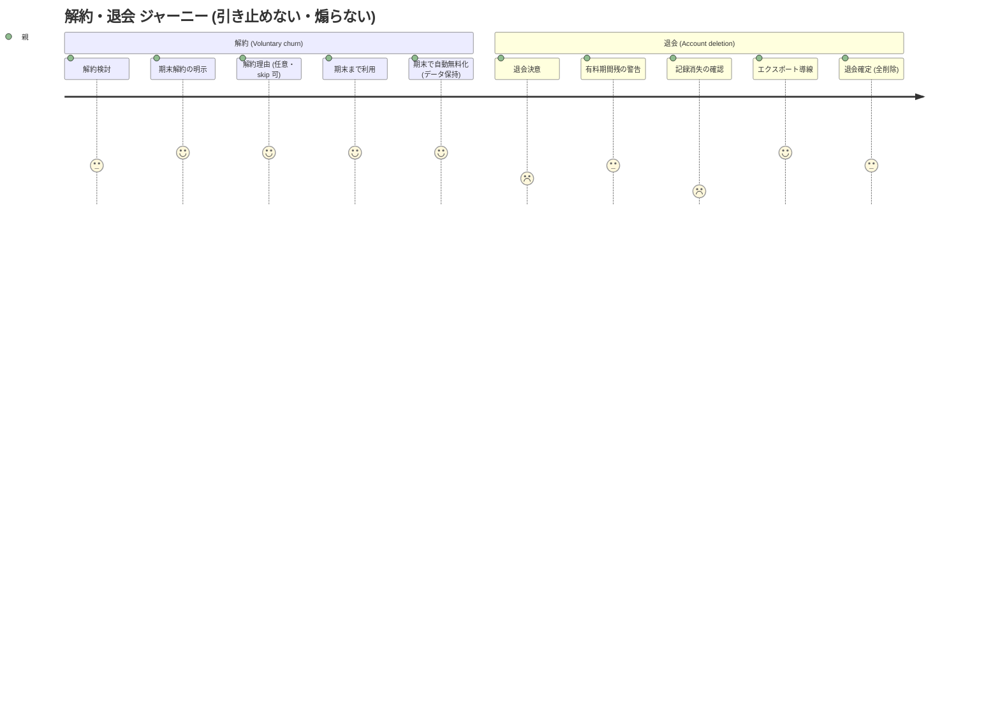
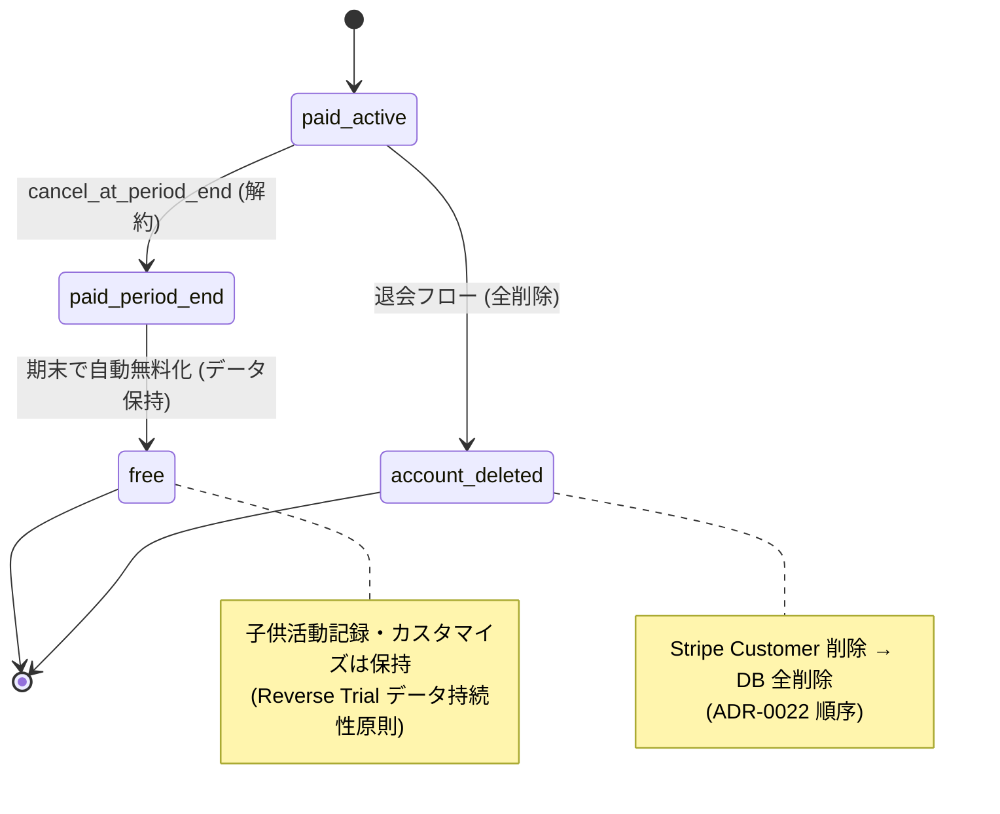
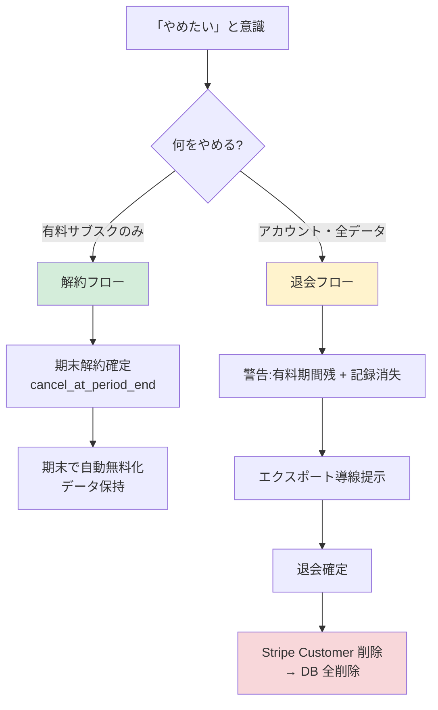

# 解約・退会 ジャーニーマップ (#2550 / Epic #2525 Phase 2 UX) — 既存実装前提

| 項目 | 内容 |
|------|------|
| 孫 issue | #2550 (解約・退会のジャーニー) |
| 親 | #2527 (Phase 2 UX) / 上位 #2525 |
| ステータス | 既存実装前提で設計 (2026-05-28、Phase 1 で cancellation-service / account-deletion-flow 照合済) |
| 対応 Phase 1 要件 | phase1-cancellation-requirements.md (#2536: 期末解約・解約理由は確定後任意 skip 可・退会は全削除) |

## 既存実装の事実 (Phase 1 照合)

- `cancellation-service.ts`: 解約理由 3 分類 + 自由記述。**現状は解約理由「必須」** (→ 要件で確定後任意・skip 可へ)
- `stripe-service.ts:165-207 cancelSubscription`: **現状は即時 cancel** (→ 要件で `cancel_at_period_end=true` 期末解約へ)
- 退会: `account-deletion-flow.md` §0/§4/§5。退会時 Stripe (subscription cancel + Customer 削除) → DB 全削除 (ADR-0022 順序)
- 解約後の読み取り専用猶予: `grace-period-service.ts` (free 0/std 7/family 30日) ← dunning grace とは別概念

## 解約と退会は別物 (2 ジャーニー)

| | 解約 (subscription cancel) | 退会 (account deletion) |
|---|---|---|
| 対象 | 有料サブスクの停止 | アカウント・全データの削除 |
| 結果 | 無料プランに戻る (データ保持) | 全削除 (復元不可) |
| Stripe | cancel_at_period_end | subscription cancel + Customer 削除 |

## ジャーニー A: 解約 (有料 → 無料)

| # | ステップ | 既存実装 | 保護者の体験 | 感情 | 離脱(=継続) |
|---|---|---|---|---|---|
| 0 | 解約を検討 | — | 使わなくなった/高い | 迷い | — |
| 1 | 解約入口 | admin 設定 / Customer Portal | 「解約する」を探す | (引き止めない、ADR-0012) | — |
| 2 | **期末解約の明示** | `cancel_at_period_end=true` (要件) | 「期末まで使えます」 | 安心 (支払分は使える、特商法公平) | — |
| 3 | 解約確定 | cancelSubscription (期末) | 確定 | すっきり | — |
| 4 | **解約理由 (任意・skip 可)** | cancellation-service (要件で skip 可) | 任意で理由選択 or skip | 負担なし (skip OK) | — |
| 5 | 期末まで利用 → 期末に無料化 | webhook subscription.deleted → 無料 tier | 期末に自動で無料へ、データ保持 | 納得 | — |

## ジャーニー B: 退会 (全削除)

| # | ステップ | 既存実装 | 保護者の体験 | 感情 | 離脱(=思いとどまる) |
|---|---|---|---|---|---|
| 0 | 退会を決意 | — | 完全にやめる | 決断 | — |
| 1 | 退会入口 | admin 設定 (account-deletion-flow §0) | 「退会」を探す | — | — |
| 2 | **有料期間残の警告** | 退会前に解約を促す (要件、引き止めにならない範囲) | 「有料期間が残っています」 | 注意喚起 | 中 (先に解約を選ぶ) |
| 3 | 削除範囲の明示 | 全データ削除・復元不可の確認 | 子供の記録も全部消えると理解 | **躊躇 (記録が消える) ← 谷** | 高 |
| 4 | 退会確定 | Stripe cancel+Customer 削除 → DB 全削除 (ADR-0022 順序) | 確定 | 区切り | — |

## 感情曲線と既存実装に即した対策

- **解約 (引き止めない、ADR-0012)**: retention coupon OFF・ダークパターンなし。「期末まで使える」明示が誠実さ = 再契約余地。解約理由は**確定後**に任意収集 (特商法ダークパターン規制回避 + churn データ両立、Phase 1 FR-4)
- **退会の谷③ (記録消失の恐怖)**: 子供の活動記録・ポイントが全部消える = 最大の躊躇。**退会前にエクスポート導線を提示** (Phase 1 データライフサイクル #2538「エクスポート UI 化」と整合)。引き止めではなく「データを持ち帰れる」提示
- **解約 ≠ 退会の明確化**: 「やめたい」が「解約 (無料に戻る・データ残る)」で足りるのに「退会 (全削除)」を選ばせない動線設計 (Phase 4)

## 既存からの変更点 (delta)

| # | 既存 | 要件 | 扱い |
|---|---|---|---|
| 1 | 即時 cancel (cancelSubscription) | 期末解約 (cancel_at_period_end) | 変更 (FR-1) |
| 2 | 解約理由 必須 | 確定後 任意 (skip 可) | 変更 (FR-4、特商法) |
| 3 | cancellation-service 骨格 / Portal / 退会全削除順序 | 維持 | ✅ 既存整合 |

## 年齢モード別の含意

解約・退会は **tenant 単位**で年齢モード非依存。ただし退会時の「記録消失」は**子供ごとの活動履歴・ポイント・称号**が対象 = 複数子供世帯ほど喪失感大 → エクスポート提示の重要度が上がる。子供画面には解約・退会導線を**一切出さない** (ADR-0012、owner/parent のみ)。

## UX レビュー観点 (3 ペルソナ、Phase 2 完了基準)

- **幼児親 (preschool・記録少)**: 解約と退会の違いが分かるか / 期末まで使えると分かり不安にならないか
- **小学生親 (記録多・長期利用)**: 退会時の記録消失の重さ / エクスポート導線が見つかるか / 解約で足りると気づけるか
- **中高生親 (卒業期)**: 卒業に伴う退会で、子の成長記録を持ち帰れるか (GRADUATION_TERMS 整合)

## Open question (PO 判断)

| # | 論点 | 状態 |
|---|------|------|
| 1 | 退会前エクスポートの形式・範囲 | データライフサイクル #2538 と整合、Phase 3 UI |
| 2 | 解約理由 3 分類の文言 | cancellation-service 既存分類、Phase 3 で文言 |
| 3 | 期末解約後の再契約導線 | Phase 4 動線 (引き止めない範囲で) |

## 業界呼称・PO 既出指摘との整合性 (2026-05-28 追補)

- **業界用語**: 解約 = **Voluntary churn** (cancel anytime / Save flow / Cancellation Reasons) / 退会 = **Account deletion** (Right to be forgotten、PIPC §33-35 整合)
- **4 谷参照**: プラン選択困惑 / 金額説得力 / 解約柔軟性 / 購入動線探索は `phase2-checkout-journey.md` 参照。本ジャーニーでは **谷③解約柔軟性が中心テーマ** (cancel anytime / Customer Portal / 期末解約)
- **Reverse Trial データ持続性原則** (`phase2-trial-journey.md`): 解約後も無料プランで子供活動記録・カスタマイズは保持。退会との明確な区別 = 「データ消えない」訴求の核
- **文言 atom 「失う / 消える」排除** (`phase2-plan-change-journey.md` PLAN_CHANGE_TERMS 拡張案と整合): 解約 = 「無料に戻る・データ保護」、退会 = 「全削除を確認」(事実明示で煽らない)
- **ADR-0012 整合**: 引き止め (retention coupon) なし、子供画面に解約・退会導線一切なし
- **特商法 (JP) 整合**: cancel_at_period_end (公平性) / Customer Portal 自己解約 (改正特商法のダークパターン規制整合) / 退会前のデータエクスポート提示 (PIPC 整合)

## mermaid 図示

### 図 1: 解約・退会 2 ジャーニーの感情曲線 (journey)

### 図 2: 状態遷移 (paid → free vs paid → deleted)

### 図 3: 解約 vs 退会の判断分岐 (flowchart)

## 根拠

- **既存実装 (Phase 1 照合)**: `cancellation-service.ts` (3分類+自由記述・必須→任意) / `stripe-service.ts:165-207` (即時→期末) / `account-deletion-flow.md` (退会全削除順序) / `grace-period-service.ts` (解約後猶予)
- Phase 1 phase1-cancellation-requirements.md (#2536) / phase1-data-lifecycle (#2538 エクスポート) / ADR-0022 (削除順序) / ADR-0049 (データ保持)
- Stripe cancel/configure-portal (cancel_at_period_end・retention OFF) / 特商法 (ダークパターン規制) / ADR-0012 (引き止めない)
- ※ 自プロダクトの既存解約・退会動線を主軸に設計 (feedback_deep_research_product_specific)
