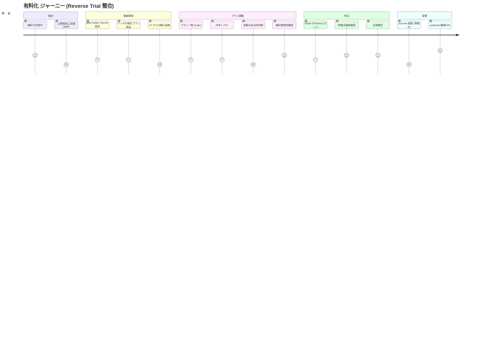
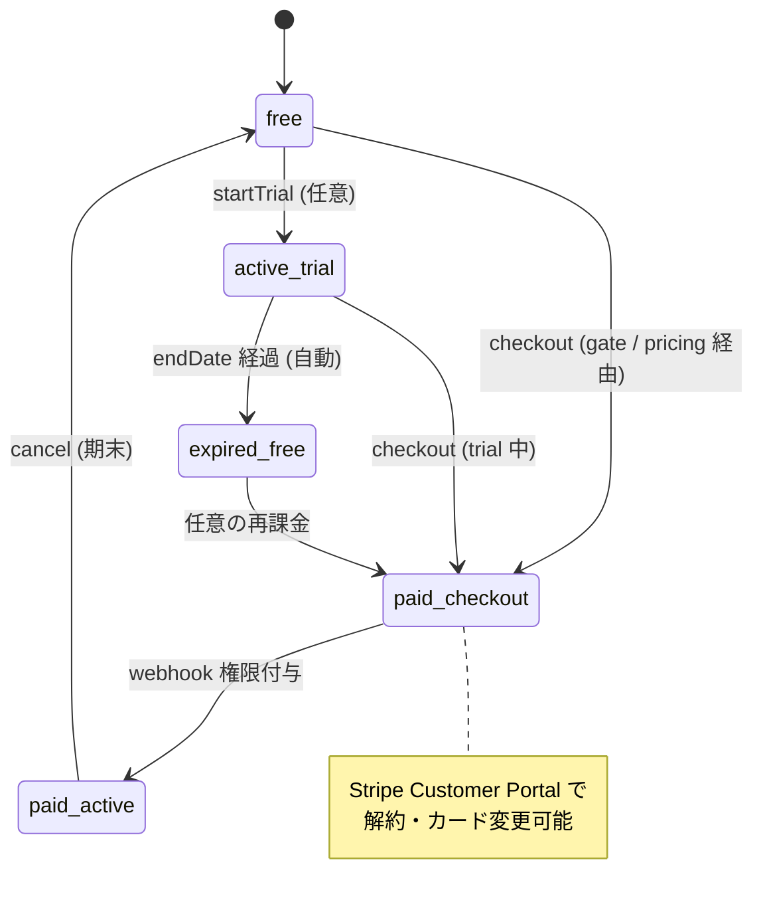

# 有料化 (checkout) ジャーニーマップ (#2548 / Epic #2525 Phase 2 UX) — 全面再構成 (PO 指摘 4 谷追加 + Reverse Trial 整合 + mermaid 3 図)

| 項目 | 内容 |
|------|------|
| 孫 issue | #2548 (有料化のジャーニー) |
| 親 | #2527 (Phase 2 UX) / 上位 #2525 |
| ステータス | **2026-05-28 全面再構成**: PO 指摘の 4 谷 (プラン選択 / 金額 / 解約柔軟性 / 購入動線) + Reverse Trial 文脈 + mermaid 3 図 + 既存実装統合 |
| 対応 Phase 1 要件 | phase1-checkout-requirements.md (#2534) |
| deep-research | SaaS 購入時の谷 14 件 + Stripe 担保/自社責任分類 + in-app upgrade prompts 5 パターン + LP→app 動線設計 (2026-05-28) |
| Explore 照合 | 既存実装 3 点 (FeatureGate / ヘッダ planBadge / LP pricing 動線) 2026-05-28 |
| URL/コンポーネント命名 | `/admin/license` → `/admin/subscription` rename (Phase 7 実装予定、[phase1-naming-url-integrity-requirements.md](phase1-naming-url-integrity-requirements.md) 参照)。本ジャーニー内では設計指針・mermaid は新名、既存実装 reference (`FeatureGate.svelte:49` 等) は現名を維持 |

## 既存実装の事実 (Explore 照合)

| PO 提案 | 既存実装 | 評価 |
|---|---|---|
| gate disable + tooltip + プランページ遷移 | `FeatureGate.svelte:49` (disabled button + title tooltip) / `ActivityLimitBanner.svelte:16` (banner + `/admin/license` link) / `PremiumDialog.svelte:52` (`window.location.href = '/admin/license'`) | ✅ 既存堅牢 |
| ヘッダの現在プランボタン → 遷移 | `AdminLayout.svelte:220` で badge 表示 / `:212-218` で無料時のみ「アップグレード」ボタン → `/admin/license` / **有料プラン時の `plan-badge` はクリック遷移なし** | △ **部分実装、有料時遷移リンク欠落** |
| LP pricing 購入動線説明 | [`site/pricing.html` L297-L301](../../../site/pricing.html) (signup + 直接購入 CTA) / [L403-L420](../../../site/pricing.html) (trial 3 ステップ) / [L475](../../../site/pricing.html) (解約経路 FAQ) | ✅ 既存あり (CTA / 手順 / 解約) |

## 業界呼称・モデルの整合

deep-research 結果 (#2547 トライアル調査と統合):

- 自プロダクトの購入動線は **Reverse Trial パターン C** = `LP CTA → app signup → trial 自動付与 → in-app paywall → checkout` (Linear / Notion 整合)
- LP に Stripe Pricing Table 直埋めは「app で家族を作って体験」前提と衝突 → **不採用**
- **app `/admin/subscription` で Stripe Pricing Table or 既存 Checkout Session API** が整合 (現状は後者で実装済、URL は Phase 7 で rename)

## ジャーニー (PO 指摘 4 谷 + 既存実装統合)

### mermaid 図 1: 感情曲線 (journey)



### mermaid 図 2: 購入動線 (LP→app→pricing→checkout、PO 提案 3 経路統合)

```mermaid
flowchart TB
    LP[LP site/pricing.html<br/>CTA: 無料で始める / 今すぐ購入] -->|signup| SignUp
    LP -->|FAQ| FAQ[購入手順 / 解約手順]
    SignUp[auth/signup] -->|自動ログイン| Admin[/admin]
    Admin -->|gate disable + tooltip<br/>FeatureGate.svelte:49| Pricing[/admin/subscription<br/>プランページ]
    Admin -->|ActivityLimitBanner<br/>:16 + linkLabel| Pricing
    Admin -->|ヘッダの<br/>「アップグレード」ボタン<br/>無料時のみ AdminLayout:212-218| Pricing
    Admin -.->|有料時 plan-badge<br/>**クリック遷移なし (改善要)**| Pricing
    Pricing -->|プラン選択 + 月年トグル| Checkout[Stripe Checkout]
    Checkout --> Success[success ページ<br/>準備中 polling]
    Success -->|webhook| Activated[権限付与<br/>family 機能解放]
    style Admin fill:#e3f2fd
    style Pricing fill:#fff3e0
    style Activated fill:#d4edda
```

### mermaid 図 3: プラン状態遷移 (free → trial → paid、Reverse Trial 全体像)



## ジャーニー詳細表 (PO 指摘 4 谷を統合)

| # | ステップ | 親の体験 | 感情 | 谷/山 | 既存実装 / 改善要 |
|---|---|---|---|---|---|
| 0 | 無料利用中、上限/制約に到達 | gate で disable | 物足りない | — | ✅ `FeatureGate.svelte:49` |
| 1 | **購入動線探索 (LP / app 内)** | tooltip / banner / ヘッダから探す | 「どこから買う?」 | **谷④購入動線探索 (新)** | 既存実装 ✅ + **ヘッダ有料時遷移を改善要** |
| 2 | プランページ到達 `/admin/subscription` (Phase 7 rename、現コードは `/admin/license`) | プラン一覧表示 | — | — | 既存 |
| 3 | **プラン選択 (standard / family)** | どっちが自分に合うか | 「どれを選べば?」 | **谷①プラン選択困惑 (新)** | 改善要: お勧めバッジ / 比較表差分強調 / 診断ナビ (Phase 3 UI) |
| 4 | **金額確認 (月年トグル + 価格)** | ¥500/¥780 (税込) | 「妥当か?」 | **谷②金額説得力 (新)** | 改善要: 1 日換算 / 家族 1 人あたり / 比較 anchor (Phase 3 UI) |
| 5 | **解約柔軟性確認** | CTA 直下「いつでも解約」 | 「縛りは?」 | **谷③解約柔軟性 (新)** | 改善要: `CANCEL_TERMS.anytimeOk` CTA 直下併記 + Portal 言及 (Phase 3 UI) |
| 6 | 申込決断 | 「申し込む」CTA | 決断 | — | 既存 |
| 7 | Stripe Checkout (カード入力) | Stripe ホスト画面 | 緊張 (PCI 担保) | 谷⑤カード入力 | ✅ Stripe Checkout (PCI 担保) |
| 8 | **特商法最終確認画面 5 項目** | 契約期間 / 自動更新 / 解約 / 総額 / cancellation | 「自動更新?税込?」 | (新規補強) | 改善要: Stripe Checkout `custom_text` or 自社確認画面 (Phase 3/5) |
| 9 | 決済確定 → success ページ | 「準備中」表示 | 「反映された?」 | 谷⑥processing gap | 改善要: success polling 新規 (FR-6) |
| 10 | webhook 権限付与 | 数秒後 family 機能解放 | 満足 ← **山** | **山** | ✅ `handleCheckoutCompleted` |

## 4 谷 × Stripe 担保 / 自社責任の整理 (deep-research 反映)

| 谷 | Stripe 側担保 | 自社対応 |
|---|---|---|
| **谷① プラン選択困惑** | Pricing Table (3 tier 視覚化) | 「お勧め」バッジ (standard に) / 比較表差分強調 / 診断ナビ ("家族の人数は?") |
| **谷② 金額説得力** | ❌ Stripe 範囲外 | LP/pricing で `1 日 ¥16` framing / 家族 1 人あたり ¥260 (family) / 比較 anchor (学習教材 1 ヶ月) |
| **谷③ 解約柔軟性** | Customer Portal (cancel UI / cancellation reasons) | CTA 直下に `CANCEL_TERMS.anytimeOk` 必須 + Portal 体験リンク / FAQ で解約 3 ステップ明示 (既存 [`site/pricing.html` L475](../../../site/pricing.html) あり、強化) |
| **谷④ 購入動線探索** | ❌ Stripe 範囲外 | gate tooltip 既存 ✅ / ヘッダ有料時遷移 (改善要) / LP pricing 動線説明 既存 ✅ / LP→app→pricing→checkout 統一 CTA |

## 改善要項目 (Phase 3 UI / Phase 4 動線 / Phase 5 アーキ への申し送り)

### Phase 3 (UI) 申し送り
1. **`/admin/subscription` プランページの再設計** (Phase 7 rename、現コードは `/admin/license`):
   - standard に「お勧め」「人気」バッジ (decoy 効果)
   - 比較表で差分のみハイライト
   - `1 日あたり ¥16` / `家族 1 人あたり ¥260` ROI framing
   - CTA 直下に `CANCEL_TERMS.anytimeOk` 必須併記
2. **AdminLayout 有料時 plan-badge にクリック遷移追加** (`AdminLayout.svelte:220`、href `/admin/subscription`、Phase 7 rename 後)
3. **success ページ polling UI** (Phase 1 FR-6 新規)
4. **特商法最終確認画面 5 項目** (Stripe Checkout `custom_text` API or 自社確認画面)

### Phase 4 (動線) 申し送り
5. **LP→app 統一 CTA 文言** (terms.ts atom 経由: `CTA_TERMS.freeTrialVerb` 「無料で試す」)
6. **LP pricing FAQ 強化**: 「アプリにログイン後、画面右上の ${PLAN_SHORT_LABELS.free} ボタンから ${SIGNUP_TERMS.canonical} へ」
7. **trial 終了 → in-app paywall** (Reverse Trial パターン C 整合、トライアルジャーニー #2547 と接続)

### Phase 5 (アーキ) 申し送り
8. **Stripe Pricing Table vs 自前 Checkout Session の判断** (現状自前で柔軟性高、Pricing Table は LP 未採用)
9. **Stripe Customer Portal の cancellation reasons 設定** (cancellation ジャーニー #2550 と整合)
10. **Product 構成 (1 Product 4 Price vs 4 Product)** (Phase 1 #2535 申し送り済)

## 既存からの変更点 (delta)

| # | 既存 | 要件 | 扱い |
|---|---|---|---|
| 1 | priceId 環境変数直読 (config.ts) | lookup_key 参照 | 変更 (FR-1) |
| 2 | success polling なし | session status polling + 準備中 | 新規 (FR-6) |
| 3 | `handleCheckoutCompleted` で license key 発行 | 撤去 | 削除 (領域 12 連動) |
| 4 | 月/年の扱い | 月/年トグル月額デフォルト・2ヶ月おトク併置 | Phase 1 確定 |
| 5 | createCheckoutSession/webhook SSOT/customer 紐づけ | 維持 | ✅ |
| 6 | gate disable + tooltip (FeatureGate) | 維持・前面化 | ✅ |
| 7 | ActivityLimitBanner | 維持 | ✅ |
| 8 | LP pricing 動線説明 (signup CTA + trial 3 ステップ + FAQ 解約) | 維持・補強 (購入手順を統一) | Phase 4 |
| 9 | ヘッダ plan-badge 有料時クリック遷移 | 追加 | 新規 (Phase 3 UI、小修正) |

## ADR-0012 整合性チェック (deep-research の 5 パターン × 自プロダクト)

| upgrade prompts パターン | ADR-0012 適合 | 自プロダクト採否 |
|---|---|---|
| gate disable + tooltip | ✅ 静的・自発探索時のみ | **採用** (既存 FeatureGate) |
| ヘッダ「現在プラン」ボタン | ✅ 親 admin global nav 1 要素 | **採用** (既存・有料時遷移改善要) |
| 設定 / Upgrade メニュー | ✅ 探索時のみ | **採用** |
| gate banner (画面上部常時) | ⚠️ trial 終了後 14 日のみ条件付き許容 | **条件付き** (ActivityLimitBanner 既存、滞在強要しない設計) |
| modal interrupt | ❌ 滞在時間強制延伸 | **不採用** |
| countdown timer / 連続演出 | ❌ 射幸性 | **不採用** |

**子供 UI (preschool/elementary/junior/senior) には全 upgrade prompt 表示禁止** (Anti-engagement 完全担保)。

## 特商法 (JP 法令) 適合チェック (2022 改正、deep-research 反映)

LP pricing / checkout 最終確認画面で**法的義務として**表示:

1. 契約期間 (月額/年額)
2. 自動更新の有無と停止方法
3. 解約方法 (Customer Portal リンク含む)
4. 総額表示 (税込) — `PRICE_TERMS.taxNote` 既存
5. 申込撤回 / cancellation 条件

→ `site/pricing.html` / `site/tokushoho.html` 既存 SSOT 維持 + Stripe Checkout `custom_text` API で legal text 注入検討 (Phase 5)。

## ペルソナ別 UX レビュー観点 (家族構成 + 購入決断ペルソナ)

- **1 人っ子家庭 (standard 候補)**: family が過剰と判断できる比較表 / 「子 1 人なら standard」診断ナビ
- **兄弟複数家庭 (family ターゲット)**: family の「家族 1 人あたり ¥260」ROI 訴求 / 子供無制限の価値訴求
- **慎重派**: 「いつでも解約」「カード不要 trial 経由」「税込明示」で FUD 解消
- **即決派**: LP → 直接購入 (`?direct=true`) で最短動線 / 「今すぐ購入」CTA 既存
- **trial 経由派**: Reverse Trial パターン C で in-app paywall まで運ぶ

## Open question (PO 判断)

| # | 論点 | 状態 |
|---|------|------|
| 1 | ヘッダ有料時 plan-badge にクリック遷移追加 | Phase 3 UI で小修正 (PO 提案 2 採用) |
| 2 | 「お勧め」バッジを standard に付けるか family に付けるか | Phase 3 UI で要 PO 判断 (decoy 効果) |
| 3 | 診断ナビ採用可否 (「家族の人数は?」slider) | Phase 3 UI 設計の規模感判断 |
| 4 | 特商法最終確認 = Stripe `custom_text` vs 自社確認画面 | Phase 3/5 で実装方式 |
| 5 | LP [`site/pricing.html` L475](../../../site/pricing.html) FAQ 解約手順の強化 (Customer Portal 動画 / GIF) | Phase 4 動線で判断 |
| 6 | Stripe Pricing Table 採用 (app `/admin/subscription` 内、Phase 7 rename 後) | Phase 5 アーキ判断 (現状自前で問題なし) |

## 根拠

- **既存実装 (Explore 照合 2026-05-28)**: `FeatureGate.svelte:49` / `ActivityLimitBanner.svelte:16` / `PremiumDialog.svelte:52` / `AdminLayout.svelte:212-220` / `PlanStatusCard.svelte:76` / [`site/pricing.html`](../../../site/pricing.html) L297-L301 / L403-L420 / L475
- **deep-research (2026-05-28)**: 谷 14 件 (Baymard cart abandonment / Iyengar Paradox of Choice / Cancel anytime 論文 Journal of Retailing 2024 / RevenueCat cost-per-day framing) / in-app upgrade prompts 5 パターン (Userpilot / Plotline / Webuild) / LP→app 動線 (Vercel / Netlify / Linear / Notion) / Stripe Pricing Table 公式 docs
- Phase 1 phase1-checkout-requirements.md / phase1-legal (特商法 5 項目) / phase1-trial (Reverse Trial パターン C) / phase1-cancellation
- ADR-0012 (Anti-engagement、子供 UI 全 upgrade prompts 禁止) / ADR-0013 (LP truth) / ADR-0045 (terms/labels SSOT) / ADR-0050 (Parent-Gate)
- Stripe `custom_text` API / Customer Portal `configure-portal` / Pricing Table 公式 docs
