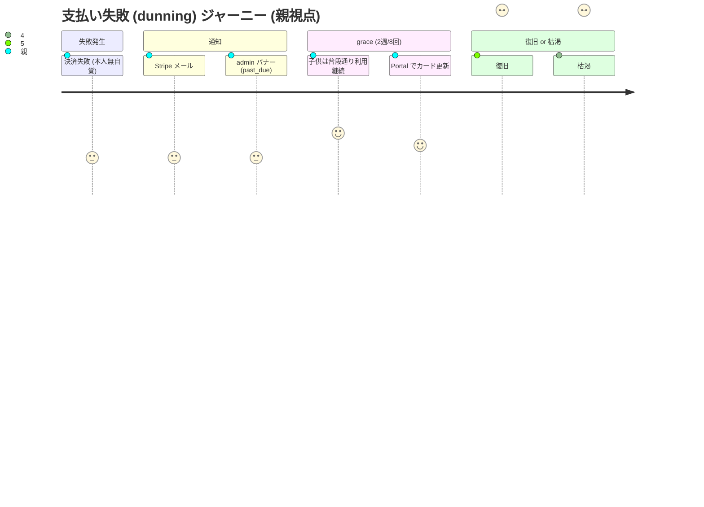
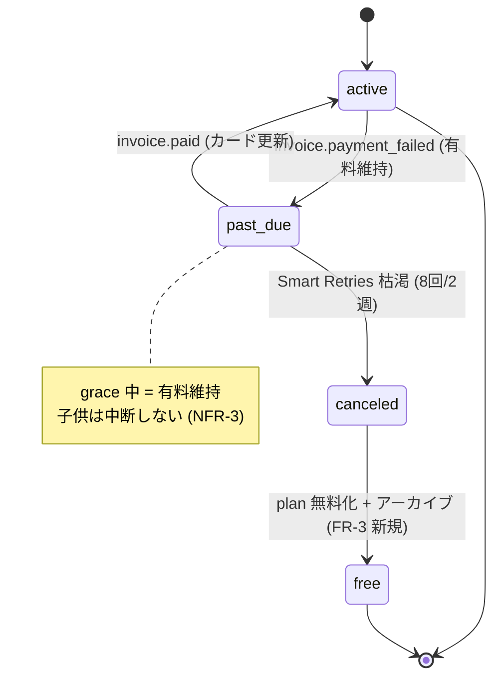
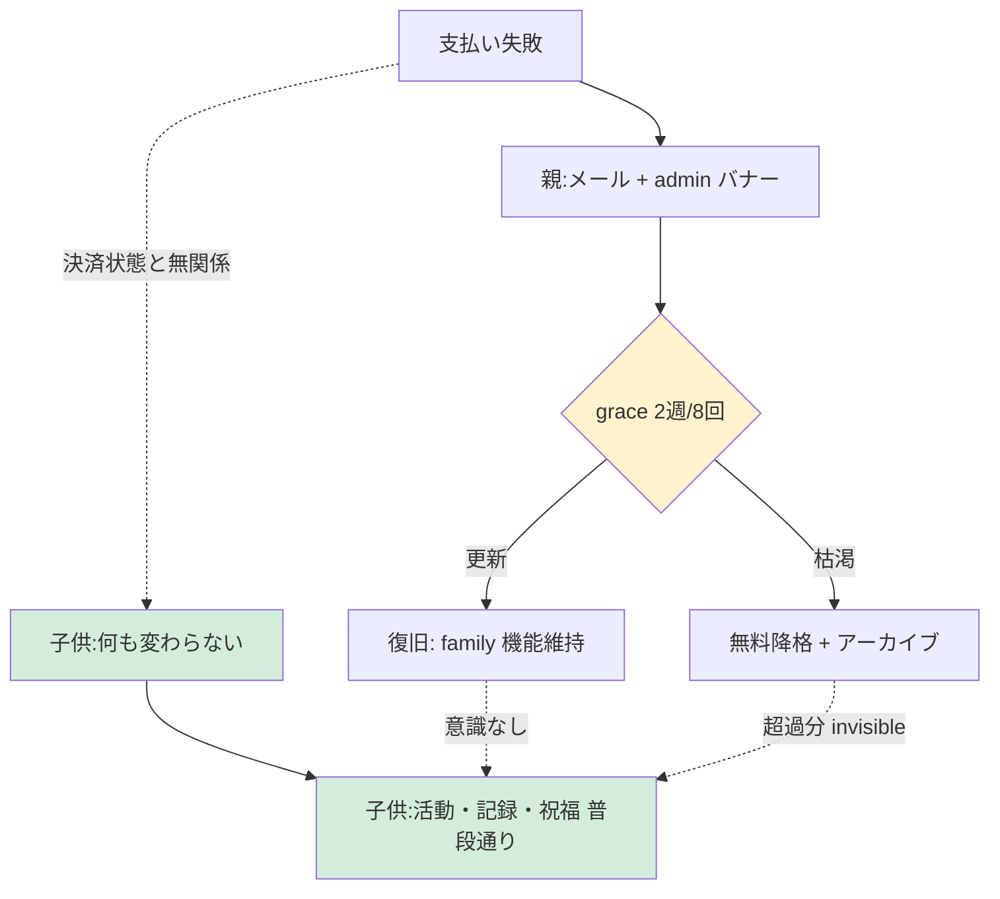

# 支払い失敗 (dunning) ジャーニーマップ (#2551 / Epic #2525 Phase 2 UX) — 既存実装前提

| 項目 | 内容 |
|------|------|
| 孫 issue | #2551 (支払い失敗 dunning のジャーニー) |
| 親 | #2527 (Phase 2 UX) / 上位 #2525 |
| ステータス | 既存実装前提で設計 (2026-05-28、Phase 1 で stripe-service handlePaymentFailed/Deleted 照合済) |
| 対応 Phase 1 要件 | phase1-dunning-requirements.md (#2537: past_due=grace 有料維持・2週8回・canceled→無料・子供画面非表示) |
| URL/コンポーネント命名 | `/admin/license` → `/admin/subscription` rename (Phase 7 実装予定、[phase1-naming-url-integrity-requirements.md](phase1-naming-url-integrity-requirements.md) 参照)。本ジャーニー内では既存実装 reference (`stripe-service.ts:346/394` 等) は現名を維持 |
| プラン命名 + 課金期間 | `family` → **`プレミアム`** rename / **月額のみ (年額廃止、年額決済失敗 retry/access 削除)** (Phase 7 実装予定、[phase1-plan-naming-pricing-axis-requirements.md](phase1-plan-naming-pricing-axis-requirements.md) 参照)。本ジャーニー内では表示は新名、内部識別子は現名維持 |

> **`premium` 階層 signal 打消** (本 PR scope、refs #2594 D-2):
> `premium` は機能本格度を示す signal であり、**無料プランへの exclusion 意図なし**。LP コピー (Phase 4 実装) で `FREE_PLAN_TERMS.forever` (永久無料) / `FREE_TERMS.start` (まずは無料) 等を併記し、階層 signal を構造的に打消す verification を Phase 4 移行 gate に含める。

## 既存実装の事実 (Phase 1 照合)

- `handlePaymentFailed` (stripe-service.ts:346): `GRACE_PERIOD_DAYS=7` を app で独自計算 (→ 要件で Stripe Smart Retries 2週 SSOT へ)
- `handleSubscriptionDeleted` (stripe-service.ts:394): status を **SUSPENDED にするのみ・plan 無料化なし** (→ 要件で unpaid/canceled で無料化)
- webhook 冪等性 (event.id dedup) なし (→ 新規構築 NFR-1)
- past_due バナー・Stripe 自動 dunning メール = 要件で新規 (FR-5/FR-6)

## dunning ジャーニー (保護者視点、既存実装ベース)

| # | ステップ | 既存/要件 | 保護者の体験 | 感情 | 離脱リスク |
|---|---|---|---|---|---|
| 0 | カード期限切れ等で決済失敗 | `invoice.payment_failed` | (本人は気づかない) | 無自覚 | — |
| 1 | **失敗通知 (past_due)** | past_due 記録・有料維持 + Stripe メール + admin バナー (FR-5 新規) | メール/バナーで気づく | 焦り (見落としやすい) | 中 |
| 2 | **grace 中 (2週/8回)** | 有料維持・子供影響なし (NFR-3) | 子供は普段通り使える | 安心 (突然止まらない) | — |
| 3a | **カード更新 (復旧)** | Customer Portal → `invoice.paid` → active | Portal でカード更新 | 安堵 (何も失わない) | — |
| 3b | **更新せず枯渇** | 2週8回後 canceled → 無料化 (FR-3 新規) | 自動的に無料プランへ、データ保持 | 諦め/納得 | — |

## 子供視点 (重要)

支払い状態に**関わらず通知・アクセス断を一切経験しない** (FR-5 子供画面非表示・NFR-3 突然中断しない)。past_due 中も grace で有料維持されるため、子供の体験は決済問題から完全に隔離される。

## 感情曲線と既存実装に即した対策

- **谷① 見落とし (dunning 最大の課題)**: 既存は通知導線が弱い。Stripe 自動 dunning メール (親宛) + admin 静的バナー 1 件 (FR-5/FR-6) で復旧導線を Portal に集約。**自社メールは重ねない** (連打回避、ADR-0012)
- **山② grace の安心 (要件の肝)**: 「支払いが失敗しても子供の利用がすぐ止まらない」= 家庭の信頼。past_due=有料維持を堅持
- **③b の誠実な無料復帰**: 枯渇しても突然のロックでなく無料プランへ降格 + データ保持。解約と同じ二値復帰 (第3状態を作らない)

## 既存からの変更点 (delta)

| # | 既存 | 要件 | 扱い |
|---|---|---|---|
| 1 | `GRACE_PERIOD_DAYS=7` app 計算 | Stripe Smart Retries 2週 SSOT | 変更 (app 日数管理廃止) |
| 2 | `handleSubscriptionDeleted` SUSPENDED のみ | unpaid/canceled で無料化 | 新規実装 (FR-3) |
| 3 | webhook 冪等性なし | event.id 冪等性 | 新規構築 (NFR-1) |
| 4 | past_due バナー・dunning メール | 親 admin バナー 1 件 + Stripe メール | 新規 (FR-5/FR-6) |

## 「7日/猶予」概念の注意 (ジャーニー設計者向け)

本ジャーニーの grace (2週) は**支払い失敗 grace**。解約後の読み取り専用猶予 (grace-period-service free0/std7/family30)・トライアル (7日)・データ保持 (ADR-0049) とは別概念。混同してジャーニーに「7日」と書かない。

## UX レビュー観点 (3 ペルソナ、Phase 2 完了基準)

- **幼児親 (メール見落としやすい層)**: 失敗に気づける導線か / 気づかなくても子供が中断しない安心が成立するか
- **小学生親 (長期利用)**: Portal カード更新が簡単か / grace 中に焦らず対応できるか
- **中高生親**: 無料降格時もデータが残ると分かるか / 子供に決済問題が一切見えないか

## Open question (PO 判断)

| # | 論点 | 状態 |
|---|------|------|
| 1 | past_due バナー文言・表示頻度 | Phase 3 UI (静的 1 件、煽らない) |
| 2 | カード期限切れ事前通知 (1ヶ月前 Stripe メール) | Phase 1 で有効化推奨 (親メールのみ) |
| 3 | 無料降格時のデータ保持の親への通知 | データライフサイクル #2538 と整合 |

## 業界呼称・PO 既出指摘との整合性 (2026-05-28 追補)

- **業界用語**: **Involuntary churn** (非意図的解約) / **Dunning management** (回収管理) / **Stripe Smart Retries** (AI 最適タイミング 8回/2週、業界標準)
- **NRR 計算**: 支払い失敗で canceled → contraction として計上 (churn 計上は最終 unpaid 後のみ)
- **4 谷参照**: `phase2-checkout-journey.md` 参照、本ジャーニーは支払いライフサイクル後段で **谷直接は少ない** (Stripe 自動 dunning メールで構造的解消)
- **Reverse Trial 連続性**: dunning による無料降格は手動ダウンと **同一機構** (`phase2-plan-change-journey.md` Phase 5 申し送り、`archiveForDowngrade` 共通化推奨)
- **文言 atom 「失う / 消える」排除**: past_due バナー文言も「決済ご確認 → Portal でカード更新」型 (煽らない事実明示)
- **ADR-0012 整合**: 子供画面に支払い通知一切なし、past_due 親 admin バナー 1 件・静的、自社メール送らず Stripe 自動 dunning メール一本化 (連打回避)
- **特商法 (JP)**: 「カード期限切れ事前通知」(1ヶ月前) は Stripe 機能で対応、自動更新の停止権 = Customer Portal 経由で担保

## mermaid 図示

### 図 1: 親視点の dunning ジャーニー (journey)

### 図 2: Stripe Subscription 状態遷移 (stateDiagram)

### 図 3: 子供視点 = zero touch (Anti-engagement、flowchart)

## 根拠

- **既存実装 (Phase 1 照合)**: `stripe-service.ts:346 handlePaymentFailed` / `:394 handleSubscriptionDeleted` / `config.ts:95 GRACE_PERIOD_DAYS` / webhook
- Phase 1 phase1-dunning-requirements.md (#2537) / phase1-data-lifecycle (#2538) / ADR-0049 (無料復帰データ保持)
- Stripe smart-retries (8回2週)/customer-emails (親宛 dunning)/subscriptions overview (unpaid でアクセス取り消し) / ADR-0012 (子端末通知禁止・連打しない)
- ※ 自プロダクトの既存 dunning 実装 (grace 維持・無料降格) を主軸に設計 (feedback_deep_research_product_specific)
