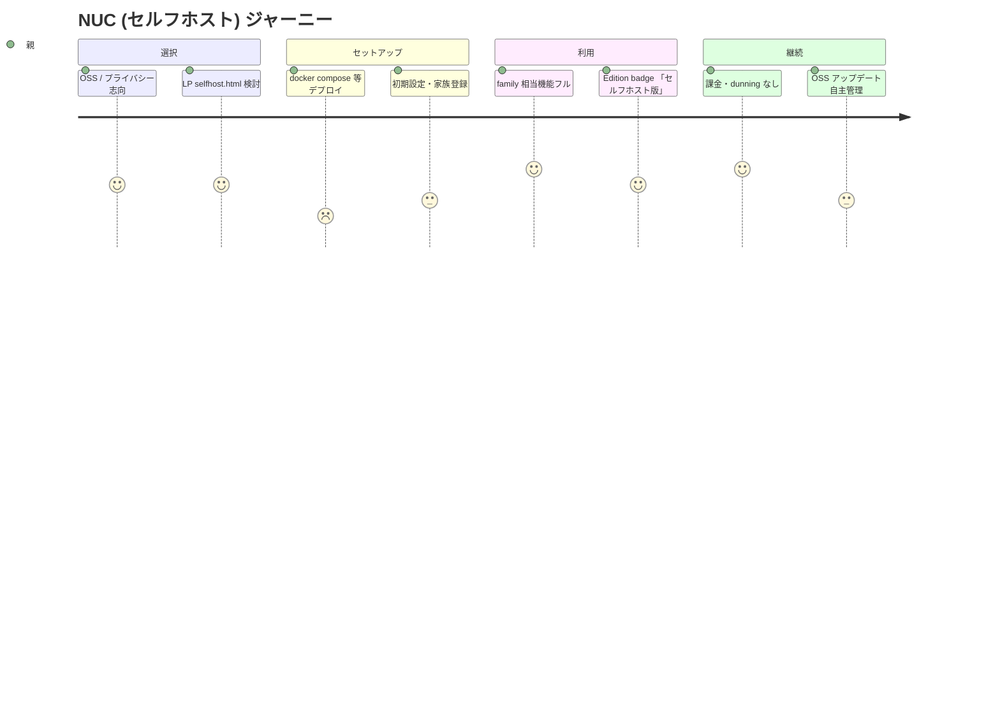
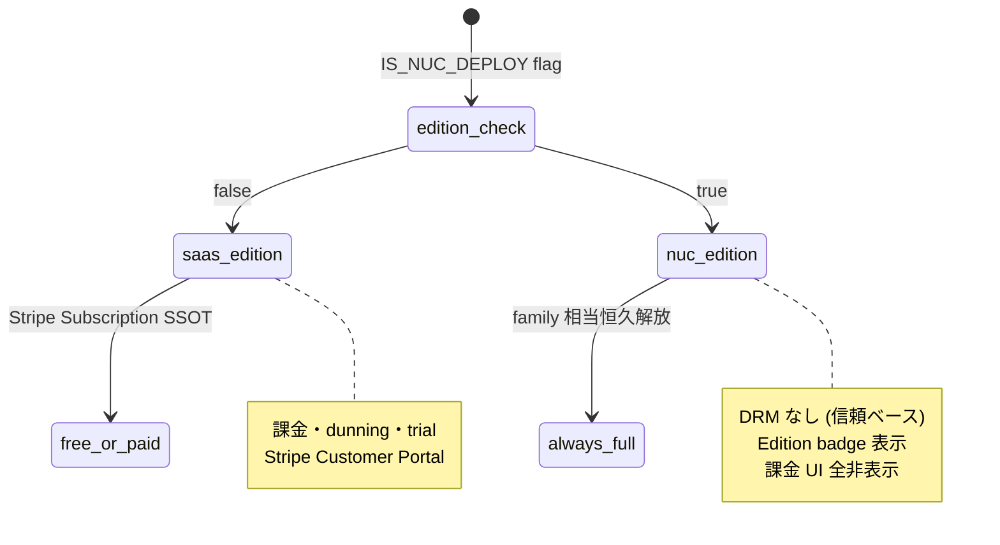
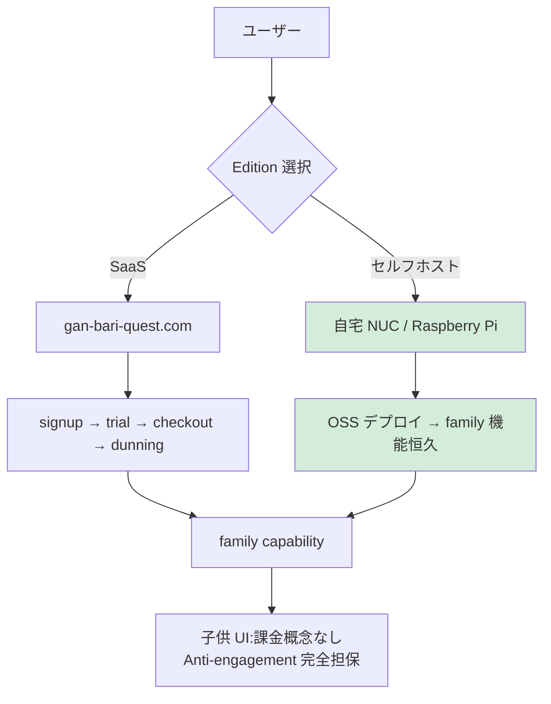

# NUC (セルフホスト) ジャーニーマップ (#2552 / Epic #2525 Phase 2 UX) — 既存実装前提

| 項目 | 内容 |
|------|------|
| 孫 issue | #2552 (NUC のジャーニー) |
| 親 | #2527 (Phase 2 UX) / 上位 #2525 |
| ステータス | 既存実装前提で設計 (2026-05-28、ADR-0051 NUC-SaaS Bifurcation 整合) |
| 対応 Phase 1 要件 | phase1-nuc-requirements.md (#2539: 完全無料 OSS / 信頼ベース DRM なし / family 固定) |

## 既存実装の事実

- ADR-0051 NUC-SaaS Bifurcation: NUC は Edition badge + 簡略表示型、license/billing 領域は SaaS と分岐
- `IS_NUC_DEPLOY` edition flag で実行モード判別 (既存)
- NUC は OSS (セルフホスト)、DRM なし (信頼ベース)、機能上は family 相当
- SaaS 側のライセンスキー / Stripe / dunning / trial 等の課金機構は NUC では存在しない (badge で明示)

## NUC ジャーニー (保護者視点)

| # | ステップ | 既存/要件 | 保護者の体験 | 感情 | 離脱 |
|---|---|---|---|---|---|
| 0 | NUC を選択 | site/selfhost.html (LP) | OSS・自宅サーバで運用 | 自律志向 | 高 (技術ハードル) |
| 1 | セルフホスト設定 | OSS docs / docker compose 等 | 自宅 NUC / Raspberry Pi 等にデプロイ | 達成感 | 高 |
| 2 | 起動・初期設定 | signup (Cognito 非経由・local auth) → /setup | 家族用に立ち上げ | 期待 | 中 |
| 3 | family 機能フル利用 | IS_NUC_DEPLOY=true → family 相当 capability | 子供無制限・全機能 | 満足 ← 山 | — |
| 4 | プラン画面アクセス | **Edition badge 表示** (簡略型、ADR-0051) | 「セルフホスト版・全機能利用可能」 | 安心 (課金導線なし) | — |
| 5 | 継続利用 | 課金・dunning・trial なし | 何も払わず使い続ける | 信頼 | — |

## 感情曲線と既存実装に即した対策

- **谷①② 技術ハードル**: NUC 選択者は技術スキルあり前提だが、ドキュメント整備が離脱対策
- **山③ family 相当の解放**: SaaS の有料機能を完全無料で利用可能 = OSS の価値
- **④ Edition badge の明示 (ADR-0051)**: 「セルフホスト版」badge で課金導線を出さず、SaaS と動線分岐。NUC ユーザーが Stripe / トライアル / dunning UI に迷い込まない

## 既存からの変更点 (delta)

| # | 既存 | 要件 | 扱い |
|---|---|---|---|
| 1 | `IS_NUC_DEPLOY` edition flag | 維持 | ✅ 既存活用 |
| 2 | license/billing 領域の NUC 分岐 | Edition badge + 簡略型 (ADR-0051) | ✅ 既存方針 |
| 3 | DRM (NUC) | なし、信頼ベース | ✅ 既存整合 (Pre-PMF 過剰防衛除外) |
| 4 | NUC で trial / dunning / Stripe UI | 非表示 (Edition badge 経由で分岐) | Phase 3 UI で UI 分岐確定 |

## SaaS / NUC 二経路 capability の保証

PLAN_LIMITS の family capability は SaaS family と NUC で同一。`resolveFullPlanTier` は NUC では Edition flag を見て family 相当を返す。**Provider 抽象化 (Phase 5)** で SaaS 側 PlanProvider と NUC 側 NucPlanProvider を切替、capability matrix は共有。

## UX レビュー観点 (3 ペルソナ、Phase 2 完了基準)

- **技術志向親 (NUC 選択層)**: セルフホスト docs が分かりやすいか / family 機能が完全に使えると分かるか
- **プライバシー重視親**: データが自宅に留まる安心が伝わるか (越境移転懸念なし)
- **長期家庭利用**: NUC の継続性 (バックアップ / アップデート) が安心か

## Open question (PO 判断)

| # | 論点 | 状態 |
|---|------|------|
| 1 | NUC docs の整備範囲 | Pre-PMF 後 (NUC は副次経路、OSS リリース時) |
| 2 | NUC ユーザーの SaaS 移行動線 (家族成長で SaaS へ) | Phase 4 動線 (双方向は Pre-PMF 過剰) |
| 3 | NUC のアップデート通知 | OSS リリースノートで足りる |

## 業界呼称・PO 既出指摘との整合性 (2026-05-28 追補)

- **業界用語**: **Self-hosted edition** / **OSS edition** / **Edition Bifurcation** (SaaS / Self-hosted の機能・課金軸分離、ADR-0051) / **Trust-based licensing** (DRM-less、HashiCorp / GitLab Community Edition / Sentry / PostHog 等の業界標準)
- **NRR には含めない**: NUC は完全無料 OSS = MRR 0、SaaS metric の外側 (副次経路、ADR-0010 Pre-PMF Bucket C)
- **4 谷参照 (大半が不適用)**: NUC は課金導線なし → 谷①プラン選択 / 谷②金額説得力 / 谷③解約柔軟性 / 谷④購入動線 はいずれも**非該当**。代わりに **「セットアップハードル」「アップデート不安」「データバックアップ責任」** が NUC 固有の谷
- **Reverse Trial 整合**: NUC では trial 概念なし、最初から family 相当機能 (IS_NUC_DEPLOY flag で恒久解放)
- **文言 atom**: NUC 専用 atom (`NUC_EDITION_TERMS.selfHosted` / `.fullAccess` / `.unlimited` / `.editionEmoji '🏠'` 既存) 維持、煽り語彙なし
- **ADR-0012 整合**: NUC でも子供 UI に課金/プラン UI 一切なし (そもそも課金概念なし、Anti-engagement 完全担保)
- **ADR-0010 Pre-PMF**: NUC docs 整備は副次、SaaS PMF 後

## mermaid 図示

### 図 1: NUC 親の感情曲線 (journey)

### 図 2: SaaS / NUC Edition Bifurcation (stateDiagram、ADR-0051)

### 図 3: NUC vs SaaS 機能・課金軸の Bifurcation (flowchart、ADR-0051)

## 根拠

- 既存実装: `IS_NUC_DEPLOY` edition flag / Edition badge (ADR-0051) / `plan-limit-service` capability matrix (SaaS/NUC 共有)
- Phase 1 phase1-nuc-requirements.md (#2539) / phase1-security (DRM なし・過剰防衛除外) / ADR-0051 NUC-SaaS Bifurcation / ADR-0010 (Pre-PMF DRM 不要)
- site/selfhost.html (LP NUC 訴求)
