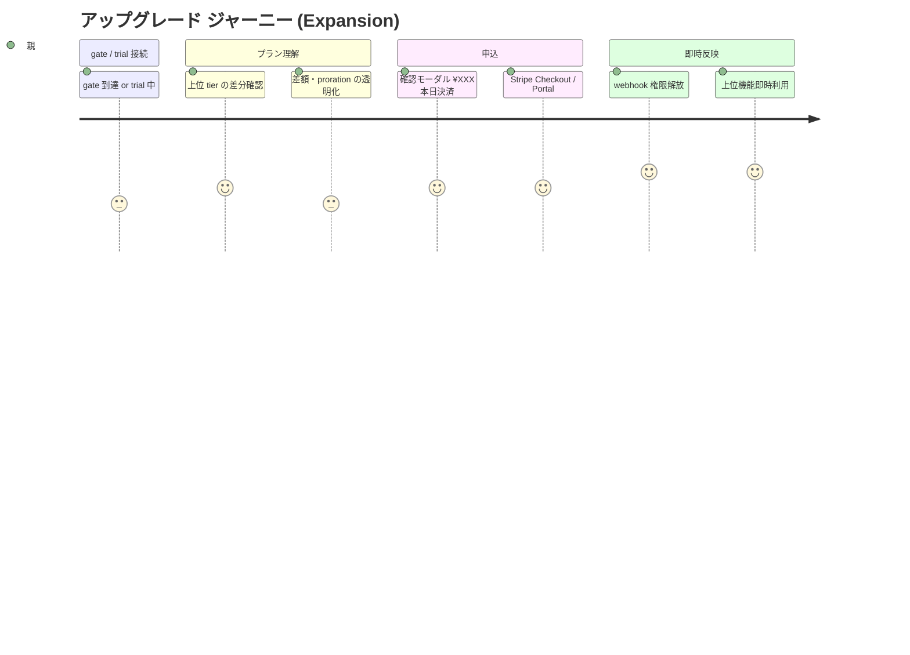
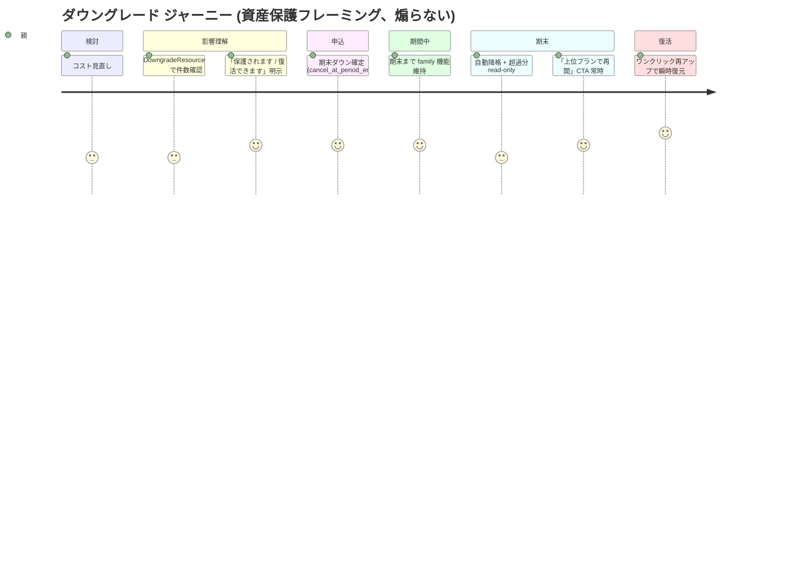
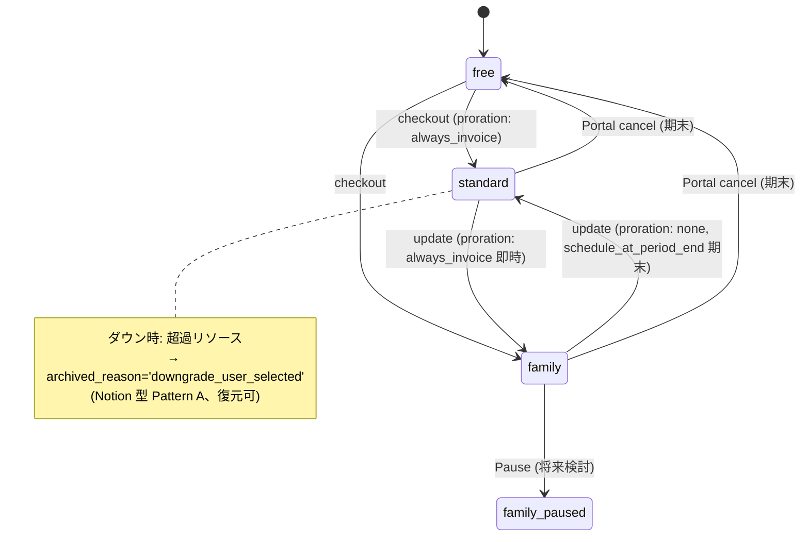
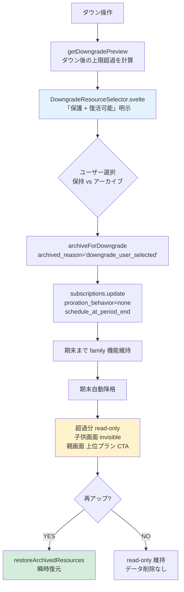

# アップグレード/ダウングレード ジャーニーマップ (#2549 / Epic #2525 Phase 2 UX) — 全面再構成

| 項目 | 内容 |
|------|------|
| 孫 issue | #2549 (アップ/ダウングレードのジャーニー) |
| 親 | #2527 (Phase 2 UX) / 上位 #2525 |
| ステータス | **2026-05-28 全面再構成**: 業界呼称 (Tier Change / NRR) + 既存実装統合 (Notion 型 Pattern A) + proration 透明化 + 文言 atom 拡張 + mermaid 3 図 |
| 対応 Phase 1 要件 | phase1-plan-change-requirements.md (#2535) |
| deep-research | Tier Change UX / proration / 超過リソース 5 パターン対比 / Win-Back (2026-05-28) |
| Explore 照合 | 既存実装 4 点 (SaasLicensePanel / downgrade-service / resource-archive-service / DowngradeResourceSelector) (2026-05-28) |
| URL/コンポーネント命名 | `/admin/license` → `/admin/subscription` rename / `SaasLicensePanel` → `SaasSubscriptionPanel` rename (Phase 7 実装予定、[phase1-naming-url-integrity-requirements.md](phase1-naming-url-integrity-requirements.md) 参照)。本ジャーニー内では既存実装 reference (`SaasLicensePanel.svelte:165-763` 等) は現名を維持 |

## 重複回避方針 (PO 指摘)

4 谷 (プラン選択困惑 / 金額説得力 / 解約柔軟性 / 購入動線探索) と Stripe 担保/自社責任の分類は **`phase2-checkout-journey.md` を参照** し、本ジャーニーでは **アップ/ダウン固有部分のみ**を深掘りする。

## 業界呼称と SaaS metric

- **業界用語**: "Tier change" / "Plan change" (Stripe API `subscriptions.update` の `proration_behavior` で表現)
- **SaaS metric**: アップ = **Expansion revenue** / ダウン = **Contraction revenue** (churn とは別計上)
- **Net Revenue Retention (NRR)** = (Starting MRR + Expansion - Contraction - Churn) / Starting MRR、Best-in-class 120-125%
- **Reverse Trial 終了は contraction で扱う** (churn でない) — Pre-PMF 段階の SaaS dashboard 健全化

## 既存実装の事実 (Explore 照合 2026-05-28)

| PO 提案 / 要件 | 既存実装 | 評価 |
|---|---|---|
| アップ/ダウン UI 動線 | `SaasLicensePanel.svelte:165-763` (統合 UI、無料時はプラン選択カード / 有料時は Portal ボタン) | ✅ 既存堅牢 |
| 超過リソースアーカイブ | `downgrade-service.ts` (`getDowngradePreview` :31-117 / `archiveForDowngrade` :133-202) / `resource-archive-service.ts` / `archived_reason='downgrade_user_selected'` | ✅ **Notion 型 Pattern A 相当 で既存実装済み** |
| ダウン警告画面 | `DowngradeResourceSelector.svelte` (件数明示 + 履歴保持期間警告 + 「アップ時に復元可能」明示 + 顧客選択) | ✅ 既存詳細 |
| 復元動線 | `downgrade-restore/+server.ts` (`restoreArchivedResources`、flag クリアで即復元) | ✅ 既存 |
| proration UX (アップ時差額表示) | **`subscriptions.update` 呼出なし、`upcoming_invoice` / `create_preview` 未実装、Portal 任せ** | △ **新規必要** |

## ジャーニー A: アップグレード (Expansion)

### mermaid 図 1A: アップ感情曲線 (journey)



### アップ ジャーニー詳細

| # | ステップ | 親の体験 | 谷/山 | 既存実装 / 改善要 |
|---|---|---|---|---|
| 0 | gate 到達 / trial 中 | 上位プラン必要を意識 | — | 既存 `FeatureGate` (参照: checkout ジャーニー 谷④) |
| 1 | プランページで上位 tier 確認 | standard→family の差分 | 谷①プラン選択困惑 (参照) | 改善要: 比較表差分強調 (checkout ジャーニー Phase 3 申し送りと統合) |
| 2 | **proration 差額の透明化** | 「本日 ¥XXX を決済 / 次回 ¥YYY (差額含む)」 | **新規必要 (proration UX)** | **新規実装** (`create_preview` API → confirm モーダルに表示) |
| 3 | 申込確定 | 「**¥XXX を支払って family に変更**」CTA (Kinde 「what happens when clicked」原則) | — | 新規 (preview 結果を表示する confirm モーダル) |
| 4 | webhook 権限付与 | 数秒後に family 機能解放 | **山 (即時解放)** | 既存 webhook SSOT |
| 5 | アーカイブ復元 (trial 中追加リソース or 過去 archived) | 自動的に復元 (子供・活動が見える) | 山 (LTV ↑) | 既存 `restoreArchivedResources` |

### アップ固有の改善要

- **proration `always_invoice` 採用** (Stripe 公式 + 業界収束): "don't make them wait" (興奮中の顧客を待たせない)
- **Preview API (`POST /v1/invoices/create_preview`)** で confirm モーダルに差額 dry-run 表示
- `proration_date` を hidden field で保持し preview/update を同一秒で発火
- CTA 文言: 「**¥XXX を支払って family に変更**」(Kinde 原則、煽らず事実)

## ジャーニー B: ダウングレード (Contraction)

### mermaid 図 1B: ダウン感情曲線 (journey、資産保護フレーミング)



### ダウン ジャーニー詳細

| # | ステップ | 親の体験 | 谷/山 | 既存実装 / 改善要 |
|---|---|---|---|---|
| 0 | コスト見直し / 卒業期 | ダウンを検討 | — | — |
| 1 | プランページから「プランを変更」 | 統合 UI | — | 既存 `SaasLicensePanel` |
| 2 | **`DowngradeResourceSelector` で影響確認** | 「子 6 人中 5 人を保持、1 人アーカイブ」「活動 25 個中 20 個保持」明示 | 谷②失う恐怖 | ✅ **既存実装で「保護 + 復活可能」明示済** |
| 3 | 資産保護文言で安心 | 「アーカイブされますが保護されます。いつでも復活できます」 | 中間山 (安心) | 改善要: 文言 atom 拡張 (「失う / 消える」排除、後述) |
| 4 | 期末ダウン確定 | `cancel_at_period_end` 風、期末まで family 維持 | — | 改善要 (`subscriptions.update` + `schedule_at_period_end` 経由) |
| 5 | 期末まで family 機能維持 | 「次回 YYYY/MM/DD から standard に変更」明示 | — | 改善要 (期間中表示) |
| 6 | 期末で自動降格 + 超過分 read-only | 子供画面では archived 子供・活動が invisible (Anti-engagement) / 親画面では read-only + 「上位プランで再開」CTA | — | ✅ 既存 + 親画面 banner 改善要 (Phase 3 UI) |
| 7 | **再アップで瞬時復元** | One-click reactivation (Calendly 型) | **最終山 (Win-Back)** | ✅ 既存 `restoreArchivedResources` |

### 超過リソース処理 5 パターン対比 (deep-research)

| パターン | 採用 SaaS | 振る舞い | 心理影響 | 自プロダクト |
|---|---|---|---|---|
| **A. Read-only + Block-on-add (Notion)** | Notion / HubSpot | 既存 read + edit 可、新規追加だけブロック | 既存資産は守られた安心感 + 軽い圧 | **✅ 採用 (既存実装相当)** |
| B. Edit-lock (Figma) | Figma | edit 不可、view のみ、整理で復活 | 「人質」感、地雷化 | ❌ 不採用 |
| C. Deactivate (Calendly) | Calendly | inactive 化、既存予約保持、新規停止 | 「データ消えていない」明確 | △ Pattern A と類似 |
| D. Watermark (Canva) | Canva Pro | premium 素材に watermark | 視覚的圧、毎回 reminder | ❌ 子供 UI 不適 |
| E. Retention shrink (Slack) | Slack | 90日より古い hidden / 1年で物理削除 | 可逆性が低く感じる + dread | ❌ Reverse Trial データ持続性と矛盾 |

### Pattern A 採用理由 (4 点)

1. **子供 UI に視認の不快感ゼロ** (archived は invisible、Anti-engagement ADR-0012 整合)
2. **「失う恐怖」最小化** (Calendly 型より一段強い「continue editing」許容で長期保持)
3. **Reverse Trial データ持続性原則と完全整合** (trial で作ったカスタマイズは降格後も保護、`phase2-trial-journey.md` 接続)
4. **Pattern B (Figma) 地雷回避** (Figma 公式 forum で「team locked、何もできない」苦情多発)

## mermaid 図 2: 状態遷移 (free ↔ standard ↔ family、双方向 + アーカイブ)



## mermaid 図 3: ダウン時のリソース処理フロー (Notion 型 Pattern A)



## 文言 atom 拡張案 (terms.ts SSOT、ADR-0045 整合)

deep-research 推奨を反映:

```ts
// terms.ts atom 追加候補
PLAN_CHANGE_TERMS = {
  changeVerb: 'プランを変更',     // 「アップグレード」「ダウングレード」を煽り回避で統一
  archive: 'アーカイブ',
  restore: '復活',
  protected: '保護されています',  // 「失う」「消える」を排除
  resumeReady: 'いつでも復活できます',
}
```

```ts
// labels.ts compound 例
PLAN_CHANGE_LABELS = {
  downgradeWarning: `${PLAN_FULL_TERMS.family} で作成された設定は ${PLAN_CHANGE_TERMS.archive} されますが ${PLAN_CHANGE_TERMS.protected}。${PLAN_CHANGE_TERMS.resumeReady}`,
  upgradeConfirm: `¥{差額} を支払って ${PLAN_FULL_TERMS.family} に変更`,
}
```

**禁止語彙**: 「失う」「消える」「使えなくなる」「ロックされる」(Calendly 反面教師)

## 改善要項目 (Phase 3/4/5 申し送り)

### Phase 3 (UI)
1. **アップ confirm モーダルに proration 差額表示** (preview API 結果を「本日 ¥XXX / 次回 ¥YYY」)
2. **DowngradeResourceSelector 文言を atom 化** (「失う」排除、「保護 / 復活」採用)
3. **期末ダウン期間中の親 admin banner** (「次回 YYYY/MM/DD から standard / それまで family 維持」)
4. **archived リソースの親画面 read-only + 「上位プランで再開」CTA**

### Phase 4 (動線)
5. **One-click reactivation** (ダウン後の親画面に「アーカイブ X 件・ワンクリックで復活」常時表示)
6. **アップ動線と checkout ジャーニーの統一 CTA** (`PLAN_CHANGE_TERMS.changeVerb`)

### Phase 5 (アーキ)
7. **`subscriptions.update` + `proration_behavior=always_invoice` 実装** (アップ即時)
8. **`subscriptions.update` + `proration_behavior=none` + `schedule_at_period_end`** (ダウン期末)
9. **Preview API 統合** (`POST /v1/invoices/create_preview`)
10. **Reverse Trial 終了 ⇔ ダウン降格を同一機構で実装** (`archiveForDowngrade` を trial 終了でも再利用、`resource-archive-service.ts` 統合)
11. **`PLAN_CHANGE_TERMS` atom + `PLAN_CHANGE_LABELS` compound 追加** (terms.ts / labels.ts)

## 特商法 (JP) 最終確認画面 6 要素 (アップ/ダウン共通)

deep-research 反映、消費者庁 2022 改正特商法ガイドライン整合:

1. **分量** — 「子供 5 人 / 活動 20 個まで利用可能」等の数値明示
2. **販売価格・対価** — アップ: 「月額 ¥780 (税込) + 本日差額 ¥XXX」/ ダウン: 「次回更新 YYYY/MM/DD ¥500 (税込)」
3. **支払の時期・方法** — アップ即時 / ダウン期末 明示
4. **引渡・提供時期** — 機能反映タイミング (アップ即時 / ダウン期末)
5. **申込期間** — トライアル経由なら trial 期間再表示
6. **解約方法** — 「いつでも Customer Portal から変更・解約可能」

→ Stripe Customer Portal だけに任せず、**自社 confirm モーダルで 2 重表示**して JP 法令リスク最小化。

## ADR-0012 整合性チェック

| 観点 | アップ | ダウン |
|---|---|---|
| 子供 UI に課金圧をかけない | ✅ 親 admin のみ | ✅ archived リソースは子供画面 invisible |
| 滞在時間延伸禁止 | ✅ 即時反映で短時間完結 | ✅ 期末ダウンの期間中も誘導通知連打しない (静的 banner 1 件) |
| サプライズ濫用禁止 | ✅ 「¥XXX 本日決済」明示 | ✅ 期末日明示、突然中断なし |
| 連続演出 / 煽り禁止 | ✅ Kinde 「what happens when clicked」原則 | ✅ 「失う / 消える」atom 禁止、「保護 / 復活」採用 |

## ペルソナ別 UX レビュー観点

- **兄弟複数家庭 (family → standard 検討)**: 子供 N 人のうち誰をアーカイブするか選択 / 「保護 + 復活」の安心感が刺さるか
- **trial 完璧化派 (family trial → free 自然降格)**: Reverse Trial の自動降格と手動ダウンが同一 UX で混乱しないか
- **コスト見直し家庭**: standard で十分と判断 / 期末まで family 維持の納得感
- **再アップ復活組 (Win-Back)**: ダウン後の「アーカイブ X 件・ワンクリック復活」が見つけやすいか
- **卒業期 (高校生親)**: 卒業に伴う standard / 無料へのダウンが自然か / 子供の成長記録が保護される安心

## Open question (PO 判断)

| # | 論点 | 状態 |
|---|------|------|
| 1 | `PLAN_CHANGE_TERMS` atom 採否 (「失う / 消える」全 atom から排除) | terms.ts 拡張、PO 判断 (ADR-0045 整合) |
| 2 | proration UX = `always_invoice` + preview API 採用 | Phase 5 アーキで実装方式 (推奨済) |
| 3 | Pattern A 維持 vs Pattern C (Calendly) への変更 | 既存 Pattern A 推奨 (子供 UI Anti-engagement 整合) |
| 4 | One-click reactivation バナーの常時表示範囲 | Phase 3 UI、archived 件数 > 0 で表示 |
| 5 | 期末ダウン期間中の文言 (「family 維持中」表示) | Phase 3 UI |
| 6 | Reverse Trial 終了 ⇔ 手動ダウンを同一機構で実装 | Phase 5 アーキ (recommended、`archiveForDowngrade` 再利用) |
| 7 | Product 構成 (1 Product 4 Price vs 4 Product) | Phase 5 (Phase 1 #2535 申し送り済) |

## 根拠

- **既存実装 (Explore 照合 2026-05-28)**: `SaasLicensePanel.svelte:165-763` / `downgrade-service.ts` (`getDowngradePreview`:31-117, `archiveForDowngrade`:133-202) / `resource-archive-service.ts` / `DowngradeResourceSelector.svelte` / `downgrade-restore/+server.ts`
- **deep-research (2026-05-28)**: Stripe `proration_behavior` 3 値 + Preview API (`create_preview`) + 超過リソース 5 パターン対比 (Notion/Figma/Calendly/Canva/Slack) + Kinde Plan Change Best Practices + Win-Back Chargebee/Sequenzy/Churnkey + 消費者庁特商法ガイドライン 2022
- 関連ジャーニー: `phase2-checkout-journey.md` (4 谷参照) / `phase2-trial-journey.md` (Reverse Trial データ持続性) / `phase2-cancellation-journey.md` (期末解約・退会と整合)
- Phase 1 phase1-plan-change-requirements.md (#2535) / phase1-data-lifecycle (#2538 ADR-0049 データ保持) / phase1-trial (Reverse Trial)
- ADR-0012 (Anti-engagement) / ADR-0045 (terms.ts SSOT 2 階層) / ADR-0049 (データ保持) / ADR-0010 (Pre-PMF)
- Stripe `subscriptions/update` / `invoices/create_preview` / Customer Portal `schedule_at_period_end` 公式 docs
