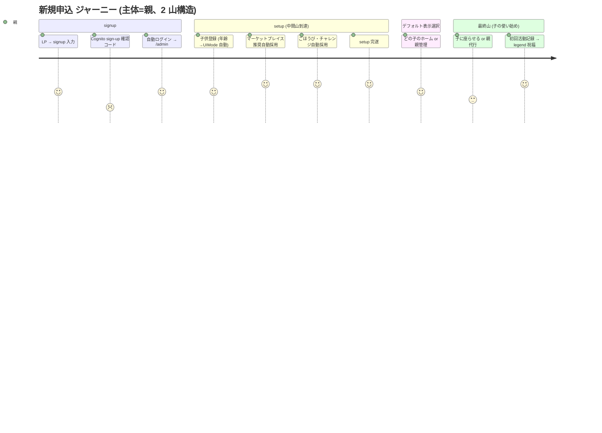
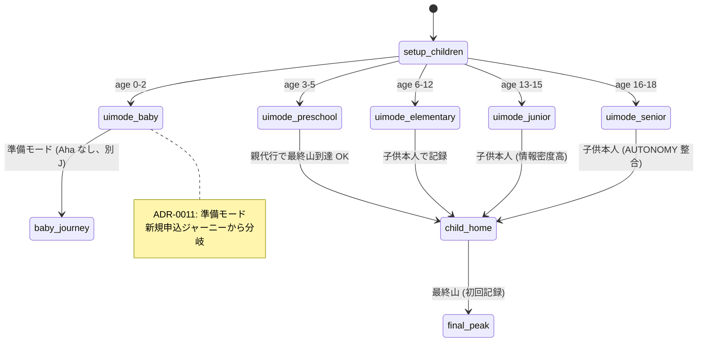

# 新規申込 ジャーニーマップ (#2546 / Epic #2525 Phase 2 UX) — 既存実装前提・2 山構造で全面再構成

| 項目 | 内容 |
|------|------|
| 孫 issue | #2546 (新規申込のジャーニー) |
| 親 | #2527 (Phase 2 UX) / 上位 #2525 |
| ステータス | **2026-05-28 全面再構成**: 主体を親に統一・2 山構造 (中間山 setup 完遂 + 最終山 初回記録) ・マーケットプレイス推奨自動採用とデフォルト表示ページ選択を既存実装ベースで組み込み |
| 対応 Phase 1 要件 | phase1-signup-requirements.md (補強済 #2561) |
| URL/コンポーネント命名 | `/admin/license` → `/admin/subscription` rename (Phase 7 実装予定、[phase1-naming-url-integrity-requirements.md](phase1-naming-url-integrity-requirements.md) 参照)。本ジャーニー内では設計指針は新名、既存実装 reference は現名を維持 |
| プラン命名 + 課金期間 | `family` → **`プレミアム`** rename + **月額のみ (年額廃止)** (Phase 7 実装予定、[phase1-plan-naming-pricing-axis-requirements.md](phase1-plan-naming-pricing-axis-requirements.md) 参照)。本ジャーニー内では表示プラン名は新名 (atom 1 行修正で Phase 7 自動伝播)、内部識別子 (`'family'` enum / `family-tenant` 等) は現名維持 |

> **`premium` 階層 signal 打消** (本 PR scope、refs #2594 D-2):
> `premium` は機能本格度を示す signal であり、**無料プランへの exclusion 意図なし**。LP コピー (Phase 4 実装) で `FREE_PLAN_TERMS.forever` (永久無料) / `FREE_TERMS.start` (まずは無料) 等を併記し、階層 signal を構造的に打消す verification を Phase 4 移行 gate に含める。

## 設計の核 (PO 整理を反映)

- **ジャーニー主体は最後まで親** (signup・子供登録・活動/ごほうび登録は親が行う)
- **2 山構造**:
  - **中間山** = setup 完遂 (「使い始められる状態になった」、親の達成感)
  - **最終山** = 初回活動記録 (子の使い始め、**親代行でも到達 OK**)
- **マーケットプレイス推奨自動採用** = 中間山を早く到達させる既存実装の鍵
- **ログイン後デフォルト表示ページ選択** = 中間山→最終山の橋渡し (既存実装で `default_child_id` + `selectedChildId` cookie)

## ジャーニー (既存実装ベース、感情曲線)

| # | ステップ | 既存実装 | 親の体験 | 感情 | 谷/山 |
|---|---|---|---|---|---|
| 0 | LP | `site/index.html` | 価値・安全性・無料を確認 | 期待/不安 | — |
| 1 | signup 入力 | `auth/signup/+page.svelte` (**license key 欄撤去**) | email/pw/3同意 | 不安 (3同意・越境) | — |
| 2 | **Cognito sign-up 確認コード入力** (MFA でなく初回 email 所有確認) | `auth/signup` SignUp→ConfirmSignUp action | 6 桁コード受信→入力 | **苛立ち (届かない・spam) ← 谷①** | 谷① |
| 3 | 自動ログイン → /admin + provisioning | `auth/signup/+page.server.ts:249-404` | 自動遷移 | 安堵 | — |
| 4 | **/setup/children (必須)** | `setup/children` (年齢→UIMode 自動: 0-2=baby/3-5=preschool/6-12=elementary/13-15=junior/16-18=senior) | 子供のニックネーム+年齢 | 期待 | — |
| 5 | **/setup/packs (マーケットプレイス推奨自動採用)** | `setup/packs/+page.server.ts:49-55, 120-142` (targetAgeMin/Max マッチ + mustDefault 同時採用、**スキップ時も自動インポート**) | 年齢に合った活動セットが**自動選択済み**で出る → そのまま採用 or 微調整 | 楽さ (組まなくていい) | — |
| 6 | /setup/rewards・challenges (推奨自動採用) | `setup/rewards/+page.server.ts:34-36` (年齢条件) / `setup/challenges/+page.server.ts:40-56` (autoAddRecommended) | 推奨ごほうび・チャレンジ自動採用 | 楽さ | — |
| 7 | **/setup complete** | setup complete | 「使い始められる」 | **達成感 ← 中間山 (setup 完遂)** | **中間山** |
| 8 | ログイン後デフォルト表示先へ遷移 | `/+page.server.ts:20-69` (selectedChildId cookie → `default_child_id` → 子1人自動 → /switch の優先順位) | 親が「どの子の使い始めを見るか」を意識 (兄弟あれば既定の子供選択 UI 提示は `admin/settings/activities`) | 主体感 | — |
| 9 | 親代行 or 子に座らせる | — (画面遷移のみ) | 子供を呼ぶ or 親が代わりに記録準備 | **躊躇 (子に座らせるハードル) ← 谷②** | 谷② |
| 10 | **初回活動記録 → 祝福 legend** | `ActivityCard.svelte` + `CelebrationEffect` (legend: 👑+aura+particle) | 子 (or 親代行) が ActivityCard を 1 つ記録 → 数秒の祝福 | **歓喜 (家庭で価値が動き出した) ← 最終山** | **最終山** |

## 感情曲線と既存実装に即した対策

### 中間山 (#7 setup 完遂)
- **既存実装の強み**: マーケットプレイス推奨が **年齢帯条件で自動判定 + デフォルト選択 + スキップ時も自動インポート**まで実装済み = setup 9 ステップを全部「自分で組む」必要がない
- 設計指針: この既存の楽さを **LP / setup UI で前面化** (Phase 3)。「9 ステップ全部組まなくていい、推奨をそのまま採用できる」が達成感の核
- 補強案 (Phase 3 UI 申し送り): 自動登録モードを 1 ボタンで明示 (「推奨をすべて採用」ワンクリック)

### 最終山 (#10 初回活動記録)
- **既存実装の強み**: `CelebrationEffect` の legend 演出 (👑) が初回記録の Aha。「記録 → 数秒で閉じる」(ADR-0012) の体験
- **親代行で到達 OK**: 主体が子か親代行かは家庭の事情に委ねる。preschool は親代行が自然、elementary+ は子供本人だが厳密分岐しない

### 谷① (#2 Cognito sign-up 確認コード)
- 既存: 再送可能 (60 秒クールダウン)、24h 有効 (FR-9)
- 設計指針: 「届かない・spam」の告知 + 再送導線を見やすく (Phase 3)

### 谷② (#9 子に座らせるハードル)
- 親代行 OK で軽減。「ご家族で一緒に最初の記録を」等の文言で親の負担感を下げる (Phase 3)
- ログイン後デフォルト表示ページ選択 (既存) で「最初に誰のホームを開くか」を親が制御 → 自然な動線

## 既存からの変更点 (delta、ライセンスキー撤廃 + 補強)

| # | 既存 | 要件 | 扱い |
|---|---|---|---|
| 1 | signup に license key 欄 | 撤去 | 変更 |
| 2 | `?plan=X` trial 自動開始 (signup) | 撤去 (任意タイミング) | 変更 (trial ジャーニー #2547 と整合) |
| 3 | マーケットプレイス推奨自動採用 (setup/packs:120-142) | 維持・前面化 | ✅ 既存活用 (中間山の核) |
| 4 | `default_child_id` + `selectedChildId` cookie (ログイン後遷移) | 維持・signup 直後の動線で活用 | ✅ 既存活用 (橋渡し) |
| 5 | /setup 9 ステップの skip 可 | 維持 | ✅ 既存活用 |
| 6 | コアループ (ActivityCard + CelebrationEffect) | 維持 | ✅ 最終山の核 |

## UX レビュー観点 (家族構成 / setup 耐性ペルソナ、Phase 2 完了基準)

年齢分岐ペルソナでなく、家族構成と setup への態度で分ける:

- **1 人っ子家庭 (standard 想定)**: setup 軽い (children 1 人) / 推奨自動採用で楽 / 既定の子供選択 UI は非表示 (1 人時) / 親代行で最終山到達も簡単
- **兄弟複数家庭 (family 想定)**: setup やや重い / 既定の子供選択 UI 表示 (2 人以上) / どの子から使い始めるかの判断材料
- **「自分で組みたい派」**: 推奨を採用せずカスタム入力 / 中間山到達が遅くなるが満足度高い (主体性)
- **「自動登録派」**: 推奨そのまま採用 / マーケットプレイス自動採用で中間山高速到達 / setup 9 ステップ skip 多用
- **卒業期 (高校生親)**: 子供本人が記録、親代行不要 / AUTONOMY_TERMS 整合 / setup の活動・ごほうびも本人主導

## Open question (PO 判断)

| # | 論点 | 状態 |
|---|------|------|
| 1 | 「推奨をすべて採用」ワンクリックモードの明示 UI | Phase 3 UI で設計 (既存はステップごとに自動採用済、ワンクリック集約は新規) |
| 2 | 既定の子供選択 UI (1 人時非表示 / signup 直後はまだ 1 人) | 既存ロジック維持で OK か、signup 直後の挙動を Phase 3 確認 |
| 3 | 最終山「子に座らせる」動線の文言・タイミング | Phase 3 UI で文言 (親代行を肯定する文言含む) |
| 4 | baby (0-2 歳) 家庭の新規申込 | baby は最終山 (初回記録 Aha) がない準備モード → 別ジャーニーで扱う (ADR-0011) |

## mermaid 図示 (2026-05-28 追補)

### 図 1: 新規申込 感情曲線 (journey、2 山構造)



### 図 2: signup → setup → 最終山 動線 (flowchart)

```mermaid
flowchart TB
    LP[LP site/index.html] --> Signup[auth/signup<br/>email/pw/3同意]
    Signup --> Confirm[Cognito sign-up<br/>確認コード入力]
    Confirm --> AutoLogin[自動ログイン → /admin]
    AutoLogin --> SetupChildren[/setup/children<br/>年齢→UIMode 自動]
    SetupChildren --> SetupPacks[/setup/packs<br/>マーケットプレイス推奨自動採用]
    SetupPacks --> SetupRewards[/setup/rewards/challenges<br/>autoAddRecommended]
    SetupRewards --> Complete[/setup complete<br/>= 中間山]
    Complete --> Landing[ログイン後デフォルト表示遷移<br/>selectedChildId / default_child_id]
    Landing --> ChildHome[(child)/[uiMode]/home]
    ChildHome --> FirstRecord[ActivityCard 初回記録<br/>+ legend 祝福 = 最終山]
    style Complete fill:#d4edda
    style FirstRecord fill:#fff3cd
```

### 図 3: 年齢モード分岐 (state、UIMode 自動判定)



## 業界呼称・PO 既出指摘との整合性 (2026-05-28 追補)

- **業界用語**: **Activation funnel** (signup → onboarding → aha moment) / **PQL = Product Qualified Lead** (3 core action 完了) / **Time-to-Aha** (Aha moment 到達時間)
- **4 谷参照**: `phase2-checkout-journey.md` 参照 (本ジャーニーは課金前で 4 谷適用外、代わりに**メール確認谷 / setup 9 ステップ負荷谷 / 子に座らせる谷**)
- **Reverse Trial 接続**: signup 時は無料プラン開始のみ、trial は任意タイミング (`phase2-trial-journey.md` パターン C 整合)
- **文言 atom**: `terms.ts` 既存活用 (TRIAL/CTA/SIGNUP/LOGIN/CHILD/PARENT)、煽り語彙なし
- **ADR-0012 整合**: 子供画面に課金/trial UI なし、最終山の祝福演出は「記録→数秒で閉じる」原則維持

## 根拠

- **既存実装 (Explore 照合 2026-05-28)**:
  - `auth/signup/+page.server.ts` (Cognito SignUp→ConfirmSignUp→自動ログイン→provisioning)
  - `setup/children` / `setup/packs/+page.server.ts:49-55, 120-142` (マーケットプレイス推奨自動採用 + スキップ自動インポート) / `setup/rewards/+page.server.ts:34-36` / `setup/challenges/+page.server.ts:40-56` (autoAddRecommended)
  - `+page.server.ts:20-69` (ログイン後 selectedChildId → default_child_id → /switch 優先順位)
  - `default-child-service.ts` (DB 既定の子供) / `admin/settings/activities/+page.server.ts:14, 41, 60-82` (UI)
  - `(child)/[uiMode=uiMode]/home/+page.svelte` + `ActivityCard.svelte` + `CelebrationEffect` (コアループ・最終山)
  - `age-tier.ts` (UIMode 自動判定)
- Phase 1 phase1-signup-requirements.md (補強済) / ADR-0012 / ADR-0011 (baby) / ADR-0045 (terms/labels)
- ※ 自プロダクト既存実装を主軸に再設計 (feedback_deep_research_product_specific)
