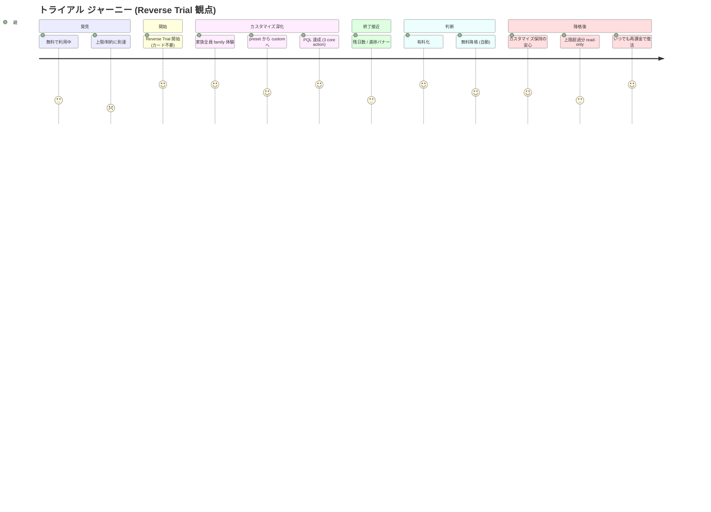
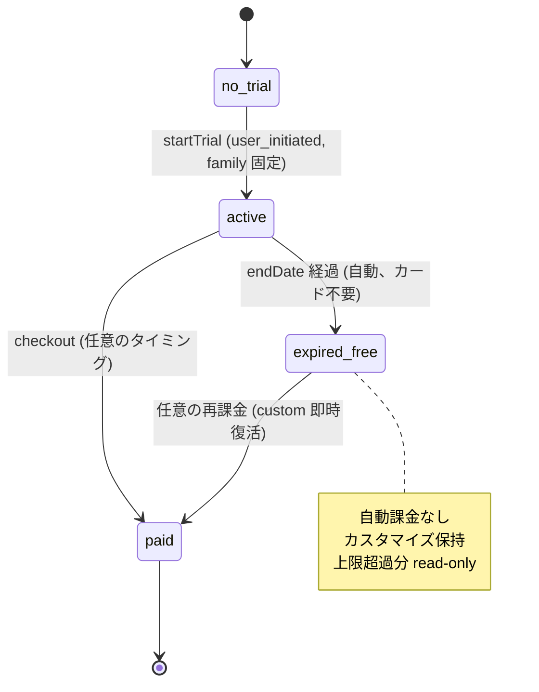
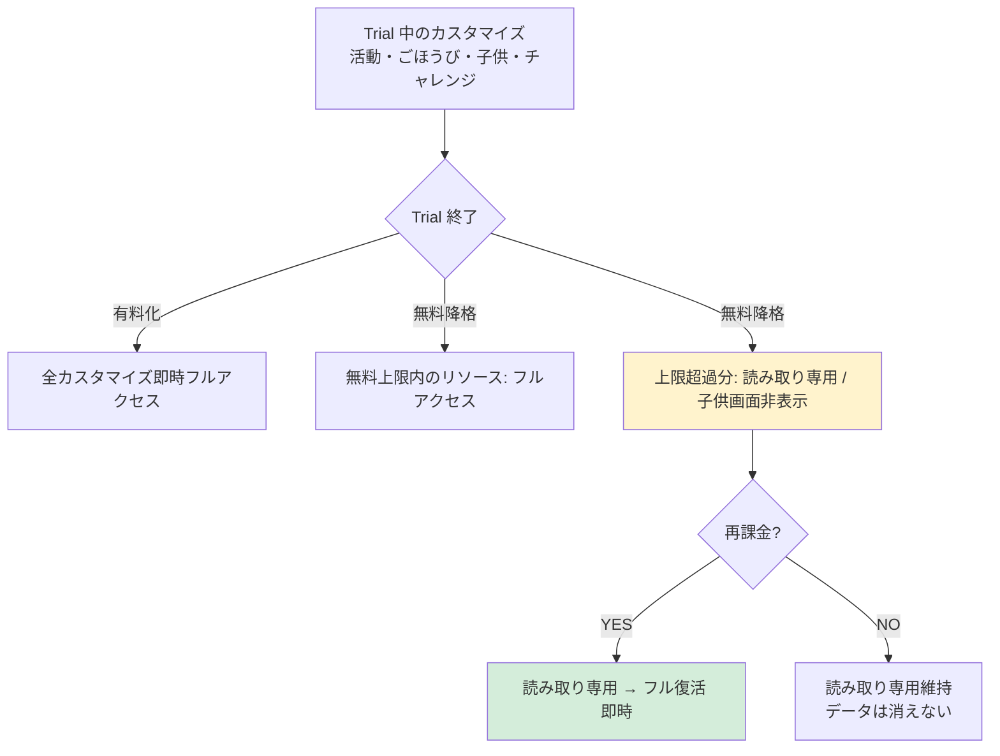

# トライアル ジャーニーマップ (#2547 / Epic #2525 Phase 2 UX) — Reverse Trial 観点で全面再構成

| 項目 | 内容 |
|------|------|
| 孫 issue | #2547 (トライアルのジャーニー) |
| 親 | #2527 (Phase 2 UX) / 上位 #2525 |
| ステータス | **2026-05-28 全面再構成**: 業界呼称「**Reverse Trial**」確定 + カスタマイズ持続型を価値訴求の中心に + mermaid 3 図 |
| 対応 Phase 1 要件 | phase1-trial-requirements.md (#2533: family 固定・7日・カード登録なし・cancel で無料復帰・1回制限 family-tenant) |
| deep-research | Reverse Trial 業界事例 (Notion/Slack/Figma/Canva/Calendly) + PLG ベストプラクティス + ADR-0012 整合性検証完了 |
| URL/コンポーネント命名 | `/admin/license` → `/admin/subscription` rename (Phase 7 実装予定、[phase1-naming-url-integrity-requirements.md](phase1-naming-url-integrity-requirements.md) 参照)。本ジャーニー内では設計指針は新名、既存実装 reference は現名を維持 |
| プラン命名 + 課金期間 | `family` → **`プレミアム`** rename / trial **プレミアム固定 7 日** (旧 family 固定 rename のみ) / **月額のみ (年額廃止)** (Phase 7 実装予定、[phase1-plan-naming-pricing-axis-requirements.md](phase1-plan-naming-pricing-axis-requirements.md) 参照)。本ジャーニー内では表示は新名、内部識別子 (`DEFAULT_TRIAL_TIER='family'` / `tier='family'` / `family-tenant 単位`) は現名維持 |

> **`premium` 階層 signal 打消** (本 PR scope、refs #2594 D-2):
> `premium` は機能本格度を示す signal であり、**無料プランへの exclusion 意図なし**。LP コピー (Phase 4 実装) で `FREE_PLAN_TERMS.forever` (永久無料) / `FREE_TERMS.start` (まずは無料) 等を併記し、階層 signal を構造的に打消す verification を Phase 4 移行 gate に含める。

## 業界呼称の確定: Reverse Trial (リバーストライアル)

がんばりクエストのトライアルは業界用語で **Reverse Trial** に該当する。定義 (ProdPad / Elena Verna / OpenView 一貫):

> "ユーザーに有料機能フルアクセスを期間限定で与え、終了時に**機能制限のあるフリープランへ自動降格**するモデル"

**Reverse Trial の 4 核要素** (ProdPad):

1. **No credit card required** — カード登録不要
2. **Automatic downgrade** — 自動的にフリーへ降格 (アクセス遮断ではない)
3. **Data persistence** — 作成リソース・データはフリープランで保持
4. **Full feature access initially** — 初日から有料機能 100% 解放

→ がんばりクエストは **4 要素全てを満たす標準的 Reverse Trial** (命名上の独自性なし、既存プレイブック参照可)。

### 通常 Free Trial / Freemium との峻別

| | Reverse Trial (本プロダクト) | 通常 Free Trial | Freemium |
|---|---|---|---|
| 開始時 | 有料機能フル | 有料機能フル | 無料機能のみ |
| 終了時 | 自動でフリーへ降格 | アクセス遮断 or 自動課金 | 終了概念なし |
| カード登録 | 不要 (opt-in) | 必要 (opt-out 主流) | 不要 |
| データ | 持続 | 削除 or アクセス不可 | 持続 |
| FTC/特商法リスク | 低 (dark pattern 構造的回避) | 高 (ABCmouse 反面教師) | なし |

## 価値訴求の中心: カスタマイズ持続性 (PO 戦略)

**汎用マーケットプレイスプリセット**では各家庭の実態と合わない → **カスタマイズ深化が課金 hook**。トライアル中に追加・変更したカスタマイズは無料降格後も**保持**される (Stripe 非経由・trial_history テーブル・データは tenant 紐づきで削除なし)。

理論上「7-14 日で完璧カスタマイズすれば無料でも困らない」が、現実 100 点は困難 = 有料動機が継続的に発生 = 課金導線。この戦略は **Reverse Trial の sticky feature 理論と完全一致** (OpenView)。

## ジャーニー (Reverse Trial プレイブック整合)

### mermaid 図 1: 感情曲線 (journey)

### mermaid 図 2: トライアル状態遷移 (stateDiagram)

### mermaid 図 3: 降格時のリソース扱い (flowchart、Notion 型 read-only モデル提案)

## ジャーニー詳細表

| # | ステップ | 既存実装 + Reverse Trial BP | 親の体験 | 感情 | 谷/山 |
|---|---|---|---|---|---|
| 0 | 無料利用中・上限到達 | feature gate (`plan-limit-service`) | 子供3人目/活動4つ目で gate | 物足りない | — |
| 1 | **Reverse Trial 開始** | `startTrial(user_initiated, tier='family')` (trial_history、Stripe 非経由、カード不要) | 「7日間 family を試す・カード不要」 | 安心 (勝手に課金されない) | — |
| 2 | **family フル体験 + aha** (BP5 sticky paid feature) | `resolveFullPlanTier` = family、子供無制限・全機能解放 | **家族全員の見守り画面 を初体験** | 歓喜 ← **中間山 (aha moment)** | **中間山** |
| 3 | カスタマイズ深化 (preset → custom) | マーケットプレイス推奨を採用 → 各家庭で活動・ごほうび編集 | 家庭独自の活動セット形成 | 主体感・愛着 | — |
| 4 | **PQL 達成** (BP2、3 core action: 子供登録 / 活動カスタマイズ / ごほうび設定 各 1 件以上) | 既存実装で計測可能 (analytics 層) | 「家庭仕様で動き出した」 | 達成感 | — |
| 5 | 終了接近 (BP4 進捗フレーミング) | `TrialBanner` daysRemaining 静的1件 | 「家族仕様化まであと N 件」(残日数より進捗) | 検討 | 谷① (軽い) |
| 6a | **有料化** | Phase 1 checkout (standard/family 併置) | 申込 → カスタマイズ即時フル維持 | 決断 ← 最終山 (paid) | — |
| 6b | **自動無料降格** | `endDate >= today` 自動 (cancel 不要) | 自動で無料へ、カスタマイズ保持 | 安心 ← 最終山 (free) | — |
| 7 | 降格後の読み取り専用 (BP4 Notion 型) | 上限超過分は子供画面非表示 + 親画面で read-only + 「上位プランで再開」CTA | 「データは消えていない」 | 信頼 | — |
| 8 | いつでも再課金で復活 (BP5) | 再 checkout で全カスタマイズ即時復活 | 「設定をやり直す必要がない」 | LTV ↑ | — |

## 感情曲線と Reverse Trial プレイブックの対応

### 中間山 #2 (家族全員 family 体験 = aha moment)

**Reverse Trial の成否は paid feature が sticky か** (OpenView)。がんばりクエストの最 sticky 候補 = **家族全員の見守り画面**。これを trial 1-2 日目で必ず体験させる導線が要 (Phase 3 UI で前面化)。

### 中間山 #4 (PQL 達成)

**PQL = 3 core action 完了したユーザー、conversion の最強予測指標** (Focused Chaos)。がんばりクエストの PQL 候補: (a) 子供登録 1 件 (b) 活動カスタマイズ or 追加 1 件 (c) ごほうび設定 1 件。**analytics 層に組込み** (follow-up)。

### 谷① #5 (終了接近、loss aversion を「資産保護」型で)

**「あと N 日!」型煽りは Anti-engagement (ADR-0012) 違反**。代わりに進捗フレーミング:「あなたの家庭仕様まであと 3 ステップ」「お子さま 2 人目の活動セット未設定」(Calendly モデルを煽らない方向で応用)。

### 最終山 #6b (無料降格でも安心)

**「降格は save moment として設計、無音で機能を消さない」** (Userpilot)。降格 24h 前 + 当日 + 3 日後の 3 タッチ、メール 1 件 (子供画面ゼロ通知、ADR-0012 整合)。文言は「あなたが trial 中に作った活動 12 件、無料では 3 件のみ子供画面に配信されます。残り 9 件は保護されたまま、いつでも再有効化できます」型 (具体カウント + 「消えない」明示)。

## 既存実装と Reverse Trial プレイブックの整合性

| 4 核要素 | がんばりクエスト既存実装 | 評価 |
|---|---|---|
| No credit card | trial_history ベース、Stripe 非経由 | ✅ 完全整合 |
| Automatic downgrade | `endDate >= today` で自動 isActive=false | ✅ 完全整合 |
| Data persistence | trial 中作成リソースは tenant 紐づきで保持 (削除なし) | ✅ 完全整合 (ただし「上限超過分の扱い」は仕様未明文化、後述 follow-up) |
| Full feature access | family tier 解決、子供無制限・全機能 | ✅ 完全整合 |

## ペルソナ別の UX レビュー観点 (家族構成 + カスタマイズ態度)

- **1 人っ子家庭 (standard 検討者)**: family 体験は過剰 → family aha でなく standard 機能差分を示す導線必要 / トライアル後 standard ダウンセル動線
- **兄弟複数家庭 (family ターゲット)**: 中間山 #2 (家族全員見守り) が刺さる / 第 2 子・第 3 子展開の段階的 onboarding (BP3 Behavior-based)
- **「自分で組みたい派」**: カスタマイズ深度で sticky / preset → custom の進捗を見せる
- **「自動登録派」**: マーケットプレイス自動採用で aha 高速到達 / 「家庭仕様」を体感させる工夫が必要
- **卒業期 (高校生親)**: 子供本人主導 / 卒業前提でも trial 中の "成長記録蓄積" が価値

## 既存からの変更点 (delta)

| # | 既存 | 要件 | 扱い |
|---|---|---|---|
| 1 | `DEFAULT_TRIAL_TIER='standard'` (trial-service.ts:12) | **family 固定** | 変更 (sticky paid feature 最大化) |
| 2 | `?plan=X` signup 時自動開始 | 撤去 (任意タイミング、gate / プラン画面から) | 変更 (新規申込ジャーニー整合) |
| 3 | 1回制限 = `user_initiated` + `trialUsed` (tenant 単位) | family-tenant 単位 | 既存と同一 (確認のみ) |
| 4 | 自動無料降格 (cancel 不要・自動課金なし) | 維持 | ✅ Reverse Trial の核 |
| 5 | データ持続 (trial 中作成リソース保持) | 維持 + **上限超過分の扱い明文化** | 新規 ADR 候補 (Notion 型 read-only 推奨) |
| 6 | TrialBanner 残日数表示 | 進捗フレーミング併用 | Phase 3 UI |
| 7 | PQL 計測 | 新規 (BP2、analytics 層) | follow-up Issue |

## Open question (PO 判断) + deep-research 推奨 follow-up

| # | 論点 | 推奨 / 状態 |
|---|------|-----------|
| 1 | **trial 期間 7 日 → 14 日 A/B 検討** | 業界 sweet spot 14 日、家族で週末 2 回挟める。`TRIAL_TERMS.duration` atom 1 行変更で SSOT 伝播 (Pre-PMF Bucket A 候補) |
| 2 | **降格時の上限超過分の扱い** | Notion 型 (read-only)・Figma 型 (lock)・Canva 型 (watermark) の 3 案。**Notion 型 read-only 推奨** (家庭向け・子供画面非表示で Anti-engagement 整合)。ADR 化候補 |
| 3 | **「カスタマイズは消えない」LP 訴求** | hero 直下 1 行追加検討 (例: 「無料に戻っても、家族のカスタマイズはそのまま残ります」)。ADR-0013 LP truth 整合確認必要 (実装の事実) |
| 4 | **PQL = 3 core action 計測** | analytics 層に組込み (BP2) follow-up Issue |
| 5 | **季節性コンテンツ更新メカニズム** | マーケットプレイス更新頻度が「現実 100 点を防ぐ」最大の武器 (Bucket A 候補) |
| 6 | trial 中の sticky paid feature ハイライト動線 | Phase 3 UI で家族全員見守り画面を 1-2 日目に必ず体験させる |

## ADR-0012 Anti-engagement との整合性 (最終評価)

| Anti-engagement 原則 | Reverse Trial 設計での扱い | 整合 |
|---|---|---|
| 子供 UI に課金圧をかけない | 子供画面に trial / 課金 UI 一切出さず、保護者画面のみ | ✅ |
| 滞在時間 = 価値毀損 | trial 中も loop は「記録 → 数秒で閉じる」、終了演出も子供側ゼロ | ✅ |
| サプライズ濫用禁止 | 降格 24h 前 + 当日 + 3 日後の 3 タッチ、メール 1 件 | ✅ |
| 通知連打禁止 | 上記 3 タッチ + Push 不使用 | ✅ |
| 連続ガチャ / 煽り禁止 | 「失う恐怖」型コピー不使用、「保護される」「いつでも戻せる」型に統一 | ✅ |
| 販促文言審査 | 「カード不要 + 自動無料降格 + データ保持」を**家族尊重主張**として打ち出す | ✅ |

→ **Reverse Trial は ADR-0012 と本質的に整合** (loss aversion を「資産保護」フレーミングで使う限り)。

## 想定リスク (PO 戦略の弱点と緩和策)

| リスク | 概要 | 緩和策 |
|---|---|---|
| 真面目家庭の trial 完璧化 → 無料定着 | 教育意識高い家庭は 7-14 日で完璧化、ARPU 押し下げ | 季節性アップデート / コンテンツ供給で「100 点を陳腐化」させる継続価値 |
| 7 日で家族全員試せず体験浅い → 降格時 loss aversion 効かず churn | 一度も触らない子供がいる家庭で降格してもダメージ感ゼロ | 14 日延長 + 「家族全員 onboarding 達成」での trial 延長候補 (BP3 段階的 onboarding) |
| family 固定 → standard 十分な家庭の期待値ズレ | trial 後 standard 検討者が family 機能 loss を「失った」と誤認 | trial 中の sticky 機能を **standard 残存 / family 限定**で視覚分離 (Phase 3 UI) |
| FTC / 特商法 dark pattern | 課金復活時の同意取得 / cancel UI 不備 | ABCmouse 反面教師 / Parent-Gate Session (ADR-0050) で家庭内 UX 担保 |
| Reverse Trial 業界比 conversion 25% 未達 | sticky paid feature 探索失敗、freeloader 化 | PQL 計測 + 低 PQL ユーザに onboarding 強化 |

## 根拠

- **業界呼称・プレイブック (deep-research 2026-05-28)**:
  - ProdPad Glossary "Reverse Trial" (4 核要素定義)
  - Elena Verna (Amplitude) / OpenView (Kyle Poyar) "Your Guide to Reverse Trials"
  - 事例: Notion (`notion.com/help/plan-downgrade`)、Slack (`slack.com/help/articles/202878523`)、Figma (`help.figma.com/hc/en-us/articles/360046216313`)、Canva (`canva.com/help/watermarks-design`)、Calendly (Userpilot)
  - PLG ベンチマーク: Stackmatix / Focused Chaos / Heap / Ordway Labs / Cleverbridge
  - 規制反面教師: FTC vs ABCmouse (2021 dark pattern enforcement)
- **既存実装 (Explore 照合)**: `trial-service.ts` (trial_history・1回限り・自動無料復帰) / `TrialBanner.svelte` / `plan-limit-service` (feature gate) / マーケットプレイス自動採用 (`setup/packs:120-142`)
- Phase 1 phase1-trial-requirements.md (#2533) / phase1-checkout (standard/family 併置) / phase1-legal (自動課金なし整合) / phase1-data-lifecycle (削除しない)
- ADR-0012 (Anti-engagement) / ADR-0010 (Pre-PMF) / ADR-0013 (LP truth) / ADR-0045 (terms/labels SSOT) / ADR-0050 (Parent-Gate)
