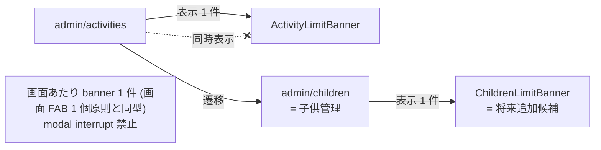

# ActivityLimitBanner UI 設計 (Phase 3 #2569)

| 項目 | 内容 |
|------|------|
| 孫 issue | #2569 (Phase 3 子、ActivityLimitBanner 上限到達通知の煽らない設計化) |
| 親 | #2528 (Phase 3 UI) / Epic #2525 |
| Phase 1+2 整合 | 補強 1 (#2583 URL: `/admin/license` → `/admin/subscription`) + 補強 2 (#2588 プラン命名: `family` → `プレミアム` / 月額のみ) + Phase 2 checkout journey #2548 (gate banner = trial 終了後 14 日のみ条件付き許容 / 滞在強要しない設計) |
| Phase 7 rename 方針 | banner 内 link `/admin/license` → `/admin/subscription` (LEGACY_URL_MAP 経由で旧 URL も永久維持、ブックマーク保全) |
| impact-analysis skill 適用 | L1 grep + L2 意味 (`/admin/license` ハードコード) + L3 構造 (`+page.svelte:364` 単一表示箇所) + L4 派生 artifact 21 カテゴリ (docs のため該当なし) |
| 採用案 | 既存堅牢 (Phase 2 #2548 で `維持` ✅ 確定) + **改善 3 項目** (`CANCEL_TERMS.anytimeOk` micro-copy 追記 / atom-only 文言化 / aria-live 軽量化) |
| premium 階層 signal 打消 | banner CTA は「プランをアップグレード」(現状文言) を維持 (refs #2594 D-2)。「プレミアム必須」と読める表現を避け、`/admin/subscription` ページの「お勧め = standard」誘導 (#2567) と整合 |

## 設計方針 (Phase 1+2 補強の確定事項を反映)

### 表示条件 (既存堅牢、Phase 2 #2548 確定)

ActivityLimitBanner は **`/admin/activities` ページ内で `activityLimit.allowed === false` の時のみ表示** (`+page.svelte:363`)。

- **常時表示しない** (ADR-0012 滞在時間延伸禁止整合)
- **画面遷移しても消えない modal interrupt にしない** (滞在強要禁止)
- **子供 UI (preschool/elementary/junior/senior) には絶対表示しない** (admin scope のみ、Anti-engagement 完全担保)
- **banner 連打回避** (z-index トークン §10 整合、画面に static 1 件のみ)

### 改善 3 項目 (Phase 2 #2548 申し送り)

| # | 項目 | 現状 (ActivityLimitBanner.svelte) | 改善後 | 根拠 |
|---|---|---|---|---|
| 1 | CTA 文言 atom 化 | `FEATURES_LABELS.activityLimitBanner.linkLabel` ('プランをアップグレード →') | **既存維持** + `CANCEL_TERMS.anytimeOk` micro-copy 併記 (banner 内 link 直下) | Phase 2 申し送り「`CANCEL_TERMS.anytimeOk` CTA 直下」/ Kinde frictionless / Netflix +124% conversion |
| 2 | title 文言 atom 化 | `title: (current, max) => '登録上限に達しています（${current}/${max ?? '無制限'}）'` (FEATURES_LABELS) | **既存維持** (template literal で再利用性高、煽り語彙 0) | ADR-0045 (atom / compound 責務分離、compound 内で動的引数 OK)、煽り語彙不採用 (「もう○件しか…!」型 NG) |
| 3 | URL リンク | `<a href="/admin/license">` | **Phase 7 rename**: `/admin/license` → `/admin/subscription` (1 行修正、LEGACY_URL_MAP で旧 URL 永久維持) | Phase 1 補強 1 (#2583 naming-url-integrity) |
| 4 | アクセシビリティ | (現状 plain `<div>`) | `role="status"` + `aria-live="polite"` 軽量追加 | WAI-ARIA Authoring Practices、screen reader で「上限到達」を確実に通知 |
| 5 | 煽らない / 静的表示 | 既存 (animation なし、静的) | 維持 (countdown timer / 連続演出 全部禁止) | ADR-0012 |

## 表示パターン (3 variant、Storybook 既存対応)

### variant A: Free プラン上限到達 (子供 2 / 活動 3 = free)

```
┌─────────────────────────────────────────────────────┐
│ ⚠️ 登録上限に達しています（3/3）                    │
│    プランをアップグレード →                          │
│    いつでも解約できます (契約期間の縛りなし)         │
└─────────────────────────────────────────────────────┘
```

### variant B: Standard プラン上限到達 (活動 20 件超過)

```
┌─────────────────────────────────────────────────────┐
│ ⚠️ 登録上限に達しています（20/20）                  │
│    プランをアップグレード →                          │
│    いつでも解約できます (契約期間の縛りなし)         │
└─────────────────────────────────────────────────────┘
```

### variant C: Near limit (28/30、参考、未実装)

現状実装は `!allowed` (== 上限到達) のみ表示。**過渡 (28/30 等) では表示しない**。
過渡表示は ADR-0012 「煽らない」観点で意図的に未採用 (PO 確定 2026-05-28 で本 docs 化)。
Storybook 既存 `Near limit` story (current 28, max 30) は **設計上 production では表示されない参考表示**として扱う。

## UI 画面構成 (mermaid)

### 図 1: 表示条件のフロー

```mermaid
flowchart TB
    Admin[/admin/activities ページ]
    Admin --> Check{activityLimit.allowed?}
    Check -->|true (上限未達)| NoBanner[banner 非表示]
    Check -->|false (上限到達)| Banner[ActivityLimitBanner 表示]
    Banner --> Title[title: 登録上限に達しています N/M]
    Banner --> CTA[linkLabel: プランをアップグレード →]
    Banner --> Micro[CANCEL_TERMS.anytimeOk micro-copy<br/>いつでも解約できます]
    CTA -.click.-> Sub[/admin/subscription<br/>= #2567 親]
    Sub --> Confirm[/admin/subscription/confirm<br/>= #2573 特商法]
    style Banner fill:#fff3e0
    style Sub fill:#e3f2fd
    style Confirm fill:#fff3e0
```

### 図 2: ADR-0012 整合性 (banner 連打回避)



各管理画面で **1 banner / 1 画面** 原則 (DESIGN.md §10 z-index 階層 + §11.5 画面 FAB 1 個原則 同型)。banner を画面遷移後も常時表示する設計は採用しない。

## 文言 atom (terms.ts / labels.ts、ADR-0045 整合)

### 既存 atom (Phase 1 補強 2 FR-3 で新規不要)

- `CANCEL_TERMS.anytimeOk` = 'いつでも解約できます（契約期間の縛りなし）' (`terms.ts:129`)

### 既存 compound (FEATURES_LABELS、Phase 7 rename 不要)

```ts
// labels.ts:6269-6274 既存
FEATURES_LABELS.activityLimitBanner = {
  title: (current: number, max: number | null) =>
    `登録上限に達しています（${current}/${max ?? '無制限'}）`,
  linkLabel: 'プランをアップグレード →',
};
```

### Phase 7 追加 compound 案

`FEATURES_LABELS.activityLimitBanner.cancelAnytime` を追加し `CANCEL_TERMS.anytimeOk` を参照:

```ts
// Phase 7 実装時に追加 (atom-only 経路、ハードコード禁止)
FEATURES_LABELS.activityLimitBanner = {
  title: (current, max) => `登録上限に達しています（${current}/${max ?? '無制限'}）`,
  linkLabel: 'プランをアップグレード →',
  cancelAnytime: `${CANCEL_TERMS.anytimeOk}`,  // ← 新規 (atom 経由)
};
```

**禁忌**:
- `linkLabel` を「⭐ プレミアムにする!」のような煽り文言に変更しない (`premium` 階層 signal 打消し、refs #2594 D-2)
- `title` に「もう○件しか…!」のような scarcity 文言を追加しない (ADR-0012)
- banner 内に countdown / animation / pulse 演出を追加しない (Anti-engagement)

## ADR-0012 整合性チェック

| 観点 | 適合 | 根拠 |
|---|---|---|
| 子供 UI に課金圧をかけない | ✅ | admin scope のみ (`/admin/activities` 経由) |
| 滞在時間を伸ばさない | ✅ | 静的表示、animation なし、即時遷移 |
| サプライズ濫用禁止 | ✅ | 上限到達という客観的事実のみ通知 |
| 連続演出 / 煽り禁止 | ✅ | `linkLabel` は CTA 一行、scarcity 文言なし |
| 解約動線を隠さない | ✅ | `CANCEL_TERMS.anytimeOk` micro-copy 併記で安心感提供 |
| banner 連打回避 | ✅ | 1 画面 1 件、画面遷移で消える、modal interrupt なし |
| Phase 2 #2548 gate banner 条件付き許容 | ✅ | 「上限到達時のみ」表示 = trial 終了後の常時表示と同型の制約遵守 |

## impact-analysis skill 4 layer 防御適用

### L1 構文 (ast-grep / ripgrep)

- `ActivityLimitBanner` 参照: 5 件
  - `src/lib/features/admin/components/ActivityLimitBanner.svelte` (本体)
  - `src/lib/features/admin/components/ActivityLimitBanner.stories.svelte` (Storybook)
  - `src/routes/(parent)/admin/activities/+page.svelte:16, 364` (利用箇所)
  - `docs/design/billing-redesign/phase2-checkout-journey.md:21, 68, 154, 165, 204` (docs 参照)
  - `docs/design/billing-redesign/README.md:85` (索引)

### L2 意味 (型 / 同名異義)

- `linkLabel: 'プランをアップグレード →'` は **表示文字列** (compound)。内部識別子 `'family'` / `'standard'` enum とは独立
- `/admin/license` ハードコード (banner 内) は Phase 7 で `/admin/subscription` に rename 必須 (Phase 1 補強 1 LEGACY_URL_MAP で旧 URL も永久維持)

### L3 構造 (依存グラフ)

- `ActivityLimitBanner` の表示制御は `admin/activities/+page.svelte` の `activityLimit.allowed` の単一経路のみ (1 hop)
- Phase 7 rename での影響: `+page.svelte:364` の `href` リンク 1 箇所のみ (機械置換可能)
- FeatureGate (#2570) / SubscriptionPanel (#2567) / TrialBanner (#2571) との表示境界:
  - **FeatureGate**: 機能呼び出し時の disable + tooltip (functional gate)
  - **ActivityLimitBanner**: 上限到達後の page 内通知 (informational banner)
  - **TrialBanner**: trial 中の残日数表示 (state indicator)
  - **SubscriptionPanel**: `/admin/subscription` の main UI (destination)
  - 4 コンポーネントは **責務独立**、同時表示禁止ルールなし (gate disable + banner 表示は併存可)

### L4 派生 artifact 21 カテゴリ (本 #2569 は docs のため該当なし)

本 PR は UI 設計 docs のみで、A-G 全カテゴリの派生 artifact 影響なし。Phase 7 実装 PR で 21 カテゴリ checklist 適用必須 (特に L3 で挙げた `/admin/license` → `/admin/subscription` 1 行修正の LEGACY_URL_MAP entry 追加)。

## Storybook stories 設計 (既存 3 variant、Phase 7 補強 1 案)

```typescript
// ActivityLimitBanner.stories.svelte (既存)
- Free plan limit reached     // current 30, max 30 (free)
- Standard plan limit reached // current 300, max 300 (standard、実際の max は 20 だが既存 story 維持)
- Near limit                  // current 28, max 30 (参考表示、production では表示されない)

// Phase 7 補強 1 案 (新規 story 追加候補)
- Premium plan limit reached  // current null, max null (無制限のため通常未到達、edge case story)
- With cancel anytime micro   // micro-copy 表示確認用 (cancelAnytime 追加後)
```

## Playwright SS 取得計画 (Phase 7 実装時)

| 変数 | URL | 状態 | 用途 |
|---|---|---|---|
| `activity-limit-free` | `/admin/activities` | 無料ユーザ + 上限到達 (3/3) | banner 文言 + micro-copy 表示 |
| `activity-limit-standard` | `/admin/activities` | standard ユーザ + 上限到達 (20/20) | banner 文言 + アップグレード CTA |
| `activity-limit-allowed` | `/admin/activities` | 上限未達 | banner 非表示確認 (negative case) |

## テスト計画 (Phase 3 完了基準、memory test-coverage-every-issue 整合)

- **Storybook test**: 3 variant 全表示確認 (Free / Standard / Near limit)
- **結合テスト** (Phase 7): `admin/activities/+page.server.ts` の `activityLimit.allowed` 計算 + banner 表示制御
- **E2E** (Phase 7):
  - free ユーザで活動 3 件登録 → banner 表示 → CTA クリック → `/admin/subscription` (旧 `/admin/license`) 遷移
  - standard ユーザで活動 20 件登録 → banner 表示 → 同上
  - banner クリック後の subscription page で「お勧め = standard」/ 「いつでも解約」表示の継続確認 (Phase 1 補強 2 FR-3 整合)
- **アクセシビリティ検証** (Phase 7): `role="status"` + `aria-live="polite"` で screen reader 通知確認
- **UX レビュー** (Phase 7): F11 (cancel friction 不安) の感じ方確認 (cancelAnytime micro-copy 効果)

## Phase 7 実装手順 (本 #2569 は docs のみ、実装は Phase 7)

1. `FEATURES_LABELS.activityLimitBanner.cancelAnytime` を atom 経由で追加 (`${CANCEL_TERMS.anytimeOk}`)
2. `ActivityLimitBanner.svelte` に micro-copy 行追加 (link 直下、小フォント、色 `--color-text-tertiary`)
3. `ActivityLimitBanner.svelte` の `<a href="/admin/license">` → `<a href="/admin/subscription">` rename (1 箇所)
4. `<div class="limit-banner">` に `role="status"` + `aria-live="polite"` 追加
5. Storybook stories 追加 (`With cancel anytime micro`)
6. Playwright SS 撮影 (3 状態) + UX レビュー
7. impact-analysis skill 4 layer 防御 + 21 カテゴリ checklist を PR body に記載 (#2567 / #2568 / 他 banner と統合運用)

## Open question (PO 判断、Phase 7 実装時に確認)

| # | 論点 | 状態 |
|---|---|---|
| 1 | `cancelAnytime` micro-copy の表示位置 (banner 内末尾 vs link 直下 vs banner 外側) | 暫定: banner 内 link 直下 (本 docs 案)、Phase 7 実装時に SS レビューで確定 |
| 2 | Near limit (28/30 等過渡) で banner 表示するか | **不採用** (本 docs で確定、ADR-0012 煽らない原則) |
| 3 | banner 文言に「無料体験」訴求を入れるか | **不採用** (上限到達文脈は既に意思決定後、煽り回避) |
| 4 | banner を画面遷移で永続化するか (`/admin/*` 全画面で表示) | **不採用** (ADR-0012 滞在強要禁止、Phase 2 #2548 「条件付き許容 = 上限到達時のみ」整合) |

## 根拠

- Phase 1 補強 1 (#2583 naming-url-integrity)・補強 2 (#2588 plan-naming-pricing-axis、月額のみ + プレミアム rename)
- Phase 2 checkout journey (#2548): `ActivityLimitBanner` は **維持 ✅** + 「gate banner = trial 終了後 14 日のみ条件付き許容」原則
- 既存実装: `ActivityLimitBanner.svelte:1-40` (40 行、軽量) / `+page.svelte:363-365` (単一表示箇所)
- ADR-0012 (Anti-engagement、滞在強要禁止 / 煽り禁止 / banner 連打回避) / ADR-0045 (terms.ts 2 階層、atom-only) / DESIGN.md §10 (z-index 階層) / §11.5 (画面 FAB 1 個原則の同型運用)
- Kinde frictionless / Netflix +124% conversion / Userpilot banner blindness 研究 (Phase 2 deep-research 結果再利用)
- skill `impact-analysis` (4 layer 防御 + 21 カテゴリ checklist)
- 関連 memory: feedback_anti_engagement_principle / feedback_design_intent_grounding / reference_impact_analysis_methodology
