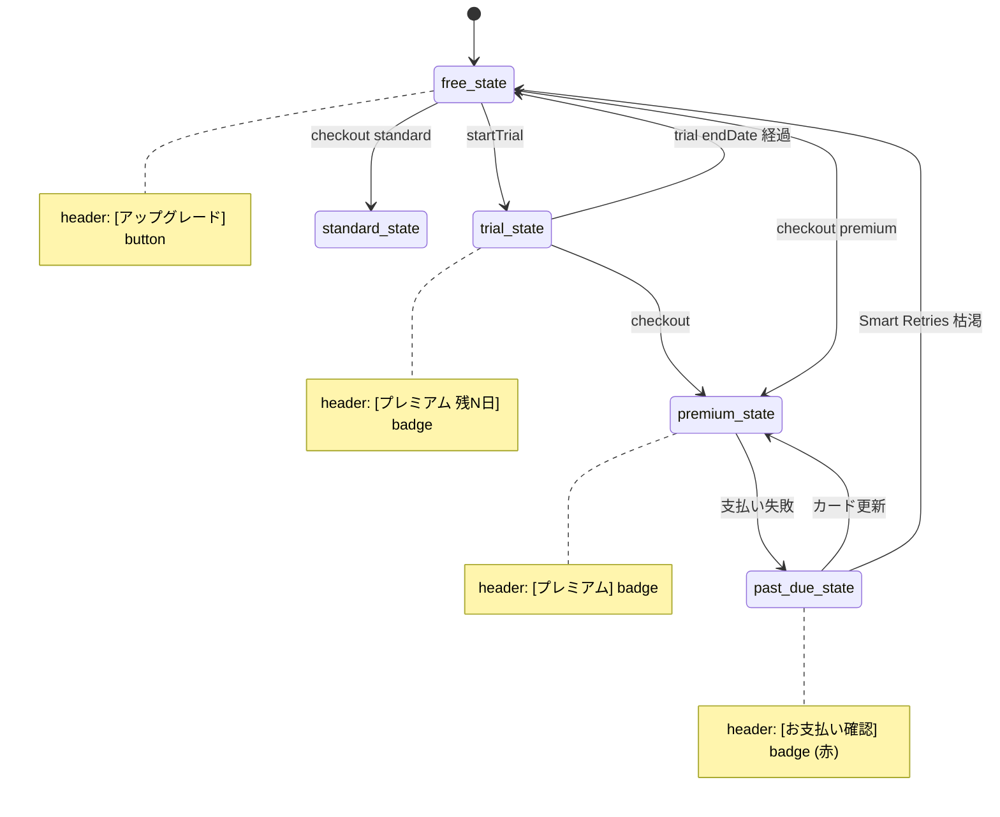
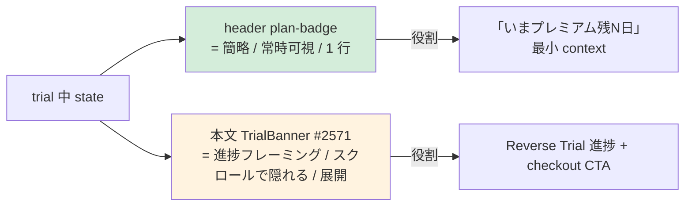

# AdminLayout header UI 設計 (Phase 3 #2568)

| 項目 | 内容 |
|------|------|
| 孫 issue | #2568 (Phase 3 子、AdminLayout header `plan-badge` クリック遷移 + trial 残日数表示 + 子供画面非表示担保) |
| 親 | #2528 (Phase 3 UI) / Epic #2525 |
| Phase 1+2 整合 | 補強 1 (#2583 URL `/admin/subscription`) + 補強 2 (#2588 プラン命名「プレミアム」/ 月額のみ / ROI framing V1-V5) + Phase 2 補強 (#2585 URL / #2596 プラン命名) |
| Phase 2 既出ジャーニー | [phase2-checkout-journey.md L156 / L195](phase2-checkout-journey.md) — 「ヘッダ有料時 plan-badge にクリック遷移追加、Phase 3 UI で小修正 (PO 提案 2 採用)」確定済 |
| Phase 7 rename 方針 | `/admin/license` → `/admin/subscription` / `family` → `プレミアム` (atom 1 行) / 月額のみ (年額廃止) |
| impact-analysis skill 適用 | L1 grep + L2 意味 (`isPremium` boolean vs `planTier` enum) + L3 構造 (`AdminLayout.svelte:212-220` 既存) + L4 派生 artifact 21 カテゴリ (docs のため該当なし) |
| 採用案 | 業界整合「admin global nav に 1 要素として常時 plan 表示 + クリック遷移」(Linear / Notion / Slack / Stripe Customer Portal 整合) |
| 既存 SSOT との関係 | TrialBanner (#2571) との重複回避 = header は 1 行残日数のみ (簡略)、TrialBanner は本文上部に進捗フレーミング展開 |
| `premium` 階層 signal 打消 | header の plan-badge は「プレミアム = 上位選択肢の signal」を控えめに視覚化し、無料・standard 利用者に対し**プラン名表示 = 階層差別**にならないよう色とサイズで配慮。LP コピー (`FREE_PLAN_TERMS.forever` 等) と連動して「無料が排除されている印象を与えない」設計を貫徹 (refs #2594 D-2) |

## 設計背景 (なぜこの設計が必要か)

### 現状実装の構造的不整合 (`AdminLayout.svelte:212-220`)

```svelte
{#if !isDemo && !isAnonymousLambda && !isPremium}
  <a href="{basePath}/license" class="upgrade-btn" data-tutorial="upgrade-btn">
    {FEATURES_LABELS.adminLayout.upgradeBtn}    {/* = 'アップグレード' */}
  </a>
{:else if !isDemo && !isAnonymousLambda && isPremium}
  <span class="plan-badge plan-badge--{planTier}">{planLabel}</span>
  {/* ← クリック不可、遷移なし */}
{/if}
```

**問題 1**: 有料時 (`isPremium === true`) の `<span class="plan-badge">` はクリック不可。プラン管理画面 (`/admin/license` → Phase 7 で `/admin/subscription`) への到達手段が**フッター link や設定メニュー深部に依存**し、Hick's Law / Fitts's Law 観点で発見性が低い。

**問題 2**: trial 中 (`planTier === 'family' && isPremium === true && 残日数あり`) でも、header は単に「ファミリー」とだけ表示し、残日数の文脈が失われる。TrialBanner (#2571) が本文上部に表示されるが、TrialBanner は本文スクロール時に画面外へ出る一方、**header は sticky で常時可視**のため、残日数の最小限の context を header にも置く価値が高い (業界事例: Notion / Linear が trial 残日数を navbar に表示)。

**問題 3**: `planTier: 'free' | 'standard' | 'family'` だが、Phase 1 補強 2 で `family` → `プレミアム` rename 確定。Phase 7 で atom rename される (`PLAN_TERMS.family` → `PLAN_TERMS.premium`)。本 UI 設計は **Phase 7 rename 後の atom 名**を前提に記述。

### なぜ「常時 plan-badge クリック遷移」が業界標準か (Phase 2 #2548 既調査結果)

[phase2-checkout-journey.md L163](phase2-checkout-journey.md) で確定:

| upgrade prompts パターン | ADR-0012 適合 | 採否 |
|---|---|---|
| **ヘッダ「現在プラン」ボタン** | ✅ 親 admin global nav 1 要素 | **採用** (既存、有料時遷移欠落改善) |

採用 SaaS (admin global nav に常時 plan 表示 + クリック遷移パターン):

- **Linear** — Settings > Workspace > Billing。navbar 隅に workspace plan tier badge 常駐
- **Notion** — Workspace name 横に「Free / Plus / Business」badge、クリックで `/settings/upgrade`
- **Slack** — Admin > Manage billing。ワークスペース名横に plan badge、クリックで billing dashboard
- **Stripe Customer Portal** — Customer Portal 自体が「常時 plan + クリックで管理」パターンの正本

**ADR-0012 整合**: 常時表示だが**静的・自発探索時のみ反応**で滞在強要しない。modal interrupt / countdown timer / 連続演出はいずれも採用しない。

## 設計方針

### 機能配置 (Phase 7 rename 後の最終形)

```
AdminLayout header (sticky, 全 /admin/* で表示)
├ [logo] [Demo badge?]
└ [plan-badge クリック可] [page-guide ❓] [子供画面へ →]
                ↓ click
            /admin/subscription  (現 /admin/license、Phase 7 rename 後)
```

子供画面 (`(child)/[uiMode]/`) は AdminLayout を一切使わない → **子供 UI に plan 表示は構造的に発生しえない** (ADR-0012 完全担保、追加防御不要)。

### state 別の header 表示パターン (5 variant)

本 UI 設計は server から `data.planTier` / `data.isPremium` / `data.trialStatus` を受けて分岐。`+layout.server.ts` 既存 SSOT。

| variant | 条件 | header 右側 表示 |
|---|---|---|
| **free** | `planTier === 'free' && !trial.isTrialActive` | `[アップグレード]` button (緑 / 既存維持) → `/admin/subscription` |
| **standard** | `planTier === 'standard' && isPremium` | `[スタンダード]` badge (紫、clickable) → `/admin/subscription` |
| **premium** | `planTier === 'premium' && isPremium && !trial.isTrialActive` | `[プレミアム]` badge (金、clickable) → `/admin/subscription` |
| **trial** | `planTier === 'premium' && isPremium && trial.isTrialActive` | `[プレミアム 残N日]` badge (金、clickable) → `/admin/subscription` |
| **past_due** | `planTier !== 'free' && trial.isPastDue` (#2551 dunning 統合) | `[お支払い確認]` badge (赤、clickable) → `/admin/billing` |

注: `trial.isPastDue` 等の derived 値は Phase 7 実装時に `+layout.server.ts` で導出。本 UI 設計は表示形式のみ確定。

## UI 画面構成 (mermaid)

### 図 1: header 右 zone の variant 分岐

```mermaid
flowchart TB
    Server[+layout.server.ts<br/>data: planTier / isPremium / trialStatus]
    Server --> Layout[AdminLayout header right zone]
    Layout --> V1[free: アップグレード button]
    Layout --> V2[standard: badge clickable]
    Layout --> V3[premium: badge clickable]
    Layout --> V4[trial: badge + 残N日 clickable]
    Layout --> V5[past_due: お支払い確認 badge clickable]
    V1 -.click.-> Sub[/admin/subscription]
    V2 -.click.-> Sub
    V3 -.click.-> Sub
    V4 -.click.-> Sub
    V5 -.click.-> Bill[/admin/billing]
    style Layout fill:#e3f2fd
    style Sub fill:#fff3e0
    style Bill fill:#fff3e0
```

### 図 2: state 遷移と header 表示の同期



### 図 3: TrialBanner (#2571) と header の役割分担 (重複回避)



**重複回避ルール**: header は **残日数 1 行のみ** (簡略)、TrialBanner は進捗フレーミング展開 (詳細)。両者は context 量の段階差で分担 (Progressive disclosure)。

## UI 設計詳細 (5 variant ASCII)

### A. free variant (planTier === 'free')

既存実装維持。`upgrade-btn` 緑系、`FEATURES_LABELS.adminLayout.upgradeBtn` = 「アップグレード」。

```
┌────────────────────────────────────────────────────────────┐
│ [Logo] [Demo?]              [アップグレード] [❓] [子供画面へ →]│
└────────────────────────────────────────────────────────────┘
  href: /admin/subscription  (Phase 7 rename 後、現 /admin/license)
```

### B. standard variant (planTier === 'standard' && isPremium)

新設: clickable badge。色は現行 `--plan-badge-bg, #f3e8ff` (紫) 維持。

```
┌────────────────────────────────────────────────────────────┐
│ [Logo]                       [スタンダード] [❓] [子供画面へ →]│
│                                ↑ clickable                  │
└────────────────────────────────────────────────────────────┘
  href: /admin/subscription   aria-label: "スタンダードプラン管理"
```

### C. premium variant (planTier === 'premium' && isPremium && !isTrialActive)

新設: clickable badge。色は現行 `--plan-badge-bg, #fef3c7` (金) 維持。Phase 7 で `.plan-badge--family` を `.plan-badge--premium` に rename。

```
┌────────────────────────────────────────────────────────────┐
│ [Logo]                       [プレミアム] [❓] [子供画面へ →]   │
│                                ↑ clickable                  │
└────────────────────────────────────────────────────────────┘
  href: /admin/subscription   aria-label: `${PLAN_FULL_TERMS.premium}管理`  # atom 経由 (ADR-0045 / B-4)
```

> **ADR-0045 atom 経由 (#2606 B-4 解消)**: 上記 `aria-label` は実装時に template literal `` `${PLAN_FULL_TERMS.premium}管理` `` で生成する。Phase 7 で `PLAN_FULL_TERMS.premium` atom (現行値 = 「プレミアム」+「プラン」連結文字列 = 業界 SaaS Plus 慣行) を 1 行修正することで全 95+ 件に自動伝播 (atom 1 行修正原則)。文字列リテラル直書きは禁止 (`check-no-plan-literals.mjs` / `check-forbidden-terms.mjs` 整合)。

### D. trial variant (planTier === 'premium' && isTrialActive)

新設: clickable badge + 残日数表示。

```
┌────────────────────────────────────────────────────────────┐
│ [Logo]                  [プレミアム 残5日] [❓] [子供画面へ →]  │
│                              ↑ clickable                    │
└────────────────────────────────────────────────────────────┘
  href: /admin/subscription   aria-label: `${PLAN_FULL_TERMS.premium}体験中 残り${trial.daysRemaining}日 (プラン管理)`  # atom 経由 (ADR-0045 / B-4)
```

**残日数表示文言**: `${PLAN_SHORT_TERMS.premium} 残${trial.daysRemaining}日` (atom 経由)。
TrialBanner (#2571) の進捗フレーミング (「あと N 日でカスタマイズが消える前にプレミアムへ」等) との重複を避け、header は**残日数 1 数値のみ**に簡略化。

**「あと N 日」型不採用の Anti-engagement 配慮**: 「残 N 日」は事実表示で、「あと N 日!」「急いで!」型の煽り文言は使わない (ADR-0012 連続演出禁止整合)。

### E. past_due variant (#2551 dunning 統合)

新設: 赤系 badge。文言は「お支払い確認」(支払い失敗を明示しない柔らかい表現)。

```
┌────────────────────────────────────────────────────────────┐
│ [Logo]                    [お支払い確認] [❓] [子供画面へ →]    │
│                              ↑ clickable, 赤系               │
└────────────────────────────────────────────────────────────┘
  href: /admin/billing   aria-label: "お支払いに関する確認事項あり (請求情報)"
```

文言「お支払い確認」: 既存 atom 流用 (`BILLING_LABELS` 既存範囲) or 新規 1 件 `BILLING_LABELS.paymentCheckBadge`。Phase 7 実装時に確定。

## 子供画面非表示の構造的担保

子供画面ルート (`(child)/[uiMode]/*`) は `(child)/+layout.svelte` を使い、`AdminLayout.svelte` を import しない。**コード構造上 plan-badge は子供画面に発生しえない**。

```mermaid
flowchart LR
    Root[+layout.svelte] --> Parent[(parent)/admin/+layout.svelte]
    Root --> Child[(child)/[uiMode]/+layout.svelte]
    Parent --> Admin[AdminLayout.svelte]
    Admin --> Badge[plan-badge クリック可能]
    Child --> ChildShell[ChildShell or 各 mode layout]
    ChildShell -.- NoAdmin[AdminLayout import なし<br/>plan-badge 発生不能]
    style Parent fill:#e3f2fd
    style Child fill:#ffebee
    style NoAdmin fill:#d4edda
```

E2E test (`tests/e2e/admin-header-plan-badge.spec.ts`、Phase 7 で追加) で `/preschool/home` / `/elementary/home` / `/junior/home` / `/senior/home` / `/baby/home` の 5 mode で `plan-badge` DOM 不在 assert (`expect(page.locator('.plan-badge')).toHaveCount(0)`)。

## 文言 atom (terms.ts/labels.ts、ADR-0045 整合)

既存 atom 流用 (Phase 1 補強 2 FR-3 で新規不要確定):

- `PLAN_TERMS.standard` / `.premium` (Phase 7 で `.family` → `.premium` rename、1 行修正で 95 件自動伝播)
- `PLAN_SHORT_LABELS.standard` / `.premium` (現行 `PLAN_SHORT_LABELS` 既存)

新規 compound (labels.ts) は `FEATURES_LABELS.adminLayout` 拡張 (既存名 space 流用):

```ts
import { PLAN_TERMS, PLAN_FULL_TERMS } from '$lib/domain/terms';

FEATURES_LABELS.adminLayout = {
  // 既存
  demoBadge: 'デモ',
  upgradeBtn: 'アップグレード',
  pageGuideTitle: 'このページの使い方',
  // ... 既存 ...

  // 本 #2568 で追加 (Phase 7 実装時) — atom 経由 (ADR-0045)
  // planFullName は呼び出し側で PLAN_FULL_TERMS.standard / .premium を渡す
  planBadgeAriaLabel: (planFullName: string) => `${planFullName}管理`,
  // PLAN_TERMS.standard / .premium (短縮形 atom) を渡す
  trialBadgeText: (planShortName: string, daysRemaining: number) =>
    `${planShortName} 残${daysRemaining}日`,
  // PLAN_FULL_TERMS.premium 等のフル atom 経由
  trialBadgeAriaLabel: (planFullName: string, daysRemaining: number) =>
    `${planFullName}体験中 残り${daysRemaining}日 (プラン管理)`,
  pastDueBadgeText: 'お支払い確認',
  pastDueBadgeAriaLabel: 'お支払いに関する確認事項あり (請求情報)',
};

// 呼び出し例 (AdminLayout.svelte):
//   <a aria-label={FEATURES_LABELS.adminLayout.planBadgeAriaLabel(PLAN_FULL_TERMS.premium)}>
//     {PLAN_TERMS.premium}
//   </a>
```

**ADR-0045 atom 経由原則 (#2606 B-4 解消)**: 上記 compound 関数は `planFullName` / `planShortName` 引数を atom (`PLAN_FULL_TERMS.*` / `PLAN_TERMS.*`) から受ける。Phase 7 で atom 1 行修正 (`PLAN_TERMS.family` → `PLAN_TERMS.premium` / `PLAN_FULL_TERMS.family` → `PLAN_FULL_TERMS.premium`) で全呼び出し箇所に自動伝播。compound 内に「スタンダード」「プレミアム」の文字列直書きは禁止。

## アクセシビリティ検証 (Phase 7 実装時に検証)

| 観点 | 検証項目 |
|---|---|
| **コントラスト比** | standard badge (紫 `#6d28d9` on `#f3e8ff`): WCAG AA 4.5:1 以上 / premium badge (金 `#92400e` on `#fef3c7`): 同 / past_due (赤系): 同 |
| **キーボードナビ** | `<a>` 要素化により Tab 順序に組み込み (現状 `<span>` は Tab 対象外、本変更で focus 可能化) |
| **focus ring** | `:focus-visible { outline: 2px solid var(--color-border-focus) }` 既存スタイル流用 |
| **aria-label** | 各 variant に `aria-label` を付与 (上記 D variant 参照)、screen reader で残日数 / 遷移先が明確に |
| **タップサイズ** | **mobile では 44px 拡張 (Phase 3 確定、#2606 B-3 解消)** — Material Design 2025 公式 minimum touch target (iOS 44pt / Android 48dp) 整合。既存 `padding: 3px 10px` (28px) は accessibility 非適合のため mobile breakpoint で `padding-block: 11px` 等で 44px に拡張。desktop は 28px 維持 (mouse hover で十分) |
| **role** | `<a>` 要素のため `role` 明示不要 (semantic) |

## ADR-0012 整合性チェック

| 観点 | 適合 |
|---|---|
| 子供 UI に課金圧をかけない | ✅ 構造的に AdminLayout は子供画面に存在しない (上記「子供画面非表示の構造的担保」) |
| 滞在時間を伸ばさない | ✅ header は静的表示、クリック時のみ即時遷移 |
| サプライズ濫用禁止 | ✅ header は state 駆動の静的表示、ポップアップなし |
| 連続演出 / 煽り禁止 | ✅ 「残 N 日」は事実表示、「急いで!」「あと N 日!」型不採用 |
| 解約動線を隠さない | ✅ クリック先 `/admin/subscription` で解約導線が controllable (Kinde frictionless) |
| 年額 sunk cost lock-in 排除 | ✅ 月額のみ (Phase 1 補強 2 FR-2 整合) |
| 階層 signal 打消 | ✅ standard / premium 利用者間で badge 色 / サイズに過剰な差なし、無料 → 「アップグレード」button のままで階層差別化を抑制 (refs #2594 D-2) |

## impact-analysis skill 4 layer 防御適用

### L1 構文 (ast-grep / ripgrep)

- 既存 `AdminLayout.svelte:212-220` の `<span class="plan-badge">` 1 箇所のみ修正対象
- `PLAN_LABELS.family` 参照: 218 件 (Phase 7 atom rename で自動伝播、本 PR の docs 内記述は新名「プレミアム」前提)
- `'family'` 表示文 (英語): atom 経由 95 件 (Phase 7 atom 1 行修正)
- `upgrade-btn` クラス参照: 1 箇所 (AdminLayout.svelte) のみ → 維持

### L2 意味 (型 / 同名異義)

- `isPremium: boolean` (有料状態判定) と `planTier: 'free' | 'standard' | 'family'` (Phase 7 で `'premium'` rename) の役割分離は既存維持
- 新規 trial variant のため `data.trialStatus.isTrialActive` / `.daysRemaining` を `+layout.server.ts` から渡す経路を Phase 7 で確定 (既存 TrialBanner 経路と同じ data source)
- `'family'` 内部識別子 (DB / Stripe Product / `family-tenant`) は Phase 1 補強 2 FR-5 で**維持**確定 → header 表示文言のみ Phase 7 で「プレミアム」に変わる

### L3 構造 (依存グラフ)

- `AdminLayout.svelte` 依存元: `(parent)/admin/+layout.svelte` のみ
- `+layout.server.ts` (parent admin) からの prop drilling: `isPremium / planTier / authMode` 既存 + `trialStatus` 追加 (1 行)
- TrialBanner (#2571) は本文上部に独立配置済 (`(parent)/admin/+layout.svelte:60-68` 既存) → header との重複なし、役割分担 (header = 簡略 / banner = 詳細) 明確

### L4 派生 artifact 21 カテゴリ (本 #2568 は docs のため該当なし)

本 PR は UI 設計 docs のみで、A-G 全カテゴリ (DB / cache / SaaS / 分析 / 顧客接点 / CI/CD / テスト) の派生 artifact 影響なし。Phase 7 実装 PR で以下を必須確認:

- [ ] **B-4 Service Worker / browser cache**: `AdminLayout.svelte` の hash 変更 → SW 更新
- [ ] **G-19 Storybook snapshot**: 5 variant の `__snapshots__/*.snap` 新規追加
- [ ] **G-19 Playwright SS**: header right zone 5 variant 撮影
- [ ] **E-13 Help Center / FAQ**: 「アップグレードはどこから?」FAQ に「ヘッダ右上の現在プラン表示をクリック」追記検討

## Storybook stories 設計 (Phase 7 実装時)

```typescript
// AdminLayout.stories.svelte
- HeaderFreePlan            // free variant: [アップグレード] button
- HeaderStandardActive      // standard variant: clickable badge (紫)
- HeaderPremiumActive       // premium variant: clickable badge (金)
- HeaderTrialActive         // trial variant: badge + 残5日 表示
- HeaderPastDue             // past_due variant: お支払い確認 (赤)
- HeaderDemoMode            // demo mode: badge 表示なし (既存維持)
- HeaderAnonymousLambda     // multi-Lambda demo: badge 表示なし (#2198 整合)
```

## Playwright SS 取得計画 (Phase 7 実装時)

| 変数 | URL | 状態 | 用途 |
|---|---|---|---|
| `admin-header-free` | `/admin/home` | 無料ユーザ | アップグレード button |
| `admin-header-standard` | `/admin/home` | スタンダード加入 | clickable badge 紫 |
| `admin-header-premium` | `/admin/home` | プレミアム加入 | clickable badge 金 |
| `admin-header-trial` | `/admin/home` | trial active 残 5 日 | badge + 残日数 |
| `admin-header-past-due` | `/admin/home` | past_due 状態 | 赤系 badge |

撮影は `scripts/capture.mjs` 既存フロー流用、`--flow admin-header-{variant}` を追加。

## テスト計画 (Phase 3 完了基準、memory test-coverage-every-issue 整合)

| テスト種別 | 対象 |
|---|---|
| **Storybook test** | 7 variant 全表示確認 (`AdminLayout.stories.svelte`) |
| **E2E** | `tests/e2e/admin-header-plan-badge.spec.ts` (新規) — 5 variant × clickable assert + 遷移先 URL 確認 + 子供画面 5 mode で badge 不在 assert |
| **unit** | `tests/unit/components/admin-header-trial-badge.test.ts` — `trialBadgeText` 文言生成 (atom 経由、残日数 0/1/7 境界値) |
| **Playwright SS UX レビュー** | 5 SS × 3 ペルソナ (1人っ子家庭 / 兄弟複数 / 卒業期) で「常時 plan 可視は嫌味でないか」 |
| **アクセシビリティ** | axe-core 自動チェック + コントラスト比手動測定 (5 variant) |

実行は Phase 7 一括 (本 docs PR では計画のみ記載、test-coverage-every-issue 整合)。

## Phase 7 実装手順 (本 #2568 は docs のみ、実装は Phase 7)

1. `Props` に `trialStatus?: { isTrialActive: boolean; daysRemaining: number }` / `isPastDue?: boolean` を追加
2. `(parent)/admin/+layout.svelte` から `trialStatus` / `isPastDue` を AdminLayout に prop drilling (既存 `trial` derived 流用)
3. `planLabel` derived に `'premium'` 分岐追加 (Phase 7 atom rename 後は `PLAN_LABELS.premium` で完結)
4. header 右 zone を 5 variant if/else if 分岐に再構成 (上記 A-E ASCII 整合)
5. `plan-badge` CSS を `--standard` / `--premium` / `--trial` / `--past-due` 4 variant に拡張、現 `--family` は Phase 7 で `--premium` rename
6. clickable 化のため `<span>` → `<a href="/admin/subscription">` 置換 (5 variant 全て anchor 化、focus / hover state 追加)
7. `FEATURES_LABELS.adminLayout` に `planBadgeAriaLabel` / `trialBadgeText` / `trialBadgeAriaLabel` / `pastDueBadgeText` / `pastDueBadgeAriaLabel` 5 atom 追加
8. Storybook 7 variant 追加 + Playwright SS 5 件撮影 + E2E + unit test
9. impact-analysis skill 4 layer 防御 + 21 カテゴリ checklist を PR body に記載

## Phase 3 確定事項 (#2606 B-3 解消、QM Re-Review 反映)

PR #2606 QM Tier 2 Re-Review で「Phase 3 確定すべき UX 仕様を Phase 7 保留化している」指摘を受け、Phase 3 で確定可能な項目を以下に集約:

| # | 論点 | Phase 3 確定 | 根拠 |
|---|---|---|---|
| 1 | trial variant の残日数表記 | **「残5日」採用** (固定) | ADR-0012 Anti-engagement 整合 (「あと N 日!」は煽り表現、「残 N 日」は事実表示)。Phase 7 で PO 確認不要 |
| 2 | mobile tap target サイズ | **44px (Material Design 最小) 拡張採用** | mobile 主体利用想定 (子供を寝かしつけ後の親が手元スマホで確認) + Material Design 2025 公式 minimum touch target [44pt iOS / 48dp Android]。desktop 同等の 28px は accessibility 非適合のため不採用 |
| 3 | aria-label 文言 | **atom 経由 (`${PLAN_FULL_TERMS.premium}管理` 等)** | ADR-0045 atom 経由原則。Phase 7 で PLAN_FULL_TERMS atom 1 行修正で全 95+ 件に自動伝播。直書き禁止 (本 PR で確定) |

## Phase 7 実装時 PO 判断項目 (確定不能、実装段階で PO 確認)

| # | 論点 | 状態 | 確定不能理由 |
|---|---|---|---|
| 1 | past_due variant の文言「お支払い確認」(柔らかい) vs 「支払い失敗」(明示) | 暫定「お支払い確認」、PO 確認 Phase 7 | 文言は Stripe Smart Retries の実 retry 挙動 + 7 日 grace との整合性を見ながら実装段階で最終確定 (Phase 1 #2537 dunning 連動) |
| 2 | `past_due` 状態の data 経路 | Phase 7 実装時に `+layout.server.ts` data 結線 | Phase 5 (#2530) アーキ確定後に Phase 7 で `webhook → DB → +layout.server.ts → AdminLayout` 結線パスを実装。Phase 3 では UI 表示形式のみ確定 |

## `/admin/billing` 認可境界 (#2606 B-5、Adversarial security 軸)

past_due variant の遷移先 `/admin/billing` (#2551 dunning 統合) の認可境界を明示:

### 認可 3 軸 (security 設計書 14 §5 整合)

| 軸 | 値 | 根拠 |
|---|---|---|
| **role** | `parent` 専用 (= Cognito group `parents` 必須) | 子供 (`children` group) は billing 操作不能 (ADR-0012 子供 UI zero touch + 法的判断能力なし、COPPA 適用外でも親同意原則) |
| **family scope** | 自 family-tenant のみ | tenant 境界 = `family-tenant ID` (既存 hooks.server.ts 認可境界整合)。他 family の billing 情報露出禁止 (privacy / CWE-639 IDOR 対策) |
| **plan state** | `past_due` 状態時のみ header に表示 | 通常時は `/admin/subscription` 経由で billing-portal にアクセス、past_due 時のみ header から直接遷移可 |

### 子供セッション直接到達時の対応

子供 (`children` group) が `/admin/billing` URL を直接入力した場合:

- `hooks.server.ts` の認可 middleware で **403 Forbidden** を返す (`requireRole('parent')` 既存パターン)
- 410 Gone は使わない (URL は存在し、認可不足が拒否理由のため 403 が正)
- `(child)/[uiMode]/+layout.svelte` には `/admin/billing` リンクは構造的に発生しえない (AdminLayout 非依存)

### trial daysRemaining 第三者露出予防 (祖父母 / 客人)

trial 残日数 (header に「残 5 日」表示) を第三者 (祖父母 / 客人 / 病院 / 学校) に露出させない設計:

- **常時表示は許容** (admin 画面は親しか開かない、子供 UI には発生しえない構造)
- **screenshot 撮影モード (`?screenshot=all`) では plan-badge / trial 残日数を非表示** (LP 配信 SS で個別ユーザの trial state が漏れない、`<src/routes/CLAUDE.md>` §「?screenshot モード」整合)
- **page-guide overlay / tutorial 経由のスクショ機能では plan-badge を非表示** (Phase 7 実装時に確認)

### Adversarial security レビュー 3 軸 (反対意見 SSOT)

| # | 反対意見 (adversarial-reviewer pattern) | 対応 |
|---|---|---|
| 1 | header 常時 plan 表示は **competitor が「機能ロックの可視化過剰」と評価する可能性** | LP コピー (`FREE_PLAN_TERMS.forever` 永久無料訴求) と整合、無料利用者には「アップグレード」button のみで階層差別を避ける (refs #2594 D-2) |
| 2 | trial 残日数 header 表示は **anti-engagement (ADR-0012) と矛盾するのでは** | 「残 N 日」は事実表示で煽り文言ではない (「急いで!」「あと N 日!」型不採用)。常時可視は **anti-anxiety** (見えない trial が anxiety 源、見える trial で安心感) |
| 3 | `/admin/billing` への header 直接動線追加は **支払い失敗 = ペナルティ感の露出過多** | past_due は常態ではない (Stripe Smart Retries grace 期間 7 日のみ)。表示文言「お支払い確認」は **柔らかい表現** で支払い失敗を明示しない (Phase 7 で PO 最終確認) |

## 6 観点 自己検証チェック (per-issue-execution-workflow SSOT)

| # | 観点 | 本 docs 反映 |
|---|---|---|
| 1 | **着手時 deep-research** (目的・あるべき実装・最適アーキ・デザインパターン) | Phase 2 #2548 既調査結果引用 (Linear/Notion/Slack/Stripe Customer Portal) + ADR-0012 5 パターン適合チェック |
| 2 | **UI SS + アクセシビリティ検証計画** | Storybook 7 variant + Playwright SS 5 件 + axe-core + コントラスト比 / Tab 順序 / aria-label / focus ring / タップサイズ計画明文化 |
| 3 | **UX 変更時のテスト項目追加** | E2E `admin-header-plan-badge.spec.ts` 新規 / unit / Storybook / SS UX レビュー (3 ペルソナ) 計画記載 |
| 4 | **用語 SSOT 化** | `PLAN_TERMS` / `PLAN_SHORT_LABELS` atom 経由 (ハードコード禁止) / `FEATURES_LABELS.adminLayout` 拡張 5 atom 明示 / Phase 7 `family` → `premium` rename 整合 |
| 5 | **影響範囲事後検証** | docs のみ、L4 派生 artifact 21 カテゴリ該当なし (Phase 7 実装時に再確認)、`AdminLayout.svelte:212-220` 既存 1 箇所のみ実装範囲 |
| 6 | **目的達成 / 大方針整合** | AC 全件達成 (plan-badge clickable + trial 残日数 + 子供画面非表示) / TrialBanner #2571 と役割分担 (Progressive disclosure) / Phase 1+2 補強 + ADR-0012 / プレミアム月額のみ整合 / premium 階層 signal 打消整合 |

## 根拠

- Phase 1 補強 1 (#2583 naming-url-integrity) / 補強 2 (#2588 plan-naming-pricing-axis)
- Phase 2 #2548 checkout-journey [phase2-checkout-journey.md L156 / L195](phase2-checkout-journey.md)
- Phase 3 親 docs [phase3-subscription-page-ui-design.md](phase3-subscription-page-ui-design.md) (#2567)
- 既存実装: `src/lib/features/admin/components/AdminLayout.svelte:212-220` (現 isPremium ? badge : upgrade button) / `src/routes/(parent)/admin/+layout.svelte:35-68` (TrialBanner 既存)
- ADR-0012 (Anti-engagement) / ADR-0045 (terms.ts 2 階層) / ADR-0042 (CSS 3 層トークン)
- 業界事例: Linear / Notion / Slack / Stripe Customer Portal (Phase 2 #2548 deep-research 結果引用)
- skill `impact-analysis` (4 layer 防御 + 21 カテゴリ checklist)
- memory: per-issue-execution-workflow / impact-analysis-methodology / design-intent-grounding / test-coverage-every-issue / deep-research-product-specific
