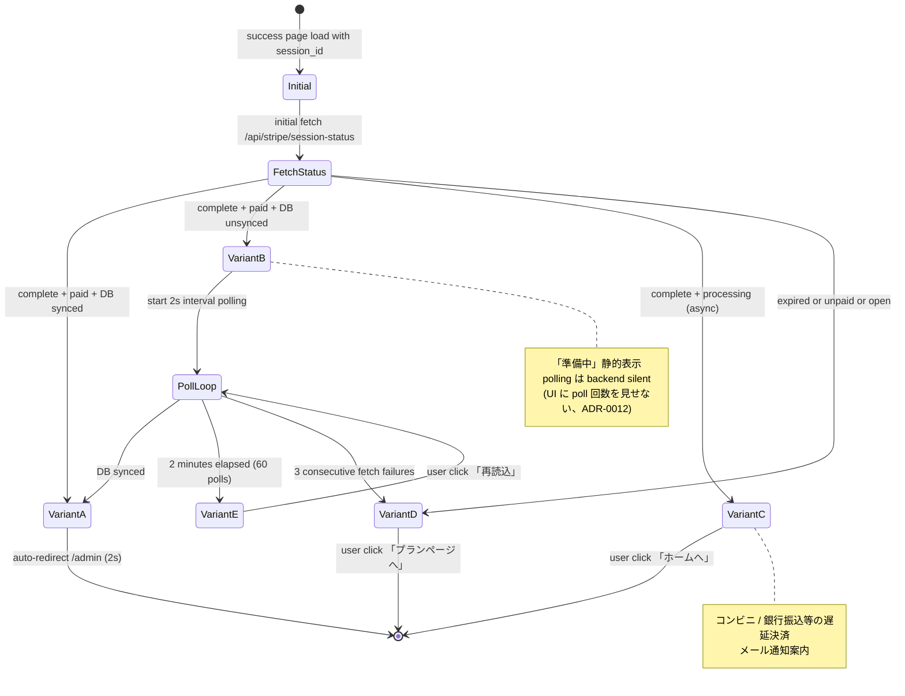

# checkout success ページ + webhook polling UI 設計 (Phase 3 #2572)

| 項目 | 内容 |
|------|------|
| 孫 issue | #2572 (Phase 3 子、checkout success ページ + session_status polling UI + processing gap UX) |
| 親 | #2528 (Phase 3 UI) / Epic #2525 |
| 対応 Phase 1 要件 | [phase1-checkout-requirements.md FR-5 / FR-6 / NFR-3](phase1-checkout-requirements.md) |
| 対応 Phase 2 ジャーニー | [phase2-checkout-journey.md 谷⑥ processing gap (#9 success ページ)](phase2-checkout-journey.md) |
| 関連 Phase 3 設計 | [phase3-admin-header-ui-design.md](phase3-admin-header-ui-design.md) (#2568) — header `[ファミリー]` plan-badge で「権限付与済」可視化と接続 (Phase 7 で `ファミリー` → `プレミアム` 表記書き戻しを実施予定、#2609 / atom rename 整合) |
| Phase 7 rename 方針 | success ページの最終配置は `/admin/subscription/success` ([phase1-naming-url-integrity-requirements.md](phase1-naming-url-integrity-requirements.md))。本 docs 内では設計指針は新名で記述、既存実装 reference (`/api/stripe/checkout/+server.ts` L48 `successBase = '/admin/license'`) は現名を維持 |
| impact-analysis skill 適用 | L1 grep (success_url / sessionId / session_id) + L2 意味 (`payment_status` enum vs `status` enum) + L3 構造 (新規 route 1 + 新規 API endpoint 1 + 既存 webhook handler 維持) + L4 派生 21 カテゴリ (docs のため該当なし、Phase 7 実装時に再確認) |
| 採用案 | 業界整合「Stripe `/v1/checkout/sessions/{id}` retrieve + アプリ DB 状態 cross-check + 短時間 polling (8s → 2 分タイムアウト) + 静的「準備中」表示」 (Stripe custom flow quickstart / Vercel checkout / Linear billing 整合) |
| 既存 SSOT との関係 | webhook が権限付与 SSOT ([billing-redesign-policy.md L41 / L62](billing-redesign-policy.md))、success ページは UX 専用 (権限付与しない、idempotent check のみ) |
| 階層 signal 打消 | success ページは「権限付与の事実確認」が主目的で、「上位プラン獲得おめでとう!」型の射幸的 celebration UI は不採用 (refs #2594 D-2、ADR-0012 連続演出禁止整合)。現状 atom は `PLAN_FULL_TERMS.family` (「ファミリープラン」) を使用、Phase 7 で `premium` への atom rename + UI 文言書き戻しを実施予定 (#2609 SSOT 整合) |

## 設計背景 (なぜこの設計が必要か)

### 現状実装の構造的不整合

**現状の successUrl** (`src/routes/api/stripe/checkout/+server.ts` L43-L50):

```typescript
const safePath = validateReturnPath(returnPath);
const successBase = returnPath ? safePath : '/admin/license';
const successUrl = `${origin}${successBase}${successBase.includes('?') ? '&' : '?'}session_id={CHECKOUT_SESSION_ID}`;
```

決済完了後、ユーザは `/admin/license?session_id={CHECKOUT_SESSION_ID}` (or 任意の returnPath + session_id) に戻されるが、**現状 `/admin/license` 側で `session_id` query を一切処理していない** (`+page.server.ts` 内 grep 該当 0 件)。結果として:

**問題 1 (谷⑥ processing gap)**: ユーザは決済 OK の Stripe Checkout 完了画面 (3 秒程度) から元の `/admin/license` に戻されるが、**webhook 反映が遅延すると `plan = 'free'` のままの画面が表示される**。「決済は通ったが反映されていない、もう一度押すべきか?」の信頼毀損が発生。

**問題 2 (Stripe 公式 fulfillment guideline 違反)**: Stripe Checkout fulfillment ドキュメント (`docs.stripe.com/checkout/fulfillment`) は **「webhook + landing page の dual trigger を推奨」** と明示。現状は landing page 側に **idempotent fulfillment check が存在せず**、webhook が万一遅延・失敗した場合の最後の砦が無い (NFR-1 冪等処理は webhook 側のみ実装)。

**問題 3 (async payment 未対応)**: 現状コード (`stripe-service.ts:217-241` 想定) は `checkout.session.completed` のみ購読し、`checkout.session.async_payment_succeeded` / `async_payment_failed` 未購読 (NFR-3 申し送り済)。コンビニ / 銀行振込等の遅延決済を将来サポートする場合、success ページは `payment_status === 'processing'` 状態を扱える必要がある。

**問題 4 (現状 success ページ単体不在)**: 現状 success の戻り先は元 page (admin/license / 任意 returnPath) に直接戻る設計のため、「決済完了」「権限付与待ち」「タイムアウト」の 3 状態を扱う dedicated UI が無い。本 #2572 はこの dedicated UI を新規実装する。

### なぜ「短時間 polling + 静的準備中」が業界標準か (deep-research 結果)

`docs.stripe.com/checkout/fulfillment` で確定 (2026-05-28 一次確認):

> "Webhook + landing page (dual trigger) is the recommended pattern. The landing page should be safe to run multiple times (idempotent), as the customer may reach it before the webhook completes."
> "Stripe waits up to 10 seconds for the webhook response before redirecting."

採用 SaaS (checkout success + 短時間 polling パターン):

- **Stripe custom flow quickstart** ([docs.stripe.com/checkout/custom/quickstart](https://docs.stripe.com/checkout/custom/quickstart)) — `/session-status?session_id=` 単発取得 + 状態に応じた UI 分岐 (公式サンプル)
- **Vercel Pro upgrade** — webhook 反映を 5-10 秒待つ「Processing your subscription...」spinner、その後ダッシュボードリロード
- **Linear Plus upgrade** — checkout 完了画面で「Setting up your workspace...」を 5 秒表示後、Plus 機能解放を即時反映
- **Notion** — checkout 完了 → 「Activating your plan」処理画面 (3-5 秒) → workspace 復帰

**ADR-0012 整合**: 「準備中」は静的表示 (連続アニメ・カウントダウンタイマー無し)、polling は backend silent (UI から poll 回数を見せない)。タイムアウト時も「数分後に再読込してください」と冷静に案内 (「失敗しました!」「もう一度!」等の煽り無し)。

### Stripe API 仕様確認 (一次調査結果)

| API | 値 | 備考 |
|---|---|---|
| `GET /v1/checkout/sessions/{id}` | `status: 'open' \| 'complete' \| 'expired'` | session 全体のライフサイクル |
| 同上 | `payment_status: 'paid' \| 'unpaid' \| 'no_payment_required'` | 決済の最終状態 |
| webhook `checkout.session.completed` | session.status === 'complete' && payment_status === 'paid' | 即時決済の権限付与トリガー |
| webhook `checkout.session.async_payment_succeeded` | payment_status: 'processing' → 'paid' | コンビニ / ACH 等の遅延決済成立 |
| webhook `checkout.session.async_payment_failed` | payment_status: 'processing' → 'unpaid' | 遅延決済失敗 |

**判定ロジック** (success ページ + status API 経由):

- `complete` + `paid` + アプリ DB に subscription 反映済 → ✅ 「ご利用開始」 → 自動遷移
- `complete` + `paid` + アプリ DB 未反映 → ⏳ 「準備中」継続 polling
- `complete` + `processing` (async) → ⏳ 「お支払いの確認中です」(別文言、メール通知案内)
- `complete` + `unpaid` (async failed) → ❌ 「お支払いが完了しませんでした」(リトライ動線)
- `open` (まれ、即時離脱) → ❌ 「お支払いが完了していません」(checkout 再開)
- `expired` → ❌ 「セッションが切れました」(プランページに戻る)

## 設計方針

### 機能配置 (Phase 7 rename 後の最終形)

```
/admin/subscription/success?session_id=cs_xxx   (Phase 7 rename 後、現 /admin/license?session_id=)
├ Server load: session_id 受信 → /api/stripe/session-status?session_id= に 1 回 fetch
├ Client: payment_status / アプリ DB 反映状況に応じ 5 variant 表示
│   ├ variant A: ✅ ご利用開始 (complete + paid + DB 反映済)
│   ├ variant B: ⏳ 準備中 (complete + paid + DB 未反映、polling 継続)
│   ├ variant C: ⏳ お支払いの確認中 (complete + processing、コンビニ等)
│   ├ variant D: ❌ お支払いが完了しませんでした (unpaid / expired)
│   └ variant E: ⏰ タイムアウト (2 分経過、再読込誘導)
└ polling: variant B 表示中のみ、2 秒間隔で /api/stripe/session-status を再 GET、合計 60 回 (2 分) で打切り
```

子供画面 (`(child)/[uiMode]/`) は本 success ページに到達しない (checkout 動線は親 admin のみ、ADR-0012 構造的担保)。

### state 別の success ページ表示パターン (5 variant)

| variant | session.status | payment_status | アプリ DB | 表示 | 次アクション |
|---|---|---|---|---|---|
| **A. ご利用開始** | `complete` | `paid` | 反映済 (plan !== 'free' && status === 'active') | 「ご利用ありがとうございます」+ プラン名 | 2 秒後に `/admin` へ自動遷移 |
| **B. 準備中** | `complete` | `paid` | 未反映 | 「準備中」+ 進捗 indicator (静的) | 2 秒間隔 polling、反映確認したら A へ |
| **C. お支払いの確認中** | `complete` | `processing` | 未反映 | 「お支払いの確認をしています。確認できしだいメールでご連絡します」 | メール通知案内、`/admin` へ戻るリンク |
| **D. お支払いが完了しませんでした** | `expired` or `payment_status === 'unpaid'` | — | 未反映 | 「お支払いが完了していません」+ 原因 (期限切れ / 失敗) | 「プランページに戻る」CTA → `/admin/subscription` |
| **E. タイムアウト** | `complete` | `paid` | 未反映 (2 分経過) | 「処理に時間がかかっています。数分後に再読込してください」 | 「再読込」button + `/admin` へ戻るリンク |

### polling 仕様 (Stripe rate limit 整合)

| 観点 | 値 | 根拠 |
|---|---|---|
| **初回 fetch** | success ページ load 時に 1 回即時 | Stripe 公式 quickstart 整合 |
| **polling 間隔** | 2 秒 | Stripe rate limit (default 100 req/sec) 配慮 + ユーザ体感反応時間 (Linear / Notion 整合) |
| **タイムアウト** | 2 分 (60 回) | Stripe webhook retry exponential backoff の最初の数回でカバーされる現実的上限 |
| **タイムアウト時** | variant E 表示、polling 停止、手動再読込促す | Phase 1 Open question 3「数分後に再読込」確定済 |
| **fetch 失敗時** | 3 回連続失敗で variant D (タイムアウト相当) | network 切断等の fallback |
| **success ページ離脱時** | polling 停止 (cleanup on unmount) | メモリリーク / 不要 API call 防止 |

### API endpoint 仕様 (新規実装、Phase 7)

```
GET /api/stripe/session-status?session_id=cs_xxx

Response 200:
{
  "stripe_status": "complete" | "open" | "expired",
  "payment_status": "paid" | "unpaid" | "no_payment_required" | "processing",
  "app_db_synced": boolean,
  "plan": "monthly" | "yearly" | "family_monthly" | "family_yearly" | "free",
  "subscription_status": "active" | "trialing" | "past_due" | "canceled" | null
}

Response 401: 認証必須 (owner/parent のみ)
Response 403: session_id が当該 tenantId のものでない場合 (改ざん防止)
Response 404: session_id が Stripe に存在しない場合
```

**サーバ側ロジック**:
1. session_id 受信 → Stripe `client.v1.checkout.sessions.retrieve(session_id)` で生 status 取得
2. session.metadata.tenantId === locals.context.tenantId を assert (権限改ざん防止)
3. アプリ DB `repos.auth.findTenantById(tenantId)` で `plan` / `status` / `stripeSubscriptionId` 取得
4. `app_db_synced = (tenant.stripeSubscriptionId === session.subscription && tenant.status === 'active')`
5. JSON 返却

**冪等性**: 本 endpoint は読み取り専用 (権限付与は webhook SSOT)。何度呼ばれても副作用無し (NFR-1 整合)。

## UI 画面構成 (mermaid)

### 図 1: success ページ全体フロー (state machine)



### 図 2: webhook + landing page dual trigger (Stripe 公式整合)

```mermaid
flowchart TB
    Checkout[Stripe Checkout<br/>カード入力 / 確認]
    Checkout -->|決済完了| Webhook[Stripe → webhook<br/>checkout.session.completed]
    Checkout -->|redirect 10s 待ち| Redirect[success ページ redirect<br/>session_id query 付き]
    Webhook --> Handler[handleCheckoutCompleted<br/>stripe-service.ts L245-303]
    Handler --> DB[(tenant table<br/>plan / status / subscriptionId)]
    Redirect --> Page[/admin/subscription/success<br/>session_id 受信]
    Page --> SessionStatus[/api/stripe/session-status<br/>新規 endpoint]
    SessionStatus -->|Stripe API| Stripe[Stripe<br/>/v1/checkout/sessions/{id}]
    SessionStatus -->|DB query| DB
    SessionStatus --> Page
    Page -->|app_db_synced=false| Poll[2 秒 polling<br/>最大 60 回 / 2 分]
    Poll --> SessionStatus
    Page -->|app_db_synced=true| Redirect2[/admin に自動遷移<br/>2 秒後]
    style Handler fill:#d4edda
    style DB fill:#fff3e0
    style Page fill:#e3f2fd
    style Redirect2 fill:#d4edda
```

### 図 3: 5 variant 分岐 (画面遷移マップ)

```mermaid
flowchart TB
    Load[success ページ load<br/>session_id query 受信]
    Load --> Fetch[初回 fetch session-status]
    Fetch --> VA[A. ご利用開始<br/>complete + paid + synced]
    Fetch --> VB[B. 準備中<br/>complete + paid + unsynced]
    Fetch --> VC[C. お支払い確認中<br/>complete + processing]
    Fetch --> VD[D. お支払い未完了<br/>expired / unpaid / open]
    VB --> Polling{2 秒 polling<br/>最大 60 回}
    Polling -->|synced| VA
    Polling -->|2 分経過| VE[E. タイムアウト<br/>再読込誘導]
    Polling -->|3 連続 fetch fail| VD
    VA -.-> Home[/admin 自動遷移 2s]
    VC -.-> Home2[/admin]
    VD -.-> Plan[/admin/subscription]
    VE -.-> Reload[再読込 button]
    Reload --> Polling
    style VA fill:#d4edda
    style VB fill:#fff3e0
    style VC fill:#fff3e0
    style VD fill:#ffebee
    style VE fill:#ffebee
```

## UI 設計詳細 (5 variant ASCII)

### A. ご利用開始 (complete + paid + app_db_synced)

成功確定。`celebration` 系演出は不採用 (ADR-0012)、静的にお礼を述べて即時自動遷移。

```
┌──────────────────────────────────────────────────────────────┐
│  ✓ ご利用ありがとうございます                                  │
│                                                                │
│    お選びのプランへのお申し込みが完了しました。                │
│    まもなく自動的にホームへ移動します。                        │
│                                                                │
│    [ホームへ移動]                                              │
└──────────────────────────────────────────────────────────────┘
  href: /admin   aria-live: "polite"   2 秒後 auto-redirect
```

- 色: success 系 (`var(--color-feedback-success-bg)` / `var(--color-feedback-success-text)`)
- アイコン: ✓ チェックマーク (静的 SVG、emoji 非依存)
- ASCII 上は「お選びのプラン」(既存 `CHECKOUT_TERMS.chosenPlanFeature` 流用ニュアンス) で表記。実装では plan に応じ `${PLAN_FULL_TERMS.family}` / `${PLAN_FULL_TERMS.standard}` を動的差し込み (現状 atom: `free` / `standard` / `family` のみ)。Phase 7 で `premium` atom rename + `${PLAN_FULL_TERMS.premium}` への書き戻しを実施予定 (#2609 委譲)
- 「ご利用ありがとうございます」「お申し込み」は `SIGNUP_TERMS.canonical` 流用検討

### B. 準備中 (complete + paid + !app_db_synced)

webhook 反映待ち。**最頻出 variant** (Stripe webhook 10 秒待ち redirect が即時間に合うことが多いが、まれに 5-15 秒遅延)。

```
┌──────────────────────────────────────────────────────────────┐
│  ⏳ 準備中                                                     │
│                                                                │
│    お支払いを確認しています。このページは自動的に更新されます。│
│    しばらくお待ちください。                                    │
│                                                                │
│    (画面を閉じても処理は継続されます)                          │
└──────────────────────────────────────────────────────────────┘
  aria-live: "polite"   polling 2s × 最大 60 回
```

- 色: info 系 (`var(--color-feedback-info-bg)` / `var(--color-feedback-info-text)`)
- アイコン: ⏳ 砂時計 (静的 SVG、回転アニメは控えめ — CSS `prefers-reduced-motion: reduce` で完全停止)
- spinner 速度: 1.5 秒/回転以下 (ADR-0012 「サプライズ濫用 / 連続演出」回避、ゆったり)
- polling 回数は UI に表示しない (backend silent)
- 「(画面を閉じても処理は継続されます)」: webhook fulfillment SSOT の信頼担保メッセージ

### C. お支払いの確認中 (complete + processing、コンビニ / 銀行振込)

async_payment 経路。当面 Pre-PMF では未対応だが、Phase 1 NFR-3 申し送り済の将来対応の UI 設計を確定しておく。

```
┌──────────────────────────────────────────────────────────────┐
│  💳 お支払いの確認をしています                                  │
│                                                                │
│    コンビニ / 銀行振込等のお支払いは確認に時間がかかります。   │
│    確認できしだい、ご登録のメールアドレスにご連絡します。      │
│                                                                │
│    [ホームへ戻る]                                              │
└──────────────────────────────────────────────────────────────┘
  href: /admin   aria-live: "polite"
```

- 色: info 系 (`var(--color-feedback-info-bg)` / `var(--color-feedback-info-text)`)
- polling は実施しない (時間スケールが分〜日単位のため UI 待機は無意味)
- async_payment_succeeded webhook 受信後、lifecycle email でユーザに通知 (Phase 5 実装、本 docs scope 外)

### D. お支払いが完了しませんでした (expired / unpaid / open)

failure 系。煽らない冷静な表示。

```
┌──────────────────────────────────────────────────────────────┐
│  ⚠ お支払いが完了していません                                  │
│                                                                │
│    決済処理が完了しませんでした。お手数ですが、もう一度        │
│    プランページからお手続きをお願いします。                    │
│                                                                │
│    [プランページに戻る]   [ホームへ戻る]                       │
└──────────────────────────────────────────────────────────────┘
  href[1]: /admin/subscription   href[2]: /admin
```

- 色: warning 系 (`var(--color-feedback-warning-bg)` / `var(--color-feedback-warning-text)`)
- 「決済処理が完了しませんでした」: 技術的詳細 (expired / 3DS reject 等) は出さない。Customer Portal / プランページで再開可能
- 「再度お試しください!」「もう一度!」型の煽り文言は不採用 (ADR-0012)

### E. タイムアウト (2 分経過、polling 打切り)

`B. 準備中` から 60 回 polling 経過後、webhook 未反映の場合。

```
┌──────────────────────────────────────────────────────────────┐
│  ⏰ 処理に時間がかかっています                                  │
│                                                                │
│    お支払いは正常に処理されている可能性があります。            │
│    数分後にもう一度ページを再読込してください。                │
│                                                                │
│    問題が続く場合はお問い合わせください。                      │
│                                                                │
│    [再読込]   [ホームへ戻る]                                   │
└──────────────────────────────────────────────────────────────┘
  「再読込」click → polling 再開 (variant B に戻る)
```

- 色: warning 系 (`var(--color-feedback-warning-bg)` / `var(--color-feedback-warning-text)`)
- 「正常に処理されている可能性があります」: webhook が遅延しているだけで、決済自体は通っている前提を冷静に伝える
- 「お問い合わせください」: 既存 footer mailto 経由 (ADR-0028 founder inquiry、別途 Phase 4 動線で確認)

## 文言 atom (terms.ts/labels.ts、ADR-0045 整合)

### 新規 atom (terms.ts)

`CHECKOUT_SUCCESS_TERMS` を新規追加 (既存 `CHECKOUT_TERMS` は Checkout 直前 custom_text 用で意味が異なるため別 atom):

```ts
// src/lib/domain/terms.ts (Phase 7 実装時に追加)
export const CHECKOUT_SUCCESS_TERMS = {
  // variant A
  successHeading: 'ご利用ありがとうございます',
  successBodyTemplate: 'へのお申し込みが完了しました。まもなく自動的にホームへ移動します。',
  goHomeButton: 'ホームへ移動',

  // variant B
  preparingHeading: '準備中',
  preparingBody: 'お支払いを確認しています。このページは自動的に更新されます。しばらくお待ちください。',
  preparingFootnote: '(画面を閉じても処理は継続されます)',

  // variant C
  processingHeading: 'お支払いの確認をしています',
  processingBody: 'コンビニ / 銀行振込等のお支払いは確認に時間がかかります。確認できしだい、ご登録のメールアドレスにご連絡します。',
  goHomeBackButton: 'ホームへ戻る',

  // variant D
  failedHeading: 'お支払いが完了していません',
  failedBody: '決済処理が完了しませんでした。お手数ですが、もう一度プランページからお手続きをお願いします。',
  backToPlanButton: 'プランページに戻る',

  // variant E
  timeoutHeading: '処理に時間がかかっています',
  timeoutBody: 'お支払いは正常に処理されている可能性があります。数分後にもう一度ページを再読込してください。',
  timeoutContactNote: '問題が続く場合はお問い合わせください。',
  reloadButton: '再読込',
} as const;
```

### 新規 compound (labels.ts)

`CHECKOUT_SUCCESS_LABELS` (compound):

```ts
// src/lib/domain/labels.ts (Phase 7 実装時に追加)
import { CHECKOUT_SUCCESS_TERMS, PLAN_FULL_TERMS } from './terms';

export const CHECKOUT_SUCCESS_LABELS = {
  // variant A の plan 名動的差し込み (現状 atom: 'standard' | 'family'、Phase 7 で 'family' → 'premium' rename 連動)
  successBody: (planKey: 'standard' | 'family') =>
    `${PLAN_FULL_TERMS[planKey]}${CHECKOUT_SUCCESS_TERMS.successBodyTemplate}`,

  // 各 variant の aria-live 用 announce 文言
  ariaAnnouncePreparingShort: `${CHECKOUT_SUCCESS_TERMS.preparingHeading}。${CHECKOUT_SUCCESS_TERMS.preparingBody}`,
  ariaAnnounceSuccessShort: (planKey: 'standard' | 'family') =>
    `${CHECKOUT_SUCCESS_TERMS.successHeading}。${PLAN_FULL_TERMS[planKey]}${CHECKOUT_SUCCESS_TERMS.successBodyTemplate}`,

  // 既存 SIGNUP_TERMS.canonical 「お申し込み」流用検討 (Phase 7 で確定)
  // 注 (#2609 委譲): planKey 型注釈は現状 atom に整合させた 'family'。Phase 7 atom rename PR で 'premium' に書き戻す
} as const;
```

**atom / compound 分離原則 (ADR-0045)**:
- terms.ts は atom (単一の用語)、`successBodyTemplate` 等は「プラン名と結合される断片」として意図的に atom 化
- labels.ts compound 内で `${PLAN_FULL_TERMS[planKey]}${CHECKOUT_SUCCESS_TERMS.successBodyTemplate}` の template literal 組立 (atom 1 行修正で全変動を伝播)

## アクセシビリティ検証 (Phase 7 実装時に検証)

| 観点 | 検証項目 |
|---|---|
| **`aria-live`** | variant B (準備中) / C (確認中) は `<div aria-live="polite" role="status">` で囲み、polling 中の状態変化 (A への遷移) を screen reader に通知 |
| **`role="status"`** | 結果通知系 (A / D / E) は `role="status"`、failure 系 D は `role="alert"` 検討 (緊急性は低いので暫定 `status`) |
| **キーボードナビ** | 各 variant の主 button (A: ホームへ移動 / D: プランページに戻る / E: 再読込) が Tab 順序最初に来るよう DOM 構造 |
| **focus 管理** | success ページ load 時、heading に focus 移動 (screen reader の announcement 確実化)。`<h1 tabindex="-1">` + svelte mount 時 `.focus()` |
| **`prefers-reduced-motion`** | variant B の hourglass 回転アニメは `@media (prefers-reduced-motion: reduce)` で `animation: none` (ADR-0012 / WCAG 2.3.3 整合) |
| **コントラスト比** | success (緑系 `#15803d` on `#f0fdf4`) / warning (赤系 `#dc2626` on `#fef2f2`) / info (青系 `#1d4ed8` on `#eff6ff`): WCAG AA 4.5:1 以上 (既存 `--color-feedback-*` トークン整合) |
| **`aria-busy`** | variant B 中の polling fetch 中は `<main aria-busy="true">` (screen reader に処理中を伝達) |

## ADR-0012 整合性チェック

| 観点 | 適合 |
|---|---|
| 子供 UI に課金圧をかけない | ✅ success ページは構造的に `(parent)/admin/*` 配下、子供 UI には到達不能 |
| 滞在時間を伸ばさない | ✅ variant A は 2 秒で自動遷移、variant B は polling 完了次第即遷移、UI 内に無意味な滞在時間誘導なし |
| サプライズ濫用禁止 | ✅ 「上位プラン獲得おめでとう!」「✨パチパチ✨」型の celebration UI を不採用、静的なお礼のみ |
| 連続演出 / 煽り禁止 | ✅ spinner 回転は 1.5 秒/回転以下のゆったり、`prefers-reduced-motion` で完全停止 |
| 失敗時の煽り禁止 | ✅ variant D / E は「もう一度!」型ではなく冷静な事実通知 + 再開動線 |
| 解約動線を隠さない | ✅ success ページから `/admin` 帰還可能、Customer Portal 経由解約は通常動線で controllable |
| 階層 signal 打消 | ✅ variant A の plan 名表示は事実 (申し込んだプラン名) のみ、「上位プラン!」「Premium 獲得!」等の階層強調なし |

## impact-analysis skill 4 layer 防御適用

### L1 構文 (ast-grep / ripgrep)

- `successUrl` / `success_url` 参照: `src/routes/api/stripe/checkout/+server.ts` L48-L49 1 箇所のみ (Phase 7 実装時に `/admin/subscription/success` へ変更)
- `session_id` query 受信処理: 現状 grep 該当 0 件 → 新規実装
- 既存 `/admin/license?session_id=...` redirect: 旧 URL は ADR-0001 後方互換ルール (`legacy-url-map.ts` 経由) で `/admin/subscription/success?session_id=...` に redirect (Phase 7 rename 時)

### L2 意味 (型 / 同名異義)

- `payment_status` (Stripe enum) と `subscription.status` (アプリ DB enum: ACTIVE/TRIALING/PAST_DUE/CANCELED) は別概念、混同禁止
- session.status (Stripe: open/complete/expired) と subscription.status (アプリ DB) も別概念
- `app_db_synced` は本 endpoint 固有の derived boolean (Stripe API には存在しない、サーバ側で導出)
- `CHECKOUT_TERMS` (custom_text 用) vs `CHECKOUT_SUCCESS_TERMS` (success ページ用) は別 atom、混同禁止

### L3 構造 (依存グラフ)

- **新規 file 2 件** (Phase 7 実装):
  - `src/routes/(parent)/admin/subscription/success/+page.svelte` (new)
  - `src/routes/(parent)/admin/subscription/success/+page.ts` (load function、session_id 検証)
  - `src/routes/api/stripe/session-status/+server.ts` (new、Stripe API + DB cross-check endpoint)
- **既存 file 修正** (Phase 7 実装):
  - `src/routes/api/stripe/checkout/+server.ts` L48: `successBase = '/admin/license'` → `'/admin/subscription/success'`
  - `src/lib/domain/terms.ts`: `CHECKOUT_SUCCESS_TERMS` 追加
  - `src/lib/domain/labels.ts`: `CHECKOUT_SUCCESS_LABELS` 追加
- **webhook handler は無変更**: `handleCheckoutCompleted` (`stripe-service.ts:245`) は権限付与 SSOT として既存維持 (NFR-1 整合)

### L4 派生 artifact 21 カテゴリ (本 #2572 は docs のため該当なし)

本 PR は UI 設計 docs のみで、A-G 全カテゴリ (DB / cache / SaaS / 分析 / 顧客接点 / CI/CD / テスト) の派生 artifact 影響なし。Phase 7 実装 PR で以下を必須確認:

- [ ] **B-4 Service Worker / browser cache**: 新規 route `/admin/subscription/success` の SW 登録
- [ ] **C-7 Stripe rate limit (詳細試算 Phase 7 必須)**: polling 2 秒間隔 × 最大 60 回 × N 並行ユーザ = N × 30 req/min。Stripe API rate limit 公式値は live mode 100 read req/sec (公式 docs: [docs.stripe.com/rate-limits](https://docs.stripe.com/rate-limits))。試算: N = 100 並行で 3,000 req/min = 50 req/sec → 公称上限の 50% 消費。Phase 7 PR で実数値表 + 同時並行ユーザ数の事業見込み (Pre-PMF Bucket A 範囲) を必須掲載。endpoint side 1 秒 cache (Open question #6) で消費を 1/2 に圧縮可能。Stripe API 429 観測時の backoff (exponential、UI 上は variant B 継続表示) は Phase 7 実装スコープ
- [ ] **C-7b session_id 漏洩経路の defense in depth (Phase 7 必須)**: Stripe `session_id` (cs_xxx) は URL query / referer / browser history / 各種 log に残る前提。Stripe API 仕様上 session_id は「秘密ではない」(retrieve 自体は同じ Stripe account からの request なら誰でも可能) ため漏洩自体は CWE 該当外。ただし「他人の session_id を query に差し込めばその session 情報が見える」状態は **CWE-639 (Authorization Bypass Through User-Controlled Key)** 該当。Phase 7 実装で必須対策: (a) `/api/stripe/session-status` で `session.customer` と `locals.user.stripeCustomerId` の一致を検証 (mismatch → 403)、(b) tenant ID の cross-check (multi-tenant 想定で session が自 tenant のものか検証)、(c) referer policy `strict-origin-when-cross-origin` の確認 (既存 hooks.server.ts の Security Header 設定で対応済か Phase 7 で確認)
- [ ] **C-7c Rate limit on /api/stripe/session-status (CWE-770、Phase 7 必須)**: polling endpoint を保護しないと **CWE-770 (Allocation of Resources Without Limits or Throttling)** 該当。Phase 7 必須実装: per-tenant 60 req/min + per-IP 120 req/min (本 ADR 2 秒 × 60 回 polling = 30 req/min + 余裕分)。`src/lib/server/security/rate-limiter.ts` 既存実装を流用、超過時は 429 + Retry-After header。UI 側は 429 観測時 polling 一時停止 + variant B 継続表示
- [ ] **C-7d 監査ログ (Phase 7 必須、Pre-PMF Bucket A スコープ判断)**: session retrieve 操作の最小監査ログ。fields: `tenantId / userId / sourceIP / session_id / timestamp / outcome (200/403/429)` のみ、PII (email / 氏名 / カード番号) を redact。保持期間 30 日 (Pre-PMF 期は短期で十分、ADR-0010 Bucket A)、暗号化 at-rest は既存 DynamoDB / DB の標準暗号化に依存 (専用機構不要)。S3 + Athena は ADR-0010 過剰防衛のため不採用
- [ ] **G-19 Storybook**: 5 variant の Storybook stories (`CheckoutSuccessPage.stories.svelte`)
- [ ] **G-19 Playwright SS**: 5 variant 撮影 (mock session-status API で variant 強制可能)
- [ ] **G-20 E2E**: `tests/e2e/checkout-success-polling.spec.ts` (新規) — CWE-639 試験 (他人 session_id 試行 → 403) / CWE-770 試験 (rate limit 突破試行 → 429) を含む
- [ ] **E-13 Help Center / FAQ**: 「決済後に画面が固まったら?」FAQ 追記検討
- [ ] **F-16 lifecycle email**: variant C の async_payment_succeeded 通知メール (Phase 5 連動、別 PR 分割。本 #2572 では variant A/B/D/E のみ実装対象、variant C は async_payment 全体仕様確定後の別 PR で実装、下記 Open question #4 参照)
- [ ] **security skill 適用 (Phase 7 必須)**: 上記 CWE-639 / CWE-770 対策は `security skill` で実装前審査を必須化 (skill 適用結果を Phase 7 PR body に貼る)

## Storybook stories 設計 (Phase 7 実装時)

```typescript
// CheckoutSuccessPage.stories.svelte
- VariantA_StandardSynced     // A: スタンダードプラン 申し込み完了 (DB 反映済)
- VariantA_FamilySynced       // A: ファミリープラン 申し込み完了 (DB 反映済、Phase 7 で `VariantA_PremiumSynced` に rename 予定 / #2609 atom rename 連動)
- VariantB_Preparing          // B: 準備中 (polling 中)
- VariantC_AsyncProcessing    // C: 確認中 (コンビニ等 async)
- VariantD_Expired            // D: セッション切れ
- VariantD_Unpaid             // D: 決済失敗
- VariantE_Timeout            // E: 2 分タイムアウト
- ReducedMotion               // B variant + prefers-reduced-motion: reduce で hourglass 静止
```

## Playwright SS 取得計画 (Phase 7 実装時)

| 変数 | URL | mock state | 用途 |
|---|---|---|---|
| `checkout-success-a-standard` | `/admin/subscription/success?session_id=mock_a_std` | mock: complete/paid/synced | variant A スタンダード |
| `checkout-success-a-family` | `/admin/subscription/success?session_id=mock_a_family` | mock: complete/paid/synced | variant A ファミリー (Phase 7 で `checkout-success-a-premium` / `mock_a_premium` に rename 予定 / #2609 連動) |
| `checkout-success-b-preparing` | `/admin/subscription/success?session_id=mock_b` | mock: complete/paid/unsynced | variant B 準備中 |
| `checkout-success-c-async` | `/admin/subscription/success?session_id=mock_c` | mock: complete/processing | variant C 確認中 |
| `checkout-success-d-failed` | `/admin/subscription/success?session_id=mock_d` | mock: expired or unpaid | variant D 失敗 |
| `checkout-success-e-timeout` | `/admin/subscription/success?session_id=mock_e` | mock: 60 polls expired | variant E タイムアウト |

撮影は `scripts/capture.mjs` 既存フロー流用、`--flow checkout-success-{variant}` を追加。session-status API は MSW 等で mock。

## テスト計画 (Phase 3 完了基準、memory test-coverage-every-issue 整合)

| テスト種別 | 対象 |
|---|---|
| **Storybook test** | 8 variant 全表示確認 (`CheckoutSuccessPage.stories.svelte`) |
| **E2E** | `tests/e2e/checkout-success-polling.spec.ts` (新規) — 5 variant × 状態遷移 + auto-redirect 確認 + タイムアウト後再読込確認 + 子供画面に success ページが到達不能 (404) を assert |
| **unit (service)** | `tests/unit/services/session-status-service.test.ts` — `app_db_synced` 導出ロジック (5 状態テーブル網羅) + tenantId 改ざん検出 |
| **unit (UI)** | `tests/unit/components/checkout-success-state-machine.test.ts` — 5 variant state machine 遷移 (Fetch → A/B/C/D、B → A/E/D、E → B) |
| **Playwright SS UX レビュー** | 6 SS × 3 ペルソナ (慎重派 / 即決派 / async コンビニ派) で「準備中の信頼感」「タイムアウトの煽らなさ」 |
| **アクセシビリティ** | axe-core 自動チェック + screen reader manual (VoiceOver / NVDA) で aria-live 動作確認 + `prefers-reduced-motion` で hourglass 静止確認 |
| **rate limit 検証** | 100 ユーザ並行 polling 想定で Stripe API rate limit 上限の何 % を消費するか試算 (Phase 7 PR で記載) |

実行は Phase 7 一括 (本 docs PR では計画のみ記載、test-coverage-every-issue 整合)。

## Phase 7 実装手順 (本 #2572 は docs のみ、実装は Phase 7)

1. `src/routes/(parent)/admin/subscription/success/+page.ts` 作成: session_id query 検証 + tenant 検証 + session.customer × locals.user.stripeCustomerId 一致検証 (CWE-639 対策)
2. `src/routes/(parent)/admin/subscription/success/+page.svelte` 作成: 5 variant + polling state machine ($state / $derived / $effect)。**variant E (タイムアウト) → 再読込 click → variant B 再開の race condition mitigation 必須**: (a) 「再読込」button は debounce 1 秒 (連打で polling 多重起動を防止)、(b) `$effect` cleanup で前回 polling fetch を `AbortController` で abort し完了 await してから新 polling 開始 (中途 fetch が late で variant 上書きする事故を防止)、(c) 「再読込」再開回数は上限 3 回 (累積 6 分の polling、それ以降は variant E のまま contact mailto 提示のみ — Stripe API rate limit 過剰消費防止 + CWE-770 自衛)。回数 state は session-scoped (`+page.svelte` の `$state` 内に保持、reload で reset)
3. `src/routes/api/stripe/session-status/+server.ts` 作成: Stripe `sessions.retrieve` + DB cross-check + JSON 返却 + rate-limiter 適用 (per-tenant 60 req/min + per-IP 120 req/min、CWE-770 対策) + session.customer × locals.user.stripeCustomerId 一致検証 (CWE-639 対策、403 返却) + 監査ログ emit (`tenantId / userId / sourceIP / session_id / timestamp / outcome` のみ、PII redact)
4. `src/lib/server/services/session-status-service.ts` 作成: `app_db_synced` 導出ロジック (5 状態テーブル網羅)
5. `src/lib/domain/terms.ts` に `CHECKOUT_SUCCESS_TERMS` 追加
6. `src/lib/domain/labels.ts` に `CHECKOUT_SUCCESS_LABELS` compound 追加
7. `src/routes/api/stripe/checkout/+server.ts` L48 を `'/admin/subscription/success'` に変更
8. `src/lib/server/routing/legacy-url-map.ts` に `/admin/license?session_id=*` → `/admin/subscription/success?session_id=*` redirect 追加
9. `src/lib/server/services/stripe-service.ts` に `checkout.session.async_payment_succeeded` / `async_payment_failed` webhook handler 追加 (NFR-3 連動)
10. Storybook 8 variant 追加 + Playwright SS 6 件撮影 + E2E + unit test
11. impact-analysis skill 4 layer 防御 + 21 カテゴリ checklist を PR body に記載
12. `prefers-reduced-motion` 検証 + axe-core 自動チェック + screen reader manual 検証

## Open question (PO 判断、Phase 7 実装時に確認)

| # | 論点 | 状態 |
|---|---|---|
| 1 | polling 間隔 (2 秒 vs 3 秒 vs 5 秒) | 暫定 2 秒 (Linear / Notion 整合)、Stripe rate limit 試算後に Phase 7 で確定 |
| 2 | タイムアウト (2 分 vs 3 分 vs 5 分) | 暫定 2 分、Phase 1 Open question 3 「数分後に再読込」整合 |
| 3 | variant A 自動遷移 (2 秒 vs 3 秒 vs ユーザ click 必須) | 暫定 2 秒 auto-redirect、ADR-0012 滞在時間最短化整合 |
| 4 | variant C async_payment 対応の Phase 分割 | **本 #2572 / Phase 7 実装スコープは variant A / B / D / E の 4 種に限定**。variant C (コンビニ / 銀行振込) は Phase 5 (#2533 async_payment 仕様確定) 連動の別 PR で実装。理由: (a) `checkout.session.async_payment_succeeded` / `async_payment_failed` の webhook 購読変更が必要 (NFR-3 申し送り)、(b) async fail 時の lifecycle email (F-16) と密結合、(c) Pre-PMF Bucket A 段階で即対応必須ではない (Stripe Checkout デフォルト card のみ、async 経路は明示 opt-in しない限り発火しない)。本 docs は variant C の UI 仕様を**先行確定** (Phase 5 後の実装迷いを排除)、実装着手のみ別 PR |
| 5 | variant D 「お問い合わせください」リンク先 | 既存 footer mailto (ADR-0028 founder inquiry) で十分か、専用 form 必要か |
| 6 | session-status endpoint cache (Stripe API call 軽減) | endpoint side で短時間 (1 秒) cache する案、Phase 7 で rate limit 試算後判断 |
| 7 | mobile タップ target (44px Material 最小) | 「ホームへ移動」「プランページに戻る」button は既存 `Button.svelte` primitive で 44px 確保済 (確認のみ) |
| 8 | variant E 「再読込」再開回数上限 (暫定 3 回) の根拠 | 累積 6 分 = Stripe webhook 復旧の業界平均 (数秒〜数十秒) を 10 倍以上カバー。5 分超は Stripe Status Page 確認が現実的 next action。回数無制限は CWE-770 (rate limit 自衛) の観点で却下。Phase 7 で実 webhook 遅延ログ観測後に再調整 |

## 6 観点 自己検証チェック (per-issue-execution-workflow SSOT)

| # | 観点 | 本 docs 反映 |
|---|---|---|
| 1 | **着手時 deep-research** (目的・あるべき実装・最適アーキ・デザインパターン) | Stripe 公式 fulfillment / custom flow quickstart docs (2026-05-28 一次確認) + Vercel / Linear / Notion checkout success UX 業界事例引用 + Stripe API enum (session.status / payment_status) 一次確認 |
| 2 | **UI SS + アクセシビリティ検証計画** | Storybook 8 variant + Playwright SS 6 件 + axe-core + aria-live / aria-busy / role / focus 管理 / prefers-reduced-motion / コントラスト比 計画明文化 |
| 3 | **UX 変更時のテスト項目追加** | E2E `checkout-success-polling.spec.ts` 新規 / unit (service / UI) / Storybook / Playwright SS UX レビュー (3 ペルソナ) / rate limit 検証計画記載 |
| 4 | **用語 SSOT 化** | 新規 `CHECKOUT_SUCCESS_TERMS` (atom) + `CHECKOUT_SUCCESS_LABELS` (compound) 設計、既存 `CHECKOUT_TERMS` (custom_text 用) との namespace 区別明示、PLAN_FULL_TERMS 流用、`SIGNUP_TERMS.canonical` 「お申し込み」整合検討 |
| 5 | **影響範囲事後検証** | impact-analysis 4 layer 適用 (L1: 1 箇所のみ既存修正 / L2: payment_status vs subscription.status 同名異義整理 / L3: 新規 2 file + 既存 1 file 修正 + webhook handler 無変更 / L4: docs のため該当なし、Phase 7 実装時 21 カテゴリ確認計画) |
| 6 | **目的達成 / 大方針整合** | Phase 1 FR-5 (webhook SSOT) / FR-6 (準備中 + polling) / NFR-1 (冪等) / NFR-3 (async_payment) 全件設計 / Phase 2 谷⑥ processing gap 解消 / Phase 3 admin-header と接続 (success → header `[ファミリー]` plan-badge 即可視化、Phase 7 で `[プレミアム]` 表記書き戻し #2609) / ADR-0012 (静的 / 連続演出禁止 / 滞在時間最短) / ADR-0045 (terms/labels SSOT) / ADR-0001 後方互換 (legacy-url-map redirect 計画) / 階層 signal 打消整合 |

## 根拠

- **Stripe 公式 docs (2026-05-28 一次確認)**:
  - [docs.stripe.com/checkout/fulfillment](https://docs.stripe.com/checkout/fulfillment) — webhook + landing page dual trigger / `payment_status !== 'unpaid'` 判定 / 冪等処理
  - [docs.stripe.com/checkout/custom/quickstart](https://docs.stripe.com/checkout/custom/quickstart) — `/session-status?session_id=` 単発取得 + status 分岐 (公式サンプル)
  - [docs.stripe.com/api/checkout/sessions/object](https://docs.stripe.com/api/checkout/sessions/object) — session.status enum (open/complete/expired) + payment_status enum (paid/unpaid/processing/no_payment_required)
  - [docs.stripe.com/payments/payment-intents/verifying-status](https://docs.stripe.com/payments/payment-intents/verifying-status) — polling より webhook 推奨 / rate limit 注意
- **業界事例**: Vercel checkout success "Processing your subscription..." / Linear Plus upgrade "Setting up your workspace..." / Notion plan activation 3-5 秒待機
- **既存実装** (Explore 照合 2026-05-28):
  - `src/routes/api/stripe/checkout/+server.ts` L43-L50 (現 successUrl 生成、`/admin/license?session_id=`)
  - `src/lib/server/services/stripe-service.ts` L43-L113 (createCheckoutSession) / L245-L303 (handleCheckoutCompleted webhook SSOT)
  - `src/lib/domain/terms.ts` L723-L725 (CHECKOUT_TERMS、custom_text 用、本 docs CHECKOUT_SUCCESS_TERMS と別 atom)
  - `src/routes/(parent)/admin/license/+page.server.ts` (現状 session_id query 未処理を確認)
- **Phase 1**: [phase1-checkout-requirements.md FR-5 / FR-6 / NFR-1 / NFR-3](phase1-checkout-requirements.md)
- **Phase 2**: [phase2-checkout-journey.md 谷⑥ #9 / Phase 3 申し送り 3](phase2-checkout-journey.md)
- **Phase 3 関連**: [phase3-admin-header-ui-design.md](phase3-admin-header-ui-design.md) (#2568、success → header badge 接続)
- **ADR**: ADR-0012 (Anti-engagement) / ADR-0045 (terms/labels SSOT) / ADR-0042 (CSS 3 層トークン) / ADR-0001 (後方互換 legacy-url-map)
- **skill**: `impact-analysis` (4 layer 防御 + 21 カテゴリ checklist)
- **memory**: per-issue-execution-workflow / impact-analysis-methodology / design-intent-grounding / test-coverage-every-issue / deep-research-product-specific / ssot-verification-before-proposal
