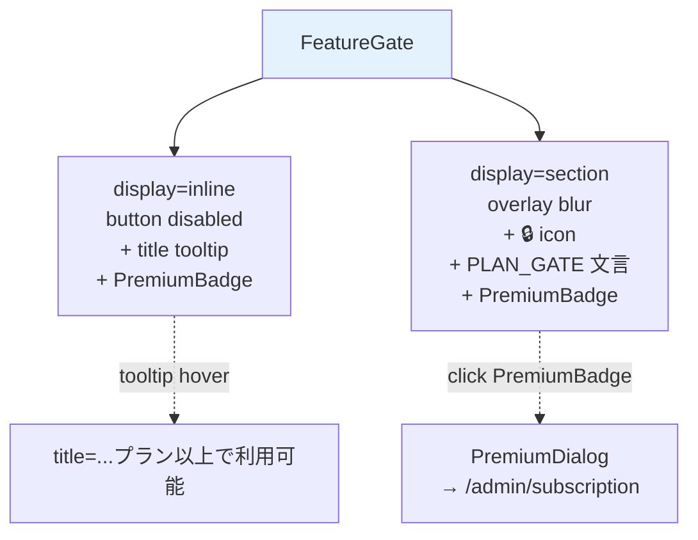

## FeatureGate + tooltip UI 設計 (Phase 3 #2570)

| 項目 | 内容 |
|------|------|
| 孫 issue | #2570 (Phase 3 子、FeatureGate + tooltip UI 設計) |
| 親 | #2528 (Phase 3 UI) / Epic #2525 |
| Phase 1+2 整合 | 補強 1 (#2583 URL `/admin/license` → `/admin/subscription`) + 補強 2 (#2588 `family` → `プレミアム` / 月額のみ) + Phase 2 checkout (#2548 谷④購入動線探索) |
| 既存実装 | `src/lib/ui/components/FeatureGate.svelte:43-66` (1 ファイル、2 variant: `inline` button + `section` overlay) |
| Phase 7 rename 方針 | `family` → `プレミアム` (atom 1 行) / `/admin/license` → `/admin/subscription` |
| impact-analysis skill 適用 | L1 grep + L2 意味 (PLAN_GATE_LABELS compound 経由) + L3 構造 (ActivityLimitBanner #2569 / PremiumDialog 境界) + L4 docs のため該当なし |
| 採用案 | 既存堅牢、改善は文言 atom 化 + a11y 強化 + プランページ link 追加の 3 点のみ |
| `premium` 階層 signal 打消 | gate 文言で「○○以上で利用可能」表記を維持し、無料プランの「排除」でなく「上位プランで解放」を表現する。誇示的 marketing 語 (「限定」「特別」) は採用しない (refs #2594 D-2) |

## 設計方針: 既存 FeatureGate は堅牢、最小改善のみ

Phase 2 checkout ジャーニー (#2548) で **「gate disable + tooltip + プランページ遷移」は既存堅牢 ✅** と整理済。本 #2570 では UI 構造を全面再設計せず、以下 3 点の最小改善のみを設計対象とする:

1. **tooltip 文言の atom 化** (現状 `UI_COMPONENTS_LABELS.featureGateLockTitle(plan)` でテンプレ化済だが、PLAN_GATE_LABELS と統一されていない)
2. **a11y 強化** (disabled button + tooltip の SR 互換性、`aria-describedby` 経路)
3. **CTA 配置** (section variant の overlay に「プランを見る」link 追加、`/admin/subscription` 遷移)

UI レイアウト・配色・blur 演出・PremiumBadge 配置は維持。

## 4 gate 機能の utility 整理 (Phase 2 #2548 既存実装照合)

FeatureGate が現在 wrapping している主要 gate 機能を整理 (Phase 7 実装時の影響範囲確定用):

| # | gate 対象 | 表示モード | 既存 banner / dialog |
|---|---|---|---|
| 1 | マーケットプレイス取込 (子供 3 人目以降など) | `section` overlay | `PremiumDialog.svelte:52` (`window.location.href = '/admin/license'`) |
| 2 | 子供追加 (3 人目以降) | `inline` button | `ActivityLimitBanner.svelte:16` (a href=`/admin/license`) |
| 3 | 活動追加 (4 つ目以降) | `inline` button | 同上 |
| 4 | その他有料機能 (AI 提案 / クラウドエクスポート / 週次レポート 等) | `section` overlay | `errors.ts` → `PLAN_GATE_LABELS.standardOrAboveFor(...)` |

→ 4 機能とも FeatureGate を経由しており、本 docs の改善 (文言 atom 化 / a11y / CTA link) は全 gate に一括反映可能。

## UI 構造 (mermaid)

### 図 1: 現状 (既存堅牢) の 2 variant



### 図 2: 改善後 (本 #2570 で追加する link CTA)

```mermaid
flowchart TB
    Gate[FeatureGate]
    Gate --> InlineNew[display=inline<br/>button disabled<br/>+ aria-describedby tooltip<br/>+ PremiumBadge clickable]
    Gate --> SectionNew[display=section<br/>overlay blur<br/>+ 🔒 icon<br/>+ PLAN_GATE 文言<br/>+ プランを見る link 追加]
    InlineNew -.aria-describedby.-> Sr[SR: ...プラン以上で利用可能]
    SectionNew -.click link.-> Sub[/admin/subscription]
    style Gate fill:#e3f2fd
    style SectionNew fill:#d4edda
```

## 改善 3 点の詳細

### 改善 1: tooltip 文言の atom 化 (PLAN_GATE_LABELS 経由統一)

現状の文言生成は `UI_COMPONENTS_LABELS.featureGateLockTitle(plan)` で「○○プラン以上で利用可能」を組み立てているが、サーバ側の `errors.ts` / `cloud-export-service.ts` 等が使う `PLAN_GATE_LABELS.standardOrAboveFor(feature)` と別経路。

**改善**: FeatureGate でも `PLAN_GATE_LABELS` を経由し、サーバ-クライアント間で文言一致を保証。

| 旧 | 新 (本 #2570 で確定) |
|---|---|
| `UI_COMPONENTS_LABELS.featureGateLockTitle(plan)` (= `"${plan}プラン以上で利用可能"`) | tooltip: `PLAN_GATE_LABELS.tooltipFor(requiredTier)` (新規追加、`"${PLAN_FULL_TERMS[requiredTier]}以上で利用可能"`) |
| `UI_COMPONENTS_LABELS.featureGateLockText(plan)` (= 同上) | section 本文: 同上 (tooltipFor 流用) |

`PLAN_GATE_LABELS` 既存 6 メソッドに `tooltipFor(tier)` を追加することで、サーバ側 error message とクライアント側 tooltip が同一 atom 経由になる (`PLAN_FULL_TERMS.standard` / `.premium` 1 行修正で 95 件 + tooltip が同時伝播)。

```ts
// PLAN_GATE_LABELS 追加メソッド案 (Phase 7 atom 拡張)
tooltipFor: (tier: 'standard' | 'premium') =>
  `${PLAN_FULL_TERMS[tier]}以上で利用可能`,
```

`tier` 引数は `'family'` を採用せず Phase 7 rename 後の `'premium'` を使う (Phase 1 補強 2 FR-1 整合)。`standard` / `premium` 2 値のみ受け付けるため `PlanKey` 全集合を許容しない (型安全性)。

### 改善 2: a11y 強化 (aria-describedby + 動的 id 生成)

disabled button + `title` 属性は **SR (Screen Reader) で読まれない** ブラウザがある (Safari 既知)。WAI-ARIA Authoring Practices 1.2 に従い、`aria-describedby` で tooltip 文言を明示的に関連付ける。

```svelte
<!-- 現状: <button disabled title={...}>{label}</button> (SR 非互換) -->
<!-- 改善案: -->
<script>
  const tooltipId = `feature-gate-tooltip-${$props().id ?? crypto.randomUUID().slice(0, 8)}`;
</script>
<span class="feature-gate-inline">
  <button type="button" class="feature-gate-btn" disabled aria-describedby={tooltipId}>
    <span class="feature-gate-btn__icon" aria-hidden="true">🔒</span>
    <span class="feature-gate-btn__label">{buttonLabel}</span>
  </button>
  <span id={tooltipId} class="feature-gate-tooltip" role="tooltip">
    {PLAN_GATE_LABELS.tooltipFor(requiredTier)}
  </span>
  <PremiumBadge size="sm" label={requiredLabel} />
</span>
```

**ポイント**:
- `title` 属性は visible tooltip と二重表示にならないよう撤去 (SR が `aria-describedby` を優先)
- 🔒 icon は装飾 (`aria-hidden="true"`)、SR は label と tooltip のみ読む
- `crypto.randomUUID()` で id 衝突回避 (複数 FeatureGate 並列配置時の SR 混乱を防ぐ)

CSS visual tooltip は hover / focus 時に CSS の `:hover` / `:focus-visible` で showAndHide。`role="tooltip"` で SR は disabled button focus 時に「ボタン名 + tooltip 内容」を順次読む。

### 改善 3: section overlay に「プランを見る」link 追加

現状の `section` variant の overlay は PremiumBadge (interactive、click で PremiumDialog open) のみ。Dialog → `/admin/subscription` への遷移は 2 タップ (Badge click → Dialog の「アップグレード」click)。

**改善**: overlay 内に直接「プランを見る」link を追加し 1 タップで `/admin/subscription` 遷移可能化 (Phase 2 #2548 谷④購入動線探索の対策)。

```svelte
<div class="feature-gate-overlay">
  <span class="feature-gate-lock" aria-hidden="true">🔒</span>
  <p class="feature-gate-text">{PLAN_GATE_LABELS.tooltipFor(requiredTier)}</p>
  <a href="/admin/subscription" class="feature-gate-link">プランを見る</a>
  <!-- PremiumBadge は維持 (Dialog 経路は説明過多時に有用) -->
  <PremiumBadge size="md" label={UI_COMPONENTS_LABELS.featureGateUpgrade} />
</div>
```

**配置原則**:
- link 文言は `UI_COMPONENTS_LABELS.featureGatePlanLink` 新規 atom (`'プランを見る'`)、ADR-0012 「滞在強要しない静的表示」整合
- 「無料体験を始める」「アップグレードしよう」等の煽り文言は採用しない (ADR-0012 anti-engagement)
- href は `/admin/subscription` (Phase 7 rename 後)、Phase 7 までは LEGACY_URL_MAP 経由で `/admin/license` から自動遷移
- inline variant では追加しない (button の隣に link が並ぶと視覚的にうるさい、tooltip + Badge で十分)

## Phase 7 実装時の atom / labels SSOT 拡張 (ADR-0045 整合)

```ts
// src/lib/domain/labels.ts に追加 (Phase 7)

// PLAN_GATE_LABELS namespace 拡張
export const PLAN_GATE_LABELS = {
  // ... 既存 6 メソッド維持
  /**
   * "{PLAN_FULL_TERMS[tier]}以上で利用可能"
   * カバー対象: FeatureGate tooltip (inline / section 共通)
   */
  tooltipFor: (tier: 'standard' | 'premium') =>
    `${PLAN_FULL_TERMS[tier]}以上で利用可能`,
} as const;

// UI_COMPONENTS_LABELS namespace 拡張
UI_COMPONENTS_LABELS = {
  // ... 既存維持 + 以下追加
  featureGatePlanLink: 'プランを見る',
  // featureGateLockTitle / featureGateLockText は撤去 (PLAN_GATE_LABELS.tooltipFor に統合)
};
```

**変更 atom 数**: 新規 2 件 (`tooltipFor` / `featureGatePlanLink`) + 既存撤去 2 件 (`featureGateLockTitle` / `featureGateLockText`) = 差分 0、純化。

## 文言 atom 全集合 (本 #2570 で確定)

| atom / compound | 用途 | 値 (Phase 7 後) |
|---|---|---|
| `PLAN_FULL_TERMS.standard` | プラン名 (フル) | `'スタンダードプラン'` |
| `PLAN_FULL_TERMS.premium` (Phase 7 rename) | プラン名 (フル) | `'プレミアムプラン'` |
| `PLAN_GATE_LABELS.tooltipFor('standard')` | tooltip | `'スタンダードプラン以上で利用可能'` |
| `PLAN_GATE_LABELS.tooltipFor('premium')` | tooltip | `'プレミアムプラン以上で利用可能'` |
| `UI_COMPONENTS_LABELS.featureGatePlanLink` | overlay link | `'プランを見る'` |
| `UI_COMPONENTS_LABELS.featureGateUpgrade` | PremiumBadge label | `'アップグレード'` (維持) |

## ADR-0012 整合性チェック

| 観点 | 適合 |
|---|---|
| 子供 UI に課金圧をかけない | ✅ FeatureGate は `/admin/*` 専用、子供画面非配置 |
| 滞在時間を伸ばさない | ✅ 静的 disable + tooltip / 演出 (アニメ・countdown) なし |
| modal interrupt 不採用 | ✅ overlay は blur 演出のみで強制的に視界を遮らない |
| 連続演出 / 煽り禁止 | ✅ 「期間限定」「あと N 日」「特別オファー」等の語彙を採用しない |
| 解約動線を隠さない | ✅ FeatureGate は購入動線のみ、解約は別 (Phase 3 #2574/#2575 / #2550) |
| `premium` 階層 signal 打消 | ✅ 「○○以上で利用可能」表記で「無料プラン排除」でなく「上位プランで解放」を表現 (refs #2594 D-2) |

## impact-analysis skill 4 layer 防御適用

### L1 構文 (ast-grep / ripgrep)
- 旧 `featureGateLockTitle` / `featureGateLockText` 参照: 1 ファイル (`src/lib/ui/components/FeatureGate.svelte:49, 59`) — Phase 7 atom rename で完結
- `PLAN_GATE_LABELS` 参照: 8 ファイル既存 (`errors.ts` / `cloud-export-service.ts` / `admin/reports/+page.server.ts` 等) — 新メソッド `tooltipFor` 追加で影響なし

### L2 意味 (型 / 同名異義)
- `tier` 引数: `'family'` (旧) → `'premium'` (新) の rename は Phase 7 atom 1 行修正で全 95 件伝播 (Phase 1 補強 2 FR-1 整合)
- `PlanTier` 型: `'free' | 'standard' | 'family'` → `'free' | 'standard' | 'premium'` (Phase 7 で同時 rename)
- `PLAN_GATE_LABELS.tooltipFor` は `'standard' | 'premium'` のみ受け付ける部分集合型 (型安全性)

### L3 構造 (依存グラフ)
- FeatureGate 内部: PremiumBadge → PremiumDialog → `/admin/license` (Phase 7 rename 後 `/admin/subscription`) の依存チェーン維持
- ActivityLimitBanner (#2569) との境界: FeatureGate = inline disable + tooltip (個別操作の前面化) / ActivityLimitBanner = 上部固定 banner (一覧 context の警告)。両者は重ね合わせ表示でも UI 競合しない (banner は overlay 上部、FeatureGate は inline / section 内)
- PremiumDialog との境界: PremiumDialog = 機能訴求モーダル (機能リスト + 「アップグレード」CTA) / 本 #2570 で追加する link は同じ `/admin/subscription` 遷移を 1 タップで提供 (探索容易性、Dialog は説明過多時の代替経路として維持)

### L4 派生 artifact 21 カテゴリ (本 #2570 は docs のため該当なし)
本 PR は UI 設計 docs のみで、A-G 全カテゴリの派生 artifact 影響なし。Phase 7 実装 PR で 21 カテゴリ checklist 適用必須。

## Storybook stories 設計

```typescript
// FeatureGate.stories.svelte (Phase 7、現状 stories 未整備)
- InlineFreeToStandard       // free → standard gate (子供 3 人目追加)
- InlineFreeToPremium        // free → premium gate (マーケットプレイス取込)
- InlineStandardToPremium    // standard → premium gate (活動 4 つ目以降)
- SectionFreeToStandard      // free → standard gate (AI 活動提案パネル)
- SectionFreeToPremium       // free → premium gate (週次レポート)
- SectionWithLink            // 本 #2570 改善後の link 追加 variant
```

## Playwright SS 取得計画

| 変数 | 撮影状態 | 用途 |
|---|---|---|
| `feature-gate-inline-locked` | inline variant, disabled button + Badge | tooltip a11y 確認 (focus 状態) |
| `feature-gate-section-locked` | section variant, overlay 表示 | link CTA 配置確認 |
| `feature-gate-section-with-link` | 本 #2570 改善後 | プランを見る link 視認性確認 |
| `feature-gate-unlocked` | 上位プランで gate 解除 | regression: 通常表示維持 |

## テスト計画 (Phase 3 完了基準、memory test-coverage-every-issue 整合)

- **結合テスト**: FeatureGate + PLAN_GATE_LABELS / UI_COMPONENTS_LABELS 文言整合 / aria-describedby 関連付け
- **E2E**: gate disable → tooltip 表示 → click 不可 / overlay link click → `/admin/subscription` 遷移 (LEGACY_URL_MAP 経由含む)
- **Storybook test**: 6 variant 全表示確認 (Phase 7)
- **a11y test (Playwright @axe-core)**: disabled button + tooltip の SR 互換性 / `aria-describedby` 解決 / `role="tooltip"` 認識
- **Playwright SS レビュー**: 4 SS 取得、UX レビュー (3 ペルソナ: 1 人っ子家庭 / 兄弟複数 / 卒業期)
- **UX レビュー**: 「○○プラン以上で利用可能」文言が「排除されている印象」を与えないか確認 (`premium` 階層 signal 打消、refs #2594 D-2)

## Phase 7 実装手順 (本 #2570 は docs のみ、実装は Phase 7)

1. atom 拡張: `PLAN_GATE_LABELS.tooltipFor` 追加 + `UI_COMPONENTS_LABELS.featureGatePlanLink` 追加
2. atom 撤去: `UI_COMPONENTS_LABELS.featureGateLockTitle` / `featureGateLockText` 撤去 (Phase 7 atom 1 行修正で完結)
3. FeatureGate.svelte 改修:
   - `title` 属性撤去 + `aria-describedby` 経路追加
   - `crypto.randomUUID()` で tooltip id 生成
   - section variant に `<a href="/admin/subscription">プランを見る</a>` 追加
   - `requiredTier` 型を `'standard' | 'premium'` に変更 (Phase 7 rename 連動)
4. Storybook 6 variant 整備
5. Playwright SS 4 件撮影 + UX レビュー (3 ペルソナ)
6. impact-analysis skill 4 layer 防御 + 21 カテゴリ checklist を PR body に記載
7. a11y test (Playwright @axe-core) 追加 + pre-ready PASS 確認

## Open question (PO 判断、Phase 7 実装時に確認)

| # | 論点 | 状態 |
|---|---|---|
| 1 | section variant の link 文言「プランを見る」採用是非 (vs「もっと使う」「機能を解放」等) | 暫定「プランを見る」(中立、ADR-0012 整合)、Phase 7 実装時に微調整 |
| 2 | inline variant に link 追加是非 (現状 PremiumBadge click で Dialog → /admin/subscription の 2 タップ) | 暫定: inline は追加しない (button 隣で視覚的に混雑、tooltip + Badge で十分)、Phase 7 で UX レビュー再確認 |
| 3 | `crypto.randomUUID()` の SSR 安全性 (SvelteKit 5 SSR で `globalThis.crypto` 利用可能性) | Phase 7 実装時に検証、不可なら `$id` rune (Svelte 5) or 単純 counter で代替 |
| 4 | PremiumDialog 維持是非 (本 #2570 で link 追加すると Dialog 経路と冗長) | PremiumDialog は機能リスト訴求があり link と役割異なるため維持 (Phase 7 で UX レビュー再確認) |

## 根拠

- Phase 1 補強 1 (#2583 naming-url-integrity)・補強 2 (#2588 plan-naming-pricing-axis)
- Phase 2 補強 (#2596 プラン命名) / Phase 2 checkout (#2548 谷④購入動線探索整理)
- 既存実装: `src/lib/ui/components/FeatureGate.svelte:43-66` / `PLAN_GATE_LABELS` 既存 6 メソッド (`src/lib/domain/labels.ts:375-430`)
- ADR-0012 (Anti-engagement) / ADR-0045 (terms.ts 2 階層 + atom 1 行伝播) / ADR-0050 (Parent-Gate 子供 UI 露出禁止)
- WAI-ARIA Authoring Practices 1.2 (tooltip pattern, disabled button + `aria-describedby`)
- skill `impact-analysis` (4 layer 防御 + 21 カテゴリ checklist)
- 関連 memory: feedback_test_coverage_every_issue / reference_impact_analysis_methodology / feedback_design_intent_grounding
