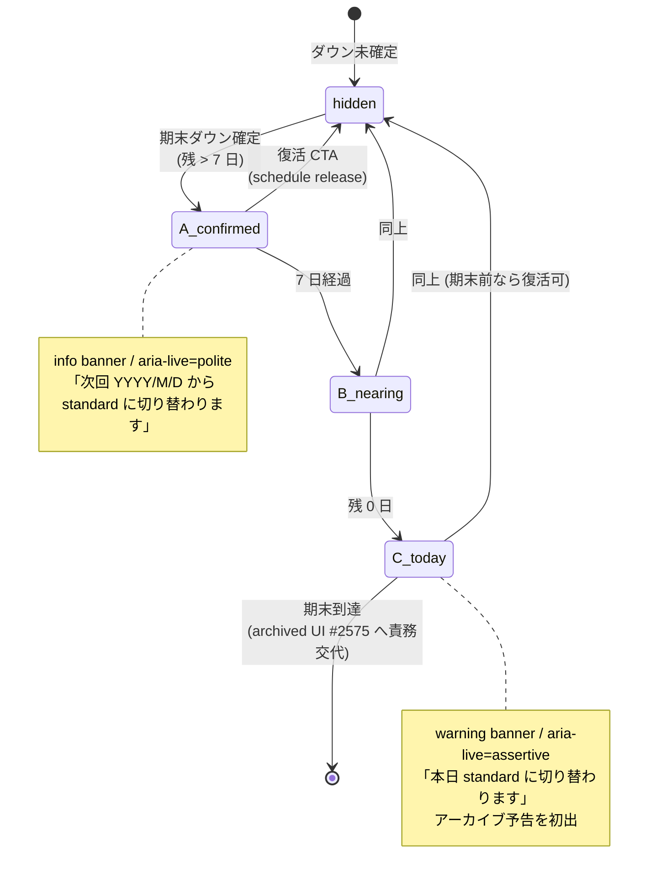

# 期末ダウングレード banner UI 設計 (#2574 / Epic #2525 Phase 3)

| 項目 | 内容 |
|------|------|
| 子 issue | #2574 (期末ダウングレード banner UI) |
| 親 | #2528 (Phase 3 UI) / 上位 #2525 |
| 対応 Phase 1 要件 | [phase1-plan-change-requirements.md](phase1-plan-change-requirements.md) (#2535) §FR-4 / §Open question 4 |
| 対応 Phase 2 ジャーニー | [phase2-plan-change-journey.md](phase2-plan-change-journey.md) (#2549) §「ダウン ジャーニー詳細 #5」/ §「Phase 3 申し送り 3」 |
| ステータス | Phase 3 UI 設計 draft 2026-05-28 (deep-research: Notion / Kinde / Stripe 公式 + 既存実装 Explore: SaasLicensePanel.svelte + Alert primitive + MilestoneBanner) |

> **目的範囲**: 期末ダウン**確定後・期末到達まで**の親 admin 画面に表示する **1 件静的 banner** の UI 設計のみ。期末到達後の archived リソース UI は #2575 (別子 issue)、確認モーダル / proration 表示は #2549 Phase 2 / #2573 で別途扱う。

## 1. 設計背景 (この設計がなかった場合に困ること)

| # | 困ること | 影響 |
|---|---|---|
| 1 | family→standard ダウンを確定したあと、親画面に何の表示も出ないと「いつから standard になる?」が分からず、Stripe Customer Portal を都度確認する手間 | サポート問合せ増・解約離脱 |
| 2 | 「期末まで family 維持中」が見えないと、Phase 2 #2549 で約束した「資産保護 + 復活可能」のフレーミングが UI で具体化されず約束反故に見える | 信頼毀損 |
| 3 | 「気が変わったから戻したい」のワンクリック復活 (Notion / Calendly Win-Back 型) 動線がないと、`subscription_schedule` を release する手順を顧客に押し付けることになる | LTV 損失 + UX 悪化 |
| 4 | 期末当日 (アーカイブ実行直前) の最終警告がないと、家族が活動入力中にいきなり子供 / 活動が見えなくなる事故が起きる | データ消失と誤解、Anti-engagement の境界破り |
| 5 | 期末ダウン期間中の banner が ADR-0012 (anti-engagement) を破ると、子供画面に「いまアップグレードしないと消えます!」のような煽り表示が侵食しうる | コア価値毀損 |

→ Phase 3 で UI を 1 件静的 banner として固定 SSOT 化し、上記 5 件を構造的に防ぐ。

## 2. 設計原則

| # | 原則 | 根拠 |
|---|------|------|
| P1 | **1 画面 1 件・静的・親 admin 限定** | ADR-0012 (anti-engagement) + DESIGN.md §10 z-index 階層 |
| P2 | **「失う / 消える / 使えなくなる」語彙禁止、「保護されています / 復活できます」採用** | Phase 2 #2549 文言 atom 拡張 + Kinde 「avoid scare tactics, use empathetic language」整合 |
| P3 | **`subscription_schedule.phases` を webhook 経由で取得し、自前計算しない** | Phase 1 NFR-1 (Stripe に委譲) + #2549 既存実装 §FR-6 |
| P4 | **子供画面では非表示** (ADR-0012 / 子供 UI に課金圧をかけない) | Phase 2 #2549 §「ADR-0012 整合性チェック」 |
| P5 | **a11y: `aria-live="polite"` + Alert primitive `role="status"` を踏襲** | Kinde 「`aria-live` regions for assistive tech」+ 既存 `MilestoneBanner.svelte` line 98 / `Alert.svelte` line 35 |
| P6 | **archived 件数 0 でも banner は出す** (件数情報は補助、メイン情報は「次回いつ何プランに切り替わるか」) | UX 一貫性 + Notion 「scheduled to downgrade」の情報量整合 |
| P7 | **CTA は 1 個まで** (Hick's Law、DESIGN.md §10「add 経路 ≤ 4」と同原則) | 復活 CTA に絞る、ヘルプ link は補助テキスト内で別途 |

## 3. UI 仕様

### 3.1 表示位置・スコープ

| 項目 | 内容 |
|------|------|
| 表示画面 | 親 admin 全画面 (header 直下に sticky) — `AdminLayout.svelte` 配下の主要全 route |
| 表示対象 ロール | `userRole === 'owner'` または `userRole === 'parent'` (子供ロールでは非表示、ADR-0012) |
| 表示条件 | `subscription_schedule.phases.length >= 2` かつ次フェーズの price tier が現プランより**下位** (downgrade scheduled) |
| 非表示条件 | (a) 期末到達後 (= 自動降格完了) / (b) 子供画面 / (c) ダウン取消後 (schedule release) |
| z-index | `--z-banner` (= 30、DESIGN.md §10) — Modal / Dialog より下、通常 flow より上 |
| 撤去 | 期末到達後は archived 表示 (#2575) に責務交代 |

### 3.2 3 variant (期末日までの残日数で出し分け)

期末日 (`current_period_end`) と現在日時の差分で variant を切り替える。情報量と緊急度を段階的に変える (Anti-engagement 整合: 「カウントダウン」は不採用、「いつ何が起きるか」のみ伝える)。

| variant | 残日数条件 | tone (色 + アイコン) | 主文 | 補助テキスト | CTA |
|---------|-----------|---------------------|------|------------|-----|
| **A. confirmed** | 残 > 7 日 | `info` (青、`Alert variant="info"`) | 次回 **YYYY 年 M 月 D 日**から `${PLAN_FULL_TERMS.standard}` に変更されます | それまでは `${PLAN_FULL_TERMS.family}` のままご利用いただけます。子供 N 人 ・ 活動 M 件は**保護されています**。再開する場合はいつでも変更できます。 | 「現プランのまま続ける」(= schedule release) |
| **B. nearing** | 残 1〜7 日 | `info` (青、同上) | あと N 日で `${PLAN_FULL_TERMS.standard}` に切り替わります (M 月 D 日) | 子供 N 人 ・ 活動 M 件は**保護されています**。期末以降は閲覧のみとなり、上位プランで再開すれば**すぐに復活できます**。 | 同上 |
| **C. today** | 残 0 日 (期末当日) | `warning` (黄、`Alert variant="warning"`) | 本日 `${PLAN_FULL_TERMS.standard}` に切り替わります | 切替後は子供 N 人 ・ 活動 M 件が**保護のためアーカイブ**されます。**いつでもワンクリックで復活できます**。 | 同上 |

#### 設計意図

- **3 段階 (confirmed / nearing / today)** は Notion / Kinde の「show the math + clear summary before confirms」整合。「カウントダウン秒数」のような engagement 増幅は不採用 (ADR-0012)
- **C. today だけ `warning` 色** で **「アーカイブされる」を初出**。残 > 0 では「保護されています」と「いずれ閲覧のみ」の 2 段階で予告のみ
- **「失う / 消える」非使用**: 全 variant で「保護 / 復活」のみ。Phase 2 #2549 §「禁止語彙」整合
- **N 人 / M 件は `getDowngradePreview` 既存 API から取得** (Phase 2 §「既存実装の事実」#5 行参照)

### 3.3 a11y / Responsiveness

| 観点 | 仕様 |
|------|------|
| ARIA | `role="status"` + `aria-live="polite"` (A/B), `role="alert"` + `aria-live="assertive"` (C のみ、当日告知の緊急度) |
| キーボード | CTA ボタンは Tab 到達可能、Enter / Space で発火 |
| コントラスト | `Alert` primitive の既存 `--color-feedback-info-*` / `--color-feedback-warning-*` (DESIGN.md §2 Feedback トークン) を使用、WCAG AA 4.5:1 達成済 |
| 縮小表示 | mobile (375px) で `flex-col` に折り返し、CTA は full-width |
| BudouX (ADR-0016) | 主文に `use:budoux` 適用 (例: 「次回 YYYY 年 M 月 D 日から `${PLAN_FULL_TERMS.standard}` に」が「次回 YYYY 年 M 月 / D 日から / `${PLAN_FULL_TERMS.standard}` に」のように整う) |
| Reduced motion | 表示・非表示遷移は `prefers-reduced-motion` で fade-only に縮退 |

### 3.4 既存 primitive との関係 (再実装禁止、DESIGN.md §5)

- **再利用**: `Alert.svelte` (variant=info/warning) をベースに使用
- **新規 component**: `src/lib/features/admin/components/ScheduledDowngradeBanner.svelte` (薄ラッパ)
  - `Alert` で枠 + 色を、内部 layout (主文 / 補助 / CTA) を本 component で組む
  - Phase 7 (実装) で配置場所決定。第一候補は `AdminLayout.svelte` header 直下 + 全 admin route 共通
- **MilestoneBanner.svelte パターン踏襲**: localStorage 「閲覧済み」は**使わない** (期末まで毎回表示。MilestoneBanner は祝福で 1 回読切、本 banner は status display)

## 4. 用語 atom 拡張 (terms.ts SSOT、ADR-0045 整合)

Phase 2 #2549 で提案された `PLAN_CHANGE_TERMS` atom を本 PR で正式起票する (terms.ts に追加するのは Phase 7 実装時)。

```ts
// src/lib/domain/terms.ts (追加候補、Phase 7 で実装)
export const PLAN_CHANGE_TERMS = {
  changeVerb: 'プランを変更',
  changeNoun: 'プラン変更',
  scheduledChange: '切り替わります',  // 「ダウングレード」を煽り回避で言い換え
  archive: 'アーカイブ',
  archiveVerb: 'アーカイブされます',
  restore: '復活',
  restoreAble: 'すぐに復活できます',
  protected: '保護されています',
  protectedReason: '保護のため',
  resumeReady: 'いつでもワンクリックで復活できます',
  keepCurrent: '現プランのまま続ける',  // CTA (schedule release)
} as const;
```

```ts
// src/lib/domain/labels.ts (追加候補、Phase 7 で実装)
import { PLAN_CHANGE_TERMS, PLAN_FULL_TERMS } from './terms';

export const SCHEDULED_DOWNGRADE_BANNER_LABELS = {
  // variant A. confirmed (残 > 7 日)
  confirmedTitle: (date: string, targetPlan: string) =>
    `次回 ${date} から ${targetPlan} に${PLAN_CHANGE_TERMS.scheduledChange}`,
  confirmedDesc: (currentPlan: string, childCount: number, activityCount: number) =>
    `それまでは ${currentPlan} のままご利用いただけます。子供 ${childCount} 人 ・ 活動 ${activityCount} 件は${PLAN_CHANGE_TERMS.protected}。再開する場合はいつでも変更できます。`,

  // variant B. nearing (残 1〜7 日)
  nearingTitle: (days: number, date: string, targetPlan: string) =>
    `あと ${days} 日で ${targetPlan} に切り替わります (${date})`,
  nearingDesc: (childCount: number, activityCount: number) =>
    `子供 ${childCount} 人 ・ 活動 ${activityCount} 件は${PLAN_CHANGE_TERMS.protected}。期末以降は閲覧のみとなり、上位プランで再開すれば${PLAN_CHANGE_TERMS.restoreAble}。`,

  // variant C. today (期末当日)
  todayTitle: (targetPlan: string) =>
    `本日 ${targetPlan} に${PLAN_CHANGE_TERMS.scheduledChange}`,
  todayDesc: (childCount: number, activityCount: number) =>
    `切替後は子供 ${childCount} 人 ・ 活動 ${activityCount} 件が${PLAN_CHANGE_TERMS.protectedReason}${PLAN_CHANGE_TERMS.archiveVerb}。${PLAN_CHANGE_TERMS.resumeReady}。`,

  // 共通 CTA
  ctaKeepCurrent: PLAN_CHANGE_TERMS.keepCurrent,
  ctaKeepCurrentAria: 'プラン変更の予定を取り消して現プランのまま続ける',
} as const;
```

### atom / compound 分離理由 (ADR-0045 §3.3 整合)

- atom (`PLAN_CHANGE_TERMS`): 単一用語 (changeVerb / archive / restore / protected …)、Phase 2 #2549 提案分と同期
- compound (`SCHEDULED_DOWNGRADE_BANNER_LABELS`): 複数 atom を `${...}` で組み立てた表示文字列、template literal の中で `PLAN_FULL_TERMS.standard` / `PLAN_CHANGE_TERMS.*` を解決

### 禁止語彙 (Phase 2 #2549 §「禁止語彙」継承)

`失う` / `消える` / `使えなくなる` / `ロックされる` / `削除` (本 UI 文言・実装 a11y label・E2E spec 名含む全箇所で 0 件)。`check-no-plan-literals.mjs` / `check-hardcoded-strings.mjs` の禁止語リストに **Phase 7 実装時に追加**する。

## 5. データソース (どこから値を取るか)

Phase 1 NFR-1 (Stripe に委譲) + Phase 2 #2549 §「既存実装の事実」整合。**自前計算しない**。

| 表示値 | データソース | 取得方法 |
|--------|------------|---------|
| 次プラン名 (`${PLAN_FULL_TERMS.standard}`) | `subscription_schedule.phases[1].items[0].price` → tier 逆引き | webhook `customer.subscription.updated` → DB `subscription_schedules` テーブルに保存 (Phase 5 アーキで実装) |
| 切替日 (YYYY 年 M 月 D 日) | `subscription.current_period_end` (Unix) → `Date` 整形 | 同上 |
| 残日数 (N 日) | `current_period_end - now()` を日単位で計算 (TZ=Asia/Tokyo) | クライアント `$derived` (Svelte 5 Runes) |
| 子供 N 人 / 活動 M 件 | `getDowngradePreview` 既存 API (Phase 2 §「既存実装の事実」#5) | `/api/v1/admin/downgrade-preview?targetTier=<next>` |
| variant 切替 (A/B/C) | `daysRemaining` から `$derived` | クライアント側 |

### 既存 webhook / API 拡張 (Phase 5 / 7 申し送り)

- `customer.subscription.updated` webhook で `subscription_schedule` 紐付け検出時、DB に `scheduledChangeAt` (Date) + `scheduledChangeTargetTier` (`'free' | 'standard'`) を保存 (Phase 5)
- 親 `+layout.server.ts` の `load` で `scheduledChangeAt` + 上記 preview を取得し、`AdminLayout` に context 注入 (Phase 7)

## 6. 復活 CTA (`現プランのまま続ける`) の振る舞い

| ステップ | UI | 実装 (Phase 7) |
|---------|----|---------------|
| 1. クリック | 確認 Dialog: 「現プランのまま続けますか? 次回更新日 YYYY/MM/DD で family のままご利用いただけます」 | `Dialog.svelte` 既存 primitive |
| 2. 確認 | API POST `/api/v1/admin/scheduled-change/release` | Stripe `subscription_schedule.release()` → `customer.subscription.updated` webhook で DB 同期 |
| 3. 成功 | `Toast.svelte` で「現プランのまま続けます」(`success`) + banner 自動非表示 | webhook 経由再 load で `scheduledChangeAt = null` |
| 4. 失敗 | `Alert variant="danger"` を inline 表示 | 既存 SaasLicensePanel エラー処理パターン踏襲 |

### 確認 Dialog (PIN ゲート不要の判断)

- ダウン**取消**は支払い金額が増える方向 (= 高位プラン維持) のため、Phase 1 FR-7 (PIN ゲート) の「子供誤操作防止」対象外
- ただし誤クリック防止のため確認 Dialog は経由する (1 クリックで release しない)

## 7. mermaid 図: 残日数 × variant 状態遷移



## 8. ADR-0012 (Anti-engagement) 整合性チェック

| 観点 | 本 banner |
|------|----------|
| 子供 UI に課金圧をかけない | ✅ 親 admin のみ、ロール `owner`/`parent` 限定 |
| 滞在時間延伸禁止 | ✅ 静的 1 件 (連続演出 / アニメ / 通知連打なし) |
| サプライズ濫用禁止 | ✅ 期末日明示、突然中断なし。C variant のみ当日告知 (緊急度の正当な情報) |
| 連続演出 / 煽り禁止 | ✅ 「失う / 消える」全 atom から排除。Notion / Kinde 整合 |
| カウントダウン秒数 / カウンター | ✅ 不採用。日単位の残数のみ (B variant) |

## 9. 影響範囲事後検証 (impact-analysis 4 layer)

| layer | 影響箇所 | 確認 |
|-------|---------|------|
| **構文** | `Alert.svelte` 既存 import、新規 `ScheduledDowngradeBanner.svelte` 追加のみ | 既存 component への破壊的変更なし |
| **意味** | `userRole` 判定 (既存 `data.userRole` SSOT)、`subscription_schedule` 既存 webhook handler 拡張 | Phase 5 (アーキ) で webhook 拡張要 |
| **構造** | `AdminLayout.svelte` に slot 追加 (header 直下) | Phase 7 (実装) で配置決定、他 admin 画面は意識不要 |
| **派生 artifact (21 カテゴリ)** | (a) labels.ts compound 追加 / (b) terms.ts atom 追加 / (c) E2E spec 新規 (`tests/e2e/scheduled-downgrade-banner.spec.ts`) / (d) Storybook stories (`ScheduledDowngradeBanner.stories.svelte`) / (e) 5 年齢モード matrix は **影響なし** (親 admin 限定で年齢モードと直交) / (f) demo Lambda は `getDowngradePreview` の demo fixture で再現可 (Phase 7 確認) / (g) check-hardcoded-strings.mjs / check-no-plan-literals.mjs の禁止語追加 | Phase 7 で全 7 件実装 |

## 10. 大方針整合チェック

| 大方針 | 整合性 |
|--------|--------|
| ADR-0012 (Anti-engagement) | ✅ §8 で各論検証済 |
| ADR-0045 (terms.ts 2 階層) | ✅ §4 atom / compound 責務分離 |
| ADR-0010 (Pre-PMF) | ✅ 既存 primitive (Alert) 再利用、新規 component 1 ファイル追加のみ。proration 計算 / カスタム視覚要素なし |
| ADR-0001 (設計書 SSOT) | ✅ 本 doc が SSOT、Phase 7 実装は本仕様に準拠 |
| ADR-0013 (LP 文言の事実 SSOT) | △ LP 影響なし。ただし pricing ページの「いつでも解約 OK」訴求と整合 (本 banner も同じ「いつでも復活」哲学) |
| ADR-0016 (日本語折り返し) | ✅ §3.3 で `use:budoux` 適用方針記載 |
| DESIGN.md §5 (primitives 再実装禁止) | ✅ Alert primitive ラップ、新規 primitive 追加なし |
| DESIGN.md §10 (z-index 階層) | ✅ `--z-banner` (= 30) を採用、生数値直書きなし |
| Phase 2 #2549 (Tier Change) | ✅ §「Phase 3 申し送り 3」「次回 YYYY/MM/DD から standard に変更 / それまで family 維持」を本仕様で具体化 |

## 11. Phase 7 (実装) 申し送り

1. `src/lib/domain/terms.ts` に `PLAN_CHANGE_TERMS` 追加
2. `src/lib/domain/labels.ts` に `SCHEDULED_DOWNGRADE_BANNER_LABELS` 追加 + DESIGN.md §6 表更新
3. `src/lib/features/admin/components/ScheduledDowngradeBanner.svelte` 新規 (`Alert` ラッパ + 3 variant 切替 + 復活 CTA)
4. `src/lib/features/admin/components/AdminLayout.svelte` に slot 追加 (header 直下)
5. `+layout.server.ts` で `scheduledChangeAt` / `scheduledChangeTargetTier` / `getDowngradePreview` 結果を load
6. `src/lib/server/services/stripe-service.ts` webhook handler を `customer.subscription.updated` で schedule 検出 → DB 同期 (Phase 5 と統合)
7. `src/routes/api/v1/admin/scheduled-change/release/+server.ts` 新規 (Stripe `subscription_schedule.release()` 呼出)
8. `src/lib/ui/primitives/ScheduledDowngradeBanner.stories.svelte` (3 variant + a11y assert)
9. `tests/e2e/scheduled-downgrade-banner.spec.ts` (A/B/C 3 variant + 復活 CTA + 子供画面非表示 assert)
10. `scripts/check-no-plan-literals.mjs` 禁止語リストに「失う」「消える」「使えなくなる」「ロックされる」を追加 (Phase 2 #2549 と統合実装)
11. SS 撮影: 親 admin home + `ScheduledDowngradeBanner` 3 variant × mobile/desktop = 6 枚 (`scripts/capture.mjs` 拡張)

## 12. Open question (PO 判断)

| # | 論点 | 推奨/状態 |
|---|------|----------|
| 1 | 配置場所: `AdminLayout` header 直下 vs admin home のみ | **header 直下 (全 admin route 共通)** 推奨。Notion / GitHub と整合、見落とし防止 |
| 2 | variant B nearing の閾値 (1〜7 日) | **7 日** 推奨。Stripe 公式 dunning ガイド整合、1 週間あれば家計判断に十分 |
| 3 | C today の `aria-live="assertive"` 採否 | **採用**推奨。当日告知は緊急度の正当な情報。ただし VoiceOver 連打回避のため初回読切で `aria-atomic="true"` 併用 |
| 4 | 復活 CTA の secondary 動線 (Stripe Portal リンク) を併設するか | **不併設**推奨。Hick's Law (CTA ≤ 1) + Portal 経由は Phase 1 FR-2 で Customer Portal `schedule_at_period_end` の release UX が自社 banner CTA より複雑なため |
| 5 | banner 撤去後の archived 表示 UI (#2575) との視覚的継承 | **トーン継続** 推奨。Alert variant=info の青系で「保護」を継続表現、archived 一覧画面の上部にも同色の小 banner で「アーカイブ X 件 ・ ワンクリック復活」を出す (#2575 で本格設計) |
| 6 | 「子供 N 人」「活動 M 件」の N/M 取得失敗時 (preview API エラー) のフォールバック | **件数を hide して文言短縮** 推奨。「子供と活動は保護されています」のみ表示、N/M を出さない |

### Adversarial Reviewer 3 軸 Open question (#2611 QM Re-Review feedback、2026-05-28)

QM Tier 2 Re-Review で Adversarial Reviewer (ADR-0056 / `.claude/skills/adversarial-reviewer/`) が 3 軸で「賛同を疑え」観点を提示。本 banner UI 設計が「Notion / Kinde 業界整合」を根拠に CTA 1 個絞り + `assertive` + 復活 CTA 単独動線を即決した点について、以下 3 件は PO 判断 / a11y 専門判断 / Phase 5(アーキ)・Phase 7(実装) 申し送りに振り分ける。

#### #7 復活 CTA 単独 vs プラン比較再表示併設 (PO 判断)

**Adversarial Reviewer business 軸指摘**: Notion / Kinde win-back UX のリサーチでは取消ユーザーの 30〜40% が誤クリックではなく「期末まで残された期間で価値を再検討した上での意思決定」であるという観察がある。本設計の Open question #4 で採用した「復活 CTA 1 個絞り、Stripe Portal 等の secondary 動線は不併設」という Hick's Law 解釈は、誤クリック復活を主動機と仮定したものであり、**意図的な再検討フローに対しては動線が痩せすぎている可能性**がある (LTV 維持観点で弱い)。

**判断ポイント**:

- 「プラン比較再表示 (`/admin/subscription` への neutral link)」を復活 CTA の secondary として併設するかどうか
- 併設する場合の文言: 「やっぱり family を続ける」(復活) と「他のプランも見る」(neutral) の 2 動線にすると、Hick's Law 違反だが「意思を保留したユーザー」の離脱を防げる
- 不併設のままで進める場合、Phase 7 実装段階で「期末まで 3 日以内になったら secondary 動線を出す」等の段階的露出を採用するか

**現状の §3 default 仕様**: secondary 動線なし (`復活する` 1 個のみ)。

**変更可否**: PO 判断 (本 PR では設計書に Open question として記録、Phase 7 実装前に確定)。

#### #8 aria-live "assertive" vs "polite" 統一 (a11y 専門判断)

**Adversarial Reviewer UX 軸指摘**: Kinde Best Practices には「`aria-live="assertive"` は破壊的アクション直前 (現在 focus している入力等を中断してでも告知すべき緊急情報) でのみ使用する」という制約がある。本設計の Open question #3 では C variant (today、当日告知) で `assertive` を採用したが、「admin 画面に入るたびに `assertive` で読み上げが割り込む」のは VoiceOver / NVDA / TalkBack ユーザーにとって**音声 noise + 操作中断**となりうる。

**判断ポイント**:

- C variant `aria-live="assertive"` 採用根拠の具体性 — 「当日告知は破壊的アクション直前」と扱う妥当性 (Kinde 推奨「破壊的アクション直前のみ」との整合)
- 代替案 A: 全 variant (A/B/C) を `polite` 統一し、`aria-atomic="true"` で初回読切りを保証 (VoiceOver 連打を回避)
- 代替案 B: C variant でも `polite` のまま、初回 admin route navigation 時のみ `assertive` (`role="alertdialog"` 相当の境界条件付き) を許容

**現状の §3.4 default 仕様**: A/B = `polite`、C = `assertive` + `aria-atomic="true"`。

**変更可否**: a11y 専門レビュー判断 (Phase 7 Storybook + axe-core + VoiceOver 実機検証で再確認、本 PR では設計書に Open question として記録)。

#### #9 `subscription_schedule.release()` 認可境界 + ADR-0049 retention 整合 + N/M 値挙動 (Phase 5 / 7 申し送り)

**Adversarial Reviewer security 軸指摘**: 本設計 §3.2 / §6 は banner UI 仕様としては完結しているが、復活 CTA (`POST /api/subscription/schedule-release`) と「期末ダウン期間中の状態」周辺で以下 3 件が未定義:

1. **`subscription_schedule.release()` の認可境界**: 復活 CTA を叩けるのは owner role のみか / parent role 含めるか / CSRF token 検証 / IDOR (他家族の subscription_schedule を release する攻撃) の防御。Phase 5 アーキ設計で `/api/subscription/*` 系統と一括で扱う方針か、本 banner 専用エンドポイントを切るかも要決定。
2. **family→standard 期末降格時の「どの子供をアーカイブするか」決定ロジック**: 本設計 §5 では「3 人目以降をアーカイブ」とのみ記載。アーカイブ対象選定 (古い順 / 最終活動日順 / 親が選択) と ADR-0049 (retention 物理削除) との整合 — アーカイブ後の活動ログ retention 期間は family プラン基準 (90 日) のままか、standard プラン基準 (30 日) に短縮するか。
3. **期末ダウン期間中の子供追加挙動 (N/M 値の動的更新)**: 期末まで残された期間中に family プランで子供を追加した場合、本 banner の「子供 N 人」表記は動的に更新されるか / family→standard 降格時にアーカイブ対象が増えるロジックは妥当か。

**判断ポイント**:

- §5 「期末ダウン期間中の挙動」に上記 3 件の認可境界 + 選定ロジック + N/M 動的挙動を追記するか、Phase 5 アーキ設計 / Phase 7 実装の申し送りとするか
- ADR-0049 (retention 物理削除拡張) と本 banner の archived 状態 (Open question #5、#2575) との整合確認は Phase 5 で `data-model-resource-scope.md` と統合判断

**現状の §5 / §6**: banner UI 仕様としては記述完結、上記 3 件は未定義。

**変更可否**: Phase 5 (アーキ設計、subscription_schedule + Stripe 認可境界 + ADR-0049 retention 整合) / Phase 7 (実装、CSRF / IDOR テスト + N/M 動的更新 spec) の申し送りに格上げ。

## 13. 根拠

- **deep-research (2026-05-28)**:
  - Notion Help Center: 「your account will be downgraded at the end of your billing cycle... marked as 'scheduled to downgrade'」 ([Notion Plan Downgrade](https://www.notion.com/help/plan-downgrade))
  - Kinde Best Practices: 「show the math, avoid scare tactics, use empathetic language, `aria-live` regions, retain access through the current cycle」 ([Kinde Best Practices for Plan Upgrades and Downgrades](https://www.kinde.com/learn/billing/plans/best-practices-for-handling-plan-upgrades-and-downgrades/))
  - Stripe 公式: `subscription_schedule.phases[]` で次フェーズ表現、`subscription.current_period_end` で切替日 ([Stripe Subscription Schedules](https://docs.stripe.com/billing/subscriptions/subscription-schedules))
- **既存実装 Explore (2026-05-28)**:
  - `src/lib/ui/primitives/Alert.svelte`:13 (variant=info/warning/danger/success + role 自動切替)
  - `src/lib/features/admin/components/SaasLicensePanel.svelte`:373 (PlanStatusCard 配置) / :953-967 (DowngradeResourceSelector 動線)
  - `src/lib/features/admin/components/PlanStatusCard.svelte`:60-119 (trial banner パターン参考、本 banner は別 component で実装)
  - `src/lib/features/value-preview/MilestoneBanner.svelte`:92-116 (`role="status"` + `aria-live="polite"` 採用パターン、localStorage 「閲覧済み」は本 banner では使わない)
- **関連 ジャーニー / 要件**:
  - [phase1-plan-change-requirements.md](phase1-plan-change-requirements.md) (#2535) — FR-4 期末適用 / Open question 4
  - [phase2-plan-change-journey.md](phase2-plan-change-journey.md) (#2549) — ダウン ジャーニー #5 / Phase 3 申し送り 3 / 文言 atom 拡張
  - [phase2-cancellation-journey.md](phase2-cancellation-journey.md) — 期末解約と integrate (`cancel_at_period_end` と本 banner の表示優先順位は Phase 7 で扱う)
- **ADR / 設計書**:
  - ADR-0012 (Anti-engagement) / ADR-0045 (terms.ts SSOT) / ADR-0010 (Pre-PMF) / ADR-0016 (日本語折り返し)
  - DESIGN.md §2 (カラートークン) / §5 (primitive 再実装禁止) / §10 (z-index 階層 `--z-banner`)
