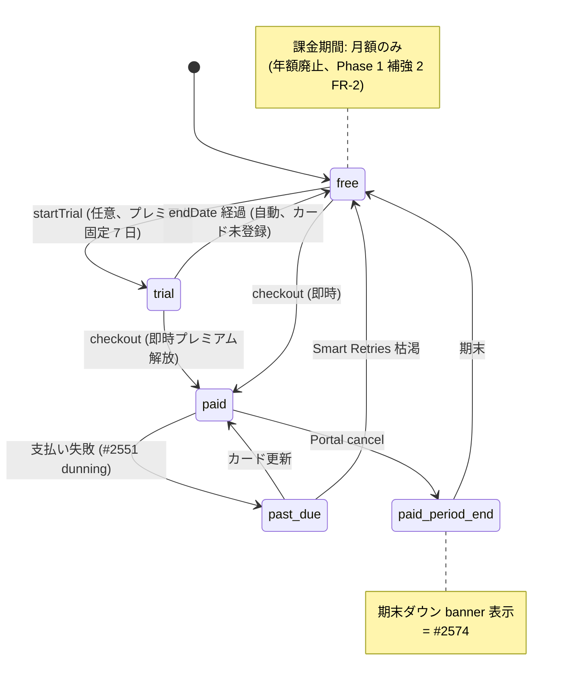

# `/admin/subscription` プランページ UI 設計 (Phase 3 #2567)

| 項目 | 内容 |
|------|------|
| 孫 issue | #2567 (Phase 3 子、SaasSubscriptionPanel 責務純化 + 新方針反映) |
| 親 | #2528 (Phase 3 UI) / Epic #2525 |
| Phase 1+2 整合 | 補強 1 (#2583 URL) + 補強 2 (#2588 プラン命名 / 月額のみ / ROI framing) + Phase 2 補強 (#2585 URL / #2596 プラン命名) |
| Phase 7 rename 方針 | `/admin/license` → `/admin/subscription` / `SaasLicensePanel` → `SaasSubscriptionPanel` / `family` → `プレミアム` (atom 1 行) / 月額のみ (年額 9 件削除) |
| license key 全廃整合 (#2788) | Phase 1 補強 3 (`phase1-license-key-removal-final-requirements.md`、PR #2790 マージ済) で license key = SaaS / NUC 問わず**全廃**確定。本 UI 設計の「ライセンスキー適用 UI」section は **完全削除** (license key 概念消滅、SaaS 認可は `tenant.status=ACTIVE` が唯一 SSOT、NUC は信頼ベースで billing proof 不要)。**naming rename (`/admin/license` → `/admin/subscription`、`SaasLicensePanel` → `SaasSubscriptionPanel`) と license key 概念削除は別軸** (Phase 5 補強 #2798 §2 原則 4 整合)。rename は namespace / route 名の変更、license key 削除は機能の全廃で、rename 完了と license key 削除完了を同一視しない |
| impact-analysis skill 適用 | L1 grep + L2 意味 (表示 vs 内部識別子) + L3 構造 + L4 派生 artifact 21 カテゴリ (docs のため該当なし) |
| 採用案 | C: 4 ページ分割 (`/admin/subscription` + `/confirm` + `/admin/billing` + `/admin/billing/cancel`) |
| `premium` 階層 signal 打消 | `premium` は機能本格度を示す signal であり、**無料プランへの exclusion 意図なし** (refs #2594 D-2)。本 UI 設計で「✓ お勧め」バッジを standard に付与することで「premium = 必須ではない上位選択肢」を視覚化、無料・standard・premium 3 段階で「無料が排除されている印象を与えない」設計を貫徹。LP コピー verification (`FREE_PLAN_TERMS.forever` / `FREE_TERMS.start` 併記) は Phase 4 移行 gate で別途確認 |

## 設計方針 (Phase 1+2 補強の確定事項を反映)

### 機能配置 (4 ページ分割)

```
/admin/subscription              プラン現状 + 選択 + Reverse Trial 残日数 (機能 1, 2, 4)
/admin/subscription/confirm      特商法 6 項目 + proration 差額表示 (機能 3, 8) ← #2573 で起票済
/admin/billing                   請求状態 + Portal SSOT (機能 9)
/admin/billing/cancel            解約 hearing (機能 5、既存維持)
```

本 #2567 は `/admin/subscription` 本体 (旧 `/admin/license`、現 SaasLicensePanel:763 行 → 純化後 ~400 行) の UI 設計に集中。

## SaasSubscriptionPanel 責務純化 (削除 5 + 改善 4 + 維持 3)

| # | 現状機能 (SaasLicensePanel.svelte:L) | 扱い | 移動先 / 改善内容 |
|---|---|---|---|
| 1 | プラン選択 (660-741: standard/family カード) | **維持・改善** | **「お勧め」バッジを standard に付与** (本格度 3 段階モデル、PO 確定 2026-05-28) + 比較表差分強調 |
| 2 | **月年トグル (662-677)** | **削除** | 月額のみ (年額廃止、Phase 1 補強 2 FR-2) |
| 3 | proration 差額表示 | **新規実装** (機能 3 → /admin/subscription/confirm) | `subscriptions.update preview` API |
| 4 | アップグレード CTA | **維持・改善** | 「いつでも解約」CTA 直下併記 (`CANCEL_TERMS.anytimeOk`、Netflix +124% conversion) |
| 5 | 解約導線 | **新規追加** | 控えめ link → `/admin/billing/cancel` (Kinde frictionless) |
| 6 | DowngradeResourceSelector | **維持** (#2575) | 既存、本 #2567 では触れない |
| 7 | 超過リソース選択フロー | **維持** (#2575) | 既存 |
| 8 | 特商法最終確認画面 | **削除** (→ `/admin/subscription/confirm`、#2573) | 別画面分離 |
| 9 | Stripe Portal 遷移ボタン (642-650) | **削除** | `/admin/billing` 一本化 (二重実装解消) |
| 10 | ライセンスキー適用 UI (385-544、170 行) | **完全削除** | license key 全廃 (#2788、概念消滅)。入力フォーム / 適用ボタン / ヘルプ全廃。NUC は信頼ベース (billing proof 不要、`NucSubscriptionPanel` は Edition badge / 全機能無制限ステータス表示のみ、license key 適用 UI は移設しない) |
| 11 | 支払い履歴セクション (764-796) | **削除** | `/admin/billing` link のみ |

→ 削除 5 + 改善 4 + 維持 3 = 純化後 ~400 行 (Phase 7 実装見積)。

## UI 画面構成 (mermaid)

### 図 1: `/admin/subscription` 画面構成

```mermaid
flowchart TB
    Header[Header: plan-badge クリック遷移<br/>= #2568 で実装]
    Sub[/admin/subscription]
    Sub --> Status[現状セクション:<br/>現プラン / Trial 残日数 / 子供数 / 活動数]
    Sub --> Plans[プラン選択セクション:<br/>standard / プレミアム 比較表<br/>「お勧め」バッジは standard]
    Sub --> CTA[CTA: 「プレミアムにする」<br/>+ いつでも解約 OK micro-copy]
    CTA -.「変更前確認」.-> Confirm[/admin/subscription/confirm<br/>= #2573 特商法 6 項目]
    Sub --> Links[フッター link:<br/>請求情報 → /admin/billing<br/>解約検討 → /admin/billing/cancel]
    style Sub fill:#e3f2fd
    style Confirm fill:#fff3e0
```

### 図 2: 状態遷移 (free / trial / paid / past_due、月額のみ)



### 図 3: 削除セクションの分散先 (SaasLicensePanel → SaasSubscriptionPanel)

```mermaid
flowchart LR
    Old[現状 SaasLicensePanel<br/>763 行 7 セクション] --> Pure[/admin/subscription<br/>純化後 ~400 行]
    Old -- 削除 --> Conf[/admin/subscription/confirm<br/>特商法 = #2573]
    Old -- 削除 --> Bill[/admin/billing<br/>Portal / 履歴 SSOT 一本化]
    Old -- 削除 --> Key[ライセンスキー UI 完全削除<br/>license key 全廃 #2788 概念消滅<br/>NUC も信頼ベースで billing proof 不要]
    Pure -- 新規追加 --> Cancel[/admin/billing/cancel<br/>解約導線 = 既存]
    style Old fill:#f8d7da
    style Pure fill:#d4edda
    style Key fill:#f8d7da
```

## 各セクション UI 設計詳細

### A. 現状セクション (上部、ステータスカード)

```
┌─────────────────────────────────────────────┐
│  現在のプラン: プレミアム                   │
│  ご利用開始: 2026-01-15                     │
│  次回更新: 2026-06-15 (¥780 税込/月)        │
│                                              │
│  お子さま 3人 / 無制限                       │
│  活動 12個 / 無制限                          │
└─────────────────────────────────────────────┘
```

trial 中:
```
┌─────────────────────────────────────────────┐
│  プレミアム無料体験中 (残り 4日)            │
│  終了日: 2026-06-04                          │
│  終了後は自動的に無料プランに戻ります       │
│  (カード未登録のため自動課金されません)     │
└─────────────────────────────────────────────┘
```

### B. プラン選択セクション (比較表 + standard お勧めバッジ + 月額のみ)

```
   ┌──────────────[✓ お勧め]──┐  ┌──────────────────────┐
   │ スタンダード             │  │ プレミアム            │
   │ ¥500/月 税込             │  │ ¥780/月 税込          │
   │                          │  │                        │
   │ お子さま 5人             │  │ お子さま 無制限       │
   │ 活動 20件まで            │  │ 活動 無制限            │
   │ 家庭運用に十分           │  │ 月次レポート          │
   │                          │  │ ご家族メッセージ      │
   │                          │  │ 人生記録レベル        │
   └──────────────────────────┘  └──────────────────────┘

   [プレミアムにする]
   いつでも解約できます (契約期間の縛りなし)
```

**注記**: 月年トグル削除 (月額のみ)。「お勧め」バッジは中間 tier (standard) = 本格度 3 段階モデル整合 (PO 確定 2026-05-28、Cornell center-stage effect)。

### C. CTA + cancel-anytime 併記

```
   [プレミアムにする (¥780/月)]
   いつでも解約できます (契約期間の縛りなし)
   カード登録不要で無料体験を開始
```

CTA 文言は Kinde「what happens when clicked」原則。`CANCEL_TERMS.anytimeOk` + `TRIAL_TERMS.noCreditCardMid` を併記 (既存 atom 流用、Phase 1 補強 2 FR-3)。

### D. 谷② ROI framing (V1-V5 不安→解マッピング、Phase 1 補強 2 FR-4)

| 不安 | framing 軸 | 配置 |
|---|---|---|
| F1 (絶対値判断) / F3 (本格度に見合うか) | V1 (月額本体大きく) + V2 (機能 anchor) | プラン card 内、機能列挙 |
| F2 (中間 vs 上位) | V4 (decoy: プレミアム最右 + standard お勧め) | 上記 B セクションで実装 |
| F4 (無料で十分?) | V2 | Reverse Trial 終了時 specific copy |
| F5 (縛り) + F6 (auto-renewal 忘却) | (年額廃止で消失) | F5/F6 は月額のみで自然解消 |
| F7 (家計負担) | V1 + V3 (累積記録価値) | 「お子さまの 6 ヶ月成長記録」等 |
| F11 (cancel friction) | V5 (commitment 安全装置) | 「いつでも解約」CTA 直下 |

**per-seat / cost-per-day / 比較 anchor は不採用** (flat-rate モデルに per-seat 構造矛盾、煽り回避)。

### E. 解約導線 (フッター、控えめ表示)

```
─────────────────────────────────────────────
  他のプランへの切替や解約をご検討の方は
  → ご請求情報 (`/admin/billing`)
  → 解約をご検討の方 (`/admin/billing/cancel`)
─────────────────────────────────────────────
```

**Kinde frictionless 原則**: 隠さない + 目立たせない (`text-xs + text-tertiary` 等)、ADR-0012 整合。

## 文言 atom (terms.ts/labels.ts、ADR-0045 整合)

既存 atom 流用 (Phase 1 補強 2 FR-3 で新規不要確定):
- `PLAN_TERMS.standard` / `.premium` (Phase 7 で `.family` → `.premium` rename)
- `PRICE_TERMS.standard` (¥500) / `.premium` (¥780) / `.taxNote`
- `TRIAL_TERMS.durationSpaced` (7 日間) / `.noCreditCardMid`
- `CANCEL_TERMS.anytimeOk`
- `CTA_TERMS.freeTrialVerb`

新規 compound (labels.ts) は `SUBSCRIPTION_PAGE_LABELS` (Phase 7 rename、現 `LICENSE_PAGE_LABELS` 構造継承):

```ts
SUBSCRIPTION_PAGE_LABELS = {
  pageTitle: 'ご家族のプラン管理',
  currentPlan: '現在のプラン',
  trialActive: `${PLAN_TERMS.premium}${TRIAL_TERMS.durationSpaced}無料体験中`,
  upgradeCta: `${PLAN_FULL_TERMS.premium}にする`,
  cancelAnytime: CANCEL_TERMS.anytimeOk,
  noCreditCard: TRIAL_TERMS.noCreditCardMid,
  billingLink: 'ご請求情報を確認',
  cancelLink: '解約をご検討の方',
  standardRecommendBadge: '✓ お勧め',  // standard に付与 (PO 確定)
}
```

## ADR-0012 整合性チェック

| 観点 | 適合 |
|---|---|
| 子供 UI に課金圧をかけない | ✅ `/admin/*` のみ (子供画面非表示) |
| 滞在時間を伸ばさない | ✅ 即時遷移 / 演出なし / 静的表示 |
| サプライズ濫用禁止 | ✅ trial 終了通知は 3 タッチ限定 (TrialBanner #2571 担当) |
| 連続演出 / 煽り禁止 | ✅ CTA 文言「what happens when clicked」/ 「あと N 日!」型不採用 / per-seat 煽り不採用 |
| 解約動線を隠さない | ✅ フッターに控えめ link (Kinde frictionless) |
| 年額 sunk cost lock-in 排除 | ✅ 月額のみ (Phase 1 補強 2 FR-2) |

## impact-analysis skill 4 layer 防御適用

### L1 構文 (ast-grep / ripgrep)
- 旧 `LICENSE_PAGE_LABELS` 参照: 218 件 (Phase 1 補強 1 確認済、Phase 7 atom rename で自動伝播)
- `family` (英語、表示文): atom 経由 95 件 (Phase 7 atom 1 行修正)

### L2 意味 (型 / 同名異義)
- 表示プラン名 (`PLAN_TERMS.family`) vs 内部識別子 (`'family'` enum / `family-tenant`) の区別: Phase 1 補強 2 FR-5 で明文化済
- `LICENSE_KEY_STATUS` / `LICENSE_PLAN` enum + `licenseKey` 列は license key 全廃軸 (#2788 §3.8) で**物理削除**対象 (本 UI 設計と直交、Phase 7 実装 PR-L5 で対応)。本画面に license key の表示・入力要素は残さない

### L3 構造 (依存グラフ)
- `SaasLicensePanel.svelte` 依存: 11 件 (削除候補ファイル特定済、Phase 7 実装で対応)
- `/admin/license` ルート参照: 308 件 (Phase 1 補強 1 LEGACY_URL_MAP で永久リダイレクト)

### L4 派生 artifact 21 カテゴリ (本 #2567 は docs のため該当なし)
本 PR は UI 設計 docs のみで、A-G 全カテゴリの派生 artifact 影響なし。Phase 7 実装 PR で 21 カテゴリ checklist 適用必須。

## Storybook stories 設計

```typescript
// SaasSubscriptionPanel.stories.svelte (Phase 7 rename 後)
- FreePlan        // 無料ユーザ、プラン選択画面 (standard お勧めバッジ表示)
- TrialActive     // Reverse Trial 中 (残 4 日、プレミアム表示)
- TrialEnding     // Reverse Trial 終了直前 (残 1 日)
- StandardActive  // standard 加入中、プレミアム upgrade 提示
- PremiumActive   // プレミアム加入中、現状表示 + ダウン導線
- PastDue         // 支払い失敗中 (#2551 dunning 統合)
- ScheduledDowngrade  // 期末ダウン中 (#2574 banner 統合)
```

## Playwright SS 取得計画

| 変数 | URL | 状態 | 用途 |
|---|---|---|---|
| `subscription-free` | `/admin/subscription` | 無料ユーザ | 比較表 + standard お勧めバッジ |
| `subscription-trial-active` | `/admin/subscription` | Reverse Trial 中 | trial 表示 + CTA |
| `subscription-premium-active` | `/admin/subscription` | プレミアム加入中 | 現状表示 + ダウン導線 |
| `subscription-confirm` | `/admin/subscription/confirm` | 特商法 6 項目 | #2573 整合 |

## テスト計画 (Phase 3 完了基準、memory test-coverage-every-issue 整合)

- **結合テスト**: SaasSubscriptionPanel + Stripe `create_preview` mock + DowngradeResourceSelector 表示
- **E2E**: 6 状態の遷移確認 (free→trial→paid→premium→standard→cancel→free)
- **Storybook test**: 7 variant 全表示確認
- **Playwright SS レビュー**: 4 SS 取得、UX レビュー (3 ペルソナ: 1人っ子家庭 / 兄弟複数 / 卒業期)
- **UX レビュー**: F1-F11 顧客不安の感じ方確認 (Phase 1 補強 2 FR-4 整合)

## Phase 7 実装手順 (本 #2567 は docs のみ、実装は Phase 7)

1. atom rename: `PLAN_TERMS.family` → `PLAN_TERMS.premium` (1 行修正で 95 件自動伝播)
2. コンポーネント rename: `SaasLicensePanel.svelte` → `SaasSubscriptionPanel.svelte`
3. ルート rename: `/admin/license/` → `/admin/subscription/`
4. `LEGACY_URL_MAP` 永久エントリ追加
5. 削除 5 セクション (Portal / 履歴 / 特商法 / ライセンスキー / 月年トグル) 実装。**ライセンスキー section 削除は license key 全廃軸 (#2788、naming rename とは別軸)** — 入力フォーム / 適用ボタン / ヘルプを完全撤去し、移設先 (NUC 含む) を作らない
6. 改善 4 項目 (お勧めバッジ standard / 比較表差分強調 / cancel-anytime CTA / 解約導線) 実装
7. Storybook + Playwright SS 撮影 + UX レビュー
8. impact-analysis skill 4 layer 防御 + 21 カテゴリ checklist を PR body に記載

## Open question (PO 判断、Phase 7 実装時に確認)

| # | 論点 | 状態 |
|---|---|---|
| 1 | trial 状態の表示形式 (上部カードのみ採用、TrialBanner と統合検討) | PO 確定 2026-05-28 (上部カードのみ) |
| 2 | 解約導線文言「他のプランへの切替や解約をご検討の方は」 | 暫定、Phase 3 UI 実装時に微調整 |
| 3 | F3 (本格度に見合うか) の機能列挙の優先順 | Phase 7 実装時に PO レビュー |
| 4 | 削除セクション (Portal/履歴/ライセンスキー) のユーザー周知 | **不要** (現利用ユーザーゼロ、PO 確定 2026-05-28) |

## 根拠

- Phase 1 補強 1 (#2583 naming-url-integrity)・補強 2 (#2588 plan-naming-pricing-axis)・補強 3 (#2788 / PR #2790 license-key-removal-final-requirements、license key 全廃 = naming rename と別軸)
- Phase 5 補強 (#2798) §2 原則 4「naming rename ≠ license key 削除」を Phase 3 UI 設計でも踏襲
- Phase 2 補強 (#2585 URL / #2596 プラン命名)
- 既存実装: `SaasLicensePanel.svelte:165-763` (現名、Phase 7 で rename)
- ADR-0012 (Anti-engagement) / ADR-0045 (terms.ts 2 階層) / ADR-0051 (NUC-SaaS Bifurcation)
- Kinde Plan Change Best Practices / Netflix +124% conversion / Cornell center-stage effect
- skill `impact-analysis` (4 layer 防御 + 21 カテゴリ checklist)
- 関連 memory: feedback_plan_name_implementation_gap / feedback_roi_framing_customer_anxiety_axis / reference_impact_analysis_methodology
