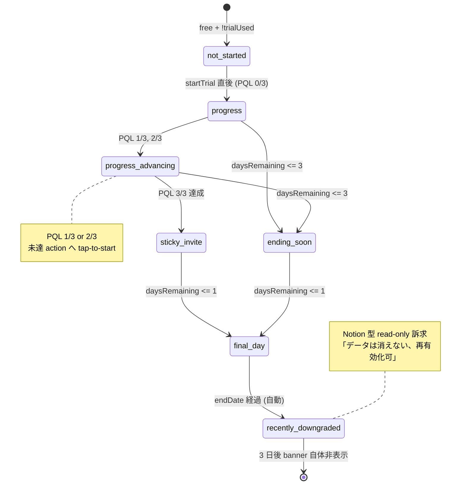

# TrialBanner UI 設計 (Reverse Trial 進捗フレーミング、Phase 3 #2571)

| 項目 | 内容 |
|------|------|
| 孫 issue | #2571 (Phase 3 子、TrialBanner UI = Reverse Trial 進捗フレーミング) |
| 親 | #2528 (Phase 3 UI) / Epic #2525 |
| Phase 1 整合 | 補強 2 ([phase1-plan-naming-pricing-axis-requirements.md](phase1-plan-naming-pricing-axis-requirements.md): プレミアム rename / 月額のみ / trial プレミアム固定 7 日 / F1-F11 顧客不安) |
| Phase 2 整合 | [phase2-trial-journey.md](phase2-trial-journey.md): Reverse Trial 標準モデル / sticky paid feature 中間山 / PQL = 3 core action / 谷①「あと N 日!」型禁止 → 進捗フレーミング / 降格 3 タッチ + メール 1 件 |
| Phase 3 兄弟 | #2567 [phase3-subscription-page-ui-design.md](phase3-subscription-page-ui-design.md) 「現状セクション」と責務分離 / #2568 AdminLayout header `plan-badge` クリック遷移と表示境界 |
| 採用方針 | 既存 TrialBanner (`src/lib/features/admin/components/TrialBanner.svelte`) を残日数表示型から **進捗フレーミング + 3 タッチ end-notice + PQL 可視化** へ責務拡張。表示境界は subscription page / header との 3 点重畳を回避 |
| impact-analysis | L1 grep + L2 表示 vs 内部識別子 + L3 構造 (AdminLayout / subscription / header 重複なし) + L4 docs のため該当なし |

## 1. 設計背景 (なぜこの設計がなかったら困るか)

現 TrialBanner (`TrialBanner.svelte`:96 行) は `daysRemaining` の数値表示と「⏰ あと 1 日」型 urgent 強調を採用しており、以下の構造的問題を抱える:

| # | 問題 | 根拠 |
|---|------|------|
| 1 | **「あと N 日!」型の loss aversion 煽り** | ADR-0012 Anti-engagement「サプライズ濫用 / 連続演出 / 失う恐怖型コピー禁止」違反、Phase 2 谷①再フレーミング指針未反映 |
| 2 | **sticky paid feature への aha 導線が存在しない** | Phase 2 中間山 #2「家族全員見守り画面 = aha moment」が banner では露出ゼロ、conversion 25% 未達リスク (Reverse Trial 業界比) |
| 3 | **PQL (3 core action) 計測 / 可視化なし** | Phase 2 中間山 #4 PQL 達成が banner に出ず、低 PQL ユーザを onboarding 強化対象として識別できない |
| 4 | **降格時の data 持続フレーミング欠落** | 現 expired variant `bannerDescExpired` は「アップグレードで全機能をご利用」とのみ表示、Reverse Trial の data persistence (Notion 型 read-only) 価値訴求がゼロ |
| 5 | **subscription page (#2567) / header (#2568) との表示境界未定義** | 同一画面で 3 重 trial 表示 (banner + header badge + subscription 上部カード) が発生し情報冗長 |
| 6 | **a11y / aria-live 未設定** | 残日数更新が screen reader に通知されず、視覚障害者の trial 残期把握不能 |

→ 「残日数を出すだけ」から「**家庭仕様化の進捗 + 課金 hook + 安心の data 持続 + 3 タッチ end-notice**」へ責務拡張が必要。

## 2. 設計原則

### 原則 1: 進捗フレーミング (ADR-0012 整合、Phase 2 谷① 再フレーミング)

「**あと N 日**」型でなく「**あなたの家庭仕様化まであと N ステップ**」型 (Calendly モデル応用、煽らない方向):

- ❌ NG: `${daysRemaining}日で終了します` / `明日終了!` / `急いで!`
- ⭕ OK: `家族仕様化まであと 2 ステップ (PQL 1/3 達成)` / `お子さま 2 人目の活動セット未設定`

**根拠**: Phase 2 journey §「谷① #5 終了接近」+ Userpilot Calendly review「downgrade as save moment, not access cutoff」+ Anti-engagement 原則。

### 原則 2: PQL 3 core action 可視化

Phase 2 中間山 #4 で定義した PQL = `子供登録 1 件 + 活動カスタマイズ 1 件 + ごほうび設定 1 件`。**3/3 達成で「家庭仕様化 完了」**、未達でも `1/3` `2/3` で進捗可視化。

```
[●●○] 家庭仕様化 2/3 達成
  ✓ お子さま登録
  ✓ 活動カスタマイズ
  ○ ごほうび設定 (タップして開始)
```

3/3 達成時は trial 中残期表示を消し、「家族全員見守り画面で確かめる」CTA に切替 (sticky paid feature 中間山 #2 への送客)。

### 原則 3: 3 タッチ end-notice (ADR-0012 通知連打禁止整合)

降格 24h 前 / 当日 / 3 日後の 3 タッチ + 親宛メール 1 件のみ。Push 不使用、子供画面ゼロ通知。

| タイミング | banner variant | 文言の核 |
|---|---|---|
| trial 中盤 (残 3 日以上) | `progress` | 「家庭仕様化まであと N ステップ」 |
| trial 終盤 (残 24h-72h) | `ending-soon` | 「家族全員見守り画面で○○を確かめましたか?」(sticky feature 体験促進) |
| trial 当日 (残 ≤24h) | `final-day` | 「明日から無料プランへ自動で戻ります。カードは未登録のままです」(安心訴求) |
| 降格直後 (3 日間) | `recently-downgraded` | 「あなたが trial 中に作った活動 12 件、無料では 3 件のみ子供画面に配信されます。残り 9 件は保護されたまま、いつでも再有効化できます」(Notion 型 read-only) |

**最大 1 件のみ同時表示**。expired (旧来) + recently-downgraded (新規) は同じ variant 扱いだが、3 日経過後は banner 自体を非表示にする (永続的「期限切れ表示」禁止 = ADR-0012 失敗演出回避)。

### 原則 4: 表示境界 (subscription / header / banner 3 重防止)

| 場所 | 役割 | trial 表示要素 |
|------|------|---------------|
| **AdminLayout header** (#2568、`plan-badge`) | 全画面 sticky で「現プラン」を 1 行通知 | `プレミアム体験中 (残 N 日)` の **1 行 + クリックで `/admin/subscription` 遷移** のみ |
| **TrialBanner** (本 #2571) | `/admin/*` 配下 (subscription / billing 系を除く) で進捗 + 3 タッチ end-notice 表示 | **進捗フレーミング + PQL + sticky feature 送客 + data 持続訴求** |
| **`/admin/subscription` 上部カード** (#2567) | 「現状セクション」に詳細 (終了日 / 自動降格説明) | banner と重複させない (subscription page では banner 非表示) |

**実装ルール**:
- TrialBanner は `+layout.svelte` 配下で `$page.url.pathname.startsWith('/admin/subscription')` なら描画 skip (subscription 内では上部カード SSOT)
- TrialBanner は `$page.url.pathname.startsWith('/admin/billing')` でも非表示 (請求情報画面では distraction を増やさない)
- header `plan-badge` は **常時表示**、TrialBanner と内容重複しない短文に統一 (header = 1 行残期 / banner = 進捗内訳)

### 原則 5: 子供画面ゼロ露出

`(child)/[uiMode=uiMode]/` 配下では一切表示しない (ADR-0012 + ADR-0011 baby = 親準備モード)。`+layout.svelte` の `data.authMode !== 'local'` 判定 + `/admin/*` 配下 layout に限定描画する既存制約を維持。

## 3. UI 画面構成

### 3.1 variant 一覧 (4 種、PQL 段階で枝分かれ)



### 3.2 variant 別 UI モック

#### A. `not-started` (既存維持、軽微調整)

```
┌────────────────────────────────────────────────────────┐
│ 🎁  プレミアムを 7 日間 無料で試す                    │
│     カード登録不要、終了後は自動で無料プランへ        │
│                                  [無料で試す]          │
└────────────────────────────────────────────────────────┘
```

#### B. `progress` (新規、PQL 段階を可視化)

```
┌──────────────────────────────────────────────────────┐
│ ⭐  プレミアム体験中                                  │
│     家庭仕様化まであと 2 ステップ                    │
│     [●●○] お子さま登録 ✓  活動カスタマイズ ✓        │
│                       ごほうび設定 (未完了 →タップ) │
└──────────────────────────────────────────────────────┘
```

- 残日数の **数値表示を意図的に出さない** (header sticky に委譲、ADR-0012 「失う恐怖」回避)
- 未完了 PQL action は tap-to-start (該当画面へ直リンク、Fitts's Law)
- PQL 3/3 達成時は variant `sticky-invite` (下記 C) に自動遷移

#### C. `sticky-invite` (新規、aha moment 送客)

PQL 完了後、sticky paid feature 体験を促進 (Phase 2 中間山 #2):

```
┌──────────────────────────────────────────────────────┐
│ 👨‍👩‍👧‍👦  家庭仕様化が完成しました                       │
│     家族全員の見守り画面で、今週の様子を確かめましょう│
│                                  [見守り画面へ]       │
└──────────────────────────────────────────────────────┘
```

#### D. `ending-soon` (新規、残 24h-72h、sticky feature 体験促進)

```
┌──────────────────────────────────────────────────────┐
│ ⭐  プレミアム体験 まもなく終了                      │
│     家族全員の見守り画面 を確かめましたか?           │
│     (このあと無料プランへ自動で戻ります、カード未登録)│
│                                  [見守り画面へ]       │
└──────────────────────────────────────────────────────┘
```

#### E. `final-day` (新規、残 ≤24h、安心訴求)

```
┌──────────────────────────────────────────────────────┐
│ ⭐  明日から無料プランへ自動で戻ります               │
│     カードは未登録のままです。作成したデータは残ります│
│                  [プランを見る]  [このまま無料で続ける]│
└──────────────────────────────────────────────────────┘
```

#### F. `recently-downgraded` (旧 expired を Notion 型 read-only に再フレーム)

```
┌──────────────────────────────────────────────────────┐
│ 📦  プレミアム体験は終了しました                     │
│     trial 中に作った 活動 12 件 のうち、              │
│     無料では 3 件のみ子供画面に配信されます。        │
│     残り 9 件は保護されたまま、いつでも再有効化できます│
│                                  [プランを見る]       │
└──────────────────────────────────────────────────────┘
```

- 3 日経過後は **banner 自体を非表示**にする (永続「失敗演出」回避、ADR-0012)
- カウントは server から `archivedSummary` 派生 (既存 props 流用、追加 fetch 不要)

### 3.3 表示優先順位 (同時条件発生時)

1. `recently-downgraded` (降格直後 3 日、最優先)
2. `final-day` (残 ≤24h)
3. `ending-soon` (残 24h-72h)
4. `sticky-invite` (PQL 3/3 達成)
5. `progress` (PQL <3/3、trial 中盤)
6. `not-started` (未開始)

## 4. terms.ts / labels.ts atom (ADR-0045 整合)

### 既存 atom 流用 (新規追加 0)

| atom | 用途 |
|---|---|
| `TRIAL_TERMS.durationDays` (= 7) | 7 日表記の SSOT、Phase 1 補強 2 で `family` → `premium` rename 後も atom 値変更不要 |
| `TRIAL_TERMS.noCreditCardMid` (= "カード登録不要") | not-started + final-day variant |
| `PLAN_FULL_TERMS.premium` (Phase 7 rename 後) | 「プレミアム体験中」のプラン名部分 |
| `CTA_TERMS.freeTrialVerb` (= "無料で試す") | not-started variant ボタン |
| `CANCEL_TERMS.anytimeOk` (= "いつでも解約できます（契約期間の縛りなし）") | final-day variant micro-copy |

### 新規 compound (labels.ts、`TRIAL_LABELS` 拡張)

```ts
TRIAL_LABELS = {
  // === 既存維持 (削除候補は別 PR) ===
  durationDays: TRIAL_TERMS.durationDays,
  bannerTitleNotStarted: `${TRIAL_TERMS.duration}、全機能を${ACTION_LABELS.freeTrialDesc}`,
  bannerDescNotStarted: `${PLAN_FULL_TERMS.premium}のすべての機能をお使いいただけます。${TRIAL_TERMS.noCreditCardMid}。`,
  bannerCtaStart: `${CTA_TERMS.freeTrialVerb}`,

  // === 新規 (本 #2571 で追加) ===
  // progress variant
  bannerTitleProgress: `${PLAN_FULL_TERMS.premium}体験中`,
  bannerDescProgress: (remainingSteps: number) =>
    `家庭仕様化まであと ${remainingSteps} ステップ`,
  pqlActionChildRegister: 'お子さま登録',
  pqlActionActivityCustomize: '活動カスタマイズ',
  pqlActionRewardSetup: 'ごほうび設定',
  pqlActionTapToStart: 'タップして開始',

  // sticky-invite variant
  bannerTitleStickyInvite: '家庭仕様化が完成しました',
  bannerDescStickyInvite: '家族全員の見守り画面で、今週の様子を確かめましょう',
  bannerCtaStickyInvite: `${ADMIN_VIEW_TERMS.canonical}へ`,

  // ending-soon variant
  bannerTitleEndingSoon: `${PLAN_FULL_TERMS.premium}体験 まもなく終了`,
  bannerDescEndingSoon: `${ADMIN_VIEW_TERMS.canonical} を確かめましたか?（このあと${PLAN_FULL_TERMS.free}へ自動で戻ります、${TRIAL_TERMS.noCreditCardMid}）`,

  // final-day variant
  bannerTitleFinalDay: `明日から${PLAN_FULL_TERMS.free}へ自動で戻ります`,
  bannerDescFinalDay: `${TRIAL_TERMS.noCreditCardMid}のままです。作成したデータは残ります`,
  bannerCtaFinalDayContinueFree: `このまま${PLAN_TERMS.free}で続ける`,

  // recently-downgraded variant (旧 expired を Notion 型 read-only に再フレーム)
  bannerTitleRecentlyDowngraded: `${PLAN_FULL_TERMS.premium}体験は終了しました`,
  bannerDescRecentlyDowngraded: (createdCount: number, freeLimit: number) =>
    `trial 中に作った 活動 ${createdCount} 件 のうち、${PLAN_LABELS.free}では ${freeLimit} 件のみ子供画面に配信されます。残り ${createdCount - freeLimit} 件は保護されたまま、いつでも再有効化できます`,
  bannerCtaViewPlans: ACTION_LABELS.viewPlans,
} as const;
```

**禁忌**:
- ❌ `「あと N 日で終了します」` の atom 化禁止 (ADR-0012 違反、Phase 2 谷①再フレーミング指針)
- ❌ `「急いで」` `「お見逃しなく」` 系煽り atom 禁止
- ❌ プラン文字列直書き (例: `「ファミリープラン体験中」` `「7日」`) は ADR-0045 違反 → `PLAN_FULL_TERMS` / `TRIAL_TERMS` 経由

### Storybook 用 (`STORYBOOK_LABELS.trialBanner.*`)

Storybook ラベル言語ポリシー (DESIGN.md §6) に従い、stories.svelte 内の表示テキストは labels.ts 経由で参照する。

## 5. アクセシビリティ (a11y)

| 観点 | 設計 |
|---|---|
| **aria-live** | banner ルートに `aria-live="polite"` + `aria-atomic="true"` 設定。variant 切替時 (progress → ending-soon 等) を screen reader に通知 |
| **aria-label** | progress variant の PQL pip group に `aria-label="家庭仕様化の進捗 2/3 達成"` |
| **focus 順序** | tap-to-start link は variant 内で 1 件のみ、CTA ボタンは末尾固定 (Tab で必ず最後にフォーカス) |
| **コントラスト比** | `var(--color-text-primary)` on `var(--gradient-surface-trial)` で WCAG AA (4.5:1) を満たすトークン使用、`urgent` 色 (旧来 `--color-action-trial-upgrade`) は本設計では使用しない (loss aversion 排除) |
| **タップサイズ** | banner 内 CTA は admin scope (44px / Material Design 最小)。年齢帯 fontScale は admin layout = 親向けのため適用不要 |
| **キーボードナビ** | PQL pip 各 action は `<a href="...">` (Fitts's Law + キーボード Tab 到達可能) |
| **screen reader 文** | 数値カウントは `bannerDescRecentlyDowngraded(createdCount=12, freeLimit=3)` のように個別引数で formatter 化 (sentence template でなく数値 atom を分離) |
| **モーション** | banner 内アニメーションなし (ADR-0012 連続演出禁止) |

## 6. Phase 2 整合性検証

| Phase 2 ジャーニー要素 | 本 banner 実装での反映 |
|---|---|
| 中間山 #2 sticky paid feature 体験 | `sticky-invite` variant で `見守り画面へ` CTA |
| 中間山 #4 PQL 達成可視化 | `progress` variant の `[●●○]` pip + tap-to-start |
| 谷① loss aversion 「資産保護」型再フレーム | 「あと N 日!」型 atom 全廃 + 進捗ステップ式 |
| 最終山 #6b 無料降格でも安心 | `recently-downgraded` Notion 型 read-only 訴求 (「データは消えない」明示) |
| 3 タッチ end-notice + メール 1 件 | variant `ending-soon` (24h-72h) + `final-day` (≤24h) + `recently-downgraded` (3 日後消失) |
| 子供画面ゼロ通知 | admin layout 限定描画 + child path skip 既存制約維持 |
| カスタマイズ持続性 (PO 戦略) | `recently-downgraded` で「上限超過分は保護されたまま、いつでも再有効化」明示 |

## 7. ADR-0012 整合性チェック (本設計の最終 gate)

| 観点 | 適合 |
|---|---|
| 子供 UI に課金圧をかけない | ✅ admin layout 限定描画 + child path 全 skip |
| 滞在時間 = 価値毀損 | ✅ banner 自体に dwell 機構なし (アニメーションゼロ、CTA は 1 step 遷移) |
| サプライズ濫用禁止 | ✅ 3 タッチ end-notice (24h-72h / ≤24h / 3 日後消失) のみ、それ以前は静的 progress 表示 |
| 通知連打禁止 | ✅ 同時表示 banner 最大 1 件、Push 不使用、メール 1 件のみ (parent 向け) |
| 連続ガチャ / 煽り禁止 | ✅ 「あと N 日!」「お見逃しなく」型 atom 禁止 (§4 禁忌)、loss aversion は「資産保護」型のみ |
| 販促文言審査 | ✅ 「カード未登録」「データは残ります」「いつでも再有効化」を**家族尊重主張**として打ち出す |
| 失敗演出禁止 | ✅ `recently-downgraded` は 3 日経過で banner 自体消失、永続的「失敗表示」回避 |

→ **Reverse Trial プレイブック + Anti-engagement 原則と本質的に整合**。

## 8. Storybook stories 設計

```typescript
// TrialBanner.stories.svelte (Phase 7 実装)
- NotStarted             // 未開始 free user (既存維持)
- Progress_0_3           // trial 開始直後、PQL 0/3
- Progress_1_3           // PQL 1/3
- Progress_2_3           // PQL 2/3
- StickyInvite           // PQL 3/3、家族見守り送客
- EndingSoon             // 残 72h-24h
- FinalDay               // 残 ≤24h
- RecentlyDowngraded     // 降格直後 (上限超過カウント = 12 件中 3 件配信例)
- HiddenOnSubscription   // /admin/subscription 配下で非表示確認 (boundary test)
- HiddenOnChild          // /elementary/home 配下で非表示確認 (boundary test)
```

**ラベル**: `STORYBOOK_LABELS.trialBanner.*` で日本語表示テキスト集約 (DESIGN.md §6 Storybook ラベル言語ポリシー)。

## 9. Playwright SS 取得計画 (Phase 7 実装時)

| 変数 | URL | 状態 | 用途 |
|---|---|---|---|
| `trial-banner-progress-1-3` | `/admin/home` | trial active + PQL 1/3 (子供登録のみ) | mobile + desktop |
| `trial-banner-progress-2-3` | `/admin/home` | trial active + PQL 2/3 | mobile + desktop |
| `trial-banner-sticky-invite` | `/admin/home` | trial active + PQL 3/3 | 中間山 #2 への送客導線確認 |
| `trial-banner-ending-soon` | `/admin/home` | trial active + daysRemaining = 2 | 残 48h 文言 + 見守り画面 CTA |
| `trial-banner-final-day` | `/admin/home` | trial active + daysRemaining = 1 | 「明日から自動で戻ります」+ 2 ボタン併置 |
| `trial-banner-recently-downgraded` | `/admin/home` | trial 終了直後 + archivedSummary 12 件 / 3 件 | Notion 型 read-only 訴求 |
| `trial-banner-hidden-subscription` | `/admin/subscription` | 同条件で banner 非表示 | 表示境界確認 (subscription 上部カード SSOT) |
| `trial-banner-hidden-child` | `/elementary/home` | trial active | 子供画面ゼロ露出確認 |

**DEBUG_TRIAL env 経由で擬似状態生成**: `src/lib/server/debug-plan.ts` の `DEBUG_TRIAL` / `DEBUG_TRIAL_TIER` を SS 撮影時に注入 (capture script 拡張)。

## 10. テスト計画 (Phase 3 完了基準、test-coverage-every-issue 整合)

- **unit test (vitest)**: variant 判定ロジック (PQL count / daysRemaining / pathname boundary) の 8 ケース (`tests/unit/components/trial-banner-display.test.ts` 拡張)
- **Storybook test**: 9 variant 全表示 + `play()` 内 aria-live attribute presence assert
- **E2E (playwright)**: 既存 `tests/e2e/trial-banner-display.spec.ts` を拡張
  - シナリオ 1: free → not-started 表示 → startTrial → progress 0/3 表示
  - シナリオ 2: 活動カスタマイズ完了 → progress 1/3 → 子供登録 → 2/3 → ごほうび設定 → 3/3 → sticky-invite
  - シナリオ 3: DEBUG_TRIAL で残 1 日 → final-day variant 表示 → endDate 経過 → recently-downgraded → 3 日後非表示
  - シナリオ 4: `/admin/subscription` 遷移時に banner 非表示確認 (表示境界)
  - シナリオ 5: `/elementary/home` 遷移時に banner 非表示確認 (子供画面ゼロ露出)
- **UX レビュー**: Phase 2 §「ペルソナ別 UX レビュー観点」3 ペルソナ (1 人っ子 / 兄弟複数 / 卒業期) で SS 確認、Phase 1 補強 2 F1-F11 顧客不安の感じ方確認

## 11. impact-analysis skill 4 layer 防御適用

### L1 構文 (ast-grep / ripgrep)

- `TRIAL_LABELS.*` 参照件数: 既存 12 件 (本 PR scope では新規 atom 追加のみで既存参照は維持)
- `'TrialBanner'` import 参照: 1 件 (`+layout.svelte:5`、本 PR では import 維持)
- `daysRemaining` 直書き表記の grep: tests 5 件 (variant 拡張に伴い test 拡張、本 docs PR では実装変更なし)

### L2 意味 (型 / 同名異義)

- 表示 (`PLAN_FULL_TERMS.premium`) vs 内部識別子 (`tier='family'` / `'family-tenant'`) の区別: Phase 1 補強 2 FR-5 で明文化済、本設計でも表示のみ premium rename 後の文言で記述
- `recently-downgraded` variant は既存 `bannerTitleExpired` の **意味上の supersede** だが、命名衝突回避のため atom key を変更 (`bannerTitleExpired` は Phase 7 削除候補だが、本 PR docs scope 外)

### L3 構造 (依存グラフ)

| 関連 component | 重複検証 | 結果 |
|---|---|---|
| `AdminLayout` header `plan-badge` (#2568) | 「現プラン + 残日数 1 行」表示 | TrialBanner は「進捗 + 3 タッチ」、内容重複なし |
| `/admin/subscription` 上部カード (#2567) | 「終了日 / 自動降格説明」表示 | TrialBanner は subscription path で非表示 (boundary) |
| `TrialEndedDialog` (`+layout.svelte:72`) | 終了直後 modal 1 回 | TrialBanner `recently-downgraded` と表示順序整理: modal 閉じる → banner へ移行、3 重表示回避 |
| `DowngradeResourceSelector` (#2575) | 上限超過リソース選択 | TrialBanner は表示のみ、操作は subscription/billing 配下に集約 |

### L4 派生 artifact 21 カテゴリ

本 PR は UI 設計 docs のみで、A-G 全カテゴリの派生 artifact 影響なし。Phase 7 実装 PR で 21 カテゴリ checklist 適用必須:
- 特に **C-7 Stripe** (本 banner では Stripe 非経由のため該当なし) / **D-11 analytics event name** (PQL 計測のため新規 event 命名 SSOT 化必要、follow-up Issue) / **G-19 fixture / snapshot** (Storybook 9 variant の snapshot 追加、Phase 7) を留意。

## 12. Phase 7 実装手順 (本 #2571 は docs のみ、実装は Phase 7)

1. `labels.ts` の `TRIAL_LABELS` に §4 新規 atom 追加 (旧 `bannerTitle*` / `bannerDesc*` は Phase 7 完了時に削除、後方互換期間中は両立)
2. `TrialBanner.svelte` を 4 variant 拡張: `not-started` / `progress` / `sticky-invite` / `ending-soon` / `final-day` / `recently-downgraded` の 6 variant 判定ロジック実装
3. `aria-live="polite"` + `aria-atomic="true"` + `aria-label` 追加 (§5)
4. `+layout.svelte` の `showTrialBanner` derived に `!path.startsWith('/admin/subscription')` + `!path.startsWith('/admin/billing')` 追加 (boundary)
5. PQL 計測 source 確定: 既存 analytics 層 (`src/lib/analytics/`) で `pqlActionCount` を server-side 集計 → `+layout.server.ts` で props 注入
6. archivedSummary 拡張: 既存 `archivedSummary.archivedChildCount` に加え `archivedActivityCount` / `archivedActivityFreeLimit` を追加 (Notion 型 read-only カウント表示用)
7. Storybook 9 variant stories 追加 (§8)
8. E2E 5 シナリオ追加 (§10)
9. impact-analysis 4 layer + 21 カテゴリ checklist を PR body 記載

## 13. Open question (PO 判断、Phase 7 実装時に確認)

| # | 論点 | 状態 |
|---|---|---|
| 1 | PQL 3 core action の最終確定 (現案: 子供登録 / 活動カスタマイズ / ごほうび設定) | Phase 2 で暫定、Phase 7 で analytics 実装時に PO 最終確認 |
| 2 | `recently-downgraded` の 3 日後消失タイミング (24h / 72h / 7 日のいずれか) | 暫定 3 日 (72h)、A/B 候補 (Phase 7 follow-up Issue) |
| 3 | `ending-soon` の起動閾値 (残 24h-72h で実装、48h 単一 threshold もあり) | 暫定 daysRemaining ≤ 3 かつ > 1、Phase 7 実装時に SS 確認 |
| 4 | trial 期間 7 日 → 14 日 A/B 候補 (Phase 2 Open question #1 と連動) | `TRIAL_TERMS.duration` atom 1 行変更で SSOT 伝播、本設計は 7 日前提だが 14 日でも UI 文言不変 |
| 5 | sticky-invite CTA 遷移先 (現案: `/admin/status` 家族全員見守り) | 中間山 #2 整合、Phase 7 で実装時に URL 最終確定 |
| 6 | `recently-downgraded` のリソース種別 (現案: 活動のみ) | お子さま / ごほうび / チャレンジも対象なら追加 atom 必要、Phase 7 で確定 |

## 14. 根拠

- Phase 1 補強 2 ([phase1-plan-naming-pricing-axis-requirements.md](phase1-plan-naming-pricing-axis-requirements.md)): プレミアム rename / 月額のみ / F1-F11 顧客不安
- Phase 2 ジャーニー ([phase2-trial-journey.md](phase2-trial-journey.md)): Reverse Trial 4 核要素 / sticky paid feature 中間山 / PQL 3 core action / 谷①再フレーミング / 降格 3 タッチ
- Phase 3 兄弟 #2567 ([phase3-subscription-page-ui-design.md](phase3-subscription-page-ui-design.md)): subscription 上部カードとの責務分離
- 既存実装: `src/lib/features/admin/components/TrialBanner.svelte:96` (現状残日数型) / `src/lib/server/services/trial-service.ts:11-25` (TrialStatus 型) / `src/routes/(parent)/admin/+layout.svelte:35-69` (showTrialBanner derived)
- ADR-0010 (Pre-PMF Bucket A: trial conversion = revenue 直結) / ADR-0011 (baby 親準備モード) / ADR-0012 (Anti-engagement) / ADR-0013 (LP truth) / ADR-0045 (atom/compound 2 階層)
- deep-research: Phase 2 で既調査 (ProdPad / Elena Verna / OpenView / Userpilot Calendly) + 本 PR で補強検索 (Calendly help center / userpilot PQL guide / Calendly 14-day reverse trial)
- 関連 memory: [[per-issue-execution-workflow]] / [[impact-analysis-methodology]] / [[design-intent-grounding]] / [[test-coverage-every-issue]]
- skill: `impact-analysis` 4 layer 防御 + 21 カテゴリ checklist
