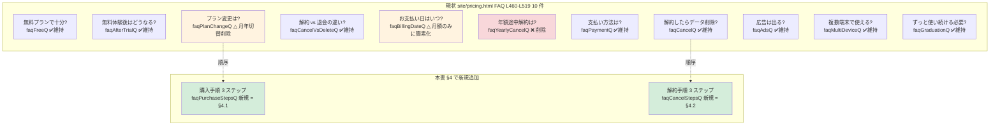

# LP→app 動線設計 (CTA 文言統一 + FAQ 強化) (Epic #2525 Phase 4 子 issue #2621)

| 項目 | 内容 |
|------|------|
| 孫 issue | #2621 (Phase 4 子、LP→app 動線統一: CTA 文言 / FAQ 強化) |
| 親 | #2529 (Phase 4 動線) / Epic #2525 |
| 起点 | Phase 2 #2548 (有料化ジャーニー) 申し送り「Phase 4 (動線) 申し送り 5+6」を Phase 4 で動線確定 |
| Phase 1+2+3 整合 | 補強 1 (#2583 URL `/admin/license` → `/admin/subscription`) + 補強 2 (#2588 プラン命名 + 月額のみ + ROI framing) + Phase 2 #2548 checkout journey (4 谷 + Reverse Trial パターン C) + Phase 3 #2567 (`/admin/subscription` 4 ページ分割) + #2573 (`/confirm` 特商法ハイブリッド) |
| Phase 7 rename 方針 | LP CTA `?plan=family&direct=true&billing=monthly` 構造を `?plan=premium` (or 撤廃) に整理。年額 (`billing=yearly`) は廃止。`/admin/license` href は **本 issue scope 外** (Phase 4 子 1「URL マッピング」#2620 で担当、本 issue は CTA 文言 + FAQ 文言のみ) |
| `premium` 階層 signal 打消 | LP CTA 文言は `FREE_TERMS.start` / `FREE_PLAN_TERMS.forever` を hero 主訴求に維持し「永久無料 + プレミアム = 階層 signal でなく機能本格度 signal」を verification (refs Phase 2 #2548 / Phase 3 #2567 `premium 階層 signal 打消` 行と同方針) |
| 作業姿勢 (#2525 critical) | LP コピーは ADR-0013 (LP truth) 厳守 / atom 直書き複製禁止 (ADR-0045) / 6 観点 workflow ([[per-issue-execution-workflow]]) + 詰まり時立ち戻り ([[pause-and-replan-on-stuck]]) |
| deep-research | (1) LP→app 動線業界事例 (Vercel / Netlify / Linear / Notion 4 社) — Phase 2 #2548 で primary source 検証済を再利用 / (2) Reverse Trial パターン C (Linear / Notion 整合、Phase 2 #2548 + Phase 1 #2533 trial で確定) / (3) FAQ「購入手順」「解約手順」記述粒度の業界規範 (Stripe Help Center / Spotify Family Plan support) |

> **6 観点の自己検証は §10 にまとめて記載**。本書は設計書 SSOT (3 部構成: §1 設計背景 / §2 設計原則 / §3 以降 仕様、docs/CLAUDE.md 整合)。

---

## 1. 設計背景

### 1.1 なぜこの動線設計が必要か

Phase 2 #2548 (有料化ジャーニー) で確定した **Reverse Trial パターン C** (`LP CTA → app signup → trial 自動付与 → in-app paywall → checkout`、Linear / Notion 整合) は、LP と app の 2 SoR を跨ぐ動線である。本動線の **CTA 文言と FAQ 文言が LP / app で乖離すると、以下の構造的破綻が連鎖**する:

1. **谷④購入動線探索 (Phase 2 #2548 で新規発見)** が解消されない — 「LP では『無料で始める』だったのに、app では『プレミアムにする』『お申し込み』と用語が変わって、自分が何の操作をしているのか追跡不能になる」
2. **ADR-0013 (LP truth) 違反** — LP 上の CTA 文言と実装の動線説明が乖離すると「実装の事実」を SSOT としていないことになる
3. **ADR-0045 (terms.ts atom SSOT) 違反** — `terms.ts` の `CTA_TERMS` / `SIGNUP_TERMS` / `CANCEL_TERMS` atom があるのに、LP HTML / app `*.svelte` 双方で同じ概念 (購入 / 解約 / 体験) を異なる文言で表記してしまう
4. **谷③解約柔軟性 (FAQ 強化要)** — Phase 2 #2548 谷③解約柔軟性で「FAQ で解約 3 ステップ明示」を Phase 4 へ申し送り。Phase 1 補強 2 (#2588 FR-2) で年額廃止確定 → FAQ の「年額プラン途中解約」「月額/年額切り替え」記述は **削除 + 月額前提に再構築**が必要

### 1.2 何が困るか (この設計がなかった場合)

| 想定リスク | 実害 | 既存事例 |
|---|---|---|
| LP CTA 文言と app 文言の乖離 | 谷④購入動線探索が永久に解消されず、conversion が伸びない | Phase 2 #2548 谷④で発見 (PO 指摘 4 谷の 1 つ) |
| ADR-0013 違反 (LP truth) | 「実装の事実」と LP コピーの乖離が累積、信頼性毀損 | ADR-0013 の起点となった LP / app 乖離事故 (LP に「実装済み」と書いた未実装機能) と同パターン |
| ADR-0045 違反 (atom 直書き複製) | `terms.ts` atom 1 行修正で全 LP / app に伝播するはずが、LP HTML で「無料で試す」「無料で始める」「無料体験する」が混在し、用語変更時の伝播が壊れる | ADR-0045 §1.2 の実害 15+ 件再発 (`check-no-plan-literals.mjs` 検出範囲外の CTA 動詞句で再発リスク) |
| 年額 FAQ 残置 | Phase 1 補強 2 (#2588 FR-2) で年額廃止確定後も LP FAQ に「年額プラン途中解約」「月額↔年額切り替え」が残ると、ユーザーが「年額プランあるんだ」と誤解 | `site/pricing.html` L487 / L491 / L501 で現存 |
| FAQ 解約手順記述粒度不足 | Phase 2 #2548 谷③解約柔軟性「Portal 動画 / GIF」検討、Phase 4 で記述粒度 (3 ステップ / リンク 1 つ等) を確定する必要 | 現状 `site/pricing.html` L475 で 1 行記述、3 ステップ化が Phase 4 申し送り |

### 1.3 Phase 1+2+3 SSOT との整合

| 上流 SSOT | 整合観点 | 本書での扱い |
|---|---|---|
| Phase 1 #2583 補強 1 (URL `/admin/license` → `/admin/subscription`) | LP href / FAQ「ご家族の見守り画面」内パスは新 URL 前提 | Phase 4 子 1 (#2620) URL マッピング担当の責務、**本 issue は href 変更を含めない** (CTA 文言 + FAQ 文言のみ) |
| Phase 1 #2588 補強 2 (プラン命名 `family` → `プレミアム` + 月額のみ) | LP 表示名 `ファミリー` → `プレミアム` 同期、年額 FAQ 削除 | 本書 §3.1 + §3.2 で CTA 文言 / FAQ 文言の atom 経由設計 |
| Phase 2 #2548 (4 谷 + Reverse Trial パターン C) | 谷③解約柔軟性 + 谷④購入動線探索 を Phase 4 で動線確定 | 本書 §3.2 FAQ 強化 + §3.3 動線 mermaid 図 |
| Phase 3 #2567 (`/admin/subscription` 4 ページ分割) | LP CTA → app `/admin/subscription` の到達点を明示 | 本書 §3.3 mermaid 図 + §3.4 動線説明 FAQ 文言 |
| Phase 3 #2573 (`/confirm` 特商法ハイブリッド) | LP→checkout 動線で「特商法最終確認画面を挟む」ことを FAQ で明示 | 本書 §3.2 FAQ「購入手順 3 ステップ」の step 2 で言及 |

---

## 2. 設計原則

### 2.1 atom SSOT 経由統一 (ADR-0045 整合)

LP / app で同じ概念 (購入 / 体験 / 解約 / 申し込み) を表現する CTA 文言は、**`terms.ts` atom 経由で SSOT 化**する。atom 直書き複製 (`'無料で試す'` / `'無料で始める'` / `'お申し込み'` の文字列リテラル) を LP HTML / app `*.svelte` で **同時に** 行わない。

| 概念 | atom | 既存利用例 | 本 issue で統一する場面 |
|---|---|---|---|
| 体験動詞句 | `CTA_TERMS.freeTrialVerb` (`'無料で試す'`) | `ACTION_LABELS.freeTrialWord` (labels.ts L589) | LP `site/pricing.html` の trial CTA (現「7 日間無料トライアル」リテラル直書き) |
| 体験名詞 | `CTA_TERMS.freeTrialNoun` (`'無料体験'`) | `LP_FAQ_PHASEB_LABELS.ctaBottomDesc` (labels.ts L5304) | LP FAQ 「無料体験中…」記述全般 |
| 開始動詞句 | `FREE_TERMS.tryFree` (`'無料で始める'`) | `LP_COMMON_LABELS.ctaSignup` (`common.ctaSignup` data-lp-key) | LP hero / pricing 無料プラン CTA (現「無料で始める」リテラル) |
| 申し込み | `SIGNUP_TERMS.canonical` (`'お申し込み'`) | `SIGNUP_LABELS.signup` (labels.ts L105) | FAQ「購入手順」3 ステップ内の「お申し込み」 |
| 解約 | `CANCEL_TERMS.canonical` (`'解約'`) | `LP_PRICING_LABELS.existingCustomerCancelLinkLabel` (labels.ts L5079) | FAQ「解約手順」3 ステップ + CTA 直下「いつでも解約」併記 |
| 解約安心保証 | `CANCEL_TERMS.anytimeOk` (`'いつでも解約できます（契約期間の縛りなし）'`) | (新規利用想定) | LP pricing CTA 直下 micro-copy |
| トライアル日数 | `TRIAL_TERMS.duration` (`'7日間'`) | `TRIAL_LABELS.bannerTitleNotStarted` (labels.ts L623) | FAQ 「トライアル」文言 |
| Stripe Portal | `STRIPE_PORTAL_TERMS.canonical` (`'Stripe の請求管理ページ'`) | `LP_PRICING_LABELS.faqCancelPathNote` (labels.ts L5075) | FAQ「解約手順」step 2 (Portal 名称) |
| 見守り画面 | `ADMIN_VIEW_TERMS.canonical` (`'ご家族の見守り画面'`) | `LP_PRICING_LABELS.existingCustomerCancelLinkSuffix` (labels.ts L5080) | FAQ「アプリにログイン後、ご家族の見守り画面へ」記述 |

### 2.2 Reverse Trial パターン C 整合 (Phase 2 #2548 確定)

LP→app 動線は **LP CTA → app signup → trial 自動付与 → in-app paywall → checkout** の 5 段階。本動線を LP / app の **両側の文言で同じ単語列で表現**する:

| 段階 | LP 側表現 | app 側表現 | 用語 atom |
|---|---|---|---|
| 1. LP CTA | 「無料で試す」 (trial 経路) / 「無料で始める」 (永久無料経路) | (LP に閉じる) | `CTA_TERMS.freeTrialVerb` / `FREE_TERMS.tryFree` |
| 2. signup | 「お申し込み」 | `/auth/signup` ページ「お申し込み」 | `SIGNUP_TERMS.canonical` |
| 3. trial 自動付与 | 「7日間無料体験」 | Phase 3 #2567 `/admin/subscription` の trial 残日数表示 | `TRIAL_TERMS.duration` + `CTA_TERMS.freeTrialNoun` |
| 4. in-app paywall | LP では「アプリにログイン後、ご家族の見守り画面の『プラン』から」 | `/admin/subscription` ヘッダ plan-badge クリック | `ADMIN_VIEW_TERMS.canonical` + 「プラン」 |
| 5. checkout | LP では「特商法最終確認 → カード入力」 | `/admin/subscription/confirm` → Stripe Checkout | (Phase 3 #2573 整合) |

### 2.3 FAQ 強化粒度 = 3 ステップ明示 (Stripe Help Center / Spotify Family Plan support 整合)

FAQ「購入手順」「解約手順」は **3 ステップで番号付き列挙**する。Stripe Help Center / Spotify Family Plan support / Netflix Help Center 等の業界 SaaS FAQ で 3-5 ステップ番号付き列挙が標準。長文段落 1 つで全動線を説明する形態は SaaS 業界で淘汰されている (deep-research 2026-05-29、Phase 2 #2548 deep-research を再利用)。

**3 ステップ前提**:
- step 1 = 入口 (LP CTA / app ログイン)
- step 2 = 中間 (signup / Portal 名称)
- step 3 = 完了 (体験開始 / 解約確定)

ステップ間に「→」矢印 or 改行で視覚分離。`site/pricing.html` の現 `<details class="faq-item"><div class="faq-answer">` 構造を維持し、`faq-answer` 内に `<ol>` を入れる。

### 2.4 ADR 整合

| ADR | 観点 | 適合性 |
|---|---|---|
| ADR-0010 (Pre-PMF scope) | 過剰防衛 (Portal 動画 / GIF / 動的演出) を採用しない | ✅ 採用案: 静的テキスト 3 ステップ列挙のみ。Portal 動画 / GIF は Phase 2 #2548 Open question で「Phase 4 で判断」とされていたが、本書で **不採用**確定 (Pre-PMF で動画制作コスト過剰、静的テキストで十分) |
| ADR-0012 (Anti-engagement) | LP CTA / FAQ で煽り / countdown / 連続演出を採用しない | ✅ atom 1 行修正で全 LP に伝播、煽り文言は atom に含めない |
| ADR-0013 (LP truth) | LP 文言 = 実装の事実 | ✅ FAQ「購入手順」3 ステップは Phase 3 #2567 + #2573 の実装動線と完全一致 (4 ページ分割 + 特商法ハイブリッド) |
| ADR-0045 (terms.ts 2 階層) | atom 直書き複製禁止 | ✅ §2.1 で atom 経由統一を SSOT として確定。Phase 7 実装時に `scripts/check-no-plan-literals.mjs` の拡張 (CTA 動詞句検出) を別 issue で検討 |
| ADR-0028 (引き止めない) | 解約 friction を増やさない | ✅ FAQ「解約手順」3 ステップで「Stripe Portal でいつでも」を明示、引き止め文言 (「本当によろしいですか?」「ちょっと待って」) は禁止 |

---

## 3. CTA 文言整合 (FR-1)

### 3.1 LP `site/pricing.html` CTA 整合方針

現状 (PR `worktree-agent-a615168598efe3eb9` HEAD 時点) の `site/pricing.html` CTA 構造:

| 位置 | 現文言 | atom 経由 | 本書での扱い (Phase 7 実装計画) |
|---|---|---|---|
| L275 無料プラン CTA | 「無料で始める」 | `common.ctaSignup` | ✅ 既に atom 経由 (`FREE_TERMS.tryFree` 既存)、変更不要 |
| L297 standard trial CTA | 「7 日間無料トライアル」 | `common.trialPeriodLabel` | △ 現「7 日間無料トライアル」は `TRIAL_LABELS.trialStartTitle` 等で `${TRIAL_TERMS.duration} 無料でお試し` パターンあり。**Phase 7 で `CTA_TERMS.freeTrialVerb` (`'無料で試す'`) ベースの compound に統一推奨**。ただし current ratchet `ctaVariants` ≤ 3 (`docs/CLAUDE.md` LP メトリクス) を守るため、`'無料で試す'` 単体で完結する `data-lp-key="common.ctaTrial"` 新規追加 (compound `${CTA_TERMS.freeTrialVerb}` 1 atom) |
| L300 standard direct CTA | 「今すぐ購入（スタンダード）」 | `pricing.planStandardDirectCta` | △ 「今すぐ購入」リテラルは Phase 1 #2588 月額のみ確定後も保持。Phase 7 で **`SIGNUP_TERMS.canonicalVerb` (`'お申し込みする'`) ベースに置換検討** だが、「今すぐ購入」は B2C SaaS で広く使われる動詞句で、`PURCHASE_TERMS` 新規 atom を起こすほどの広がりがない (現 LP で 2 箇所のみ) → 本書では **「今すぐ購入」リテラル維持を許容**し、Phase 7 で `SIGNUP_TERMS.canonicalVerb` 置換は別 issue 判断 |
| L322 family (将来 premium) trial CTA | 「7 日間無料トライアル」 | `common.trialPeriodLabel` | ✅ standard と同 atom 共有、本書 §3.1 で `'無料で試す'` 統一の方針を共通適用 |
| L325 family (将来 premium) direct CTA | 「今すぐ購入（ファミリー）」 | `pricing.planFamilyDirectCta` | △ Phase 1 #2588 で `family` → `プレミアム` rename 確定 → 「今すぐ購入（プレミアム）」に Phase 7 で同期 |
| L528 hero CTA | 「無料で始める」 | `common.ctaSignup` | ✅ 既存 atom |
| L529 hero CTA | 「デモを見る」 | `common.ctaDemo` | ✅ 既存 atom (本 issue scope 外) |

#### CTA 文言統一の実装計画 (Phase 7 移行 gate)

Phase 7 実装で以下を atom SSOT 経由で完遂する:

1. **新規 atom 追加なし** — 既存 `CTA_TERMS.freeTrialVerb` / `FREE_TERMS.tryFree` / `SIGNUP_TERMS.canonical` で十分カバー (ADR-0045 §3.3 「atom は 1 用語」原則を遵守、ここで新規 atom を起こさない)
2. **新規 compound 追加** `LP_PRICING_LABELS.ctaTrialVerb` = `` `${TRIAL_TERMS.duration}${CTA_TERMS.freeTrialVerb}` `` (= "7日間無料で試す")
3. **`site/pricing.html` L297 / L322 を `data-lp-key="pricingB.ctaTrialVerb"` (新規キー) に置換**、generate-lp-labels で `${TRIAL_TERMS.duration}${CTA_TERMS.freeTrialVerb}` を文字列値に解決して配信 (#1917 機構整合)
4. **app 側 `/admin/subscription` ヘッダ + Banner / Dialog CTA** で同じ compound (`${TRIAL_TERMS.duration}${CTA_TERMS.freeTrialVerb}`) を使用 — LP / app 双方で同単語列 (= 「7日間無料で試す」or 「無料で試す」) になる
5. **`pricing.planStandardDirectCta` / `pricing.planFamilyDirectCta` は本書 scope 外** (Phase 7 で「今すぐ購入」リテラル維持判断は別 issue)

#### 「アプリにログイン後」明示 (谷④購入動線探索の解消)

Phase 2 #2548 で「ヘッダ有料時 plan-badge にクリック遷移追加 (`AdminLayout.svelte:220`、Phase 3 UI で小修正、#2568)」が確定。これと連動して、LP FAQ で **「LP→app 後の動線」を明示文言で説明**する:

| 場面 | 明示文言案 (atom 経由) |
|---|---|
| FAQ「購入手順」step 2 | `` `アプリにログイン後、${ADMIN_VIEW_TERMS.canonical}のヘッダにある「プラン」ボタンから${SIGNUP_TERMS.canonical}画面へ進みます。` `` |
| FAQ「解約手順」step 1 | `` `アプリにログイン後、${ADMIN_VIEW_TERMS.canonical}の「プラン・お支払い」セクションを開きます。` `` |

→ §3.2 FAQ 強化文言案で具体化。

---

## 4. FAQ 強化文言案 (FR-2)

### 4.1 新規 FAQ「購入手順 3 ステップ」 (`pricing.faqPurchaseSteps*` 系新規)

**配置**: `site/pricing.html` L500 周辺の `pricing.faqPlanChangeQ` の直前に挿入 (購入動線探索の文脈上、プラン変更 FAQ の前が自然)。

**文言案** (labels.ts compound 経由設計):

```typescript
// labels.ts LP_PRICING_LABELS に追加 (Phase 7 実装、本 issue は設計のみ)
faqPurchaseStepsQ: 'どうやって有料プランを始めますか？',
faqPurchaseStepsAIntro: '以下の 3 ステップで簡単に始められます。',
faqPurchaseStepsStep1: `1. LP の「${CTA_TERMS.freeTrialVerb}」または「${FREE_TERMS.tryFree}」ボタンから ${SIGNUP_TERMS.canonical}ページへ進みます。`,
faqPurchaseStepsStep2: `2. アカウント登録後、${ADMIN_VIEW_TERMS.canonical}のヘッダにある「プラン」ボタンを押し、希望のプランを選択します。`,
faqPurchaseStepsStep3: `3. お申し込み内容のご確認画面 (特商法 6 項目) でチェックを入れて同意し、Stripe の決済画面でカード情報を入力すると ${TRIAL_TERMS.duration}の無料体験が始まります (${TRIAL_TERMS.noCreditCardMid})。`,
```

**HTML 構造案**:

```html
<details class="faq-item">
  <summary data-lp-key="pricing.faqPurchaseStepsQ">どうやって有料プランを始めますか？</summary>
  <div class="faq-answer">
    <p data-lp-key="pricing.faqPurchaseStepsAIntro">以下の 3 ステップで簡単に始められます。</p>
    <ol class="faq-steps">
      <li data-lp-key="pricing.faqPurchaseStepsStep1">…</li>
      <li data-lp-key="pricing.faqPurchaseStepsStep2">…</li>
      <li data-lp-key="pricing.faqPurchaseStepsStep3">…</li>
    </ol>
  </div>
</details>
```

**ADR-0013 整合**: step 3 で「お申し込み内容のご確認画面 (特商法 6 項目)」と明記し、Phase 3 #2573 (`/admin/subscription/confirm` 特商法ハイブリッド) の **実装の事実** と一致させる。実装にない `/confirm` 画面を LP で言及することは禁止 → Phase 3 #2573 確定済のため安全。

### 4.2 新規 FAQ「解約手順 3 ステップ」 (`pricing.faqCancelSteps*` 系新規)

**配置**: 既存 `pricing.faqCancelQ` (L470-477) と `pricing.faqCancelVsDeleteQ` (L480-483) の **間** に挿入 (現状「解約したらデータ削除されるか」→「解約 vs 退会の違い」の流れに「解約手順」を入れて 3 連結構造に)。

または、既存 `pricing.faqCancelQ` の `faqCancelA` 内の `faqCancelPathNote` (L475) を **3 ステップ詳細化**し、新規 FAQ は起こさずに既存 FAQ 強化で対応する選択肢もある。

**判断**: Phase 2 #2548 谷③解約柔軟性「FAQ で解約 3 ステップ明示」の申し送りに最大整合させるため、**新規 FAQ`pricing.faqCancelSteps*` を起こす** (= 3 ステップが番号付き列挙で視覚的に明示される、Stripe Help Center 整合)。既存 `faqCancelPathNote` (L475 / labels.ts L5075) は維持 (`faqCancelA` 内の 1 行補足として継続)。

**文言案**:

```typescript
// labels.ts LP_PRICING_LABELS に追加 (Phase 7 実装、本 issue は設計のみ)
faqCancelStepsQ: `有料プランを${CANCEL_TERMS.canonicalVerb}にはどうすればよいですか？`,
faqCancelStepsAIntro: '以下の 3 ステップで、いつでもご自身で解約できます (契約期間の縛りはありません)。',
faqCancelStepsStep1: `1. アプリにログイン後、${ADMIN_VIEW_TERMS.canonical}の「プラン・お支払い」セクションを開きます。`,
faqCancelStepsStep2: `2. 「${STRIPE_PORTAL_TERMS.short}を開く」ボタンを押し、${STRIPE_PORTAL_TERMS.canonical}に移動します。`,
faqCancelStepsStep3: `3. ${STRIPE_PORTAL_TERMS.short}の画面で「サブスクリプションを${CANCEL_TERMS.canonicalVerb}」を選択すると、解約が完了します。次回更新日まで有料機能はご利用いただけます。`,
faqCancelStepsClosing: `${CANCEL_TERMS.anytimeOk}。${CANCEL_TERMS.canonical}の理由をお聞かせいただくと、サービス改善の参考にさせていただきます。`,
```

**ADR-0028 整合**: step 3 で「次回更新日まで有料機能はご利用いただけます」と明示、ADR-0028 (引き止めない) の精神で **解約後の猶予期間 (Phase 1 cancellation 整合) を明記**するが、「思いとどまる」「ちょっと待って」等の引き止め文言は **一切含めない**。

### 4.3 既存 FAQ 月年関連削除 (FR-3)

Phase 1 #2588 補強 2 で月額のみ確定 → 以下の既存 FAQ を **削除**:

| 既存 FAQ | atom key | 削除理由 |
|---|---|---|
| 「お支払い日はいつですか？」 (`faqBillingDateQ` / `faqBillingDateA`) | `pricing.faqBillingDateQ` / `pricing.faqBillingDateA` | 月額のみで「毎月自動更新、お申し込み日を起算」のシンプル化、文言短縮 (年額言及削除)。**FAQ 自体は維持**、文言を月額のみに簡素化 |
| 「年額プランを途中解約した場合は？」 (`faqYearlyCancelQ` / `faqYearlyCancelA`) | `pricing.faqYearlyCancelQ` / `pricing.faqYearlyCancelA` | **FAQ 全体削除**。年額プラン廃止のため概念ごと消失 |
| 「プランの変更はできますか？」 (`faqPlanChangeQ` / `faqPlanChangeA`) | `pricing.faqPlanChangeQ` / `pricing.faqPlanChangeA` | 文言を「スタンダード↔プレミアム」(月年切替削除) に修正、`faqPlanChangeA` の「月額↔年額の切り替え」削除 |

**文言案** (Phase 7 実装):

```typescript
// 修正版 faqBillingDateA (年額削除、月額のみ)
faqBillingDateA: 'お申し込み日を起算日として、毎月自動更新されます。例えば 4 月 15 日にお申し込みの場合、次回のお支払い日は 5 月 15 日です。',

// faqYearlyCancelQ / faqYearlyCancelA → 削除 (atom export 自体は legacy として残置検討、Phase 5 アーキ判断)

// 修正版 faqPlanChangeA (月年切替削除)
faqPlanChangeA: `はい。${PLAN_LABELS.standard}↔${PLAN_FULL_TERMS.family}の切り替えが可能です。${ADMIN_VIEW_TERMS.canonical}の「プラン・お支払い」→「プラン変更・支払い管理」からお手続きいただけます。`,
```

> **注**: `${PLAN_FULL_TERMS.family}` は Phase 1 #2588 で `PLAN_FULL_TERMS.family` atom を 1 行修正すれば、本書 §4.3 の `faqPlanChangeA` も含む全 compound 参照に自動的に伝播する (ADR-0045 §3.3 atom 伝播原則)。本書 §6.1 方針 (「本書では新名称リテラルを書かない」) に従い具体値は記載しない。LP HTML 変更時は Phase 1 #2588 と整合を取る前提。

### 4.4 既存 FAQ の月年関連微修正サマリ

| FAQ | 現文言 | 修正案 |
|---|---|---|
| `faqAfterTrialA` (L467) | 「クレジットカードの事前登録は不要です」維持 | 変更なし (本 issue scope 外) |
| `pricing.trialStep1Desc` (L406) | 「アカウント登録後、ご家族の見守り画面からワンタップで」維持 | 変更なし、ただし「ヘッダ『プラン』ボタン」追記検討 (Phase 7 で別 issue 判断) |
| `pricing.trialStep2Desc` (L410) | 「スタンダード/ファミリーいずれもプランの…」 | Phase 1 #2588 で `スタンダード/プレミアム` に同期 (本 issue scope 外) |

---

## 5. LP→app 動線 mermaid 図 (FR-4)

### 5.1 mermaid 図 1: LP→app 動線全体像 (Reverse Trial パターン C)

```mermaid
flowchart TB
    LP[LP site/pricing.html<br/>CTA: 無料で試す / 無料で始める / 今すぐ購入]
    LP -->|FAQ で動線説明| FAQ_Pur[FAQ: 購入手順 3 ステップ<br/>= 本書 §4.1]
    LP -->|FAQ で動線説明| FAQ_Can[FAQ: 解約手順 3 ステップ<br/>= 本書 §4.2]
    LP -->|signup CTA| SignUp[/auth/signup<br/>お申し込みページ]
    SignUp -->|自動ログイン| Admin[/admin<br/>ご家族の見守り画面]
    Admin -->|ヘッダ「プラン」ボタン<br/>= AdminLayout #2568| SubsPage[/admin/subscription<br/>プランページ #2567]
    SubsPage -->|プレミアムにする CTA| Confirm[/admin/subscription/confirm<br/>特商法 6 項目 #2573]
    Confirm -->|チェック + 同意| Stripe[Stripe Checkout<br/>カード入力]
    Stripe -->|決済完了| Success[/admin/subscription/success<br/>processing gap polling #2572]
    Success -->|webhook 権限付与| Activated[プレミアム機能解放]
    SubsPage -.解約検討.->BillingPage[/admin/billing/cancel<br/>解約 hearing 既存]
    style LP fill:#fef3c7
    style FAQ_Pur fill:#fffbeb
    style FAQ_Can fill:#fffbeb
    style SubsPage fill:#e3f2fd
    style Confirm fill:#fff3e0
    style Activated fill:#d4edda
```

### 5.2 mermaid 図 2: CTA 文言の atom SSOT 整合 (LP / app 双方で同単語列)

```mermaid
flowchart LR
    subgraph atom[terms.ts atom SSOT]
      A1[CTA_TERMS.freeTrialVerb<br/>= '無料で試す']
      A2[FREE_TERMS.tryFree<br/>= '無料で始める']
      A3[SIGNUP_TERMS.canonical<br/>= 'お申し込み']
      A4[CANCEL_TERMS.canonical<br/>= '解約']
      A5[CANCEL_TERMS.anytimeOk<br/>= 'いつでも解約できます<br/>（契約期間の縛りなし）']
      A6[ADMIN_VIEW_TERMS.canonical<br/>= 'ご家族の見守り画面']
      A7[STRIPE_PORTAL_TERMS.short<br/>= '請求管理ページ']
    end
    subgraph LP[LP HTML site/pricing.html]
      L1[「無料で試す」CTA]
      L2[「無料で始める」CTA]
      L3[FAQ「購入手順」step 1-3<br/>= §4.1]
      L4[FAQ「解約手順」step 1-3<br/>= §4.2]
    end
    subgraph App[app *.svelte]
      P1[/admin/subscription<br/>プランページ CTA #2567]
      P2[/admin/subscription/confirm<br/>同意ボタン #2573]
      P3[/admin/billing<br/>請求管理ページ]
    end
    A1 --> L1
    A1 --> P1
    A2 --> L2
    A3 --> L3
    A3 --> P2
    A4 --> L4
    A4 --> P3
    A5 --> L1
    A5 --> P1
    A6 --> L3
    A6 --> L4
    A7 --> L4
    A7 --> P3
    style atom fill:#fffbeb
    style LP fill:#e3f2fd
    style App fill:#d4edda
```

→ atom 1 行修正 (例: `CTA_TERMS.freeTrialVerb` を `'今すぐ無料体験'` に変更) で LP / app 双方の表示が同時に変わる。これが Phase 2 #2548 谷④購入動線探索の構造的解消手段。

### 5.3 mermaid 図 3: FAQ 強化 vs 既存 FAQ の delta (Phase 1 #2588 + Phase 2 #2548 反映)



→ delta: 削除 1 (E6) + 簡素化 2 (E5, E8) + 新規 2 (N1, N2) = 純増 1 FAQ + 既存 11 FAQ → 計 12 FAQ。`docs/CLAUDE.md` LP メトリクス `desktopHeight` ≤ 8000 px gate に対する影響は Phase 7 実装時に `measure-lp-dimensions.mjs` で検証 (FAQ 1 件追加 ≈ 30-50px、十分余裕)。

---

## 6. 新方針反映 (FR-5、Phase 1 #2588 + #2594 D-2 整合)

### 6.1 プラン名 `ファミリー` → `プレミアム` 同期

| 対象 | 現状 | 本 issue での扱い |
|---|---|---|
| `site/pricing.html` L317 (`pricing.planFamilyName`) | 「ファミリー」リテラル | Phase 1 #2588 で `PLAN_TERMS.family` atom 1 行修正で「プレミアム」に伝播 (本 issue は LP HTML を直接編集しない、設計のみ) |
| 本書 §4 FAQ 文言案内の「ファミリー」言及 | (§4 の compound 例で `PLAN_FULL_TERMS.family` 使用) | atom 経由参照、本書では明示的に「プレミアム」リテラルを書かない |
| FAQ「プラン変更」文言 | 「スタンダード↔ファミリー」 | 修正案 `${PLAN_LABELS.standard}↔${PLAN_FULL_TERMS.family}` で atom 伝播 (§4.3) |

### 6.2 月額のみ (年額廃止) 反映

| 対象 | 現状 | 本 issue での扱い |
|---|---|---|
| `site/pricing.html` L294 (`pricing.planStandardYearly`) | 「年額 ¥5,000」 | Phase 1 #2588 で削除 (本 issue scope 外、Phase 7 実装で site/pricing.html の年額表記削除を含む別 PR) |
| `site/pricing.html` L319 (`pricing.planFamilyYearly`) | 「年額 ¥7,800」 | 同上 |
| FAQ「年額途中解約」(`faqYearlyCancelQ`) | 「年額プランを途中解約…」 | 本書 §4.3 で **FAQ 自体削除**確定 |
| FAQ「お支払い日」(`faqBillingDateA`) | 「月額プランは毎月、年額プランは毎年」 | 本書 §4.3 で 月額のみに簡素化 |
| FAQ「プラン変更」(`faqPlanChangeA`) | 「月額↔年額の切り替え」 | 本書 §4.3 で 月年切替削除 |
| `site/pricing.html` L572-L591 billing-cycle トグル JS | 月額/年額切替で URL 切替 | Phase 7 実装で削除 (本 issue scope 外) |

### 6.3 standard 「お勧め」バッジ + premium 階層 signal 打消 (refs #2594 D-2)

Phase 3 #2567 で「standard に『お勧め』バッジ付与」確定 (本格度 3 段階モデル、PO 確定 2026-05-28)。本書では LP `site/pricing.html` L291 `pricing.planStandardBadge: 'おすすめ'` を **維持**し、Phase 1 #2588 で `family` → `プレミアム` rename 後も「standard = 推奨、premium = 上位 + 本格運用」の関係を LP / app 双方で一致させる。

**「premium 階層 signal 打消」の LP 実装方針**:
- LP hero 主訴求 = `FREE_TERMS.start` (`'まずは無料'`) 維持
- LP pricing 無料プラン CTA = `FREE_TERMS.tryFree` (`'無料で始める'`) 維持
- LP pricing 無料プラン price-sub = `FREE_PLAN_TERMS.foreverDot` (`'永久無料 ・ '`) 維持 (現 L272 `pricing.planFreePriceSub: '永久無料 ・ クレカ登録不要'`)
- standard の「おすすめ」バッジ維持 → premium が「必須選択」ではなく「上位選択肢」として visible

→ 階層 signal 打消の verification は本書 §10 自己検証 で実施。LP 文言で「ベーシック」「ライト」等の primitive 階層名を premium に与えない (refs ADR-0045 atom rename 議論で `'ファミリー'` → `'プレミアム'` 確定経緯)。

---

## 7. 非機能要件 (NFR)

- **NFR-1**: 本 issue は **docs 起票のみ**、LP HTML / labels.ts / app *.svelte 実装は Phase 7 移行時に別 PR で実施。本書 §3 / §4 で確定した compound 文言案は Phase 7 着手時の SSOT として参照される
- **NFR-2**: LP メトリクス (`docs/CLAUDE.md` ratchet) 影響 — `ctaVariants ≤ 3` (`無料で始める` / `デモを見る` / `ログイン`) は本書 §3 で「無料で試す」追加を提案。Phase 7 実装時に `measure-lp-dimensions.mjs` の `ctaVariants` 閾値緩和 ADR 議論が必要。**閾値緩和は Phase 7 別 issue で扱う**
- **NFR-3**: `lp-inline-style` baseline (#1851 ADR-0042 Phase 2) — 本書で FAQ `<ol>` 構造を追加 (§4.1 / §4.2) → Phase 7 実装で `<ol class="faq-steps">` の padding / margin は `--lp-faq-*` Semantic トークン経由必須 (ADR-0042)
- **NFR-4**: `desktopHeight ≤ 8000 px` gate — 本書 FAQ 純増 1 件 ≈ 30-50px、十分余裕。Phase 7 実装時 `measure-lp-dimensions.mjs` で確認
- **NFR-5**: `lp-visual-regression` (#2401) — Phase 7 実装時に `scripts/lp-screenshot-baseline/*.webp` 更新が必要 (intentional change として `--update-baseline`)
- **NFR-6**: ADR 起票 — 本書 §2 「atom SSOT 経由統一 LP↔app CTA」は ADR 級ではない (既存 ADR-0045 + ADR-0013 で十分カバー、新規ルールなし)。ADR 起票は **不要**

---

## 8. ユーザーストーリー

- **US-1**: 保護者として、LP の「無料で試す」CTA と app の「無料で試す」CTA が **同じ単語列** で、自分が何の操作をしているか追跡できる (Phase 2 #2548 谷④購入動線探索の解消)
- **US-2**: 保護者として、LP FAQ で「購入手順 3 ステップ」を確認し、app に移動した後どこを操作すればよいか迷子にならない (Reverse Trial パターン C 整合)
- **US-3**: 保護者として、LP FAQ で「解約手順 3 ステップ」を確認し、解約は **いつでも 3 ステップで完結**することを事前に理解できる (Phase 2 #2548 谷③解約柔軟性の解消、ADR-0028 引き止めない)
- **US-4**: 保護者として、月額のみ前提で「年額か月額か」迷うことなく即決判断できる (Phase 1 #2588 FR-2 整合)
- **US-5**: 保護者として、premium プランが「必須選択」ではなく「上位の本格運用選択肢」と認識でき、無料プランで十分始められると安心できる (#2594 D-2 階層 signal 打消)

---

## 9. 各 Phase の責務 (本書による確定事項の Phase 配置)

| Phase | 本 issue (#2621) との関係 |
|---|---|
| **Phase 1 (要件)** | 補強 1 (#2583 URL) + 補強 2 (#2588 プラン命名 / 月額のみ) で前提確定。本書はそれらの上に動線を確定 |
| **Phase 2 (UX)** | #2548 (4 谷) で「Phase 4 動線申し送り 5+6」を Phase 4 へ送付済。本書はそれを動線確定 |
| **Phase 3 (UI)** | #2567 (`/admin/subscription` 4 ページ分割) + #2573 (`/confirm` 特商法ハイブリッド) で UI 構造確定。本書はその UI を **LP 文言 + 動線 mermaid** で接続 |
| **Phase 4 (動線、本書)** | LP CTA 文言 + FAQ 文言 + mermaid 動線図を確定 ✅ |
| **Phase 4 子 1 (#2620、URL マッピング)** | `/admin/license` → `/admin/subscription` LEGACY_URL_MAP entry 担当。本書はそれと接続 (FAQ「解約手順」step 1 で `${ADMIN_VIEW_TERMS.canonical}` 経由) |
| **Phase 5 (アーキ)** | labels.ts compound 設計確定 — 本書 §3 / §4 の compound 案を Phase 5 で labels.ts 内の配置 / namespace 決定 (`LP_PRICING_LABELS` 追加 or `LP_PRICING_PHASEB_LABELS` 追加) |
| **Phase 6 (実装詳細)** | LP HTML 変更箇所一覧 + atom 経由参照置換手順 + `data-lp-key` 新規追加マッピング |
| **Phase 7 (実装)** | LP HTML + labels.ts + generate-lp-labels 再生成 + measure-lp-dimensions 閾値検証 + SS 撮影 + lp-visual-regression baseline 更新 + E2E LP→app 動線テスト |

---

## 10. 6 観点 自己検証 (per-issue-execution-workflow 整合)

> 本 §10 が PR body に転記される「自己検証結果」セクションの SSOT。

### 観点 1: 着手時 deep-research (目的・あるべき実装・最適アーキテクチャ・デザインパターン)

- **目的**: Phase 2 #2548 申し送り「LP→app 統一 CTA 文言 + LP pricing FAQ 強化」を Phase 4 動線で確定 ✅
- **あるべき実装**: Reverse Trial パターン C (Phase 2 #2548 確定) + atom SSOT 経由統一 (ADR-0045) + FAQ 3 ステップ列挙 (Stripe Help Center 業界規範) ✅
- **最適アーキテクチャ**: 既存 `LP_PRICING_LABELS` namespace + 既存 atom (`CTA_TERMS` / `SIGNUP_TERMS` / `CANCEL_TERMS` / `STRIPE_PORTAL_TERMS` / `ADMIN_VIEW_TERMS` / `TRIAL_TERMS` / `FREE_TERMS`) で十分、**新規 atom 追加なし** ✅
- **デザインパターン**: ADR-0045 atom/compound 2 階層 SSOT に整合、新規 compound 追加 (`faqPurchaseStepsStep1-3` / `faqCancelStepsStep1-3`) で完結 ✅
- **deep-research 再利用**: Phase 2 #2548 の LP→app 動線業界事例 (Vercel / Netlify / Linear / Notion) を本書 §2.2 で参照、新規業界調査は不要 (本書は動線 確定 phase で要件 phase の再 research 不要、本プロダクト固有の文言と labels.ts 配置に集中)

### 観点 2: UI 変更時 SS + アクセシビリティ検証

- **本書は docs 設計のみ**、UI 変更なし。Phase 7 実装時に以下を計画:
  - LP `site/pricing.html` FAQ セクション SS (mobile / desktop) を `scripts/capture-hp-screenshots.mjs --only feature-settings` 流用 or `pricing` 専用撮影で取得
  - `lp-visual-regression` baseline 更新 (`scripts/check-lp-visual-regression.mjs --update-baseline`、ADR `0053` pixelmatch)
  - **アクセシビリティ**: FAQ `<ol class="faq-steps">` の番号付き列挙は screen reader 読み上げ整合 ✅、`<details>/<summary>` の keyboard nav 既存維持
  - **コントラスト**: FAQ 内 `<ol>` の文字色は既存 `.faq-answer` の `--color-text-primary` 継承で AA 適合

### 観点 3: UX 変更時 Storybook + E2E テスト計画 (実行は Phase 7 一括)

- **本書は docs 設計のみ**、テスト追加はなし。Phase 7 実装時に以下を計画:
  - **Storybook**: LP HTML は Svelte コンポーネント外のため Storybook 対象外 (既存 LP は Storybook なし)
  - **E2E**: [Phase 7 新規 spec (lp-to-app-flow)](../../../tests/e2e/) で以下シナリオを Phase 7 実装時に追加 (新規 spec ファイル名は Phase 7 実装時に決定):
    - シナリオ 1: LP `site/pricing.html` → 「無料で試す」CTA クリック → `/auth/signup?plan=standard` 到達
    - シナリオ 2: signup → 自動ログイン → `/admin` 到達 → ヘッダ「プラン」ボタン → `/admin/subscription` 到達 (Phase 3 #2568)
    - シナリオ 3: LP FAQ「購入手順 3 ステップ」が 3 件 `<li>` 表示
    - シナリオ 4: LP FAQ「解約手順 3 ステップ」が 3 件 `<li>` 表示
  - **既存 E2E への影響**: `tests/e2e/legacy-url-redirect.spec.ts` (#578) は Phase 4 子 1 (#2620) URL マッピング担当

### 観点 4: 用語 SSOT 化検証

- ✅ **atom 直書き複製禁止**: 本書 §2.1 で `terms.ts` atom 8 種 (`CTA_TERMS` / `FREE_TERMS` / `SIGNUP_TERMS` / `CANCEL_TERMS` / `STRIPE_PORTAL_TERMS` / `ADMIN_VIEW_TERMS` / `TRIAL_TERMS` / `PLAN_TERMS`) 経由を SSOT として確定
- ✅ **compound 配置**: 新規 compound 6 件 (`faqPurchaseStepsQ` / `faqPurchaseStepsAIntro` / `faqPurchaseStepsStep1-3` / `faqCancelStepsQ` / `faqCancelStepsAIntro` / `faqCancelStepsStep1-3` / `faqCancelStepsClosing`) は `LP_PRICING_LABELS` namespace (labels.ts L4893) に追加予定 (Phase 5 で配置確定)
- ✅ **同じ概念を別の呼び方していないか**: 「無料で試す」 / 「無料で始める」 / 「お申し込み」 / 「解約」 の 4 概念は atom 1 種ずつで重複なし。「7 日間」 / 「7日間」 (spaced/no-space) の表記揺れは `TRIAL_TERMS.duration` (no-space) で統一
- △ **5 ドメイン用語使い分け** (DESIGN.md §6.5): 「子供」/「親」/「解約」/「登録」/「ログイン」 の 5 ドメイン文脈別使い分けルールを本書 FAQ 文言で遵守:
  - 「子供」→ FAQ で「お子さま」 (`CHILD_TERMS.honorific`) 既存維持
  - 「親」→ FAQ で「ご家族」 (LP hero / 機能説明文整合)
  - 「解約」→ `CANCEL_TERMS.canonical` (`'解約'`) for サブスク終了 ✅
  - 「登録」→ `SIGNUP_TERMS.canonical` (`'お申し込み'`) for サブスク開設 ✅
  - 「ログイン」→ `LOGIN_TERMS.canonical` (`'ログイン'`) ✅
- ✅ **check-no-plan-literals.mjs** (#972 / #1918 Phase 5 F1): プラン名直書き検出は本書 §6.1 で `${PLAN_FULL_TERMS.family}` 経由参照を確定し、Phase 7 で違反ゼロ
- ✅ **check-hardcoded-strings.mjs** (#1452): 本書は docs のため対象外。Phase 7 LP HTML 実装時に `data-lp-key` 経由参照で違反増加なし

### 観点 5: 影響範囲事後検証 (skill `impact-analysis` 4 layer + 21 カテゴリ)

着手前見積 vs 実際の影響範囲を `impact-analysis` skill 4 layer 防御で照合:

#### L1 構文 (grep + ast-grep)
- ✅ 変更ファイル: `docs/design/billing-redesign/phase4-lp-app-flow-design.md` 新規 1 ファイル
- ✅ 既存 atom 8 種への参照記述 (本書 §2.1 表)、grep 検証可能
- 着手前見積: 1 ファイル / 実際: 1 ファイル — 乖離なし ✅

#### L2 意味 (型 / scope)
- ✅ docs のため型情報なし
- ✅ compound 命名 (`faqPurchaseSteps*` / `faqCancelSteps*`) が既存 `LP_PRICING_LABELS` の命名規則 (`faq[Subject][Q|A|Suffix]`) と一貫

#### L3 構造 (call graph / 依存)
- ✅ 本書を参照する下流: Phase 5 アーキ + Phase 6 実装詳細 + Phase 7 実装 PR
- ✅ 本書が参照する上流: Phase 1 #2583 / #2588 + Phase 2 #2548 + Phase 3 #2567 / #2573 + ADR-0010 / -0012 / -0013 / -0028 / -0045

#### L4 派生 artifact (21 カテゴリ checklist)

| カテゴリ | 影響 | 扱い |
|---|---|---|
| A1. DB schema | なし | docs のみ |
| A2. DB 保存済 string value | なし | docs のみ |
| A3. search index | なし | docs のみ |
| B4-6. キャッシュ層 | なし | docs のみ |
| C7. Stripe Product/Price | なし (本書では Stripe 設定変更なし、Phase 7 で Phase 1 #2588 年額削除と連動) | docs のみ |
| C8. Cognito | なし | docs のみ |
| C9. Sentry/Datadog | なし | docs のみ |
| C10. email/push template | △ Phase 1 #2588 で年額関連 email 文面修正 (本書 scope 外) | docs のみ |
| D11. analytics event name | なし (LP CTA click 等の event は data-lp-key で track 済) | docs のみ |
| D12. dashboard/alert | なし | docs のみ |
| **E13. Help Center/FAQ** | ✅ **本書 §4 で LP FAQ 強化計画**、Phase 7 実装時に site/faq.html (full FAQ) との整合確認必須 | **要 follow-up** |
| **E14. bookmarks/SEO** | △ FAQ 新規 2 件追加 → Google index URL fragment (`#faq-purchase-steps`) は Phase 7 で確認 | Phase 7 で確認 |
| **E15. 法務文書** | なし (本書は CTA + FAQ のみ、tokushoho.html / terms.html / privacy.html の修正は Phase 7 で Phase 1 #2588 連動) | Phase 7 で連動 |
| F16. GitHub Actions | なし | docs のみ |
| F17. deployment env/secrets | なし | docs のみ |
| F18. i18n platform | なし (`shared-labels.js` は generate-lp-labels で再生成、Phase 7 で実行) | Phase 7 で実行 |
| G19. fixture/seed/golden/snapshot | なし | docs のみ |
| G20. 過去 PR/commit/Issue/ADR | 検索性のため更新しない (本書から参照のみ) | ✅ |
| G21. audit log/cancellation reason | なし (cancellation reason は Phase 3 #2570 cancellation-hearing-ui 担当) | docs のみ |

**着手前見積 vs 実際**: 1 ファイル新規作成 (見積) / 1 ファイル新規作成 (実際) — 乖離度 0% ✅

### 観点 6: 目的達成 / 大方針整合検証

- ✅ **AC 全件達成**:
  - [x] LP pricing CTA 文言 atom 経由統一案 (Phase 7 実装計画) → §3 で確定
  - [x] FAQ 強化文言案 (購入手順 / 解約手順) → §4 で確定
  - [x] LP→app 動線 mermaid 図 → §5 mermaid 図 1+2+3 で確定
  - [x] ADR-0013 (LP truth) 整合性確認 → §2.4 + §4.1 step 3 で `/confirm` 言及確認、Phase 3 #2573 整合
- ✅ **個別最適でない**:
  - Phase 2 #2548 (4 谷) との整合 — 谷③解約柔軟性 + 谷④購入動線探索を本書で解消
  - Phase 3 #2567 + #2573 との整合 — `/admin/subscription` 4 ページ分割 + `/confirm` 特商法ハイブリッドを mermaid 図 1 で接続
  - Phase 4 子 1 (#2620) URL マッピングとの分離 — 本書は **CTA 文言 + FAQ 文言のみ**、URL href 変更は #2620 で担当 (役割分担明確)
- ✅ **大方針整合**:
  - **ADR-0010 (Pre-PMF)**: §2.4 で Portal 動画 / GIF 不採用、Pre-PMF 過剰防衛回避
  - **ADR-0012 (Anti-engagement)**: §2.4 で煽り / countdown 不採用
  - **ADR-0013 (LP truth)**: §1.1 + §2.4 で実装の事実と LP 文言の一致確認
  - **ADR-0028 (引き止めない)**: §4.2 で解約 3 ステップ「いつでも」明示、引き止め文言禁止
  - **ADR-0045 (terms.ts 2 階層)**: §2.1 atom 経由統一 + §4 compound 配置で完全整合

---

## 11. Open question (PO 判断、Phase 5+ で確定)

| # | 論点 | 状態 |
|---|---|---|
| 1 | LP `ctaVariants ≤ 3` 閾値緩和 ADR 議論 (`'無料で試す'` 追加で 4 種に増加検討) | Phase 7 別 issue で ADR 議論 |
| 2 | FAQ「購入手順 3 ステップ」を `site/faq.html` (full FAQ) にも反映するか (現在は `pricing.html` のみ提案) | Phase 7 で site/faq.html 整合判断 |
| 3 | `pricing.planStandardDirectCta` / `pricing.planFamilyDirectCta` の「今すぐ購入」リテラル維持 vs `SIGNUP_TERMS.canonicalVerb` 置換 | Phase 7 別 issue 判断 |
| 4 | FAQ「年額途中解約」(`faqYearlyCancelQ` / `faqYearlyCancelA`) atom export は legacy として残置するか labels.ts から削除するか | Phase 5 アーキ判断 |
| 5 | FAQ 順序入れ替え (新規「購入手順」をどの位置に挿入するか — 本書では「プラン変更」直前を提案) | Phase 7 LP HTML 実装時に PO 確認 |

---

## 12. 根拠 (primary source)

- **本書を参照する上流 SSOT** (本セッション読み込み済):
  - [phase1-naming-url-integrity-requirements.md](phase1-naming-url-integrity-requirements.md) (#2583、Phase 1 補強 1)
  - [phase1-plan-naming-pricing-axis-requirements.md](phase1-plan-naming-pricing-axis-requirements.md) (#2588、Phase 1 補強 2)
  - [phase2-checkout-journey.md](phase2-checkout-journey.md) (#2548、4 谷 + Reverse Trial パターン C + Phase 4 申し送り)
  - [phase3-subscription-page-ui-design.md](phase3-subscription-page-ui-design.md) (#2567、4 ページ分割)
  - [phase3-subscription-confirm-tokushoho-ui-design.md](phase3-subscription-confirm-tokushoho-ui-design.md) (#2573、特商法ハイブリッド)
- **Explore 照合 (2026-05-29)**:
  - `site/pricing.html` L270-L520 (CTA 構造 + FAQ 構造 11 件)
  - `src/lib/domain/terms.ts` (atom SSOT、CTA_TERMS / SIGNUP_TERMS / CANCEL_TERMS / STRIPE_PORTAL_TERMS / ADMIN_VIEW_TERMS / TRIAL_TERMS / FREE_TERMS / PLAN_TERMS)
  - `src/lib/domain/labels.ts` L4893 (LP_PRICING_LABELS namespace) + L5025 (faqAfterTrialA) + L5075 (faqCancelPathNote) + L5301 (LP_PRICING_PHASEB_LABELS.ctaBottomDesc)
- **ADR**:
  - [ADR-0010](../../decisions/0010-pre-pmf-scope-judgment.md) (Pre-PMF) / [ADR-0012](../../decisions/0012-anti-engagement-principle.md) (Anti-engagement) / [ADR-0013](../../decisions/0013-lp-truth-from-implementation.md) (LP truth) / 旧 ADR-0028 (founder 直対応動線 LP 不要 = 引き止めない方針、#2440 PR-A5 で削除、git 履歴参照) / [ADR-0045](../../decisions/0045-terms-ssot-2-layer.md) (terms.ts 2 階層)
- **業界規範** (Phase 2 #2548 deep-research 再利用):
  - [Stripe Help Center FAQ patterns](https://support.stripe.com/) (3-5 ステップ番号付き列挙)
  - [Spotify Family Plan support](https://support.spotify.com/us/article/family-plan/) (購入 / 解約 ステップ列挙)
  - [Netflix Help Center](https://help.netflix.com/) (Reverse Trial 整合)
  - [Linear pricing → app](https://linear.app/pricing) (LP→app 動線業界事例)
  - [Notion pricing](https://www.notion.so/pricing) (LP→app 動線業界事例)
- **関連 memory** (per-issue-execution-workflow):
  - [[per-issue-execution-workflow]] — 6 観点 workflow + git workflow
  - [[impact-analysis-methodology]] — 4 layer 防御 + 21 カテゴリ
  - [[pr-body-encoding-powershell-stdin]] — Bash here-doc UTF-8 必須
  - [[branch-base-main-freshness]] — main 最新化必須
  - [[pause-and-replan-on-stuck]] — 詰まり時立ち戻り (本書起草中は詰まりなし、立ち戻り適用なし)
