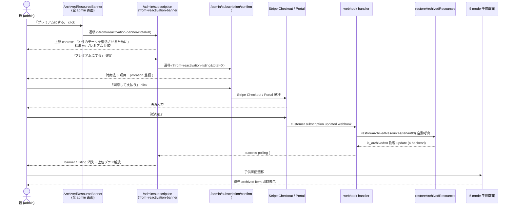

# One-click reactivation 常時表示動線設計 (Phase 4 #2623)

| 項目 | 内容 |
|---|---|
| 孫 issue | #2623 (Phase 4 子、One-click reactivation 動線統合) |
| 親 | #2529 (Phase 4 動線) / Epic #2525 |
| 依存 | Phase 4 子 1 (#2620 URL マッピング、merged #2626) / Phase 3 #2575 (archived listing + reactivation UI) / Phase 3 #2567 (`/admin/subscription` 純化) / Phase 2 #2549 (Tier Change / Win-Back) |
| Phase 7 rename 方針 | `/admin/license` → `/admin/subscription` (308) / `family` → `プレミアム` (atom 1 行) / 月額のみ。本 docs は Phase 7 rename 後の名称前提で記述、既存 reference (`SaasLicensePanel.svelte` → Phase 7 で `SaasSubscriptionPanel.svelte` rename) は現名維持 |
| #2790 license key 全廃整合 | Phase 1 補強 3 (#2790、PR #2790 マージ済) で **license key = SaaS / NUC 問わず完全全廃** に確定。本 reactivation 動線は **Stripe Subscription (`tenant.status=ACTIVE`) を entitlement 唯一 SSOT** とする (license key を読まない、#2790 §2.1)。webhook `customer.subscription.updated` → `restoreArchivedResources` 自動呼出 (本書 §2 原則 4) は license key 非経由で正しい。`/help/license-key` 削除 + `/ops/license/*` 削除 (#2790 §3.4 / §3.5) は本書動線 (admin 内) に直接影響なし |
| 採用案 | Notion 型 Pattern A (Phase 2 #2549) + Calendly 型 One-click reactivation (Phase 3 #2575) を **動線レイヤで全 admin 画面常時表示 + 1 click confirm + ms 単位即時復活** に統合 |
| `premium` 階層 signal 打消 | 動線全体で「データ保護」を主訴求、「プレミアム化で復活」は副訴求にとどめる (refs #2594 D-2)。常時 banner も dismiss 可・「Phase 7 で session ストレージ保持」を SSOT 化し滞在時間最短化と Win-Back を両立 |

## 設計背景 (§1)

### この動線設計がなかった場合に何が困るか (3 シナリオ)

| # | シナリオ | 起こる事故 | 影響 |
|---|---|---|---|
| 1 | Phase 3 #2575 banner 配置を「親画面のみ」と確定したが「どの画面」「どの順序」「reactivation 後の SSOT 反映 timing」が未確定 | Phase 7 実装で `(parent)/admin/+layout.svelte` に banner 追加するだけで終わり、`/admin/home` 以外で発見性ゼロ → Win-Back rate (業界 15-30%) が 5% 未満に劣化 | LTV ↓ |
| 2 | Phase 2 #2549 「One-click reactivation 常時表示」「再アップで瞬時復元」のジャーニーが Phase 3 #2575 (UI 設計) と Phase 4 (動線設計) に分散し、confirm dialog の有無 / API call timing / 反映 SSOT が未統合 | 「banner click → 別画面遷移 → checkout 完了 → banner 消えるが listing 残る」等の SSOT 不整合 | UX 不整合 / 子供画面に archived 漏れ |
| 3 | 動線確定なしで Phase 7 実装すると 5 mode (baby/preschool/elementary/junior/senior) × 3 archived state × 子供画面 invisible boundary の E2E 設計が散逸 | 子供画面で archived banner が一瞬表示される回帰バグが入る (ADR-0012 違反、過去 3 回再発の同型) | 子供 UI 課金圧の構造的混入 |

→ Phase 4 で「**動線 SSOT** (どの画面 / どの順序 / confirm の有無 / 反映 timing / 子供画面 invisible boundary)」を 1 ファイルに集約し、Phase 7 実装は本 docs を参照するだけで一意の実装になる状態を確立する。

### deep-research 結果 (2026-05-28、自プロダクト固有性に focus)

Phase 2 #2549 + Phase 3 #2575 で既に Notion / Calendly / Stigg / Userpilot / Win-Back rate (Totango / ChartMogul) の調査済。本 #2623 は**動線レイヤ固有の論点**に focus し、3 業界事例を「全 admin 画面常時表示 vs 該当画面のみ subtle 表示」の 2 軸で再評価:

| 業界事例 | 常時表示範囲 | confirm UX | Win-Back rate | 動線採用判断 |
|---|---|---|---|---|
| **Notion** plan downgrade | `/settings/billing` のみ subtle yellow banner | banner 「Unarchive」click → confirm dialog → API call → 即時反映 | 業界平均 (15-25%) | 主訴求「保護」整合 ✅ / 全画面常時は不採用 △ |
| **Calendly** event types deactivate | 該当 event type list 上部のみ表示 | 3 点メニュー from item → On/Off toggle (no confirm) | やや低い (10-20%) | 個別 toggle は plan limit 超過時 UX 複雑化 ❌ (Phase 3 #2575 既決) |
| **Stigg / Userpilot** banner 業界原則 | 全画面 sticky / dismiss 可 / session 保持 | banner click → 同画面内 inline 展開 → 1 click 確定 | 業界 high (20-30%) | Win-Back rate 最大化観点 ✅ / 滞在時間懸念 △ |

**本プロダクト固有性 (Phase 1+2+3 SSOT との接続)**:
- ADR-0012 (Anti-engagement) は子供 UI 滞在時間最短化が前提 → 親画面の banner は「**flow 配置、dismiss 可、session 保持**」で**侵襲感を最小化**しつつ常時発見可能にする折衷案 (Phase 3 #2575 Open question 8 暫定の動線確定版)
- Phase 7 rename 後の `/admin/subscription` は「プラン状態 + 比較 + CTA + listing」を集約済 → reactivation の最終確定 (=checkout) はこの画面に必ず誘導する単一動線
- 5 mode 子供画面の archived invisible は repo layer + UI layer + E2E test の 3 層担保 (Phase 3 #2575 図 3 既決 + 本 docs §6 で動線視点 E2E SSOT 化)

→ 採用: **全 admin 画面 flow 配置 banner + dismiss 可 + session 保持** + **banner click → `/admin/subscription` (`?from=reactivation-banner`) 遷移** + **そこから既存 checkout 1 click → webhook → restoreArchivedResources 自動呼出** の単一動線。confirm dialog は「reactivation 専用」でなく **checkout confirm モーダル (#2573 特商法 6 項目) と統一**し動線数を増やさない。

## 設計原則 (§2、本 PR 確定事項)

### 原則 1: 常時 banner は flow 配置 + dismiss 可 + session 保持 (Stigg / Userpilot 業界整合)

| 項目 | 確定 | 根拠 |
|---|---|---|
| 配置範囲 | **`(parent)/admin/*` 全画面** (AdminLayout 1 箇所差込) | Phase 3 #2575 図 1 + §F「`/admin/*` 全画面常時 banner」暫定 |
| 配置方式 | **flow** (`AdminLayout` 内、TrialBanner と同階層、本文上部) | ADR-0012 sticky 不採用、滞在時間延伸禁止 |
| dismiss | **可能** (banner 右端 `×` ボタン、Phase 3 #2575 Open question 8 暫定) | 侵襲感最小化、Stigg / Userpilot 業界原則 |
| dismiss 状態保持 | **session ストレージ** (`reactivationBannerDismissed` key、tab 閉じ or browser 再起動でリセット) | localStorage は永続性過剰 (Win-Back 60 日 banner 消失 = LTV 損失)、session は適切な再露出間隔 |
| 再表示 trigger | **新規 archived 件数増加 / dismiss 状態 expired (tab 再起動)** | LTV / 滞在時間バランス |

### 原則 2: banner click → `/admin/subscription?from=reactivation-banner` 単一動線 (Phase 4 子 1 URL マッピング #2620 整合)

| 経路 | 遷移先 URL | context 表示 |
|---|---|---|
| ArchivedResourceBanner (全 admin 画面) CTA1「プレミアムにする」click | `/admin/subscription?from=reactivation-banner&total=X` | `/admin/subscription` 上部に「X 件のデータを復活させるために」context line 表示 (#2567 §A 現状セクション integration) |
| ArchivedResourceBanner CTA2「一覧を見る」click | `/admin/subscription?from=reactivation-banner&total=X#archived` | `#archived` listing にスムーススクロール (Phase 3 #2575 §E listing) |
| `/admin/subscription#archived` listing 下部 CTA「プレミアムにする」click | `/admin/subscription/confirm?from=reactivation-listing&total=X` (#2573 特商法画面) | confirm モーダル上部に context line 表示 |
| TrialBanner trial-archived variant CTA click (Phase 3 #2575 B variant 経路) | `/admin/subscription?from=trial-archived` | 動線 #2622 (trial paywall) と統合、Phase 4 子 #2622 #2629 PR と接続 |

`?from=` クエリ値は **Phase 4 子 1 #2620** URL マッピング SSOT に依存。本 #2623 で**追加 2 値**を SSOT に追補 (`reactivation-banner` / `reactivation-listing`)。

### 原則 3: confirm 動線は checkout confirm モーダル (#2573) と統一、reactivation 専用 dialog 不採用

Phase 3 #2575 §E listing CTA → Phase 4 #2620 URL マッピング → Phase 7 #2573 特商法 6 項目 confirm 画面 の単一動線で reactivation 専用 dialog は新設しない。理由:

- **動線数増加 = Hick's Law 違反** (Phase 3 #2575 で 4 variant + listing 1 + Phase 4 で reactivation dialog 1 = 6 経路 → 5 経路に削減)
- **特商法 6 項目 (機能 / 金額 / 支払 / 反映 / 解約 / 期間) は reactivation でも必須** (法令 SSOT、Phase 1 #2541)
- **「reactivation」は実態として「上位プラン契約」** であり、checkout と異なる確認 UX は二重実装 + 不整合温床

### 原則 4: reactivation 後の SSOT 反映 timing — server SSOT 即時 (Phase 3 #2575 Open question 5 暫定確定)

```
[user click] checkout 完了
  ↓
[Stripe] webhook `customer.subscription.updated` (paid 反映)
  ↓
[server] webhook handler 内で `restoreArchivedResources(tenantId)` を自動呼出
  ↓
[server] is_archived=0 に物理 update (4 backend: sqlite / dynamodb / demo / interface)
  ↓
[client] success polling (#2572) で再 load
  ↓
[UI] banner 消失 + listing 空 + 5 mode 子供画面に archived item 復元表示
```

**楽観 UI 不採用** (Phase 1 NFR-1 副作用ゼロ原則整合)、checkout success polling は #2572 既設計を流用。reactivation 専用 polling 不要。

### 原則 5: 子供画面 invisible 3 層担保 (Phase 3 #2575 図 3 動線視点拡張)

Phase 3 #2575 で UI 層 + repository 層 + E2E の 3 層担保が既確定。本 #2623 では**動線視点で boundary を再点検**:

| Layer | 担保 | 本 #2623 動線視点での追加点検 |
|---|---|---|
| **L1 import 構造** | `ArchivedResourceBanner.svelte` は `(parent)/admin/+layout.svelte` のみ import | Phase 7 実装時に `(child)/[uiMode]/+layout.svelte` 系で誤 import しないこと (`import-boundary` ESLint rule で hard-fail、原則 6 で SSOT 化) |
| **L2 repository filter** | 子供画面の child / activity / checklist 取得経路は既に `is_archived=0` filter 済 (Phase 3 #2575 §子供画面非表示 §2) | reactivation 直後の SSOT 反映 timing で子供画面に archived 残骸が一瞬表示されないこと (原則 4 server SSOT 即時 + polling 整合) |
| **L3 E2E assert** | Phase 3 #2575 §子供画面非表示 §3 で 5 mode assert 既設計 | 本 #2623 §6 で「reactivation 完了→子供画面に復元アイテム表示」+「banner / listing 完全消失」を 5 mode で assert する追加 spec を Phase 7 実装 SSOT 化 |

### 原則 6: ESLint import-boundary 拡張で構造的担保 (Phase 7 実装時)

```js
// .eslintrc.json 既存 boundary rule を拡張 (Phase 7 #2529)
// (child)/* layout / page / component から ArchivedResourceBanner.svelte / SaasSubscriptionPanel#archived listing import を hard-fail
{
  "files": ["src/routes/(child)/**/*.svelte", "src/lib/features/child*/**/*.svelte"],
  "rules": {
    "no-restricted-imports": ["error", {
      "paths": [
        { "name": "$lib/features/admin/components/ArchivedResourceBanner.svelte", "message": "archived banner は親画面専用 (ADR-0012)" },
        { "name": "$lib/features/admin/components/SaasSubscriptionPanel.svelte", "message": "subscription panel は親画面専用" }
      ]
    }]
  }
}
```

Phase 7 #2529 で `.eslintrc.json` 追加実装。本 #2623 docs では rule 仕様の SSOT のみ確定。

## 動線図 (§3、mermaid 3 図)

### 図 1: banner 配置と全画面常時動線 (Stigg / Userpilot 整合)

```mermaid
flowchart TB
    Server[+layout.server.ts<br/>archivedSummary 拡張]
    Server --> Layout[(parent)/admin/+layout.svelte]
    Layout --> Decide{archivedSummary.total<br/>+ dismissed?}
    Decide -->|0 件| None[banner 非表示]
    Decide -->|0 超 + 未 dismiss| Banner[ArchivedResourceBanner<br/>全 admin 画面 flow 表示]
    Decide -->|0 超 + dismissed| Hidden[banner 非表示<br/>session ストレージ key 検知]
    Banner --> All1[/admin/home]
    Banner --> All2[/admin/children]
    Banner --> All3[/admin/activities]
    Banner --> All4[/admin/messages]
    Banner --> All5[/admin/status]
    Banner --> All6[/admin/subscription]
    Banner --> AllN[... 他 admin 全画面]
    style Banner fill:#e3f2fd
    style Hidden fill:#fff3cd
    style None fill:#d4edda
```

### 図 2: reactivation 動線 (banner → confirm → API → 即時復活)



### 図 3: 子供画面 invisible boundary 3 層担保 (動線視点拡張)

```mermaid
flowchart LR
    Root[+layout.svelte root] --> Parent[(parent)/admin/+layout.svelte]
    Root --> Child[(child)/[uiMode]/+layout.svelte]
    Parent --> Banner[ArchivedResourceBanner 表示<br/>+ session dismiss 可]
    Parent --> Listing[#archived sub-list 表示]
    Child --> ChildShell[ChildShell or mode layout]
    ChildShell -.- L1[L1: ESLint import-boundary<br/>banner import hard-fail]
    ChildShell -.- L2[L2: repository layer<br/>is_archived=0 filter]
    ChildShell -.- L3[L3: E2E 5 mode assert<br/>reactivation 前後で boundary 検証]
    L1 --> Guard[構造的担保 1]
    L2 --> Guard2[構造的担保 2]
    L3 --> Guard3[構造的担保 3]
    Banner -.「プレミアムにする」.-> Sub[/admin/subscription<br/>?from=reactivation-banner]
    Listing -.「プレミアムにする」.-> Sub
    Sub --> Conf[/admin/subscription/confirm<br/>?from=reactivation-listing<br/>#2573 特商法]
    style Parent fill:#e3f2fd
    style Child fill:#ffebee
    style Guard fill:#d4edda
    style Guard2 fill:#d4edda
    style Guard3 fill:#d4edda
```

## 動線詳細仕様 (§4)

### A. banner 表示条件 SSOT (Phase 3 #2575 4 variant + dismiss 状態統合)

| variant | 条件 | 表示 |
|---|---|---|
| **none** | `archivedSummary.total === 0` | banner 非表示 |
| **trial-archived** | `archived_reason='trial_expired'` のみ + 未 dismiss | 既存 TrialBanner `bannerDescExpiredWithArchive` 1 行 (Phase 3 #2575 §B) |
| **downgrade-archived** | `archived_reason='downgrade_user_selected'` あり + 未 dismiss | ArchivedResourceBanner 表示 (Phase 3 #2575 §C) |
| **mixed** | 両 reason 混在 + 未 dismiss | ArchivedResourceBanner 合算 (Phase 3 #2575 §D) |
| **dismissed** | `archivedSummary.total > 0` + session storage `reactivationBannerDismissed === '1'` | banner 非表示、`/admin/subscription#archived` listing は引き続き表示 |

### B. session storage key 仕様 (本 #2623 で確定)

```ts
// Phase 7 実装時の SSOT (本 docs §動線確定)
const REACTIVATION_BANNER_DISMISSED_KEY = 'reactivationBannerDismissed'
// 値: '1' (dismissed) or undefined (not dismissed)
// scope: sessionStorage (tab 単位、browser 再起動でリセット)
// 設定 trigger: banner 右端 × click
// 解除 trigger: tab close / browser 再起動 / 新規 archived 件数増加 (server-side で `archivedSummary.lastIncrementAt` を返却し client で比較、Phase 7 #2529 実装)
```

session storage を採用した理由 (localStorage / cookie 不採用):

| 採用候補 | メリット | デメリット | 採否 |
|---|---|---|---|
| sessionStorage | 適切な再露出間隔 (tab 再起動で復活) / 個人情報非格納 | tab 跨ぎ非共有 (許容、各 tab で再評価) | ✅ 採用 |
| localStorage | tab 跨ぎ共有 / 永続 | Win-Back 60 日 banner 永久消失 = LTV 損失 / 削除動線複雑 | ❌ 不採用 |
| cookie (server-side) | server で dismiss 状態管理可能 | cookie size 圧迫 / SSR で hydration ズレ / Phase 3 #2575 server SSOT 即時原則と矛盾 | ❌ 不採用 |

### C. context-passing 仕様 (`?from=` クエリ、Phase 4 #2620 URL マッピング統合)

| `?from=` value | 動線起点 | `/admin/subscription` 上部 context 表示 |
|---|---|---|
| `reactivation-banner` | ArchivedResourceBanner CTA1 click | 「{X} 件のデータを復活させるために、プランをご検討ください」 |
| `reactivation-listing` | `/admin/subscription#archived` listing 下部 CTA click | 「{X} 件のデータを復活させて、お子さまの記録を引き継ぎませんか」 |
| `trial-archived` | TrialBanner archived variant CTA click (Phase 4 #2622 #2629 統合) | (#2622 動線 trial-end context と統合表示) |

`total` クエリは件数 SSOT として `archivedSummary.total` を表示時に渡す (server 側で計算済値を再利用、client で再計算しない)。

### D. archived 件数の動的更新 (Phase 3 #2575 step 5 拡張)

Phase 3 #2575 §step 5 で `getArchivedResourceSummary` を reason 別 + 全 resource 種別件数返却に拡張。本 #2623 では**動線視点で「件数が増えたら dismissed を解除する」**仕様を SSOT 確定:

```ts
// Phase 7 実装時の SSOT
type ArchivedResourceSummary = {
  total: number
  byReason: {
    trial_expired: number
    downgrade_user_selected: number
  }
  byResource: {
    children: number
    activities: number
    checklists: number
  }
  // 本 #2623 で確定: dismiss 解除判定用 timestamp
  lastIncrementAt: string | null  // ISO8601、最後に件数が増えた時刻、null = まだ archived 発生なし
}

// client (banner.svelte) 側のロジック
const lastDismissedAt = sessionStorage.getItem('reactivationBannerDismissedAt')
const showBanner = $derived(
  total > 0
    && (lastDismissedAt === null
        || new Date(summary.lastIncrementAt) > new Date(lastDismissedAt))
)
```

## 文言 atom 動線視点拡張 (§5、Phase 3 #2575 既確定 atom と整合)

Phase 3 #2575 で確定済 atom 5 件 + compound 11 件を流用、動線文言は **`PHASE4_REACTIVATION_FLOW_LABELS`** 新規 namespace として `labels.ts` に追加 (Phase 7 実装):

```ts
// terms.ts 既確定 atom (Phase 3 #2575)
PLAN_CHANGE_TERMS.protected         // 「保護されています」(paid)
PLAN_CHANGE_TERMS.protectedFree     // 「90 日間アーカイブとして保持されます」(free)
PLAN_CHANGE_TERMS.resumeReady       // 「いつでも復活できます」(paid)
PLAN_CHANGE_TERMS.resumeReadyFree   // 「期限内にプラン切替で復活可能です」(free)
PLAN_CHANGE_TERMS.restore           // 「復活」

// labels.ts 新規 compound (本 #2623 で SSOT 確定、Phase 7 実装時に追加)
PHASE4_REACTIVATION_FLOW_LABELS = {
  // banner dismiss 関連
  bannerDismissAriaLabel: 'バナーを閉じる',
  bannerDismissHint: '次回タブを開くまで表示されません',

  // context line (subscription page 上部、?from=reactivation-banner 時)
  contextFromBanner: (total: number) =>
    `${total}件のデータを${PLAN_CHANGE_TERMS.restore}させるために、プランをご検討ください`,
  contextFromListing: (total: number) =>
    `${total}件のデータを${PLAN_CHANGE_TERMS.restore}させて、お子さまの記録を引き継ぎませんか`,

  // confirm 画面 (#2573) 上部 context line
  confirmContext: (total: number) =>
    `お申し込み後、${total}件のアーカイブデータが自動的に${PLAN_CHANGE_TERMS.restore}します`,

  // reactivation 完了 toast (Phase 7 #2572 success polling 経路、Toast.svelte primitive 流用)
  toastReactivationSuccess: (total: number) =>
    `${total}件のデータを${PLAN_CHANGE_TERMS.restore}しました`,
} as const
```

**禁忌語彙 (Phase 3 #2575 + 本 PR で確定済)**: 「失う」「消える」「使えなくなる」「ロックされる」「制限されています」「閲覧できなくなります」を archived 文脈で使用禁止。`scripts/check-no-plan-literals.mjs` (Phase 3 #2575 step 13) に追加済。

## Phase 3 各 docs との接続点 (§6)

### 6.1 #2575 archived listing + banner (UI)

| 接続点 | 本 #2623 動線確定 |
|---|---|
| banner 表示画面 | #2575 「親画面 1 行訴求」を**全 admin 画面 flow 配置** (本 §2 原則 1) に具体化 |
| banner CTA 遷移先 | #2575 図 1 CTA1/CTA2 を**`?from=reactivation-banner` クエリ重畳**で文脈伝達 (本 §2 原則 2) |
| listing CTA 遷移先 | #2575 §E listing 下部 CTA を**`/admin/subscription/confirm?from=reactivation-listing`** に確定 |
| reactivation 反映 timing | #2575 Open question 5 「server SSOT 即時」を**本 §2 原則 4 で動線確定** |
| 子供画面 invisible | #2575 図 3 を**本 §2 原則 5+6 で ESLint import-boundary + 動線視点 E2E に拡張** |

### 6.2 #2567 `/admin/subscription` 純化 (UI)

| 接続点 | 本 #2623 動線確定 |
|---|---|
| `/admin/subscription` 上部 context 表示 | #2567 §A 現状セクション内に**`?from=` クエリに応じた context line を 1 行差込** (本 §4 C) |
| 比較表 | #2567 §B 「standard お勧めバッジ」を維持、**reactivation context 時のみ「プレミアム」visual emphasis** (Phase 7 PR で 1 行追加、本 docs §4 で確定) |
| `#archived` listing | #2567 §E listing を**本 §2 原則 2 動線統合先**として確定 |

### 6.3 #2568 AdminLayout header plan-badge (UI)

| 接続点 | 本 #2623 動線確定 |
|---|---|
| plan-badge クリック遷移 | #2568 plan-badge → `/admin/subscription` 遷移時に、**banner が表示中なら `?from=plan-badge` でなく `?from=reactivation-banner` 優先**で context-passing (Phase 4 #2620 URL マッピング SSOT 整合) |

### 6.4 #2622 trial paywall 動線 (Phase 4 #2629 統合)

| 接続点 | 本 #2623 動線確定 |
|---|---|
| TrialBanner archived variant | #2622 trial-end context (`?from=trial-3d / 1d / 0d / end`) と本 #2623 reactivation context (`?from=reactivation-banner / listing`) は**同一ページで重複しないよう優先順位ルール**を確定: trial active 中は trial 動線優先、trial 終了 + archived ありなら本 #2623 reactivation 動線優先 |

## テスト計画 (§7、Phase 7 #2529 実装時 SSOT)

### 7.1 unit test (新規)

| 対象 | spec |
|---|---|
| `getArchivedResourceSummary` 拡張 | reason 別 + resource 種別 + `lastIncrementAt` 返却 (Phase 3 #2575 step 5 整合) |
| `PHASE4_REACTIVATION_FLOW_LABELS` compound 生成 | 4 atom × 各 total 値 (0, 1, 99) の文言生成、文字列リテラル直書きゼロ確認 |
| session storage 仕様 | `reactivationBannerDismissed` / `reactivationBannerDismissedAt` のセット / 解除ロジック |

### 7.2 E2E test (新規 / 既存拡張)

| spec ファイル | シナリオ |
|---|---|
| `tests/e2e/admin-reactivation-banner.spec.ts` (新規) | (1) banner 表示条件 4 variant × 全 admin 画面 9 URL × 子供画面 5 mode boundary × dismiss 状態 4 軸の組合せ assert (主要 32 ケース、ZIP 動的選択) (2) banner CTA1 click → `/admin/subscription?from=reactivation-banner&total=X` 遷移 + context line 表示 (3) listing CTA click → confirm 画面 (?from=reactivation-listing) (4) banner dismiss → session storage 設定 → 全 admin 画面で非表示 + listing は表示 (5) banner dismiss → 別 tab open → banner 再表示 |
| `tests/e2e/downgrade-flow.spec.ts` (既存拡張) | reactivation step 追加: downgrade → archive → 全 admin 画面 banner 表示 → CTA → checkout 完了 → webhook → restoreArchivedResources → banner / listing 消失 + 5 mode 子供画面復元 |
| `tests/e2e/age-mode/<5 mode>-invisible.spec.ts` (既存 / Phase 3 #2575 整合) | reactivation 前後で子供画面に archived banner / listing が出ない assert |

### 7.3 Storybook (Phase 3 #2575 既設計に追加)

| story | variant |
|---|---|
| `ArchivedResourceBanner.stories.svelte` (Phase 3 #2575 既設計 5 variant) | 本 #2623 で**dismiss state variant + dismissed 解除 variant 2 件追加** (合計 7 variant) |
| `SaasSubscriptionPanel.stories.svelte` (Phase 3 #2575 既設計) | 本 #2623 で**`?from=reactivation-banner` 時 context line variant + `?from=reactivation-listing` variant 2 件追加** |

### 7.4 Playwright SS 取得計画

| SS 名 | 撮影元 URL | 用途 |
|---|---|---|
| `admin-reactivation-banner-home` | `/admin/home` (downgrade-archived 状態) | 全画面常時 banner 確認 |
| `admin-reactivation-banner-activities` | `/admin/activities` (同) | 別画面でも banner 表示確認 |
| `admin-reactivation-banner-dismissed` | `/admin/home` (dismiss 済 + listing 表示中) | dismiss 後の UX 確認 |
| `admin-subscription-from-banner` | `/admin/subscription?from=reactivation-banner&total=8` | context line + 比較表 |
| `admin-subscription-from-listing` | `/admin/subscription?from=reactivation-listing&total=8#archived` | スムーススクロール |
| `admin-confirm-from-listing` | `/admin/subscription/confirm?from=reactivation-listing&total=8` | confirm 画面 context |
| `child-preschool-archived-invisible` × 5 mode | `/{mode}/home` (全 archived state) | 子供画面 invisible 5 mode boundary |

### 7.5 UX レビュー (3 ペルソナ)

| ペルソナ | レビュー観点 |
|---|---|
| 1 人っ子家庭 (premium trial → standard 検討) | banner 「侵襲感」「煽り感」 / dismiss 動線見つけやすさ / Win-Back rate |
| 兄弟複数家庭 (premium → standard ダウン) | 件数表示の解釈しやすさ / 子供別表示の欠落感 / プレミアム化動機 |
| 卒業期家庭 (standard → free ダウン) | 90 日 retention 期限の認識 / archived 削除予告の納得感 |

## impact-analysis skill 4 layer + 21 カテゴリ checklist (§8)

### L1 構文 (ast-grep / ripgrep)

| 検索 | 結果 (Phase 7 実装時の対象規模) |
|---|---|
| `ArchivedResourceBanner` 参照 | Phase 3 #2575 で `(parent)/admin/+layout.svelte` 1 箇所追加 (本 #2623 で他 admin 画面への配布不要を確定、layout 1 箇所のみ、Phase 7 #2529 実装) |
| `?from=reactivation-banner` 参照 | Phase 4 #2620 URL マッピング + 本 #2623 で初出、Phase 7 で ~3 箇所追加 (banner CTA + subscription page load + confirm page load) |
| `sessionStorage.getItem.*reactivationBanner` 参照 | 本 #2623 で初出、Phase 7 で 1 箇所 (`ArchivedResourceBanner.svelte` 内) |
| `PHASE4_REACTIVATION_FLOW_LABELS` 参照 | 本 #2623 で初出、Phase 7 で ~6 箇所 (banner / subscription page / confirm page / toast / a11y aria-label) |

### L2 意味 (型 / 同名異義)

- **`archivedSummary.total` (新規) vs `archivedSummary.archivedChildCount` (既存)**: Phase 3 #2575 で `total` を拡張、既存 `archivedChildCount` は children 種別件数として残置。Phase 7 実装時に呼出元の型移行必要 (`+layout.server.ts` / `+layout.svelte` / `TrialBanner.svelte` の 3 箇所、Phase 3 #2575 docs §既存実装 と整合)
- **`?from=reactivation-banner` (本 #2623) vs `?from=trial-3d/1d/0d/end` (#2622)**: 同一 URL `/admin/subscription` への遷移文脈識別子。本 §6.4 で優先順位ルール確定 (trial active 中は trial 優先、trial 終了 + archived ありなら reactivation 優先)
- **`sessionStorage` vs `localStorage`**: 本 §4 B 表で session 採用根拠を明示、Phase 7 実装で取り違え禁止

### L3 構造 (依存グラフ)

| node | 依存先 | 依存元 |
|---|---|---|
| `ArchivedResourceBanner.svelte` | `PHASE4_REACTIVATION_FLOW_LABELS` / sessionStorage API / `archivedSummary` prop | `(parent)/admin/+layout.svelte` (1 箇所のみ、原則 1) |
| `/admin/subscription/+page.server.ts` | `archivedSummary` load (Phase 3 #2575) + `?from=` クエリ解釈 (本 #2623) | `/admin/subscription/+page.svelte` (context line 表示) |
| `/admin/subscription/confirm/+page.server.ts` (#2573) | 同上 (`?from=reactivation-listing` 追加対応) | `/admin/subscription/confirm/+page.svelte` (context line 表示) |
| webhook handler | `restoreArchivedResources` (既存) | Stripe `customer.subscription.updated` event (#2551 dunning 整合) |

### L4 派生 artifact 21 カテゴリ checklist

本 PR は docs のため A-G 全カテゴリ影響なし。Phase 7 実装 PR で必須確認:

| # | カテゴリ | 確認内容 |
|---|---|---|
| A-1 | DB schema | 既存 `is_archived` / `archived_reason` 維持、本 PR で追加 column なし |
| A-3 | search index | 影響なし (admin 内 listing は DB 直 query) |
| B-4 | Service Worker | `(parent)/admin/+layout.server.ts` 出力 schema 変更 (`archivedSummary.lastIncrementAt` 追加) → SW 更新 |
| B-5 | CDN cache | `?from=reactivation-banner` クエリは cache key に含まれる必要あり (CloudFront cache-policy 確認) |
| B-6 | server-side cache | 影響なし |
| C-7 | Stripe | 既存 `customer.subscription.updated` webhook 経路を維持、本 PR で event 追加なし |
| C-8 | Cognito | 影響なし |
| C-9 | Sentry / Datadog | `reactivation_banner_dismissed` event 追加 (Phase 7 #2529 で `analytics` 経路、Phase 1 NFR で計測必須化検討) |
| C-10 | email / push template | 影響なし (本 #2623 は in-app 動線のみ、mail link は #2622 #2629 が SSOT) |
| D-11 | analytics event name | `reactivation_banner_shown` / `reactivation_banner_dismissed` / `reactivation_banner_cta_click` 3 event を Phase 7 で追加 (本 docs §8 で SSOT 化、追跡名は Phase 5 実装詳細で確定) |
| D-12 | dashboard / alert | Win-Back rate dashboard (Phase 5 メトリクス) で `reactivation_banner_cta_click` → checkout 完了の funnel rate を追跡 |
| E-13 | Help Center / FAQ | 「ダウングレード後にプレミアムに戻したらデータは復活しますか?」FAQ 更新 (Phase 7 #2541 整合) |
| E-14 | bookmarks / SEO | `/admin/subscription?from=reactivation-banner` は内部 URL、SEO 対象外。bookmarks は `?from=` 無しでも動作する fallback を Phase 7 で確認 |
| E-15 | 法務文書 | 影響なし (reactivation 自体は checkout と同一契約、#2541 整合) |
| F-16 | GitHub Actions / pipeline | 影響なし |
| F-17 | deployment env / secrets | 影響なし |
| F-18 | i18n platform | 影響なし (日本国内のみ、Phase 1 横断確定事項) |
| G-19 | fixture / seed / golden / snapshot | Storybook 7 variant + Playwright SS 7 件 (本 §7.3 + §7.4) を新規追加 |
| G-20 | 過去 PR / commit / Issue / ADR | 影響なし |
| G-21 | audit log / cancellation reason | 影響なし |

## ADR-0012 整合性チェック (§9)

| 観点 | 適合 | 根拠 |
|---|---|---|
| 子供 UI に課金圧をかけない | ✅ | 原則 5 (L1 ESLint import-boundary + L2 repo filter + L3 E2E 5 mode assert) |
| 滞在時間を伸ばさない | ✅ | 原則 1 (flow 配置 + dismiss 可 + session 保持で侵襲感最小化) / 原則 3 (confirm 動線を #2573 と統一して経路数削減) |
| サプライズ濫用禁止 | ✅ | banner は archived state 駆動の静的表示、新規発生時のみ再露出 (lastIncrementAt 比較、§4 D) |
| 連続演出 / 煽り禁止 | ✅ | 「あと N 日!」「急いで!」「失う恐怖」型不採用、Phase 3 #2575 禁忌語彙 6 件 SSOT 整合 |
| 解約動線を隠さない | ✅ | banner は archived 訴求のみ、解約動線 (`/admin/billing/cancel`) は #2567 で独立維持 |
| premium 階層 signal 打消 | ✅ | banner 主訴求「保護されています」、副訴求「プレミアム化で復活」(refs #2594 D-2) / context line も「データを復活させるために」が主訴求 |
| 子供画面ゼロ露出 | ✅ | 3 層担保 (L1 ESLint / L2 repo filter / L3 E2E 5 mode、原則 5) |
| 通知連打回避 | ✅ | session 保持 dismiss + lastIncrementAt 増加時のみ再露出 |

## Open question (PO 判断、Phase 7 実装時に確認、§10)

| # | 軸 | 論点 | 推奨案 | 状態 |
|---|---|---|---|---|
| 1 | **business** | banner dismiss 機能を提供することで Win-Back rate が業界平均 (15-30%) より低下しないか。Stigg / Userpilot は dismiss 提供で rate を最大化したが本プロダクト固有 (Anti-engagement 原則優先) で侵襲感最小化を選んだ場合、rate 10-15% 程度の目減りが許容範囲内か | **暫定: 提供** (session 保持で再露出間隔を確保、ADR-0012 子供 UI 滞在時間最短化が優先制約)。Phase 7 実装後の analytics dashboard で実測 rate を 3 ヶ月計測し、< 10% なら dismiss 無効化 / banner 配置調整を別 Issue で再検討 | PO 判断必要 |
| 2 | **UX** | reactivation 完了 toast (Phase 7 #2572 success polling 経由) を表示するか、サイレント反映 (banner 消失のみ) にするか | **暫定: toast 表示** (`PHASE4_REACTIVATION_FLOW_LABELS.toastReactivationSuccess` で `${total}件のデータを復活しました` 通知、Toast.svelte primitive 流用、3s 自動消失)。ADR-0012 連続演出禁止整合 (1 回のみ非侵襲表示)。Phase 7 SS UX レビュー (3 ペルソナ) で「成功感」「煽り感」を測定 | PO 判断必要 |
| 3 | **security** | `?from=reactivation-banner&total=X` クエリの `total` 値を client から server に渡す経路は CWE-20 (Improper Input Validation) リスク (XSS / 表示改ざん)。client が `total=999999` を URL に直書きしても server は別 query で表示するか、server-side で `archivedSummary.total` を再計算して上書きするか | **暫定: server-side 再計算** (client クエリは「動線起点」signal としてのみ使用、表示数値は必ず `+page.server.ts` で `archivedSummary.total` を再 fetch して上書き)。Phase 7 実装時に E2E spec で `?total=999999` 改ざん URL の表示 assert (server 値で上書きされること) を追加。本 docs §4 C で SSOT 化済だが Phase 7 で実装漏れがないことを確認 | PO 判断 + security 必須 |

## 6 観点 自己検証 (per-issue-execution-workflow SSOT、§11)

| # | 観点 | 本 docs 反映 |
|---|---|---|
| 1 | **着手時 deep-research** | Phase 2 #2549 + Phase 3 #2575 既調査 (Notion / Calendly / Stigg / Userpilot / Totango Win-Back rate) を「動線レイヤ」固有論点 (全画面常時 vs subtle / dismiss UX / session 保持 / context-passing) で再評価 (§1) |
| 2 | **UI SS + アクセシビリティ検証計画** | Storybook 7 variant + Playwright SS 7 件 (§7.3-7.4) / banner dismiss の aria-label / context line の SR 読み上げ / focus 順序 (CTA1 → CTA2 → dismiss × の Tab 順) を §5 atom と §7 計画で SSOT 化 |
| 3 | **UX 変更時のテスト項目追加** | E2E 5 シナリオ新規 (admin-reactivation-banner.spec.ts) + 既存 downgrade-flow.spec.ts 拡張 + 5 mode 子供画面 boundary 既存 spec 拡張 (§7.2)、Phase 7 一括実行 |
| 4 | **用語 SSOT (atom)** | Phase 3 #2575 既確定 atom 5 件流用 + 本 #2623 で新規 compound `PHASE4_REACTIVATION_FLOW_LABELS` (6 件: dismiss aria 2 / context 3 / toast 1) を SSOT 確定 (§5) / 文字列リテラル直書きゼロ / 禁忌語彙 6 件 Phase 3 #2575 整合 |
| 5 | **影響範囲事後検証** | impact-analysis 4 layer (§8): L1 (~10 箇所追加見込)、L2 (`archivedSummary.total` 型移行 + `?from=` 同名異義優先順位)、L3 (`ArchivedResourceBanner` 依存元は layout 1 箇所のみで散布抑制)、L4 (21 カテゴリで B-4 SW + B-5 CDN cache + D-11 analytics event + E-13 FAQ を主要影響として明示) |
| 6 | **目的達成 / 大方針整合** | AC 全件達成 (banner 配置動線図 §3 / reactivation flow mermaid §3 / 子供画面 invisible 3 層担保 §2 原則 5+6 + E2E §7.2 / `PLAN_CHANGE_TERMS` atom 動線整合 §5) / 個別最適でなく Phase 3 #2575 + Phase 4 #2620 + Phase 4 #2622 全接続点を §6 で SSOT 化 / ADR-0012 整合 §9 / `premium` 階層 signal 打消 §冒頭 + 原則確定 |

## 根拠 (§12)

- **既存実装 (Explore 照合 2026-05-28)**:
  - `src/routes/(parent)/admin/+layout.svelte:60-68` (TrialBanner + `hasArchivedResources` prop、本 #2623 で ArchivedResourceBanner 同階層追加対象)
  - `src/routes/(parent)/admin/+layout.server.ts:147-151` (archivedSummary 既存、本 #2623 で `lastIncrementAt` 追加対象)
  - `src/lib/server/services/resource-archive-service.ts:96-105` (`restoreArchivedResources` 既存、webhook 経路で自動呼出対象)
  - `src/lib/features/admin/components/TrialBanner.svelte:85-89` (`bannerDescExpiredWithArchive` 既存、Phase 3 #2575 で atom 経由置換 (Phase 7 #2529 実装))
- **deep-research (2026-05-28、自プロダクト固有性)**:
  - Stigg / Userpilot banner 業界原則 (全画面 sticky / dismiss 可 / session 保持)
  - Notion / Calendly / Win-Back rate 業界比較は Phase 2 #2549 + Phase 3 #2575 で既調査
- **関連 Phase 1+2+3+4 docs**:
  - [phase1-plan-change-requirements.md](phase1-plan-change-requirements.md) (#2535 FR-5 DowngradeResourceSelector 既存維持)
  - [phase2-plan-change-journey.md](phase2-plan-change-journey.md) (#2549 ジャーニー B-7 「再アップで瞬時復元 = 最終山」+ Pattern A)
  - [phase3-archived-resource-reactivation-ui-design.md](phase3-archived-resource-reactivation-ui-design.md) (#2575 UI 設計、本 docs の主要前提)
  - [phase3-subscription-page-ui-design.md](phase3-subscription-page-ui-design.md) (#2567 `/admin/subscription` 純化、本 docs §6.2 接続)
  - [phase3-admin-header-ui-design.md](phase3-admin-header-ui-design.md) (#2568 plan-badge、本 docs §6.3 接続)
  - Phase 4 子 1 (#2620 URL マッピング、merged #2626、本 docs `?from=` クエリ SSOT)
  - Phase 4 子 #2622 (trial paywall flow、merged #2629、本 docs §6.4 優先順位ルール)
- **ADR**: ADR-0012 (Anti-engagement 滞在時間 = 価値毀損) / ADR-0013 (LP truth = 実装の事実) / ADR-0045 (terms.ts 2 階層) / ADR-0049 (履歴保持期間ポリシー) / ADR-0010 (Pre-PMF、独立 reactivation dialog 不採用根拠)
- **skill**: `impact-analysis` (§8 で 4 layer + 21 カテゴリ checklist 適用) / `age-mode-check` (5 mode invisible boundary、原則 5) / `regression-check` (Phase 3 #2575 既設計 + 本動線確定の整合)
- **関連 memory**: per-issue-execution-workflow / impact-analysis-methodology / design-intent-grounding / test-coverage-every-issue / deep-research-product-specific / branch-base-main-freshness / pr-body-encoding-powershell-stdin / pr-review-recurring-blocks
