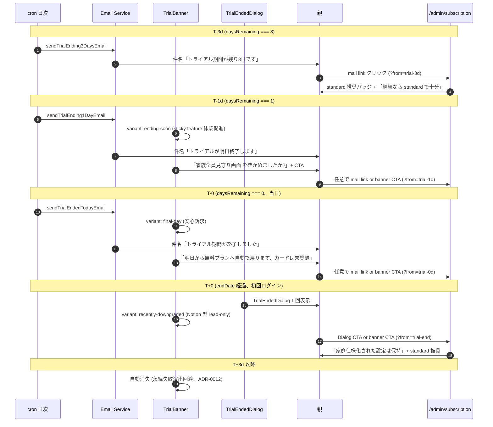
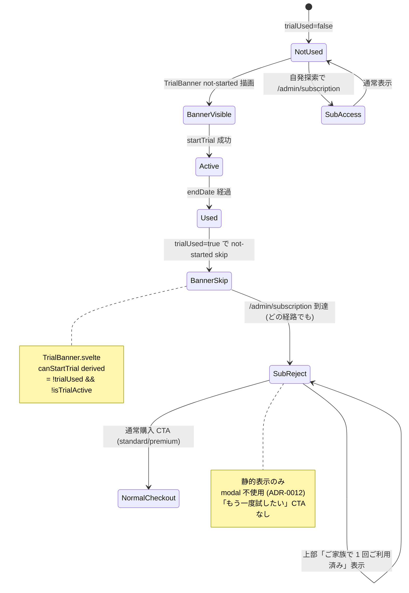

# trial→in-app paywall 動線設計 (Reverse Trial パターン C 整合、Phase 4 #2622)

| 項目 | 内容 |
|------|------|
| 孫 issue | #2622 (Phase 4 子、trial→in-app paywall 動線 = Reverse Trial パターン C 整合) |
| 親 | #2529 (Phase 4 動線) / Epic #2525 |
| Phase 1 整合 | [phase1-trial-requirements.md](phase1-trial-requirements.md) (trial 終了 = cancel 自動降格 / 1 回制限 family-tenant 単位 / 3 タッチ通知 + モーダル) + [phase1-plan-naming-pricing-axis-requirements.md](phase1-plan-naming-pricing-axis-requirements.md) (プレミアム rename / 月額のみ / V4 decoy: premium 最右 + standard 推奨) |
| Phase 2 整合 | [phase2-trial-journey.md](phase2-trial-journey.md) (Reverse Trial 4 核要素 / 谷①「資産保護」型フレーミング / 降格 3 タッチ + メール 1 件) + [phase2-checkout-journey.md](phase2-checkout-journey.md) (パターン C = `LP CTA → app signup → trial 自動付与 → in-app paywall → checkout` / 4 谷統合) |
| Phase 3 整合 | [phase3-trial-banner-ui-design.md](phase3-trial-banner-ui-design.md) (#2571 6 variant: not-started/progress/sticky-invite/ending-soon/final-day/recently-downgraded) + [phase3-feature-gate-ui-design.md](phase3-feature-gate-ui-design.md) (#2570 tooltip CTA → `/admin/subscription` 1 タップ遷移) + [phase3-subscription-page-ui-design.md](phase3-subscription-page-ui-design.md) (#2567 standard 推奨バッジ + family ダウン経路) |
| 採用方針 | Phase 1+2+3 確定事項を **動線レイヤ** で繋ぐ。新規 UI は作らない。Phase 3 各 variant 間の **遷移条件 + URL 確定 + 3 タッチ timing** を SSOT 化 + ダウンセル動線 (premium trial → standard 検討者の比較表強調) を Phase 3 #2567 推奨バッジ機構に橋渡し |
| impact-analysis | L1 grep (`startsWith('/admin/license')` + `trial-notification-service` URL) + L2 表示 vs 内部識別子 (trial tier 'family' atom 維持) + L3 構造 (3 タッチ source: TrialBanner / email / TrialEndedDialog の重複なし) + L4 派生 artifact (email template 5 件 + LEGACY_URL_MAP) |

## 1. 設計背景 (なぜこの動線設計が必要か)

### 1.1 Phase 1+2+3 で個別に確定した要素が「動線として」未統合

| Phase 1 | Phase 2 | Phase 3 | 動線層で未確定 |
|---|---|---|---|
| trial 終了通知 3 タッチ (3 日前 / 1 日前 / 当日) のメール + 初回ログインモーダル (#2533 FR-14) | 谷①再フレーミング (「あと N 日!」型禁止 → 進捗フレーミング) + 降格 24h 前/当日/3 日後 (#2547) | TrialBanner 6 variant (#2571) + FeatureGate tooltip CTA (#2570) | **Phase 1 (3/1/0 日前) vs Phase 2 (24h 前 / 当日 / 3 日後) の 3 タッチ timing が不整合**。実装時にどちらを採用すべきか不明 |
| trial = family 固定 / 終了後 standard / family 選択可 (#2533 FR-2 + FR-9) | パターン C = `LP→signup→trial→in-app paywall→checkout` (#2548) | subscription 上部カード + standard お勧めバッジ (#2567) | **trial 終了通知の各タッチでの遷移先 URL** (mail link → `/admin/subscription` vs `/admin/subscription/confirm` vs `/admin/subscription?from=trial-end`) が未確定 |
| FR-2 family 固定 + FR-9 終了後 standard/family 選択可 = standard ダウンセル経路 (#2533) | 「1 人っ子家庭 (standard 検討者)」ペルソナで family 体験は過剰 / family loss を「失った」と誤認するリスク (#2547) | standard 推奨バッジ + decoy 効果 (#2567 / V4 framing #2588) | **family trial 終了時に standard ダウンセル動線を能動的に提示する mechanism** (例: 「family は過剰でしたか? standard で十分です」context-aware 文言) が未設計 |
| feature gate (#2570) | gate disable + tooltip + プランページ遷移既存堅牢 (#2548) | tooltip CTA 「プランを見る」 link → `/admin/subscription` 1 タップ遷移 (#2570) | **gate 経由で到達した paywall ページが「どの機能で gate されたか」を表示する context-passing mechanism** (deep-link `?from=feature-gate&feature=...`) が未設計 |
| trial 1 回制限 = family-tenant 単位 (#2533 FR-8) | 「ご家族で 1 回」文言 (#2547 stories US-5) | TrialBanner not-started variant で初回開始 CTA (#2571) | **2 回目試行時の reject 動線** (banner で「トライアル利用済み」表示 + 有料案内への遷移先 URL) が未確定 |

### 1.2 動線層で確定しないと Phase 7 実装で発生する事故

- 3 タッチ timing 不整合 → trial-notification-service.ts の cron schedule が Phase 1 (3/1/0 日前) で実装、TrialBanner が Phase 2 (24h 前 / 当日 / 3 日後) で実装 → **実機で「2 日前にメール来たけど banner は進捗表示のまま」のような UX 不整合**
- URL 不確定 → メール link が `/admin/license` 直書きで残り、`/admin/subscription` rename 後に dead link 化 (LEGACY_URL_MAP 経由で吸収可能だが、context-passing 不能)
- ダウンセル動線未設計 → premium trial 終了後の churn 増加 (Reverse Trial 業界比 conversion 25% 未達リスク、Phase 2 §「想定リスク」)
- gate context 不在 → paywall ページに「なぜ来たか」表示なく、conversion 動線が「自発的探索」依存

## 2. 設計原則

### 原則 1: Phase 1 (cron 通知) と Phase 2 (UI banner) の 3 タッチ timing を統一 SSOT で再定義

Phase 1 (`trial-notification-service.ts`) の cron は `daysRemaining ∈ {3, 1, 0}` を発火条件としているが、Phase 2 ジャーニーは降格を起点に `T-24h / T-0 / T+3d` を 3 タッチとした。両者は **同じ tenant が同じ trial 期間内に受け取る通知** であり統一が必須。

**統一 SSOT (本 #2622 で確定)**:

| 通知タッチ | timing | source | TrialBanner variant 同期 | 遷移先 URL |
|---|---|---|---|---|
| **T-3d (残 3 日)** | trial 残 3 日 (`daysRemaining === 3`) | cron email (`sendTrialEnding3DaysEmail`) | (banner は `progress` / `sticky-invite` 維持、煽らない) | mail link: `/admin/subscription?from=trial-3d` |
| **T-24h (残 24h-72h)** | trial 残 ≤ 1 day (`daysRemaining === 1`) | cron email (`sendTrialEnding1DayEmail`) + TrialBanner `ending-soon` variant | banner 切替: `ending-soon` (sticky feature 体験促進文言) | mail link: `/admin/subscription?from=trial-1d` / banner CTA: `/admin/status` (見守り画面、sticky feature 送客) |
| **T-0 (当日 = 残 0 day)** | trial 当日 / 終了直前 (`daysRemaining === 0`) | cron email (`sendTrialEndedTodayEmail`) + TrialBanner `final-day` variant | banner 切替: `final-day` (安心訴求「明日から自動で戻ります」) | mail link: `/admin/subscription?from=trial-0d` / banner CTA: `/admin/subscription` (プランを見る) / 副 CTA: 遷移なし (このまま無料で続ける) |
| **T+0 終了直後** | endDate 経過、初回ログイン | `TrialEndedDialog` (既存 modal) + TrialBanner `recently-downgraded` variant | modal 1 回 → dismiss → banner 表示 | dialog CTA: `/admin/subscription?from=trial-end` |
| **T+3d (3 日後 banner 消失)** | endDate +3 day | TrialBanner 自動非表示 (永続失敗演出回避、ADR-0012) | banner 消失 | — |

→ **Phase 1 の 3 タッチ (3/1/0 日前) + Phase 2 の終了後タッチ (T+0 + T+3d 消失) を統合**。Phase 2 が「24h 前 / 当日 / 3 日後」と言及していた箇所は **降格起点の 3 タッチ** であり、Phase 1 の trial 中 3 タッチ (3/1/0) と独立しない。本 §1 統一 SSOT で「trial 中 3 タッチ + 終了起点 2 タッチ」の計 5 イベントに整理。

### 原則 2: 全タッチで遷移先 URL は `/admin/subscription` 統一 + `?from=...` 経由で context-passing

trial 関連の動線終端は **`/admin/subscription`** 一本化 (Phase 1 補強 1 #2583 URL rename 整合)。各タッチからの遷移には **`?from=...` クエリで context を渡す** ことで、subscription page (#2567) が「どこから来たか」を判別し文言・推奨バッジを動的に切替えられる。

| `?from=` 値 | 起点 | subscription page (#2567) 側の振る舞い |
|---|---|---|
| `trial-3d` | T-3d email link | 上部に「残り 3 日、終了後は無料に戻ります」+ standard 推奨バッジ強調 (ダウンセル経路明示) |
| `trial-1d` | T-1d email link | 上部に「明日終了します」+ standard 推奨バッジ + family ダウン経路文言 |
| `trial-0d` | T-0 email link | 上部に「本日終了、明日から無料へ自動降格」+ standard 推奨バッジ |
| `trial-end` | TrialEndedDialog / banner `recently-downgraded` link | 上部に「家庭仕様化された設定は保持されました」+ standard 推奨バッジ (Notion 型 read-only 再アクセス導線) |
| `feature-gate` | FeatureGate tooltip link (#2570) | 上部に「○○の機能を解放するには」+ 該当 gate に関連する tier ハイライト (`?feature=<feature-id>` 副パラメータ) |
| `header-badge` | AdminLayout plan-badge クリック (#2568) | 上部 context なし (現プラン参照のため標準表示) |
| (なし) | 自発探索 (header `アップグレード` ボタン等) | 上部 context なし (標準表示) |

**実装ルール** (Phase 7):
- `+page.server.ts` で `url.searchParams.get('from')` を取得し、`load` 戻り値 `{ trialContextFrom: 'trial-3d' | ... | null }` で配布
- subscription page (#2567) の `+page.svelte` で `trialContextFrom` に応じた banner / 推奨 emphasis を分岐
- `?from=...` クエリは LEGACY_URL_MAP の URL rename と独立 (URL 本体は `/admin/subscription` 固定、クエリのみ動的)
- `?from=feature-gate` の場合は `?feature=<id>` 副パラメータも併用 (FeatureGate.svelte の `requiredTier` から判定)
- セキュリティ: `?from=...` は表示文言切替のみで認可境界には影響しない (任意の値が来ても標準表示にフォールバック)

### 原則 3: ダウンセル動線 (premium trial → standard 検討者向け) を能動的に提示

Phase 1 FR-2 「family 固定」 + FR-9 「終了後 standard/family 選択可」を、subscription page (#2567) の **standard 推奨バッジ** + V4 decoy framing (#2588) と連結。trial 終了通知 3 タッチでは standard ダウンセル経路を能動的に提示する。

**文言設計 (atom 経由、§4)**:

| timing | 推奨 文言 (compound) | ダウンセル整合 |
|---|---|---|
| T-3d email 内 | 「残り 3 日です。`${PLAN_FULL_TERMS.premium}` のすべての機能をお試しいただいています。継続される場合は、`${PLAN_FULL_TERMS.standard}` / `${PLAN_FULL_TERMS.premium}` のいずれかをお選びください」 | standard 併置で過剰感解消 |
| T-1d email 内 | 同上 + 「`${PLAN_FULL_TERMS.standard}` で十分なご家庭が多いプランです」(diagnostic hint) | V4 decoy: standard 推奨明示 |
| T-0 email 内 | 「本日終了、明日から `${PLAN_FULL_TERMS.free}` へ自動で戻ります。カードは登録されていません」+ 「継続される場合: `${PLAN_FULL_TERMS.standard}` `${PRICE_TERMS.standard}` (税込) / `${PLAN_FULL_TERMS.premium}` `${PRICE_TERMS.premium}` (税込)」 | 比較で choice paralysis 回避 |
| subscription page `?from=trial-end` | 上部に「`${PLAN_FULL_TERMS.premium}` 体験は終了しました。継続される場合は `${PLAN_FULL_TERMS.standard}` で十分なご家庭が多いです」 | standard 推奨バッジ + family は decoy 配置 |

**禁忌**:
- ❌ 「family 終了!」「premium で続けてください!」型の煽り (ADR-0012 violation)
- ❌ standard 推奨バッジを「人気!」「お得!」と煽る (中立的「✓ 推奨」のみ、#2567 整合)
- ❌ `${PRICE_TERMS.premium}` / `${PRICE_TERMS.standard}` の差分強調 ("月 ¥280 おトク" 等の per-day anchor は ADR-0012 violation、F1/F3 framing は #2588 で V1+V2 採用)

### 原則 4: feature gate (#2570) → paywall context-passing で conversion 強化

FeatureGate tooltip CTA (#2570) で `/admin/subscription` 遷移する際、**どの機能で gate されたか** を `?from=feature-gate&feature=<id>` で渡す。subscription page (#2567) はこの context を受けて「○○ を解放するには `${PLAN_FULL_TERMS.standard}` 以上が必要です」のような文言を上部に表示し、機能リスト訴求 (Phase 2 中間山 #2 sticky feature 送客 + #2567 比較表) に橋渡しする。

**feature ID 一覧 (Phase 7 atom):**

| feature ID | gate 対象 | 必要 tier | 上部文言 |
|---|---|---|---|
| `marketplace-import` | みんなのテンプレート取込 | standard | `${PLAN_FULL_TERMS.standard}` 以上で みんなのテンプレートを取込めます |
| `child-add` | 子供 3 人目以降 | standard | `${PLAN_FULL_TERMS.standard}` 以上で お子さま 3 人以上 ご登録いただけます |
| `activity-add` | 活動 4 つ目以降 | standard | `${PLAN_FULL_TERMS.standard}` 以上で 活動 4 つ以上 ご登録いただけます |
| `ai-suggest` | AI 活動提案 | premium | `${PLAN_FULL_TERMS.premium}` 以上で AI による活動提案 をご利用いただけます |
| `cloud-export` | クラウドエクスポート | premium | `${PLAN_FULL_TERMS.premium}` 以上で クラウドエクスポート をご利用いただけます |
| `weekly-report` | 週次レポート | premium | `${PLAN_FULL_TERMS.premium}` 以上で 週次レポート をご利用いただけます |

(`atom key` は Phase 1 補強 2 で `family` → `premium` rename 後、`feature` ID は安定 ID として维持)

### 原則 5: trial 1 回制限 (family-tenant 単位) の reject 動線

Phase 1 FR-8 「1 回制限、family (tenant) 単位」の 2 回目試行時:

- TrialBanner `not-started` variant は **trialUsed=true の場合は描画 skip** (既存 `canStartTrial` derived: `planTier === 'free' && !trialUsed && !isTrialActive` 維持)
- 代わりに subscription page (`/admin/subscription`) で「ご家族で 1 回ご利用済みです」を **静的表示** (modal でなく)、`PLAN_FULL_TERMS.standard` / `.premium` の通常購入 CTA に誘導
- gate tooltip から到達した場合は `?from=feature-gate&trial-used=true` でクエリ重畳、subscription page で「トライアル利用済み、有料プランへのお申し込みでご利用いただけます」を上部 banner で表示

**禁忌**: trial 利用済みユーザに対する「もう一度試したい」CTA 追加禁止 (Phase 1 FR-8 整合、admin_grant 経路は ops のみ)

### 原則 6: ADR-0012 連打回避整合の最終 gate

| 観点 | 動線設計での担保 |
|---|---|
| 子供 UI に課金圧をかけない | 全 5 タッチ (email 3 + dialog 1 + banner) は親宛のみ、子供画面ゼロ露出 (#2571 + ADR-0012 既存制約) |
| 通知連打禁止 | 同時表示 banner 最大 1 件 (#2571 §3.3 既存) + email 親宛 3 通 + dialog 1 回のみ + Push 不使用 (#2533 FR-14 既存) |
| サプライズ濫用禁止 | T-3d / T-1d / T-0 / T+0 / T+3d 消失 の 5 step を予告 + 各タッチ間に必ず ≥1 日のクールダウン |
| 滞在時間 = 価値毀損 | 全タッチで 1 step 遷移 (email link → 1 タップで subscription page、dialog → CTA 1 タップ、banner CTA 1 タップ) |
| 失敗演出禁止 | T+3d で banner 自動消失 (#2571 既存)、永続「expired」表示なし |
| 「失う恐怖」型コピー禁止 | 全文言「資産保護」型 (「データは残ります」「いつでも再有効化」#2571 既存) |

## 3. 動線図 (mermaid)

### 図 1: trial 終了通知 3 タッチ + 終了後 2 タッチ 動線 (T-3d → T+3d)



### 図 2: feature gate (#2570) → paywall context-passing 動線

```mermaid
flowchart TB
    User[親が gated 機能をタップ] --> Gate[FeatureGate<br/>section variant]
    Gate -->|tooltip / overlay| Tooltip[「○○プラン以上で利用可能」]
    Tooltip -->|プランを見る link クリック| Sub[/admin/subscription<br/>?from=feature-gate<br/>&feature=marketplace-import]
    Sub -->|context 表示| Context["上部 banner:<br/>「みんなのテンプレートを取込むには<br/>${PLAN_FULL_TERMS.standard} 以上が必要です」"]
    Context --> Compare[比較表で standard ハイライト]
    Compare --> Decide{家族の判断}
    Decide -->|standard 申込| Standard[/admin/subscription/confirm]
    Decide -->|premium 申込| Premium[/admin/subscription/confirm]
    Decide -->|戻る| Back[元の admin 画面に戻る<br/>gate disabled 状態維持]
    style Sub fill:#fff3e0
    style Context fill:#e3f2fd
```

### 図 3: trial 1 回制限 reject 動線 (family-tenant 単位)



## 4. atom / labels.ts 設計 (ADR-0045 整合)

### 既存 atom 流用 (新規追加 5、最小限)

| 既存 atom | 流用箇所 |
|---|---|
| `TRIAL_TERMS.duration` (= '7日間') | email subject / banner / subscription page |
| `TRIAL_TERMS.noCreditCardMid` (= 'カード登録不要') | T-0 email / banner final-day |
| `TRIAL_TERMS.noCreditCardDetailed` | T-0 email 詳細文 |
| `PLAN_FULL_TERMS.free` / `.standard` / `.premium` (Phase 7 rename 後) | 全タッチ文言 |
| `PRICE_TERMS.standard` / `.premium` / `.taxNote` (= '（税込）') | T-0 email 価格比較 |
| `CANCEL_TERMS.anytimeOk` | banner CTA 直下、subscription page |
| `ACTION_LABELS.viewPlans` | mail link / dialog CTA |
| `ADMIN_VIEW_TERMS.canonical` (= 'ご家族の見守り画面') | T-1d banner sticky feature 送客 |

### 新規 compound (`PHASE4_FLOW_LABELS` 新規 namespace、本 #2622 で確定)

```ts
// src/lib/domain/labels.ts に追加 (Phase 7)
// NOTE: tier 引数 'family' は Phase 7 で 'premium' rename 判断後、atom 1 行修正で全 95 件 + 本 compound 伝播。
// 本 docs では Phase 1 補強 2 確定の 表示名 'プレミアム' を前提に compound を記述。
export const PHASE4_FLOW_LABELS = {
  // === trial 終了通知 3 タッチ email 件名 (cron 経由、既存 sendTrialEnding* 関数差替対象) ===
  email3DaysSubject: `【がんばりクエスト】${TRIAL_TERMS.duration}トライアル期間が残り3日です`,
  email1DaySubject: '【がんばりクエスト】トライアルが明日終了します',
  email0DaySubject: '【がんばりクエスト】トライアル期間が終了しました',

  // === trial 終了通知 3 タッチ email 本文 (ダウンセル整合、standard 推奨) ===
  // T-3d: 中立表示
  email3DaysBodyHero: () =>
    `${PLAN_FULL_TERMS.premium} のすべての機能を ${TRIAL_TERMS.duration} お試しいただいています。継続される場合は、${PLAN_FULL_TERMS.standard} / ${PLAN_FULL_TERMS.premium} のいずれかをお選びください`,
  // T-1d: ダウンセル hint
  email1DayBodyHero: () =>
    `明日 ${TRIAL_TERMS.duration} のトライアルが終了します。${PLAN_FULL_TERMS.standard} で十分なご家庭が多いプランです`,
  // T-0: 自動降格 + 価格比較 (choice paralysis 回避)
  email0DayBodyHero: () =>
    `本日トライアルが終了し、明日から ${PLAN_FULL_TERMS.free} へ自動で戻ります。${TRIAL_TERMS.noCreditCardMid} のため、課金は発生しません`,
  email0DayBodyPriceCompare: () =>
    `継続される場合の月額: ${PLAN_FULL_TERMS.standard} ${PRICE_TERMS.standard}${PRICE_TERMS.taxNote} / ${PLAN_FULL_TERMS.premium} ${PRICE_TERMS.premium}${PRICE_TERMS.taxNote}`,

  // === subscription page `?from=...` 上部 context banner 文言 ===
  fromTrial3d: () =>
    `${TRIAL_TERMS.duration} トライアルは残り 3 日です。終了後は ${PLAN_FULL_TERMS.free} へ自動で戻ります`,
  fromTrial1d: () =>
    `${TRIAL_TERMS.duration} トライアルは明日終了します。${PLAN_FULL_TERMS.standard} で十分なご家庭が多いプランです`,
  fromTrial0d: () =>
    `本日 ${TRIAL_TERMS.duration} トライアルが終了します。明日から ${PLAN_FULL_TERMS.free} へ自動で戻ります`,
  fromTrialEnd: () =>
    `${PLAN_FULL_TERMS.premium} 体験は終了しました。トライアル中に作成された設定は保持されています。${PLAN_FULL_TERMS.standard} で十分なご家庭が多いプランです`,
  fromFeatureGate: (featureLabel: string, requiredTier: 'standard' | 'family') =>
    `${featureLabel} をご利用いただくには ${PLAN_FULL_TERMS[requiredTier]} 以上が必要です`,
  fromTrialUsed: () =>
    `${TRIAL_TERMS.duration} トライアルはご家族で 1 回ご利用済みです。引き続きすべての機能をご利用いただくには、有料プランへのお申し込みをお願いします`,

  // === feature gate (#2570) `?feature=<id>` の表示ラベル ===
  featureLabels: {
    'marketplace-import': 'みんなのテンプレートからの取込',
    'child-add': 'お子さま 3 人以上のご登録',
    'activity-add': '活動 4 つ以上のご登録',
    'ai-suggest': 'AI による活動提案',
    'cloud-export': 'クラウドエクスポート',
    'weekly-report': '週次レポート',
  },
} as const;
```

**禁忌**:
- ❌ 「あと N 日で終了します!」「急いで!」「お見逃しなく」型 atom (ADR-0012 違反、Phase 2 谷①再フレーミング指針、#2571 §4 禁忌と整合)
- ❌ standard 推奨を「人気!」「お得!」「みんなが選んでます」と煽る (中立的「で十分なご家庭が多い」のみ採用、#2567 整合)
- ❌ プラン文字列直書き (例: `'プレミアム体験中'` `'7日'` `'¥500'`) は ADR-0045 違反 → `PLAN_FULL_TERMS` / `TRIAL_TERMS` / `PRICE_TERMS` 経由
- ❌ `?from=...` クエリ値の文字列 hardcode (例: `'trial-3d'` を svelte 内に直書き) → const enum で SSOT 化必要 (`PHASE4_FROM_VALUES`、Phase 7 atom 拡張)
- ❌ コーヒー 2 杯比較等の per-day anchor (F1/F3 解は #2588 で V1+V2 採用、F7 解は V1+V3 で正面突破)

## 5. Phase 3 各 docs との接続点

### 5.1 #2571 TrialBanner (banner 切替条件 ⇔ 動線 timing 同期)

| 本 #2622 (動線) | #2571 (banner UI) | 同期確認 |
|---|---|---|
| T-3d email 発火 | banner variant は `progress` / `sticky-invite` 維持 (煽らない) | ✅ banner は煽らず、email でのみ通知 |
| T-1d cron + banner `ending-soon` | banner variant 自動切替 (`daysRemaining ≤ 3 かつ > 1`) | ✅ Phase 3 §3.3 既存判定整合 |
| T-0 cron + banner `final-day` | banner variant 自動切替 (`daysRemaining ≤ 1`) | ✅ Phase 3 §3.3 既存判定整合 |
| T+0 dialog + banner `recently-downgraded` | banner variant 自動切替 (endDate 経過後 3 日) | ✅ Phase 3 §3.3 既存判定整合 |
| T+3d banner 消失 | banner 自動非表示 | ✅ Phase 3 §3.2-F 既存整合 |
| banner CTA URL | `/admin/subscription` (boundary: subscription path では skip) | ✅ Phase 3 §2 原則 4 (表示境界) 整合、本 #2622 で `?from=...` クエリ重畳 |

### 5.2 #2570 FeatureGate (tooltip CTA → paywall context)

| 本 #2622 (動線) | #2570 (gate UI) | 同期確認 |
|---|---|---|
| gate tooltip CTA「プランを見る」 link | `<a href="/admin/subscription">プランを見る</a>` (section variant 既存) | ✅ 本 #2622 で `?from=feature-gate&feature=<id>` クエリ重畳 |
| feature ID 一覧 | 4 gate (marketplace / child-add / activity-add / 有料機能) は本 #2622 §2 原則 4 で SSOT 化 | ✅ Phase 7 実装時に `FeatureGate.svelte` の Props に `featureId?: string` 追加、href に query 結合 |
| `requiredTier` 表示 | Phase 3 §改善 1 atom `PLAN_GATE_LABELS.tooltipFor(tier)` 整合 | ✅ 本 #2622 でも `PLAN_FULL_TERMS[tier]` 流用 |

### 5.3 #2567 subscription page (上部 context + standard 推奨バッジ)

| 本 #2622 (動線) | #2567 (subscription page UI) | 同期確認 |
|---|---|---|
| `?from=...` 上部 context banner | Phase 3 §3 subscription page 上部「現状セクション」既存、本 #2622 で context 表示を追加 | ✅ load 関数で `trialContextFrom` を data に追加、`+page.svelte` で分岐表示 |
| standard 推奨バッジ + V4 decoy | Phase 3 §「お勧めバッジ」既存 (premium 最右 + standard 推奨、#2588 V4 framing) | ✅ 本 #2622 で `?from=trial-1d` / `trial-0d` / `trial-end` で推奨を **強調表示** (border 強調等の visual emphasis) を Phase 7 実装時に追加 |
| family ダウン経路 | Phase 3 §3「現状表示 + ダウン導線」既存 (`subscription-premium-active` variant) | ✅ 本 #2622 では家庭の **意思決定支援** に focus (visual emphasis は #2567 で実装、文言は本 #2622 で SSOT) |

### 5.4 #2568 AdminLayout header (plan-badge クリック遷移)

| 本 #2622 (動線) | #2568 (header UI) | 同期確認 |
|---|---|---|
| header plan-badge クリック → `/admin/subscription` (Phase 2 checkout journey 4 谷の改善要対応) | Phase 3 §「plan-badge クリック遷移追加」既存 | ✅ 本 #2622 では `?from=header-badge` クエリは標準表示 (context なし) のため追加 atom 不要 |

## 6. Phase 7 実装手順 (本 #2622 は docs のみ、実装は Phase 7)

1. `labels.ts` に `PHASE4_FLOW_LABELS` namespace 追加 (§4 atom 全件)
2. `trial-notification-service.ts` の email 関数を `PHASE4_FLOW_LABELS.email*` 経由に置換 + mail link を `/admin/subscription?from=trial-{3,1,0}d` に変更 (LEGACY_URL_MAP で `/admin/license` 経由も維持)
3. `TrialBanner.svelte` の variant 切替判定を本 §3 統一 SSOT 整合確認 (#2571 で既に判定実装済、本 #2622 で URL/timing 検証のみ)
4. `FeatureGate.svelte` Props に `featureId?: string` 追加、`section` variant の `<a href>` に `?from=feature-gate&feature={featureId}` 結合
5. `/admin/subscription/+page.server.ts` の `load` で `url.searchParams.get('from')` + `get('feature')` 取得、`{ trialContextFrom, gatedFeatureId }` 返却
6. `/admin/subscription/+page.svelte` で `trialContextFrom` に応じた上部 context banner 表示 (`PHASE4_FLOW_LABELS.fromTrial*` / `fromFeatureGate` / `fromTrialUsed` 切替)
7. `TrialEndedDialog` の CTA URL を `/admin/subscription?from=trial-end` に変更
8. Storybook stories: subscription page の `?from=*` 7 variant 追加 (Phase 7)
9. E2E: 動線 5 シナリオ追加 (§7)
10. impact-analysis 4 layer + 21 カテゴリ checklist を PR body 記載 (本 §9 整合)

## 7. テスト計画 (Phase 4 完了基準、test-coverage-every-issue 整合)

### unit test (vitest)

- `PHASE4_FLOW_LABELS.fromTrial3d()` ... `.fromTrialEnd()` の文言生成 (atom 反映確認、`grep` 互換)
- `PHASE4_FLOW_LABELS.fromFeatureGate('みんなのテンプレートからの取込', 'standard')` template literal 解決確認
- `?from=` クエリパース (subscription page `+page.server.ts` の load 関数 mock)

### E2E (Playwright)

- **シナリオ 1: trial 終了通知 3 タッチ + mail link 動線**
  1. DEBUG_TRIAL で `daysRemaining=3` 設定 → cron 起動 → email 1 通受信 (mock)
  2. email link クリック → `/admin/subscription?from=trial-3d` 遷移 → 上部「残り 3 日」context 表示
  3. `daysRemaining=1` 設定 → email + banner `ending-soon` 同期表示確認
  4. `daysRemaining=0` 設定 → email + banner `final-day` + 「カード未登録」明示確認
  5. endDate 経過 → TrialEndedDialog → CTA → `?from=trial-end` 上部「家庭仕様化保持」確認
  6. T+3d 経過 → banner 非表示確認

- **シナリオ 2: feature gate → paywall context 動線**
  1. free user が `?feature=marketplace-import` gate に到達
  2. FeatureGate tooltip CTA 「プランを見る」 クリック
  3. `/admin/subscription?from=feature-gate&feature=marketplace-import` 遷移
  4. 上部 banner「みんなのテンプレートからの取込 をご利用いただくには `${PLAN_FULL_TERMS.standard}` 以上が必要です」確認
  5. 比較表で standard 推奨バッジ確認

- **シナリオ 3: ダウンセル動線 (premium trial → standard 検討)**
  1. premium trial 中 user が email link `?from=trial-1d` で subscription page 到達
  2. 上部 banner「明日終了します + `${PLAN_FULL_TERMS.standard}` で十分なご家庭が多い」確認
  3. 比較表で standard が「✓ 推奨」visual emphasis 確認 (#2567 連動)
  4. standard 申込 → checkout 完了 → premium → standard へのダウンセル成立

- **シナリオ 4: trial 1 回制限 reject 動線**
  1. trialUsed=true 状態で free user → TrialBanner `not-started` 非表示確認
  2. `/admin/subscription` 自発到達 → 上部 banner「ご家族で 1 回ご利用済み」表示確認
  3. 「もう一度試したい」CTA が一切ないことを確認 (ADR-0012 整合)
  4. 通常購入 (standard / premium) CTA は存在することを確認

- **シナリオ 5: 子供画面ゼロ露出 (boundary test)**
  1. trial active 中に `/elementary/home` 遷移 → banner 非表示確認
  2. `/preschool/home` / `/junior/home` / `/senior/home` 全 5 年齢モードで確認
  3. 子供画面に課金 / プラン / trial 関連 UI 一切なしを確認 (ADR-0012)

### UX レビュー

- Phase 2 §「ペルソナ別 UX レビュー観点」3 ペルソナ (1 人っ子 / 兄弟複数 / 卒業期) で全 5 シナリオ確認
- Phase 1 補強 2 F1-F11 顧客不安の感じ方確認 (特に F4 trial 終了時、F5 縛り、F6 auto-renewal 忘却)
- 「standard で十分なご家庭が多い」文言の **過剰押し感** がないかペルソナ別評価

## 8. ADR-0012 整合性チェック (本動線設計の最終 gate)

| 観点 | 適合 |
|---|---|
| 子供 UI に課金圧をかけない | ✅ 全 5 タッチ親宛のみ + admin layout 限定描画 + child path 全 skip |
| 滞在時間 = 価値毀損 | ✅ 全タッチで 1 step 遷移 (email → 1 タップ / dialog → CTA / banner → CTA) |
| サプライズ濫用禁止 | ✅ T-3d / T-1d / T-0 / T+0 / T+3d 消失 の 5 step を事前予告、各タッチ間 ≥1 日クールダウン |
| 通知連打禁止 | ✅ 同時表示 banner 最大 1 件 + email 親宛 3 通 + dialog 1 回 + Push 不使用 |
| 連続ガチャ / 煽り禁止 | ✅ 「あと N 日!」「急いで」型 atom 禁止 (§4 禁忌)、文言は全て「資産保護」「家庭仕様化保持」型 |
| 販促文言審査 | ✅ standard 推奨は中立的「で十分なご家庭が多い」、family は decoy 配置 (V4 framing) |
| 失敗演出禁止 | ✅ T+3d で banner 自動消失、subscription page 上部 context は表示文言切替のみ (永続「失敗バッジ」なし) |
| 解約動線を隠さない | ✅ T-0 / T+0 で `${CANCEL_TERMS.anytimeOk}` micro-copy、Phase 2 cancellation journey 整合 |
| 階層 signal 打消 | ✅ premium 体験終了時の文言は「過剰でした、standard で十分」型でなく「standard で十分なご家庭が多い」中立表現 |
| プラン名差別表現 | ✅ 「上位プラン」「上級」「特別」等の差別語彙不使用 (#2588 D-2 整合) |

→ **Reverse Trial パターン C + ADR-0012 連打回避と本質的に整合**。

## 9. impact-analysis skill 4 layer 防御適用

### L1 構文 (ast-grep / ripgrep)

- `'/admin/license'` 直書き参照: `trial-notification-service.ts` 3 関数 + 5 箇所 (`mail link` 内) → 本 §6 step 2 で `/admin/subscription?from=trial-{3,1,0}d` に置換、LEGACY_URL_MAP 経由で旧 URL も維持
- `TRIAL_LABELS.*` 参照: 12 件 (本 PR scope では `PHASE4_FLOW_LABELS` 新規追加のみで既存参照は維持)
- `?from=` クエリパース実装: `/admin/subscription/+page.server.ts` 新規 1 件 + 既存 `?direct=true` (checkout 用) と独立

### L2 意味 (型 / 同名異義)

- `trial tier 'family'` 内部識別子 vs `PLAN_FULL_TERMS.premium` 表示 の区別: Phase 1 補強 2 で明文化済、本 docs でも内部識別子は `'family'` 維持 (Phase 7 で `'premium'` rename 判断は #2609 後)
- `?from=trial-3d` 等のクエリ値: 表示文言切替のみで認可境界に影響しない (任意値で標準表示にフォールバック)
- `featureId` (`'marketplace-import'` 等) は安定 ID で **atom rename の影響を受けない** (Phase 7 で `family` → `premium` rename 後も `featureId` は安定)

### L3 構造 (依存グラフ)

| 関連 component | 重複検証 | 結果 |
|---|---|---|
| `trial-notification-service.ts` (#2533 既存) | 3 タッチ email 発火 | 本 #2622 で文言と mail link URL を置換 (cron schedule と発火条件は維持) |
| `TrialBanner.svelte` (#2571) | 6 variant 自動切替 + URL 出力 | 本 #2622 で URL に `?from=trial-end` クエリ重畳 (variant 判定ロジックは #2571 SSOT 維持) |
| `FeatureGate.svelte` (#2570) | tooltip CTA「プランを見る」 link | 本 #2622 で href に `?from=feature-gate&feature=<id>` クエリ重畳 (Props に `featureId` 追加) |
| `/admin/subscription/+page.svelte` (#2567) | プランページ本体 | 本 #2622 で上部 context banner を分岐表示 (load で `trialContextFrom` 配布) |
| `/admin/subscription/+page.server.ts` | load 関数 | 本 #2622 で `?from=` / `?feature=` パース追加 (`url.searchParams.get`) |
| `TrialEndedDialog` (`+layout.svelte:72`) | trial 終了直後 modal 1 回 | 本 #2622 で CTA URL を `/admin/subscription?from=trial-end` に置換 (modal 動作は維持) |
| `AdminLayout` header `plan-badge` (#2568) | 「現プラン + 残日数」表示 | 本 #2622 で `?from=header-badge` は context なし扱い、追加 atom 不要 |

### L4 派生 artifact 21 カテゴリ checklist

| カテゴリ | 該当有無 | 対応 |
|---|---|---|
| A-1 DB schema | ❌ なし | 本 PR docs のみ |
| A-2 DB 保存済 string | ❌ なし | atom rename は #2609 follow-up、本 PR は動線 SSOT のみ |
| B-4 Service Worker cache | ⚠️ 軽微 | `?from=...` クエリは page-level cache に影響 (Phase 7 実装時 SvelteKit kit/load の `depends` 設定で対応) |
| C-7 Stripe | ❌ なし | trial 通知は Stripe 非経由 (`trial_history` DB) |
| C-10 email template | ⭕ **影響大** | `trial-notification-service.ts` 3 関数の HTML template / textBody / link 全更新 (Phase 7 step 2) |
| D-11 analytics event | ⚠️ 軽微 | `?from=...` 経由の paywall 流入を analytics event として記録するか follow-up Issue (Phase 7 任意) |
| E-13 Help Center | ⚠️ 軽微 | trial 終了通知の振る舞い変更は FAQ への反映が望ましい (Phase 7 任意、`site/faq.html` 更新) |
| E-14 SEO | ❌ なし | admin path はクロール対象外 |
| E-15 法務文書 | ⚠️ 軽微 | tokushoho.html `trial 終了後の挙動` 記述との整合確認 (Phase 7) |
| F-16 GitHub Actions | ❌ なし | CI gate 変更なし |
| F-17 env / secrets | ❌ なし | 新規 env なし |
| G-19 fixture / snapshot | ⭕ 影響あり | Storybook stories `subscription-page-*-from-*` 7 variant 追加 (Phase 7 step 8) + Playwright E2E snapshot 5 シナリオ (本 §7) |
| G-20 過去 PR / Issue | ❌ なし | git 履歴は更新しない |
| G-21 audit log | ❌ なし | trial 通知に audit 不要 (Pre-PMF) |

→ **C-10 email template + G-19 fixture / snapshot** が主要影響、Phase 7 実装 PR で 21 カテゴリ checklist 適用必須。

## 10. Open question (PO 判断、Phase 7 実装時に確認)

| # | 論点 | 状態 |
|---|------|------|
| 1 | `?from=...` クエリ値の正式名 (案: `trial-3d` / `trial-1d` / `trial-0d` / `trial-end` / `feature-gate` / `header-badge`) | 暫定、Phase 7 実装時に PO 最終確認 |
| 2 | T+3d banner 消失の正確な閾値 (24h / 72h / 7 日のいずれか) | 暫定 72h (3 日)、#2571 §13 Open question #2 と連動 |
| 3 | T-1d email 内「`${PLAN_FULL_TERMS.standard}` で十分なご家庭が多い」の表現強度 (中立 / 推奨 / 強い推奨のいずれか) | 暫定「で十分なご家庭が多い」(中立)、UX レビューで再評価 |
| 4 | mail link → subscription page の `?from=trial-{3,1,0}d` 動線で **mail open 計測** 追加是非 (analytics) | 暫定 Phase 7 任意、Pre-PMF 範囲 |
| 5 | 比較表で standard を `?from=trial-*` 経由時に visual emphasis (border 強調等) するか | 暫定 visual emphasis あり、#2567 連動で Phase 7 確定 |
| 6 | trial 1 回制限 reject 動線で「お問合せ → 例外付与」経路の追加是非 (現状 ops `admin_grant` のみ) | 暫定なし (#2533 FR-8 整合)、Pre-PMF 範囲外 |
| 7 | gate context-passing で `?feature=<id>` の SSOT (本 §2 原則 4 表) を terms.ts atom 化するか | 暫定 `PHASE4_FLOW_LABELS.featureLabels` で labels.ts 集約、atom 化は Pre-PMF 範囲外 |

## 11. 根拠

- **Phase 1**:
  - [phase1-trial-requirements.md](phase1-trial-requirements.md) (#2533): trial = family 固定 / 7 日 / cancel 自動降格 / 1 回制限 family-tenant / 3 タッチ通知 + モーダル / FR-11 contextual prompt at moment of intent
  - [phase1-plan-naming-pricing-axis-requirements.md](phase1-plan-naming-pricing-axis-requirements.md): プレミアム rename / 月額のみ / V4 decoy framing (premium 最右 + standard 推奨) / F1-F11 顧客不安
- **Phase 2**:
  - [phase2-trial-journey.md](phase2-trial-journey.md) (#2547): Reverse Trial 4 核要素 / 「ペルソナ別 UX レビュー観点」1 人っ子家庭 standard ダウンセル動線必要 / 谷①再フレーミング「資産保護」型 / 降格 3 タッチ + メール 1 件
  - [phase2-checkout-journey.md](phase2-checkout-journey.md) (#2548): パターン C = `LP→signup→trial→in-app paywall→checkout` (Linear / Notion 整合) / Phase 4 申し送り 7「trial 終了→in-app paywall」整合
- **Phase 3**:
  - [phase3-trial-banner-ui-design.md](phase3-trial-banner-ui-design.md) (#2571): 6 variant SSOT / 表示境界 (subscription path skip) / 進捗フレーミング
  - [phase3-feature-gate-ui-design.md](phase3-feature-gate-ui-design.md) (#2570): tooltip CTA + section overlay link → `/admin/subscription` 1 タップ遷移
  - [phase3-subscription-page-ui-design.md](phase3-subscription-page-ui-design.md) (#2567): standard 推奨バッジ + V4 decoy + 上部現状セクション
- **既存実装** (Explore 照合 2026-05-29):
  - `src/lib/server/services/trial-notification-service.ts:1-353` (3 タッチ email + getTrialExpirationInfo + processTrialNotifications)
  - `src/lib/server/services/trial-service.ts:1-219` (DEFAULT_TRIAL_DAYS=7 / DEFAULT_TRIAL_TIER='standard' / TrialStatus 型 / startTrial 1 回制限)
  - `src/lib/features/admin/components/TrialBanner.svelte:1-179` (現状 3 variant: active / not-started / expired、Phase 7 で 6 variant 拡張予定)
  - `src/lib/ui/components/FeatureGate.svelte:1-129` (現状 inline / section 2 variant、Phase 7 で tooltipFor + featureId props 拡張予定)
  - `src/routes/(parent)/admin/license/+page.server.ts:1-100` (現状 `/admin/license`、Phase 7 で `/admin/subscription` rename + `?from=` クエリ load 追加予定)
- ADR-0010 (Pre-PMF: trial conversion = revenue 直結 Bucket A) / ADR-0011 (baby = 親準備モード、子供 UI 全 trial UI 禁止) / ADR-0012 (Anti-engagement 連打回避) / ADR-0013 (LP truth) / ADR-0045 (atom/compound 2 階層) / ADR-0050 (Parent-Gate 子供 UI 露出禁止)
- deep-research: Phase 2 #2547 で既調査 (ProdPad / Elena Verna / OpenView / Userpilot Calendly / Stripe trial_will_end / Notion / Slack / Figma / Canva downgrade)。本 #2622 は既調査結果を **動線レイヤ** で接続するため新規 deep-research 不要 (per-issue-execution-workflow §1: 既調査の再利用整合)
- 関連 memory: [[per-issue-execution-workflow]] (6 観点 標準 workflow) / [[impact-analysis-methodology]] (4 layer 防御 + 21 カテゴリ) / [[design-intent-grounding]] (すべての判断に設計意図) / [[test-coverage-every-issue]] (完了基準にテスト計画) / [[deep-research-product-specific]] (自プロダクト固有性、本 PR は既調査結果再利用)
- skill: `impact-analysis` 4 layer 防御 + 21 カテゴリ checklist
