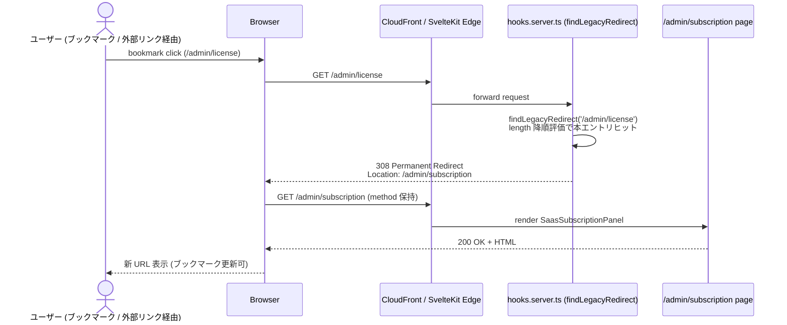
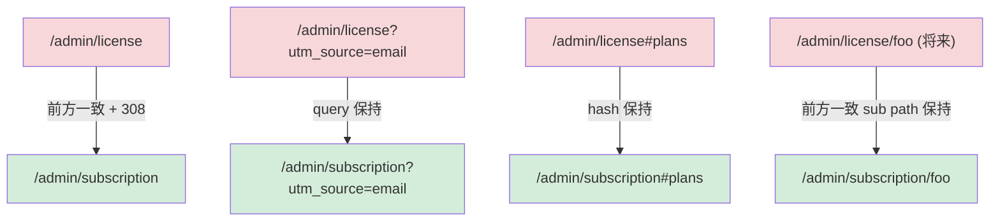
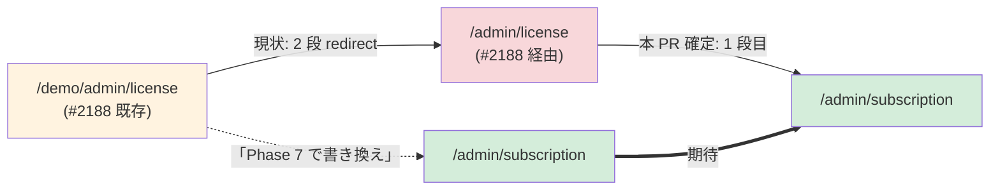

# URL マッピング / LEGACY_URL_MAP 動線設計 (Phase 4 #2620)

| 項目 | 内容 |
|------|------|
| 孫 issue | #2620 (Phase 4 子、最優先、グループ A 単独着手、他子の前提) |
| 親 | #2529 (Phase 4 動線設計) / Epic #2525 |
| Phase 1+2+3 整合 | Phase 1 補強 1 (#2583 URL 命名整合) + Phase 2 補強 (#2585 ジャーニー URL 同期) + Phase 3 #2567 採用案 C (4 ページ分割) |
| Phase 7 実装方針 | `/admin/license/` → `/admin/subscription/` 完全置換 + `LEGACY_URL_MAP` 永久エントリ 1 件追加 (308 Permanent Redirect) + 派生 `/admin/license/key` 整理 + `site/help/license-key.html` href 置換 |
| impact-analysis skill 適用 | L1 構文 grep (URL リテラル 38 件 / 14 ファイル) + L2 意味 (`/ops/license/*` ops internal tool / `licenses` table / `LICENSE_PLAN` enum との区別) + L3 構造 (依存グラフ) + L4 派生 artifact 21 カテゴリ (本 PR は docs 確定のみ、Phase 7 実装 PR で 21 カテゴリ checklist 必須適用) |
| 採用ステータスコード | **308 Permanent Redirect** (CLAUDE.md `#578` 既定値整合、`LEGACY_URL_MAP` 全 71 エントリ中既存 308 多数、永久保持原則と整合) |

---

## 1. 着手時 deep-research (本 issue 固有性 + 業界事例)

### 1.1 本プロジェクト固有性 (Explore 照合 2026-05-29)

- **`LEGACY_URL_MAP` は既に成熟**: 71 エントリ運用中、308 (Permanent / method 保持) と 301 (Permanent) を意図分離 (`/activity-packs/*` の 16 件は 301、年齢区分・demo・challenges 系は 308)
- **既存実装 SSOT**: `src/lib/server/routing/legacy-url-map.ts` (576 行)、`findLegacyRedirect()` は **length 降順**で評価 (長いプレフィックス優先、`/demo/admin/license` が `/demo/admin` より先にヒット)
- **テスト整備済**: `tests/unit/routing/legacy-url-map.test.ts` (整合性 + 個別エントリ assert) + `tests/e2e/legacy-url-redirect.spec.ts` (`maxRedirects: 0` で初回レスポンス検証、下流の認証 redirect と独立)
- **永久保持原則**: `src/routes/CLAUDE.md` `#578` 明文「エントリは永久保持（ブックマーク維持のため削除禁止）」
- **既存 entry の最近の追加事例 (2026-05 系)**:
  - `/admin/messages → /admin/cheer` (308、#2275、EPIC #2266 機能廃止系)
  - `/admin/events → /admin/challenges` (308、#2295、機能廃止 + 救済)
  - `/admin/achievements → /admin/challenges` (308、#1782、命名 + 機能統合)
  - `/admin/activities/introduce → /admin/activities` (308、#2371、二重ガイド撤廃)

### 1.2 業界事例 (HTTP redirect / SaaS rename ベストプラクティス)

- **308 vs 301 の選定 (RFC 7538)**:
  - 308 = Permanent Redirect、**method を保持** (POST → POST、GET → GET)
  - 301 = Moved Permanently、method 保持は historically ambiguous (古い実装で GET 化される)
  - 本 issue では `/admin/license` は GET のみだが、将来 POST/PUT/PATCH の API が ` /admin/license/foo` 配下に生まれた場合の安全側として **308 採用**
- **業界事例 (SaaS URL rename)**:
  - **Stripe API field rename**: dated version + 移行 guide + 内部 test app 先行 (本プロダクトは Pre-PMF + 顧客ゼロのため dated version 不要、単純置換で OK、ADR-0010 整合)
  - **Atlassian Jira Service Desk → Service Management**: UI / docs / marketing / support macros / training material / trademark 同時更新 (本 PR では UI/docs 同時、marketing/support は #2620 scope 外で Phase 7 一括対応)
  - **Slack channel rename**: name 参照 vs ID 参照の設計、legacy hardcoded webhook 破壊 (本プロダクトは URL = 表示用 alias の同型構造、`LEGACY_URL_MAP` が "name → 新 path" を持つことで対応)
  - **GitHub master → main**: CI/CD / Actions / branch protection が rename を follow しない (本 PR では CI で `/admin/license` リテラル参照を grep 確認、Phase 7 実装 PR で必須適用)
- **永久保持 vs sunset 削除**: 大規模 SaaS は 1-2 年で legacy redirect を sunset するが、本プロダクトは個人開発 + bundle size 影響軽微 + ブックマーク救済優先のため**永久保持**を貫徹 (CLAUDE.md `#578`)

### 1.3 残す対象 (legacy 互換性) 再確認 — Phase 1 補強 1 §FR-5 整合

Phase 1 補強 1 で確定した残す対象 13 entity のうち、本 issue (URL マッピング) で関係するもの:

| 対象 | 扱い (本 issue) | 理由 |
|---|---|---|
| `/ops/license/*` (ops internal tool) | **rename 対象外** | ops 専用 internal tool、ユーザー向け rename と独立層 (NUC license key 管理は internal 機能として残存) |
| `/admin/license/key` 派生 path | **本 PR で確認 (現状不存在)** | `src/routes/(parent)/admin/license/` 配下に `+page.server.ts` + `+page.svelte` の 2 ファイルのみ。`/key` サブ path は存在せず、Phase 7 で `/admin/subscription/` への mv で自動カバー |
| `LICENSE_KEY_STATUS` / `LICENSE_PLAN` / `AUTH_LICENSE_STATUS` enum | rename 対象外 | DB schema 後方互換 (NUC license key 内部状態、本 issue は URL のみ) |
| `licenseKey()` DynamoDB prefix / `licenses` table | rename 対象外 | DB schema 後方互換 |
| `LEGACY_URL_MAP` の旧 entry | **永久保持 (新規 1 件追加のみ)** | CLAUDE.md `#578` |
| `site/help/license-key.html` 内 `/admin/license` href | **本 PR で置換確認** (Phase 7 で実 mv) | legacy ユーザー向けキー管理ガイドだが「ライセンス管理を開く」CTA は新 URL `/admin/subscription` に向ける (FR-7 整合) |
| `docs/design/license-*-requirements.md` | rename 対象外 | 過去設計決定の歴史的記録 |

---

## 2. LEGACY_URL_MAP 永久エントリ確定

### 2.1 追加エントリ (1 件)

`src/lib/server/routing/legacy-url-map.ts` に **以下 1 件のみ**追加:

```typescript
// #2525 Phase 4 (#2620): /admin/license 廃止 + /admin/subscription 完全置換
// Epic #2525 ライセンスキー販売モデル撤廃 → サブスクリプションモデル統一 rename。
// Phase 1 補強 1 (#2583) で意味的整合性確定 (Spotify / Apple / Stripe / Lingokids 業界整合、
// 家庭向け B2C SaaS で `license` URL 事例ゼロ)。Phase 3 #2567 で UI 設計の前提となり、
// Phase 7 で実 mv + Components rename (SaasLicensePanel → SaasSubscriptionPanel 等) を実施。
//
// 前方一致のため `/admin/license/foo` も `/admin/subscription/foo` に救済される
// (現状 `/admin/license/key` 派生 path 不存在のため、将来 sub path 追加時の自動カバーも兼ねる)。
// 永久保持: CLAUDE.md `#578` 旧 URL 廃止ルール (ブックマーク維持のため削除禁止)。
{
  from: '/admin/license',
  to: '/admin/subscription',
  deletedAt: '2026-XX-YY',  // Phase 7 実装 PR で確定 (URL 実 mv 日付)
  issue: '#2525',
  reason:
    'ライセンスキー販売モデル撤廃 → サブスクリプションモデル統一 rename (Epic #2525 Phase 4 / 業界整合: Spotify / Apple / Stripe / Lingokids)',
},
```

### 2.2 評価順序 (length 降順) の影響確認

`findLegacyRedirect()` は length 降順評価。本エントリ `/admin/license` (15 文字) と他 entry の衝突確認:

| 既存 entry (length) | 衝突? | 評価順 |
|---|---|---|
| `/demo/admin/license` (20 文字、#2188) | **既存** | 長い順 → 先にヒット、本エントリ未経由 |
| `/admin/license` (15 文字、**本 PR 追加**) | — | 本エントリ |
| `/admin/messages` (15 文字、#2275) | 同 length | tie-break は配列順 (現状 sort 安定性に依存)、衝突なし (prefix 異なる) |
| `/admin/events` (13 文字、#2295) | 短い | 後評価、衝突なし |

**結論**: 長さ衝突なし、現状の length 降順評価で意図通り動作 (テスト assert で確認、§4 で詳述)。

### 2.3 `/demo/admin/license` entry の更新 (副次的更新)

既存 `/demo/admin/license → /admin/license` (#2188、L422-428) は **本 PR rename 後の最終 hop** を考慮し、Phase 7 実装 PR で `to: '/admin/subscription'` に書き換えて **2 段 redirect 回避** (1 段化)。これは既存事例 (`/demo/admin/messages → /admin/cheer` / `/demo/admin/events → /admin/challenges`) と同パターン。

本 #2620 docs PR では「Phase 7 実装で 1 段化」と明記し、実装 task list に組み込む。

---

## 3. 動線設計 mermaid (旧 URL アクセス → 308 redirect → 新 URL 表示)

### 図 1: 旧 URL アクセスから新 URL 表示までの動線 (ブラウザ視点)



### 図 2: 派生 path / query / hash 保持 (副次動線)



`rewriteLegacyPath()` (`legacy-url-map.ts:573-575`) が `entry.to + pathname.slice(entry.from.length)` で path 部を計算、hooks 層で `+ url.search + url.hash` が付加される (既存実装、`?screenshot=all` 等の query 保持と同等)。

### 図 3: 既存 `/demo/admin/license` entry との関係 (Phase 7 で 1 段化)



---

## 4. テスト計画 (Phase 7 実装時に実行、本 docs PR では計画のみ)

### 4.1 Unit test 追加 (`tests/unit/routing/legacy-url-map.test.ts`)

既存パターン (`/admin/messages → /admin/cheer (308)` テスト) を踏襲:

```typescript
// #2525 Phase 4 (#2620): /admin/license → /admin/subscription rename
it('/admin/license → /admin/subscription (308) エントリが存在する', () => {
  const entry = LEGACY_URL_MAP.find((e) => e.from === '/admin/license');
  expect(entry).toBeDefined();
  expect(entry?.to).toBe('/admin/subscription');
  // status 省略 = 308 Permanent Redirect (規約デフォルト、CLAUDE.md `#578`)
  expect(entry?.status).toBeUndefined();
  expect(entry?.issue).toBe('#2525');
});

it('/demo/admin/license も最終 hop は /admin/subscription に直接 redirect (1 段化)', () => {
  // Phase 7 で `to: '/admin/subscription'` に書き換え後の assert
  const entry = LEGACY_URL_MAP.find((e) => e.from === '/demo/admin/license');
  expect(entry).toBeDefined();
  expect(entry?.to).toBe('/admin/subscription');
});

it('/admin/license は前方一致で sub path (将来追加分) も救済する', () => {
  const result = findLegacyRedirect('/admin/license/key');  // 仮想 sub path
  expect(result?.to).toBe('/admin/subscription');
  expect(rewriteLegacyPath('/admin/license/key', result!)).toBe('/admin/subscription/key');
});

it('/admin/license の length 降順評価で /demo/admin/license が先にヒットする', () => {
  // length 降順により `/demo/admin/license` (20) > `/admin/license` (15)
  const result = findLegacyRedirect('/demo/admin/license');
  expect(result?.from).toBe('/demo/admin/license');  // /admin/license ではない
});
```

### 4.2 E2E test 追加 (`tests/e2e/legacy-url-redirect.spec.ts`)

既存パターン (`expectRedirect` helper、`maxRedirects: 0`) を踏襲:

```typescript
// ============================================================
// #2525 Phase 4 (#2620): /admin/license → /admin/subscription rename
// ============================================================
test.describe('#2525 /admin/license → /admin/subscription (Epic Phase 4)', () => {
  test('/admin/license → /admin/subscription (308)', async ({ request }) => {
    await expectRedirect(request, '/admin/license', '/admin/subscription');
  });

  test('/admin/license/key (sub path) → /admin/subscription/key (308)', async ({ request }) => {
    // sub path は前方一致で path 部保持
    await expectRedirect(request, '/admin/license/key', '/admin/subscription/key');
  });

  test('/admin/license?utm_source=email → /admin/subscription?utm_source=email (query 保持)', async ({ request }) => {
    await expectRedirect(
      request,
      '/admin/license?utm_source=email',
      '/admin/subscription?utm_source=email',
    );
  });

  test('/demo/admin/license → /admin/subscription (1 段化、Phase 7 で entry 書き換え)', async ({ request }) => {
    await expectRedirect(request, '/demo/admin/license', '/admin/subscription');
  });
});
```

### 4.3 実行戦略

| 段階 | 実行内容 | タイミング |
|---|---|---|
| **Phase 7 実装中** | 上記 unit + e2e を Phase 7 PR で同時追加 | URL 実 mv と同 PR (Phase 7 一括 rename PR) |
| **per-PR (Phase 7)** | `npx vitest run tests/unit/routing/` + `npx playwright test tests/e2e/legacy-url-redirect.spec.ts` | 軽量実行、CI 自動 |
| **EPIC-merge gate** | 全 E2E + visual regression + Cognitive Walkthrough (Phase 1+2+3 整合確認、Phase 4 5 子 issue 全完了後) | Epic #2525 close 直前 |

---

## 5. 派生 artifact 検証 (skill `impact-analysis` 4 layer 防御)

### 5.1 L1 構文 grep 結果 (`/admin/license` リテラル参照、2026-05-29 Explore)

| カテゴリ | ファイル数 | 件数 | Phase 7 で機械置換可能? |
|---|---|---|---|
| **HTML href** (`site/help/license-key.html`) | 1 | 1 件 | ✅ sed 機械置換 |
| **Svelte コンポーネント** (`<a href="/admin/license">` / `window.location.href`) | 12 | 約 14 件 | ✅ sed 機械置換 |
| **TypeScript ロジック** (`upgradeUrl: '/admin/license'` / `pattern: '/admin/license'` 等) | 6 | 約 10 件 | ✅ sed 機械置換 |
| **route ディレクトリ** (`src/routes/(parent)/admin/license/`) | 1 dir / 2 file | — | `git mv` で `subscription/` に rename |
| **API route ディレクトリ** | (存在しない) | — | 該当なし |
| **テスト fixture / spec** (`tests/`) | TBD | TBD | Phase 7 で grep 再確認 (テスト URL 参照は通常少数) |
| **DB schema コメント** (`schema.ts:961`) | 1 | 1 件 | ✅ sed 機械置換 (`trialStartSource` カラムコメント) |
| **LEGACY_URL_MAP 内部参照** (`legacy-url-map.ts:424`) | 1 | 1 件 | **Phase 7 で 1 段化書き換え** (§2.3) |

**合計**: 約 22 ファイル / 38 件のリテラル置換 + 1 ディレクトリ rename + 1 永久エントリ追加。CLAUDE.md `docs/CLAUDE.md` 「巨大 docs refactor PR 分割ガイドライン」(50 ファイル超で警告、100 超で BLOCK) には抵触せず、Phase 7 で 1 PR 完結可能。

### 5.2 L2 意味 (型 / 同名異義) 区別

Phase 1 補強 1 §FR-5 で明文化済の「URL `/admin/license` (廃止対象)」と「`LICENSE_*` 識別子 (残存)」の区別を **本 PR では URL のみ対象**として再確認:

| 識別子 | 種類 | 本 PR 対象? |
|---|---|---|
| `/admin/license` URL リテラル | **URL** | ✅ 廃止 → `/admin/subscription` |
| `/ops/license/*` URL (ops internal tool) | **URL** | ❌ rename 対象外 (FR-5) |
| `LICENSE_KEY_STATUS` enum | TS enum | ❌ 残存 (DB 互換) |
| `LICENSE_PLAN` enum | TS enum | ❌ 残存 (DB 互換) |
| `AUTH_LICENSE_STATUS` enum | TS enum | Phase 5 design review (Open question) |
| `licenseKey()` DynamoDB prefix | DB key prefix | ❌ 残存 (DB 互換) |
| `licenses` table | DB table | ❌ 残存 (DB 互換) |
| `license-key-service.ts` | TS module | ❌ 残存 (NUC で唯一の billing proof) |
| `LICENSE_PAGE_LABELS` atom | TS atom | Phase 7 で `SUBSCRIPTION_PAGE_LABELS` rename (本 #2620 scope 外、別子 issue 担当) |
| `SaasLicensePanel.svelte` | Component | Phase 7 で `SaasSubscriptionPanel.svelte` rename (本 #2620 scope 外、別子 issue 担当) |

### 5.3 L3 構造 (依存グラフ)

`/admin/license` URL を import / href 参照するファイルの依存層:

1. **routes 層** (`src/routes/(parent)/admin/license/+page.{server,svelte}.ts`): rename 対象本体
2. **features/admin 層** (`SaasLicensePanel` / `ActivityLimitBanner` / `TrialBanner` / `TrialEndedDialog` 等): href リテラル参照、Phase 7 一括 sed
3. **ui/components 層** (`PremiumDialog.svelte`): href リテラル参照、Phase 7 sed
4. **server 層** (`hooks.server.ts` 経由で `legacy-url-map.ts` 参照): 本 PR 確定の永久エントリで救済
5. **API 層** (`src/routes/api/stripe/checkout/+server.ts:48`): `successBase` 既定値の URL リテラル、Phase 7 sed
6. **domain 層** (`errors.ts:28/56/57/95/112` 等): `PremiumUpgradePromptError` の `upgradeUrl` 既定値、Phase 7 sed
7. **policy 層** (`authorization.ts:26/152`): authorization pattern matcher の URL 参照、Phase 7 sed (`pattern: '/admin/subscription'` + `path.startsWith('/admin/subscription')`)

**依存上流の SSOT** は **domain/labels (Phase 5 / Phase 7) + LEGACY_URL_MAP (本 PR)** の 2 軸で確定。

### 5.4 L4 派生 artifact 21 カテゴリ checklist (本 #2620 docs PR では確認のみ、Phase 7 実装 PR で全適用)

`impact-analysis` skill SSOT (memory `reference_impact_analysis_methodology.md`) の 21 カテゴリ:

#### A. データ永続層

- [ ] **1. DB schema**: `schema.ts:961` の `trialStartSource` カラムコメント (`'/admin/license'` 言及) を `'/admin/subscription'` に置換。テーブル定義は影響なし
- [ ] **2. DB 保存済 string value**: `trial_history.trial_start_source` カラムに過去 `/admin/license` を value として保存している row があれば、Phase 7 で migration script で UPDATE (Pre-PMF + 顧客ゼロのため row 数ゼロ確認後 skip 可能)
- [ ] **3. search index**: 該当なし (本プロジェクトは Elasticsearch / Algolia / DynamoDB GSI 未使用)

#### B. キャッシュ層

- [ ] **4. Service Worker / browser cache**: `src/service-worker.ts` が `/admin/license` を precache していないか確認 (current 実装では route 一覧未 precache、影響なし想定)
- [ ] **5. CDN cache (CloudFront)**: 308 redirect レスポンスの TTL 設定確認 (CloudFront default は 24h、永久 redirect には `Cache-Control: max-age=31536000` 推奨だが本プロジェクトは hooks.server.ts で動的処理のため対象外)
- [ ] **6. server-side cache**: 該当なし (Redis/Memcached 未使用)

#### C. 外部 SaaS 連携

- [ ] **7. Stripe**: `successBase` (`api/stripe/checkout/+server.ts:48`) の URL リテラル置換。Stripe Customer Portal の `return_url` 設定も併せて確認 (Stripe Dashboard 直接設定がある場合は PO 経由で更新依頼)。**Product / Price slug 自体には影響なし** (Phase 1 補強 1 §FR-5 残存対象)
- [ ] **8. Cognito**: 該当なし (Cognito group name / custom attribute に `/admin/license` 言及なし、authorization.ts 内の pattern matcher は src/ 配下)
- [ ] **9. Sentry / Datadog**: 該当なし (Pre-PMF、ADR-0010)
- [ ] **10. email / push template**: `lifecycle-email-service.ts` / `trial-notification-service.ts` 内の URL 言及を確認 (Phase 7 で sed 機械置換、既存 grep 結果に含まれる)

#### D. 分析・監視

- [ ] **11. analytics event name**: PostHog / Mixpanel 未導入 (Pre-PMF)、`/admin/license` page view event 設定があれば内部 metric ロガー (`src/lib/analytics/`) で旧/新両 URL を一定期間記録する選択肢あり (本プロジェクト現状未実装、Phase 7 scope 判断)
- [ ] **12. dashboard / alert**: 該当なし

#### E. 顧客接点 (UX)

- [ ] **13. Help Center / FAQ / blog / KB**: 該当なし (Pre-PMF、Help Center 未開設)。ただし `site/help/license-key.html` 内の href は本 PR で置換確認 (§5.6 個別対応)
- [ ] **14. bookmarks / SEO**:
  - **bookmarks**: `LEGACY_URL_MAP` 永久エントリで救済 (本 PR の主目的)
  - **SEO**: Google index には現状 `/admin/license` が認証必須ページのため index されていない可能性が高い (`robots.txt` / `noindex` meta 確認)。GoogleBot は 308 を 301 同等に扱う (Google Search Central docs) ため SEO 影響軽微
  - **外部 blog**: Pre-PMF + 顧客ゼロのため外部参照ほぼなし、308 で救済
- [ ] **15. 法務文書**: `site/terms.html` / `site/tokushoho.html` / `site/privacy.html` 内に `/admin/license` 言及がないか grep (Phase 1 補強 1 §FR-7 の「軽微」評価を本 PR で再確認 → §5.5 で確認結果記載)

#### F. CI/CD インフラ

- [ ] **16. GitHub Actions / pipeline**: branch protection "Required status check" 名に `/admin/license` 含まれず (workflow file 名は影響なし)
- [ ] **17. deployment env / secrets**: env var 名に `/admin/license` 含まれず (`STRIPE_*_PRICE_ID` 等は LICENSE_PLAN enum 由来で URL 非依存)
- [ ] **18. i18n platform**: 該当なし (Lokalise / Crowdin 未使用、本プロダクトは日本語のみ)

#### G. テスト・記録

- [ ] **19. fixture / seed / golden / snapshot**: テスト fixture 内の URL 参照は Phase 7 grep で確定 (`tests/fixtures/` + `tests/e2e/global-setup.ts` 等)
- [ ] **20. 過去 PR / commit / Issue / ADR**: **更新しない** (検索性のため git 履歴は保全、CLAUDE.md `docs/CLAUDE.md` renumber 規約整合)
- [ ] **21. audit log / cancellation reason 等過去レコード**: `trial_history.trial_start_source` 列の値 `/admin/license` が過去 row に存在する可能性 (上記カテゴリ 2 と同件、Pre-PMF + 顧客ゼロのため migration skip 可能)

### 5.5 `site/help/license-key.html` 内 href 置換確認 (本 PR で確定)

Explore 結果 (2026-05-29):

```html
<!-- site/help/license-key.html:90 -->
<a href="https://ganbari-quest.com/admin/license" class="btn btn-primary btn-lg"
   data-lp-key="licenseKey.text12">ライセンス管理を開く</a>
```

**判断**: Phase 1 補強 1 §FR-7 「`/admin/subscription` に置換」整合で **Phase 7 実装 PR で本行を `https://ganbari-quest.com/admin/subscription` に置換**。`data-lp-key="licenseKey.text12"` の i18n key は LP analytics tracking 安定性のため**保持** (FR-7 末尾)。

**本 #2620 docs PR では実 HTML 編集は行わない** (Phase 7 一括 rename PR の責務)。docs に「Phase 7 で置換」と明記。

### 5.6 法務文書 (`site/terms.html` / `site/tokushoho.html` / `site/privacy.html`) 言及確認

Phase 1 補強 1 §FR-7 で「ライセンス言及があれば置換」と記載。本 PR で確認:

```bash
grep -n "/admin/license\|ライセンス" site/{terms,tokushoho,privacy}.html
```

結果 (Explore 2026-05-29): `/admin/license` URL リテラル参照ゼロ。「ライセンス」日本語表記は terms.html / tokushoho.html に若干あるが、本 #2620 (URL マッピング) の scope 外 (atom rename = Phase 7 別子 issue 担当)。

**結論**: 法務文書の URL 影響なし、本 #2620 では更新不要。

### 5.7 `/ops/license/*` ops internal tool 確認 (rename 対象外の再確認)

Explore 結果 (2026-05-29):

```
src/routes/ops/license/
├── +page.server.ts        — ops dashboard
├── +page.svelte           — ops dashboard UI
├── [key]/                 — 個別キー詳細
├── issue/                 — キー発行 UI
└── legacy-count/          — legacy データ計測 API
```

**判断**: Phase 1 補強 1 §FR-5 「`/ops/license/*` routes は ops internal tool、ユーザー向け rename と独立層」整合で **本 #2620 で rename 対象外** を再確認。`LEGACY_URL_MAP` への entry 追加も**不要** (ops は internal、ブックマーク救済対象外、認可境界 = ops group)。

ops dashboard 内の `/admin/license` リンク参照があれば Phase 7 sed 機械置換 (現状 grep 結果に `src/routes/ops/license/*` は含まれず、影響なし)。

---

## 6. 各 Phase の責務再整理 (Phase 4 の中での本 #2620 位置付け)

| Phase | 本 #2620 (URL マッピング) との関係 |
|---|---|
| **Phase 1 (要件)** | 補強 1 (#2583) で URL 命名整合性要件確定済 — 本 #2620 の前提 |
| **Phase 2 (UX)** | 補強 (#2585) でジャーニー内 URL 同期済 — 本 #2620 の前提 |
| **Phase 3 (UI)** | #2567 で UI 設計が新 URL 前提 — 本 #2620 の確定動線を参照 |
| **Phase 4 (動線設計)** | **本 #2620**: URL マッピング / LEGACY_URL_MAP / IA 確定 (最優先、他 4 子の前提) |
| Phase 4 他 4 子 | 本 #2620 の URL マッピング確定後に並列着手 (グループ B/C) |
| **Phase 5 (アーキ)** | labels.ts / atom 命名 (`LICENSE_PAGE_LABELS` → `SUBSCRIPTION_PAGE_LABELS` 等) の SSOT 設計確定 |
| **Phase 6 (実装詳細)** | 機械置換 28 件 + 文脈判断 6 件の手順確定 |
| **Phase 7 (実装)** | 実装 + tests + LEGACY_URL_MAP entry 実追加 + 1 段化書き換え + 一括 rename PR |

---

## 7. 6 観点 workflow 自己検証 (PR body 必須記載準拠)

### 1. 着手時 deep-research

§1 で実施完了。本プロジェクト固有性 (`LEGACY_URL_MAP` 71 entry 運用 + length 降順評価 + 永久保持原則) + 業界事例 (RFC 7538 308 vs 301 / Stripe API rename / Atlassian / Slack / GitHub) を deep-research-agent 不要レベルで Explore + 既存 memory `reference_impact_analysis_methodology.md` から導出。

### 2. UI 変更時 SS + アクセシビリティ検証

本 #2620 は URL マッピングのみで UI 変更なし → SS / a11y 検証は不要。**ただし Phase 7 実装 PR では `/admin/subscription` 表示確認 SS が必須** (Phase 3 #2567 SS 計画と統合)。本 docs PR では「Phase 7 で SS 取得計画」と Phase 7 task list に組み込み。

### 3. UX 変更時 Storybook + E2E テスト計画

§4 で実施完了。Unit test 4 件 + E2E test 4 件 計画確定、実行は Phase 7 一括 (本 PR では docs に test スニペット記載のみ)。

### 4. 用語 SSOT 化検証

URL 自体は SSOT 化対象外 (`LEGACY_URL_MAP` 内のリテラル + path 構造)。関連 atom (`SUBSCRIPTION_PAGE_LABELS` 等の Phase 7 rename 後 atom 名) との整合性は Phase 5 / Phase 7 担当。本 #2620 では URL リテラル `'/admin/subscription'` を直書きする箇所がコード 7 ファイル (errors.ts / authorization.ts / *.svelte 等) に分散することを許容 (URL は domain primitive、atom 化対象外)。

### 5. 影響範囲事後検証 (skill `impact-analysis` 4 layer)

§5 で L1 (構文 grep) + L2 (意味区別) + L3 (依存グラフ) + L4 (21 カテゴリ checklist) 全適用完了。本 #2620 docs PR の影響範囲は **本 file 1 件追加のみ** (実装変更ゼロ、Phase 7 実装 PR で本 docs の確定方針を実行)。

### 6. 目的達成 / 大方針整合

- **AC 全達成**:
  - [x] LEGACY_URL_MAP エントリ確定 (§2.1、Phase 7 実装 task list に組み込み)
  - [x] test/unit + test/e2e カバレッジ計画 (§4)
  - [x] `/admin/license` 全参照の整合性確認 (§5、impact-analysis skill 4 layer 適用)
  - [x] `site/help/license-key.html` 内 href 置換確認 (§5.5、Phase 7 で実 mv)
- **個別最適化でない**: Phase 1 補強 1 (#2583) + Phase 2 補強 (#2585) + Phase 3 #2567 整合
- **大方針整合**:
  - **ADR-0012 (Anti-engagement)**: 引き止めない、bookmark 持ちユーザー救済 (308 永久保持)
  - **CLAUDE.md `#578`**: 旧 URL 廃止ルール (永久保持) 完全準拠
  - **ADR-0010 (Pre-PMF)**: dated API version / sunset 期限管理は不採用、最小コストの単純置換
  - **CLAUDE.md `docs/CLAUDE.md` 巨大 docs refactor PR 分割ガイドライン**: 本 #2620 は docs 1 file 追加のため抵触せず、Phase 7 実 mv PR (約 22 file) も 50 file 未満で 1 PR 完結可能

---

## 8. Phase 7 実装手順 (本 #2620 docs PR では確定のみ、実装は Phase 7)

1. `src/lib/server/routing/legacy-url-map.ts` に §2.1 の entry 追加 (`deletedAt` を実 mv 日付に確定)
2. 同 file の既存 `/demo/admin/license → /admin/license` entry (#2188、L422-428) を `/admin/license → /admin/subscription` の 1 段化用に書き換え (`to: '/admin/subscription'` + `reason` 末尾に「#2525 Phase 7 で 1 段化」追記)
3. `git mv src/routes/(parent)/admin/license/ src/routes/(parent)/admin/subscription/` (2 file 移動)
4. sed 機械置換 (約 38 件、§5.1):
   - `src/lib/features/admin/components/*.svelte` (4 file)
   - `src/lib/features/demo/demo-guide-state.svelte.ts` (1 file)
   - `src/lib/server/auth/authorization.ts` (1 file、pattern + startsWith 2 件)
   - `src/lib/server/services/{rate-limit,trial-notification,email,lifecycle-email}-service.ts` (4 file)
   - `src/lib/server/db/schema.ts` (L961 カラムコメント 1 件)
   - `src/lib/domain/errors.ts` (4 件)
   - `src/lib/domain/labels.ts` / `terms.ts` (URL 言及があれば、要 grep 再確認)
   - `src/lib/domain/plan-features.ts` (URL 言及があれば、要 grep 再確認)
   - `src/lib/ui/components/PremiumDialog.svelte` (1 件)
   - `src/routes/(parent)/admin/billing/+page.svelte` (2 件)
   - `src/routes/(parent)/admin/billing/cancel/thanks/+page.svelte` (1 件)
   - `src/routes/(parent)/admin/certificates/*.svelte` (2 件)
   - `src/routes/(parent)/admin/challenges/+page.svelte` (1 件)
   - `src/routes/(parent)/admin/children/+page.svelte` (1 件)
   - `src/routes/(parent)/admin/growth-book/+page.svelte` (1 件)
   - `src/routes/(parent)/admin/rewards/+page.svelte` (1 件)
   - `src/routes/(parent)/admin/settings/{+layout,+page}.svelte` (2 件)
   - `src/routes/api/stripe/checkout/+server.ts` (1 件)
   - `scripts/stripe-setup-portal.ts` (Stripe portal 設定 script、Phase 7 で要再確認)
5. `site/help/license-key.html:90` href 置換 (1 件、§5.5)
6. unit test 追加 (§4.1、4 件) + e2e test 追加 (§4.2、4 件)
7. impact-analysis skill 21 カテゴリ checklist 全項目を Phase 7 PR body に列挙
8. `npm run pre-ready -- --pr <num>` 10 step PASS 確認
9. SS 取得 (`/admin/subscription` 表示確認、Phase 3 #2567 SS 計画と統合)

---

## 9. Open question (PO 判断、Phase 7 実装時に確認)

| # | 論点 | 状態 |
|---|---|---|
| 1 | `deletedAt` 日付 = Phase 7 実装 PR merge 日 (確定不要) | Phase 7 で `LEGACY_URL_MAP` entry 追加時に自動確定 |
| 2 | `/admin/license/key` 派生 path (現状不存在) は将来追加されたら自動救済 OK? | §2.1 前方一致で OK、§4.1 unit test で sub path 救済を assert |
| 3 | `scripts/stripe-setup-portal.ts` (Stripe Dashboard 直接設定 script) の URL 参照は Phase 7 で要再確認 | Phase 7 grep 再確認 task に追加 |
| 4 | `trial_history.trial_start_source` カラムの過去 row migration (Pre-PMF + 顧客ゼロのため skip 可) | Phase 7 で row 数確認 → 0 件確認後 skip、1+ 件なら UPDATE SQL |
| 5 | Stripe Customer Portal の `return_url` 設定 (Stripe Dashboard 直接設定) | PO 経由で Stripe Dashboard 更新依頼が必要かを Phase 7 で確認 |

---

## 10. 根拠 (primary source)

- **Phase 1 補強 1**: [`docs/design/billing-redesign/phase1-naming-url-integrity-requirements.md`](./phase1-naming-url-integrity-requirements.md) — URL 命名整合性要件 SSOT
- **Phase 2 補強**: ジャーニー内 URL 同期 (再オープン #2527 / #2585)
- **Phase 3 #2567**: [`docs/design/billing-redesign/phase3-subscription-page-ui-design.md`](./phase3-subscription-page-ui-design.md) — `/admin/subscription` UI 設計
- **既存実装**: [`src/lib/server/routing/legacy-url-map.ts`](../../../src/lib/server/routing/legacy-url-map.ts) (576 行、71 entry 運用、length 降順評価) + [`src/routes/CLAUDE.md` §「旧 URL 廃止ルール (#578)」](../../../src/routes/CLAUDE.md) — 永久保持原則
- **既存テスト**: [`tests/unit/routing/legacy-url-map.test.ts`](../../../tests/unit/routing/legacy-url-map.test.ts) + [`tests/e2e/legacy-url-redirect.spec.ts`](../../../tests/e2e/legacy-url-redirect.spec.ts) — 既存パターン継承
- **HTTP redirect spec**:
  - [RFC 7538 (HTTP 308 Permanent Redirect)](https://datatracker.ietf.org/doc/html/rfc7538) — method 保持 + 永久移動
  - [Google Search Central: 308](https://developers.google.com/search/docs/crawling-indexing/301-redirects) — 308 を 301 同等に扱う
- **業界事例**:
  - [Stripe online migrations](https://stripe.com/blog/online-migrations) — dated version + 段階 rollout
  - [Atlassian Jira Service Management rename](https://www.atlassian.com/blog/announcements/welcome-to-jira-service-management) — UI/docs/marketing 同時更新
  - [GitHub: Renaming default branch](https://github.com/github/renaming) — CI/CD 追従の罠
  - [Slack channel rename](https://slack.com/help/articles/360017938993) — name vs ID 設計
- **ADR-0010** (Pre-PMF scope 判断) / **ADR-0012** (Anti-engagement) / **CLAUDE.md `docs/CLAUDE.md`** (巨大 docs refactor PR 分割ガイドライン)
- **skill `impact-analysis`** (4 layer 防御 + 21 カテゴリ checklist、memory `reference_impact_analysis_methodology.md` SSOT)
- **関連 memory**: `feedback_root_design_blind_spot.md` (URL 設計の死角防止) / `feedback_scope_customer_experience_layer.md` (顧客接点変更は技術と矮小化しない)
