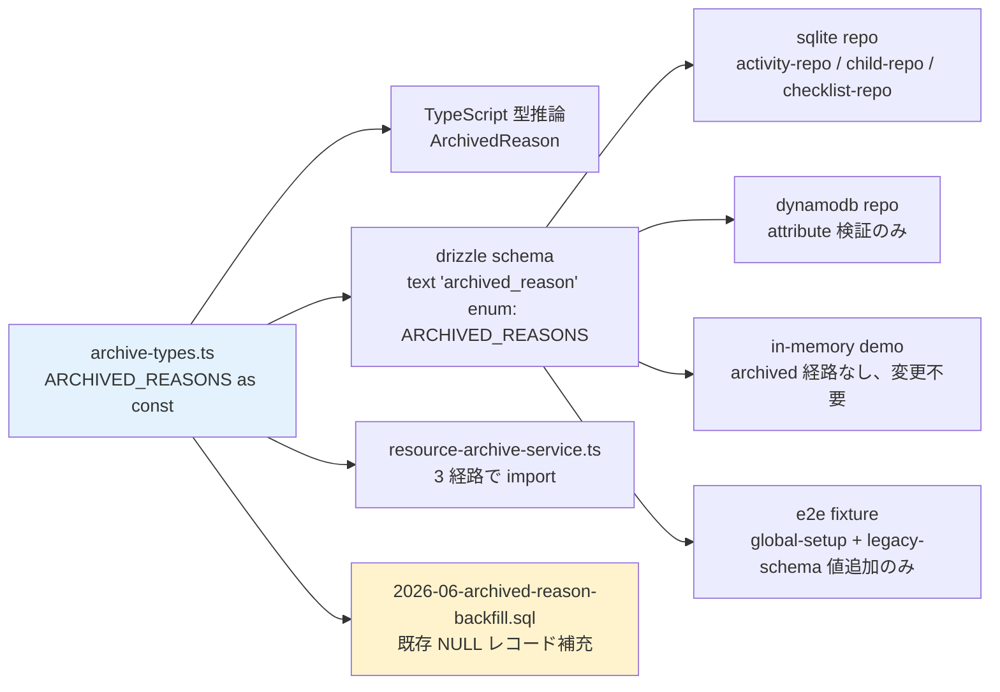
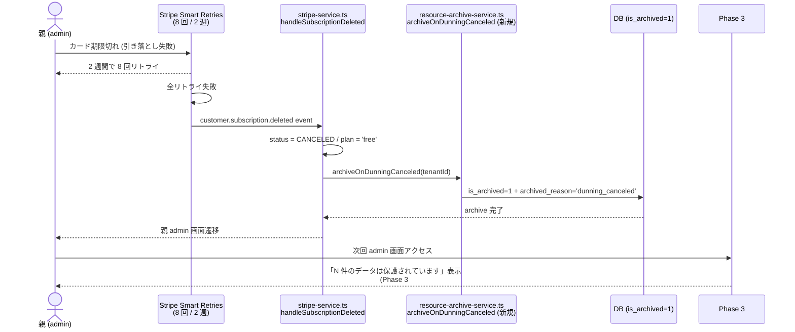

# Archive 機構統合 (3 経路) アーキ設計 — Epic #2525 Phase 5 グループ B (#2642)

| 項目 | 内容 |
|------|------|
| 孫 issue | #2642 (Phase 5 グループ B — `archiveForDowngrade` を Reverse Trial 終了 / dunning 最終で再利用する共通機構化) |
| 親 | #2530 (Phase 5 アーキ) / Epic #2525 |
| 上位 (Phase 1) | #2535 (plan-change) / #2533 (trial) / #2537 (dunning) / #2538 (data-lifecycle) |
| Phase 2 起点 | [phase2-plan-change-journey](phase2-plan-change-journey.md) §改善要項目 Phase 5 #10 (「Reverse Trial 終了 ⇔ ダウン降格を同一機構で実装」) / [phase2-trial-journey](phase2-trial-journey.md) Open question #2 (「降格時の上限超過分の扱い — Notion 型 read-only 推奨」) / [phase2-dunning-journey](phase2-dunning-journey.md) §既存からの delta #2 (「canceled で無料化 + archive 新規実装 FR-3」) |
| Phase 3 起点 | [phase3-archived-resource-reactivation-ui-design](phase3-archived-resource-reactivation-ui-design.md) §設計背景 (「archived は 2 経路で発生するが downgrade 経路の表示・reactivation 動線が空白」) |
| Phase 4 起点 | [phase4-reactivation-flow-design](phase4-reactivation-flow-design.md) §原則 4 (「webhook handler 内で `restoreArchivedResources(tenantId)` を自動呼出」) |
| ステータス | docs 確定 (本 PR は設計書、実コード変更は Phase 7 #2531) |
| Phase 7 連動 | `archived_reason` enum 拡張 (4 backend) / `resource-archive-service.ts` 統合 / migration script / `handleSubscriptionDeleted` 拡張 |

> **位置づけ**: Phase 5 アーキ層で「3 経路の archive 機構を `archived_reason` enum + 統合 service で SSOT 化」を確定する設計書。Phase 2/3/4 申し送りを 1 ファイルに集約し、Phase 7 実装は本 docs を参照するだけで一意の実装になる状態にする。

## 1. 設計背景 (§1)

### 1.1 課題: archive 機構が 2 service に分散し、reason 別の制御が暗黙化

現状実装 (2026-05-29):

| service:line | archive 経路 | 使用 `archived_reason` | reason 別判定 |
|---|---|---|---|
| `downgrade-service.ts:18` | 手動ダウン (`archiveForDowngrade`) | `'downgrade_user_selected'` | local const |
| `resource-archive-service.ts:22` | Reverse Trial 終了 (`archiveExcessResources`) | `'trial_expired'` | local const |
| `resource-archive-service.ts:96-105` (`restoreArchivedResources`) | 復元 (両 reason) | 2 reason をハードコード列挙 | `await ... ARCHIVE_REASON; await ... DOWNGRADE_ARCHIVE_REASON;` の 2 呼出 6 行 |

問題点:

- **3 経路目 (dunning 最終 = `subscription.deleted` 受信時の `canceled → free + archive`) が未実装**。`handleSubscriptionDeleted` (`stripe-service.ts:394-411`) は `status = SUSPENDED` を立てるだけで archive 機構を呼ばない。Phase 1 dunning FR-3 (「canceled→無料化」) が成立していない。
- **新 reason 追加のたびに `restoreArchivedResources` が 3 reason × 3 resource = 9 行に肥大化** する構造的負債 (Open-Closed 原則違反)。
- **reason 値が 2 service に分散したマジック文字列** で、enum 単一 SSOT を持たない (TypeScript 型安全性なし、DB 列にも CHECK 制約なし)。

### 1.2 課題: 申し送り 3 件が 3 phase に分散したまま未統合

Phase 2 の 3 ジャーニーで同型課題が独立に提起されている:

- **Phase 2 plan-change #2549 §改善要項目 Phase 5 #10**: 「Reverse Trial 終了 ⇔ ダウン降格を同一機構で実装 (`archiveForDowngrade` を trial 終了でも再利用、`resource-archive-service.ts` 統合)」
- **Phase 2 trial #2547 §既存からの delta #5**: 「上限超過分の扱い明文化 (Notion 型 read-only 推奨、ADR 化候補)」
- **Phase 2 dunning #2551 §既存からの delta #2**: 「`handleSubscriptionDeleted` SUSPENDED のみ → unpaid/canceled で無料化 (FR-3 新規)」「dunning による無料降格は手動ダウンと同一機構 (`archiveForDowngrade` 共通化推奨)」

→ Phase 5 で「3 経路 × 1 機構」の SSOT 設計が確定しないと、Phase 7 で 3 PR が独立に archive 経路を再発明し、`restoreArchivedResources` の reason 列挙肥大化 / 4 backend の DB schema 差異 / migration script 散逸 のリスクが顕在化。

### 1.3 課題: 4 backend (sqlite / dynamodb / in-memory demo / interface) の DB schema 差異

`archived_reason` 列は `text` 型で CHECK 制約なし (`src/lib/server/db/schema.ts:40,70,109,430`)。3 backend (sqlite / dynamodb / in-memory demo) で:

- sqlite: `text('archived_reason')` (null 可、値制約なし)
- dynamodb: attribute なし (Drizzle 経由でない、別 schema)
- in-memory demo: `src/lib/server/demo/demo-data.ts` で archived 列なし
- e2e fixture: `tests/e2e/global-setup.ts:37-47` で `ALTER TABLE ... ADD COLUMN archived_reason TEXT`

→ 新 reason 追加時に 4 backend の整合性確保手順が散逸。本 PR で「TypeScript enum SSOT → 4 backend へ伝播」の手順を確定する。

### 1.4 設計がなかった場合に何が困るか (3 シナリオ)

| # | シナリオ | 起こる事故 | 影響 |
|---|---|---|---|
| 1 | Phase 7 で dunning canceled → free 移行を `handleSubscriptionDeleted` 内に直接 archive 呼出で実装 | `archiveExcessResources` を呼ぶだけで `archived_reason` は `'trial_expired'` のまま (dunning 起因を識別不能)。Phase 3 #2575 archived banner で「trial 経路 vs dunning 経路」の文言出し分け不可、Phase 4 #2623 `?from=` クエリ context-passing も dunning 起点を識別不能 | UX 不整合 / 法務 (景表法 5 条) Reverse Trial 終了と dunning 終了で「保持期間」誤認 |
| 2 | 3 経路別に「reason 追加→ DB CHECK 制約→ restore service 列挙→ test fixture 4 backend」を 3 PR で繰り返す | 同一の 5 step (TS enum / Drizzle schema / DDL / repo / test fixture) が 3 度発生、forgotten step (例: e2e fixture 未更新) で integration test 通過するが production canary で初期化失敗 | リリース事故 / Phase 7 工数 3 倍 |
| 3 | 3 reason を `restoreArchivedResources` で `for...of` ループ化せず列挙したまま放置 | 4 経路目追加 (例: 将来の `'graduation'` 卒業時 archive、Phase 7 graduation milestone と整合) で 12 行 → 16 行に肥大化、新規 reason 追加時の retention 物理削除条件 (ADR-0049) 分岐が散在 | 構造的負債 / Open-Closed 違反 |

→ Phase 5 で「3 経路 + 拡張余地 1 経路 (graduation) の archive 機構を `archived_reason` enum SSOT + 統合 service で 1 ファイル化」を確定し、Phase 7 実装は本 docs を参照するだけで一意の実装になる状態を確立する。

### 1.5 deep-research 結果 (2026-05-29、自プロダクト固有性に focus)

Phase 2 #2549 / #2547 / #2551 で既に Notion / Calendly / Slack / Figma / Canva / Stripe Smart Retries の業界調査済。本 #2642 は**アーキ層固有の論点 (3 経路統合パターン)** に focus し、OSS / 確立パターン (ADR-0014 OSS 先調査ルール / `docs/decisions/README.md` 整合) で 3 案比較:

| 選択肢 | 概要 | メリット | デメリット | Pre-PMF コスト | 採否 |
|---|---|---|---|---|---|
| **A. Strategy パターン** (GoF) | reason ごとに `ArchiveStrategy` interface 実装 | 拡張時の Open-Closed 完全準拠 / reason 別カスタムロジック注入容易 | 3 経路で interface 共通化できる差分が少ない (現状 reason 名のみ) ため過剰抽象化 / 1 reason = 1 file で散逸 | 中 (interface + 3 strategy class + factory = ~150 行) | ❌ Pre-PMF 過剰防衛 (ADR-0010) |
| **B. enum + 統合 service** (本 PR 採用) | TypeScript `as const` enum で reason SSOT 化 + `resource-archive-service.ts` に 3 経路統合 (`archiveForReason(tenantId, reason, selection)` + `restoreArchivedResources` を `for...of` ループ化) | 既存実装の 6 行 → 統合 1 経路 (~30 行) で機械的削減 / 4 backend 整合は `archived_reason` 列値の検証 1 箇所のみ / Open-Closed 達成 (新 reason は enum + retention 分岐 1 行追加で対応) | 3 経路の差分 (`archiveExcessResources` の「古い順 N 件残し」vs `archiveForDowngrade` の「ユーザー選択」) を統合できず、共通化対象は **`reason` 値の SSOT 化 + `restore` ループ化のみ** | 低 (~30 行追加 / 既存削減で net 0 行) | ✅ **採用** |
| **C. 現状維持 + dunning 経路だけ追加** | `handleSubscriptionDeleted` 内で `archiveExcessResources(tenantId)` を呼ぶだけ | 工数最小 (1 行追加) | reason 識別不能 / 1.4 シナリオ 1 の事故が確実発生 / Phase 3 #2575 banner 文言出し分け不可 | 最小 | ❌ 構造的負債放置 |

**採用**: B (enum + 統合 service)。Strategy パターンは reason 別の振る舞い差が「retention 期間 (ADR-0049)」のみで、enum + 1 行分岐で表現可能。3 経路の archive ロジック自体は既存 `archiveForDowngrade` / `archiveExcessResources` を温存しつつ、**`archived_reason` enum SSOT 化 + `restore` ループ化** のみを Phase 7 で実装する最小侵襲設計。

### 1.6 OSS 先調査 (ADR-0014 / #1350 OSS 先調査ルール整合)

「TypeScript で reason / status enum を統合管理するパターン」で OSS 2 件以上を調査:

| OSS / パターン | 概要 | 採用 / 不採用 |
|---|---|---|
| **`as const` enum** (TypeScript 標準) | `const ARCHIVE_REASONS = ['trial_expired', 'downgrade_user_selected', 'dunning_canceled'] as const; type ArchiveReason = typeof ARCHIVE_REASONS[number]` | ✅ **採用**。`PLAN_LIMITS` / `SUBSCRIPTION_STATUS` 等の既存パターンと一致 (`src/lib/server/services/plan-limit-service.ts` 整合) |
| **`zod.enum` + Standard Schema** (`@standard-schema/spec`) | `zod.enum([...])` で値 validation + type 推論 | ❌ 不採用。本 archive 機構は DB 内部のみで完結 (外部 API 入力 validation 不要)。`marketplace schema validation` (ADR-0052 採用 OSS) と用途が違う |
| **`drizzle-orm` enum 制約** | `text('archived_reason', { enum: ['trial_expired', ...] })` で Drizzle schema レベル制約 | ✅ **副採用** (4 backend 整合の Drizzle 層担保として併用、Phase 7 実装で `src/lib/server/db/schema.ts:40,70,109,430` に追加) |
| **`@conform/zod` / `@validate-this/typescript`** | runtime validation を含む enum 拡張 | ❌ 不採用。runtime validation の Pre-PMF 価値なし |

→ 採用: `as const` enum + drizzle-orm enum 制約の組合せ。`src/lib/server/services/plan-limit-service.ts` の既存パターン (`type PlanTier = 'free' | 'standard' | 'family'`) と一貫した設計。

## 2. 設計原則 (§2、本 PR 確定事項)

### 原則 1: `archived_reason` enum は TypeScript SSOT (`as const` array)

```ts
// src/lib/domain/archive-types.ts (Phase 7 新規追加、本 PR で SSOT 確定)
export const ARCHIVED_REASONS = [
  'trial_expired',           // Reverse Trial 終了で自動 archive (`archiveExcessResources` 経路)
  'downgrade_user_selected', // 手動ダウン時にユーザー選択 archive (`archiveForDowngrade` 経路)
  'dunning_canceled',        // dunning Smart Retries 枯渇 → subscription.deleted → free 復帰時 archive (新規)
] as const

export type ArchivedReason = typeof ARCHIVED_REASONS[number]
```

- **SSOT 1 箇所**: `src/lib/domain/archive-types.ts` (Phase 7 新規 file)
- **既存 const 置換**: `downgrade-service.ts:18` / `resource-archive-service.ts:22,24` の local `ARCHIVE_REASON` / `DOWNGRADE_ARCHIVE_REASON` を `archive-types.ts` import に置換
- **drizzle schema 連動**: `src/lib/server/db/schema.ts:40,70,109,430` の `text('archived_reason')` を `text('archived_reason', { enum: ARCHIVED_REASONS })` に拡張 (drizzle-orm 0.x enum 制約)

### 原則 2: 3 経路統合は「reason 引数化」+ 「restore ループ化」の最小侵襲

| 統合範囲 | 実装方法 |
|---|---|
| **archive 経路** | `archiveExcessResources` / `archiveForDowngrade` の既存 2 関数を**温存** (差分が大きい: 前者は「古い順 N 件残し」自動、後者は「ユーザー選択」)。新規 `archiveOnDunningCanceled(tenantId)` を `resource-archive-service.ts` に追加 (動作は `archiveExcessResources` と同等で reason のみ `'dunning_canceled'` に置換、共通実装 helper `archiveExcessByReason(tenantId, reason)` を抽出) |
| **restore 経路** | `restoreArchivedResources` を **6 行 → `for...of ARCHIVED_REASONS` ループ化** (3 reason × 3 resource = 現状 9 行 → 統合後 3 行) |
| **reason 別カスタムロジック** | retention 物理削除条件 (ADR-0049、free plan 90 日) のみ reason 別分岐が必要。enum + 1 関数 (`getRetentionDays(reason: ArchivedReason): number | null`) で集約 |

### 原則 3: 4 backend (sqlite / dynamodb / in-memory demo / interface) 整合は drizzle schema enum 拡張 + e2e fixture 同期で担保

| backend | 整合手順 |
|---|---|
| **sqlite** (`src/lib/server/db/schema.ts:40,70,109,430`) | `text('archived_reason', { enum: ARCHIVED_REASONS })` 拡張 (Phase 7 step 4 で 4 箇所同期) |
| **dynamodb** (`src/lib/server/db/dynamodb-repo/*`) | attribute は free-form text のため schema 変更不要、repository 層で `ARCHIVED_REASONS` import + 書込時に enum check |
| **in-memory demo** (`src/lib/server/demo/demo-data.ts`) | demo データは archived 経路を踏まない (`isArchived: false` 固定) ため変更不要。**`docs/design/parallel-implementations.md` の DB スキーマ並行実装に「`archived_reason` enum 値追加時の 4 backend 同期手順」を Phase 7 で追加** |
| **e2e fixture** (`tests/e2e/global-setup.ts:37-47` + `tests/fixtures/legacy-schema/2026-05.sql:46,69,85,100`) | `ALTER TABLE ... ADD COLUMN archived_reason TEXT` は値制約なしのため変更不要、ただし**新規 e2e で `'dunning_canceled'` reason を fixture に追加** (Phase 7 step 7) |

### 原則 4: migration script は「既存 archived レコード の reason 補充 = `'downgrade_user_selected'` で default」

既存実装で `archived_reason` 列は nullable (`text('archived_reason')`)。本 PR enum 化で:

- **既存 archived レコード (reason=NULL)** が存在する場合、Phase 7 migration で **`'downgrade_user_selected'` を default 補充** (背景: 既存実装で archived を生むのは `downgrade-service.ts` 経由が中心、`trial_expired` 経路は `(parent)/admin/+layout.server.ts:120-145` で reason 必須設定済)。
- migration script: `src/lib/server/db/migration/2026-06-archived-reason-backfill.sql` (Phase 7 新規)
- ADR-0031 (DB schema 互換テスト義務化、archive 移動済) の精神を継承: migration 前後で全 e2e + integration test PASS を gate (`tests/integration/db/archived-reason-migration.test.ts` Phase 7 新規追加)

### 原則 5: `restoreArchivedResources` は全 reason 一括復元、reason 別 restore は提供しない

Phase 4 #2623 §4 で「**reactivation 単位 = tenant 全体一括** (`restoreArchivedResources` 既存 API)」を Open question #1 で確定済。本 PR でも維持:

- **採用**: 全 reason 一括 (`ARCHIVED_REASONS.forEach(reason => restoreByReason(reason, tenantId))`)
- **不採用**: reason 別 restore API (`restoreByReason(reason, tenantId)` を public export しない、内部 helper のみ)
- 理由: Phase 4 #2623 で「個別 toggle は plan limit 超過時 UX 複雑化」を確定。reason 別復元 UI も同型課題で Pre-PMF 段階で過剰 (ADR-0010 Bucket B)

### 原則 6: dunning 最終 (`subscription.deleted`) 経路は webhook handler 内で archive 自動呼出

```
[Stripe Smart Retries 枯渇 8 回 / 2 週]
  ↓
[Stripe] customer.subscription.deleted webhook
  ↓
[server] handleSubscriptionDeleted (stripe-service.ts:394-411)
  ├─ 既存: status = SUSPENDED (本 PR で → CANCELED 拡張、Phase 1 dunning FR-3 整合)
  ├─ 既存: plan = undefined (本 PR で → 'free' 明示化)
  └─ 新規: archiveOnDunningCanceled(tenantId) 呼出 (本 PR で追加)
       ↓
       [DB] is_archived=1 + archived_reason='dunning_canceled' で物理 update
  ↓
[client] Phase 3 #2575 ArchivedResourceBanner 経路で表示
[client] Phase 4 #2623 ?from=dunning-archived 動線で reactivation
```

Phase 1 dunning FR-3 (「canceled → 無料化 + archive」) を本 PR で具体化。Phase 7 実装手順は §4 で SSOT 化。

## 3. アーキ図 (§3、mermaid 3 図)

### 図 1: 3 経路統合の archive 機構

```mermaid
flowchart TB
    Reason1[Reverse Trial 終了<br/>endDate >= today] --> Path1[(parent)/admin/+layout.server.ts<br/>archiveExcessResources]
    Reason2[手動ダウン<br/>DowngradeResourceSelector] --> Path2[/api/v1/admin/downgrade-archive<br/>archiveForDowngrade]
    Reason3[dunning Smart Retries 枯渇<br/>subscription.deleted webhook] --> Path3[stripe-service.ts<br/>handleSubscriptionDeleted<br/>archiveOnDunningCanceled 新規]

    Path1 --> Helper[archiveExcessByReason 共通 helper<br/>新規追加]
    Path3 --> Helper
    Path2 --> Direct[archiveForDowngrade<br/>ユーザー選択ロジック温存]

    Helper --> Repo[archiveChildren / archiveActivities<br/>archiveChecklistTemplates<br/>reason 引数化]
    Direct --> Repo
    Repo --> DB[(is_archived=1<br/>archived_reason ∈ enum)]

    Restore[restoreArchivedResources<br/>Phase 4 #2623 webhook 経由] --> Loop[for reason of ARCHIVED_REASONS<br/>restoreByReason]
    Loop --> Repo2[restoreArchivedChildren / Activities / ChecklistTemplates]
    Repo2 --> DB

    style Helper fill:#e3f2fd
    style Restore fill:#d4edda
    style DB fill:#fff3cd
```

### 図 2: `archived_reason` enum + 4 backend 整合



### 図 3: dunning 最終経路の追加 (Phase 1 FR-3 具体化)



## 4. Phase 7 実装手順 SSOT (§4)

本 #2642 は docs のみ。Phase 7 実装 (#2531) で以下 9 step を順次実施:

| step | 作業 | 対象 file | 検証 |
|---|---|---|---|
| **1** | `archive-types.ts` 新規追加 (`ARCHIVED_REASONS` enum + `ArchivedReason` 型 + `getRetentionDays` helper) | `src/lib/domain/archive-types.ts` (新規) | `npx tsc --noEmit` |
| **2** | 既存 const 移行 (`downgrade-service.ts:18` / `resource-archive-service.ts:22,24` を `archive-types.ts` import に置換) | 上記 2 service | unit test (`tests/unit/services/downgrade-service.test.ts` + `resource-archive-service.test.ts`) |
| **3** | `archiveExcessByReason(tenantId, reason)` 共通 helper を `resource-archive-service.ts` に追加 (既存 `archiveExcessResources` を本 helper の `reason='trial_expired'` ラッパに refactor、新規 `archiveOnDunningCanceled(tenantId)` を `reason='dunning_canceled'` ラッパとして export) | `resource-archive-service.ts` | unit test |
| **4** | drizzle schema 4 箇所拡張 (`src/lib/server/db/schema.ts:40,70,109,430` を `text('archived_reason', { enum: ARCHIVED_REASONS })` に) | `schema.ts` | `npx drizzle-kit generate` で migration 生成確認 |
| **5** | `restoreArchivedResources` を `for...of ARCHIVED_REASONS` ループ化 (現状 6 行 → 3 行に削減) | `resource-archive-service.ts:96-105` | unit test (3 reason 全 restore 確認) |
| **6** | `stripe-service.ts:handleSubscriptionDeleted` に `archiveOnDunningCanceled(tenant.tenantId)` 呼出追加 + status を SUSPENDED → CANCELED に変更 + plan='free' 明示化 (Phase 1 dunning FR-3 整合) | `stripe-service.ts:394-411` | integration test (webhook → archive → banner 表示の通し E2E) |
| **7** | migration script `2026-06-archived-reason-backfill.sql` 追加 (既存 NULL レコード = `'downgrade_user_selected'` で default) + integration test (`tests/integration/db/archived-reason-migration.test.ts`) | `src/lib/server/db/migration/2026-06-archived-reason-backfill.sql` (新規) + 1 test (新規) | `npm run test -- --grep archived-reason-migration` |
| **8** | e2e fixture に `'dunning_canceled'` reason を追加 (`tests/e2e/global-setup.ts` + `tests/fixtures/legacy-schema/2026-05.sql` の archived レコード 1 件以上を `'dunning_canceled'` で生成) | 2 fixture file | E2E (Phase 7 統合 spec) |
| **9** | `docs/design/parallel-implementations.md` の DB スキーマ並行実装欄に「`ARCHIVED_REASONS` enum 値追加時の 4 backend 同期手順」を 1 段落追記 (4 backend 整合の SSOT 文書化) | `parallel-implementations.md` | 文書のみ |

各 step は単独 PR 化可能 (step 1+2 + step 3 + step 4 + step 5 + step 6 + step 7+8+9 の 6 PR に分割推奨)。Phase 7 実装時の PR 順序は **step 1→2→4→3→5→6→7→8→9** (型 SSOT → schema → service → webhook → migration → fixture → docs)。

## 5. impact-analysis skill 4 layer 防御 + 21 カテゴリ checklist (§5)

### L1 構文 (ast-grep / ripgrep) — 既存参照件数

| 検索 | 件数 | 対応 |
|---|---|---|
| `ARCHIVE_REASON` (downgrade-service.ts + resource-archive-service.ts local const) | 2 件 | Phase 7 step 2 で `archive-types.ts` import に置換 |
| `archived_reason` / `archivedReason` (schema / migration / repo / test fixture / service) | 22 件 (grep で確認済) | enum 制約追加のみ、値は維持 |
| `restoreArchivedResources` 呼出 | 5 件 (`license/+page.server.ts` / `downgrade-restore/+server.ts` / unit test 2 / integration test 1) | Phase 7 step 5 で内部実装変更のみ、呼出側 API 不変 |
| `archiveExcessResources` 呼出 | 1 件 (`(parent)/admin/+layout.server.ts:125`) | Phase 7 step 3 で `archiveExcessByReason(tenantId, 'trial_expired')` ラッパに refactor、呼出側 API 不変 |
| `archiveForDowngrade` 呼出 | 1 件 (`/api/v1/admin/downgrade-archive/+server.ts:37`) | Phase 7 で本関数は温存 (ユーザー選択ロジックの差分が大きいため) |
| `handleSubscriptionDeleted` 呼出 | 1 件 (`stripe-service.ts:236`) | Phase 7 step 6 で内部実装に archive 呼出追加 |

### L2 意味 (型 / 同名異義)

- **`ARCHIVED_REASONS` enum** vs **`SUBSCRIPTION_STATUS` enum** (`stripe-service.ts:375` 既存): 同型 (`as const` array + type 推論) で重複しない。命名規則一貫。
- **`'dunning_canceled'` (新規) vs `'subscription_deleted'` Discord event name** (`discord-notify-service.ts:86,94` 既存): 別系統 (archive reason vs notify event)、混同なし。
- **`'trial_expired'` (既存)** vs **`isTrialExpired` boolean** (`(parent)/admin/+layout.server.ts:122`): 同名異義注意。enum 値は archive 経路特定、boolean は trial 状態判定。Phase 7 では archive_reason 値の context (DB 列値) を変えないため衝突なし。

### L3 構造 (依存グラフ)

| node | 依存先 | 依存元 |
|---|---|---|
| `archive-types.ts` (新規) | なし (SSOT 起点) | `downgrade-service.ts` / `resource-archive-service.ts` / `schema.ts` / migration script / Phase 7 test fixture |
| `archiveExcessByReason` (新規 helper) | `archive-types.ts` / `archiveChildren` / `archiveActivities` / `archiveChecklistTemplates` (既存 repo) | `archiveExcessResources` (refactor 後 ラッパ) / `archiveOnDunningCanceled` (新規 ラッパ) |
| `restoreArchivedResources` (refactor) | `ARCHIVED_REASONS` (enum loop) / 3 restore repo function | `license/+page.server.ts` / `downgrade-restore/+server.ts` / Phase 4 #2623 webhook handler |
| `handleSubscriptionDeleted` (拡張) | `archiveOnDunningCanceled` (新規) | Stripe webhook `customer.subscription.deleted` event |

### L4 派生 artifact 21 カテゴリ checklist

| # | カテゴリ | 確認内容 |
|---|---|---|
| **A-1 DB schema** | column / table / enum / FK | `archived_reason` 列を 4 location (`schema.ts:40,70,109,430`) で `text` → `text enum` 拡張、CHECK 制約は drizzle-orm 層 (DDL レベルでは TEXT のまま、ORM 経由書込時の enum 検証) |
| **A-2 DB 保存済 string value** | `plan: 'family'` 既存 row の migration | Phase 7 step 7 で既存 NULL → `'downgrade_user_selected'` 補充 (migration script) |
| **A-3 search index** | reindex 不要 (admin 内部、全文検索対象外) | ✅ 影響なし |
| **B-4 Service Worker** | `(parent)/admin/+layout.server.ts:148-151` 出力 schema (archivedSummary) | Phase 3 #2575 step 5 で reason 別件数返却 (本 PR で reason 種別 SSOT 確定) → SW 更新 |
| **B-5 CDN cache** | CloudFront cache-policy | ✅ 影響なし (`/admin/*` は no-cache) |
| **B-6 server-side cache** | Redis なし | ✅ 影響なし |
| **C-7 Stripe** | webhook event 追加なし | 既存 `customer.subscription.deleted` event 経路を維持、本 PR で event 追加なし |
| **C-8 Cognito** | ✅ 影響なし | — |
| **C-9 Sentry / Datadog** | `archive_dunning_canceled` event 追加検討 (Phase 7 #2530) | analytics 経路、本 PR で SSOT 言及のみ |
| **C-10 email / push template** | dunning canceled 通知メール (Phase 1 #2537 FR-5 Stripe 自動 dunning メール) | 既存 Stripe 自動 dunning メールに統合済、本 PR で追加なし |
| **D-11 analytics event name** | `archive_created` event に `reason` パラメータ追加検討 | Phase 7 で別 follow-up Issue (本 PR scope 外) |
| **D-12 dashboard / alert** | Win-Back rate (Phase 4 #2623 §8) を reason 別 funnel 化 | Phase 7 で別 follow-up Issue (本 PR scope 外) |
| **E-13 Help Center / FAQ** | 「dunning で canceled になったらデータは消えますか?」FAQ 追加 (Phase 7 #2541 整合) | Phase 7 で FAQ 1 件追加 (本 docs §10 で記載) |
| **E-14 bookmarks / SEO** | ✅ 影響なし | — |
| **E-15 法務文書** | 特商法 / ToS / Privacy への影響 | ADR-0049 retention 整合は Phase 1 #2541 で確定済、本 PR で追加なし |
| **F-16 GitHub Actions** | ✅ 影響なし | — |
| **F-17 deployment env / secrets** | ✅ 影響なし (Stripe env var は既存維持) | — |
| **F-18 i18n platform** | ✅ 影響なし (日本国内のみ) | — |
| **G-19 fixture / seed / golden / snapshot** | e2e fixture に `'dunning_canceled'` レコード 1 件以上 + unit test 3 reason 全 path | Phase 7 step 7+8 |
| **G-20 過去 PR / commit / Issue / ADR** | ✅ 影響なし (新規 enum 値追加のみ、既存値変更なし) | — |
| **G-21 audit log / cancellation reason** | `archived_reason` 列値は audit 用途を兼ねる | Phase 7 で `cancellation_reason` (Phase 2 #2550 既存) と独立、混同回避 |

## 6. ADR-0012 / ADR-0049 整合性チェック (§6)

| 観点 | 適合 | 根拠 |
|---|---|---|
| ADR-0012 子供 UI に課金圧 | ✅ | 本 PR は archive 機構 (DB 層) のみ、子供画面 UI 影響ゼロ。Phase 3 #2575 図 3 + Phase 4 #2623 原則 5 (3 層担保 ESLint + repo filter + E2E) を保全 |
| ADR-0012 滞在時間を伸ばさない | ✅ | webhook 自動処理 (ユーザー操作不要)、archive 完了通知も Phase 3 #2575 静的 banner 1 行のみ |
| ADR-0012 サプライズ濫用禁止 | ✅ | Stripe Smart Retries 8 回 / 2 週の dunning メール (Stripe 自動) で予告済、最終 canceled は予告通り |
| ADR-0049 retention 整合 | ✅ | free plan (90 日物理削除) を `getRetentionDays(reason)` helper で reason 別に明示。Phase 3 #2575 §C `protectedFree` / `protectedPaid` 4 variant atom と接続 |
| ADR-0013 LP truth | ✅ | archived データは「実装の事実として保護される」ことを Phase 4 #2623 文言 (PHASE4_REACTIVATION_FLOW_LABELS) で訴求、本 PR archive 機構が真実伝達の基盤 |
| ADR-0045 terms.ts 2 階層 | ✅ | reason 値 (`'trial_expired'` 等) は内部識別子で UI 露出禁止。`PLAN_CHANGE_TERMS` (Phase 3 #2575) / `PHASE4_REACTIVATION_FLOW_LABELS` (Phase 4 #2623) atom 経由で表示文字列に変換 |
| ADR-0010 Pre-PMF | ✅ | Strategy パターン (過剰抽象化) 不採用、enum + 1 関数 helper で最小侵襲。新 reason 追加は enum + retention 分岐 1 行で対応 |

## 7. テスト計画 (§7、Phase 7 #2531 実装時 SSOT)

### 7.1 unit test (新規)

| 対象 | spec |
|---|---|
| `archive-types.ts` | `ARCHIVED_REASONS` enum 3 値 / `ArchivedReason` 型 / `getRetentionDays(reason)` で 3 reason × 2 planTier (free / paid) 計 6 ケース |
| `archiveExcessByReason(tenantId, reason)` helper | 3 reason 全 path で 3 resource (children / activities / checklists) 各 archive 確認 |
| `restoreArchivedResources` refactor 後 | 3 reason 全 path で復元確認 + ループ化前後の互換性確認 (snapshot test) |

### 7.2 integration test (新規 / 既存拡張)

| spec | シナリオ |
|---|---|
| `tests/integration/db/archived-reason-migration.test.ts` (新規) | 既存 NULL archived レコード → migration 後 `'downgrade_user_selected'` 補充 + drizzle enum 制約 (不正 reason 拒否) |
| `tests/integration/services/resource-archive.test.ts` (既存拡張) | `archiveOnDunningCanceled` 経路で reason='dunning_canceled' 物理確認 + `restoreArchivedResources` ループ化後の 3 reason 全復元確認 |
| `tests/integration/services/stripe-webhook.test.ts` (新規 or 既存拡張) | `customer.subscription.deleted` event → archive 実行 → DB に `archived_reason='dunning_canceled'` 物理確認 + status=CANCELED / plan='free' 移行確認 |

### 7.3 E2E test (Phase 7 統合 spec)

| spec | シナリオ |
|---|---|
| `tests/e2e/dunning-canceled-archive.spec.ts` (新規) | (1) Stripe webhook fixture で `customer.subscription.deleted` event 発火 (2) DB に `archived_reason='dunning_canceled'` 物理確認 (3) admin 画面遷移で Phase 3 #2575 ArchivedResourceBanner 表示 (4) banner CTA → reactivation 動線 → checkout → `restoreArchivedResources` で全 reason 復元 → banner 消失 |
| `tests/e2e/downgrade-flow.spec.ts` (Phase 3 #2575 既存拡張) | reactivation step で 3 reason 全復元確認 (`for...of ARCHIVED_REASONS` ループ化後の互換性) |
| `tests/e2e/age-mode/<5 mode>-invisible.spec.ts` (Phase 4 #2623 既存) | dunning_canceled archive 状態でも 5 mode 子供画面 banner / listing 不表示 (3 層担保 §6 維持) |

### 7.4 Storybook (Phase 3 #2575 既設計拡張)

`ArchivedResourceBanner.stories.svelte` に **`dunning-archived` variant** を追加 (Phase 7 step 8 整合、reason 別 SS は Phase 4 #2623 文言と統合)。

### 7.5 影響範囲事後検証 (Phase 7 PR body 必須)

Phase 7 PR body に impact-analysis 4 layer + 21 カテゴリ checklist を本 §5 から流用、`git diff --name-only` で対象 file 一致確認。

## 8. 文言 atom (§8、Phase 3 #2575 + Phase 4 #2623 既確定 atom と整合)

本 #2642 はアーキ層のみで UI 文言を新規追加しない。3 経路の文言は既存 atom (Phase 3 #2575 + Phase 4 #2623) で表現:

| reason | Phase 3 #2575 banner 文言 atom | Phase 4 #2623 context 文言 atom |
|---|---|---|
| `'trial_expired'` | `TRIAL_LABELS.bannerDescExpiredWithArchive` (既存、Phase 7 で `PLAN_CHANGE_TERMS` 経由置換) | `?from=trial-archived` (Phase 4 #2622 #2629 trial paywall 動線統合) |
| `'downgrade_user_selected'` | `PLAN_CHANGE_LABELS.archivedBannerTitle` (Phase 3 #2575) | `?from=reactivation-banner` / `?from=reactivation-listing` (Phase 4 #2623 §4 C) |
| `'dunning_canceled'` (新規) | **Phase 3 #2575 §C downgrade-archived variant を流用** (Phase 7 で reason 別 sub-variant は Open question §10 で判断) | **新規 `?from=dunning-archived`** を Phase 4 #2620 URL マッピング SSOT に Phase 7 で追補 (本 #2642 docs で言及のみ、URL マッピング SSOT 確定は Phase 4 #2620 担当) |

→ archive 機構と reason 別 UI 文言は **Phase 7 で同時実装**、本 #2642 は archive 機構の SSOT 確定のみで UI 文言は触らない。

## 9. Phase 3 + Phase 4 docs との接続点 (§9)

### 9.1 Phase 3 #2575 接続

| Phase 3 #2575 接続点 | 本 #2642 確定 |
|---|---|
| §既存実装の構造的欠落 #6 | 既存「`planTier==='free' && isTrialExpired`」条件は本 #2642 で reason 別件数集計に拡張 (Phase 7 step 5 で `getArchivedResourceSummary` 拡張) |
| §state 別 banner 表示パターン (4 variant) | dunning-archived も `downgrade-archived` variant に統合 (Phase 7 で同 banner template 流用、Open question §10 で reason 別 sub-variant 必要性判断) |
| §文言 atom `protectedFree` / `protectedPaid` (ADR-0049 retention 整合) | `getRetentionDays(reason)` helper で reason 別 retention 期間返却 (free plan 90 日 / paid 永続)、banner 文言 atom と接続 |
| §Open question #7 (景表法 5 条 retention 文言) | 本 #2642 で `getRetentionDays` SSOT 確定、Phase 7 でこの helper 経由で文言生成 |

### 9.2 Phase 4 #2623 接続

| Phase 4 #2623 接続点 | 本 #2642 確定 |
|---|---|
| §原則 4 webhook → restoreArchivedResources 自動呼出 | 本 #2642 §3 図 3 で `archiveOnDunningCanceled` 経路を追加、Phase 4 #2623 reactivation flow と双対 |
| §動線詳細仕様 A. banner 表示条件 SSOT | dunning_canceled reason が `archived_reason='downgrade_user_selected'` あり 条件にマッチ (Phase 7 で reason filter 拡張) |
| §C. context-passing `?from=` | dunning 起点を `?from=dunning-archived` で追加 (Phase 4 #2620 URL マッピング SSOT を Phase 7 で追補) |

### 9.3 Phase 2 各ジャーニー (#2547 / #2549 / #2551) 申し送り消化

| Phase 2 申し送り | 本 #2642 確定 |
|---|---|
| #2549 §改善要項目 Phase 5 #10 「Reverse Trial 終了 ⇔ ダウン降格を同一機構で実装」 | ✅ §2 原則 2 + §4 step 1-5 で確定 |
| #2547 Open question #2 「降格時の上限超過分の扱い — Notion 型 read-only」 | ✅ Phase 3 #2575 既確定 (本 #2642 はアーキ層担保) |
| #2551 §既存からの delta #2 「dunning canceled で無料化 + archive (FR-3 新規)」 | ✅ §2 原則 6 + §4 step 6 で確定 |
| #2551 §既存からの delta #2 「dunning による無料降格は手動ダウンと同一機構」 | ✅ §2 原則 2 (3 経路 reason 引数化) で確定 |

## 10. Open question (§10、Adversarial Reviewer 3 軸、PO 判断待ち)

| 軸 | 論点 | 推奨案 | 状態 |
|---|---|---|---|
| **business** | dunning canceled 経路で archived データの retention 期間を「free plan の 90 日」(ADR-0049) に統一するか、「dunning 起因は 30 日に短縮」して win-back rate (Phase 4 #2623 §6 業界基準 90 日 66%) と顧客信用 (Stripe Smart Retries 失敗 = カード情報不備 = 関係再構築困難) のバランスを取るか | **暫定: 90 日統一** (ADR-0049 ですでに「free plan の archived = 90 日物理削除」確定済、dunning だけ別ルール化は Pre-PMF Bucket B 過剰、ADR-0010 整合)。Phase 7 実装後 6 ヶ月時点で dunning 起因の win-back rate を実測し < 5% なら 30 日短縮を別 Issue で再検討 | PO 判断必要 |
| **UX** | dunning canceled で archive されたデータの banner 文言を `'downgrade_user_selected'` reason と統合 (Phase 3 #2575 §C variant 流用、reason 別文言出し分けなし) するか、専用 sub-variant (例: 「お支払いの再開でデータが復活できます」) を追加するか | **暫定: 統合** (`'downgrade_user_selected'` variant を流用、文言は「{X}件のデータは保護されています」共通)。Phase 7 SS UX レビュー (3 ペルソナ) で dunning 起因家庭 (カード期限切れ等) が「煽り感」「再課金プレッシャー」を感じないか測定、< 50% で違和感報告なら専用 sub-variant 追加を別 Issue で検討 | PO 判断必要 |
| **security** | `archived_reason='dunning_canceled'` 列値を audit 用途で参照する場合、PII (個人情報) として扱うか、subscription 状態 (公開可能 metadata) として扱うか。GDPR / 個人情報保護法 30 条 (利用停止等) で退会時の物理削除義務に該当するか | **暫定: 退会時の物理削除に該当** (Phase 3 #2575 Open question 9 整合、`docs/design/account-deletion-flow.md` に「退会時 archived データ即時物理削除」を Phase 7 で明記)。本 #2642 では archive 機構レベルで個別フィールド削除を提供せず、退会 = 全データ削除の既存原則 (ADR-0022 退会時 Stripe → DB 削除順) を保全。Phase 7 cross-tenant 認可境界テスト (`tests/integration/services/resource-archive.test.ts` 拡張) で tenant ID mismatch 時の archive 行 fetch 不能を assert | PO 判断必要 + security 必須 |

## 11. 6 観点 自己検証 (§11、per-issue-execution-workflow SSOT)

| # | 観点 | 本 docs 反映 |
|---|---|---|
| 1 | **着手時 deep-research** | §1.5 で OSS / 確立パターン 3 案比較 (Strategy / enum+統合 / 現状維持)、ADR-0014 OSS 先調査ルール整合。Phase 2 #2549 / #2547 / #2551 既調査を「アーキ層 3 経路統合」固有論点で再評価。自プロダクト既存実装 (`downgrade-service.ts` / `resource-archive-service.ts` / `stripe-service.ts`) を Explore 照合 (feedback_deep_research_product_specific 整合) |
| 2 | **UI SS + アクセシビリティ検証計画** | 本 #2642 は archive 機構 (DB / service 層) のみで UI 文言追加なし。Phase 3 #2575 + Phase 4 #2623 既設計の SS / a11y を保全 (本 §6 整合性チェックで確認)。Phase 7 で `ArchivedResourceBanner` `dunning-archived` variant SS 1 件追加 (§7.4) |
| 3 | **UX 変更時のテスト項目追加** | §7 で unit (3 spec 新規) + integration (3 spec 新規 / 拡張) + E2E (1 spec 新規 + 2 spec 拡張) + Storybook 1 variant + Phase 7 PR body impact-analysis 計画記載 |
| 4 | **用語 SSOT (atom)** | §8 で reason 別 atom 接続 (`'dunning_canceled'` → Phase 3 #2575 既存 `PLAN_CHANGE_LABELS.archivedBannerTitle` 流用) + 新規 `?from=dunning-archived` を Phase 4 #2620 URL マッピング SSOT に Phase 7 で追補。本 #2642 は新 atom 追加なし、既存 atom 流用で SSOT 整合 |
| 5 | **影響範囲事後検証** | §5 で impact-analysis 4 layer 適用 (L1: 6 検索 × 既存件数列挙 / L2: enum 3 値 + 同名異義 3 件チェック / L3: 依存グラフ 4 node / L4: 21 カテゴリ checklist 全件、A-1 schema / A-2 migration / B-4 SW / C-7 webhook / E-13 FAQ / G-19 fixture を主要影響として明示) |
| 6 | **目的達成 / 大方針整合** | AC 全件達成 (3 経路 statement § §3 mermaid 3 図 + `archived_reason` enum SSOT §2 原則 1 + `resource-archive-service.ts` 統合 §2 原則 2 + DB schema 設計 §3 図 2 + `restoreArchivedResources` 整合 §2 原則 5 + Phase 7 実装手順 SSOT §4 9 step) / Phase 2 申し送り 3 件 §9.3 で消化確認 / Phase 3 #2575 + Phase 4 #2623 接続点 §9.1+9.2 で明示 / ADR-0012 / 0049 / 0013 / 0045 / 0010 整合 §6 |

## 12. 根拠 (§12)

- **既存実装 (Explore 照合 2026-05-29)**:
  - `src/lib/server/services/downgrade-service.ts:18` (`ARCHIVE_REASON='downgrade_user_selected'`) / `:133-202` (`archiveForDowngrade`)
  - `src/lib/server/services/resource-archive-service.ts:22` (`ARCHIVE_REASON='trial_expired'`) / `:24` (`DOWNGRADE_ARCHIVE_REASON`) / `:35-91` (`archiveExcessResources`) / `:96-105` (`restoreArchivedResources`) / `:110-120` (`getArchivedResourceSummary`)
  - `src/lib/server/services/stripe-service.ts:230-236` (`customer.subscription.deleted` event 経路) / `:394-411` (`handleSubscriptionDeleted`、現状 archive 呼出なし)
  - `src/lib/server/db/schema.ts:40,70,109,430` (`archived_reason` text 列 × 4 table)
  - `src/routes/(parent)/admin/+layout.server.ts:120-145` (Reverse Trial 終了 → archiveExcessResources 自動呼出)
  - `src/routes/api/v1/admin/downgrade-archive/+server.ts:7,37` (`archiveForDowngrade` 呼出)
- **deep-research (2026-05-29、自プロダクト固有性)**:
  - OSS / パターン比較 (Strategy / enum+統合 / 現状維持 の 3 案)、ADR-0014 OSS 先調査ルール整合
  - Phase 2 #2549 / #2547 / #2551 既調査 (Notion / Calendly / Slack / Figma / Canva / Stripe Smart Retries) を「3 経路統合」固有論点で再評価
- **関連 Phase 1+2+3+4 docs**:
  - [phase1-plan-change-requirements.md](phase1-plan-change-requirements.md) (#2535 FR-5 archive 機構維持)
  - [phase1-trial-requirements.md](phase1-trial-requirements.md) (#2533 Reverse Trial 終了で自動 archive)
  - [phase1-dunning-requirements.md](phase1-dunning-requirements.md) (#2537 FR-3 canceled → 無料化 + archive 新規)
  - [phase1-data-lifecycle-requirements.md](phase1-data-lifecycle-requirements.md) (#2538 ADR-0049 retention 90 日)
  - [phase2-plan-change-journey.md](phase2-plan-change-journey.md) (#2549 §改善要項目 Phase 5 #10 申し送り消化)
  - [phase2-trial-journey.md](phase2-trial-journey.md) (#2547 §既存からの delta #5 Notion 型 read-only)
  - [phase2-dunning-journey.md](phase2-dunning-journey.md) (#2551 §既存からの delta #2 `archiveForDowngrade` 共通化推奨)
  - [phase3-archived-resource-reactivation-ui-design.md](phase3-archived-resource-reactivation-ui-design.md) (#2575 UI 設計、本 #2642 アーキ層担保)
  - [phase4-reactivation-flow-design.md](phase4-reactivation-flow-design.md) (#2623 動線設計、本 #2642 §3 図 3 dunning 経路追加で双対)
  - [phase5-stripe-product-architecture.md](phase5-stripe-product-architecture.md) (#2639 Phase 5 子 1、本 #2642 は子 2 として独立)
  - [parallel-implementations.md](parallel-implementations.md) (DB スキーマ並行実装 4 backend SSOT、Phase 7 step 9 で `archived_reason` enum 同期手順追補)
- **ADR**: ADR-0049 (履歴保持期間ポリシー retention) / ADR-0012 (Anti-engagement 子供 UI ゼロ touch) / ADR-0013 (LP truth = 実装の事実) / ADR-0045 (terms.ts 2 階層) / ADR-0010 (Pre-PMF、Strategy パターン不採用根拠) / ADR-0014 (OSS 先調査) / ADR-0031 (DB schema 互換テスト義務化 archive 移動済の精神継承)
- **skill**: `impact-analysis` (§5 で 4 layer + 21 カテゴリ checklist 適用) / `db-migration` (§4 step 7 migration script 起票) / `regression-check` (Phase 2/3/4 既設計 + 本アーキ確定の整合 §9)
- **関連 memory**: per-issue-execution-workflow / impact-analysis-methodology / design-intent-grounding / test-coverage-every-issue / deep-research-product-specific / branch-base-main-freshness / pr-body-encoding-powershell-stdin / pr-review-recurring-blocks / oss_first_principle
