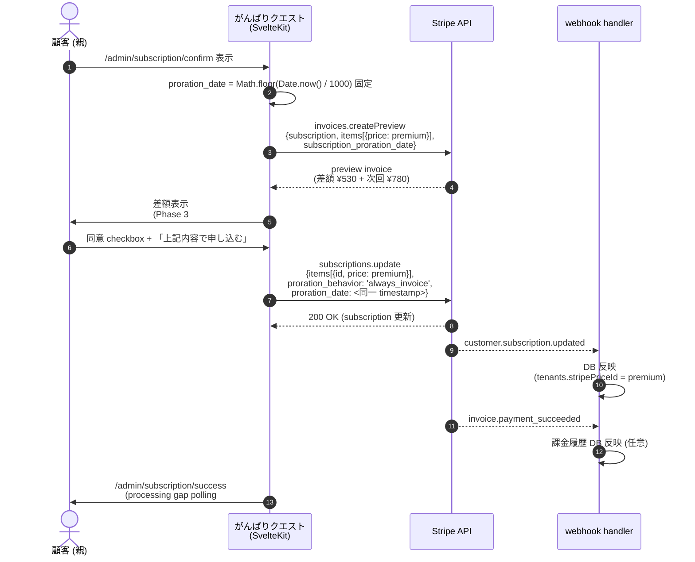
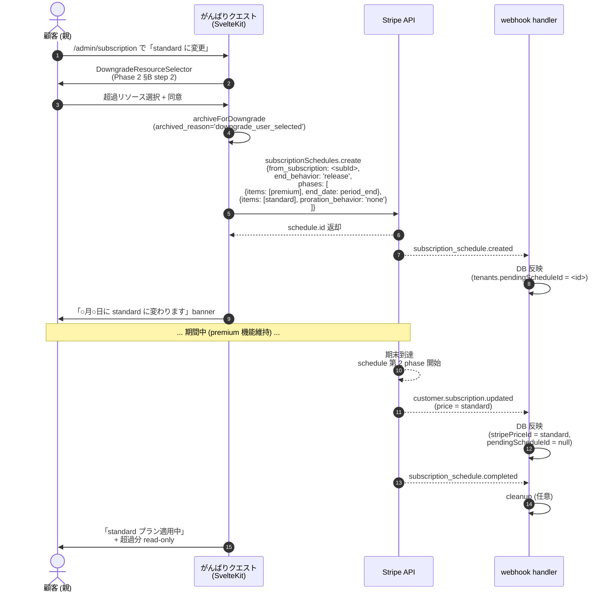
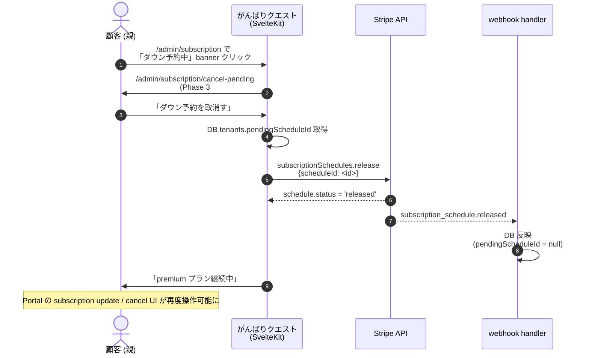

# Proration 実装方針アーキテクチャ — Epic #2525 Phase 5 子 2 (#2640)

| 項目 | 内容 |
|------|------|
| 孫 issue | #2640 (Phase 5 子 2 — proration 実装方針 always_invoice / schedule_at_period_end / Preview API) |
| 親 | #2530 (Phase 5 アーキ) / Epic #2525 |
| 上位 (Phase 1) | #2535 (plan-change FR-3 / FR-4 / FR-6 / NFR-1〜NFR-3) |
| 前提 (Phase 5 子 1) | #2644 (Stripe Product / Price 構成、1 Product 2 Price + lookup_key、マージ済) |
| ステータス | 設計確定 (deep-research: Stripe 公式一次 14 URL 検証済 → 本 PR で docs 確定、コード変更は Phase 7) |
| Phase 7 連動 | `stripe-service.ts` 拡張 (`subscriptions.update` / `subscriptionSchedules.create/release` / `invoices.createPreview`) + Phase 3 #2573 hybrid confirm UI 統合 |
| Phase 3 申し送り反映 | #2573 ハイブリッド方式 (自社 `/admin/subscription/confirm` + Stripe Checkout `custom_text`)、Preview API による差額表示 |
| 作業姿勢 (#2525 critical) | 課金は別格 (memory: feedback_billing_critical_extra_caution)。proration 計算は自前禁止 (Phase 1 NFR-1)、Stripe SSOT。タイムスタンプ整合事故を構造的に回避 (proration_date 固定) |

## 1. 設計背景

### 1.1 課題: proration 実装が Phase 1 FR-3 / FR-4 を成立させていない

[Phase 1 plan-change](phase1-plan-change-requirements.md) §FR-3 / FR-4 / FR-6 で確定したとおり:

- **FR-3 アップ即時**: standard → premium (1 Product 2 Price 整合) は **即時反映 + proration 即時請求**
- **FR-4 ダウン期末**: premium → standard は **期末適用** (Stripe 公式推奨、credit proration 事故回避)
- **FR-6 webhook SSOT**: 変更は `customer.subscription.updated` を SSOT に DB 反映、UI 楽観表示しない

しかし現状 `src/lib/server/services/stripe-service.ts` は `createCheckoutSession` のみ実装で、**`subscriptions.update` / `subscriptionSchedules.create` 呼出は存在しない**。プラン変更を Customer Portal に丸投げしている状態。

[Phase 2 plan-change-journey](phase2-plan-change-journey.md) §「既存実装の事実」で Explore 照合済:

> `subscriptions.update` 呼出なし、`upcoming_invoice` / `create_preview` 未実装、Portal 任せ → △ 新規必要

### 1.2 課題: ダウン取消経路が UI 未整備 (Phase 3 #2573 申し送り)

Phase 5 子 1 (#2644) §4.2 副次制約で確定済:

> Customers can't update or cancel subscriptions that currently have an update scheduled

→ 顧客が Portal で期末ダウン予約を作成した後、再度 Portal を開いても **subscription update / cancel の両方の UI が非表示** になる。顧客が「ダウン予約を取消したい」と思っても Portal から操作できない構造的制約。

自社 UI 誘導 (`/admin/subscription` cancel-pending banner) を Phase 3 #2573 で UI 設計済だが、**バックエンド API (`subscriptionSchedules.release`) の実装方針は本 PR で確定**する。

### 1.3 課題: 差額表示の動的計算と proration_date 整合性

Phase 3 #2573 §3.3 で確定済の proration 差額表示 (機能 3):

```
本日のお支払い差額                    ¥530 (税込)
次回 (2026/06/28) より              ¥780 (税込) /月
```

実装には `invoices.createPreview` API が必要だが、**preview と実 update の間で `proration_date` を一致させないと差額が変動する**事故が起きる (顧客が confirm 画面で見た金額と実請求額が乖離 → 特商法第12条の6第2項「誤認表示禁止」抵触リスク)。本 PR で `proration_date` 固定戦略を明文化する。

### 1.4 設計がなかった場合に何が困るか

1. **Phase 1 FR-3 / FR-4 不成立**: アップ即時請求 / ダウン期末適用が Customer Portal 任せで、自社 UI からの変更パスが機能しない
2. **Phase 3 #2573 hybrid confirm UI が機能しない**: 差額表示用 Preview API 未実装で「動的 proration 差額表示不可」(自社確認画面ハイブリッド方式の存在意義喪失)
3. **ダウン取消が物理的に不可能**: Stripe 公式 Portal ロック制約により、自社 UI 経由 `subscriptionSchedules.release` 実装なしには顧客がダウン予約を取消せない (cancel-pending banner が動かない)
4. **差額表示と実請求の乖離事故**: `proration_date` を preview / update で別計算すると、confirm 画面の ¥530 と実請求が ¥545 になる等の事故が起き、特商法第12条の6第2項 (誤認表示禁止) 抵触リスク
5. **proration 計算の自前実装誘惑**: NFR-1 違反 (proration は Stripe 委譲)。実装方針が不明確だと、差額計算を自前で再実装する誘惑が生じ「課金計算の自前は事故源」の罠に陥る

## 2. 設計原則

| 原則 | 内容 | 根拠 |
|------|------|------|
| **アップ即時 = `always_invoice`** | `subscriptions.update` + `proration_behavior='always_invoice'` で差額を即時 invoice 化 + finalized 即時請求 | Stripe 公式 change-price 推奨 / Phase 1 FR-3 / Phase 2 「don't make them wait」原則 |
| **ダウン期末 = `subscription_schedules.create from_subscription`** | 第 2 phase で新 price 適用、`proration_behavior='none'` + `end_behavior='release'` | Stripe 公式 subscription-schedules 推奨 / Phase 1 FR-4 / Customer Portal `schedule_at_period_end=true` と同型 |
| **ダウン取消 = `subscription_schedules.release`** | schedule release で第 2 phase 破棄、subscription を元 price のまま継続 | Stripe 公式 / Phase 3 #2573 申し送り (Portal ロック制約への構造的回避) |
| **差額表示 = `invoices.createPreview` + `proration_date` 固定** | preview と update で同一 `proration_date` (UNIX timestamp) を渡し、UI 表示と実請求を一致 | Stripe 公式 `create_preview` API / 特商法第12条の6第2項 誤認表示禁止 (Phase 3 #2573 §2 採用根拠 3) |
| **proration 計算自前禁止** | 全 proration 計算は Stripe API に委譲、アプリ側で再計算しない | Phase 1 NFR-1 / 「課金計算の自前は事故源」memory: feedback_billing_critical_extra_caution |
| **webhook SSOT で DB 反映** | UI 楽観表示しない、`customer.subscription.updated` で plan / period_end を DB 更新 | Phase 1 FR-6 / Stripe 公式 webhook 推奨 / `subscription_schedule.*` 3 種も同型 (Phase 5 子 1 §4.3) |
| **冪等性確保** | `event.id` (Stripe 24h idempotency) で webhook 重複検出、schedule 操作には metadata で schedule_id 保存 | Stripe 公式 best practice (Phase 5 子 1 §4.3) / Phase 5 子 1 Open question 5 |

## 3. アップ即時実装方針 (`subscriptions.update` + `always_invoice`)

### 3.1 API 呼出シーケンス

| Step | 呼出 | パラメータ | 目的 |
|---|---|---|---|
| 1 | `invoices.createPreview` | `subscription`, `subscription_details.items[0].id`, `subscription_details.items[0].price`, `subscription_proration_date` | 差額計算 (Phase 3 #2573 hybrid confirm UI 表示用) |
| 2 | UI: 自社 `/admin/subscription/confirm` で差額表示 (Phase 3 #2573 §3.3) + 同意 checkbox | — | 特商法第12条の6 6 項目確認 |
| 3 | `subscriptions.update` | `items[{id, price: premium_monthly_id}]`, `proration_behavior: 'always_invoice'`, `proration_date: <step 1 と同一>`, `payment_behavior: 'pending_if_incomplete'` | 即時差額請求 + 即時 capability 解放 |
| 4 | webhook `customer.subscription.updated` 受信 | `subscription.status`, `subscription.current_period_end`, `subscription.items[0].price.id` | DB 反映 (`tenants.stripePriceId` / `tenants.plan_tier` 更新) |
| 5 | webhook `invoice.payment_succeeded` 受信 | `invoice.amount_paid` | 課金履歴 DB 反映 (任意、Pre-PMF Bucket A) |

### 3.2 mermaid 図 1: アップ即時 API 呼出シーケンス



### 3.3 `proration_date` 固定戦略

差額表示と実請求の乖離を構造的に防ぐため、以下を遵守する:

1. **preview 呼出時に `proration_date` を生成** (`Math.floor(Date.now() / 1000)`)
2. **hidden field / URL query で同 timestamp を保持** (form submit 経由で update 呼出に渡す)
3. **update 呼出で同 timestamp を `proration_date` パラメータに指定**
4. **timestamp 有効期限は 5 分以内** (Stripe 公式 Preview API は短時間 fresh、5 分超過時は再 preview を強制)

実装側 (Phase 7):

```typescript
// stripe-service.ts (Phase 7 で追加)
export async function previewPlanChange(params: {
  subscriptionId: string;
  newPriceLookupKey: 'standard_monthly' | 'premium_monthly';
  prorationDate: number; // UNIX timestamp、UI 側で生成
}) {
  const subscription = await stripe.subscriptions.retrieve(params.subscriptionId);
  const itemId = subscription.items.data[0].id;
  const newPriceId = await resolvePriceIdByLookupKey(params.newPriceLookupKey);

  return stripe.invoices.createPreview({
    subscription: params.subscriptionId,
    subscription_details: {
      items: [{ id: itemId, price: newPriceId }],
      proration_date: params.prorationDate,
    },
  });
}

export async function executePlanChange(params: {
  subscriptionId: string;
  newPriceLookupKey: 'standard_monthly' | 'premium_monthly';
  prorationDate: number; // preview と同一 timestamp
}) {
  const subscription = await stripe.subscriptions.retrieve(params.subscriptionId);
  const itemId = subscription.items.data[0].id;
  const newPriceId = await resolvePriceIdByLookupKey(params.newPriceLookupKey);

  return stripe.subscriptions.update(params.subscriptionId, {
    items: [{ id: itemId, price: newPriceId }],
    proration_behavior: 'always_invoice',
    proration_date: params.prorationDate,
    payment_behavior: 'pending_if_incomplete',
  });
}
```

### 3.4 失敗ケースの取扱い

| ケース | 挙動 | 対策 |
|---|---|---|
| カード決済失敗 (`payment_behavior: 'pending_if_incomplete'`) | invoice 作成されるが status `open` で incomplete | Stripe 標準 dunning (Phase 1 #2538 dunning 整合) でリトライ。capability 解放は webhook `invoice.payment_succeeded` 後 |
| `proration_date` が 5 分超過 | Stripe API エラー (Preview と乖離) | 再 preview + UI 再描画 + 顧客に再同意要求 |
| webhook 受信遅延 | UI 「processing...」polling (Phase 3 #2572) | `/admin/subscription/success` で max 10 秒 polling、その後 DB 反映確認 |

## 4. ダウン期末実装方針 (`subscriptionSchedules.create from_subscription`)

### 4.1 API 呼出シーケンス

| Step | 呼出 | パラメータ | 目的 |
|---|---|---|---|
| 1 | `invoices.createPreview` (任意、差額が ¥0 のため通常 skip) | — | ダウン時は通常差額表示なし。Phase 3 #2573 §3.3 では「期末から ¥500」のみ表示 |
| 2 | UI: `DowngradeResourceSelector` で超過リソース選択 (Phase 2 §「ジャーニー B」step 2) | — | Notion 型 Pattern A、archived_reason='downgrade_user_selected' |
| 3 | `subscriptionSchedules.create` | `from_subscription: <subId>`, `end_behavior: 'release'`, `phases: [{現行 price, end_date: period_end}, {standard_monthly_id, proration_behavior: 'none'}]` | 期末で新 price に切替予約 |
| 4 | webhook `subscription_schedule.created` 受信 | `schedule.id` | DB 反映 (`tenants.pendingScheduleId` 保存) — cancel-pending banner 表示判定用 |
| 5 | 期末到達時 (Stripe 側自動実行) | — | schedule 第 2 phase 開始、subscription items 切替、`end_behavior='release'` で schedule 終了 |
| 6 | webhook `customer.subscription.updated` 受信 (期末) | `subscription.items[0].price.id` = standard | DB 反映 (`tenants.stripePriceId` 更新、`tenants.pendingScheduleId` clear) |

### 4.2 mermaid 図 2: ダウン期末 API 呼出シーケンス



### 4.3 失敗ケースの取扱い

| ケース | 挙動 | 対策 |
|---|---|---|
| 既に schedule 存在時の二重作成 | Stripe API エラー (`subscription has an existing schedule`) | DB `pendingScheduleId` で事前検出、UI 上「既にダウン予約あり、取消は /admin/subscription/cancel-pending」誘導 |
| 期末ダウン期間中の cancel (subscription cancel) | schedule 自動 abort (`subscription_schedule.aborted`) | webhook 購読で DB 反映 (Phase 5 子 1 §4.3) |
| 期末ダウンと plan アップが競合 | Stripe Portal ロック制約により Portal からは操作不可、自社 UI で cancel-pending → 即 update 動線 | Phase 3 #2573 申し送り、Phase 7 UI 実装で誘導 |

## 5. ダウン取消実装方針 (`subscriptionSchedules.release`)

### 5.1 API 呼出シーケンス

| Step | 呼出 | パラメータ | 目的 |
|---|---|---|---|
| 1 | UI: `/admin/subscription/cancel-pending` 表示 (Phase 3 #2573 申し送り) | — | 「ダウン予約中、取消しますか?」確認 |
| 2 | `subscriptionSchedules.release` | `scheduleId` (DB `tenants.pendingScheduleId` から取得) | schedule 破棄 + subscription を現行 price (premium) のまま継続 |
| 3 | webhook `subscription_schedule.released` 受信 | `schedule.id`, `released_subscription.id` | DB 反映 (`tenants.pendingScheduleId` clear) |

### 5.2 mermaid 図 3: ダウン取消 API 呼出シーケンス



### 5.3 失敗ケースの取扱い

| ケース | 挙動 | 対策 |
|---|---|---|
| schedule 既に completed (期末通過後) | Stripe API エラー | DB `pendingScheduleId` clear + UI 「既に standard に切替済」表示 |
| schedule 既に released (二重 release) | Stripe API エラー (冪等性違反) | webhook `subscription_schedule.released` での DB clear で事前回避 |
| `pendingScheduleId` DB 未更新 (webhook 遅延) | UI banner 残存 | webhook handler で max 10 秒以内に反映 (Phase 1 FR-6 webhook SSOT) |

## 6. 差額表示と Preview API (Phase 3 #2573 ハイブリッド方式)

### 6.1 ハイブリッド方式の役割分担

[Phase 3 #2573](phase3-subscription-confirm-tokushoho-ui-design.md) §2.1 で確定済の採用案:

| 観点 | 自社 `/admin/subscription/confirm` (本 PR Preview API 連動) | Stripe Checkout `custom_text` (補) |
|---|---|---|
| 差額表示 (動的 proration) | ✅ Preview API で動的計算 + 6 ブロック構造化 | ❌ 静的文字列のみ |
| 特商法 6 項目網羅 | ✅ 主、6 ブロック (Phase 3 #2573 §3.2) | △ 補強 (規約同意の再表示) |
| 同意取得 | ✅ 自社 checkbox + 「上記内容で申し込む」 | △ `terms_of_service_acceptance` 補強 |
| `proration_date` 整合 | ✅ 本 PR §3.3 固定戦略 | n/a |

### 6.2 Preview API 実装パターン

```typescript
// src/routes/(parent)/admin/subscription/confirm/+page.server.ts (Phase 7 実装)
export const load = async ({ url, locals }) => {
  const newPriceLookupKey = url.searchParams.get('plan'); // 'standard_monthly' | 'premium_monthly'
  const subscriptionId = await getSubscriptionId(locals.tenantId);

  // proration_date 固定 (本 PR §3.3)
  const prorationDate = Math.floor(Date.now() / 1000);

  const preview = await previewPlanChange({
    subscriptionId,
    newPriceLookupKey,
    prorationDate,
  });

  return {
    preview: {
      currentPlanRefund: extractCurrentPlanRefund(preview),  // ¥250 (戻入)
      newPlanCharge: extractNewPlanCharge(preview),          // ¥780 (新料金)
      todayDiff: preview.amount_due,                          // ¥530 (差額)
      nextCharge: extractNextPeriodCharge(preview),          // ¥780 (次回)
      nextChargeDate: preview.next_payment_attempt,          // 2026/06/28
    },
    prorationDate, // form hidden field で update 呼出に渡す
  };
};
```

### 6.3 update 呼出時の整合性検証

```typescript
// src/routes/(parent)/admin/subscription/confirm/+page.server.ts actions (Phase 7)
export const actions = {
  default: async ({ request, locals }) => {
    const formData = await request.formData();
    const prorationDate = parseInt(formData.get('prorationDate'));
    const newPriceLookupKey = formData.get('plan');

    // 5 分超過チェック (本 PR §3.3)
    const elapsed = Math.floor(Date.now() / 1000) - prorationDate;
    if (elapsed > 300) {
      return fail(400, { error: 'preview_expired', message: '確認画面の有効期限が切れました。再度差額を確認してください。' });
    }

    // 同一 timestamp で update 実行
    await executePlanChange({
      subscriptionId: await getSubscriptionId(locals.tenantId),
      newPriceLookupKey,
      prorationDate,
    });

    throw redirect(303, '/admin/subscription/success');
  },
};
```

## 7. テスト計画 (Phase 7 一括実行)

| カテゴリ | テスト内容 | ファイル (Phase 7 で実装) | 実行 phase |
|---|---|---|---|
| **Test clock E2E** | アップ即時 (standard → premium) で proration 差額が即時請求される + capability 即時解放 | E2E billing spec ディレクトリ配下 upgrade-immediate spec (Phase 7 新規) | Phase 7 |
| **Test clock E2E** | ダウン期末 (premium → standard) で期末まで premium capability 維持、期末に standard 適用 + 超過分 read-only | E2E billing spec ディレクトリ配下 downgrade-at-period-end spec (Phase 7 新規) | Phase 7 |
| **Test clock E2E** | ダウン予約中の Portal 操作ロック検出 + 自社 UI cancel-pending 経由 release | E2E billing spec ディレクトリ配下 cancel-pending-downgrade spec (Phase 7 新規) | Phase 7 |
| **Test clock E2E** | `proration_date` 5 分超過時の preview 再描画 + 顧客再同意 | E2E billing spec ディレクトリ配下 proration-date-expiry spec (Phase 7 新規) | Phase 7 |
| **unit test** | `previewPlanChange` / `executePlanChange` / `cancelPendingDowngrade` 関数の Stripe API mock | unit テスト ディレクトリ (stripe 配下) service-proration test 新規 (Phase 7) | Phase 7 |
| **integration** | webhook `subscription_schedule.created` / `_released` / `_completed` 受信時の DB 反映 | integration テスト ディレクトリ (stripe 配下) webhook-schedule test 新規 (Phase 7) | Phase 7 |
| **integration** | preview と update の `proration_date` 不一致時の Stripe API エラーハンドリング | integration テスト ディレクトリ (stripe 配下) proration-date-mismatch test 新規 (Phase 7) | Phase 7 |
| **Storybook** | hybrid confirm UI で Preview API 結果表示 (upgrade / downgrade variant、Phase 3 #2573 §6 整合) | src/lib/features/admin/ 配下 SubscriptionConfirmModal stories 新規 (Phase 3 #2573 連動) | Phase 7 |
| **UX レビュー** | 3 ペルソナ (慎重派 / 即決派 / 法務確認) で差額表示の不安解消検証 (Phase 3 #2573 §7.4 整合) | UX レビュー Phase 7 PR で実施 | Phase 7 |

## 8. 影響範囲事後検証 (4 layer impact-analysis)

本 PR は **docs アーキ設計のみ** で新規 1 ファイル追加。L1-L4 影響範囲は最小だが、Phase 7 統合 PR に向けた **事前見積** として記録。

### L1: 構文 (grep + ast-grep)

| 検出パターン | 件数 (推定、Phase 7 で実測) |
|---|---|
| `stripe.subscriptions.update` 呼出 | 0 件 → 1 箇所追加 (`stripe-service.ts` `executePlanChange`) |
| `stripe.subscriptionSchedules.create` 呼出 | 0 件 → 1 箇所追加 (同上 `scheduleDowngradeAtPeriodEnd`) |
| `stripe.subscriptionSchedules.release` 呼出 | 0 件 → 1 箇所追加 (同上 `cancelPendingDowngrade`) |
| `stripe.invoices.createPreview` 呼出 | 0 件 → 1 箇所追加 (同上 `previewPlanChange`) |
| `proration_date` parameter | 0 件 → 3 箇所追加 (preview / update / form hidden field) |
| `tenants.pendingScheduleId` カラム参照 | 0 件 → Phase 1 #2538 DB schema 追加が前提 (本 PR scope 外) |

### L2: 意味 (型 / 同名異義)

- `proration_behavior` enum (`'always_invoice'` / `'none'` / `'create_prorations'` / `'unchanged'`) は Stripe SDK 型定義で network 4 値固定。本 PR では 2 値のみ使用 (`'always_invoice'` for アップ / `'none'` for ダウン)
- `end_behavior` enum (`'release'` / `'cancel'`) は Stripe SDK 型定義で 2 値固定。本 PR では `'release'` のみ使用 (ダウン期末で schedule 終了後に subscription を継続)
- `payment_behavior` enum (`'allow_incomplete'` / `'default_incomplete'` / `'error_if_incomplete'` / `'pending_if_incomplete'`) のうち本 PR では `'pending_if_incomplete'` 採用 (アップ即時で incomplete を allow、dunning 流れに合流)
- `proration_date` (UNIX timestamp) 同名異義なし

### L3: 構造 (依存グラフ)

- `src/lib/server/services/stripe-service.ts` → `routes/(parent)/admin/subscription/confirm/+page.server.ts` → UI (Phase 3 #2573)
- `src/lib/server/services/stripe-service.ts` → `routes/(parent)/admin/subscription/cancel-pending/+page.server.ts` (Phase 3 #2573 申し送り、Phase 7 新規)
- webhook handler `routes/api/stripe/webhook/+server.ts` に `subscription_schedule.*` 3 種購読追加 (Phase 5 子 1 §4.3 整合)
- `lookup_key` 解決 (Phase 5 子 1 §3.1) → `resolvePriceIdByLookupKey()` 経由で本 PR の 3 関数が利用

### L4: 派生 artifact (21 カテゴリ checklist)

| # | カテゴリ | 影響 |
|---|---|---|
| 1 | DB schema | `tenants.pendingScheduleId` カラム追加が前提 (Phase 1 #2538 / 本 PR scope 外) |
| 2 | DB 保存済 string value | `tenants.stripePriceId` カラム更新 (webhook 経由、本 PR で構造定義のみ) |
| 3 | search index | なし |
| 4-6 | キャッシュ層 | なし |
| 7 | Stripe Product / Price | Phase 5 子 1 (#2644) で確定済の 1 Product 2 Price + lookup_key 構成を前提 |
| 8 | Cognito | なし |
| 9 | Sentry / Datadog | webhook 失敗時の alert (Phase 1 security FR-1 整合) |
| 10 | email template | dunning email (Phase 1 #2538 dunning 連動、本 PR scope 外) |
| 11 | analytics event | NRR (Net Revenue Retention) 計測 (Phase 2 §「業界呼称と SaaS metric」) — Phase 7 で別途 |
| 12 | dashboard / alert | webhook 受信失敗時の Discord 通知 (Phase 5 子 1 Open question 3 連動) |
| 13 | Help Center / FAQ | プラン変更 FAQ ページ (Phase 7 別 PR で更新) |
| 14 | bookmarks / SEO | なし (Stripe 内部、自社 UI は admin 配下) |
| 15 | 法務文書 | tokushoho.html (Phase 3 #2573 §4 で TOKUSHOHO_TERMS atom SSOT 化、本 PR では差額表示は L4-A 法務 review 対象) |
| 16 | GitHub Actions / pipeline | E2E billing spec の新規 4 種実行枠 (Phase 7 CI workflow 拡張) |
| 17 | deployment env / secrets | なし (Phase 5 子 1 で env var → lookup_key 移行済) |
| 18 | i18n platform | 差額表示の通貨単位 (`PRICE_TERMS.taxNote` 適用範囲、Phase 3 #2573 §4.2 SUBSCRIPTION_CONFIRM_LABELS) |
| 19 | fixture / seed / golden | tests/fixtures に Test clock シナリオ fixture 追加 (Phase 7) |
| 20 | 過去 PR / commit / Issue / ADR | 検索性のため更新しない |
| 21 | audit log | webhook event の `event.id` ベース冪等性ログ (Phase 1 security FR-1 整合) |

## 9. 想定リスク + ロールバック

| # | リスク | 対策 | ロールバック |
|---|---|---|---|
| R1 | preview と update の `proration_date` 不一致 → 差額表示と実請求が乖離 | §3.3 固定戦略 (UI 側で生成 + hidden field 保持) + 5 分超過時 fail | Stripe 差額の手動返金 (Pre-PMF active subscription 0 件なら実害なし) |
| R2 | アップ時のカード決済失敗で incomplete 状態残留 | `payment_behavior: 'pending_if_incomplete'` で標準 dunning 合流 + webhook `invoice.payment_failed` で通知 | invoice void + subscription 旧 price restore |
| R3 | ダウン予約中の二重 schedule 作成 → Stripe API エラー | DB `pendingScheduleId` 事前検出 + UI で cancel-pending 動線誘導 | 1 件目 schedule release (本 PR §5) |
| R4 | schedule release 後の webhook 遅延 → UI banner 残存 | webhook handler max 10 秒以内反映 (Phase 1 FR-6) + UI polling fallback | DB `pendingScheduleId` 手動 clear (運用 escalation) |
| R5 | `subscription_schedule.aborted` 受信時の DB 不整合 | webhook 購読で `pendingScheduleId` clear (Phase 5 子 1 §4.3) | webhook handler 不備時は Sentry alert (Phase 5 子 1 Open question 3) |
| R6 | アップ→即ダウン (1 分以内) で proration 計算が破綻 | Stripe SDK は連続 update を許容、`proration_date` は最新 update 時刻 | Stripe Dashboard で手動 invoice 調整 (Pre-PMF active subscription 0 件なら実害なし) |
| R7 | `lookup_key` 解決失敗 (Stripe API 障害) → アップ/ダウン共に実行不可 | Phase 5 子 1 §8 R4 と同型: env var フォールバック (段階移行) | env var 直読の旧コードに revert |

## 10. Open question (PO 判断、Phase 7 で確定)

| # | 軸 | 論点 | 推奨案 | 状態 |
|---|---|------|------|------|
| 1 | **business** | proration `payment_behavior` は `'pending_if_incomplete'` で正解か、`'error_if_incomplete'` で UI 側エラー誘導すべきか | `'pending_if_incomplete'` (Stripe 標準 dunning 合流、Pre-PMF 個別エラーハンドリング不要) | Phase 7 PO 確定待ち |
| 2 | **business** | アップ時の差額が 0 円 (期末日付近) のエッジケースで confirm UI を表示すべきか | 表示 (特商法第12条の6 6 項目は 0 円でも開示義務、Phase 3 #2573 §11 Open question 6 連動) | Phase 7 法務 review 同時 |
| 3 | **UX** | `proration_date` 5 分超過時の UI 挙動 (再 preview 自動 vs 顧客に reload 要求) | 自動再 preview + 「差額が更新されました」toast + 再同意要求 (Anti-engagement: 強制 reload は不採用) | Phase 3 #2573 連動 |
| 4 | **UX** | アップ即時の「processing...」polling 時間上限 (Phase 3 #2572 連動) | 10 秒 (Pre-PMF 標準)、超過時は「処理中、メールでお知らせします」 fallback | Phase 7 実装時 |
| 5 | **security** | `proration_date` を form hidden field で受け渡す際の改竄リスク | hidden field + server side 5 分超過検証で十分 (改竄しても Stripe API が拒否、Pre-PMF 過剰防衛不要) | Phase 7 security FR-1 整合 |
| 6 | **security (adversarial)** | webhook `subscription_schedule.released` event の handler 不備時、DB `pendingScheduleId` が残存し UI banner 残存 → 顧客混乱 | Phase 7 で webhook handler を最低限 no-op (200 OK + Sentry alert) で実装し、24h retry window 内に観測 → 修正。Dashboard 購読は handler 実装後に有効化 (Phase 5 子 1 Open question 4 と同型) | Phase 7 webhook 実装時に確定 |
| 7 | **security (adversarial)** | アップ即時で `subscriptions.update` 成功直後、webhook `customer.subscription.updated` 受信前に顧客が UI 再 reload した場合の表示整合性 | `/admin/subscription/success` で max 10 秒 polling (Phase 3 #2572)、その後 DB 反映確認。polling 中は Stripe API で直接 `subscriptions.retrieve` する fallback も併用 (DB SSOT 違反だが UX 優先) | Phase 7 #2572 連動 |
| 8 | **business (adversarial)** | ダウン期末予約後に顧客が解約 (cancel) した場合の schedule 自動 abort (`subscription_schedule.aborted`) は期待挙動か | 期待挙動 (Stripe 公式仕様、subscription canceled が優先される)。webhook handler で DB `pendingScheduleId` clear + 解約処理 (Phase 1 #2536 cancellation 連動) | Phase 7 cancellation 連動確定時 |

## 11. 既存実装の現状と変更点 (delta、2026-05-29 検証)

| # | 既存実装 (シンボル参照) | 本要件 | 扱い |
|---|---|---|---|
| 1 | `subscriptions.update` 呼出なし (`src/lib/server/services/stripe-service.ts`) | `executePlanChange` 関数追加、`always_invoice` + `proration_date` 固定 | **新規** (Phase 7、本 PR は設計のみ) |
| 2 | `subscriptionSchedules.create` 呼出なし | `scheduleDowngradeAtPeriodEnd` 関数追加、`from_subscription` + 第 2 phase | **新規** (Phase 7、本 PR は設計のみ) |
| 3 | `subscriptionSchedules.release` 呼出なし | `cancelPendingDowngrade` 関数追加 (Phase 3 #2573 申し送り cancel-pending banner 連動) | **新規** (Phase 7、本 PR は設計のみ) |
| 4 | `invoices.createPreview` 呼出なし | `previewPlanChange` 関数追加 (Phase 3 #2573 hybrid confirm UI §3.3 差額表示連動) | **新規** (Phase 7、本 PR は設計のみ) |
| 5 | webhook handler `customer.subscription.updated` 既存 (`routes/api/stripe/webhook/+server.ts`) | `subscription_schedule.created` / `_released` / `_completed` / `_aborted` 4 種購読追加 | **拡張** (Phase 7、本 PR は設計のみ。Phase 5 子 1 §4.3 で 3 種、本 PR で `_released` 追加で 4 種) |
| 6 | `tenants.stripePriceId` カラム既存 | `tenants.pendingScheduleId` カラム追加 (DB schema) | **拡張** (Phase 1 #2538 DB schema 連動、本 PR scope 外) |
| 7 | `DowngradeResourceSelector.svelte` 既存 (Phase 2 §B step 2) | 連動方法を本 PR §4.1 で確定 (archive 先行 → schedule 作成) | **継続** (既存実装活用) |
| 8 | `restoreArchivedResources` 既存 (`routes/(parent)/admin/license/downgrade-restore/+server.ts`) | アップ即時時の archive 復元連動 | **継続** (既存実装活用、Phase 2 §A step 5) |

シンボル位置は 2026-05-29 検証済 (行番号は Phase 7 実装で陳腐化するためシンボル名・関数名・定数名でのみ参照)。

## 12. 関連 (2026-05-29 整合)

### Phase 1 (上位要件)

- [plan-change-requirements](phase1-plan-change-requirements.md) — FR-3 (アップ即時 + always_invoice) / FR-4 (ダウン期末) / FR-6 (webhook SSOT) / NFR-1 (proration 自前禁止) / NFR-2 (billing date 明示) / NFR-3 (credit 次回充当)
- [plan-naming-pricing-axis-requirements](phase1-plan-naming-pricing-axis-requirements.md) — 月額のみ (年額廃止) → interval 変更パターン削減により本 PR は tier change (standard ↔ premium) のみ対象
- [data-lifecycle-requirements](phase1-data-lifecycle-requirements.md) — `tenants.pendingScheduleId` カラム追加 (本 PR §11 #6)

### Phase 2 (UX ジャーニー)

- [plan-change-journey](phase2-plan-change-journey.md) — Tier Change UX / Notion 型 Pattern A 整合 / Reverse Trial データ持続性 / Win-Back ワンクリック復元
- [checkout-journey](phase2-checkout-journey.md) — Reverse Trial パターン C / 4 谷参照 (proration 透明化 = 谷②金額説得力 整合)

### Phase 3 (UI 設計)

- [subscription-confirm-tokushoho-ui-design](phase3-subscription-confirm-tokushoho-ui-design.md) — ハイブリッド方式 (自社 confirm + Stripe custom_text) / 6 ブロック構造 / proration 差額表示 §3.3 (本 PR §6 で API 実装方針確定) / TOKUSHOHO_TERMS atom + SUBSCRIPTION_CONFIRM_LABELS compound
- [scheduled-downgrade-banner-ui-design](phase3-scheduled-downgrade-banner-ui-design.md) — ダウン期末予約中 banner (本 PR §4 連動)
- [subscription-page-ui-design](phase3-subscription-page-ui-design.md) — `/admin/subscription` 統合 UI (Phase 7 rename)

### Phase 5 同位 (本 PR 関連子 issue)

- Phase 5 子 1 ([#2644 stripe-product-architecture](phase5-stripe-product-architecture.md)、マージ済) — 1 Product 2 Price + lookup_key + apiVersion bump + Customer Portal 設定 (本 PR は子 1 を前提に proration 実装方針を確定)
- Phase 5 子 3-5 (未起票) は webhook handler 実装 / Customer Portal 動線 / dunning など別領域

### Phase 7 (実装、本 PR の落とし先)

- #2531 (Phase 7 実装) — 一括 rename PR + DB migration + Stripe Dashboard 同期 + tests + Phase 5 子 1 + 子 2 (本 PR) 連動
- Phase 3 #2573 hybrid confirm UI 実装 + Phase 3 #2572 processing gap polling + Phase 3 cancel-pending banner

### ADR (関連)

- ADR-0010 (Pre-PMF、自前 proration 計算しない = 本 PR §2 設計原則)
- ADR-0012 (Anti-engagement、滞在時間延伸禁止 = 本 PR §4.2 banner 1 件のみ / 連続演出禁止)
- ADR-0013 (LP truth、tokushoho / Stripe / confirm UI / 本 PR proration 4 経路 SSOT)
- ADR-0014 (OSS 先調査ルール) — 本 PR は Stripe 公式 SDK + Stripe Subscription Schedules の組合せ、独自実装はゼロ
- ADR-0045 (atom/compound 2 階層) — Phase 7 で `PLAN_CHANGE_TERMS` atom 追加 (Phase 2 §「文言 atom 拡張案」)
- ADR-0049 (retention)
- ADR-0050 (Parent-Gate session cookie、`/admin/subscription/confirm` 配下 Parent-Gate 保護)

### memory (関連)

- [[per-issue-execution-workflow]] — 6 観点 + git workflow
- [[impact-analysis-methodology]] — 4 layer 防御 + 21 カテゴリ
- [[branch-base-main-freshness]] — main 最新化必須
- [[pr-body-encoding-powershell-stdin]] — Bash here-doc UTF-8
- [[pause-and-replan-on-stuck]] — 詰まり時立ち戻り 4 ステップ
- [[pr-review-recurring-blocks]] — QM BLOCK 予防 4 項目
- [[billing-critical-extra-caution]] — 課金は別格 (本 PR は Phase 7 への hand-off 厳密化で品質担保、特に `proration_date` 整合性は誤認表示禁止抵触リスク回避の核心)

## 13. 根拠 (primary source、Stripe 公式 14 URL 検証済)

deep-research 結果 (`tmp/reviews/phase5-stripe-product-research.md`、2026-05-29) で verbatim 確認済の 14 URL を Phase 5 子 1 (#2644) と共有。本 PR で特に重要な引用箇所:

- [Change price (アップ/ダウン推奨パターン)](https://docs.stripe.com/billing/subscriptions/change-price) — `always_invoice` (アップ) / `none + schedule_at_period_end` (ダウン) の verbatim
- [Prorations 仕様](https://docs.stripe.com/billing/subscriptions/prorations) — `proration_behavior` 4 値の動作 / `proration_date` パラメータ仕様
- [Subscription schedules (phases / end_behavior / release)](https://docs.stripe.com/billing/subscriptions/subscription-schedules) — schedule lifecycle / `release` 仕様
- [Subscription schedules API create](https://docs.stripe.com/api/subscription_schedules/create) — `from_subscription` パラメータ
- [Invoices create_preview API](https://docs.stripe.com/api/invoices/create_preview) — `subscription_proration_date` パラメータ + Phase 3 #2573 hybrid confirm UI 用
- [Test billing (test clocks)](https://docs.stripe.com/billing/testing) — Test clock 概要 (Phase 7 E2E)
- [Test clocks API advanced usage (advance / 2 interval 制約)](https://docs.stripe.com/billing/testing/test-clocks/api-advanced-usage) — Phase 7 E2E 用、ダウン期末シナリオで「2 interval まで一気に advance 可」制約遵守
