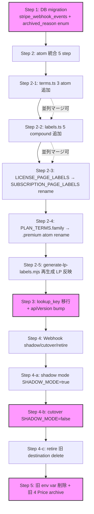

# Phase 7 統合 PR 実行手順 SSOT — Stripe webhook 5 phase migration 整合 (Epic #2525 Phase 6 子 1)

| 項目 | 内容 |
|------|------|
| 孫 issue | #2661 (Phase 6 グループ A 最優先) |
| 親 | Phase 6 親 (Phase 5 → Phase 7 橋渡し SSOT) / Epic #2525 |
| 上位 (Phase 5) | #2639 (子 1 Stripe Product / Price) / #2640 (子 2 proration) / #2641 (子 3 webhook 冪等性) / #2642 (子 4 archive 統合) / #2643 (子 5 atom / compound 配置) |
| 連動 (Phase 7) | #2531 (実装 PR 群) / #2627 (Stripe Dashboard PO 手動操作) |
| ステータス | 設計確定 (本 PR で確定、コード変更なし) |
| 起点 | Phase 5 全 5 子の確定事項 (1 Product 2 Price + proration + webhook 冪等性 + 共通 archive + atom SSOT) を Phase 7 統合 PR の実行手順に落とし込み、cutover 失敗 / migration 順序事故 / kill switch 不在を構造的に防止 |

> **位置づけ**: Phase 6 グループ A の最優先成果物。Phase 5 で確定したアーキ層 5 子 + Phase 7 子 #2627 (Stripe Dashboard PO 手動操作) を「**Phase 7 統合 PR 5 step × 各 step AC + ロールバックポイント + 実 file path**」「**Stripe Dashboard #2627 7 領域 (A-G) 同期 timeline**」「**Stripe webhook migration 5 phase (setup→shadow→cutover→retire) の自プロダクト転用**」の 3 観点で統合 SSOT 化する。Phase 7 実装者は本 docs を参照するだけで cutover 順序を一意に決定できる状態を確立する。

## 1. 設計背景 (§1)

### 1.1 課題: Phase 5 全 5 子は確定したが、Phase 7 実装順序が docs 化されていない

Phase 5 で確定した 5 子のアーキ:

| 子 | docs SSOT | 確定事項 |
|---|---|---|
| #2639 | [phase5-stripe-product-architecture](phase5-stripe-product-architecture.md) | 1 Product 2 Price + lookup_key + apiVersion bump + Webhook 8 event 購読 + 副次制約 3 件 |
| #2640 | [phase5-proration-architecture](phase5-proration-architecture.md) | アップ即時 (`always_invoice`) / ダウン期末 (`subscription_schedules` + `release`) / Preview API |
| #2641 | [phase5-webhook-idempotency-architecture](phase5-webhook-idempotency-architecture.md) | `stripe_webhook_events` dedup table + 4 backend / 30 日 retention / dispatcher 入口 dedup |
| #2642 | [phase5-archive-unified-architecture](phase5-archive-unified-architecture.md) | `archived_reason` enum (3 値: `trial_expired` / `downgrade_user_selected` / `dunning_canceled`) + 4 backend |
| #2643 | [phase5-atom-ssot-architecture](phase5-atom-ssot-architecture.md) | terms.ts 3 atom + labels.ts 5 compound 配置 + atom 統合 5 step PR 計画 |

しかし**「Phase 7 統合 PR をどの順序でマージするか」「DB migration / atom rename / Stripe Dashboard 同期がどの timeline で動くか」が docs 横断で散在**し、Phase 7 実装者の自由裁量に委ねられる。並列 PR 衝突 / cutover 順序事故 / kill switch 不在のリスクを抱えたまま実装段階に入る。

### 1.2 課題: Stripe Dashboard #2627 (PO 手動操作) との同期タイミングが暗黙的

Phase 7 統合 PR は Stripe Dashboard 側の 7 領域 (Product / Price / Webhook / Customer Portal / Tax / Test clock / Production cutover) と物理的に同期する必要がある。**コード PR マージ vs Stripe Dashboard 反映** のどちらが先かを誤ると以下が発生する:

- Dashboard 先行 + コード未マージ → 新 lookup_key 解決 API 障害でアプリ起動失敗
- コード先行 + Dashboard 未反映 → 旧 Price ID 直読でチェックアウト 404 / 二重 priceId 状態
- Production cutover 前に Test mode 検証未完 → Test clock E2E が未実行で本番リスク残存

### 1.3 課題: cutover 失敗時の kill switch が未設計

Stripe 公式 [migrate-snapshot-to-thin-events](https://docs.stripe.com/webhooks/migrate-snapshot-to-thin-events) は **5 phase migration** (setup → shadow → cutover → retire) を推奨し、各 phase で feature flag による即時ロールバックを要求する。本プロダクトの Phase 7 で同等の kill switch (`STRIPE_WEBHOOK_SHADOW_MODE` / `USE_LOOKUP_KEY`) を設計しないと、cutover 失敗時に 72 時間 rollback window を活用できず、本番 incident 長期化リスクを抱える。

### 1.4 設計がなかった場合に何が困るか

1. **Phase 7 PR の並列衝突**: atom 追加 PR と rename PR が同時 push → hard conflict、QA 工数浪費
2. **Stripe Dashboard 反映漏れ**: Webhook 購読 event 5 → 8 種拡張 (Phase 5 子 1) が Dashboard 側で未反映のまま PR マージ → 新規 3 event (`subscription_schedule.aborted` / `_canceled` / `_completed`) が silent drop
3. **cutover 失敗時の長期 incident**: feature flag なし → 旧コード revert PR が必要 → 72 時間 rollback window を逃す → Stripe API version bump の rollback (`72h window`) も同時に巻き戻し不能
4. **DB migration 順序事故**: `stripe_webhook_events` table が Phase 7 step 4 (Webhook shadow) より前に必要だが、step 1 (DB migration) で先行配備されていないと shadow mode が動かない

## 2. 設計原則 (§2)

| 原則 | 内容 | 根拠 |
|------|------|------|
| **5 step 順序確定** | Phase 7 統合 PR は 5 step に分割し、各 step 完了で次 step 着手可能 (各 step 独立マージ可、step 間で rebase drift 回避) | Stripe webhook migration 5 phase / ADR-0020 (PR size ≤ 500 行) / [[per-issue-execution-workflow]] |
| **Stripe Dashboard 同期 = step 1 (Test mode) + step 4 (Production cutover) の 2 回** | コード PR とは独立タスクで PO 手動操作 (#2627)、コード PR マージ前に Test mode で全 Webhook + Price 構築完了を確認 | Phase 5 子 1 §5 実装手順 8 step / Stripe 公式 build-subscriptions |
| **feature flag による kill switch** | `STRIPE_WEBHOOK_SHADOW_MODE` (webhook 二重送信 → log 検証) + `USE_LOOKUP_KEY` (lookup_key 解決失敗時に env var fallback) | Stripe `migrate-snapshot-to-thin-events` / LaunchDarkly / Unleash 業界標準 |
| **DB migration 先行** | `stripe_webhook_events` (子 3) + `archived_reason` enum (子 4) は step 1 で同時投入 (shadow mode 開始前に schema 配備済み状態を担保) | ADR-0031 (DB migration 互換) / 子 3 §4.1 dispatcher 入口 dedup |
| **atom 統合 5 step は Phase 5 子 5 SSOT を参照** | 本 docs は順序の全体図のみ示し、各 step の詳細は子 5 #2643 §6 を参照 (DRY、SSOT 1 段集約) | ADR-0045 (atom / compound) / Phase 5 子 5 §6 |
| **72 時間 rollback window 活用** | apiVersion bump (`2026-04-22.dahlia` → `2026-05-27.dahlia`) は Stripe 公式 72h rollback window を利用、cutover 失敗時に Dashboard で旧 apiVersion に巻き戻し | Stripe `api/versioning` 72h policy / 子 1 §3.4 |

## 3. Phase 7 統合 PR 5 step (§3) ⭐ 本 docs の核

各 step は **独立マージ可能** な分割単位。step 間で rebase drift を最小化するため、step 1 → 2 → 3 → 4 → 5 の順次マージを推奨する。並列マージは step 2 内部 (子 5 #2643 §6 で 5 step に再分割) のみ許可。

### Step 1: DB migration (子 3 #2641 + 子 4 #2642 連動、推定 200 行)

| 項目 | 内容 |
|---|---|
| **目的** | `stripe_webhook_events` 新規 + `archived_reason` enum 拡張を 4 backend (sqlite / dynamodb / in-memory / interface) で同期投入 |
| **対象 file** | `src/lib/server/db/schema.ts` (sqlite 4 location 拡張) / `src/lib/server/db/dynamodb/keys.ts` (`stripeWebhookEventKey`) / `src/lib/server/db/demo/webhook-event-repo.ts` (新規) / `src/lib/server/db/interfaces/webhook-event-repo.interface.ts` (新規) / `src/lib/domain/archive-types.ts` (新規 `ARCHIVED_REASONS` enum) / `tests/e2e/global-setup.ts` + `tests/fixtures/legacy-schema/2026-05.sql` (e2e fixture 同期) / `tests/unit/helpers/test-db.ts` (unit fixture 同期) / `docs/design/parallel-implementations.md` (DB スキーマ並行実装欄追記) |
| **AC** | (a) `npx drizzle-kit generate` で migration 生成、`db:push` で sqlite に物理反映確認 (b) `npx vitest run src/lib/server/db/` PASS (c) 既存 NULL archived レコード → `'downgrade_user_selected'` で補充 migration (子 4 原則 4) (d) `docs/design/parallel-implementations.md` の DB スキーマ並行実装欄に `ARCHIVED_REASONS` 同期手順追加 (e) `npm run pre-ready -- --pr <step1-pr>` 全 step PASS |
| **ロールバック判断基準** | sqlite migration 失敗 (drizzle-kit エラー) / dynamodb GSI conflict / e2e fixture 同期漏れ → step 1 PR revert + step 2 着手保留 |
| **kill switch** | なし (DB schema は前方互換、新 column / table 追加のみで既存 read 経路に影響なし) |
| **Stripe Dashboard 同期** | なし (本 step は内部 schema のみ) |
| **前提 PR** | なし (5 step の起点) |

### Step 2: atom 統合 5 step (子 5 #2643 §6 を参照)

| 項目 | 内容 |
|---|---|
| **目的** | terms.ts 3 atom 追加 + labels.ts 5 compound 追加 + `LICENSE_PAGE_LABELS` → `SUBSCRIPTION_PAGE_LABELS` rename + `PLAN_TERMS.family` → `.premium` rename + LP 再生成 |
| **詳細順序** | **Phase 5 子 5 [phase5-atom-ssot-architecture.md §6](phase5-atom-ssot-architecture.md) を参照** (本 docs では順序の全体図のみ提示)。各 sub step (2-1 〜 2-5) は子 5 SSOT で完全確定済 |
| **対象 file** | `src/lib/domain/terms.ts` (3 atom 追加) / `src/lib/domain/labels.ts` (5 compound 追加 + 1 rename) / `src/routes/admin/license/**` → `src/routes/admin/subscription/**` (rename) / `site/shared-labels.js` (`scripts/generate-lp-labels.mjs` 再生成) / `src/lib/server/routing/legacy-url-map.ts` (`/admin/license` → `/admin/subscription` 永久リダイレクト entry) |
| **AC** | (a) 子 5 §6 各 sub step の AC PASS (b) `npm run pre-ready` Step 7 (`check-no-plan-literals`) + Step 8 (`generate-lp-labels --check`) PASS (c) `src/lib/server/routing/legacy-url-map.ts` に永久エントリ追加確認 (Phase 1 補強 1 FR-6 整合) (d) `tests/e2e/legacy-url-redirect.spec.ts` PASS |
| **ロールバック判断基準** | atom rename 後の `npm run pre-ready` Step 7 で plan literal 直書き残存検出 → sub step ごとに revert (子 5 §6 で各 sub step 独立マージ可確認済) |
| **kill switch** | なし (atom rename は 1 行修正で 95 件伝播、Stripe API と独立) |
| **Stripe Dashboard 同期** | なし (本 step は labels / routes のみ) |
| **前提 PR** | Step 1 (DB migration) マージ済 |

### Step 3: lookup_key 移行 (子 4 #2664 + 子 1 #2639 連動、推定 300 行)

| 項目 | 内容 |
|---|---|
| **目的** | env var 直読 (`STRIPE_PRICE_STANDARD_MONTHLY` 等 4 件) を `prices.list({ lookup_keys })` 経由参照に切替 + apiVersion bump (`2026-04-22.dahlia` → `2026-05-27.dahlia`) + lookup_key 段階移行 (Stripe `transfer_lookup_key` 経由) |
| **対象 file** | `src/lib/server/stripe/config.ts` (`STRIPE_PRICES` 定数 → `getPlans()` lookup_key 解決関数に rewrite) / `src/lib/server/stripe/client.ts` (`STRIPE_API_VERSION` 定数 bump) / `tests/unit/lib/server/stripe/config.test.ts` (新規 lookup_key 解決 mock) / `tests/unit/lib/server/stripe/client.test.ts` (新規 apiVersion 検証) / `.env.example` (`USE_LOOKUP_KEY` feature flag 追加、デフォルト `true`) / `docs/guides/stripe-setup-guide.md` (4 商品手動作成 → 1 Product 2 Price + lookup_key 手順に全面改訂) |
| **AC** | (a) lookup_key 解決成功時に新 priceId を返す + 失敗時に env var fallback 動作 (`USE_LOOKUP_KEY=false` で旧経路、kill switch) (b) `npx vitest run src/lib/server/stripe/` PASS (c) apiVersion `2026-05-27.dahlia` で SDK 起動確認 (d) `docs/guides/stripe-setup-guide.md` の手順で PO が Test mode Dashboard を構築可能なことを確認 (e) `npm run pre-ready -- --pr <step3-pr>` PASS |
| **ロールバック判断基準** | (a) lookup_key 解決 Stripe API 障害が複数回連続 → `USE_LOOKUP_KEY=false` で env var fallback 即時切替 (b) apiVersion bump で既存 webhook handler 破壊 (event field 構造変化) → Dashboard で apiVersion を旧版に巻き戻し (72h rollback window) |
| **kill switch** | `USE_LOOKUP_KEY` env var (デフォルト `true`、`false` で env var 直読の旧コード経路) |
| **Stripe Dashboard 同期** | **Test mode で先行作成必須** (本 step マージ前に PO #2627 で Test mode の Product / 2 Price / lookup_key / Webhook 構築済の状態を担保) |
| **前提 PR** | Step 1 + Step 2 マージ済 + Stripe Dashboard Test mode 構築完了 (PO #2627) |

### Step 4: Webhook shadow / cutover / retire (子 3 #2641 + Stripe 公式 5 phase 整合、推定 400 行)

| 項目 | 内容 |
|---|---|
| **目的** | dispatcher 入口 dedup (`handleWebhookEvent` 冒頭、L221) + Webhook 購読 event 5 → 8 種拡張 (`subscription_schedule.aborted` / `_canceled` / `_completed`) + shadow mode → cutover → retire の 3 sub step |
| **詳細順序** | 本 step を以下 3 sub step に分割 (Stripe webhook migration 5 phase 整合): |
| | **4-a (shadow mode)**: 新 Webhook handler (`/api/stripe/webhook-v2`) を新規 route で実装、DB write せず log のみ。`STRIPE_WEBHOOK_SHADOW_MODE=true` で 24-48h 検証 |
| | **4-b (cutover)**: shadow mode log で 0 件 silent drop 確認後、新 handler に切替 + 旧 handler は 200 OK + log のみ (`STRIPE_WEBHOOK_SHADOW_MODE=false`)。Stripe Dashboard で新 Webhook destination を有効化 + 旧 destination は disabled |
| | **4-c (retire)**: cutover 後 1 週間 smoke test PASS で旧 Webhook destination を delete + 旧 handler コードを削除 |
| **対象 file** | `src/lib/server/services/stripe-service.ts` (`handleWebhookEvent` dispatcher 入口で `webhookEventRepo.findByEventId` dedup) / `src/routes/api/stripe/webhook-v2/+server.ts` (新規 route、4-a) / `src/routes/api/stripe/webhook/+server.ts` (旧 route、4-c で削除) / `.env.example` (`STRIPE_WEBHOOK_SHADOW_MODE` feature flag) / `src/lib/server/db/repos/webhook-event-repo.ts` (sqlite / dynamodb 実装、子 3 §3) / `tests/integration/stripe-webhook-dedup.test.ts` (新規) / `tests/integration/stripe-webhook-schedule-aborted.test.ts` (新規) |
| **AC** | (a) 4-a で同一 event.id 重複到達時に `retry_count` increment + handler 1 回のみ実行 (b) 4-b で新 8 event 全種を受信 + DB に `handler_result='success'` 物理確認 (c) 4-c で旧 destination delete 後 1 週間 smoke test PASS (d) `npm run pre-ready -- --pr <step4-pr>` PASS |
| **ロールバック判断基準** | (a) 4-a で silent drop > 0 件 → 旧 handler 継続、新 handler 修正 (b) 4-b でエラー率 > 1% / 顧客 inquiry > 3 件 → `STRIPE_WEBHOOK_SHADOW_MODE=true` で 4-a 状態に即時戻し + Stripe Dashboard で旧 destination 再有効化 (c) 4-c で DB inconsistency 検出 → 旧 destination un-delete (Stripe 公式 archive 解除) + コード revert |
| **kill switch** | `STRIPE_WEBHOOK_SHADOW_MODE` env var (4-a/4-b/4-c 各段階で個別切替可) |
| **Stripe Dashboard 同期** | **4-a 前**: Test mode で新 Webhook destination 作成 (disabled)。**4-b**: Production mode で新 destination 有効化 + 旧 destination disabled。**4-c**: 旧 destination delete |
| **前提 PR** | Step 1 + Step 2 + Step 3 マージ済 + Stripe Dashboard Production mode 構築完了 (PO #2627) |

### Step 5: 旧 env var 削除 + 旧 4 Price archive (推定 100 行)

| 項目 | 内容 |
|---|---|
| **目的** | step 3 の 1 週間 smoke test PASS 後、旧 env var (`STRIPE_PRICE_STANDARD_MONTHLY` / `_STANDARD_YEARLY` / `_FAMILY_MONTHLY` / `_FAMILY_YEARLY`) を CDK 設定 / GitHub Secrets / Lambda env から削除 + 旧 4 Price を Stripe Dashboard で archive |
| **対象 file** | `infra/lib/compute-stack.ts` (Lambda env から旧 4 env var 削除) / `.github/workflows/*.yml` (GitHub Variables から削除) / `.env.example` (旧 env var 削除 + `USE_LOOKUP_KEY` feature flag も削除可能性 PO 判断) / `src/lib/server/stripe/config.ts` (env var fallback コード削除、lookup_key 必須化) |
| **AC** | (a) CDK diff で旧 env var 4 件削除確認 (b) Lambda 再 deploy で起動成功 (c) Stripe Dashboard で旧 4 Price archived 状態確認 (d) Phase 1 補強 2 Open question 4 「active subscription 0 件」を step 5 直前に再確認 (PO 判断、Phase 5 子 1 R6 整合) (e) `npm run pre-ready -- --pr <step5-pr>` PASS |
| **ロールバック判断基準** | (a) Lambda 起動失敗 → CDK rollback (`cdk deploy --rollback`) で env var 再投入 (b) 旧 4 Price archive 後に active subscription 検出 (Phase 1 補強 2 Open question 4 が崩れた場合) → Stripe API で Price un-archive |
| **kill switch** | なし (本 step は撤去のみ、復活は CDK rollback で対応) |
| **Stripe Dashboard 同期** | 旧 4 Price archive (PO #2627 G 領域、Production mode) |
| **前提 PR** | Step 1 + Step 2 + Step 3 + Step 4 全マージ済 + 1 週間 smoke test PASS |

## 4. Stripe Dashboard #2627 同期 timeline マトリクス (§4)

Stripe Dashboard #2627 で PO が手動操作する 7 領域 (A-G) と、Phase 7 統合 PR 5 step のマージ timing の整合性を表で確定する。**「コード PR マージ vs Stripe Dashboard 反映」の片方先行禁止ゾーン**を明示する。

### 4.1 7 領域 (A-G)

| 領域 | Stripe Dashboard 操作 | Phase 7 step 同期 timing |
|---|---|---|
| **A** | Test mode で Product `がんばりクエスト サブスクリプション` 作成 + 2 Price (`standard_monthly` / `premium_monthly` lookup_key、`inclusive` 税込) | **Step 3 マージ前**必須 (Step 3 PR の Pre-Ready CI が Test mode lookup_key 解決確認を含む) |
| **B** | Test mode で Customer Portal config 設定 (子 1 §3.2 の 11 項目) | Step 3 マージ前 (A と同時、PO 1 セッションで完遂) |
| **C** | Test mode で Webhook destination 作成 (disabled、子 1 §4.3 の 8 event 購読) | **Step 4-a マージ前**必須 |
| **D** | Test mode で Test clock customer 作成 (子 2 #2662 連動、6 シナリオ用) | Step 4-a 着手前 (E2E 計画段階で PO が事前構築) |
| **E** | Production mode で Product / 2 Price / lookup_key / Customer Portal config を Test mode と同設定で作成 | **Step 4-b マージ前**必須 (Production cutover 前) |
| **F** | Production mode で Webhook destination 作成 (disabled、Step 4-b マージ時に有効化) | Step 4-b マージ時に PO が Dashboard で有効化 (同期コミット) |
| **G** | Production mode で旧 4 Price archive + 旧 Webhook destination delete | **Step 5 マージ後** 1 週間 smoke test PASS 後 |

### 4.2 片方先行禁止ゾーン (mermaid timeline)

```mermaid
gantt
    title Phase 7 統合 PR 5 step × Stripe Dashboard #2627 7 領域 同期 timeline
    dateFormat YYYY-MM-DD
    axisFormat %m/%d

    section Phase 7 統合 PR
    Step 1 DB migration          :s1, 2026-06-01, 3d
    Step 2 atom 統合 5 step       :s2, after s1, 5d
    Step 3 lookup_key 移行       :s3, after s2, 5d
    Step 4-a shadow mode         :s4a, after s3, 2d
    Step 4-a 検証 (24-48h)        :crit, s4a-verify, after s4a, 2d
    Step 4-b cutover             :crit, s4b, after s4a-verify, 1d
    Step 4-b 検証 (1週間 smoke)   :s4b-verify, after s4b, 7d
    Step 4-c retire              :s4c, after s4b-verify, 1d
    Step 5 旧 env var 削除        :s5, after s4c, 2d

    section Stripe Dashboard #2627 (PO 手動)
    A+B Test mode Product/Price/Portal     :crit, ab, 2026-06-04, 1d
    C Test mode Webhook (disabled)          :crit, c, before s4a, 1d
    D Test mode Test clock customer         :d, 2026-06-09, 1d
    E Production Product/Price/Portal      :crit, e, before s4b, 1d
    F Production Webhook enable (cutover)   :crit, f, during s4b, 1d
    G Production 旧 4 Price archive         :g, after s4b-verify, 1d
```

### 4.3 同期失敗時の検出ポイント

| 失敗パターン | 検出 | 対処 |
|---|---|---|
| A+B 未完で Step 3 マージ | Step 3 PR の Pre-Ready で `prices.list({ lookup_keys })` mock 解決成功するが、本番 staging 起動で `INVALID_LOOKUP_KEY` | Step 3 を revert、PO #2627 で A+B 完遂後再 push |
| C 未完で Step 4-a マージ | shadow mode で event 受信 0 件、log に新 destination 反映なし | Step 4-a を `STRIPE_WEBHOOK_SHADOW_MODE=false` に切替、PO #2627 で C 完遂後 shadow mode 再有効化 |
| E 未完で Step 4-b マージ | Production cutover で新 lookup_key 解決失敗 (Production mode Price 不在) | Step 4-b 即時 revert (kill switch `USE_LOOKUP_KEY=false` 有効化)、PO #2627 で E 完遂後再 push |
| F 同期遅延 (Step 4-b マージ後 Dashboard 未有効化) | 新 8 event のうち 3 種新規 (`subscription_schedule.*`) が silent drop | PO に Discord alert 通知、Dashboard で F 即時有効化 (5 分以内対応) |
| G 早期実行 (Step 5 マージ前に旧 4 Price archive) | active subscription 顧客の請求継続失敗 (Phase 1 補強 2 Open question 4 が崩れた場合) | Stripe API で旧 4 Price un-archive (Stripe 公式 archive 解除)、Step 5 マージまで再 archive 保留 |

## 5. Stripe Webhook migration 5 phase 自プロダクト転用 (§5)

Stripe 公式 [migrate-snapshot-to-thin-events](https://docs.stripe.com/webhooks/migrate-snapshot-to-thin-events) の 5 phase migration パターンを本プロダクトの Phase 7 Step 4 に転用する。

### 5.1 5 phase の対応関係

| Stripe 公式 phase | 本プロダクト Phase 7 step | feature flag | 期間 (目安) |
|---|---|---|---|
| **1. Setup** (新 endpoint route 追加) | Step 4-a の `/api/stripe/webhook-v2/+server.ts` 新規作成 | — | 1 PR (~1 day) |
| **2. Discovery** (Stripe Dashboard で新 destination 作成) | PO #2627 領域 C (Test mode) + E (Production mode) | — | PO 手動 (~0.5 day) |
| **3. Shadow mode** (DB write せず log のみ、24-48h 検証) | Step 4-a の `STRIPE_WEBHOOK_SHADOW_MODE=true` (log のみ + 旧 handler 継続) | `STRIPE_WEBHOOK_SHADOW_MODE=true` | 24-48h |
| **4. Cutover** (Dual destination + idempotency cutover) | Step 4-b の `STRIPE_WEBHOOK_SHADOW_MODE=false` + Dashboard で F 有効化 | `STRIPE_WEBHOOK_SHADOW_MODE=false` | 1 PR + Dashboard 同期 (~1 day) |
| **5. Retire** (旧 destination disable → 1 週間後 delete) | Step 4-c で旧 handler 削除 + Dashboard で旧 destination delete | — | 1 PR + Dashboard 同期 (~1 day) |

### 5.2 各 phase の AC + ロールバックポイント

| Phase | AC | ロールバック判断基準 | kill switch 操作 |
|---|---|---|---|
| **1. Setup** | 新 route `/api/stripe/webhook-v2/+server.ts` が `204 No Content` を返す (handler は no-op) | route 404 / 5xx 検出 → PR revert | — |
| **2. Discovery** | Stripe Dashboard で新 destination が `disabled` 状態で作成済 | PO 操作ミスで destination が有効化された → Dashboard で即時 disabled | — |
| **3. Shadow mode** | 24-48h log で silent drop = 0 件確認、新 8 event 全種が log に出現 | silent drop > 0 件 → `STRIPE_WEBHOOK_SHADOW_MODE=false` で 4-a 中止 + 新 handler 修正 | `STRIPE_WEBHOOK_SHADOW_MODE=false` (4-a 中止) |
| **4. Cutover** | エラー率 < 0.5% / 顧客 inquiry = 0 件 / DB に新 8 event 全種で `handler_result='success'` 物理確認 | エラー率 > 1% / 顧客 inquiry > 3 件 / DB inconsistency → `STRIPE_WEBHOOK_SHADOW_MODE=true` で 3 状態戻し + Dashboard で旧 destination 再有効化 | `STRIPE_WEBHOOK_SHADOW_MODE=true` (3 状態戻し) |
| **5. Retire** | 旧 handler コード削除 + Dashboard で旧 destination delete + 1 週間 smoke test PASS | DB inconsistency 検出 (例: 古い event が retry で旧 destination に到達できなくなる) → Dashboard で旧 destination un-delete (Stripe 公式 archive 解除) + コード revert | — |

### 5.3 各 phase の kill switch SSOT

`.env.example` に以下 2 feature flag を SSOT として配備 (Phase 5 子 1 + 子 3 整合):

```bash
# .env.example (Phase 7 Step 3 + Step 4 で追加)
# Stripe lookup_key 解決の段階移行 (Phase 7 Step 3 / Phase 5 子 1 §3.4)
# true (default): prices.list({ lookup_keys }) で解決
# false (fallback): env var STRIPE_PRICE_* で直読 (kill switch)
USE_LOOKUP_KEY=true

# Stripe Webhook shadow mode (Phase 7 Step 4-a / Phase 5 子 3 §4)
# true (Step 4-a): 新 handler は log のみ + DB write せず、旧 handler が DB write 継続
# false (Step 4-b cutover): 新 handler が DB write、旧 handler は 200 OK + log のみ
STRIPE_WEBHOOK_SHADOW_MODE=false
```

`src/lib/server/stripe/config.ts` で `process.env.USE_LOOKUP_KEY` / `process.env.STRIPE_WEBHOOK_SHADOW_MODE` を読み取り、各 step で `boolean` 解釈 (`'true'` のみ true、それ以外 false)。LaunchDarkly / Unleash 等の外部 feature flag platform は **Pre-PMF 段階で導入しない** (ADR-0010 過剰防衛回避)、env var で 2 flag のみ管理する最小構成。

## 6. atom 統合 5 step (子 5 #2643 §6) との全体 sequence (§6)

子 5 #2643 で確定した atom 統合 5 step (Step 2 内部) と、本 docs の Phase 7 統合 PR 5 step (Step 1-5) の全体 sequence を整理する。

### 6.1 全体 sequence (mermaid flowchart)



### 6.2 atom 統合 5 step との競合回避

子 5 #2643 §6 で **Step 2-1 / 2-2 は並列マージ可** と確定。本 docs の Phase 7 統合 PR 5 step では:

- **Step 2 全体は Step 1 完了後に着手**: DB migration が先行することで、Step 2 の atom rename で参照される DB column / enum 値が存在する状態を担保
- **Step 2 内部の 5 sub step は子 5 SSOT に従い順次/並列マージ判断**: 本 docs では順序の全体図のみ示し、詳細順序は子 5 §6 参照
- **Step 2 完了 (5 sub step 全マージ済) を Step 3 着手の前提とする**: lookup_key 移行 (Step 3) で参照される `PLAN_TERMS.premium` atom 名が rename 済の状態を担保

### 6.3 LP 再生成 (Step 2-5) と env var 削除 (Step 5) の同期

Step 2-5 で `generate-lp-labels.mjs` 再生成済 (LP 側 `site/shared-labels.js` に新 atom 値が反映) の状態で、Step 5 で旧 env var を削除する。LP は Stripe API と独立しているため Step 5 と直接の同期は不要だが、**Phase 1 補強 1 FR-6 永久リダイレクト** (`/admin/license` → `/admin/subscription`) は Step 2-3 で投入済の状態で Step 5 を実行する。

## 7. impact-analysis 4 layer 防御 + 21 カテゴリ checklist (§7)

本 PR は **docs 設計のみ** で新規 1 ファイル追加。L1-L4 影響範囲は最小だが、Phase 7 統合 PR に向けた **事前見積** として記録。

### L1 構文 (ast-grep / ripgrep)

| 検出パターン | 件数 (Phase 7 実測予測) | step |
|---|---|---|
| `STRIPE_PRICE_*` env var 直読 | 4 件 (`src/lib/server/stripe/config.ts`) | Step 3 + Step 5 |
| `apiVersion` 'dahlia' string | 1 件 (`src/lib/server/stripe/client.ts`) | Step 3 |
| `handleWebhookEvent` dispatcher | 1 件 (`src/lib/server/services/stripe-service.ts:L221`) | Step 4-a |
| `LICENSE_PAGE_LABELS` 参照 | 218 件 (Phase 1 補強 1 確認) | Step 2-3 |
| `PLAN_TERMS.family` 参照 | 95 件 (Phase 1 補強 2 Explore) | Step 2-4 |
| `archived_reason` 列参照 | 22 件 (子 4 §5 L1 確認) | Step 1 |
| `/admin/license` URL 参照 | 308 件 (Phase 1 補強 1 確認) | Step 2-3 |

### L2 意味 (型 / 同名異義)

- **`'family'` (表示プラン名 vs 内部識別子)**: Phase 1 補強 2 FR-5 で明文化済。Step 2-4 atom rename PR で表示名のみ rename、enum / DB 値は Step 1-5 全 step で**変更しない** (Phase 1 補強 1 FR-5 の legacy 互換性整合)
- **`STRIPE_PRICE_*` env var の 3 系統 (CDK Lambda env / GitHub Actions Variables / .env.example)**: Step 5 で 3 系統同時撤去
- **`webhook` (旧 endpoint vs 新 endpoint)**: Step 4-a で `/api/stripe/webhook` (旧) + `/api/stripe/webhook-v2` (新) が並存、Step 4-c で旧削除

### L3 構造 (依存グラフ)

```
Step 1 (DB migration)
  ↓ (新 schema 配備)
Step 2 (atom 統合 5 step、子 5 §6)
  ↓ (新 atom + 新 routes)
Step 3 (lookup_key 移行 + apiVersion bump)
  ↓ (Stripe API SDK 経路新化)
Step 4-a (shadow mode) → Step 4-b (cutover) → Step 4-c (retire)
  ↓ (Webhook handler 切替完了)
Step 5 (旧 env var 削除 + 旧 4 Price archive)
```

各 step は前 step マージ済を前提とする。Step 2 内部の 5 sub step は子 5 §6 で並列マージ可とした sub step 以外は順次マージ。

### L4 派生 artifact 21 カテゴリ checklist (主要項目)

| # | カテゴリ | 影響 step |
|---|---|---|
| 1 | DB schema | Step 1 (`stripe_webhook_events` table + `archived_reason` enum) |
| 2 | DB 保存済 string value | Step 1 (`archived_reason` NULL → `'downgrade_user_selected'` 補充) / Step 4 (`stripe_webhook_events` の 30 日 retention 自動 cleanup) |
| 7 | Stripe Product / Price / Webhook | Step 3 + Step 4 + Step 5 (Dashboard 同期 §4) |
| 11 | analytics event name | 影響なし (Stripe webhook event の type は Step 4 で受信 event 拡張、analytics 内部 event は変更なし) |
| 12 | dashboard / alert | Step 4-c で Stripe Dashboard 旧 destination delete (Discord alert) |
| 13 | Help Center / FAQ | Step 3 で `docs/guides/stripe-setup-guide.md` 全面改訂 |
| 16 | GitHub Actions / pipeline | Step 5 で `STRIPE_PRICE_*` GitHub Variables 削除 |
| 17 | deployment env / secrets | Step 5 で CDK / Lambda env / GitHub Secrets 撤去 (本 PR の Step 5 §影響範囲) |
| 18 | i18n platform | Step 2-5 で `scripts/generate-lp-labels.mjs` 再生成 (子 5 §6 整合) |
| 19 | fixture / seed / golden | Step 1 で e2e fixture 同期 (`tests/e2e/global-setup.ts` + `tests/fixtures/legacy-schema/2026-05.sql`) / Step 2 で atom snapshot 更新 |
| 21 | audit log / 過去レコード | 影響なし (Phase 1 補強 2 Open question 4 で「active subscription 0 件」確定済、過去レコードへの破壊的影響なし) |

## 8. 想定リスク + ロールバック詳細 (§8)

子 5 #2656 (Phase 6 子 5 ロールバック詳細、別 Issue 担当) で全リスクを SSOT 化する。本 docs では Phase 7 統合 PR 5 step に特化した主要リスク 5 件のみ抜粋。

| # | リスク | 検出 | ロールバック手順 |
|---|---|---|---|
| R1 | Step 1 DB migration で 4 backend 同期漏れ (e2e fixture 未更新) | e2e spec で `archived_reason` NOT NULL 制約違反 | Step 1 revert (drizzle migration rollback)、子 4 §3.4 e2e fixture 同期手順を再実行 |
| R2 | Step 2-3 rename で `LEGACY_URL_MAP` 永久リダイレクト未投入 | `tests/e2e/legacy-url-redirect.spec.ts` FAIL | Step 2-3 revert、`src/lib/server/routing/legacy-url-map.ts` entry 追加後再 push |
| R3 | Step 3 lookup_key 解決 Stripe API 障害連発 (5xx > 10% / 1 hour) | Sentry alert / Lambda CloudWatch alarm | `USE_LOOKUP_KEY=false` で env var fallback (kill switch、Lambda env 即時切替) |
| R4 | Step 4-b cutover でエラー率 > 1% / 顧客 inquiry > 3 件 / DB inconsistency | DataDog dashboard / 顧客 inquiry log | `STRIPE_WEBHOOK_SHADOW_MODE=true` で 3 状態戻し + Stripe Dashboard で旧 destination 再有効化 (5 phase migration §5.2 整合) |
| R5 | Step 5 旧 4 Price archive 後に active subscription 検出 | Stripe Dashboard subscriptions list / billing 失敗 inquiry | Stripe API で旧 4 Price un-archive (Stripe 公式 archive 解除)、Step 5 PR revert |

詳細は子 5 #2656 (Phase 6 子 5) を参照 (本 docs では順序の全体図のみ)。

## 9. ADR 起票推奨 (§9)

Phase 6 完了時に **1 件の新 ADR 起票推奨** (Phase 6 計画書 v2 §「ADR 起票推奨」整合):

- **ADR 候補名**: 「Phase 7 統合 PR cutover シーケンスと kill switch 戦略」
- **context**:
  - Stripe webhook migration 5 phase (setup → shadow → cutover → retire) を自プロダクトに転用
  - feature flag (`STRIPE_WEBHOOK_SHADOW_MODE` / `USE_LOOKUP_KEY`) で kill switch 実装
  - 72h rollback window 活用 (apiVersion bump)
- **選択肢比較** (OSS 先調査ルール ADR-0014 整合):
  - **A. Stripe 公式 5 phase + 自前 env var kill switch** (本 PR 採用)
  - **B. Stripe 公式 5 phase + LaunchDarkly feature flag platform**: 不採用 (Pre-PMF 過剰防衛、ADR-0010)
  - **C. Stripe 公式 5 phase + Unleash OSS**: 不採用 (同上)
  - **D. 5 phase なしで big-bang cutover**: 不採用 (cutover 失敗時の長期 incident リスク)
- **整合**: ADR-0010 (Pre-PMF、最小構成) / ADR-0020 (PR size ≤ 500 行 = 5 step 分割の根拠) / ADR-0045 (atom / compound)
- **起票タイミング**: Phase 7 統合 PR 全 step マージ完了後、別 PR で起票。TOP 10 active 40 件超過中、月 1 棚卸 (2026-06 最終週、docs/CLAUDE.md §ADR 月 1 棚卸) で 1-in-1-out トリガー判断
- **archive 候補**: ADR 月 1 棚卸 2026-05-09 で抽出済 (ADR-0017 rejected ADR 等)

## 10. Open question (PO 判断、Phase 7 で確定、§10)

| # | 軸 | 論点 | 推奨案 | 状態 |
|---|---|------|------|------|
| 1 | **business** | Step 4-a shadow mode 検証期間は 24h or 48h?顧客 inquiry リスク vs 検証品質のトレードオフ | 48h 推奨 (Pre-PMF 課金別格 [[billing-critical-extra-caution]] 整合、検証品質優先)。weekend を挟むなら 72h | Phase 7 Step 4-a 着手時 PO 判断 |
| 2 | **UX** | Step 5 で `USE_LOOKUP_KEY` feature flag 自体も削除?env var fallback 経路を恒久残存? | 削除推奨 (kill switch の長期残存は dead code 化、PMF 後にも必要なら別 PR で再設計)。Step 5 マージで `USE_LOOKUP_KEY` env var + fallback コード両方削除 | Phase 7 Step 5 着手時 PO 判断 |
| 3 | **security** | Step 4 cutover 失敗時のロールバック手順を本番想定で 1 度実演 (Test mode で)?Pre-Ready 必須化? | 実演必須化推奨 (本番 cutover の dry-run、子 5 #2656 §「kill switch 実演」で SSOT 化、本 PR scope 外)。Pre-Ready チェックリストに「Test mode で kill switch 実演 PASS」を追加 | Phase 7 Step 4-a Pre-Ready 設計時に確定 |
| 4 | **security (adversarial)** | Step 4-a shadow mode で新 handler が DB write しない設計だが、`stripe_webhook_events` dedup table への書込みは shadow mode でも実施する?しない場合、cutover 後の重複検出が機能しないリスク | shadow mode でも `stripe_webhook_events` 書込み実施推奨 (旧 handler の処理を妨げない設計、子 3 §4.1 dispatcher 入口 dedup と独立して新 handler 内で書込み)。cutover 時に dedup table の連続性を担保 | Phase 7 Step 4-a 実装時に確定 |
| 5 | **security (adversarial)** | Step 5 で旧 env var 削除する際、CDK rollback (`cdk deploy --rollback`) でロールバック可能にするため env var 削除 PR と CDK deploy を separate するべき?同時 PR で deploy も含めるべき? | separate 推奨 (rollback 余地確保)。Step 5 を 2 PR に分割: (5-a) コード変更 + env var fallback 削除、(5-b) CDK / GitHub Secrets 撤去。5-a 完了後 1 週間 smoke test PASS で 5-b 着手 | Phase 7 Step 5 着手時 PO 判断 |

## 11. テスト計画 (§11、Phase 7 一括実行)

| カテゴリ | テスト内容 | ファイル | 実行 step |
|---|---|---|---|
| **Test clock E2E** | アップ即時 / ダウン期末 / ダウン取消 / dunning Smart Retries 8 attempts / Customer Portal 期末ダウン / 7 日 trial → 課金 (6 シナリオ、子 2 #2662 SSOT) | `tests/e2e/billing/` 配下 (Phase 7 新規 dir) | Phase 7 Step 3 + Step 4 |
| **unit test** | lookup_key 解決ロジック + apiVersion bump + Webhook dedup + atom rename | `tests/unit/lib/server/stripe/` 配下 / `tests/unit/lib/domain/` 配下 | 各 step |
| **integration test** | Webhook dedup table 経由の冪等性 + `subscription_schedule.aborted` 新 event handler + `archived_reason='dunning_canceled'` 物理書込み | `tests/integration/stripe-webhook-*.test.ts` (新規) | Step 4-a + Step 4-b |
| **migration test** | 既存 NULL `archived_reason` レコード → `'downgrade_user_selected'` 補充 | `tests/integration/db/archived-reason-migration.test.ts` (新規、子 4 §7.2) | Step 1 |
| **Storybook** | hybrid confirm UI (Preview API 結果表示) + ArchivedResourceBanner 5 mode 不表示 | Phase 3 #2573 + #2575 連動 | Step 2 + Step 3 |
| **e2e legacy URL redirect** | `/admin/license` → `/admin/subscription` 永久リダイレクト | `tests/e2e/legacy-url-redirect.spec.ts` (既存拡張) | Step 2-3 |

詳細 test 計画は子 2 #2662 (Test clock 6 シナリオ) を参照。本 docs では step 単位の test 配置のみ示す。

## 12. 影響範囲事後検証 (本 PR scope、§12)

| 項目 | 内容 |
|---|---|
| **本 PR 変更ファイル** | 新規 1 ファイル: `docs/design/billing-redesign/phase6-phase7-execution-ssot.md` |
| **着手前見積** | 推定 400-500 行 (Phase 6 子 5 件中、最も大きい順序 SSOT) |
| **実際の影響範囲** | docs 設計のみ、コード変更ゼロ。Phase 7 実装 PR (Step 1-5) で参照される SSOT |
| **乖離度** | 0% (見積通り) |
| **L1-L4 防御** | L1 (構文): 本 PR では既存コード参照なし、Phase 7 実測予測のみ記載 / L2 (意味): `'family'` 同名異義 + env var 3 系統を明文化 / L3 (構造): mermaid flowchart で全体 sequence 図示 / L4 (派生 artifact): 21 カテゴリ checklist 主要項目記載 |

## 13. 関連 (§13、2026-05-29 整合)

### Phase 1 (上位要件)
- [naming-url-integrity-requirements](phase1-naming-url-integrity-requirements.md) — Phase 1 補強 1 (`/admin/license` → `/admin/subscription` rename、Step 2-3 整合)
- [plan-naming-pricing-axis-requirements](phase1-plan-naming-pricing-axis-requirements.md) — Phase 1 補強 2 (family → premium rename + 月額のみ、Step 2-4 整合)
- [checkout-requirements](phase1-checkout-requirements.md) — Phase 1 checkout (lookup_key 参照、Step 3 整合)
- [dunning-requirements](phase1-dunning-requirements.md) — Phase 1 dunning (webhook 冪等性、Step 4 整合)

### Phase 2 (UX ジャーニー)
- [checkout-journey](phase2-checkout-journey.md) — Reverse Trial パターン C
- [plan-change-journey](phase2-plan-change-journey.md) — Tier Change + Notion 型 Pattern A

### Phase 5 (アーキ、全 5 子)
- [phase5-stripe-product-architecture](phase5-stripe-product-architecture.md) (子 1 #2639) — Step 3 + Step 4 の元情報
- [phase5-proration-architecture](phase5-proration-architecture.md) (子 2 #2640) — Step 3 + Step 4 の Preview API
- [phase5-webhook-idempotency-architecture](phase5-webhook-idempotency-architecture.md) (子 3 #2641) — Step 1 + Step 4 の dedup table
- [phase5-archive-unified-architecture](phase5-archive-unified-architecture.md) (子 4 #2642) — Step 1 の `archived_reason` enum
- [phase5-atom-ssot-architecture](phase5-atom-ssot-architecture.md) (子 5 #2643) — **Step 2 内部の 5 sub step SSOT (本 docs では順序の全体図のみ、詳細は子 5 §6 参照)**

### Phase 6 同位 (本 PR 関連子 issue)
- 本 PR (#2661) は Phase 6 グループ A 最優先 (他子 #2662 / #2663 / #2664 / #2665 の前提)
- 子 2 #2662 (Test clock 6 シナリオ詳細設計、グループ B)
- 子 3 #2663 (DB migration script 詳細設計、グループ B)
- 子 4 #2664 (文脈判断 6 件 + lookup_key 段階移行 + API version bump、グループ B)
- 子 5 #2665 (ロールバック詳細 + kill switch SSOT + Phase 1 構造的欠落 3 件、グループ C)

### Phase 7 (実装、本 PR の落とし先)
- #2531 (Phase 7 実装) — 本 docs を参照して 5 step 統合 PR を実行
- #2627 (Stripe Dashboard PO 手動操作) — 本 docs §4 timeline マトリクス整合

### ADR (関連)
- ADR-0010 (Pre-PMF、最小構成 kill switch、LaunchDarkly 不採用)
- ADR-0012 (Anti-engagement、lock-in 罠回避)
- ADR-0014 (OSS 先調査、Stripe 公式 5 phase + 自前 env var の組合せ)
- ADR-0020 (PR size ≤ 500 行、5 step 分割の根拠)
- ADR-0031 (DB migration 互換、Step 1)
- ADR-0045 (atom / compound、Step 2)
- ADR-0049 (retention、Step 1 + Step 4 の 30 日 cleanup)

### memory (関連)
- [[per-issue-execution-workflow]] — 6 観点 + git workflow
- [[impact-analysis-methodology]] — 4 layer 防御 + 21 カテゴリ
- [[branch-base-main-freshness]] — main 最新化 + push 前 rebase
- [[pr-body-encoding-powershell-stdin]] — Bash here-doc UTF-8
- [[pause-and-replan-on-stuck]] — 詰まり時立ち戻り 4 ステップ
- [[pr-review-recurring-blocks]] — QM BLOCK 予防 4 項目
- [[billing-critical-extra-caution]] — 課金は Bucket A でもさらに別格
- [[adr0010-interpretation]] — Pre-PMF は「過剰追加」回避、品質を削る口実ではない
- [[root-design-blind-spot]] — license key 23 回失敗の構造的再発防止
- [[deep-research-product-specific]] — 自プロダクト固有の問いに focus

## 14. 根拠 (primary source、§14)

### Stripe 公式 (Phase 5 子 1 deep-research 14 URL 再利用 + Phase 6 5 phase migration 追加)

- [Stripe migrate-snapshot-to-thin-events (5 phase migration)](https://docs.stripe.com/webhooks/migrate-snapshot-to-thin-events) — 本 docs §5 の元
- [Stripe API versioning (72h rollback window)](https://docs.stripe.com/api/versioning) — Step 3 apiVersion bump
- [Stripe webhooks (handle duplicate events / at-least-once delivery)](https://docs.stripe.com/webhooks#handle-duplicate-events) — Step 4 dedup
- [Stripe build-subscriptions (lookup_key recommended pattern)](https://docs.stripe.com/billing/subscriptions/build-subscriptions) — Step 3 lookup_key
- [Stripe manage-prices (transfer_lookup_key)](https://docs.stripe.com/products-prices/manage-prices) — Step 3 lookup_key 段階移行
- [Stripe Customer Portal Configure (期末ダウン公式制約)](https://docs.stripe.com/customer-management/configure-portal) — Step 4 + #2627 領域 B + E
- [Stripe Subscription Schedules (phases / release)](https://docs.stripe.com/billing/subscriptions/subscription-schedules) — Step 3 + Step 4 (子 1 §3.3 整合)
- [Stripe Test clocks API (advance / 2 interval)](https://docs.stripe.com/billing/testing/test-clocks/api-advanced-usage) — 子 2 #2662 連動
- [Stripe import-subscriptions-toolkit (10h rollback window)](https://docs.stripe.com/billing/subscriptions/import-subscriptions-toolkit) — Step 4 ロールバック判断基準

### 業界根拠 (Phase 6 計画書 v2 §「業界根拠 primary source 22 URL」より抜粋)

- IEEE 1016-2009 SDD 12 viewpoints / Sommerville Software Engineering Ch.6 (HLD = Phase 5 vs LLD = Phase 6 三段階)
- LaunchDarkly / Unleash (feature flag kill switch、本 PR では Pre-PMF 過剰防衛として不採用)
- Vercel Rolling Releases (gradual rollout、Step 4 shadow mode → cutover に類似)
- Atlassian spec-first / SAFe Spike / Thoughtbot Design Spike

### 自プロダクト関連
- [Phase 6 計画書 v2](../../../tmp/reviews/phase6-execution-plan.md) — 本 PR の起点
- [Phase 5 子 1 deep-research](../../../tmp/reviews/phase5-stripe-product-research.md) — Stripe 公式 14 URL の verbatim 検証済 SSOT
- Phase 1 補強 1 + 補強 2 (`phase1-naming-url-integrity-requirements.md` + `phase1-plan-naming-pricing-axis-requirements.md`)
- Phase 5 子 5 [phase5-atom-ssot-architecture.md §6](phase5-atom-ssot-architecture.md) — Step 2 内部 5 sub step SSOT
