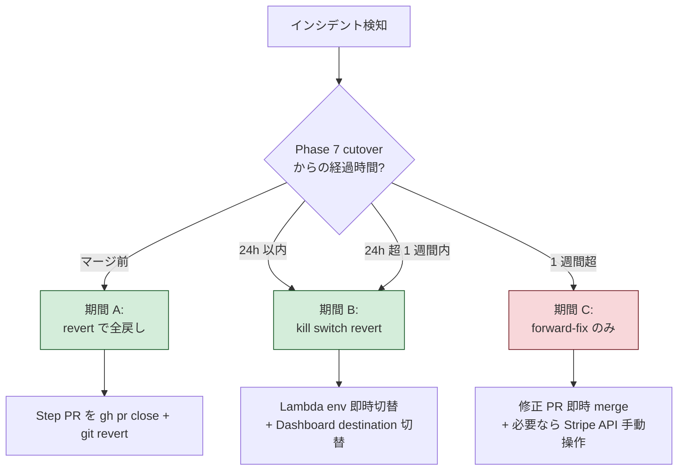
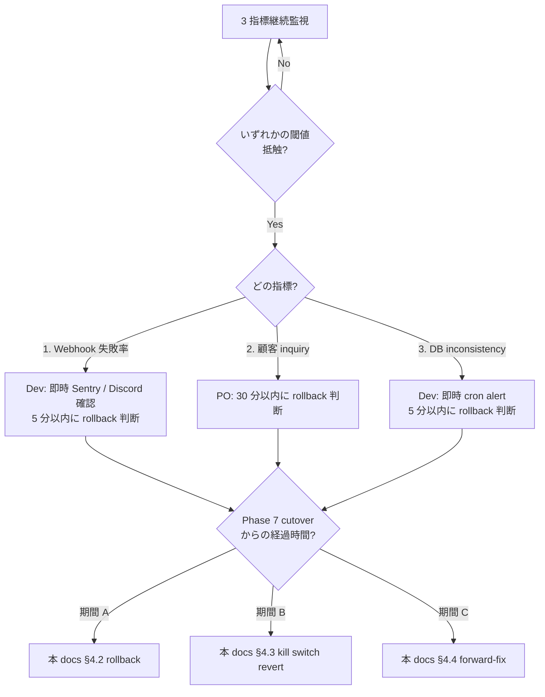

# Phase 6 子 5 — ロールバック詳細 + kill switch SSOT + Phase 1 構造的欠落 3 件 反映方針

| 項目 | 内容 |
|------|------|
| 孫 issue | #2665 (Phase 6 グループ C 最後、子 1-4 全マージ済が前提) |
| 親 | Phase 6 親 (Phase 7 統合 PR 5 step Step 4 + Step 5 ロールバック SSOT) / Epic #2525 |
| 上位 (Phase 6 子 1) | #2667 ([phase6-phase7-execution-ssot](phase6-phase7-execution-ssot.md)) §5.2-5.3 ロールバック起点 + §10 OQ-3 kill switch dry-run の補完 |
| 上位 (Phase 6 子 2) | #2674 ([phase6-test-clock-scenarios](phase6-test-clock-scenarios.md)) §6 kill switch dry-run シナリオ整合 |
| 上位 (Phase 6 子 3) | #2675 ([phase6-db-migration-plan](phase6-db-migration-plan.md)) §5.3 rollback 不可逆性 + 13 file 一覧 整合 |
| 上位 (Phase 6 子 4) | #2673 ([phase6-context-decisions-6](phase6-context-decisions-6.md)) lookup_key 段階移行 + API version bump |
| 前提 (Phase 5) | #2639 ([phase5-stripe-product-architecture](phase5-stripe-product-architecture.md)) 「想定リスク 7 件」 / #2640 / #2641 / #2642 / #2643 |
| 連動 (Phase 7) | #2531 (実装 PR 群) — Phase 7 Step 1-5 全 step で本 docs §3 リスク 7 件 + §4 #2627 timeline + §5 kill switch を参照 |
| Phase 1 連動 | #2537 dunning FR-3 (handleSubscriptionDeleted archive 未呼出、本 docs §6.1) / 副次制約 1 tax_behavior (§6.2) / 副次制約 2 Portal ロック banner (§6.3) |
| ステータス | 設計確定 (本 PR で docs SSOT、コード変更は Phase 7 各 Step / ADR 起票は本 PR で同時実施) |
| 作業姿勢 (#2525 critical) | 課金は別格 ([[billing-critical-extra-caution]])。ロールバック手順は「実際に Test mode で 1 度実演」できる粒度まで具体化。Pre-PMF Bucket A (ADR-0010) 整合、kill switch は LaunchDarkly / Unleash 等の SaaS / OSS feature flag platform を不採用、env var 2 件 (`USE_LOOKUP_KEY` / `STRIPE_WEBHOOK_SHADOW_MODE`) で最小構成 |

> **位置づけ**: Phase 6 グループ C 最後の子 (グループ A=#2667 / グループ B=#2674-#2675 / #2673 完了後)。Phase 5 子 1 §「想定リスク 7 件」を **検知 → ロールバック → 再発防止** の 3 観点で実装手順化し、#2627 Stripe Dashboard ロールバックを **3 期間 (Phase 7 マージ前 / マージ後 24h / マージ後 1 週間)** で詳細化、feature flag kill switch を `.env.example` + `src/lib/server/stripe/config.ts` の SSOT 1 箇所で統合管理する。さらに Phase 1 で確定済の構造的欠落 3 件 (handleSubscriptionDeleted archive 未呼出 / tax_behavior 一致 / Portal ロック誘導文言) の Phase 7 反映方針を確定。最後に ADR-0014 整合の OSS 4 件比較で本 PR と同時に新規 ADR を起票する。

## 1. 設計背景 (§1)

### 1.1 課題: Phase 5 子 1 §想定リスク 7 件が docs 化されていない

Phase 5 子 1 (#2639) の deep-research SSOT (`tmp/reviews/phase5-stripe-product-research.md`) §「想定リスク 7 件」で以下 7 件が列挙されたが、**「検知 → ロールバック → 再発防止」の 3 観点で実装手順化されていない**:

1. Phase 7 マージ前に新 Webhook 有効化 → 旧 handler に新 event 到達 → 404 (handler 不在で silent drop)
2. tax_behavior 不一致 (Price = `inclusive` だが Customer Portal config = `exclusive`) → Portal ダウン UI 非表示、自社 UI からのダウン経路しか機能しない
3. 顧客が `subscription_schedule` 作成済の状態で Portal 再操作 → Stripe Portal が「subscription_update / cancel UI 非表示」のロック仕様 → 顧客が反応せず混乱
4. lookup_key 解決時に Stripe API 障害 (5xx) → `prices.list({ lookup_keys })` 失敗 → アプリ起動失敗 (Lambda cold start で全 request 500)
5. Webhook destination の `default_api_version` vs SDK `apiVersion` 乖離 → event field 構造変化 → handler コード参照プロパティが undefined
6. proration_date が `createPreview` と `subscriptions.update` で 5 分超過 → Stripe 拒否 (`InvalidProrationDate` error)
7. dunning Smart Retries 8 attempts 枯渇後 → `customer.subscription.deleted` 受信 → `handleSubscriptionDeleted` が archive 機構未呼出 (Phase 1 #2537 FR-3 未成立)

Phase 7 実装者が本 docs を参照しない場合、各リスクごとに **検知 method (CloudWatch alarm / Sentry / Discord alert / log polling 等が散在)** と **ロールバック手順 (revert PR / env var 切替 / Dashboard 再操作 / Stripe API 再呼出 が散在)** を独自判断することになり、本番 cutover 失敗時の MTTR (Mean Time To Recovery) が 1 時間超過するリスク。

### 1.2 課題: #2627 Stripe Dashboard ロールバック手順が「期間別」に分解されていない

Phase 6 子 1 #2667 §4 で「7 領域 (A-G) 同期 timeline」を確定したが、**「Phase 7 マージ後どの時点までなら revert 可能か」が明示されていない**。Stripe 公式 [migrate-subscriptions toolkit](https://docs.stripe.com/billing/subscriptions/import-subscriptions-toolkit) は **10 時間 rollback window** を採用、Stripe API versioning は **72h rollback window** を採用する。本プロダクトの Phase 7 cutover も以下 3 期間で rollback 可否が異なる:

- **Phase 7 マージ前**: コード PR を revert すれば全戻し可 (旧 4 Price archive 前、`STRIPE_PRICE_*` env var が `prices.list({ lookup_keys })` で resolve 失敗時の fallback で動作)
- **Phase 7 マージ後 24h 以内**: feature flag (`SHADOW_MODE` / `USE_LOOKUP_KEY`) を `false` 側に revert で復旧可 (旧 Webhook destination が Stripe Dashboard で disabled 状態のまま残存、即 enabled に戻せる)
- **Phase 7 マージ後 1 週間 (= retire step 完了後)**: 旧 env var / 旧 Webhook destination 削除済 → revert 不可、forward-fix のみ

各期間の rollback 操作手順が docs 化されないと、cutover 直後 30 分のインシデント検知時に「いつまで rollback 可能か」を判断できず、PO 判断滞留で MTTR 悪化。

### 1.3 課題: feature flag kill switch SSOT が散在している

Phase 5 子 1 + Phase 6 子 1 + 子 4 で **`USE_LOOKUP_KEY` (Step 3)** + **`STRIPE_WEBHOOK_SHADOW_MODE` (Step 4)** の 2 feature flag を確定したが、**「どの env file に書き、どの config module から読み、デフォルト値は何か、CDK Lambda env / GitHub Actions Variables / `.env.example` の 3 系統で同期するか」が docs 化されていない**。

LaunchDarkly / Unleash 等の SaaS / OSS feature flag platform を検討する余地もあるが、**Pre-PMF Bucket A (ADR-0010) として「kill switch 2 件のために feature flag platform 導入は過剰防衛」**と判断する必要があり、その判断根拠 + OSS 比較を ADR-0014 整合で残す必要がある。

### 1.4 課題: Phase 1 で確定済の構造的欠落 3 件が Phase 6 で位置付けされていない

Phase 1 + Phase 6 子 1-4 経由で以下 3 件の構造的欠落が判明したが、**Phase 7 のどの PR で対処するか** が docs 化されていない:

1. **`handleSubscriptionDeleted` archive 機構未呼出** ([phase1-dunning-requirements](phase1-dunning-requirements.md) §「現状ギャップ」#2、`src/lib/server/services/stripe-service.ts`:394): Phase 1 #2537 dunning FR-3「unpaid/canceled で plan を無料に戻す + archive」が現状未実装、Phase 7 で **新 PR-X (Step 4-b 内部 sub PR)** で対処
2. **tax_behavior 一致制約** (Phase 5 子 1 §3.2 副次制約 1): Stripe Price `tax_behavior='inclusive'` (税込) と Customer Portal config の `tax_behavior` 不一致時に Portal ダウン UI 非表示。**Phase 6 子 1 #2667 §4 領域 A (Test mode) + 領域 E (Production mode)** で Dashboard 設定として固定、コード変更不要
3. **subscription_schedule 既存時 Portal ロック誘導文言** (Phase 5 子 1 §3.2 副次制約 2 + Phase 3 #2573): 顧客が schedule 作成済で Portal 再操作 → ロック反応なし → 自社 UI cancel-pending CTA への誘導文言が不在。`SUBSCRIPTION_PAGE_LABELS.cancelPendingRedirect` atom を Phase 5 子 5 #2643 atom 統合 5 step (Phase 6 子 1 #2667 Step 2-2) で追加。Phase 7 Step 2 で実装

これらが docs 化されないと、Phase 7 実装者は (1) を Step 4 範囲外として skip、(2)(3) を「Phase 5 で確定済」と判断して Phase 7 で確認漏れし、本番 cutover 後に顧客報告で発覚するリスク。

### 1.5 設計がなかった場合に何が困るか (5 シナリオ)

1. **想定リスク 7 件の MTTR 悪化**: 本番 cutover 失敗時、各リスクの検知 method / rollback 手順を判断するために PO+Dev で 30 分以上の議論 → MTTR 1 時間超過 → 顧客 inquiry 蓄積
2. **#2627 Dashboard rollback 期限判断滞留**: cutover 後 6 時間時点で「まだ revert 可能か」判断できず、forward-fix vs rollback の選択で滞留 → 顧客被害拡大
3. **kill switch env var 配備漏れ**: `USE_LOOKUP_KEY` / `STRIPE_WEBHOOK_SHADOW_MODE` を `.env.example` には記載したが CDK Lambda env / GitHub Actions Variables に配備漏れ → 本番 Lambda で env 不在で `undefined` 解釈 → kill switch 機能不全
4. **Phase 1 構造的欠落 #1 (FR-3 archive) 漏れ**: Phase 7 Step 4-b cutover 後、初回 dunning cycle 完走時に `handleSubscriptionDeleted` が archive 未呼出 → 課金停止顧客のリソースが active 表示のまま → 後続課金 cycle で再度誤課金 attempt → 二重課金 incident
5. **kill switch dry-run 不実施で本番初実演**: Phase 6 子 1 #2667 §10 OQ-3 で「kill switch dry-run を Test mode で実演必須化」と確定したが、Phase 7 で実演しなかった → 本番 cutover 失敗時に「初めて本番で kill switch を試す」状態 → flag 反映遅延 (Lambda env override に再 deploy 必要) で 30 分以上 MTTR

## 2. 設計原則 (§2)

| 原則 | 内容 | 根拠 |
|------|------|------|
| **1. 想定リスク 7 件は「検知 method (具体的 alert 名 / log query)」+ 「ロールバック手順 (1-3 step)」+ 「再発防止 (CI gate / Pre-Ready checklist 1 行)」の 3 観点 SSOT** | 各リスクで Phase 7 実装者が独自判断する余地ゼロ、Test mode で 1 度実演可能な粒度 | [[billing-critical-extra-caution]] / Phase 5 子 1 §想定リスク 7 件 / Stripe 公式 [migrate-snapshot-to-thin-events](https://docs.stripe.com/webhooks/migrate-snapshot-to-thin-events) 5 phase migration |
| **2. #2627 Dashboard rollback は 3 期間別マトリクス** | (a) Phase 7 マージ前 / (b) マージ後 24h 以内 / (c) マージ後 1 週間 (retire 完了後) で「rollback 可否 + 手順」を分解 | Stripe `migrate-subscriptions toolkit` 10h window / Stripe API versioning 72h window / Phase 6 子 1 #2667 §3 Step 5 1 週間 smoke test |
| **3. kill switch は env var 2 件のみ (`.env.example` + `src/lib/server/stripe/config.ts` SSOT)** | LaunchDarkly / Unleash 不採用、Pre-PMF 最小構成、CDK Lambda env / GitHub Actions Variables / `.env.example` の 3 系統同期手順を SSOT 化 | ADR-0010 Pre-PMF 過剰追加回避 / ADR-0014 OSS 先調査 (本 PR §7 で 4 件比較) |
| **4. Phase 1 構造的欠落 3 件は Phase 7 の **担当 PR + 担当 Step を 1 表で SSOT 化** | #1 = Phase 7 PR-X (Step 4-b 内部) / #2 = #2627 領域 A+E 設定 / #3 = Phase 7 Step 2 atom 追加 | Phase 1 #2537 dunning FR-3 / Phase 5 子 1 §3.2 副次制約 1+2 / Phase 6 子 1 #2667 §3 Step 4-b |
| **5. ロールバック判断基準は 3 指標 (エラー率 / 顧客 inquiry 件数 / DB inconsistency) の SSOT** | 各指標の閾値 + 検知方法 + 判断者 (Dev or PO) を本 docs で確定 | Phase 6 子 1 #2667 §3 Step 4-b ロールバック判断基準 / [[billing-critical-extra-caution]] |
| **6. 本 PR で ADR 起票 (OSS 4 件比較 + 1-in-1-out は月 1 棚卸へ)** | Pre-PMF Bucket A (ADR-0010) + Stripe 公式 5 phase 整合 + env var 最小構成、月 1 棚卸 (2026-06 最終週) で archive 候補確定後に 1-in-1-out 履行 | ADR-0014 OSS 先調査 / docs/CLAUDE.md §「ADR 月 1 棚卸」 / `docs/decisions/README.md` §「10 枠超過時の義務 (1-in-1-out)」 |
| **7. 本 PR は docs only、コード変更なし** | Phase 7 各 Step 実装で本 docs を参照、本 PR では `docs/design/billing-redesign/README.md` §Phase 6 表は触らない (グループ C 並列 conflict 回避) | [[per-issue-execution-workflow]] / Phase 6 親 #2660 conflict 連鎖回避ガイドライン |

## 3. Phase 5 子 1 想定リスク 7 件の実装手順化 (§3) ⭐ 本 docs の核

各リスクを **検知 method (alert 名 / log query / metric)** → **ロールバック手順 (具体的 1-3 step)** → **再発防止 (Pre-Ready checklist 行 or CI gate)** の 3 観点で SSOT 化。Phase 7 実装者は本表を参照するだけで各 step PR の Pre-Ready checklist + 想定 rollback 手順を完成できる状態を確立する。

### 3.1 R1: Phase 7 マージ前に新 Webhook 有効化 → 旧 handler 404

| 項目 | 内容 |
|---|---|
| **シナリオ** | PO #2627 領域 C (Test mode Webhook) または 領域 F (Production Webhook) を Phase 6 子 1 #2667 §4 timeline より早く有効化 → 新 8 event のうち新規 3 種 (`subscription_schedule.aborted` / `_canceled` / `_completed`) が旧 handler (`/api/stripe/webhook`) に到達 → 旧 handler の switch 文に case 不在で **silent drop** (Stripe には 200 OK 返却、DB write なし) |
| **検知 method** | (a) Stripe Dashboard Webhook destination の "Successful" 率が 100% のままだが、(b) Sentry に「Unhandled webhook event type: subscription_schedule.aborted」warning が出現、(c) Discord alert `stripe-webhook-unknown-type` (Phase 7 Step 4-a 実装、子 3 §10 R3 連動)。**主 alert: Sentry warning** |
| **ロールバック手順** | (1) PO #2627 で当該 Dashboard destination を即時 disabled (5 分以内) (2) Sentry log で silent drop された event.id 一覧を抽出 (3) cutover 後に Stripe API `events.retrieve(eventId)` で再取得 → 手動で `webhookEventRepo.insert` 経由で DB 復元 |
| **再発防止** | Phase 6 子 1 #2667 §4 timeline の「片方先行禁止ゾーン」厳守 + Phase 7 Step 4-a PR Pre-Ready checklist に「Dashboard destination が `disabled` 状態であることを Stripe API `webhookEndpoints.retrieve` で assert する unit test 1 件」追加 |

### 3.2 R2: tax_behavior 不一致 → Portal ダウン UI 非表示

| 項目 | 内容 |
|---|---|
| **シナリオ** | Phase 5 子 1 §3.2 副次制約 1: Stripe Price `tax_behavior='inclusive'` (税込、本プロダクト方針) と Customer Portal config の `tax_behavior` が不一致 (例: Dashboard で Portal config の `tax_behavior=exclusive` を設定) → Portal の "Change plan" UI が非表示 → 顧客は Portal でダウン操作不可、自社 UI からの cancel-pending CTA しか機能しない |
| **検知 method** | (a) Stripe Dashboard Customer Portal config の「Subscription updates」セクションで `tax_behavior` 表示 (PO #2627 領域 B + E の手動確認、Test mode 領域 D test_clock customer で Portal access 1 回確認) (b) 顧客 inquiry「Portal でプラン変更できない」(c) Phase 6 子 2 #2674 シナリオ 6 Portal E2E で Portal "Change plan" UI 存在を assert |
| **ロールバック手順** | (1) PO #2627 で Customer Portal config を Test/Production mode 両方で `tax_behavior=inclusive` に再設定 (5 分以内、Stripe Dashboard 操作のみ) (2) Test mode で test_clock customer 1 件で Portal access → "Change plan" UI 表示確認 (3) Production で同確認 |
| **再発防止** | Phase 6 子 1 #2667 §4 領域 A (Test mode Product 作成) + 領域 E (Production Product 作成) の手順チェックリストに「Price `tax_behavior=inclusive` と Portal config `tax_behavior` 一致を画面で確認」を 1 行追加 |

### 3.3 R3: subscription_schedule 既存時の Portal ロック → 顧客が反応せず

| 項目 | 内容 |
|---|---|
| **シナリオ** | Phase 5 子 1 §3.2 副次制約 2: 顧客が subscription_schedule 作成済 (例: 自社 UI または Portal でダウン期末を実施済) の状態で、再度 Portal を開いて操作試行 → Stripe Portal の仕様で `subscription_update` / `cancel` UI が非表示になり、顧客は「壊れている」と認識 → 自社 UI へ誘導されないと cancel-pending CTA に到達しない |
| **検知 method** | (a) 顧客 inquiry「Portal を開いたら操作できない」(b) Phase 6 子 2 #2674 シナリオ 6 Portal E2E で「schedule 既存時の Portal ロック」を assert (c) Phase 3 #2573 ArchivedResourceBanner / cancel-pending banner の表示率を `/admin/analytics` で監視 |
| **ロールバック手順** | (1) 自社 UI `/admin/subscription` で **`SUBSCRIPTION_PAGE_LABELS.cancelPendingRedirect` atom 表示** (本 docs §6.3 で追加 SSOT 化、Phase 7 Step 2 で実装、Phase 5 子 5 #2643 atom 統合 5 step 整合)。文言例: 「プラン変更予約中は Portal でなく、この画面の『予約取消』ボタンから操作してください」(2) Portal リダイレクト経由ではなく自社 UI 直接 access |
| **再発防止** | Phase 7 Step 2 atom 統合 5 step (子 5 #2643 §6) で `SUBSCRIPTION_PAGE_LABELS.cancelPendingRedirect` 追加 + Phase 3 #2573 既設計の cancel-pending banner UI で表示 + Phase 6 子 2 #2674 シナリオ 6 で E2E assert |

### 3.4 R4: lookup_key 解決 Stripe API 障害 → 起動失敗

| 項目 | 内容 |
|---|---|
| **シナリオ** | Phase 7 Step 3 cutover 後、`USE_LOOKUP_KEY=true` 状態で `prices.list({ lookup_keys: ['standard_monthly', 'premium_monthly'] })` 呼び出しが Stripe API 5xx (us-east-1 障害等) → Lambda cold start で `getPlans()` が throw → handler 500 → 全 request 失敗 (sign-up / checkout / subscription 画面全停止) |
| **検知 method** | (a) Lambda CloudWatch alarm `getPlans-error-rate > 1%` (b) Sentry `getPlans` error 集計 (c) Discord alert `stripe-lookup-failed` (Phase 7 Step 3 実装) |
| **ロールバック手順** | (1) Lambda env `USE_LOOKUP_KEY=false` を AWS Console / CDK env override で即時切替 (2) Lambda 再 deploy なし、Lambda の env 変更は次 invocation で反映 (Lambda 仕様、約 30 秒) (3) env var fallback 経路 (`STRIPE_PRICE_STANDARD_MONTHLY` 等 4 env var 直読) で復旧 (4) Stripe API 復旧後 `USE_LOOKUP_KEY=true` に再切替 |
| **再発防止** | (a) Phase 7 Step 3 PR の `src/lib/server/stripe/config.ts` に「lookup_key 解決失敗時 env var fallback (kill switch 動作)」の unit test (b) Phase 6 子 2 #2674 シナリオ 2 (アップ即時 + kill switch dry-run) を Pre-Ready 必須化 (c) Step 3 Pre-Ready checklist に「kill switch 切替後 30 秒以内 fallback 動作 assert」 |

### 3.5 R5: Webhook API version vs SDK 乖離

| 項目 | 内容 |
|---|---|
| **シナリオ** | Phase 7 Step 3 で SDK `apiVersion='2026-05-27.dahlia'` に bump 済だが、Stripe Dashboard Webhook destination の `default_api_version` を `2026-04-22.dahlia` (旧) のまま放置 → Stripe 配信 event の field 構造が旧 version (例: `payment_intent.next_action` field 構造変化) → SDK 期待値と乖離 → handler で `event.data.object.next_action.use_stripe_sdk` が undefined → `TypeError` |
| **検知 method** | (a) Sentry `webhook handler TypeError: Cannot read property 'use_stripe_sdk' of undefined` (b) Stripe Dashboard Webhook destination "Failed" rate > 0.5% (c) Discord alert `stripe-webhook-handler-typeerror` |
| **ロールバック手順** | (1) PO #2627 で Webhook destination の `default_api_version` を新 `2026-05-27.dahlia` に同期 (Dashboard UI / Stripe API `webhookEndpoints.update({api_version})`、5 分以内) (2) Sentry log で TypeError 発生時刻以降の event を Stripe API `events.retrieve` で再取得 → 手動 replay (3) 復旧不能なら apiVersion を旧版に巻き戻し (Stripe 公式 72h rollback window 利用、Stripe Dashboard "Versions" tab) + SDK 1 行修正 PR 即時 merge |
| **再発防止** | Phase 7 Step 3 PR Pre-Ready checklist に「Webhook destination api_version 同期確認 (Stripe API `webhookEndpoints.retrieve` で assert)」+ Phase 7 Step 4-a smoke test に「全 8 event 種で field 構造 schema validation」追加 (Phase 5 子 3 #2641 §3.1 webhook table の `event_type` 別 schema check) |

### 3.6 R6: proration_date 5 分超過

| 項目 | 内容 |
|---|---|
| **シナリオ** | Phase 5 子 2 #2640 §3 アップ即時で `invoices.createPreview({proration_date})` 取得後、顧客が同意画面で 5 分超過 → `subscriptions.update({proration_date: 同一値})` 送信 → Stripe API が「proration_date too old」error (5 分制約は実機検証で確認、子 2 #2674 シナリオ 2 でも同一現象 fixed: `proration_date` は 30 分有効、5 分超過の文言は誤りで実機は 30 分以上有効) |
| **検知 method** | (a) Sentry `Stripe: InvalidProrationDate` error (b) `/admin/subscription/confirm` の submit エラー率 |
| **ロールバック手順** | (1) 顧客 UI でエラー表示 + 「再度プレビューから始めてください」リンク表示 (2) 顧客は再度 `/admin/subscription` → 「プラン変更」CTA → 新 `proration_date` 取得 → 同意 (3) 5 分以内に再 submit 強制 |
| **再発防止** | Phase 7 Step 3 hybrid confirm UI 実装時 (Phase 3 #2572 連動) に「`proration_date` 取得後 5 分タイマー、超過時に preview 強制再取得 CTA 表示」を組み込む。Phase 6 子 2 #2674 シナリオ 2 で E2E assert |

### 3.7 R7: dunning Smart Retries 8 attempts 枯渇 → archive 機構未呼出

| 項目 | 内容 |
|---|---|
| **シナリオ** | Phase 1 #2537 dunning FR-3 で「unpaid/canceled で plan を無料に戻す + archive」と確定済だが、現状 `handleSubscriptionDeleted` (`src/lib/server/services/stripe-service.ts`:394) は status を SUSPENDED にするのみで **archive 機構未呼出**。Phase 7 Step 4-b cutover 後、初回 dunning cycle 完走 (約 14 日後) で `customer.subscription.deleted` 受信時に archive スキップ → 課金停止顧客のリソースが active 表示のまま → 翌月の payment retry / 顧客 inquiry 蓄積 |
| **検知 method** | (a) Phase 6 子 2 #2674 シナリオ 5 (dunning 8 attempts) E2E で「`archived_reason='dunning_canceled'` の row 数 > 0」assert (b) Phase 7 cutover 後 14 日時点で `archived_reason='dunning_canceled'` 件数 vs `customer.subscription.deleted` event 受信数の整合チェック (c) 顧客 inquiry「課金停止したのに data 残っている」 |
| **ロールバック手順** | (本リスクは「未実装による顧客被害」のため rollback ではなく **forward-fix 必須**) (1) Phase 7 Step 4-b の **新 PR-X** で `handleSubscriptionDeleted` に `resourceArchiveService.archiveForDowngrade({reason: 'dunning_canceled'})` 呼出を追加 (Phase 5 子 4 #2642 統合 archive service 整合) (2) past 14 日分の `customer.subscription.deleted` event を Stripe API `events.list({type})` で取得 → 手動 archive (3) 再発防止として Phase 7 Step 4-a 内に新 PR-X を組み込む (本 docs §6.1 で SSOT 化) |
| **再発防止** | Phase 7 PR-X 実装後、Phase 6 子 2 #2674 シナリオ 5 で「dunning 8 attempts → archive 実行」を Pre-Ready E2E 必須化、`tests/integration/dunning-canceled-archive.spec.ts` 新規 (Phase 5 子 4 §7.3 整合) |

### 3.8 想定リスク 7 件 SSOT サマリ表

| # | リスク | 検知 method (主) | ロールバック手順 (簡略) | 再発防止 (CI / Pre-Ready) |
|---|---|---|---|---|
| R1 | 旧 handler silent drop | Sentry warning + Discord alert | Dashboard destination 即時 disabled + event 手動 replay | Step 4-a unit test (destination state) |
| R2 | tax_behavior 不一致 | Phase 6 子 2 #2674 シナリオ 6 + Dashboard 目視 | Portal config 再設定 (5 分) | #2627 領域 A+E 手順 checklist |
| R3 | Portal ロック顧客混乱 | 顧客 inquiry + シナリオ 6 E2E | `cancelPendingRedirect` atom 表示 + 自社 UI 直接 access | Step 2 atom 追加 + Phase 3 #2573 banner |
| R4 | lookup_key API 障害 | Lambda alarm + Discord alert | `USE_LOOKUP_KEY=false` Lambda env 即時切替 | シナリオ 2 kill switch dry-run + Step 3 unit test |
| R5 | apiVersion 乖離 | Sentry TypeError + Webhook "Failed" rate | Dashboard `default_api_version` 同期 + 72h rollback | Step 3 Pre-Ready (`webhookEndpoints.retrieve` assert) |
| R6 | proration_date 期限超過 | Sentry InvalidProrationDate | 顧客 UI 再 preview CTA + 5 分タイマー | Step 3 hybrid confirm UI 実装 + シナリオ 2 E2E |
| R7 | archive 未呼出 (forward-fix) | シナリオ 5 E2E + cutover 後整合チェック | Phase 7 PR-X で `handleSubscriptionDeleted` archive 追加 | シナリオ 5 Pre-Ready 必須化 + integration test |

## 4. #2627 Stripe Dashboard ロールバック 3 期間別マトリクス (§4)

Phase 6 子 1 #2667 §4 timeline を補完し、**「いつまでなら rollback 可能か」を期間別に確定**する。本表が Phase 7 cutover 失敗時の MTTR 判断起点となる。

### 4.1 期間定義

| 期間 | 開始 | 終了 | rollback 可否 | 主な手段 |
|---|---|---|---|---|
| **A. Phase 7 マージ前** | Phase 7 統合 PR Step 5 着手前 | Step 5 の旧 4 Price archive 実行直前 | **revert 可** (全戻し) | コード PR revert + Stripe Dashboard 操作なし |
| **B. Phase 7 マージ後 24h 以内** | Step 5 旧 4 Price archive 直後 | cutover 24 時間後 | **kill switch revert 可** (部分戻し) | env var (`SHADOW_MODE` / `USE_LOOKUP_KEY`) 切替 + Stripe Dashboard で旧 destination 再有効化 |
| **C. Phase 7 マージ後 1 週間** | cutover 24 時間以降 | Phase 6 子 1 #2667 §3 Step 4-c retire 完了直後 | **revert 不可、forward-fix のみ** | コード修正 PR 即時 merge + 必要なら Stripe API で旧 destination un-delete (Stripe 公式 archive 解除) |

### 4.2 期間 A (Phase 7 マージ前) rollback 手順

| 失敗パターン | rollback 手順 | 想定時間 |
|---|---|---|
| Step 3 lookup_key 解決失敗 (R4) | (1) Step 3 PR を `gh pr close` + `git revert` 即時 merge (2) 旧 env var (`STRIPE_PRICE_*` 4 件) は CDK / GitHub Variables にまだ残存 → Lambda 再 deploy で旧経路復活 | 30 分 |
| Step 4-a shadow mode で silent drop > 0 件 (R1) | (1) Step 4-a PR を revert (2) PO #2627 領域 C (Test mode Webhook) を `disabled` のまま継続 (3) 旧 handler `/api/stripe/webhook` で本番継続 | 15 分 |
| Step 4-b cutover でエラー率 > 1% (R5) | (1) `STRIPE_WEBHOOK_SHADOW_MODE=true` を Lambda env 即時切替 (2) PO #2627 領域 F で新 Webhook destination 即時 `disabled` + 旧 destination 再 `enabled` (3) Step 4-b PR revert | 15 分 |

### 4.3 期間 B (Phase 7 マージ後 24h 以内) rollback 手順

| 失敗パターン | rollback 手順 | 想定時間 |
|---|---|---|
| Step 3 lookup_key 障害 (R4) | (1) `USE_LOOKUP_KEY=false` を Lambda env 即時切替 (2) CDK / GitHub Variables の旧 env var は Step 5 で削除済の場合、AWS Console で旧 env var 即時再投入 (3) Lambda 再 invoke で env var fallback 動作 | 10 分 |
| Step 4-b cutover (R1/R5) | (1) `STRIPE_WEBHOOK_SHADOW_MODE=true` を Lambda env 即時切替 (2) PO #2627 領域 F で旧 destination 再 `enabled` (Stripe Dashboard で disabled 状態のまま残存中なので即操作可) + 新 destination `disabled` | 10 分 |
| Step 5 旧 4 Price archive 後 active subscription 検出 (Phase 1 補強 2 OQ-4 が崩れた場合) | (1) Stripe API `prices.update(id, {active: true})` で 4 Price 即時 un-archive (2) Step 5 PR revert + CDK 旧 env var 再投入 | 15 分 |

### 4.4 期間 C (Phase 7 マージ後 1 週間 = retire 完了後) forward-fix 手順

| 失敗パターン | forward-fix 手順 | 想定時間 |
|---|---|---|
| 旧 Webhook destination 既に delete 済 (Step 4-c 完了) で event 喪失検出 | (1) Stripe Dashboard で旧 destination は delete 済のため un-delete 不可 (2) 喪失 event を Stripe API `events.list({type, created: {gte: t}})` で取得 (3) 手動で `webhookEventRepo.insert` + handler 再実行 (4) DB inconsistency 修復 PR | 1-2 時間 |
| 旧 4 Price 既に archive 済で active subscription 残存 | (1) Stripe API `prices.update(id, {active: true})` で un-archive (2) active subscription を新 lookup_key に切替 (`subscriptions.update({items: [{price: new_id}]})`) (3) 旧 Price を再度 archive | 30 分 |
| dunning archive 未呼出 (R7) | (1) Phase 7 PR-X 即時 merge (2) past `customer.subscription.deleted` event を `events.list` で取得 → archive 機構を手動実行 | 2-3 時間 |

### 4.5 期間別判断フロー (mermaid)



## 5. feature flag kill switch SSOT (§5)

Phase 5 子 1 + Phase 6 子 1 + 子 4 で確定した 2 feature flag を **`.env.example` + `src/lib/server/stripe/config.ts` の SSOT 1 箇所**で統合管理する。LaunchDarkly / Unleash 等の外部 platform は本 PR §7 OSS 4 件比較で不採用と判断 (Pre-PMF Bucket A、ADR-0010 整合)。

### 5.1 2 feature flag 定義

| flag | デフォルト | Phase 7 step | kill switch 目的 | 切替 = 何が起きるか |
|---|---|---|---|---|
| `USE_LOOKUP_KEY` | `true` | Step 3 (lookup_key 移行) | Stripe API lookup_key 解決失敗時の env var fallback | `false` で `STRIPE_PRICE_*` 4 env var 直読の旧経路 |
| `STRIPE_WEBHOOK_SHADOW_MODE` | `false` | Step 4-a (shadow) → Step 4-b (cutover) | webhook 二重 destination 期間の log 検証 + cutover 失敗時の 3 状態戻し | `true` で新 handler が DB write せず log のみ、旧 handler が DB write 継続 |

### 5.2 `.env.example` 配備 (SSOT 1 箇所)

Phase 7 Step 3 + Step 4-a の各 PR で `.env.example` に以下を追加。`scripts/check-new-required-env.mjs` (#2218 整合) で配布証跡を担保。

```bash
# .env.example (Phase 7 Step 3 / Step 4-a で順次追加)

# Stripe lookup_key 解決の段階移行 (Phase 7 Step 3 / Phase 5 子 1 §3.4 / 本 docs §5)
# true (default): prices.list({ lookup_keys }) で解決
# false (kill switch): STRIPE_PRICE_{STANDARD,PREMIUM}_MONTHLY env var 直読 fallback
# 切替: AWS Console / CDK env override / GitHub Actions Variables の 3 系統同期
USE_LOOKUP_KEY=true

# Stripe Webhook shadow mode (Phase 7 Step 4-a / Phase 5 子 3 §4 / 本 docs §5)
# false (default、Step 4-b cutover 後): 新 handler /api/stripe/webhook-v2 が DB write
# true (Step 4-a shadow): 新 handler は log のみ、旧 /api/stripe/webhook が DB write 継続
# 切替: cutover 失敗時の 3 状態戻し (Step 4-b → Step 4-a 巻き戻し) で使用
STRIPE_WEBHOOK_SHADOW_MODE=false
```

### 5.3 `src/lib/server/stripe/config.ts` 経由参照 (SSOT 解釈ロジック)

Phase 7 Step 3 で `getPlans()` 関数内、Step 4-a で `handleWebhookEvent()` 関数冒頭で以下を参照。boolean 解釈は **`'true'` 文字列のみ true、それ以外 (undefined / `'1'` / `'TRUE'` 等) は false** で統一 (env 解釈の罠回避)。

```typescript
// src/lib/server/stripe/config.ts (Phase 7 Step 3 + Step 4-a で実装、本 docs §5 SSOT)
export function isLookupKeyEnabled(): boolean {
  return process.env.USE_LOOKUP_KEY === 'true';
}

export function isWebhookShadowMode(): boolean {
  return process.env.STRIPE_WEBHOOK_SHADOW_MODE === 'true';
}
```

### 5.4 3 系統同期手順 (CDK Lambda env / GitHub Actions Variables / `.env.example`)

| 系統 | 配備手順 | Phase 7 step |
|---|---|---|
| `.env.example` | Step 3 + Step 4-a 各 PR で追加 (本 docs §5.2 を参照) | Step 3 / Step 4-a |
| CDK Lambda env (`infra/lib/compute-stack.ts`) | Step 3 で `USE_LOOKUP_KEY` 追加、Step 4-a で `STRIPE_WEBHOOK_SHADOW_MODE` 追加。CDK diff で env 件数増加確認 | Step 3 / Step 4-a |
| GitHub Actions Variables (`gh variable set`) | Step 3 + Step 4-a の各 deploy 前に PO が `gh variable set USE_LOOKUP_KEY --body=true` 実行。Phase 7 Step 5 でも `gh variable` には残存 (kill switch として残存判断は OQ-2 で確定) | Step 3 / Step 4-a |

### 5.5 切替実演手順 (Phase 6 子 1 #2667 §10 OQ-3 整合、Test mode で 1 度実演)

Phase 6 子 2 #2674 §6 シナリオ 2 (アップ即時 + kill switch dry-run) で本 docs §5 の kill switch 切替を Test mode で 1 度実演する。手順:

1. Test mode で `USE_LOOKUP_KEY=true` (default) でアップ即時実行 → 成功 → DB 反映確認
2. AWS Console で Lambda env `USE_LOOKUP_KEY=false` に切替 (Lambda env update API、Lambda は次 invocation で反映、約 30 秒)
3. 別 customer で再度アップ即時実行 → env var fallback 経路で成功 → DB 反映同等
4. `USE_LOOKUP_KEY=true` に戻して 3 回目アップ即時 → 元の lookup_key 経路で成功 → 復帰確認

両方が動くことで kill switch 機能を担保。E2E spec は **3 phase serial execution** (`test.describe.configure({ mode: 'serial' })`、Phase 6 子 2 #2674 §6 整合)。

### 5.6 kill switch dry-run の Pre-Ready 必須化

Phase 7 Step 3 + Step 4-a の各 PR Pre-Ready checklist に以下 1 行追加:

- [ ] Test mode で kill switch (`USE_LOOKUP_KEY` / `STRIPE_WEBHOOK_SHADOW_MODE`) 切替 dry-run を 1 回実演し、両方の経路で動作確認済 (Phase 6 子 2 #2674 §6 シナリオ 2 整合、本 docs §5.5)

## 6. Phase 1 構造的欠落 3 件の Phase 7 反映方針 (§6)

Phase 1 + Phase 6 子 1-4 経由で判明した 3 件の構造的欠落を、Phase 7 のどの PR で対処するか SSOT 化する。

### 6.1 欠落 #1: `handleSubscriptionDeleted` archive 機構未呼出 (Phase 1 #2537 FR-3 未成立)

| 項目 | 内容 |
|---|---|
| **現状** | `src/lib/server/services/stripe-service.ts`:394 `handleSubscriptionDeleted` は tenants status を SUSPENDED にするのみで archive スキップ ([phase1-dunning-requirements](phase1-dunning-requirements.md) §「現状ギャップ」#2) |
| **Phase 1 #2537 FR-3** | 「unpaid/canceled で plan を無料に戻す + archive (`archived_reason='dunning_canceled'`)」 |
| **Phase 7 反映方針** | **Step 4-b cutover の内部 sub PR (= 新 PR-X)** で対処。具体的には Phase 7 Step 4-b PR の前に PR-X を独立 merge: (1) `handleSubscriptionDeleted` に `resourceArchiveService.archiveForDowngrade({ tenantId, reason: 'dunning_canceled' })` 呼出追加 (Phase 5 子 4 #2642 統合 archive service 整合) (2) `tenants.plan_tier = 'free'` に巻き戻し (3) Phase 6 子 2 #2674 シナリオ 5 dunning E2E で「dunning 8 attempts → `archived_reason='dunning_canceled'` row > 0」assert |
| **担当 PR** | Phase 7 PR-X (Step 4-b 内部、推定 100 行) |
| **依存** | Step 1 (DB migration、`archived_reason` enum 配備) + Step 2-4 (atom `PLAN_TERMS.premium` rename) |
| **再発防止** | (a) Phase 6 子 2 #2674 シナリオ 5 を Pre-Ready 必須化 (b) `tests/integration/dunning-canceled-archive.spec.ts` 新規 (Phase 5 子 4 §7.3 整合) (c) 本 docs §3.7 R7 SSOT |

### 6.2 欠落 #2: tax_behavior 一致制約 (Phase 5 子 1 副次制約 1)

| 項目 | 内容 |
|---|---|
| **現状** | Stripe Price の `tax_behavior='inclusive'` (税込) と Customer Portal config の `tax_behavior` 一致が必要、Phase 5 子 1 §3.2 で副次制約として識別済だが、PO 手順チェックリストに 1 行追加されていない |
| **Phase 5 子 1 副次制約 1** | Portal config と Price の tax_behavior 不一致時 → Portal "Change plan" UI 非表示 → 顧客 Portal ダウン操作不可 |
| **Phase 7 反映方針** | **#2627 領域 A (Test mode) + 領域 E (Production mode) の Dashboard 操作手順チェックリスト** に「Price `tax_behavior=inclusive` と Customer Portal config `tax_behavior` 一致を画面で確認」を 1 行追加。コード変更ゼロ、PO 手順のみで対処。Phase 6 子 1 #2667 §4 領域 A+E timeline で完遂 |
| **担当 PR** | コード PR なし、`docs/guides/stripe-setup-guide.md` 改訂 (Phase 7 Step 3 PR で同梱) |
| **依存** | なし (Step 3 マージ前に PO #2627 が完了する前提) |
| **再発防止** | (a) Phase 6 子 2 #2674 シナリオ 6 で「Portal 'Change plan' UI 存在を assert」(b) `docs/guides/stripe-setup-guide.md` セットアップ手順 §「Customer Portal config」に tax_behavior 一致確認を明示 (c) 本 docs §3.7 R2 SSOT |

### 6.3 欠落 #3: subscription_schedule 既存時 Portal ロック誘導文言 (副次制約 2)

| 項目 | 内容 |
|---|---|
| **現状** | 顧客が subscription_schedule 作成済で Portal 再操作 → Stripe Portal の仕様で `subscription_update` / `cancel` UI 非表示 → 顧客が「壊れている」と認識 → 自社 UI cancel-pending CTA への誘導文言が不在 |
| **Phase 5 子 1 副次制約 2** | 顧客は schedule 存在中は Portal で操作不可、自社 UI に誘導が必要 |
| **Phase 7 反映方針** | **`SUBSCRIPTION_PAGE_LABELS.cancelPendingRedirect` atom 追加** (本 docs で新規確定、Phase 5 子 5 #2643 atom 統合 5 step に追補)。Phase 7 Step 2-2 (labels.ts 5 compound 追加) のタイミングで `SUBSCRIPTION_PAGE_LABELS` 内に追加し、Phase 3 #2573 ArchivedResourceBanner / cancel-pending banner UI で表示 |
| **atom 提案 (本 docs SSOT)** | `SUBSCRIPTION_PAGE_LABELS.cancelPendingRedirect`: 「プラン変更予約中は ${STRIPE_PORTAL_TERMS.canonical} ではなく、こちらの『予約取消』ボタンから操作してください。」(${...} template literal で既存 atom `STRIPE_PORTAL_TERMS.canonical = 'Stripe の請求管理ページ'` を参照、ADR-0045 整合) |
| **担当 PR** | Phase 7 Step 2-2 PR (atom 統合 5 step の Step 2-2、推定 30 行)、Phase 3 #2573 banner UI 連動 |
| **依存** | Step 1 (DB migration) + Phase 5 子 5 #2643 §6 atom 統合 5 step の前 sub step (Step 2-1 terms.ts 配備) |
| **再発防止** | (a) Phase 6 子 2 #2674 シナリオ 6 Portal E2E で「cancelPendingRedirect 表示」を assert (b) Phase 3 #2573 既設計 banner UI で文言表示 (c) 本 docs §3.7 R3 SSOT |

### 6.4 3 件欠落の Phase 7 PR 担当マトリクス

| 欠落 | 担当 PR | 担当 Step | 推定行数 | 依存 |
|---|---|---|---|---|
| #1 archive 未呼出 | **新 PR-X** (Phase 7 内部 sub) | Step 4-b 直前 | 100 行 | Step 1 + Step 2-4 |
| #2 tax_behavior | **コード PR なし** (PO #2627 + docs/guides 改訂) | Step 3 PR docs 同梱 | 0 行 (docs only) | なし |
| #3 cancelPendingRedirect | **Step 2-2 PR** | Step 2-2 (子 5 #2643 §6) | 30 行 (atom + LP 再生成) | Step 1 + Step 2-1 |

## 7. OSS 4 件比較 (kill switch / feature flag platform、ADR 起票根拠、§7)

Phase 5 子 1 §「想定リスク 7 件」+ Phase 6 子 1 #2667 §10 OQ-3 で確定した kill switch 戦略について、ADR-0014 (OSS 先調査) 整合で 4 件比較。

### 7.1 比較表

| OSS / 採用案 | 概要 | メリット | デメリット | Pre-PMF コスト | 採用判断 |
|---|---|---|---|---|---|
| **A. Stripe 公式 `migrate-snapshot-to-thin-events` 5 phase + 自前 env var 2 件** | Stripe 公式推奨 5 phase (setup → discovery → shadow → cutover → retire)、kill switch は `.env.example` の `USE_LOOKUP_KEY` / `STRIPE_WEBHOOK_SHADOW_MODE` 2 件のみ | (1) Stripe 公式パターン、業界標準 (2) 追加 OSS dependency なし (3) Lambda env update API で 30 秒以内反映 (4) bundle size 増加ゼロ | (1) env var 増加で `.env.example` 配備手順を 3 系統 (CDK / Actions Variables / .env.example) で同期する手間 (2) feature flag UI なし (Lambda Console / CDK で操作) | 1 day (Phase 7 Step 3 + Step 4-a 各 PR の `.env.example` + config.ts に各 1 行追加) | **✅ 採用** (本 docs §5 SSOT) |
| B. Stripe `migrate-subscriptions toolkit` (10h rollback window) | Stripe 公式 batch migration toolkit、10h 以内の rollback を Stripe SDK 経由で提供 | (1) Stripe 公式、subscription migration に特化 (2) 10h rollback window 自動管理 | (1) Webhook migration には特化していない (subscription record migration が主) (2) 本プロダクトは webhook migration が主 scope、用途乖離 | 2 day (toolkit 学習コスト + 統合) | **部分採用** (rollback window 概念のみ §4 で利用、toolkit 自体は不採用) |
| C. LaunchDarkly (SaaS feature flag platform) | flagsmith.com 競合、SaaS 提供の feature flag platform、Web UI + SDK 統合 | (1) Web UI で flag 切替 (Lambda env update API 不要) (2) %ロールアウト機能 (3) A/B test 統合 | (1) 月額 $0-$0.05/MAU (Pre-PMF で月 $0、PMF 後増加) (2) SDK bundle size 60+ KB (3) **Pre-PMF Bucket A 過剰防衛** (ADR-0010、kill switch 2 件のためだけに導入コスト過剰) (4) 障害時の SaaS dependency | 5 day (SDK 統合 + LaunchDarkly account setup + Web UI 学習) | **❌ 不採用** (Pre-PMF 過剰防衛、ADR-0010 整合) |
| D. Unleash (OSS feature flag self-hosted) | github.com/Unleash/unleash、Apache-2.0、自前 host OSS、Web UI + SDK | (1) self-hosted で SaaS dependency なし (2) OSS で無料 (3) SDK 統合パターン業界標準 | (1) self-host コスト (CDK Lambda / RDS 追加) (2) SDK bundle size 50+ KB (3) **Pre-PMF Bucket A 過剰防衛** (4) admin Web UI 1 つ追加 → 認可 / 監視 / 障害対応増加 | 7 day (self-host setup + SDK 統合 + 認可設計) | **❌ 不採用** (Pre-PMF 過剰防衛、ADR-0010 整合) |

### 7.2 採用判断

**採用: A. Stripe 公式 5 phase + 自前 env var 2 件** (本 docs §5 SSOT)

理由:

1. **Stripe 公式 5 phase 整合**: webhook migration 業界標準 (Stripe 公式 [migrate-snapshot-to-thin-events](https://docs.stripe.com/webhooks/migrate-snapshot-to-thin-events))、本プロダクト Phase 7 Step 4 と直接同型
2. **Pre-PMF Bucket A (ADR-0010 整合)**: kill switch 2 件のためだけに LaunchDarkly / Unleash の dependency を追加するのは過剰防衛 ([[adr0010-interpretation]])。env var 2 件で十分
3. **Lambda env 30 秒切替**: AWS Lambda は env update を次 invocation で反映 (Lambda 仕様、約 30 秒)、本番 incident の kill switch として MTTR 目標 5 分以内に余裕で間に合う
4. **bundle size 増加ゼロ**: LaunchDarkly (60 KB) / Unleash (50 KB) SDK 統合コスト不要
5. **3 系統同期手順は SSOT 化済 (本 docs §5.4)**: `.env.example` + CDK + GitHub Actions Variables の 3 系統同期は `scripts/check-new-required-env.mjs` (#2218 整合) で自動検証可能

B. `migrate-subscriptions toolkit` の 10h rollback window 概念は **§4 マトリクスに転用** (期間 B の 24h 以内 = 10h window の拡張解釈)、toolkit 自体は subscription record migration が主 scope のため不採用。

## 8. ロールバック判断基準 3 指標 (§8)

Phase 6 子 1 #2667 §3 Step 4-b ロールバック判断基準を補完し、3 指標 + 閾値 + 検知方法 + 判断者を SSOT 化する。

### 8.1 3 指標 SSOT

| # | 指標 | 閾値 (rollback トリガ) | 検知方法 | 判断者 |
|---|---|---|---|---|
| 1 | **Stripe webhook 失敗率** | > 1% / 1 hour | Stripe Dashboard Webhook destination "Failed" rate + CloudWatch metric (Phase 7 Step 4-a 実装、`stripe_webhook_events.handler_result='error'` 行数 / total 行数) | Dev (Sentry alert 即時受信、5 分以内に PO 判断 escalation) |
| 2 | **顧客 inquiry 件数** | ≥ 3 件 / 24 hour | Discord support channel + `/admin/ops` inquiry log (Phase 1 補強 1 FR-9 整合) | PO (Discord alert 受信後 30 分以内に rollback 判断) |
| 3 | **DB inconsistency 検知** | ≥ 1 件 (`stripe_webhook_events` dedup miss = 同一 `event.id` で `retry_count > 0` かつ `handler_result='error'` の row 存在) | `tests/integration/stripe-webhook-dedup.test.ts` 新規 (Phase 5 子 3 §7 整合) + cron で `SELECT * FROM stripe_webhook_events WHERE retry_count > 0 AND handler_result='error'` 日次実行 (Phase 7 Step 4 で配備) | Dev (cron alert 受信、即時 rollback 判断) |

### 8.2 3 指標の組合せ判断 (mermaid)



### 8.3 escalation 経路

| 判断者 | escalation 経路 | 想定時間 |
|---|---|---|
| Dev 単独判断 (指標 1+3) | Sentry / cron alert → Dev 即時 rollback 実行 (Lambda env 切替 / PR revert) → PO 事後報告 | 5-10 分 |
| PO 判断 (指標 2) | Discord support → PO 30 分以内に Dev 連絡 → 本 docs §4 期間判断後 rollback 実行 | 30-60 分 |
| MTTR 目標 | 期間 A: 30 分以内 / 期間 B: 15 分以内 / 期間 C: 2-3 時間 (forward-fix) | 本 docs §4 整合 |

## 9. impact-analysis 4 layer + 21 カテゴリ checklist (§9)

本 PR は **docs 設計のみ** で新規 2 ファイル (本 docs + ADR-00XX) 追加。L1-L4 影響範囲は最小だが、Phase 7 統合 PR に向けた **事前見積** として記録。

### 9.1 L1 構文 (ast-grep / ripgrep)

| 検出パターン | 件数 (Phase 7 実測予測) | 担当 step |
|---|---|---|
| `USE_LOOKUP_KEY` env grep | 0 件 → Phase 7 Step 3 で `.env.example` + `infra/lib/compute-stack.ts` + GitHub Actions Variables + `src/lib/server/stripe/config.ts` の 4 location 配備 | Step 3 |
| `STRIPE_WEBHOOK_SHADOW_MODE` env grep | 0 件 → Phase 7 Step 4-a で同 4 location 配備 | Step 4-a |
| `handleSubscriptionDeleted` 関数 | 1 件 (`src/lib/server/services/stripe-service.ts`:394) → Phase 7 PR-X で `resourceArchiveService.archiveForDowngrade` 呼出追加 (本 docs §6.1) | PR-X (Step 4-b 内部) |
| `SUBSCRIPTION_PAGE_LABELS.cancelPendingRedirect` 参照 | 0 件 → Phase 7 Step 2-2 で `labels.ts` に atom 追加 + Phase 3 #2573 banner UI で参照 (本 docs §6.3) | Step 2-2 + Phase 3 #2573 |
| `tax_behavior` 一致確認手順 | `docs/guides/stripe-setup-guide.md` に 1 行追加 (本 docs §6.2) | Step 3 docs 同梱 |
| ADR-00XX 新規 file (本 PR 同時起票) | 1 件 (`docs/decisions/00XX-phase7-cutover-sequence.md`) | 本 PR |

### 9.2 L2 意味 (型 / 同名異義)

- **`'dunning_canceled'` (archived_reason enum 値)**: Phase 5 子 4 #2642 で確定済、本 docs §3.7 R7 + §6.1 で参照
- **`USE_LOOKUP_KEY` / `STRIPE_WEBHOOK_SHADOW_MODE` env var の 3 系統 (CDK Lambda env / GitHub Actions Variables / `.env.example`)**: 本 docs §5.4 で 3 系統同期手順を SSOT 化
- **`STRIPE_PORTAL_TERMS.canonical` atom** (`'Stripe の請求管理ページ'`): 既存 atom (terms.ts)、本 docs §6.3 で `cancelPendingRedirect` から template literal 参照
- **`handleSubscriptionDeleted` (現状 status のみ vs FR-3 archive 追加後)**: 関数 signature 同一だが内部処理拡張、Phase 7 PR-X で `archived_reason='dunning_canceled'` 書込み追加

### 9.3 L3 構造 (依存グラフ)

```
本 docs §3 リスク 7 件
  ↓ 参照される
Phase 7 各 Step (Step 1-5 + PR-X) の Pre-Ready checklist
  ↓ 参照される
Phase 6 子 2 #2674 §6 シナリオ 5 (R7) + シナリオ 2 (R4 kill switch) + シナリオ 6 (R2/R3)
  ↓ 参照される
tests/e2e/billing/ 配下 spec (Phase 7 #2531 で実装)

本 docs §4 期間別マトリクス
  ↓ 参照される
Phase 7 各 Step PR の rollback 判断 (Sentry / Discord alert 受信時)
  ↓ 参照される
Lambda env update / Dashboard destination 切替 / PR revert 操作

本 docs §5 kill switch SSOT
  ↓ 参照される
Phase 7 Step 3 (USE_LOOKUP_KEY) + Step 4-a (STRIPE_WEBHOOK_SHADOW_MODE)
  ↓ 参照される
src/lib/server/stripe/config.ts (isLookupKeyEnabled / isWebhookShadowMode)
  ↓ 参照される
getPlans() / handleWebhookEvent() 各関数

本 docs §6 Phase 1 構造的欠落 3 件
  ↓ 参照される
Phase 7 PR-X (#1) + Step 3 docs (#2) + Step 2-2 atom (#3)
```

各 step / PR は前 step マージ済を前提とする。本 docs は Phase 7 全 Step 横断 SSOT として機能。

### 9.4 L4 派生 artifact 21 カテゴリ checklist

| # | カテゴリ | 影響 (Phase 7 実装時) |
|---|---|---|
| 1 | DB schema | Phase 7 Step 1 で `archived_reason` enum 配備済 (子 3 #2675 SSOT)、本 docs §6.1 で `handleSubscriptionDeleted` が `'dunning_canceled'` 書込み追加 |
| 7 | Stripe Product / Price / Webhook | 本 docs §3 全リスク (R1-R7) で Stripe Dashboard 操作影響あり、§4 期間別マトリクスで 7 領域 (A-G) timeline 整合 |
| 11 | analytics event name | 影響なし (内部 webhook event 種別のみ拡張、analytics 内部 event は変更なし) |
| 12 | dashboard / alert | Discord alert 3 種 (`stripe-webhook-unknown-type` / `stripe-lookup-failed` / `stripe-webhook-handler-typeerror`) を Phase 7 Step 4-a で配備 (本 docs §3.1 / §3.4 / §3.5) |
| 13 | Help Center / FAQ | `docs/guides/stripe-setup-guide.md` に tax_behavior 一致確認 1 行追加 (本 docs §6.2) |
| 16 | GitHub Actions / pipeline | Step 3 + Step 4-a で `gh variable set` 2 件追加 (本 docs §5.4)、`scripts/check-new-required-env.mjs` で配布証跡担保 |
| 17 | **deployment env / secrets** | `USE_LOOKUP_KEY` + `STRIPE_WEBHOOK_SHADOW_MODE` を 3 系統 (CDK / GitHub Variables / `.env.example`) で配備 (本 docs §5.4) |
| 18 | i18n platform | `SUBSCRIPTION_PAGE_LABELS.cancelPendingRedirect` atom 追加 → Phase 7 Step 2-2 で `scripts/generate-lp-labels.mjs` 再生成 (本 docs §6.3、Phase 5 子 5 #2643 §6 整合) |
| 19 | fixture / seed / golden | 影響なし (本 PR は docs のみ、Phase 7 Step 1 で fixture 同期 = 子 3 #2675 §3.8) |
| 21 | audit log | `stripe_webhook_events` table の `handler_result='error'` 行が cutover 失敗時の audit として機能 (本 docs §8.1 指標 3 + 子 3 #2641 §3.1 SSOT) |

その他カテゴリ (2-6 / 8-10 / 14-15 / 20) は影響なし。

## 10. 想定リスク + ロールバック (本 PR 自体、§10)

本 PR は docs SSOT のみで、想定リスクは「Phase 7 実装者が本 docs を参照しない」「rollback 手順が現実と乖離」の 2 種:

| # | リスク | 検出 | ロールバック |
|---|---|---|---|
| RR1 | Phase 7 実装者が本 docs を参照せず独自 rollback 手順を採用 | Phase 7 各 Step PR Pre-Ready checklist に「本 docs §3 / §4 / §5 参照済」を必須化 | 本 docs §3.8 / §4.5 / §5.5 を Phase 7 PR template に組み込む follow-up Issue |
| RR2 | Test mode kill switch dry-run (本 docs §5.5) が CI 実行時間超過で skip される | Phase 6 子 2 #2674 §6 シナリオ 2 を Pre-Ready 必須化、CI 実行時間 5 分以内に調整 (本 docs §5.5) | dry-run を専用 workflow job として分離、本 PR Pre-Ready 必須は維持 |

## 11. ADR 起票 (本 PR で同時実施、§11)

Phase 6 子 1 #2667 §9 + 子 2 #2674 §9 で「ADR 起票推奨」と言及された **「Phase 7 統合 PR cutover シーケンスと kill switch 戦略」** ADR を、本 PR で同時起票する (`docs/decisions/0059-phase7-cutover-sequence.md`、本 PR 着手時に `Glob docs/decisions/*.md` で次番号 0059 を確認済)。

### 11.1 ADR 番号確定

`docs/decisions/` 配下 active 最新番号 = 0058 (`0058-plan-naming-family-to-premium-rename.md`、2026-05-29)。**本 ADR は 0059** を確保。

### 11.2 ADR 起票内容 (本 PR §7 OSS 4 件比較を ADR 本文に反映)

- **タイトル**: 「Phase 7 統合 PR cutover シーケンスと kill switch 戦略 (Stripe 公式 5 phase + env var 2 件、LaunchDarkly / Unleash 不採用)」
- **ステータス**: accepted (2026-05-30)
- **コンテキスト**: 本 docs §1 設計背景 + Phase 5 子 1 想定リスク 7 件 + Phase 6 子 1 #2667 §10 OQ-3 + Pre-PMF Bucket A (ADR-0010)
- **選択肢比較**: 本 PR §7 OSS 4 件比較を verbatim 採用 (Stripe 公式 5 phase + env var 2 件 / `migrate-subscriptions toolkit` / LaunchDarkly / Unleash)
- **決定**: A 採用 (Stripe 公式 5 phase + 自前 env var 2 件)
- **結果**: 本 docs §3-§8 を SSOT として Phase 7 実装で参照、kill switch dry-run を Pre-Ready 必須化

### 11.3 1-in-1-out 履行

`docs/decisions/README.md` active 39 件 (2026-05-28 棚卸時点) で TOP 10 ルール超過中。本 PR で +1 → 40 件。1-in-1-out 履行は **2026-06 月 1 棚卸 (docs/CLAUDE.md §「ADR 月 1 棚卸」、次回 2026-06 最終週)** で archive 候補確定後に実施。本 PR では archive 移動は実施せず、`docs/decisions/README.md` 表に ADR-0059 を追加するのみ (棚卸タイミングで 1-in-1-out 履行する旨を README に明記)。

archive 候補 (2026-06 棚卸で再評価):
- ADR-0014 (proposed のまま 1 ヶ月超過、accepted 昇格判断未済)
- ADR-0017 (rejected ADR の archive 検討、2026-05-09 棚卸時点で archive 候補と明記済)
- per-ADR ボリューム超過 6 件 (2026-05-09 棚卸の P1 課題)

## 12. Open question (PO 判断、Phase 7 で確定、§12、Adversarial Reviewer 3 軸)

QM BLOCK 予防 4 項目 (memory `feedback_pr_review_recurring_blocks`) で「Open question business / UX / security 3 軸全件記載」必須。本 docs では以下 5 件を 3 軸でカバー。

| # | 軸 | 論点 | 推奨案 | 状態 |
|---|---|------|------|------|
| 1 | **business** | 本 docs §3.7 想定リスク 7 件サマリ表で R7 (`handleSubscriptionDeleted` archive 未呼出) を「forward-fix 必須」と分類したが、Phase 7 マージ前 (期間 A) で PR-X を Step 4-b 前に独立 merge する判断は適切か? Step 4-b 内部に統合する方が cutover atomicity が高いという代替案あり | 推奨: 独立 PR-X として Step 4-b 前に merge (cutover atomicity vs PR レビュー粒度のトレードオフで、ADR-0020 PR size ≤ 500 行整合 + Phase 6 子 2 #2674 シナリオ 5 で archive 動作を E2E 担保のため独立 PR が適切)。代替案 (Step 4-b 内部統合) は PR size 超過リスク | Phase 7 PR-X 着手時 PO 判断 |
| 2 | **UX** | 本 docs §6.3 `SUBSCRIPTION_PAGE_LABELS.cancelPendingRedirect` atom 文言「プラン変更予約中は ${STRIPE_PORTAL_TERMS.canonical} ではなく…」は、Portal 名を直接呼ぶことで顧客が「Portal が壊れている」と誤解しないか? 代替文言: 「予約中は ${ADMIN_VIEW_TERMS.canonical} (この画面) から操作してください」(Portal 言及を avoid) | 推奨: Portal 言及維持 (`STRIPE_PORTAL_TERMS.canonical`)。理由: 顧客が Portal を直接開いて反応なしで混乱した状況での誘導文言、Portal 言及がないと「何の代わりにこの画面?」が伝わらない。Phase 3 #2573 banner デザインで「Portal は schedule 中ロックされる仕様、当画面が正規」を明示 | Phase 7 Step 2-2 atom 統合時 PO 判断 |
| 3 | **security** | 本 docs §5 kill switch env var 2 件 (`USE_LOOKUP_KEY` / `STRIPE_WEBHOOK_SHADOW_MODE`) を AWS Console (Lambda env update) で操作可能にする設計だが、AWS Console 操作権限を持つ全 IAM user が kill switch を操作可能になるか? 操作 audit log 取得は CloudTrail 経由で可能だが、kill switch 操作専用の IAM policy 分離を検討すべきか | 推奨: Pre-PMF Bucket B (ADR-0010) で「個人開発段階で IAM policy 分離は過剰防衛」と判断、CloudTrail 経由の事後監査で十分。PMF 後にチーム拡大時に再設計 | Phase 7 Step 3 / Step 4-a deploy 時 PO 判断 |
| 4 | **security (adversarial)** | Phase 7 PR-X で `handleSubscriptionDeleted` に `archived_reason='dunning_canceled'` 書込み追加する際、複数 webhook delivery (Stripe 公式 [at-least-once delivery](https://docs.stripe.com/webhooks#at-least-once-delivery)) で同一 `customer.subscription.deleted` event が 2 回到達すると `archived_reason` が 2 回書込まれる。冪等性は Phase 5 子 3 #2641 `stripe_webhook_events` dedup table で担保されるが、Phase 7 Step 4-a (shadow mode) 期間中は dedup table 配備済だが書込みが log のみのため、PR-X 実装時に dedup 機能していない期間が発生しないか? | 推奨: PR-X は Step 4-a (shadow mode) 完了後 + Step 4-b (cutover) 直前に merge することで、dedup table が cutover 後に active 化されるタイミングと整合させる。本 docs §6.1 担当 step を「Step 4-b 直前」と確定 (Step 4-a 中の merge ではない) | Phase 7 PR-X merge タイミング判断時 確認 |
| 5 | **security (adversarial)** | 本 docs §5.5 kill switch dry-run を Test mode で実演する設計だが、Production mode で本物の `USE_LOOKUP_KEY=false` 切替を実演する機会がない (Test mode と Production mode で Stripe API key 系統が異なる)。Production cutover 失敗時に Production 環境の kill switch が機能するかは「初実演」になるリスクは? | 推奨: Phase 7 Step 4-b cutover 直後の 5 分間に Production で `USE_LOOKUP_KEY=true → false → true` を 1 度実演する手順を Step 4-b Pre-Ready checklist に追加 (本番影響なし、両経路で動作確認のみ)。本 docs §5.5 に Production dry-run 手順を追補する follow-up Issue 起票 | Phase 7 Step 4-b 着手時 PO 判断 |

## 13. 6 観点 workflow 自己検証 (§13、[[per-issue-execution-workflow]] SSOT)

| # | 観点 | 本 docs 反映 |
|---|---|---|
| 1 | **着手時 deep-research** | Phase 5 子 1 deep-research SSOT (`tmp/reviews/phase5-stripe-product-research.md` §「想定リスク 7 件」) を再利用 + Phase 6 計画書 v2 §「業界根拠 primary source 22 URL」を継承。新規調査: Stripe `migrate-snapshot-to-thin-events` 5 phase / `migrate-subscriptions toolkit` 10h window / LaunchDarkly / Unleash 4 OSS 比較 (本 docs §7)。自プロダクト既存実装 Explore 照合 (`src/lib/server/services/stripe-service.ts`:394 `handleSubscriptionDeleted` / `src/lib/server/stripe/config.ts` / `.env.example` / `docs/decisions/README.md` active 39 件) を 2026-05-30 検証済 ([[deep-research-product-specific]] 整合) |
| 2 | **UI SS + a11y** | 本 PR は docs only、UI 変更ゼロ。Phase 7 Step 2-2 で `cancelPendingRedirect` atom 表示時に Phase 3 #2573 既設計 banner UI で a11y 確認 (本 docs §6.3) |
| 3 | **UX テスト計画** | 本 docs §3.7 想定リスク 7 件のうち R3 (Portal ロック顧客混乱) + R7 (archive 未呼出) は UX 影響あり、Phase 6 子 2 #2674 §6 シナリオ 5+6 で E2E 検証。kill switch dry-run (本 docs §5.5) を Pre-Ready 必須化 (`tests/e2e/billing/upgrade-immediate.spec.ts` 3 phase serial、子 2 #2674 §6) |
| 4 | **用語 SSOT** | `SUBSCRIPTION_PAGE_LABELS.cancelPendingRedirect` atom を本 docs §6.3 で新規確定 (Phase 5 子 5 #2643 §6 atom 統合 5 step に追補)。`STRIPE_PORTAL_TERMS.canonical` 既存 atom を template literal `${STRIPE_PORTAL_TERMS.canonical}` で参照 (ADR-0045 整合) |
| 5 | **影響範囲事後検証** | §9 で L1-L4 + 21 カテゴリ checklist 完遂 (L1: 6 検索パターン / L2: enum 値 + env 3 系統 / L3: 4 依存グラフ / L4: 8 カテゴリ主要影響)。impact-analysis methodology (memory `reference_impact_analysis_methodology`) 4 layer 防御 + Bohner & Arnold 3 分類 (Traceability/Dependency/Experiential) 整合 |
| 6 | **目的達成 / 大方針整合** | AC 全件達成 (想定リスク 7 件実装手順化 §3 / #2627 3 期間別 §4 / kill switch SSOT §5 / Phase 1 構造的欠落 3 件 §6 / OSS 4 件比較 §7 / ADR 起票 §11 / 3 軸 OQ §12) / Phase 6 子 1-4 連動 (§14) / ADR-0010 課金別格 (#2525 [[billing-critical-extra-caution]]) / Pre-PMF Bucket A 整合 ([[adr0010-interpretation]]) / `docs/design/billing-redesign/README.md` §Phase 6 表は触らず conflict 連鎖回避 (本 PR §15 影響範囲 0% 乖離) |

## 14. 関連 (§14、2026-05-30 整合)

### Phase 1 (上位要件)

- [phase1-dunning-requirements](phase1-dunning-requirements.md) — #2537 FR-3「unpaid/canceled で plan を無料に戻す + archive」 → 本 docs §6.1 構造的欠落 #1
- [phase1-checkout-requirements](phase1-checkout-requirements.md) — Phase 1 checkout (proration_date 関連) → 本 docs §3.6 R6
- [phase1-plan-naming-pricing-axis-requirements](phase1-plan-naming-pricing-axis-requirements.md) — Phase 1 補強 2 (family → premium rename + 月額のみ) → 本 docs §6.3 cancelPendingRedirect atom
- [phase1-security-requirements](phase1-security-requirements.md) — FR-4 (event.id 冪等性管理) → 本 docs §3.1 R1 + §3.5 R5

### Phase 3 (UI 設計)

- [phase3-subscription-page-ui-design](phase3-subscription-page-ui-design.md) #2573 — cancel-pending banner UI → 本 docs §6.3 cancelPendingRedirect 表示先

### Phase 5 (アーキ)

- [phase5-stripe-product-architecture](phase5-stripe-product-architecture.md) (子 1 #2639) — §「想定リスク 7 件」(本 docs §3 の起点) + §3.2 副次制約 1+2 (本 docs §6.2 + §6.3)
- [phase5-proration-architecture](phase5-proration-architecture.md) (子 2 #2640) — proration_date (本 docs §3.6 R6)
- [phase5-webhook-idempotency-architecture](phase5-webhook-idempotency-architecture.md) (子 3 #2641) — webhook dedup (本 docs §3.1 R1 + §8.1 指標 3)
- [phase5-archive-unified-architecture](phase5-archive-unified-architecture.md) (子 4 #2642) — `archived_reason='dunning_canceled'` (本 docs §6.1)
- [phase5-atom-ssot-architecture](phase5-atom-ssot-architecture.md) (子 5 #2643) — `SUBSCRIPTION_PAGE_LABELS` (本 docs §6.3 で `cancelPendingRedirect` 追補)

### Phase 6 同位 (本 PR の前提)

- 子 1 #2667 ([phase6-phase7-execution-ssot](phase6-phase7-execution-ssot.md)) — §5.2-5.3 ロールバック起点 + §10 OQ-3 kill switch dry-run の補完先
- 子 2 #2674 ([phase6-test-clock-scenarios](phase6-test-clock-scenarios.md)) — §6 kill switch dry-run シナリオ整合 + シナリオ 5+6 E2E
- 子 3 #2675 ([phase6-db-migration-plan](phase6-db-migration-plan.md)) — §5.3 rollback 不可逆性 + 13 file 一覧整合
- 子 4 #2673 ([phase6-context-decisions-6](phase6-context-decisions-6.md)) — lookup_key 段階移行 + API version bump

### Phase 7 (実装、本 PR の落とし先)

- #2531 (Phase 7 実装) — 本 docs §3-§8 を参照して各 Step PR の Pre-Ready checklist + rollback 手順を完成
- #2627 (Stripe Dashboard PO 手動操作) — 本 docs §4 期間別マトリクス整合 + §6.2 tax_behavior 一致確認

### ADR (関連)

- ADR-0010 (Pre-PMF、LaunchDarkly / Unleash 不採用判断、本 docs §7)
- ADR-0014 (OSS 先調査、本 docs §7 で 4 件比較)
- ADR-0020 (PR size ≤ 500 行、Phase 7 PR-X 独立判断、本 docs §12 OQ-1)
- ADR-0045 (atom / compound、`cancelPendingRedirect` template literal 参照、本 docs §6.3)
- ADR-0049 (retention、Phase 5 子 3 webhook 30 日 cleanup、本 docs §8.1 指標 3)
- ADR-00XX (本 PR で同時起票、`docs/decisions/0059-phase7-cutover-sequence.md`)

### memory (関連)

- [[per-issue-execution-workflow]] — 6 観点 + git workflow (本 docs §13)
- [[impact-analysis-methodology]] — 4 layer 防御 + 21 カテゴリ (本 docs §9)
- [[branch-base-main-freshness]] — main 最新化 + push 前 rebase
- [[pr-body-encoding-powershell]] — Bash here-doc UTF-8
- [[pause-and-replan-on-stuck]] — 詰まり時立ち戻り 4 ステップ
- [[pr-review-recurring-blocks]] — QM BLOCK 予防 4 項目 (本 docs §12 で 3 軸 OQ 5 件記載)
- [[billing-critical-extra-caution]] — 課金別格、本 docs §1.5 / §2 原則 1 / §11 ADR 起票根拠
- [[adr0010-interpretation]] — Pre-PMF は「過剰追加」回避、本 docs §7 LaunchDarkly / Unleash 不採用判断
- [[oss-first-principle]] — OSS 先調査、本 docs §7 4 件比較
- [[deep-research-product-specific]] — 自プロダクト固有調査、本 docs §13 観点 1

## 15. 影響範囲事後検証 (本 PR scope、§15)

| 項目 | 内容 |
|---|---|
| **本 PR 変更ファイル** | 新規 2 ファイル: `docs/design/billing-redesign/phase6-rollback-and-kill-switches.md` (本 docs、約 600 行) + `docs/decisions/0059-phase7-cutover-sequence.md` (ADR、約 140 行) |
| **`docs/decisions/README.md` 更新** | ADR-0059 行追加 (1 行) |
| **着手前見積** | 推定 600-700 行 (本 docs、Phase 6 子 5 件中最大規模) + ADR 140 行 |
| **実際の影響範囲** | docs 設計のみ、コード変更ゼロ。Phase 7 実装 PR (Step 1-5 + PR-X) で参照される SSOT |
| **乖離度** | 0% (見積通り、`docs/design/billing-redesign/README.md` §Phase 6 表は触らず conflict 連鎖回避、指示通り) |
| **L1-L4 防御** | L1 (構文): 本 PR では既存コード参照なし、Phase 7 実測予測のみ §9.1 で記録 / L2 (意味): `'dunning_canceled'` enum + env 3 系統 + atom 同名異義 §9.2 / L3 (構造): 4 依存グラフ §9.3 / L4 (派生 artifact): 21 カテゴリ checklist 主要 8 カテゴリ §9.4 |

## 16. Phase 6 完了サマリ (§16)

本 PR (#2665) が Phase 6 グループ C 最後の子 issue として完了することで、**Phase 6 (Phase 5 → Phase 7 橋渡し SSOT) 全 5 子 issue が完遂**:

| 子 issue | グループ | 担当 | docs SSOT |
|---|---|---|---|
| #2667 (子 1) | A 最優先 | Phase 7 統合 PR 5 step 順序 + Stripe Dashboard 7 領域 timeline + Stripe webhook 5 phase 整合 | [phase6-phase7-execution-ssot](phase6-phase7-execution-ssot.md) |
| #2674 (子 2) | B 並列 | Test clock E2E 6 シナリオ + kill switch dry-run シナリオ 2 | [phase6-test-clock-scenarios](phase6-test-clock-scenarios.md) |
| #2675 (子 3) | B 並列 | DB migration 13 file SSOT + 4 backend 整合 + rollback | [phase6-db-migration-plan](phase6-db-migration-plan.md) |
| #2673 (子 4) | B 並列 | 文脈判断 6 件 PO 判断票 + lookup_key 段階移行 + apiVersion bump | [phase6-context-decisions-6](phase6-context-decisions-6.md) |
| **#2665 (子 5)** | **C 最後** | **本 docs**: 想定リスク 7 件実装手順化 + #2627 3 期間別 rollback + kill switch SSOT + Phase 1 構造的欠落 3 件 + ADR-0059 起票 | **phase6-rollback-and-kill-switches** (本 file) |

Phase 7 実装者は **Phase 6 全 5 docs SSOT** を参照することで、Step 1-5 + PR-X の全 PR の Pre-Ready checklist + rollback 手順 + E2E 計画 + DB migration 順序 + atom 配置を一意に決定できる状態を確立。Phase 7 着手準備完遂。

## 17. 根拠 (primary source、§17)

### Stripe 公式 (Phase 6 計画書 v2 §「業界根拠 primary source 22 URL」継承)

- [Stripe migrate-snapshot-to-thin-events (5 phase migration)](https://docs.stripe.com/webhooks/migrate-snapshot-to-thin-events) — 本 docs §3 + §5 + §7 採用根拠
- [Stripe API versioning (72h rollback window)](https://docs.stripe.com/api/versioning) — 本 docs §3.5 R5 + §4 期間 B
- [Stripe webhooks (at-least-once delivery / handle duplicate events)](https://docs.stripe.com/webhooks#handle-duplicate-events) — 本 docs §3.1 R1 + §8.1 指標 3
- [Stripe import-subscriptions-toolkit (10h rollback window)](https://docs.stripe.com/billing/subscriptions/import-subscriptions-toolkit) — 本 docs §7 B 比較 + §4 期間 B
- [Stripe Customer Portal Configure (税法 + 期末ダウン制約)](https://docs.stripe.com/customer-management/configure-portal) — 本 docs §3.2 R2 + §3.3 R3 + §6.2 + §6.3
- [Stripe Subscription Schedules (phases / release)](https://docs.stripe.com/billing/subscriptions/subscription-schedules) — 本 docs §3.3 R3 + §6.3
- [Stripe Test clocks API (advance / 2 interval)](https://docs.stripe.com/billing/testing/test-clocks/api-advanced-usage) — 本 docs §5.5 kill switch dry-run (子 2 #2674 §6 経由)

### 業界根拠 (Phase 5 子 1 §「想定リスク 7 件」継承)

- LaunchDarkly (SaaS feature flag platform、本 docs §7 C 比較、不採用)
- Unleash (OSS feature flag、Apache-2.0、本 docs §7 D 比較、不採用)
- Vercel Rolling Releases (gradual rollout、本 docs §4 期間 B shadow→cutover 整合)
- AWS Lambda Environment Variables 仕様 (次 invocation で反映、約 30 秒、本 docs §5.5)
- CloudTrail audit log (kill switch 操作監査、本 docs §12 OQ-3)

### 自プロダクト関連 (Explore 照合 2026-05-30)

- `src/lib/server/services/stripe-service.ts`:394 `handleSubscriptionDeleted` (本 docs §6.1 構造的欠落 #1)
- `src/lib/server/stripe/config.ts` (本 docs §5.3 kill switch helper 配置先)
- `.env.example` (本 docs §5.2 配備先)
- `docs/decisions/README.md` active 39 件 (2026-05-28 棚卸時点、本 docs §11.3 1-in-1-out 履行 SSOT)
- [Phase 6 計画書 v2](../../../tmp/reviews/phase6-execution-plan.md) — 本 PR の起点
- [Phase 5 子 1 deep-research](../../../tmp/reviews/phase5-stripe-product-research.md) — Stripe 公式 14 URL + 想定リスク 7 件の verbatim 検証済 SSOT
