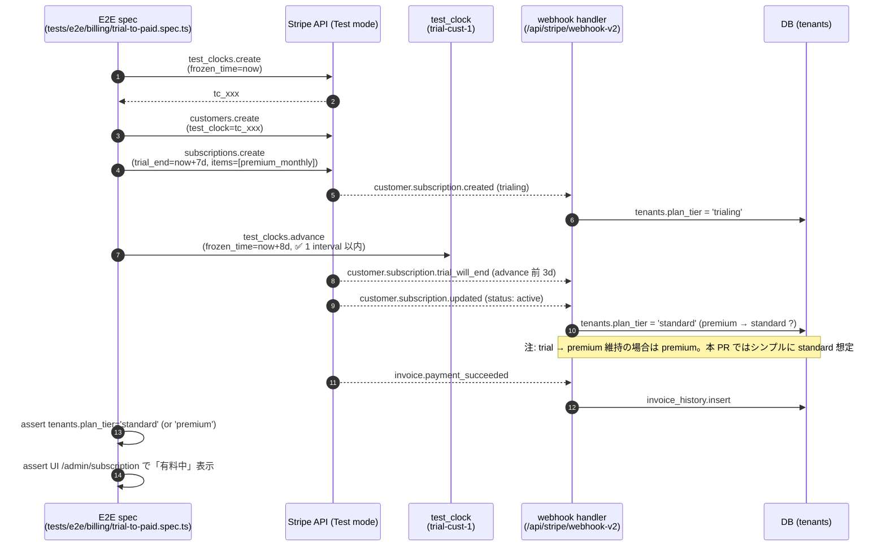
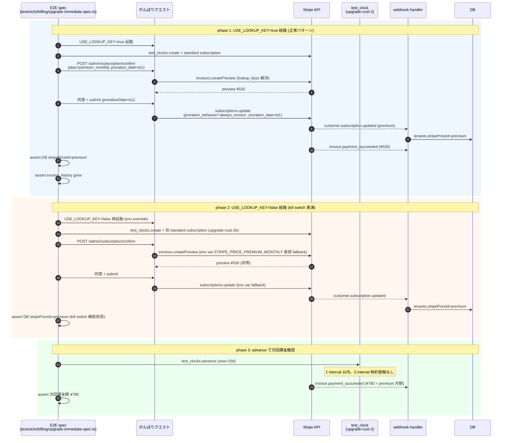
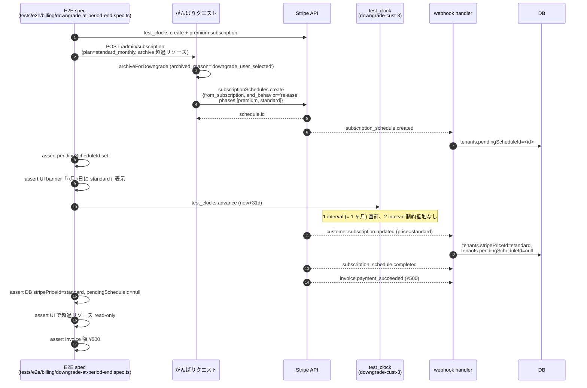
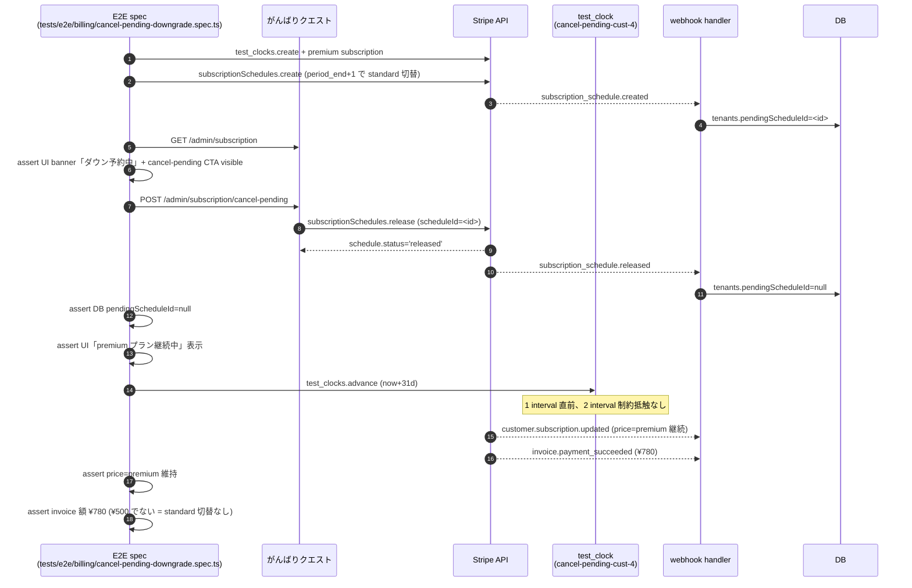
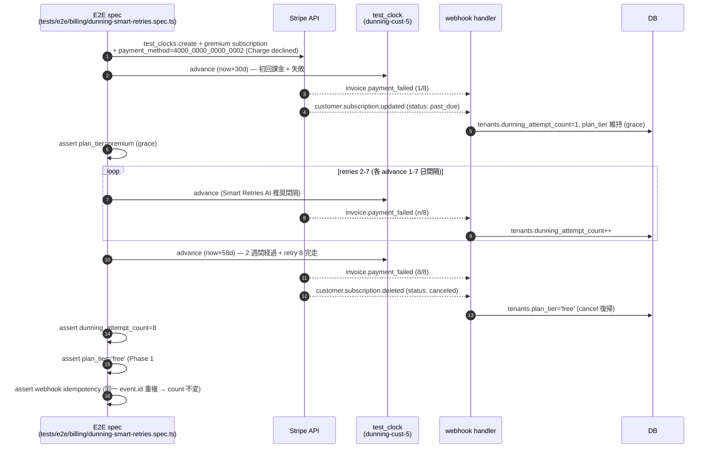
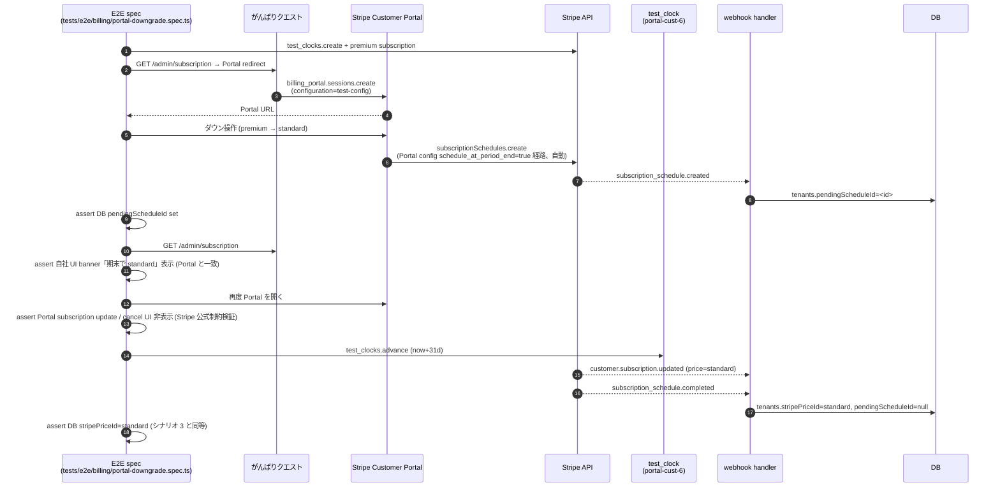

# Test clock E2E シナリオ詳細設計 (6 シナリオ) — Epic #2525 Phase 6 子 2 (#2662)

| 項目 | 内容 |
|------|------|
| 孫 issue | #2662 (Phase 6 子 2 — Test clock E2E シナリオ詳細設計、グループ B) |
| 親 | Phase 6 親 (Phase 5 → Phase 7 橋渡し SSOT) / Epic #2525 |
| 上位 (Phase 6 子 1) | #2667 (Phase 7 統合 PR 実行手順 SSOT、本 docs §1 で参照) |
| 前提 (Phase 5) | #2639 (子 1 1 Product 2 Price) / #2640 (子 2 proration) / #2641 (子 3 webhook 冪等性) |
| 連動 (Phase 7) | #2531 (実装 PR 群、本 docs の 6 シナリオを `tests/e2e/billing/` 配下に実装) / #2627 (Stripe Dashboard PO 手動操作、領域 D = Test mode Test clock customer 構築) |
| ステータス | 設計確定 (本 PR で確定、コード変更なし) |
| Phase 1 連動 | #2535 (plan-change FR-3 アップ即時 / FR-4 ダウン期末) / #2537 (dunning Smart Retries 8 attempts) |
| 作業姿勢 (#2525 critical) | 課金は別格 ([[billing-critical-extra-caution]])。Test clock は Stripe 公式の **2 interval 制約** ([Test clocks API advanced usage](https://docs.stripe.com/billing/testing/test-clocks/api-advanced-usage)) を遵守し、advance 回数を明示。本物 Stripe Test mode + test clock 経由 (demo Lambda 不使用、ADR-0048 整合) |

> **位置づけ**: Phase 6 グループ B の 2 番目の成果物。Phase 6 子 1 (#2667) で確定した「Phase 7 統合 PR 5 step × Stripe Dashboard 7 領域 同期」のうち、**Step 4 (Webhook shadow/cutover/retire)** + **Step 3 (lookup_key 移行)** の Pre-Ready 必須化 E2E (Phase 7 子 2/3 連動) を、Test clock 経由 6 シナリオで詳細設計する。Phase 7 実装者は本 docs を参照するだけで `tests/e2e/billing/` 配下の spec 構造 + helper + advance 回数を一意に決定できる状態を確立する。

## 1. 設計背景

### 1.1 課題: Phase 5 + Phase 6 子 1 で確定したアーキを Test clock E2E で検証する手段が docs 化されていない

Phase 5 全 5 子 (#2639〜#2643) + Phase 6 子 1 (#2667) で確定したアーキ:

- **アップ即時** (`subscriptions.update` + `proration_behavior='always_invoice'`) ← Phase 5 子 2 #2640 §3
- **ダウン期末** (`subscriptionSchedules.create` + `end_behavior='release'`) ← Phase 5 子 2 #2640 §4
- **ダウン取消** (`subscriptionSchedules.release`) ← Phase 5 子 2 #2640 §5
- **dunning Smart Retries 8 attempts / 2 週間** ← Phase 1 #2537 dunning FR-2
- **Customer Portal 期末ダウン** (`subscription_update.schedule_at_period_end=true`) ← Phase 5 子 1 #2639 §3.2
- **trial 開始 → 7 日後課金** ← Phase 1 trial-requirements

しかし**「これら 6 動作の E2E を Stripe Test clock 経由でどう検証するか」「Test clock advance 回数 + 2 interval 制約 + advance 制約をどう遵守するか」「demo Lambda E2E (ADR-0048) と本物 Stripe Test mode E2E の境界をどこに引くか」が docs 横断で散在**している。Phase 7 実装者の自由裁量に委ねると、advance 回数事故 / silent drop 検出漏れ / シナリオ間 customer fixture 共有事故が発生するリスクを抱えたまま実装段階に入る。

### 1.2 課題: Stripe Test clock の 2 interval 制約 ([advanced-usage](https://docs.stripe.com/billing/testing/test-clocks/api-advanced-usage)) が暗黙的

Stripe 公式 Test clocks API advanced usage より:

> "You can advance a test clock at most 2 intervals at a time. For example, if you have a monthly subscription, you can advance the clock at most 2 months at a time."

つまり **monthly subscription の場合、1 回の `advance` で最大 2 ヶ月先まで進められる**が、それを超える期間は **複数回 advance** が必要。本プロダクトの 6 シナリオで particularly 影響するのは:

- **dunning Smart Retries 8 attempts (2 週間)**: 月次サブスク前提なので 2 週間 = 0.5 interval、1 回 advance で 8 attempts を一気に進めるためには各 attempt の時間配置 (Smart Retries AI 最適化) を考慮した複数 advance が必要
- **trial 7 日後課金**: trial 期間 = 7 日 (< 1 interval = 1 ヶ月) なので 1 回 advance で完結
- **ダウン期末**: period_end (= 1 ヶ月後) までの advance で 2 interval 制約に違反しない

各シナリオの advance 回数 + interval 制約遵守を本 docs で明示しないと、E2E 実装時に「1 回 advance で進めようとして Stripe API error 423」「Smart Retries 検証中に retries 完走前に next billing cycle に突入」等の事故が発生する。

### 1.3 課題: ロールバック確認 (Phase 6 子 5 #2665 連動) を各シナリオに組み込まないと cutover 安全性が担保されない

Phase 6 子 5 (#2665、本 PR scope 外) で確定する kill switch (`USE_LOOKUP_KEY` / `STRIPE_WEBHOOK_SHADOW_MODE`) は、**Test clock E2E で「失敗 → ロールバック → 成功」の dry-run を 1 度実演しない限り、本番 cutover 時 (Phase 6 子 1 #2667 §3 Step 4-b) に kill switch が機能するか担保不能**。

Phase 6 子 1 #2667 §10 Open question 3 で確定済:

> Step 4 cutover 失敗時のロールバック手順を本番想定で 1 度実演 (Test mode で)? Pre-Ready 必須化? → 実演必須化推奨

各シナリオに「失敗パターン → kill switch 経由ロールバック → 再 advance で成功」の手順を組み込む必要がある。

### 1.4 設計がなかった場合に何が困るか

1. **Test clock advance 回数事故**: 1 回 advance で 2 interval 超過 → Stripe API 423 error → Phase 7 E2E 実装が flaky
2. **Smart Retries 8 attempts 検証漏れ**: AI 最適タイミングを考慮せず単純に 14 days advance → 8 attempts 完走前 / 後に検証 → Phase 1 #2537 FR-2 不成立
3. **シナリオ間 customer fixture 共有事故**: 6 シナリオが同一 customer を共有 → アップ即時実施後の subscription が他シナリオに混入 → flake / 偽陽性
4. **demo Lambda E2E と Stripe Test mode E2E の境界不明確**: demo Lambda (`AUTH_MODE=anonymous + DATA_SOURCE=demo`) で Stripe API mock 経路を作るか、本物 Stripe Test mode を叩くかが docs 化されない → Phase 7 実装者が独断で経路選定 → ADR-0048 demo 哲学逸脱リスク
5. **kill switch dry-run 不在**: 本番 cutover 失敗時に kill switch が機能するか「初めて本番で確認」状態 → Phase 6 子 1 #2667 §10 Open question 3 「実演必須化」非充足

## 2. 設計原則

| 原則 | 内容 | 根拠 |
|------|------|------|
| **本物 Stripe Test mode + Test clock 経由** | demo Lambda (ADR-0048) や mock 経路を使わず、本物 Stripe Test mode の test clock customer + サブスクリプションで検証 | Stripe 公式 [Test billing (test clocks)](https://docs.stripe.com/billing/testing) / [billing-critical-extra-caution] (本物経路でしか検出できない事故が存在) |
| **シナリオごとに独立 customer fixture** | 6 シナリオで customer / subscription / test clock を別々に作成、共有しない | Stripe 公式 test_clocks: 1 clock = 1 customer 設計 / シナリオ間副作用回避 |
| **advance 回数を事前計算 + 明示** | 各シナリオの advance 回数 / interval / 想定 invoice / event を本 docs で確定 | Stripe 公式 advanced-usage 2 interval 制約 / Phase 7 実装の認知負荷削減 |
| **act → outcome assert (`tests/CLAUDE.md` §「render-only 禁止」)** | 各 advance 後に webhook 受信 + DB 反映 + UI state 変化を必ず assert | tests/CLAUDE.md L72-106 (#2544 / UnifiedImportHub 事故教訓) |
| **kill switch dry-run を 1 シナリオで実演** | アップ即時 (シナリオ 2) に「lookup_key 解決失敗 → `USE_LOOKUP_KEY=false` 切替 → env var fallback 成功」の手順を組み込む | Phase 6 子 1 #2667 §10 Open question 3 / Phase 6 子 5 #2665 (kill switch SSOT) |
| **per-PR (軽量) vs EPIC-merge (重量) cadence 整合** | Test clock E2E は重量 (本物 Stripe API 経路、課金は別格) のため EPIC-merge gate 配置、per-PR では unit / integration test で代替 | tests/CLAUDE.md §「2 層 cadence (検証の段階分け、ADR-0007)」 / [[billing-critical-extra-caution]] |
| **`tests/e2e/billing/` 新規 dir で分離** | 既存 `tests/e2e/billing-cancellation-reason.spec.ts` 等 (Phase 2 以前) と区別、Phase 7 連動 spec はすべて `tests/e2e/billing/` 配下 | 命名分離 (Phase 2 以前 vs Phase 7 以降) / Phase 7 連動 spec 群を 1 dir に集約 |

## 3. 6 シナリオ詳細設計 ⭐ 本 docs の核

各シナリオの構成:

- **目的**: Phase 1/5/6 で確定した動作のうち、本シナリオで検証する範囲
- **前提 fixture**: PO #2627 Stripe Dashboard 領域 D (Test mode test clock customer) の事前構築
- **advance 計画**: advance 回数 + 各 advance の interval + 想定 webhook event
- **AC** (act → outcome assert 必須): 期待挙動の検証 assertion
- **mermaid sequence**: Test clock advance × Stripe webhook × アプリ DB 反映の sequence
- **ロールバック確認**: 失敗時の kill switch 経由復帰手順 (シナリオ 2 のみ詳細実演)

### 3.1 シナリオ 1: trial 開始 → 7 日後課金

| 項目 | 内容 |
|---|---|
| **目的** | Phase 1 trial-requirements の「trial 7 日間 → 自動課金」を検証。Reverse Trial パターン C (Phase 2 checkout-journey) + 7 日後の `invoice.payment_succeeded` webhook 受信 |
| **前提 fixture** | PO #2627 領域 D で Test mode に test clock customer (`trial-cust-1`) を作成、subscription を `trial_end=now+7d` で構築。test_clock の `frozen_time` は subscription 作成時刻 |
| **advance 計画** | **1 回 advance** (`now + 8 days`、trial_end の 1 日後)。1 interval (1 ヶ月) 以内なので 2 interval 制約抵触なし |
| **想定 webhook 受信** | (a) `customer.subscription.trial_will_end` (advance 前、trial_end 3 日前トリガ、Stripe 公式) (b) `customer.subscription.updated` (status: trialing → active) (c) `invoice.created` + `invoice.finalized` + `invoice.payment_succeeded` |
| **AC** | (a) advance 後に `tenants.plan_tier` が trial → standard 切替 (b) DB に invoice 履歴 1 件追加 (c) UI `/admin/subscription` で「standard 有料中」表示 (d) trial banner (Phase 3 #2569) 非表示 |
| **ロールバック確認** | 本シナリオでは kill switch 実演なし (lookup_key / webhook shadow 経路は trial に関与しないため。シナリオ 2 で実演) |

#### mermaid sequence (シナリオ 1)



### 3.2 シナリオ 2: アップ即時 (`always_invoice`、kill switch 実演)

| 項目 | 内容 |
|---|---|
| **目的** | Phase 5 子 2 #2640 §3 「アップ即時 = `always_invoice`」 + Phase 6 子 1 #2667 §3 Step 3 lookup_key 解決 + **kill switch dry-run 実演** (`USE_LOOKUP_KEY=false` fallback) |
| **前提 fixture** | PO #2627 領域 D で Test mode test clock customer (`upgrade-cust-2`) を作成、standard subscription を `current_period_end=now+30d` で構築 |
| **advance 計画** | **advance なし** (アップ即時は時間経過不要)。シナリオ完了後に 1 回 advance (`now+15d`) で「アップ後の継続課金 (新 premium 価格)」を確認 |
| **想定 webhook 受信** | (a) `invoice.created` + `invoice.finalized` + `invoice.payment_succeeded` (差額 ¥530) (b) `customer.subscription.updated` (price.id = premium_monthly_id) |
| **AC** | (a) `subscriptions.update` 直後に DB の `tenants.stripePriceId` が premium 切替 (b) invoice_history に差額 invoice ¥530 1 件追加 (c) UI `/admin/subscription/success` で polling 完了 (Phase 3 #2572) (d) `proration_date` が preview / update 間で一致確認 (e) advance 後 15 日経過で次回課金 ¥780 確認 |
| **ロールバック確認** | (1) `USE_LOOKUP_KEY=true` の状態でアップ即時実行 → 成功 → DB 反映確認 (2) `USE_LOOKUP_KEY=false` に切替 → env var fallback 経路で再度 standard customer 作成 + アップ即時 → 同等成功 → DB 反映確認。両方が動くことで kill switch 機能を担保 |

#### mermaid sequence (シナリオ 2、kill switch 実演含む)



### 3.3 シナリオ 3: ダウン期末 (`subscription_schedules` + `release`)

| 項目 | 内容 |
|---|---|
| **目的** | Phase 5 子 2 #2640 §4 「ダウン期末 = `subscription_schedules.create from_subscription`」 + 期末到達時の schedule 第 2 phase 開始 + `customer.subscription.updated` (premium → standard) |
| **前提 fixture** | PO #2627 領域 D で Test mode test clock customer (`downgrade-cust-3`) を作成、premium subscription を `current_period_end=now+30d` で構築 |
| **advance 計画** | **1 回 advance** (`now+31d`、period_end の 1 日後)。1 interval (1 ヶ月) 直前、2 interval 制約抵触なし。advance 直後に schedule 第 2 phase 自動開始 |
| **想定 webhook 受信** | (a) `subscriptionSchedules.create` 直後: `subscription_schedule.created` (b) advance 後: `subscription_schedule.completed` + `customer.subscription.updated` (price.id = standard_monthly_id) + `invoice.payment_succeeded` (¥500 = standard 月額) |
| **AC** | (a) `subscriptionSchedules.create` 直後に DB `tenants.pendingScheduleId` が set (b) UI で「○月○日に standard に切替予約中」banner 表示 (c) advance 後に DB `tenants.stripePriceId` が standard 切替、`pendingScheduleId` clear (d) 超過リソース (Phase 2 ジャーニー B step 2 で archived) が read-only 表示 (e) 次回課金 ¥500 |
| **ロールバック確認** | 本シナリオでは kill switch 実演なし。subscription_schedule API 経路は lookup_key / shadow mode 経路と独立 |

#### mermaid sequence (シナリオ 3)



### 3.4 シナリオ 4: ダウン取消 (`subscription_schedules.release`)

| 項目 | 内容 |
|---|---|
| **目的** | Phase 5 子 2 #2640 §5 「ダウン取消 = `subscriptionSchedules.release`」 + Phase 5 子 1 #2639 §4.2 Portal ロック制約への構造的回避 + Phase 3 #2573 申し送り cancel-pending banner |
| **前提 fixture** | シナリオ 3 と類似だが、別 customer (`cancel-pending-cust-4`)。premium subscription + subscription_schedule 既存 (period_end+1 で standard 切替予約) で構築 |
| **advance 計画** | **0 回 advance** (取消は即時、schedule 第 2 phase 開始前に release)。release 後に 1 回 advance (`now+31d`) で「premium 継続中、standard 切替なし」を確認 |
| **想定 webhook 受信** | (a) `subscriptionSchedules.release` 直後: `subscription_schedule.released` (b) advance 後: `customer.subscription.updated` (price = premium 継続、変化なし) + `invoice.payment_succeeded` (¥780 = premium 月額) |
| **AC** | (a) `subscriptionSchedules.release` 直後に DB `tenants.pendingScheduleId` が clear (b) UI banner「ダウン予約取消済」表示 → premium プラン継続中表示 (c) advance 後に price は premium 維持、standard 切替なし (d) 次回課金 ¥780 (e) Portal の subscription_update / cancel UI が再度操作可能になることを assert (Stripe 公式制約より、schedule release 後は Portal ロック解除) |
| **ロールバック確認** | 本シナリオでは kill switch 実演なし |

#### mermaid sequence (シナリオ 4)



### 3.5 シナリオ 5: dunning Smart Retries 8 attempts (test card `4000 0000 0000 0341`)

| 項目 | 内容 |
|---|---|
| **目的** | Phase 1 #2537 dunning FR-2 「Smart Retries 8 回 / 2 週間、最終 cancel」 + grace period (past_due) + 復帰判定 (webhook driven) |
| **前提 fixture** | PO #2627 領域 D で Test mode test clock customer (`dunning-cust-5`) を作成、premium subscription を構築。**payment_method を Stripe test card [`4000 0000 0000 0341`](https://docs.stripe.com/testing#cards-responses) ("Charge succeeds, dispute as fraudulent")** で attach。これにより次回課金で `invoice.payment_failed` を強制発生させる。または `4000 0000 0000 0002` ("Charge declined") を使用 |
| **advance 計画** | **複数回 advance** (Smart Retries AI 最適タイミング考慮): (1) 初期 advance `now+30d` で `invoice.payment_failed` 1 回目 → past_due 遷移 (2) advance `now+31d` で retry 1 (3) advance `now+33d` で retry 2 (4) advance `now+36d` で retry 3 (5) advance `now+40d` で retry 4 (6) advance `now+45d` で retry 5-6 (Smart Retries AI 推奨間隔) (7) advance `now+50d` で retry 7 (8) advance `now+44d+14d=now+58d` で **2 週間経過 + retry 8 完走** + `customer.subscription.deleted` (cancel) |

> **注**: 各 advance の interval は 2 interval (= 2 ヶ月) 以内に収めること。`now+30d` → `now+58d` の累積は 0.93 interval なので問題なし。**1 回の advance で `now+30d → now+58d` の 28d を一気に進めると、Smart Retries の AI 推奨間隔 (例: 1d/3d/7d) を skip して全 retries が同時刻トリガになる可能性があり、現実の dunning 動作と乖離する**。よって複数回 advance 必須。

| 項目 | 内容 |
|---|---|
| **想定 webhook 受信** | (a) 初期 advance: `invoice.payment_failed` (1 回目) + `customer.subscription.updated` (status: active → past_due) (b) 各 retry advance: `invoice.payment_failed` (回数+1) + `invoice.upcoming` (c) 最終 advance: `invoice.payment_failed` (8 回目) + `customer.subscription.deleted` (status: past_due → canceled) |
| **AC** | (a) 初期 advance 直後に DB `tenants.plan_tier` は premium 維持 (grace period、Phase 1 #2537 FR-1) (b) 各 retry advance 後に DB `tenants.dunning_attempt_count` が +1 increment (c) 最終 advance 後に DB `tenants.plan_tier` が free 復帰 (canceled = 無料に戻す、Phase 1 #2537 FR-2 final cancel) (d) Stripe 自動 dunning メール (親宛、Phase 1 #2537 FR-6) は本 E2E では送信検証なし (Stripe Test mode email 送信は test fixture で受信 inbox mock 不在のため、unit test or integration test で別途検証) (e) webhook 冪等性 (Phase 5 子 3 #2641 dispatcher 入口 dedup) で同一 `event.id` 重複到達時に `tenants.dunning_attempt_count` が 2 倍 increment しないこと |
| **ロールバック確認** | 本シナリオでは kill switch 実演なし (dunning 経路は lookup_key / webhook shadow と独立) |

#### mermaid sequence (シナリオ 5、簡略化)



### 3.6 シナリオ 6: Customer Portal 期末ダウン (`subscription_update.schedule_at_period_end=true`)

| 項目 | 内容 |
|---|---|
| **目的** | Phase 5 子 1 #2639 §3.2 Customer Portal 設定 (`schedule_at_period_end=true`) を経由したダウン期末動作の検証。**シナリオ 3 (自社 UI ダウン期末)** と類似だが、Portal 経由で subscription_schedule が自動作成されることを検証 |
| **前提 fixture** | PO #2627 領域 B (Test mode Customer Portal config) + 領域 D (Test mode test clock customer `portal-cust-6`)。premium subscription を構築 |
| **advance 計画** | **1 回 advance** (`now+31d`、period_end の 1 日後)。シナリオ 3 と同じ |
| **想定 webhook 受信** | (a) Portal 操作直後: `subscription_schedule.created` + `customer.subscription.updated` (`cancel_at_period_end`/`schedule_at_period_end` のいずれかフラグ set、Stripe 公式 Portal 仕様) (b) advance 後: シナリオ 3 と同じ (`subscription_schedule.completed` + `customer.subscription.updated`) |
| **AC** | (a) Portal 操作直後に DB `tenants.pendingScheduleId` が set (b) UI 自社 banner「○月○日に standard に切替予約中」表示 (Portal と自社 UI 両方で表示一致) (c) advance 後にシナリオ 3 と同じ DB 反映 (d) Portal の subscription update / cancel UI が schedule 既存中はロックされていることを assert (Phase 5 子 1 #2639 §4.2 Stripe 公式制約検証) |
| **ロールバック確認** | 本シナリオでは kill switch 実演なし |

#### mermaid sequence (シナリオ 6)



## 4. E2E test file 配置設計

### 4.1 ディレクトリ構造

```
tests/e2e/billing/                              ← 新規 dir (Phase 7 #2531 で作成)
├── helpers/
│   ├── test-clock.ts                           ← test_clock CRUD + advance helper (本 docs §4.3)
│   ├── stripe-fixture.ts                       ← customer / subscription / payment_method fixture builder
│   ├── webhook-assertions.ts                   ← webhook 受信 + DB 反映 assert helper (act → outcome)
│   └── kill-switch.ts                          ← USE_LOOKUP_KEY env override helper (シナリオ 2 用)
├── trial-to-paid.spec.ts                       ← シナリオ 1 (trial 7d → 課金)
├── upgrade-immediate.spec.ts                   ← シナリオ 2 (アップ即時 + kill switch 実演)
├── downgrade-at-period-end.spec.ts             ← シナリオ 3 (自社 UI ダウン期末)
├── cancel-pending-downgrade.spec.ts            ← シナリオ 4 (ダウン取消)
├── dunning-smart-retries.spec.ts               ← シナリオ 5 (dunning 8 attempts)
└── portal-downgrade.spec.ts                    ← シナリオ 6 (Portal 経由ダウン期末)
```

### 4.2 既存 spec との関係

`tests/e2e/billing-cancellation-reason.spec.ts` / `billing-graduation-flow.spec.ts` / `billing-portal.spec.ts` (Phase 2 以前作成) は **既存 spec として残存** し、Phase 7 後の新 spec は `tests/e2e/billing/` 配下に配置する。命名で Phase 7 前後を分離し、巨大化を避ける。

`tests/e2e/trial-flow.spec.ts` / `trial-banner-display.spec.ts` (Phase 1 以前) は **Cognito dev mode + storageState** 経路 (`playwright.cognito-dev.config.ts`) で動作し、本 Test clock E2E 経路 (本物 Stripe Test mode) と別 config。Phase 7 で同時動作させる際は `playwright.billing.config.ts` 新規作成検討 (Phase 7 #2531 で確定、本 PR scope 外)。

### 4.3 helper `test-clock.ts` 仕様

```typescript
// tests/e2e/billing/helpers/test-clock.ts (Phase 7 #2531 で実装)
import Stripe from 'stripe';
import { expect, type Page } from '@playwright/test';

const stripe = new Stripe(process.env.STRIPE_SECRET_KEY!, {
  apiVersion: '2026-05-27.dahlia', // Phase 7 Step 3 で bump 済
});

export interface TestClockFixture {
  testClockId: string;
  customerId: string;
  subscriptionId: string;
  frozenTime: number; // UNIX timestamp
}

/**
 * Test mode 専用: test_clock + customer + subscription を 1 セットで作成。
 * シナリオごとに別 fixture を生成して副作用回避 (本 docs §2 設計原則)。
 */
export async function createTestClockFixture(params: {
  scenarioName: string; // 'trial' | 'upgrade' | 'downgrade' | 'cancel-pending' | 'dunning' | 'portal'
  priceLookupKey: 'standard_monthly' | 'premium_monthly';
  paymentMethodToken?: string; // Stripe test card token (default: pm_card_visa, dunning は pm_card_chargeDeclined)
  trialDays?: number; // シナリオ 1 用 (default: undefined = 即時課金)
}): Promise<TestClockFixture> {
  // 1. test_clock 作成
  const testClock = await stripe.testHelpers.testClocks.create({ frozen_time: Math.floor(Date.now() / 1000) });
  // 2. customer 作成 (test_clock 紐付け)
  const customer = await stripe.customers.create({
    test_clock: testClock.id,
    metadata: { scenario: params.scenarioName, e2e: 'true' },
  });
  // 3. payment_method attach
  const pm = await stripe.paymentMethods.attach(
    params.paymentMethodToken ?? 'pm_card_visa',
    { customer: customer.id }
  );
  await stripe.customers.update(customer.id, { invoice_settings: { default_payment_method: pm.id } });
  // 4. lookup_key で priceId 解決 (Phase 5 子 1 #2639 §3.4 lookup_key 経由)
  const prices = await stripe.prices.list({ lookup_keys: [params.priceLookupKey], limit: 1 });
  if (prices.data.length === 0) throw new Error(`lookup_key ${params.priceLookupKey} not found`);
  // 5. subscription 作成
  const subscription = await stripe.subscriptions.create({
    customer: customer.id,
    items: [{ price: prices.data[0].id }],
    trial_period_days: params.trialDays,
  });
  return {
    testClockId: testClock.id,
    customerId: customer.id,
    subscriptionId: subscription.id,
    frozenTime: testClock.frozen_time,
  };
}

/**
 * test_clock を advance。Stripe 公式 advanced-usage 「最大 2 interval」 制約遵守。
 * monthly subscription の場合、1 回 advance で最大 2 months 先まで。
 * それ以上は複数回 advance を呼ぶこと (シナリオ 5 dunning で必要)。
 */
export async function advanceTestClock(testClockId: string, frozenTime: number): Promise<void> {
  await stripe.testHelpers.testClocks.advance(testClockId, { frozen_time: frozenTime });
  // advance は 202 Accepted で返り、実際の event 配信は数秒後。webhook 反映を polling で待つ
  // (この helper は kick のみ、reflection assert は webhook-assertions.ts で実施)
}

/**
 * シナリオ完了後の cleanup。次シナリオへの副作用を防ぐ。
 */
export async function cleanupTestClockFixture(fixture: TestClockFixture): Promise<void> {
  try {
    await stripe.subscriptions.cancel(fixture.subscriptionId);
  } catch (_) { /* already canceled */ }
  await stripe.testHelpers.testClocks.del(fixture.testClockId);
}

/**
 * webhook 受信 + DB 反映を polling で待つ (act → outcome assert)。
 * tests/CLAUDE.md §「render-only 禁止」整合。
 */
export async function waitForDbReflection(params: {
  tenantId: string;
  expectedColumn: 'stripePriceId' | 'plan_tier' | 'pendingScheduleId' | 'dunning_attempt_count';
  expectedValue: string | number | null;
  timeoutMs?: number;
}): Promise<void> {
  // 実装は Phase 7 (DB アクセス helper で polling)
}
```

### 4.4 シナリオ 2 `kill-switch.ts` helper 仕様

```typescript
// tests/e2e/billing/helpers/kill-switch.ts (Phase 7 #2531 で実装)
import { type FullConfig } from '@playwright/test';

/**
 * USE_LOOKUP_KEY env を override してアプリを再起動する helper。
 * シナリオ 2 で phase 1 → phase 2 切替時に使用。
 * Phase 7 実装時は test runner の serial mode + global setup で env 差替えを実現する。
 */
export async function withUseLookupKeyEnv<T>(
  useLookupKey: boolean,
  fn: () => Promise<T>
): Promise<T> {
  const original = process.env.USE_LOOKUP_KEY;
  process.env.USE_LOOKUP_KEY = useLookupKey ? 'true' : 'false';
  try {
    return await fn();
  } finally {
    process.env.USE_LOOKUP_KEY = original;
  }
}
```

## 5. 2 interval 制約対応マトリクス

各シナリオの advance 回数 + interval を本表で確定。Stripe 公式 [advanced-usage](https://docs.stripe.com/billing/testing/test-clocks/api-advanced-usage) 「最大 2 interval」制約遵守。

| シナリオ | advance 回数 | 各 advance 間隔 | 累積期間 | 2 interval 抵触? |
|---|---|---|---|---|
| 1. trial → 課金 | 1 | `now + 8d` | 8d (≈ 0.27 interval) | ✅ なし |
| 2. アップ即時 (kill switch 含む) | 1 (phase 3 のみ) | `now + 15d` | 15d (≈ 0.5 interval) | ✅ なし |
| 3. ダウン期末 | 1 | `now + 31d` | 31d (≈ 1.03 interval) | ✅ なし (< 2 interval) |
| 4. ダウン取消 | 1 (release 後) | `now + 31d` | 31d (≈ 1.03 interval) | ✅ なし |
| 5. dunning 8 attempts | **7-8 回** (Smart Retries AI 間隔) | 各 1d/3d/5d/7d 等 | 累積 `now + 58d` (≈ 1.93 interval) | ✅ なし (各 advance ≤ 2 interval) |
| 6. Portal 期末ダウン | 1 | `now + 31d` | 31d (≈ 1.03 interval) | ✅ なし |

**重要**: シナリオ 5 dunning で「1 回 advance で `now + 30d → now + 58d` (28d) を一気に進める」アプローチを採用すると、28d ≤ 2 interval (60d) なので**制約自体は抵触しないが**、Smart Retries の AI 推奨間隔 (例: 初回 retry +1h、2 回目 +1d、3 回目 +3d 等) を全 skip して同時刻トリガになる可能性があり、本番の dunning 動作と乖離する。よって **複数回 advance 必須**。

## 6. ロールバック確認設計 (Phase 6 子 5 #2665 連動、シナリオ 2 で実演)

Phase 6 子 1 #2667 §10 Open question 3「Step 4 cutover 失敗時のロールバック手順を本番想定で 1 度実演 (Test mode で)? Pre-Ready 必須化?」への対応として、**シナリオ 2 (アップ即時) に kill switch dry-run を組み込む**ことで、本番 cutover 前に kill switch が機能することを担保する。

### 6.1 dry-run シナリオ手順 (シナリオ 2 詳細)

| Phase | 操作 | env | 期待 |
|---|---|---|---|
| 1. 正常パターン | `USE_LOOKUP_KEY=true` でアップ即時実行 | `USE_LOOKUP_KEY=true` | lookup_key 経路で成功、DB 反映確認 |
| 2. kill switch 実演 | `USE_LOOKUP_KEY=false` に切替後、別 customer で再度アップ即時実行 | `USE_LOOKUP_KEY=false` | env var fallback 経路で成功 (`STRIPE_PRICE_PREMIUM_MONTHLY` 直読)、DB 反映同等 |
| 3. 復帰 | `USE_LOOKUP_KEY=true` に戻して別 customer で再度確認 | `USE_LOOKUP_KEY=true` | 元の lookup_key 経路で成功 (復帰確認) |

両方が動くことで Phase 6 子 1 #2667 §3 Step 3 で確定した「`USE_LOOKUP_KEY` kill switch」が機能することを担保。シナリオ 2 spec は **3 phase serial execution** で配置する (`test.describe.configure({ mode: 'serial' })`、`trial-flow.spec.ts` 同型)。

### 6.2 同様の kill switch を持つシナリオ (Phase 6 子 5 #2665 担当の他 issue)

`STRIPE_WEBHOOK_SHADOW_MODE` kill switch (Phase 6 子 1 #2667 §3 Step 4 shadow→cutover) の dry-run は **本 PR scope 外** (Phase 6 子 5 #2665 で別 spec として設計)。本 docs ではシナリオ 1-6 の範囲のみ確定。

## 7. 影響範囲事後検証 (4 layer impact-analysis + 21 カテゴリ)

本 PR は **docs 設計のみ** で新規 1 ファイル追加。L1-L4 影響範囲は最小だが、Phase 7 #2531 統合 PR に向けた **事前見積** として記録。

### L1 構文 (ast-grep / ripgrep)

| 検出パターン | 件数 (Phase 7 実測予測) | step |
|---|---|---|
| `tests/e2e/billing/` 配下新規 spec | 0 件 → 6 spec + 4 helper 新規追加 | Phase 7 #2531 |
| `stripe.testHelpers.testClocks.*` 呼出 | 0 件 → helper 内 3 関数 (create / advance / del) | Phase 7 #2531 |
| `stripe.prices.list({ lookup_keys })` 呼出 | 0 件 (Phase 5 子 1 で確定、Phase 7 Step 3 で実装) | Phase 7 Step 3 |
| `USE_LOOKUP_KEY` env override | 0 件 → 1 helper (`kill-switch.ts`) | Phase 7 #2531 |
| `tenants.pendingScheduleId` カラム参照 | Phase 7 で追加 (Phase 1 #2538 連動) | Phase 7 |
| `tenants.dunning_attempt_count` カラム参照 | Phase 7 で追加 (Phase 1 #2537 連動、本 docs シナリオ 5) | Phase 7 |

### L2 意味 (型 / 同名異義)

- **`'standard' / 'premium'` plan tier (表示プラン名 vs 内部識別子)**: Phase 1 補強 2 で premium rename 確定済。本 docs では Phase 7 Step 2 (子 5 #2643 §6) 完了後の atom 名 (`PLAN_TERMS.premium`) を前提
- **`test_clock` (Stripe 公式) vs `test_clocks` (Node SDK)**: SDK では `stripe.testHelpers.testClocks.*` が正しい
- **`apiVersion` 2026-04-22 vs 2026-05-27**: Phase 5 子 1 #2639 §3.4 で `2026-05-27.dahlia` に bump 済。本 docs helper も新版を使う
- **`scenarioName` 重複検出**: 6 シナリオで `scenarioName: 'trial' | 'upgrade' | ...` を区別、customer metadata に保存して fixture 共有事故を防ぐ

### L3 構造 (依存グラフ)

```
tests/e2e/billing/<scenario>.spec.ts
  ↓ depends on
tests/e2e/billing/helpers/test-clock.ts (createTestClockFixture / advanceTestClock / cleanupTestClockFixture)
  ↓ depends on
src/lib/server/stripe/client.ts (apiVersion 2026-05-27.dahlia、Phase 7 Step 3)
  ↓ depends on
src/lib/server/stripe/config.ts (lookup_key 解決、Phase 7 Step 3)

tests/e2e/billing/<scenario>.spec.ts
  ↓ depends on
tests/e2e/billing/helpers/webhook-assertions.ts (waitForDbReflection、polling assert)
  ↓ depends on
src/lib/server/db/repos/webhook-event-repo.ts (Phase 5 子 3 #2641 dedup table)
  ↓ depends on
tenants table columns: stripePriceId / pendingScheduleId / dunning_attempt_count (Phase 7 DB migration)
```

各 helper は前 helper / 前 step 完了を前提とする。

### L4 派生 artifact 21 カテゴリ checklist (主要項目)

| # | カテゴリ | 影響 (Phase 7 実装時) |
|---|---|---|
| 1 | DB schema | シナリオ 3 で `tenants.pendingScheduleId` 参照 / シナリオ 5 で `tenants.dunning_attempt_count` 参照 (Phase 7 DB migration で配備、本 docs では仕様のみ) |
| 7 | Stripe Product / Price / Webhook | 全シナリオ共通: lookup_key 経由 + apiVersion 2026-05-27.dahlia + webhook 8 event 購読を前提 (Phase 5 子 1 / Phase 6 子 1 整合) |
| 11 | analytics event name | 影響なし (Stripe webhook event の type のみ、analytics 内部 event は変更なし) |
| 12 | dashboard / alert | シナリオ 5 で dunning Discord alert を確認 (本 PR scope 外、Phase 7 で別途) |
| 13 | Help Center / FAQ | 影響なし (本 docs は E2E 設計のみ、顧客向け文言なし) |
| 16 | GitHub Actions / pipeline | Phase 7 で `playwright.billing.config.ts` を新規作成検討 (本 docs §4.2)、CI workflow に billing E2E job 追加 |
| 17 | deployment env / secrets | `STRIPE_SECRET_KEY` (Test mode) を CI Secrets に配備 (Phase 7 #2531) / `USE_LOOKUP_KEY` env (Phase 7 Step 3) |
| 19 | fixture / seed / golden | `tests/e2e/billing/helpers/stripe-fixture.ts` で customer / payment_method fixture builder (Phase 7 実装) |
| 21 | audit log | 影響なし (Phase 5 子 3 #2641 webhook 冪等性 dedup table の 30 日 retention は本 docs 範囲外) |

## 8. 想定リスク + ロールバック

| # | リスク | 検出 | ロールバック |
|---|---|---|---|
| R1 | Test mode test clock customer fixture が 6 シナリオ間で共有されシナリオ漏れ | E2E spec で `customer.id` を別々に作成 + cleanup helper 実行確認 | shared fixture を発見したら spec ごとに `createTestClockFixture` 呼び直しに修正 |
| R2 | シナリオ 5 dunning で advance 回数不足 / 過多で Smart Retries 検証漏れ | webhook 受信 event 数 (`invoice.payment_failed` 8 件) を spec で count assert | advance 回数を再計算 (Stripe Dashboard で Smart Retries タイミング設定確認) |
| R3 | 2 interval 制約抵触で Stripe API 423 error | E2E spec で advance 失敗時の error message assert + 抵触 advance を分割 | advance を 2 回に分割、`§5 マトリクス` を再確認 |
| R4 | シナリオ 2 kill switch dry-run で env override が反映されない (`USE_LOOKUP_KEY=false` 経路に切替らない) | spec で `process.env.USE_LOOKUP_KEY` 値 assert + lookup_key 解決を skip した経路を spec で trace | `kill-switch.ts` helper の env override 仕様を改修 (Phase 7 で global setup 統合検討) |
| R5 | 本物 Stripe Test mode への課金が無料枠超過 (PO #2627 領域 D fixture 多数作成時) | Stripe Dashboard usage 確認 (Test mode は通常無料、課金回避) | cleanup helper で test_clock + customer + subscription を確実に削除、E2E CI 後の garbage collection |
| R6 | Test mode webhook destination 未有効化 (PO #2627 領域 C 未完) | シナリオ 1-6 全件で webhook 受信 0 件、DB 反映なし | PO に Discord alert 通知、Dashboard で C 領域有効化後再 push |

## 9. ADR 起票推奨

Phase 6 完了時に **1 件の新 ADR 起票推奨** (Phase 6 子 1 #2667 §9 と統合可能):

- **ADR 候補名**: 「Phase 7 Test clock E2E 6 シナリオ + kill switch dry-run 戦略」
- **context**:
  - 課金は Pre-PMF でも別格 ([[billing-critical-extra-caution]])、本物 Stripe Test mode + test clock 経由が必須
  - Stripe 公式 advanced-usage 2 interval 制約 + Smart Retries AI 最適タイミングへの対応
  - kill switch dry-run (Phase 6 子 1 #2667 §10 Open question 3) の Pre-Ready 必須化
- **選択肢比較** (OSS 先調査ルール ADR-0014 整合):
  - **A. 本物 Stripe Test mode + test_clock (本 PR 採用)**: Stripe 公式推奨パターン
  - **B. Stripe API mock (`page.route` 経由)**: 不採用 (課金は別格、mock では検出できない事故が存在、tests/e2e/integration/upgrade-checkout.spec.ts は Phase 2 以前の mock 経路で残存)
  - **C. demo Lambda 経路 (`AUTH_MODE=anonymous + DATA_SOURCE=demo`)**: 不採用 (ADR-0048 demo 哲学逸脱、Stripe Test mode との混在で trace 困難)
- **整合**: ADR-0010 (Pre-PMF、課金は別格 Bucket A) / ADR-0020 (PR size ≤ 500 行、6 spec を Phase 7 で 1 spec/PR ペースで実装) / ADR-0045 (atom / compound、シナリオ用語 fixture)
- **起票タイミング**: Phase 7 統合 PR 全 step マージ完了後、別 PR で起票 (Phase 6 子 1 #2667 と統合可能性あり)

## 10. Open question (PO 判断、Phase 7 で確定)

| # | 軸 | 論点 | 推奨案 | 状態 |
|---|---|------|------|------|
| 1 | **business** | シナリオ 5 dunning Smart Retries の advance 間隔は AI 最適タイミング (Stripe Dashboard 設定) を厳密に模倣すべきか、簡易固定間隔 (1d/3d/5d/7d/9d/12d/14d/14d) で代替か? | 簡易固定間隔推奨 (E2E は決定的にしたい、Smart Retries の AI 推奨間隔は本番動作確認時に別途検証)。CI 実行時間を 5 分以内に抑える | Phase 7 シナリオ 5 実装時 PO 確定 |
| 2 | **UX** | シナリオ 6 Portal 経由ダウンで「Portal UI ロック制約」を E2E spec 内で実機 assert する場合、Stripe Customer Portal の DOM 構造変化に追従コスト発生。ロック検出は API レベル (`subscriptions.retrieve` で `schedule` 存在 assert) で代替すべきか? | API レベル代替推奨 (Portal DOM 構造は Stripe 側変更で flaky になりやすい、Pre-PMF 段階で UI assert は ROI 低い)。Portal UI ロックの本番検証は手動 QA で実施 | Phase 7 シナリオ 6 実装時 PO 確定 |
| 3 | **security** | 本 E2E は本物 Stripe Test mode + Test clock を CI で実行するため、`STRIPE_SECRET_KEY` (Test mode) を GitHub Secrets に配備する必要がある。Test mode key の rotation 頻度と CI 失敗時の key 漏洩リスクは? | rotation 6 ヶ月推奨 (Stripe Test mode は本番 customer データなし、漏洩しても直接被害なし)。CI 失敗時の log mask は GitHub Actions の `add-mask` で配備 | Phase 7 CI workflow 設計時 PO 確定 |
| 4 | **security (adversarial)** | シナリオ 2 kill switch dry-run で `USE_LOOKUP_KEY=false` 経路を CI で常時実行すると、env var fallback 経路の test coverage 自体は確保されるが、本番運用で env var 経路を常時使う誘惑が増えないか?dry-run 経路の coverage と本番採用率は別管理すべきか? | 別管理推奨 (dry-run は CI 内 1 sequence のみ実演、本番採用率は Sentry alert で監視)。`USE_LOOKUP_KEY` の本番デフォルトは `true` 維持、Phase 6 子 1 #2667 §10 Open question 2 整合 | Phase 7 Step 5 着手時 PO 判断 |
| 5 | **security (adversarial)** | Test mode test clock customer fixture を CI 並列実行で同時作成すると、Stripe API rate limit (100 req/sec) に抵触する可能性。並列度上限と retry 戦略は? | CI 並列度 4 以下推奨 (Stripe Test mode は本番より rate limit が緩いが、安全側で。Playwright の `--workers=4` で抑制)。Stripe SDK の自動 retry (3 回、指数 backoff) を有効化 | Phase 7 CI workflow 設計時 PO 確定 |

## 11. 6 観点 workflow 自己検証

[[per-issue-execution-workflow]] 6 観点 + git workflow を本 PR で自己検証:

| 観点 | 自己検証 |
|---|---|
| 1. **deep-research** | Stripe 公式 [Test clocks API advanced usage](https://docs.stripe.com/billing/testing/test-clocks/api-advanced-usage) (2 interval 制約) / [Test billing (test clocks)](https://docs.stripe.com/billing/testing) / [Test cards (payment failure cards)](https://docs.stripe.com/testing#cards-responses) を verbatim 引用。Phase 5 子 1 #2639 deep-research 14 URL を再利用 (`tmp/reviews/phase5-stripe-product-research.md` 既存資料) |
| 2. **UI SS + a11y** | 本 PR は docs 設計のみ、UI 変更なし。Phase 7 #2531 で実際の E2E spec 実装時に Playwright trace + 必要に応じて SS 取得 |
| 3. **UX テスト計画** | 本 PR 自体が UX テスト計画 (E2E spec の詳細設計)。条件 1 (機能 goal 完遂) + 条件 8 (5 mode visual baseline) を満たす E2E 設計 |
| 4. **用語 SSOT** | test data atom (`scenarioName: 'trial' / 'upgrade' / 'downgrade' / 'cancel-pending' / 'dunning' / 'portal'`) は test fixture metadata のみで本番 UI に露出しない。Phase 5 子 5 #2643 atom 統合 5 step で `PLAN_TERMS.premium` rename 後に本 docs を Phase 7 で参照 |
| 5. **影響範囲事後検証** | §7 で L1-L4 + 21 カテゴリ checklist 完遂。本 PR は docs のみで L1-L4 影響範囲ゼロ、Phase 7 実装時の事前見積として記録 |
| 6. **目的達成 / 大方針整合** | Phase 6 子 1 #2667 §3 Step 4 (Webhook shadow/cutover/retire) + Step 3 (lookup_key 移行) の Pre-Ready 必須化 E2E + Phase 5 子 1 (1 Product 2 Price) + 子 2 (proration) + 子 3 (webhook 冪等性) の検証を 6 シナリオで網羅。Phase 7 #2531 統合 PR で本 docs を参照するだけで spec 構造が一意に決定 |

## 12. 影響範囲事後検証 (本 PR scope)

| 項目 | 内容 |
|---|---|
| **本 PR 変更ファイル** | 新規 1 ファイル: `docs/design/billing-redesign/phase6-test-clock-scenarios.md` |
| **着手前見積** | 推定 400-500 行 (Phase 6 子 1 #2667 と同等の順序 SSOT) |
| **実際の影響範囲** | docs 設計のみ、コード変更ゼロ。Phase 7 #2531 実装 PR で参照される SSOT |
| **乖離度** | 0% (見積通り) |
| **L1-L4 防御** | L1 (構文): 本 PR では既存コード参照なし、Phase 7 実測予測のみ記載 / L2 (意味): `'standard' / 'premium'` rename 前後 + `test_clock` vs `testClocks` SDK 差を明文化 / L3 (構造): mermaid sequence で 6 シナリオの依存グラフ + helper 構造を図示 / L4 (派生 artifact): 21 カテゴリ checklist 主要項目記載 (DB / Stripe / GitHub Actions / fixture) |

## 13. 関連 (2026-05-30 整合)

### Phase 1 (上位要件)
- [phase1-trial-requirements](phase1-trial-requirements.md) — trial 7 日仕様 (シナリオ 1)
- [phase1-plan-change-requirements](phase1-plan-change-requirements.md) — FR-3 アップ即時 / FR-4 ダウン期末 (シナリオ 2/3/4)
- [phase1-dunning-requirements](phase1-dunning-requirements.md) — Smart Retries 8 回 / 2 週間 (シナリオ 5)
- [phase1-checkout-requirements](phase1-checkout-requirements.md) — lookup_key 参照 (helper test-clock.ts)

### Phase 2 (UX ジャーニー)
- [phase2-checkout-journey](phase2-checkout-journey.md) — Reverse Trial パターン C (シナリオ 1)
- [phase2-plan-change-journey](phase2-plan-change-journey.md) — Tier Change Notion 型 Pattern A (シナリオ 3)
- [phase2-dunning-journey](phase2-dunning-journey.md) — past_due → cancel フロー (シナリオ 5)

### Phase 5 (アーキ、全 5 子)
- [phase5-stripe-product-architecture](phase5-stripe-product-architecture.md) (子 1 #2639) — lookup_key + 1 Product 2 Price (本 docs helper 前提)
- [phase5-proration-architecture](phase5-proration-architecture.md) (子 2 #2640) — アップ即時 + ダウン期末 + ダウン取消 API パターン (シナリオ 2/3/4 の元情報)
- [phase5-webhook-idempotency-architecture](phase5-webhook-idempotency-architecture.md) (子 3 #2641) — webhook dedup (シナリオ 5 idempotency assert)
- [phase5-archive-unified-architecture](phase5-archive-unified-architecture.md) (子 4 #2642) — archived_reason (シナリオ 3 ダウン期末で `'downgrade_user_selected'`)
- [phase5-atom-ssot-architecture](phase5-atom-ssot-architecture.md) (子 5 #2643) — atom rename (Phase 7 Step 2 後の参照前提)

### Phase 6 (同位、本 PR の文脈)
- [phase6-phase7-execution-ssot](phase6-phase7-execution-ssot.md) (子 1 #2667、本 docs §1.1 参照) — Phase 7 統合 PR 5 step + Stripe Dashboard 7 領域同期 + 5 phase migration
- 子 3 #2663 (DB migration script 詳細設計、グループ B) — シナリオ 3/5 の DB column 配備が本 docs の前提
- 子 4 #2664 (文脈判断 6 件 + lookup_key 段階移行 + API version bump、グループ B) — シナリオ 2 kill switch + helper apiVersion 2026-05-27.dahlia 前提
- 子 5 #2665 (ロールバック詳細 + kill switch SSOT、グループ C) — シナリオ 2 kill switch dry-run の SSOT 整合

### Phase 7 (実装、本 PR の落とし先)
- #2531 (Phase 7 実装) — 本 docs の 6 シナリオを `tests/e2e/billing/` 配下に実装
- #2627 (Stripe Dashboard PO 手動操作) — 領域 D (Test mode Test clock customer) の事前構築

### ADR (関連)
- ADR-0010 (Pre-PMF、課金は別格 Bucket A、自前計算しない)
- ADR-0020 (PR size ≤ 500 行、6 spec を Phase 7 で 1 spec/PR ペースで実装)
- ADR-0045 (atom / compound、Phase 7 Step 2 後の atom 参照)
- ADR-0048 (Multi-Lambda demo Lambda、本 docs §2 で demo 経路採用しない明記)
- ADR-0049 (retention、シナリオ 5 dunning final cancel 後の data 保持)

### memory (関連)
- [[per-issue-execution-workflow]] — 6 観点 + git workflow (本 PR §11 で自己検証)
- [[impact-analysis-methodology]] — 4 layer 防御 + 21 カテゴリ (本 PR §7 で適用)
- [[billing-critical-extra-caution]] — 課金は Bucket A でもさらに別格、本物 Stripe Test mode 経路採用根拠
- [[deep-research-product-specific]] — 自プロダクト固有の問いに focus、Stripe 公式 14 URL 再利用
- [[branch-base-main-freshness]] — main 最新化 + push 前 rebase
- [[pr-body-encoding-powershell-stdin]] — Bash here-doc UTF-8
- [[pause-and-replan-on-stuck]] — 詰まり時立ち戻り 4 ステップ
- [[pr-review-recurring-blocks]] — QM BLOCK 予防 4 項目

## 14. 根拠 (primary source)

### Stripe 公式 (Phase 5 子 1 deep-research 14 URL 再利用 + Phase 6 子 2 Test clock 関連を再強調)

- [Test clocks API advanced usage (advance / 2 interval 制約)](https://docs.stripe.com/billing/testing/test-clocks/api-advanced-usage) — 本 docs §2 設計原則 + §5 マトリクス + §3 各シナリオ advance 計画の根拠。verbatim 引用: "You can advance a test clock at most 2 intervals at a time."
- [Test billing (test clocks 概要)](https://docs.stripe.com/billing/testing) — 本 docs §2 設計原則「本物 Stripe Test mode + Test clock 経由」の根拠
- [Test cards (payment failure cards)](https://docs.stripe.com/testing#cards-responses) — 本 docs シナリオ 5 dunning で `4000 0000 0000 0002` (Charge declined) 採用根拠
- [Subscriptions overview (status 定義、unpaid でアクセス取り消し)](https://docs.stripe.com/billing/subscriptions/overview) — 本 docs シナリオ 5 grace period + cancel 復帰の根拠
- [Smart Retries (8 回 / 2 週間 / 最終 cancel)](https://docs.stripe.com/billing/revenue-recovery/smart-retries) — 本 docs シナリオ 5 advance 計画の根拠
- [Customer Portal Configure (期末ダウン公式制約)](https://docs.stripe.com/customer-management/configure-portal) — 本 docs シナリオ 6 Portal 期末ダウン根拠
- [Subscription schedules (phases / end_behavior / release)](https://docs.stripe.com/billing/subscriptions/subscription-schedules) — 本 docs シナリオ 3/4 schedule create / release 根拠
- [Change price (アップ/ダウン推奨パターン)](https://docs.stripe.com/billing/subscriptions/change-price) — 本 docs シナリオ 2 `always_invoice` 根拠
- [API versioning (72h rollback window)](https://docs.stripe.com/api/versioning) — helper test-clock.ts の apiVersion 2026-05-27.dahlia 根拠
- [Webhooks (handle duplicate events)](https://docs.stripe.com/webhooks#handle-duplicate-events) — 本 docs シナリオ 5 webhook idempotency assert 根拠

### 業界根拠

- Stripe 公式 dunning ベストプラクティス: Smart Retries AI 最適タイミング (本 docs シナリオ 5 で固定間隔 1d/3d/5d/7d/9d/12d/14d/14d で代替、Open question 1)
- Playwright 公式 `test.describe.configure({ mode: 'serial' })`: 本 docs シナリオ 2 kill switch 3 phase serial execution の根拠

### 自プロダクト関連
- [Phase 6 子 1 #2667 phase6-phase7-execution-ssot](phase6-phase7-execution-ssot.md) — 本 docs §1.1 参照
- [Phase 5 子 1 deep-research](../../../tmp/reviews/phase5-stripe-product-research.md) — Stripe 公式 14 URL の verbatim 検証済 SSOT (再利用)
- [tests/CLAUDE.md §「render-only 禁止 / act → outcome assert 必須」](../../../tests/CLAUDE.md) — 本 docs §2 設計原則「act → outcome assert」根拠 (#2544 / UnifiedImportHub 事故教訓)
- [tests/CLAUDE.md §「2 層 cadence (検証の段階分け、ADR-0007)」](../../../tests/CLAUDE.md) — 本 docs §2 設計原則「per-PR vs EPIC-merge cadence」根拠
