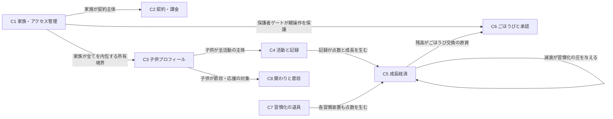

# M1 概念データモデル（Conceptual Data Model / ANSI-SPARC 概念層）— がんばりクエスト

> **状態**: M1 成果物 — **Round 1〜6 レビュー board（各 3 独立観点）指摘反映済**。応答台帳: `docs/design/dsql/m1-review-round{1..6}-ledger.md`。関連: EPIC #3424（DSQL 移管）/ ADR-0055（per-child 主軸 + 限定 family master）/ ADR-0050（保護者ゲート）。
>
> **Round 2 の主変更**: ①**PointLedger を Child 直下の独立集約に昇格**（裁量消費=同期整合、付与=結果整合）→ 残高非負の越境矛盾を根治。②**ポイント換金（convert）を第 2 の裁量消費オペレーションとして概念化**。③**Family も解体**（追記ログ・独立資源を衛星集約へ降格）。④§9 mermaid を修正し図文一致。
>
> **Round 3 の主変更**: ①**PointLedger を点数の唯一の権威（sole authority）に確定**（当初は無限定表現、Round 6 で経済点数値に限定）し、衛星の点数属性を非権威な観測値と位置づけ（集約境界での二重保持を封殺、I-LEDGER-AUTH / I-SATELLITE-RECON）。②**点数種別を代表例のみの列挙に是正**（値集合・CHECK・backend 差の確定は M3 の関心事）。③台帳エントリを役割別に分類（付与 / 裁量消費 / award 逆転 / 繰越）し I-BAL-NONNEG を裁量消費のみに限定（+ I-NEG-BAL）。④**固定間隔特別報酬を C7 概念に追加**。⑤基幹付与を exactly-once eventual と明示。
>
> **Round 4 の主変更（収束）**: ①**種別の個数を断言する表記の残渣 2 箇所を撤去**（§4.2 PointLedger 行・§6 code スケッチ）＝ Round 3 で是正したはずの過剰主張の再発 + I-CONSUME との数矛盾を根絶（grep 確認済）。②**I-SATELLITE-RECON の scope を明記**（reconcile 対象は総額観測値のみ・streak 計数は不変・乖離は基幹付与 land までの一時窓のみ・申請捕捉値は対象外）。③繰越を符号中立の残高保存事象として別立て、I-NEG-BAL/I-BAL に補強 1 行。
>
> **Round 5 の主変更（false universal の除去）**: ①**バトルの報酬を「戦果値」に改名し「PointLedger 付与でない非経済の内部演出値（残高に入らない）」と明記**（実装確認: バトルは台帳へ書かない）。②**I-SATELLITE-RECON の全称を訂正**（「観測値を持つ衛星付与は全て基幹」は偽＝バトルが反例）→「台帳エントリを生む経済的付与の総額観測値のみ reconcile 対象、バトル戦果値・streak 計数・申請捕捉値は scope 外」に scope 明示分類。③**no-silent-gap を精緻化**（「経済的付与のみ台帳経由、バトル戦果は非経済内部値」、悉皆の断言をしない）。
>
> **Round 6 の主変更（列挙→述語への構造転換）**: 3 ラウンドの [must] が同一根（点数次元の値を持つが台帳付与に裏付けられない観測値＝バトル戦果値・卒業 KPI スナップショット）だったため、列挙で塞ぐのをやめ**述語で根絶**。①§4.2 の付与要請衛星列挙から `Battle` を除去（§3.4/§5 との内部矛盾を解消）。②**I-SATELLITE-RECON を「台帳の経済的付与エントリに対応する衛星観測値のみ RECON 対象、台帳付与に裏付けられない点数次元の値は定義上 scope 外」の述語定義に転換**（新たな非台帳点数値が現れても自動的に scope 外、列挙漏れ根絶）。③**点数権威の無限定表現を経済点数値に限定**（I-LEDGER-AUTH / §3.3 / §4.2）。④卒業同意の nickname/message をドメイン内容、user_points/usage_period_days を KPI 派生（概念外プロジェクション）と明記。
>
> **層の位置づけ（ANSI-SPARC）**: 本書は **概念層（conceptual schema）** に限定する。「業務ドメインに何が存在し、どう関係し、どんな不変条件を満たすか」だけを述べる。**格納・物理表現（識別子の物理形式・索引・正規形の次数・格納フォーマット・トランザクション機構・分散配置・認証ベンダ名）は一切扱わない**。それらは後続 M3（物理設計）の責務で、既存の物理草稿 `docs/design/dsql-data-model.md` が M3 の入力である。
>
> **導出方針**: 概念は **製品ドメインから ground-up で導出**する。既存の型定義・スキーマ・設定 KVS（`src/lib/server/db/types/index.ts` / `interfaces/*.interface.ts` / `auth/entities.ts` / 各 service / `dsql-data-model.md`）は「現状の振る舞いを理解するための参照」であって anchor ではない。**DynamoDB single-table 時代の歪み（単一 opaque 識別子の一律強制・非正規な埋め込み・派生値の二重保持・暗黙のテナント導出・役割二重書き）は概念に持ち込まず、指摘して削ぐ**（§7）。
>
> **Round 1 で解消した最大の欠落**: 家族設定（従来 KVS）を §2 読み替え規則で処理せず暗黙に捨てていた（no-silent-gap 違反）。本版で §2 に読み替え行を追加し、§3/§5/§6/§7 で **BonusRule / ParentGate 認証 / DecayPolicy / PointConversionPolicy / ApprovalPolicy / NotificationSettings / LoyaltyState / DefaultChildSelection / AccountLifecycle** を概念昇格、UI 状態を概念外と明示した。

---

## §1 ドメイン概要と境界づけられたコンテキスト

### §1.1 プロダクトの中核業務概念

がんばりクエストは「**家庭内で、子供の日々の活動を RPG 風ゲーミフィケーションで動機づける**」プロダクト。背骨の因果連鎖:

1. **家族（テナント）** が閉じた単位で、中に **子供** と **保護者** が居る。
2. 子供が **活動・チェックリスト・チャレンジ・バトル・ログイン等** を **記録** する。
3. 記録は **ポイント（点数経済）** を生み、同時に **ステータス（カテゴリ別の成長度）** を育てる。ステータスは放置すると **減衰** する（習慣化の圧）。
4. たまったポイントを **ごほうび** と交換し（残高を消費）、成長は **証書** 等で可視化される。
5. 家族は子供を **応援** し、**見守り**、いずれ **卒業** する。

このうち **「記録 → ポイント + ステータス + 習熟」** が最頻・最重要のトランザクション整合単位であり、概念整合の核となる。**保護者による操作の保護（保護者ゲート）** と **契約（課金）** が家族の外郭を成す。

### §1.2 境界づけられたコンテキスト（Bounded Context）

| # | コンテキスト | 業務上の関心事 | 主要概念 |
|---|---|---|---|
| **C1** | **家族・アクセス管理** | 誰が家族に属し、どの役割で、何に同意し、どう本人確認・保護者確認するか | 家族、利用者、所属、招待、同意、保護者ゲート認証、メールログインロック |
| **C2** | **契約・課金** | 家族の現プラン・契約状態・トライアル履歴・ロイヤルティ・解約 | 契約状態、プラン、トライアル履歴、ロイヤルティ、解約理由 |
| **C3** | **子供プロフィール** | 子供は誰で、何歳で、どの年齢帯モード・見た目か | 子供、年齢帯、テーマ、アバター参照、休養日 |
| **C4** | **活動と記録** | 子供が何をして、いつ記録したか | 子供の活動、活動記録、習熟度、ピン留め、今日のミッション、カテゴリ |
| **C5** | **成長経済** | 記録がどう点数・成長・減衰・評価に変換されるか | ポイント台帳、残高（派生）、ステータス、ステータス履歴、減衰方針、基準値、週次評価、ボーナスルール |
| **C6** | **ごほうびと承認** | 何と交換でき、保護者がどう承認し、残高がどう消費されるか | ごほうび、交換申請、承認方針、ポイント換算方針 |
| **C7** | **習慣化の道具** | 反復・継続を支える仕組み | チェックリスト（家族マスタ＋配信＋進捗）、チャレンジ、スタンプカード、ログインボーナス、バトル |
| **C8** | **家族の関わりと節目** | 応援・見守り・節目の祝福・通知 | 保護者メッセージ、きょうだい応援、証書、卒業同意、通知設定・購読・ログ、メディア参照 |

> **境界根拠**: C1/C2 は「家族 1 主体」の内側だが**言語が異なる**（C1=同意・役割・招待・保護者確認 = 認可/法務語彙、C2=プラン・請求 = 課金語彙）ため分ける。C4 と C5 は「記録 1 イベントが両方を同時に動かす」ため整合結合が最強（§5 I-REC）。C7 の各習慣装置は独立記録源で、いずれも C5 の点数経済に合流する。

### §1.3 Context Map



**関係の性質**: **家族（C1）が最上位の所有境界**であり、C2〜C8 のあらゆる概念は「ちょうど 1 つの家族に属する」（I-CHILD-FAM の全域性）。DynamoDB 遺産「テナント識別子の暗黙導出」は概念的に**例外なき明示所有**へ正す（§7 L-01）。

---

## §2 導出の前提（読み替え規則）

物理・既存構造 → 概念の対応。以降のモデルは右列語彙のみで記述する。

| 既存（物理・参照） | 概念モデルでの扱い |
|---|---|
| 代理整数識別子 + 採番カウンタ + 辞書順パディング | 概念的 **同一性（identity）**。自然な同一性を持つ概念（ステータス=子供×カテゴリ 等）は**その自然同一性**で語る。持たない概念のみ「固有の同一性を持つ」とだけ言う（物理形式は M3） |
| テナント識別子列の有無・暗黙導出 | すべての概念は **所属する家族**を持つ（例外なし）。導出経路は概念では不問 |
| 埋め込み文書（items/scores/config 等） | **構成要素を独立概念 or 値オブジェクト**へ展開。単独で参照・検索・集計される、または**他概念から参照される**要素は独立概念、原子的に丸ごと読み書きされ不検索の不透明値のみ値オブジェクト（Q-04 決裁基準） |
| **家族設定 KVS（旧 settings、任意キー→文字列）** | **各キー群を意味あるドメイン概念へ展開**（BonusRule / ParentGate 認証 / DecayPolicy / PointConversionPolicy / ApprovalPolicy / NotificationSettings / LoyaltyState / AccountLifecycle / DefaultChildSelection 等）。**クライアント都合の一過性フラグ（チュートリアル既読・歓迎表示済・モーダル表示済 等）はドメイン概念外**と明示（§7 L-14）。**KVS を暗黙に捨てない**（no-silent-gap） |
| 残高の二重保持（合計値の別保持 vs 都度合算） | **残高は派生量**（点数台帳の意味論的総和）。独立事実として持たない（§5 I-BAL / I-DERIVED） |
| 派生集計の read-model（日次サマリ） | ドメイン概念でない。**派生プロジェクション**として除外（§7 L-07） |
| 楽観版数・更新機構・署名セッション | 整合／認証の**実現手段**。概念では不変条件だけを述べ、機構は M3。**署名セッション（保護者ゲート）は無状態でドメイン永続概念でない**（§7 L-14 注） |
| 役割の二重書き（隣接文書） | **単一の所属関係**（利用者×家族に役割 1 つ） |
| 年齢の格納列 | **生年月日からの派生量**。独立事実として持たない（§5 I-AGE） |
| 認証プロバイダのベンダ名リテラル | **認証プロバイダ（値集合）** という概念語で扱う（特定ベンダ名を概念に持ち込まない） |

---

## §3 ER モデル（概念）

> 記法: mermaid `erDiagram`。属性は業務的に意味ある主要属性のみ。関係ラベルは業務語 + 多重度 + 参加制約（必須/任意）。

### §3.1 C1 家族・アクセス管理 / C2 契約・課金

```mermaid
erDiagram
  FAMILY ||--o{ MEMBERSHIP : "所属を持つ(1家族:N所属)"
  USER   ||--|| MEMBERSHIP : "所属を通じ家族に加わる(現行は1利用者=1所属を厳密に encode)"
  FAMILY ||--o{ INVITE : "招待を発行する(1:N)"
  FAMILY ||--o{ CONSENT : "同意記録を蓄積(1:N, 追記のみ)"
  USER   ||--o{ CONSENT : "同意した本人(1:N)"
  FAMILY ||--|| PARENT_GATE_CREDENTIAL : "保護者ゲート認証を1つ持つ(1:1)"
  USER   ||--o| EMAIL_LOGIN_LOCKOUT : "メール単位のログインロック(1:0..1, 家族非依存)"
  FAMILY ||--|| SUBSCRIPTION_STATE : "唯一の契約状態(1:1)"
  FAMILY ||--o{ TRIAL_HISTORY : "トライアル履歴(1:N)"
  FAMILY ||--o{ CANCELLATION_REASON : "解約理由(1:N, 追記のみ)"
  FAMILY ||--|| LOYALTY_STATE : "ロイヤルティ状態(1:0..1)"
  FAMILY ||--|| ACCOUNT_LIFECYCLE : "アカウント状態機械(1:1)"

  FAMILY { string 家族名; datetime 作成日時; datetime 最終活動日時 }
  USER { string メールアドレス; ref 認証プロバイダ; string 表示名 }
  MEMBERSHIP { enum 役割; datetime 参加日時; ref 招待者 }
  INVITE { enum 付与役割; enum 状態; string 宛先メール; ref 対象の子供; datetime 有効期限 }
  CONSENT { enum 種別; string 版; datetime 同意日時; valueobject 取得時環境 }
  PARENT_GATE_CREDENTIAL {
    secret 保護者PIN "秘匿・平文非保持(照合可能な形)"
    number 連続失敗回数
    datetime ロック解除時刻 "任意"
    marker リセット適用痕跡 "運用リセットの冪等印"
  }
  EMAIL_LOGIN_LOCKOUT { string 対象メール; number 連続失敗回数; datetime ロック解除時刻; datetime 最終失敗時刻 }
  SUBSCRIPTION_STATE { enum 契約状態; ref プラン; datetime プラン有効期限; datetime トライアル使用日時 }
  LOYALTY_STATE { number 継続月数; number 記念チケット数; string 最終加算月 }
  ACCOUNT_LIFECYCLE { enum 状態 "active/soft-deleted(grace)/purged"; datetime 論理削除日時; ref 猶予プラン層; date 物理削除予定日 }
```

- **保護者ゲート認証（ParentGateCredential）**は家族単位（ADR-0050）。**署名セッション自体は無状態（ドメイン永続概念でない）**ため ER に持たない。永続する認証状態は「PIN 資格・失敗回数・ロック期限・運用リセット痕跡」のみ。PIN リセットは検証済みワンタイム確認を前提とする（§5 I-PIN-RESET、確認自体も無状態）。
- **メールログインロック（EmailLoginLockout）は家族非依存・メール単位**で、保護者ゲート PIN ロック（家族単位）とは**別機構**（閾値も別。概念では「別々の失敗上限・ロック期間を持つ 2 機構」とだけ言う。数値は M3）。
- **役割の多重度**: 1 家族に owner **ちょうど 1 名**（I-OWN）。1 利用者は**現行では 1 家族に所属**（ER も下限 1 で「必ず所属」を表し、上限は現行 single。将来の複数家族所属＝M:N の反転影響は §9、決裁 Q-07=A）。
- **契約状態は家族の属性（1:1、Q-01=A）**。プランは**増減しうる集合**の 1 値。トライアル使用日時は二度取り禁止（I-SUB）。

### §3.2 C3 子供プロフィール / C4 活動と記録

```mermaid
erDiagram
  FAMILY ||--o{ CHILD : "子供を擁する(1:N)"
  CHILD  |o--o| MEMBERSHIP : "ログインする子供は所属を持つ(子供0..1 ⇔ 所属0..1, role=child)"
  CHILD  ||--o{ CHILD_ACTIVITY : "自分の活動を所有(1:N, per-child)"
  CATEGORY ||--o{ CHILD_ACTIVITY : "活動のカテゴリ(1:N)"
  CHILD_ACTIVITY ||--o{ ACTIVITY_LOG : "記録される(1:N)"
  CHILD_ACTIVITY ||--o| ACTIVITY_MASTERY : "習熟度が育つ(1:0..1)"
  CHILD_ACTIVITY ||--o| ACTIVITY_PREFERENCE : "ピン留め設定(1:0..1)"
  CHILD  ||--o{ DAILY_MISSION : "今日のミッション(1:N/日)"
  CHILD_ACTIVITY ||--o{ DAILY_MISSION : "ミッション対象の活動(1:N)"
  CHILD  ||--o{ REST_DAY : "休養日=減衰猶予日(1:N)"

  CHILD {
    string ニックネーム
    date 生年月日 "任意だが年齢/年齢帯導出の源"
    enum 年齢帯モード "手動固定でなければ年齢から派生"
    bool 年齢帯を手動固定したか
    string テーマ
    ref アバター画像参照 "任意, バイトはドメイン外"
    valueobject 表示構成 "個別の意味ある属性へ展開"
    number 誕生日ボーナス倍率
    number 前回誕生日ボーナス付与年 "任意"
    bool アーカイブ済か
    enum アーカイブ理由 "任意(例: ダウングレード選択)"
  }
  CHILD_ACTIVITY {
    string 名称; string アイコン; number 基礎ポイント
    enum 優先度 "must(今日のおやくそく)/optional"
    number 1日あたり上限; bool メインクエストか; bool 表示するか
    ref 取込元テンプレート "任意(帰属記録)"
  }
  ACTIVITY_LOG {
    date 記録日; datetime 記録日時; number 付与ポイント
    number 連続日数 "記録時に確定した観測値(不変)"
    number 連続ボーナス "記録時に確定した観測値(不変)"
    bool 取消済か
  }
  ACTIVITY_MASTERY { number 累計回数; number 習熟レベル "累計回数の関数" }
  CATEGORY { string コード "自然同一性(運動/勉強/生活/交流/創造)"; string 名称 }
  REST_DAY { date 対象日; string 理由 }
```

- **子供と利用者/所属の関係（I-CHILD-USER）**: 子供は**ログインするなら**同一家族に role=child の所属を**ちょうど 1 つ**持ち、逆も成り立つ。**ログインしない子供は利用者・所属を持たない**（任意参加）。旧「子供が利用者を紐づける」経路と「role=child の所属」の 2 源の整合規則を本条で確定。
- **per-child instance の徹底**（ADR-0055 / PO 判断）: 活動は子供ごとに 1 行所有。家族マスタ活動は存在しない（波及は事故であって機能でない）。兄弟共通化はコピー（上書き）。
- **記録の連続日数/連続ボーナス（streak）は「記録時に確定した観測値」**で、後から再計算しない不変の歴史的事実。記録の中核整合（I-REC）に**含まれ atomic に確定**する（後追い additive の連鎖 combo とは別、§5 I-STREAK-VS-COMBO）。
- **休養日（RestDay）= 減衰猶予日**: 宙に浮いていた概念の意味を確定。ある子供のある日を「その日はステータス減衰を止める」休みとして指定する（唯一の業務効果は減衰停止、§5 I-DECAY）。

### §3.3 C5 成長経済

```mermaid
erDiagram
  CHILD ||--o{ POINT_LEDGER_ENTRY : "点数増減が刻まれる(1:N, 追記のみ)"
  CHILD ||--o{ STATUS : "カテゴリ別ステータスを育てる(1:0..5)"
  CATEGORY ||--o{ STATUS : "ステータスのカテゴリ(1:N)"
  STATUS ||--o{ STATUS_HISTORY : "成長・減衰の履歴(1:N, 追記のみ)"
  CHILD ||--o{ EVALUATION : "週次評価(1:N)"
  EVALUATION ||--o{ EVALUATION_SCORE : "カテゴリ別スコア(1:N)"
  FAMILY ||--|| DECAY_POLICY : "減衰方針(1:1, family単位)"
  FAMILY ||--o{ BONUS_RULE : "ボーナスルール群(1:N, family master)"
  AGE_BENCHMARK ||--o{ STATUS : "年齢×カテゴリ基準値(参照)"

  POINT_LEDGER_ENTRY {
    number 増減量 "正=付与/負=裁量消費 or award逆転"
    enum 種別 "代表例は下記(値集合の確定はM3)"
    string 説明; ref 由来参照 "任意(弱い業務参照)"; datetime 発生日時
  }
  STATUS { number 累計XP "成長総和−減衰総和"; number レベル "累計XPの関数"; number 到達最高XP }
  STATUS_HISTORY { number 変化量; enum 変化種別 "gain/daily_decay 等"; number 変化後の値; datetime 記録日時 }
  EVALUATION { date 週の開始; date 週の終了; number ボーナスポイント }
  EVALUATION_SCORE { number スコア }
  DECAY_POLICY { enum 強度 "none/gentle/normal/strict(4段階)"; number 猶予日数 }
  BONUS_RULE { enum 条件種別; valueobject 発火条件; number 加算点or倍率; bool 有効か }
  AGE_BENCHMARK { number 年齢; ref カテゴリ "カテゴリ別基準値の弁別子(U-1決裁: age×category)"; number 平均; number 標準偏差 }
```

- **PointLedger は経済点数値（残高＝台帳総和を構成する点数）の唯一の権威（sole authority）**（Round 3 構造決定、Round 6 で無限定表現を経済点数値に限定）。ある子供が「いつ何点得た/使ったか」の正本は PointLedger エントリだけであり、残高は「全エントリ増減量の意味論的総和」という**派生量**（I-BAL、PointLedger のみから導出）。**衛星集約が持つ経済点数属性（活動記録の付与ポイント / チェックリスト達成の付与ポイント / ログインボーナスの付与ポイント / 週次評価のボーナスポイント 等）は、記録時に捕捉した非権威な表示用観測値**（streak と同格の captured observation）であって、残高計算の source ではない。権威と観測値が食い違ったら PointLedger を正とする（§5 I-LEDGER-AUTH / I-SATELLITE-RECON）。**非経済の演出値（バトル戦果値）・KPI スナップショットは本条の対象外**（台帳に入らない）。DynamoDB の残高別保持＋手動加算は削ぐ（§7 L-03）。
- **台帳エントリの役割別分類（付与 / 裁量消費 / award 逆転 / 繰越）** — 各種別は代表例のみ示す（**種別の値集合・CHECK 制約・backend 差の確定は M3 の関心事**であり概念モデルの本質ではない）:
  - **付与（正）**の代表例: `activity`（活動記録の基礎点。**ボーナスルール・連続ボーナス・習熟ボーナス（masteryBonus）はこの額に畳み込む**）/ `combo_bonus`（同日連鎖の装飾 additive）/ `weekly_bonus`（週次評価）/ `login_bonus` / `checklist` / `stamp_card` / `child_challenge` / `must_completion_bonus`（今日のおやくそく完了、独立 additive）/ `special_reward`（**現在は新規発行なし**。過去に発行された履歴行のみ、§3.4）/ `cheer` など。
  - **no-silent-gap の精緻化（Round 5 [must]、全称の訂正）**: 「C7 習慣装置の**各達成が悉く**PointLedger 付与になる」わけではない。**経済的付与（残高に入る点数）だけが台帳経由**であり、**バトルの戦果値のような非経済の内部値は台帳に入らない**（§3.4、実装確認: バトルは台帳へ書かない）。したがって「習慣装置由来でも、経済的付与に限り PointLedger 事象になる／非経済の内部演出値は台帳外」と分類する（悉皆の断言はしない）。
  - **裁量消費（負）**（Round 3 #3）: `reward_redemption`（ごほうび交換）/ `convert`（ポイント換金） — 子供が意図的に残高を使う。**同期整合 + I-BAL-NONNEG 適用**。
  - **award 逆転（負）**（Round 3 #3）: `cancel` / `checklist_cancel` — 記録取消の正当な補正（付与の逆符号を刻む）。**I-BAL-NONNEG を適用しない**（正当なバイパス。ただし負残高中の新規裁量消費は禁止、I-NEG-BAL）。
  - **繰越（符号中立の残高保存事象）**: `carryover` — retention 間引き時に削除分の合算を刻み**総和を保存する**（残高を変えないための保存事象で、消費でも付与でもない中立イベント、§7 L-03 / I-DERIVED）。
  - **backend 差は M3 で確定**する（例: sqlite は今日のミッション完了を `daily_mission` 付与に畳み込むが DSQL cutover 後経路は `mission_bonus` 独立 type。概念上は「ミッション完了の付与事象」で 1 つ、物理 type と CHECK 集合の確定は M3）。
- **ステータスは「成長総和 − 減衰総和」**（I-STATUS 訂正）。減衰は日次に走る家族方針（DecayPolicy: 強度 4 段階 + 猶予日数）で、休養日・活動直後の猶予中は止まる（I-DECAY）。減衰も成長も STATUS_HISTORY に追記される。
- **ボーナスルール（BonusRule）は family master 概念**（ADR-0055、marketplace 取込プリセット由来、記録時に同期評価され LIVE）。その効果は**記録の中核整合内で activity の付与点に反映**（別台帳エントリでない）。
- **週次評価（Evaluation）**はカテゴリ別スコアの束を持ち、ボーナス点（`weekly_bonus`）を台帳に生む。旧スコア埋め込み文書を独立要素へ展開（§7 L-04）。
- **retention（間引き）で残高不変**（#729）: 消去分は `carryover` 種別に畳み込み総和を保存（I-DERIVED の一般則）。

### §3.4 C6 ごほうびと承認 / C7 習慣化の道具

```mermaid
erDiagram
  CHILD ||--o{ SPECIAL_REWARD : "自分のごほうびを持つ(1:N, per-child)"
  CHILD ||--o{ REDEMPTION_REQUEST : "交換を申請する(1:N)"
  SPECIAL_REWARD |o--o{ REDEMPTION_REQUEST : "申請対象(0..1:N, ごほうび削除後も申請存続)"
  FAMILY ||--|| APPROVAL_POLICY : "承認方針(1:0..1, 自動承認可否)"
  FAMILY ||--|| POINT_CONVERSION_POLICY : "ポイント換算方針(1:0..1)"

  FAMILY ||--o{ CHECKLIST_TEMPLATE : "家族マスタとして所有(1:N)"
  CHECKLIST_TEMPLATE ||--o{ CHECKLIST_ITEM : "項目を含む(1:N)"
  CHECKLIST_TEMPLATE }o--o{ CHILD : "配信される(M:N=assignment)"
  CHILD ||--o{ CHECKLIST_LOG : "日次の達成記録(1:N)"
  CHECKLIST_TEMPLATE ||--o{ CHECKLIST_LOG : "どのテンプレの達成か"
  CHECKLIST_LOG ||--o{ CHECKLIST_ITEM_RESULT : "項目別チェック結果(1:N)"
  CHILD ||--o{ CHECKLIST_OVERRIDE : "その日だけの項目増減(1:N)"

  CHILD ||--o{ CHILD_CHALLENGE : "自分のチャレンジ(1:N, per-child)"
  CHILD ||--o{ STAMP_CARD : "週次スタンプカード(1:N)"
  STAMP_CARD ||--o{ STAMP_ENTRY : "押印(1:N, 枠ごと)"
  STAMP_MASTER ||--o{ STAMP_ENTRY : "スタンプ種別(参照, おみくじ枠は任意)"
  CHILD ||--o{ LOGIN_BONUS : "日次ログインボーナス(1:N)"
  CHILD ||--o{ DAILY_BATTLE : "日次バトル(1:N)"
  CHILD ||--o{ ENEMY_COLLECTION : "討伐図鑑(1:N)"

  SPECIAL_REWARD { string 名称; string 説明; number 必要ポイント; enum 陳列系統; ref 付与者 }
  REDEMPTION_REQUEST {
    enum 状態 "申請中/承認/却下/失効"
    string 申請時のごほうび名称 "捕捉した歴史的値(不変)"
    number 申請時の必要ポイント "捕捉した歴史的値(不変)"
    datetime 申請日時; string 保護者メモ
  }
  APPROVAL_POLICY { bool 自動承認するか }
  POINT_CONVERSION_POLICY { enum 単位表示モード; string 通貨; number 換算レート }
  CHECKLIST_TEMPLATE { string 名称; number 項目あたりポイント; number 全完了ボーナス; enum 時間帯 }
  CHECKLIST_ITEM { string 名称; enum 頻度; enum 方向 }
  CHECKLIST_LOG { date 対象日; bool 全完了か; number 付与ポイント }
  CHECKLIST_ITEM_RESULT { ref 対象項目; bool チェック済か }
  CHECKLIST_OVERRIDE { date 対象日; enum 操作 "追加/削除"; string 項目名; string アイコン }
  CHILD_CHALLENGE {
    string 題名; enum 期間種別; date 開始日; date 終了日
    valueobject 目標条件 "指標/対象カテゴリ/目標値へ展開"
    valueobject ごほうび条件 "点数/メッセージへ展開"
    number 現在値; number 目標値 "年齢調整済"; bool 達成済か; bool ごほうび受領済か
    ref 連動グループキー "任意(きょうだい表示用)"
  }
  STAMP_CARD { date 週の開始; date 週の終了; enum 状態; number 交換ポイント }
  STAMP_ENTRY { number 枠番号; date 押印日; enum おみくじ結果 "任意" }
  LOGIN_BONUS { date ログイン日; enum ランク; number 付与ポイント; number 連続日数 }
  DAILY_BATTLE { number 敵識別; date 日付; enum 状態; enum 勝敗; number 戦果値 "バトル内部の演出値・台帳付与でない・残高に入らない"; valueobject 戦闘時ステータス }
  ENEMY_COLLECTION { number 敵識別; datetime 初討伐日時; number 討伐回数 }
```

- **交換申請とごほうびの関係は任意参加**（0..1 : N）: ごほうび定義を削除しても申請は存続する（I-REDEEM の歴史性）。申請は申請時点の名称・必要ポイントを**不変に捕捉**する。
- **承認 = 残高消費**（I-REDEEM-CONSUME）: 交換申請の承認は、必要ポイント分の**負の台帳エントリ（種別 `reward_redemption`）を 1 件**生む。承認は**残高が十分なときのみ**成立し、残高は**非負を保つ**（I-BAL-NONNEG）。自動承認するか否かは家族の承認方針（ApprovalPolicy）。
- **ポイント換金（convert）は残高を実際に消費するオペレーション**（I-BAL-NONNEG 従属、`reward_redemption` と並ぶ **2 つ目の裁量消費経路**）: 換金は残高不足を拒否し、換金額分の**負の台帳エントリ（種別 `convert`）を 1 件** PointLedger に刻む（残高が親子経済上の「お小遣い」に変換される）。**表示上の換算に矮小化しない**（実残高が減る）。
  - **概念上の目標（invariant）と現行 realization の分離（Round 3 [should]）**: 「残高十分時のみ成立＝overspend 不能」は**概念上の目標不変条件**であって、現行実装の測定事実ではない。現行 convert は残高読取→検査→追記が**非原子**（TOCTOU 窓あり）で、ごほうび交換が使う原子的消費オペレーションへ **M3 で収斂させることが必須**。M1 は目標不変条件を課し、原子化は M3 の realization に委ねる。
- **ポイント換算方針（PointConversionPolicy）は表示/レート方針として分離**: 「点数をどの通貨・単位・レートで見せ／換金するか」の家族方針であって、換金という**消費オペレーション自体（負エントリの発生）とは別概念**。方針は換金額の算定に使われるが、残高を減らすのは換金オペレーション（上記）。
- **チェックリストのみ family master + 配信 + 進捗の 3 層**（ADR-0055 唯一の例外）。項目別チェック結果は旧項目埋め込みを展開（§7 L-04）。**当日上書き（CHECKLIST_OVERRIDE）は子供のその日の実効チェックリストを増減する**（特定テンプレに紐づかない、子供×日の項目調整）。
- **固定間隔特別報酬（FixedIntervalReward）は概念として存在しない**（#4172）: 活動記録 N 回ごとに特別ごほうび（SpecialReward）を自動発行し点を要請する習慣化装置は撤去された。**ごほうびショップの棚（SpecialReward）に行を作る主体は親のみ**であり、棚への陳列は PointLedger へ何も要請しない（26-ゲーミフィケーション設計書 §12.2）。達成の表現は点を発行しない通知（MILESTONES）が担う。
- **チャレンジは per-child instance**（#3195 週次自動生成一本化、競争モード撤去）。きょうだい連動は表示上の束ね（§7 L-06）。
- **スタンプカードは子供×週で 1 枚**（I-CHECK-1WK、決裁 Q-05: 季節カードは Pre-PMF scope 外として確定し本制約を採用）。押印はログイン起点で 1 日 1 押印（I-STAMP-1DAY）。
- **バトル**は日次で敵と戦い討伐図鑑が積まれる。戦闘時ステータスは値オブジェクト（Q-06=A）。**バトルの「戦果値」（勝＝ドロップ / 負＝なぐさめ、勝敗で決まる値）は PointLedger 付与ではない**（Round 5 [must]、実装確認: バトルは台帳へ一切書かず、戦果値はバトル行内にのみ保持され残高＝台帳総和に入らない）。ポイント経済と紛れないよう概念名を「戦果値」とし、`報酬ポイント` の語を避ける。→ バトルは C7 習慣装置だが、その戦果値は**非経済の内部値**であって §3.3 の「経済的付与は PointLedger 経由」の例外（下記 §3.3 no-silent-gap 精緻化）。

### §3.5 C8 家族の関わりと節目

```mermaid
erDiagram
  CHILD ||--o{ PARENT_MESSAGE : "保護者メッセージを受ける(1:N)"
  MEMBERSHIP ||--o{ PARENT_MESSAGE : "送信者(role=parent/owner)(1:N)"
  CHILD ||--o{ SIBLING_CHEER : "きょうだい応援(受け手, 1:N)"
  CHILD ||--o{ SIBLING_CHEER_SENT : "きょうだい応援(送り手, 1:N)"
  CHILD ||--o{ CERTIFICATE : "証書を授与(1:N)"
  FAMILY ||--o{ GRADUATION_CONSENT : "卒業(事例公開)同意(1:N)"
  CHILD ||--o{ CHARACTER_IMAGE : "生成キャラ画像参照(1:N, バイトはドメイン外)"
  CHILD ||--o{ CUSTOM_VOICE : "カスタム音声参照(1:N, バイトはドメイン外)"
  FAMILY ||--o{ PUSH_SUBSCRIPTION : "通知購読(1:N, 保護者のみ)"
  FAMILY ||--|| NOTIFICATION_SETTINGS : "通知設定(1:0..1)"
  FAMILY ||--o{ NOTIFICATION_LOG : "通知送信ログ(1:N, 追記のみ)"
  FAMILY ||--o{ VIEWER_TOKEN : "閲覧専用リンク(1:N)"
  FAMILY ||--o{ CLOUD_EXPORT : "クラウド共有エクスポート(1:N)"
  FAMILY ||--o{ USAGE_LOG : "利用ログ(1:N, 追記のみ, 対象子供は任意)"

  PARENT_MESSAGE { enum 種別 "stamp/text/reward_notice"; string 本文; string スタンプコード; number ボーナス点; datetime 送信日時; datetime 既読提示日時 }
  SIBLING_CHEER { string スタンプコード; datetime 送信日時; datetime 既読提示日時 }
  CERTIFICATE { enum 種別; string 題名; string 説明; datetime 授与日時; valueobject 付帯情報 "発行後不変" }
  GRADUATION_CONSENT { ref 対象の子供; string 公開表示名; string 卒業の言葉 "任意"; bool 事例公開同意; datetime 同意日時; number 卒業時点数KPIスナップショット "概念外プロジェクション"; number 利用期間日数KPIスナップショット "概念外プロジェクション" }
  NOTIFICATION_SETTINGS { bool リマインダ有効; string リマインダ時刻; bool 連続通知有効; valueobject 静音時間帯 }
  VIEWER_TOKEN { string ラベル; datetime 有効期限; datetime 失効日時 }
  CLOUD_EXPORT { enum 種別; string 受渡PIN; enum 状態 "pending/building/ready/failed"; datetime 有効期限; number ダウンロード回数; number 最大回数 }
  USAGE_LOG { ref 対象の子供 "任意"; enum 種別; datetime 発生日時 }
```

- **保護者メッセージの送信者は role=parent/owner の所属**（I-MSG-SENDER）。子供は送信者になれない。
- **きょうだい応援は同一家族内の別の子供間**（I-CHEER）。送り手・受け手を明示。
- **メディア（キャラ画像・音声・アバター）**: ドメインは**参照とメタのみ**、実バイトはドメイン外のテナント分離ストレージ（I-MEDIA-EXT / §7 L-08）。
- **通知購読は保護者役割のみ**（I-PUSH-ROLE）。通知設定（NotificationSettings）は家族方針。
- **利用ログは Family 集約に一本化**（対象子供は任意属性、§7 L-16。旧「Family/Child 両方に列挙」の二重帰属を解消）。
- **卒業同意（GRADUATION_CONSENT）の no-silent-gap（Round 6 [should]）**: `公開表示名`（nickname）・`卒業の言葉`（message）は事例公開のための**正当なドメイン内容**（同意記録に付随する子供由来のテキスト）。一方 **`卒業時点数`（user_points）・`利用期間日数`（usage_period_days）は同意時点の KPI スナップショット** であり、**L-07（日次サマリ read-model）と同型の概念外プロジェクション**（「ポジティブな解約」KPI 集計の派生値であって、点数経済の権威でも同意の本質でもない）。`卒業時点数` は経済点数の観測値に見えるが台帳付与でなく KPI スナップショットゆえ **I-SATELLITE-RECON の述語で自動的に scope 外**（§5）。

---

## §4 DDD 集約マップ（Child を所有スコープに再位置づけ）

> **Round 1 #5 反映（案 a、DDD 正道）**: 初版の Child 巨大集約スメルを、**Child を「所有スコープ（per-child = ADR-0055 の所有軸）」に位置づけ直し**、内側に複数の小集約を置く形へ解体した。各小集約は Child を**同一性参照**で指し、自身のトランザクション整合だけを守る。集約横断は結果整合 + 冪等。
>
> **Round 2 追加反映**:
> - **#1 PointLedger を Child 直下の独立集約に昇格**（初版の「台帳は GrowthJournal 所有」を廃止）＝**経済点数値（残高＝台帳総和を構成する点数）の唯一の権威**（Round 3、Round 6 で無限定表現を経済点数値に限定）。**裁量消費（負エントリ = reward_redemption / convert）だけは PointLedger 内で同期整合**（目標: 残高読取 → 負エントリ append を atomic ＝ overspend 不能、I-BAL-NONNEG）。**正の付与は、経済点数を生む衛星集約（GrowthJournal / StampCard / ChecklistProgress / ChildChallenge / FixedIntervalReward / login / focus / must / cheer 等。バトルは戦果値が非経済ゆえ台帳へ要請しない、§3.4）から PointLedger へ「点数事象を要請」する結果整合**。ただし**付与の配送保証は 2 水準**（Round 3 [should]）: **獲得の実体である基幹付与（activity 基礎点・checklist・login・challenge 達成 等）は guaranteed exactly-once eventual（欠落不可・冪等）**、**装飾的 additive（combo 等）は欠落許容（I-ADD）**。「付与は落ちてよい」の誤読を禁じる。これで §4「集約横断=結果整合」総則 ⇄ 残高非負の矛盾が「**裁量消費だけ同期・付与は（水準別に）結果整合**」として解消。
> - **#4 Family も解体原則を適用**（初版は Child のみ解体し Family を巨大集約のまま放置）。Family ルートは**不変条件を担う概念のみ**（所属・招待・契約・保護者ゲート・同意の現在値・家族方針）に絞り、**追記専用ログと独立ライフサイクル資源は Family を同一性参照する衛星集約に降格**する。

### §4.1 所有スコープ

| 所有スコープ | 意味 |
|---|---|
| **家族（Family）** | 最上位テナント境界。**Child と同様に所有軸として扱い（Round 2 #4）**、家族運用の追記ログ・独立資源は Family ルートでなく Family 参照の衛星集約に置く。Family ルートは不変条件概念のみ |
| **子供（Child）** | 家族内の**所有軸**（トランザクション整合の巨大単位ではない）。以下の小集約群が Child を同一性参照する（ADR-0055 per-child 主軸と一致） |
| **グローバル参照** | 家族に属さない共有参照（カテゴリ / スタンプ種別 / 年齢基準値 / 課金イベント冪等の観測点） |

### §4.2 集約一覧と境界の根拠（各々が独立した整合単位）

| 集約ルート | 所有 | 内包する子概念 | 境界（この単位で整合）の根拠 |
|---|---|---|---|
| **Family**（縮小後） | — | 所属、招待、保護者ゲート認証、契約状態、ロイヤルティ、アカウント状態機械、減衰方針、承認方針、換算方針、通知設定、ボーナスルール群、既定子供選択、**同意の現在値**（追記ログは衛星、下記） | アクセス・契約・家族方針の**不変条件**（owner ちょうど 1 名／契約状態 1 つ／保護者ゲート 1 つ／同意の現在値）**だけ**を家族単位で守る（#4 で追記ログ・独立資源を衛星へ降格）。**利用者（User）は家族に閉じない**（メール横断一意）ため独立参照、所属が家族×利用者を担う |
| **PointLedger**（Round 2 #1 独立昇格） | Child | 点数事象（付与 / 裁量消費(2経路) / award 逆転 / 繰越 の各種別、代表例は §3.3、値集合の確定は M3）、**派生残高** | **残高の非負（I-BAL-NONNEG）を守る唯一の境界**。裁量消費（reward_redemption/convert）は残高読取→負エントリ append を**この集約内で同期整合**（目標: overspend 不能）。基幹付与は exactly-once eventual、装飾 additive は欠落許容で受理。retention compaction（carryover 生成）もこの集約内 |
| **ChildProfile** | Child | 子供の属性（ニックネーム/生年月日/年齢帯/テーマ/アバター参照/アーカイブ状態/休養日） | 子供の identity と属性。他小集約の同一性アンカー |
| **GrowthJournal**（縮小後 = 成長状態） | Child | 活動記録、ステータス（+派生 XP/レベル）、ステータス履歴、活動習熟度 | **I-REC の atomic 境界**（記録・ステータス・習熟の同時整合）。**点数は含まない**（PointLedger へ付与事象を結果整合で要請、§4.3）。この集約の外は結果整合（combo/mission/challenge/証書/通知） |
| **ActivityCatalog** | Child | 子供の活動、ピン留め、今日のミッション | 記録の**設定**（何を記録できるか）。記録整合（GrowthJournal）とは別トランザクション |
| **StampCard** | Child | 押印（枠） | カード単位で押印を扱う局所整合。付与（stamp_card/stamp_instant）は PointLedger へ結果整合要請 |
| **ChecklistProgress** | Child | 日次達成記録、項目別結果、当日上書き | 子供の進捗整合。付与（checklist/checklist_cancel）は PointLedger へ結果整合要請 |
| **Battle** | Child | 日次バトル、討伐図鑑 | 1 日 1 戦の局所整合 |
| **RewardExchange** | Child | ごほうび、交換申請 | 交換申請の状態遷移。**残高消費は PointLedger 内同期**（I-REDEEM-CONSUME は PointLedger の消費オペレーションを呼ぶ）。承認可否の情報は当集約 |
| **ChildChallenge** | Child | チャレンジ（進捗 inline） | per-child チャレンジの局所整合。達成報酬（child_challenge）は PointLedger へ結果整合要請 |
| **ChecklistTemplate**（家族マスタ） | Family | 項目、配信（子供への割当） | 家族が所有するマスタ。進捗（子供側）と整合単位が別（ADR-0055 唯一の family master） |
| **グローバル参照** | — | カテゴリ、スタンプ種別、年齢基準値、課金イベント冪等観測点 | 家族に属さない共有参照。個別整合、テナント境界なし |

> **Child 衛星集約**: 保護者メッセージ・きょうだい応援・証書・キャラ画像/音声参照・**週次評価（Evaluation、weekly_bonus を PointLedger へ要請）**は、**Child を同一性参照する独立記録**で、GrowthJournal の atomic 境界外（結果整合・参照整合のみ）。§4.3 の I-REC を膨らませない。**これら衛星が持つ点数属性は非権威な観測値**（正本は PointLedger、I-LEDGER-AUTH / I-SATELLITE-RECON）。
>
> **Family 衛星集約（#4 対の注記）**: **追記専用ログ**（通知ログ・利用ログ・同意の追記履歴・トライアル履歴・解約理由）と**独立ライフサイクル資源**（通知購読 / 閲覧専用リンク / クラウドエクスポート / 卒業同意）は、**Family を同一性参照する衛星集約**に降格する。これらは Family ルートの不変条件（owner 数・契約・保護者ゲート）に同期整合を要さず、各々のライフサイクル（購読の失効・エクスポートの状態遷移・追記）を自集約で守る。**通知購読は購読元の所属（membership）を参照**（I-PUSH-ROLE の役割検証の依り所）。**同意は追記ログ（衛星）＋現在値の不変条件（Family ルート、I-CONS）** の 2 面で扱う（追記は衛星、最新値の解決は Family）。**carryover を生む retention compaction は PointLedger 集約内の操作**（Family でなく子供の台帳側）。

### §4.3 GrowthJournal の中核整合（I-REC）と PointLedger への付与要請

「活動を 1 回記録する」操作は、**GrowthJournal 内で次を同時に成り立たせる**（部分成立は不変条件違反）:

- 活動記録が 1 件生まれる（連続日数・連続ボーナスをその場で確定して載せる）。
- 対応カテゴリのステータス（累計 XP・レベル）が更新され、変化が履歴に残る。
- 活動の習熟度（累計回数・レベル）が更新される。

**点数の付与は GrowthJournal の atomic 境界に含めない**（Round 2 #1）: 記録が確定すると、基礎点（ボーナスルール・連続ボーナス・習熟ボーナスを畳み込んだ額）は **PointLedger へ `activity` 付与事象として要請**される。**この基幹付与は guaranteed exactly-once eventual（欠落不可・冪等）**であって「落ちてよい」結果整合ではない（Round 3 [should]、獲得の実体そのものだから）。GrowthJournal（成長状態）と PointLedger（残高）で atomic 境界を分けても、付与は非負制約に無関係のため境界越えの exactly-once 配送で整合が壊れない。装飾的 additive（combo 等）のみ欠落許容（I-ADD）。逆に**残高を減らす裁量消費（reward_redemption/convert）は PointLedger 内で同期整合**し overspend を不能にする（I-BAL-NONNEG、目標不変条件）。**概念層が規定するのは「衛星から PointLedger への付与方向」であって、その realization（同期に先 insert するか eventual に要請するか。例: 応援 cheer は現行 realization では台帳エントリを同期に先 insert する）は M3 の関心事**（Round 5 [note]、概念の向き規定と実装の同期/eventual を分離）。

**連鎖ボーナス（combo）・ミッション達成・チャレンジ進捗・証書・通知**も additive で中核整合に不要 → 結果整合（冪等・欠落許容、Q-08=A）。現行実装が複数副作用を整合単位なしで逐次実行し例外を握り潰す（`dsql-data-model.md` §8）のは**不変条件違反を許す設計**であり、M1 は「記録の中核 3 者（記録・ステータス・習熟）の同時整合 + 点数は PointLedger への冪等付与要請」を明示する（実現機構は M3）。

---

## §5 ドメイン不変条件一覧（意味論で記述）

| # | 不変条件（意味論） | 由来 |
|---|---|---|
| **I-OWN** | 1 家族に owner 役割の利用者がちょうど 1 名。parent/child は 0 名以上 | 認可の単一責任者 |
| **I-MEM** | 利用者が家族に所属するとき、その所属は単一の役割を持つ（役割の二重定義なし） | §7 L-09 |
| **I-CHILD-USER** | 子供がログイン利用者を持つなら、同一家族に role=child の所属がちょうど 1 つ存在し、逆も成り立つ。**ログインしない子供は利用者・所属を持たない**（任意参加） | Round 1 #4 |
| **I-PIN-LOCK** | 保護者ゲート PIN の連続失敗が家族ごとの上限に達すると、家族単位でロック期限まで照合を拒否する（メールログインロックとは別上限・別期間の別機構） | ADR-0050 / Round 1 #2 |
| **I-PIN-RESET** | 保護者ゲート PIN のリセットは、検証済みのワンタイム確認を伴うときのみ成立する（未検証のリセットは不成立）。運用起点のリセットは冪等（同一リセットが二度適用されない） | ADR-0050 #3070 / Round 1 #2 |
| **I-EMAIL-LOCK** | メールログインの連続失敗がメールごとの上限に達すると、そのメールをロック期限までロックする（家族非依存） | Round 1 #2 |
| **I-CONS** | 同意記録は**追記のみ**（変更・削除しない）。**ある家族・利用者・種別の「現在の同意」は衛星の追記ログから derived-on-read で解決する派生値**（最新同意日時のエントリ、残高 = 台帳総和と同水準の「都度導出」であり別保持しない）。認可判断時に最新値を同期読取する必要がある点も残高と同水準。**物理消去はアカウント全体削除時の consent 消去に限る唯一の例外**（retention の間引きとは別レイヤーで、retention は consent を対象にしない） | GDPR Art.7 / COPPA / Round 1 [should] / Round 3 [should] |
| **I-SUB** | 1 家族は同時に唯一の契約状態を持つ。状態遷移は trial→active→past_due→canceled 系の妥当な系列で、**トライアル使用日時は二度取り禁止**（一度使ったトライアルを再取得しない） | C2 / Round 1 [should] |
| **I-CHILD-FAM** | すべての子供スコープ概念は、その子供を通じて**必ずちょうど 1 つの家族に属する**（家族に属さない子供スコープ概念は存在しない）。**この全域性は全テナント所有導出の要石**であり、反転（複数家族）は局所変更でない（§9） | §7 L-01 / Round 1 #9 |
| **I-LOG** | 活動記録は必ず 1 つの活動に紐づく。記録主体の子供と活動所有者の子供は同一 | per-child |
| **I-LEDGER-AUTH**（台帳の唯一権威、経済点数に限定） | **本条の対象は経済点数（残高＝台帳総和を構成する点数）のみ**。ある子供の「いつ何点得た/使ったか」の正本は PointLedger エントリだけで、**衛星集約が持つ経済点数属性（活動記録・チェックリスト・ログインボーナス・週次評価 等の付与ポイント）は記録時に捕捉した非権威な表示用観測値**（streak と同格）であり残高・実績集計の source にしてはならない。**非経済の演出値（バトルの戦果値）・KPI スナップショット（卒業 KPI）は本条の対象点数属性でない**（そもそも台帳に入らず、権威争いが起きない）。DynamoDB の「同一事実の集約境界越え二重保持」を概念で禁じる（§7 L-03 の再導入を封殺） | Round 3 #1 / Round 6 [should] |
| **I-SATELLITE-RECON**（reconciliation の scope、述語定義） | **RECON 対象は「台帳の経済的付与エントリに対応する衛星観測値」だけ**と述語で定める。**台帳付与に裏付けられない点数次元の値は定義上 scope 外**（新たな非台帳点数値が現れても述語で自動的に scope 外になり、列挙漏れが起きない）。scope 外の値の例示（代表例、悉皆列挙ではない）: バトルの戦果値（非経済の内部演出値、§3.4）／卒業 KPI スナップショット（§3.5、L-07 型の概念外プロジェクション）／streak 日数等の歴史的計数（記録時確定の不変値、I-STREAK-VS-COMBO）／I-REDEEM の申請捕捉値（不変の歴史値）。対象観測値は基幹付与（exactly-once eventual）に対応し、対応台帳エントリ額に**結果整合で収束**する（乖離時は PointLedger を正）。**droppable な装飾 additive（combo 等）は観測値を持たず PointLedger エントリのみで表れる**（reconcile の対にならない）。**乖離は基幹付与が land するまでの eventual ラグの一時窓のみ**で land 後は恒常一致 | Round 3 #1 / Round 4 [should] / Round 5 [must] / Round 6 [must] |
| **I-BAL** | ある子供のポイント残高は、その子供の全台帳エントリ増減量の総和に意味論的に等しい。残高は独立事実として保持されず**PointLedger のみから派生**する（I-LEDGER-AUTH）。**基幹付与が land するまでの一時窓では、残高が稼得分を含まず過小表示になりうる**（overspend 安全と引き換えの獲得側ラグ。materialize 判断は M3） | §7 L-03 / Round 2 #1 / Round 4 [note] |
| **I-BAL-NONNEG**（裁量消費のみに適用する目標不変条件） | **残高非負は「裁量消費（reward_redemption / convert）」に対してのみ課す**。裁量消費は残高十分時のみ成立する（目標: PointLedger 内同期整合で overspend 不能。現行 convert の realization は非原子で M3 収斂必須、§3.4）。**award 逆転（cancel / checklist_cancel）は本制約をバイパスして良い**（記録取消の正当補正で残高が一時的に負になりうる）。**正の付与は非負制約に無関係**。この分離が §4 集約横断=結果整合 総則と両立する | Round 1 #12 / Round 2 #1 / Round 3 #3 |
| **I-NEG-BAL**（負残高中の消費禁止） | award 逆転で残高が負になっている間は、**新規の裁量消費（reward_redemption / convert）を成立させない**（負残高からさらに使わせない）。付与や更なる逆転は妨げない。**本条は I-BAL-NONNEG の負残高特化**（別制約でなく、逆転が非負制約をバイパスした後も裁量消費側の非負意図を守る補強） | Round 3 #3 / Round 4 [note] |
| **I-DERIVED**（派生量統一則） | **総和・畳み込みで定義される全ての量（残高／ステータス累計 XP／習熟累計回数）は、その量の事象履歴のフォールドに意味論的に等しい**。履歴を間引く場合は、フォールド結果を保存する要約事象（残高なら carryover、ステータスなら等価な履歴チェックポイント）を残し、量を不変に保つ。**物理的に materialize するか否かは M3 の判断**であり、概念ではこのフォールド等価則のみを課す（初版の「残高だけ派生・他は確定値保持」という非対称を撤廃） | Round 1 #8 |
| **I-STATUS** | ある子供の 1 カテゴリのステータスは高々 1 つ（子供×カテゴリで一意）。累計 XP は**そのカテゴリへの成長イベントの総和から減衰イベントの総和を引いた値**に整合する | §7 L-04 / Round 1 #3 |
| **I-DECAY** | ステータス減衰は日次に、家族の減衰方針（強度 4 段階）に従い、カテゴリごとに走る。ただし **(a) その子のその日が休養日、(b) 直近活動から猶予日数以内、(c) 強度が none のいずれか**では減衰しない。減衰は成長と同じ履歴に追記される | Round 1 #3 |
| **I-STREAK-VS-COMBO** | **連続（streak）** はある記録が「そのカテゴリ/活動を連続何日目に行ったか」を**記録時に確定する不変の観測値**で、記録の中核整合（I-REC）内に atomic に確定する。**連鎖（combo）** は同日複数活動に対する後追いの additive 効果で、独立した加算台帳エントリ（種別 combo_bonus）として結果整合で冪等に付与する。両者は別概念であり、同一事実を atomic 内外で二重定義しない | Round 1 #7 |
| **I-REC** | 活動 1 記録の中核効果（**記録・ステータス・習熟度の 3 者**）は、すべて成立するかすべて成立しないか（部分成立は違反）。**点数は中核に含めず**、確定後に PointLedger へ `activity` 付与事象を冪等に要請する（Round 2 #1）。基礎点への畳み込み対象は**連続ボーナス・ボーナスルール・習熟ボーナス（masteryBonus）**の 3 つ（＝独立台帳エントリを生まない）。一方 **今日のおやくそく完了ボーナス（must_completion_bonus）は独立の additive 付与**（activity に畳み込まれず、別の付与事象、I-ADD 準拠） | §4.3 / Round 2 [should] |
| **I-ADD** | 記録の追加的効果（combo / mission / **challenge の進捗（現在値、droppable）** / 証書 / 通知）は結果整合で冪等かつ加算的。ここでの bare `challenge` は**進捗（現在値・droppable）**を指し、**チャレンジ達成報酬（child_challenge の付与）は基幹付与（exactly-once eventual）**で本行の droppable 対象ではない。**「確定した事実から再導出可能」であることを要求するのは、状態を持たない効果（例: ミッション完了フラグは記録履歴から再判定できる）に限る**。状態を持つ台帳事実（streak/combo の付与済み点）は再導出でなく冪等な付与で守る。なお **ACTIVITY_LOG.連続ボーナスは `activity` 付与ポイント総額に subsume され**、その総額観測値として reconcile される（独立観測でなく基礎点に畳み込み済） | ADR-0012 / Round 1 #7 / Round 5 [note] |
| **I-AGE** | 子供の年齢は生年月日と現在時刻からの派生量であり、独立保持しない。年齢帯モードは手動固定でない限りその派生年齢から導かれる（誕生日跨ぎで自動遷移） | §7 L-10 |
| **I-CHECK-1WK** | 1 人の子供は 1 週間について**ちょうど 1 枚のスタンプカード**を持つ（季節・イベントカードは Pre-PMF scope 外として確定、Q-05=採用）。この自然同一性（子供×週）を保持する | §7 L-12 / Round 1 #11 |
| **I-STAMP-1DAY** | スタンプカードの押印は 1 日 1 押印（同一カードに同一日で複数枠を埋めない） | ログイン起点 |
| **I-LOGIN-1DAY** | ログインボーナスは 1 子供 1 日 1 回。連続日数はその系列から定まる | ADR-0012 |
| **I-BATTLE-1DAY** | 日次バトルは 1 子供 1 日 1 戦（勝敗確定 1 回） | ADR-0012 |
| **I-MISSION** | 今日のミッションは（子供・日付・活動）で一意。完了は additive（未達に罰なし）。完了状態は記録履歴から再導出可能（I-ADD 準拠） | §3.2 |
| **I-CHECKLIST** | 進捗（log）は（子供・テンプレ・対象日）で一意。配信されていないテンプレに対する子供の進捗は存在しない | ADR-0055 |
| **I-REDEEM** | 交換申請は申請時点のごほうび内容（名称・必要ポイント）を不変に捕捉する。ごほうび定義の後日の変更・削除は既存申請の捕捉値を変えない（申請はごほうびに対し任意参加） | §7 L-05 / Round 1 #12 |
| **I-CONSUME**（裁量消費経路の統一則） | **子供が意図的に残高を使う「裁量消費」は 2 経路のみ** = **ごほうび交換（reward_redemption）** と **ポイント換金（convert）**（award 逆転は裁量消費でない、別扱い）。いずれも PointLedger の消費オペレーションを呼び、負エントリをちょうど 1 件生み、残高十分時のみ成立（I-BAL-NONNEG 従属）。新たな裁量消費経路もこの統一則に従う | Round 2 #1 #3 / Round 3 #3 |
| **I-REDEEM-CONSUME** | 交換申請の承認は PointLedger の消費オペレーションを呼び、必要ポイント分の負エントリ（reward_redemption）をちょうど 1 件生む。承認は残高が十分なときのみ成立（I-BAL-NONNEG と一体）。自動承認方針が有効なら承認は申請と同時に成立しうる | Round 1 #12 |
| **I-CONVERT-CONSUME** | ポイント換金は PointLedger の消費オペレーションを呼び、換金額分の負エントリ（convert）をちょうど 1 件生む（残高が「お小遣い」に変換され実残高が減る）。残高十分時のみ成立（I-BAL-NONNEG 従属）。換算方針（PointConversionPolicy）は換金額算定の入力であって消費自体とは別概念 | Round 2 #3 |
| **I-CERT-IMMUT** | 証書は授与後、内容が変わらない | §3.5 |
| **I-CHEER** | きょうだい応援は送り手・受け手が同一家族内の別の子供 | intra-tenant 信頼境界 |
| **I-MSG-SENDER** | 保護者メッセージの送信者は role=parent/owner の所属に限る（子供は送信者になれない）。**かつ送信者の所属家族＝受信子供の家族**（家族をまたぐメッセージは存在しない、I-CHEER と対称の intra-family 制約） | Round 1 #13 / Round 2 [should] |
| **I-MEDIA-EXT** | メディアの実体はドメイン外に置かれ、ドメインは参照とメタのみ保持する。参照は所有子供の家族境界に閉じる | §7 L-08 |
| **I-PUSH-ROLE** | 通知購読は保護者役割（parent/owner）に限る（child は購読しない） | COPPA / ADR-0012 |
| **I-LIFECYCLE** | 家族アカウントは active → soft-deleted（猶予期間つき）→ {restored（猶予内のみ） \| purged（猶予満了）} の状態機械に従う。猶予日数は契約プラン層で定まる（無料層は即時消去） | Round 1 #10 |
| **I-PURGE** | 家族の purge は、その家族の全子孫概念（子供・記録・成長台帳・習慣装置・メディア参照・同意 等）を消し、**他家族には一切触れない**（cross-tenant 非到達）。**メディア参照が指すドメイン外の実体（子供の画像・音声バイト）の消去も purge の到達範囲**（実体はドメイン外だが消去責務は cross-cut、COPPA/GDPR。参照だけ消して実体を残さない） | Round 1 #10 / Round 3 [should] |
| **I-DOWNGRADE** | 契約を下位プランへ変更し上限（子供数・活動数・テンプレ数）を超える場合、超過分は**保護者が選択したものだけ**をアーカイブして上限内に収める（自動一括アーカイブではない。アーカイブ後に上限内へ収まることを満たさない選択は不成立） | Round 1 #10（実装実装確認で自動→ユーザー選択に訂正） |

---

## §6 概念 domain class スケッチ（格納非依存）

> 型・振る舞いの概念を TypeScript 風で示す（永続化・格納・索引・トランザクション機構・ベンダ名の語は使わない）。`ValueObject` は同一性を持たず値で等価判定。

```ts
type Role = 'owner' | 'parent' | 'child';

// ── C1/C2 家族・アクセス・契約 ─────────────────────────────
class Family {                       // 集約ルート
  readonly name: string;
  memberships: Membership[];         // I-OWN: role==='owner' ちょうど1
  invites: Invite[];
  consents: ConsentRecord[];         // I-CONS: 追記のみ
  parentGate: ParentGateCredential;  // I-PIN-LOCK / I-PIN-RESET（署名セッションは無状態=非保持）
  subscription: SubscriptionState;   // I-SUB: 唯一（Q-01=A: Family属性）
  loyalty: LoyaltyState;
  lifecycle: AccountLifecycle;       // I-LIFECYCLE
  decayPolicy: DecayPolicy;          // 家族単位の減衰強度
  approvalPolicy: ApprovalPolicy;
  pointConversion: PointConversionPolicy;
  notificationSettings: NotificationSettings;
  bonusRules: BonusRule[];           // family master（ADR-0055）
  defaultChildSelection?: Child;     // 親の既定選択（家族方針）

  inviteMember(role: Role, targetChild?: Child): Invite;
  acceptInvite(code: string, byUser: User): Membership;  // 期限内 & 宛先束縛を満たすときのみ
  transferOwnership(to: User): void; // I-OWN を保ちつつ owner を移す
  recordConsent(user: User, type: ConsentType, version: string): void; // 追記のみ
  downgradeTo(plan: Plan, archiveSelection: OwnedResource[]): Result;   // I-DOWNGRADE（選択制）
  requestSoftDelete(): void;         // I-LIFECYCLE: active→soft-deleted(grace)
  purge(): void;                     // I-PURGE: 全子孫消去・他家族非到達
}

class User {                         // 独立参照（Q-02=A）
  readonly email: string;            // 家族横断で一意
  readonly provider: AuthProvider;   // 認証プロバイダ（値集合、ベンダ名を概念に持ち込まない）
  displayName?: string;
  loginLockout?: EmailLoginLockout;  // I-EMAIL-LOCK（メール単位、家族非依存）
}
class Membership { readonly family: Family; readonly user: User; readonly role: Role; }
class ParentGateCredential {
  private secret: PinSecret;         // 秘匿・平文非保持
  failedAttempts: number; lockedUntil?: Date;   // I-PIN-LOCK
  verify(pin: string): boolean;      // ロック中は拒否
  resetWithVerifiedChallenge(newPin: string, proof: OneTimeProof): void; // I-PIN-RESET
}
class SubscriptionState {
  status: 'trial'|'active'|'past_due'|'canceled'|'free';
  plan?: Plan; planExpiresAt?: Date; trialUsedAt?: Date;   // I-SUB: 二度取り禁止
  isEntitledTo(feature: Feature): boolean;  // 権利は状態から算出、別保持しない
}
class AccountLifecycle {             // I-LIFECYCLE 状態機械
  state: 'active' | 'soft-deleted' | 'purged';
  softDeletedAt?: Date; graceUntil?: Date; gracePlanTier?: Plan;
  canRestore(): boolean;             // soft-deleted かつ 猶予内
}

// ── C3 子供（所有スコープ）─────────────────────────────────
class Child {                        // 所有スコープ（巨大集約ではない）
  nickname: string; birthDate?: Date;
  get age(): number | undefined;     // I-AGE: 派生（保持しない）
  get ageTier(): AgeTier;            // 手動固定でなければ age から導出（誕生日跨ぎ自動遷移）
  ageTierManuallyPinned: boolean;
  theme: string; displayConfig: DisplayConfig; // ValueObject（意味ある属性へ展開）
  avatar?: MediaRef;                 // I-MEDIA-EXT: 参照のみ
  archived: boolean; archivedReason?: ArchiveReason;
  linkedUser?: User;                 // I-CHILD-USER: あるなら role=child 所属とちょうど対応
  restDays: RestDay[];               // 減衰猶予日（I-DECAY 入力）
}

// ── C5 成長経済（Child 所有の小集約）───────────────────────
class PointLedger {                  // 独立集約ルート（Round 2 #1）— 残高不変条件の唯一の境界
  readonly child: Child;
  private entries: PointLedgerEntry[];// 追記のみ（付与 / 裁量消費 / award逆転 / 繰越 の各種別、代表例は §3.3、値集合の確定は M3）
  get balance(): number;             // = Σ entries.amount（I-BAL、別保持しない）
  award(event: PointAwardEvent): void;   // 付与: 結果整合で受理（冪等・加算的、非負制約なし）
  consume(amount: number, kind: 'reward_redemption'|'convert', ref?: DomainRef): Result;
    // 消費: 残高読取→負エントリ append を集約内で同期整合（I-BAL-NONNEG / I-CONSUME）。残高不足は不成立=overspend不能
  compactBefore(date: Date): void;   // I-DERIVED: 間引きは carryover で総和保存（当集約内）
}
class GrowthJournal {                // 集約ルート（I-REC の atomic 境界、点数は含まない）
  readonly child: Child;
  statuses: Status[];                // 子供×カテゴリで一意（最大5）
  mastery: ActivityMastery[];
  record(activity: ChildActivity, at: Date): RecordingOutcome;  // I-REC: 記録/ステータス/習熟を同時整合 → PointLedger へ activity 付与要請
  applyDailyDecay(policy: DecayPolicy, restDays: RestDay[]): void; // I-DECAY
}
class Status {                       // I-STATUS
  readonly category: Category;
  get level(): number;               // 累計XPの関数
  get totalXp(): number;             // = Σ成長 − Σ減衰（I-DERIVED）
  history: StatusHistoryEntry[];     // 追記のみ（gain / daily_decay）
}
class BonusRule {                    // family master（LIVE、記録時に同期評価）
  condition: BonusCondition;         // ValueObject
  bonusPoints?: number; multiplier?: number; enabled: boolean;
  // 効果は record() 内で基礎点に畳み込む（独立台帳エントリを生まない）
}

// ── C6/C7 ごほうび・習慣装置（Child 所有の小集約）──────────
class RewardExchange {               // 集約ルート
  readonly child: Child;
  catalog: SpecialReward[];
  requests: RedemptionRequest[];
  request(reward: SpecialReward): RedemptionRequest;  // 申請時に名称・必要点を捕捉（I-REDEEM）
  approve(req: RedemptionRequest, ledger: PointLedger, policy: ApprovalPolicy): Result;
    // I-REDEEM-CONSUME: ledger.consume(capturedPoints,'reward_redemption') を呼ぶ（残高非負は PointLedger 内で保証）
}
// ポイント換金は PointLedger の消費オペレーション（第2の消費経路、I-CONVERT-CONSUME）
//   convert(amount): ledger.consume(amount,'convert')。PointConversionPolicy は換金額算定の入力（別概念）
class RedemptionRequest {
  readonly capturedName: string; readonly capturedPoints: number;  // I-REDEEM: 不変捕捉
  status: 'pending' | 'approved' | 'rejected' | 'expired';
  rewardRef?: SpecialReward;         // 任意参加（削除後も存続）
}
class ChecklistTemplate {            // 家族マスタ（唯一の family master）
  name: string; items: ChecklistItem[]; assignedTo: Child[];  // M:N 配信
}
class ChecklistProgress {            // Child 所有（I-CHECKLIST: 配信前提）
  readonly template: ChecklistTemplate; readonly onDate: Date;
  results: ItemResult[]; completedAll: boolean;
}
class StampCard {                    // Child 所有（I-CHECK-1WK / I-STAMP-1DAY）
  weekStart: Date; entries: StampEntry[]; status: CardStatus;
  stamp(on: Date, master?: StampMaster): void;  // 1日1押印
}
```

**注記**: `PointLedger.balance` / `Status.totalXp` を getter（派生）にしているのは I-BAL / I-DERIVED の直接表現。`compactBefore` が「間引いても総和不変」を保証。`age` / `ageTier` の getter は I-AGE の表現。**PointLedger を GrowthJournal から分離**し `consume` を集約内同期・`award` を結果整合受理にしているのが Round 2 #1 の核（消費だけ overspend を防げばよい）。BonusRule・masteryBonus の効果は `record()` 内で基礎点へ畳み込み、その基礎点を PointLedger へ `activity` として付与要請する（実測: 独立台帳エントリを生まない）。must_completion_bonus は独立付与。

---

## §7 継承 vs 変更 対照表（既存 → 概念 + DynamoDB 遺産の指摘）

| # | 既存構造（参照のみ） | 概念モデル | 維持/変更 | 理由（DynamoDB 遺産の指摘を含む） |
|---|---|---|---|---|
| **L-01** | テナント識別子が一部概念にのみ存在・childId 暗黙導出 | 全子供スコープ概念は必ず 1 家族に属する（I-CHILD-FAM） | 変更 | 所有が暗黙・不揃いだった。概念では全域の明示所有に正す |
| **L-02** | 家族共有の活動マスタ + 年齢フィルタ（dead） | per-child instance の活動のみ | 変更（削ぐ） | 「1 編集で全子波及」の二重実装。波及要件は無い（ADR-0055） |
| **L-03** | ポイント残高の二重保持 + 手動加算 | 残高は派生量（I-BAL） | 変更（削ぐ） | 乖離事故の温床。台帳から一意に定まる |
| **L-04** | 埋め込み文書（項目/週次スコア/チャレンジ設定/表示構成/戦闘ステータス） | 参照・検索・集計対象は独立概念へ展開、不透明原子値のみ値オブジェクト（Q-04 基準） | 変更（展開） | JOIN 回避策。概念では意味を持つ要素を一級化 |
| **L-05** | ごほうび申請への内容コピー | 申請イベントの歴史的捕捉（I-REDEEM） | 維持 | 非正規化の悪でなく業務イベントの不変性 |
| **L-06** | きょうだいチャレンジ（家族横断 + 進捗配列） | per-child instance + 表示上の連動グループキー | 変更 | 家族横断・競争は撤去済（ADR-0012） |
| **L-07** | 日次サマリ派生集計 read-model | ドメイン概念から除外 | 変更（削ぐ） | GSI 回避の read-model・書込未配線。都度導出 |
| **L-08** | メディア実体保持 | 参照とメタのみ（I-MEDIA-EXT） | 維持（明文化） | 既に正しい外部分離 |
| **L-09** | 役割の二重書き | 単一の所属関係（I-MEM） | 変更（削ぐ） | 隣接リストの産物。片方成功で不整合 |
| **L-10** | 年齢の格納 | 生年月日からの派生（I-AGE） | 変更（削ぐ） | 誕生日で日次に陳腐化 |
| **L-11** | 実績・称号（achievements/child_achievements/title） | 概念から除外 | 変更（削ぐ） | 製品廃止済（#322）・データ不在 |
| **L-12** | 単一 opaque 識別子の一律強制 + 採番カウンタ + 辞書順パディング | 自然な同一性で語る（ステータス=子供×カテゴリ、スタンプカード=子供×週 等） | 変更 | index-organized KV の都合。自然同一性がある所はそれで語る（物理形式は M3） |
| **L-13** | 季節イベント / 月替わりプレゼント | 概念に存在しない（スタンプカードの季節版も Pre-PMF scope 外） | 維持（不在確認） | ADR-0012/0013 二重違反で撤去済。復活させない（Q-05 決裁） |
| **L-14** | **家族設定 KVS（旧 settings、任意キー→文字列）** | **キー群を概念昇格 or 概念外に線引き**（下記） | **変更（decompose）** | **Round 1 最大の欠落**。KVS を §2 で処理せず暗黙に捨てていた（no-silent-gap 違反）。物理草稿は Family 集約に settings を含む。**キーごとに (a) 概念昇格 / (b) UI 状態=概念外**へ振り分け:<br>**(a) 概念昇格**: 保護者ゲート認証（PIN 資格・失敗回数・ロック期限・運用リセット痕跡）＝ParentGateCredential ／ 減衰方針（強度 4 段階）＝DecayPolicy ／ ポイント換算（単位モード・通貨・レート）＝PointConversionPolicy ／ 承認方針（自動承認）＝ApprovalPolicy ／ 通知設定＝NotificationSettings ／ ロイヤルティ（継続月数・記念チケット）＝LoyaltyState ／ アカウント猶予（論理削除日時・猶予層・物理削除日）＝AccountLifecycle ／ ボーナスルール群＝BonusRule（family master）／ きょうだいランキング可否＝家族表示方針 ／ 既定子供選択＝DefaultChildSelection ／ ごほうびテンプレ・オンボーディング設問＝家族設定（軽微概念）／ ライフサイクルメール・PMF 調査の送達状態＝家族運用状態（追記/カウンタ）。<br>**(b) 概念外（UI 一過性フラグ）**: チュートリアル開始/完了/バナー既読、歓迎表示済、保護者ゲートオンボ既読、トライアルモーダル表示済、オンボーディング dismiss、本日推薦済 等のクライアント都合フラグ。<br>**(c) 概念外（無状態の実現手段）**: 保護者ゲート署名セッション（cookie ベースで永続概念でない、§2 注）。<br>**実装確認訂正**: 「level/称号の family カスタム設定」は KVS に**存在しない**（称号相当はロイヤルティ継続月数から導出）ため概念化しない |
| **L-15** | 保護者ゲート認証（PIN/lockout/session）が C1「認証を初めて概念化」から欠落 | ParentGateCredential（家族単位、I-PIN-LOCK/RESET）+ EmailLoginLockout（メール単位、I-EMAIL-LOCK）を C1 に追加。session は無状態 | 変更（追加） | Round 1 #2。PIN ロック（家族）とメールログインロック（メール）は別機構。ADR-0050 |
| **L-16** | 利用ログの集約二重帰属（Family/Child 両方に列挙） | Family 集約に一本化（対象子供は任意属性） | 変更 | Round 1 #6。所有の一意化 |
| **L-17** | ステータス減衰・休養日が未モデル（宙に浮く） | DecayPolicy（家族）+ RestDay（減衰猶予日）+ I-DECAY / I-STATUS 訂正（成長−減衰） | 変更（追加） | Round 1 #3。日次減衰は LIVE。REST_DAY の意味を確定 |
| **L-18** | 埋め込み判定が read パターン未検証 | Q-04 基準を実 read パターンで実装確認（申請捕捉値・週次スコア・項目結果は参照/集計され展開、証書付帯情報・戦闘ステータスは不透明で値オブジェクト） | 変更（実装確認） | Round 1 [must]#13 / Q-04 |
| **L-19** | ボーナス加点を独立台帳種別と想定（board 前提） | ボーナスルール・連続ボーナスは基礎点（activity エントリ額）に畳み込む（独立 `bonus` 種別なし）。実 additive 種別は combo_bonus/weekly_bonus/birthday_bonus 等 | 変更（実装確認訂正） | Round 1 #1 の board 前提を実装事実で訂正（§3.3 種別集合） |
| **L-20** | 誕生日ふりかえり（BirthdayReview）を live 概念と想定 | 未配線（型と生成定義のみ、書込/読取ゼロ）→**将来概念として除外**。実装済み誕生日概念は BirthdayBonus（台帳種別 birthday_bonus + 子供の前回付与年） | 変更（実装確認訂正） | Round 1 Q-03/N-1。§8.2 に将来化を残置 |
| **L-21** | ダウングレード超過の自動アーカイブと想定（board 前提） | 保護者が選択したものだけをアーカイブ（自動一括でない、I-DOWNGRADE） | 変更（実装確認訂正） | Round 1 #10 の board 前提を実装事実で訂正 |

**参照に留め継承しなかったことの確認**: 「変更（削ぐ）」項目（L-02/L-03/L-06/L-07/L-09/L-10/L-11/L-13）は現状理解のためだけに参照し概念へ持ち込まなかった。**単一 opaque 識別子の一律強制・非正規な埋め込み・派生値の二重保持・暗黙のテナント導出・役割二重書き**の 5 大歪みを排した。維持したのは業務的に正当な概念（申請の歴史的捕捉 L-05、メディア外部化 L-08、per-child 主軸 ADR-0055）のみ。**Round 1 で追加実装確認した結果、実装と異なる board 前提は事実側に訂正**した（L-19 ボーナスは畳み込み／L-20 BirthdayReview は未配線／L-21 ダウングレードはユーザー選択／保護者ゲートセッションは無状態）。

---

## §8 決裁済み論点（Round 1 board 収束）と残存論点

### §8.1 決裁済み（本版に反映済）

| # | 決裁 | 反映箇所 |
|---|---|---|
| Q-01 | **A: 契約状態は Family の属性（1:1）** | §3.1 / §4.2 / §6。webhook 冪等イベントは将来の課金複雑度材料としてグローバル参照に残す（§4.1/§4.2） |
| Q-02 | **A: 利用者は独立参照** | §4.2 / §6 |
| Q-03 | **A: 週次評価と誕生日ふりかえりは別概念**。**N-1 実装確認の結果 BirthdayReview は未配線（型と生成定義のみ、書込/読取ゼロ）** → **「将来概念（未実装）」として概念モデルから除外**（§7 L-20）。実装済み誕生日概念は BirthdayBonus（台帳種別 birthday_bonus + 子供の前回付与年）で GrowthJournal 台帳に反映済 | §3.3 / §7 L-20 / §8.2 |
| Q-04 | **A: 単独で参照/検索/集計されるか、他概念から参照される要素は独立概念に展開**。実 read パターンで実装確認（§7 L-18） | §2 / §7 L-04 L-18 |
| Q-05 | **季節カードを Pre-PMF scope 外と確定し I-CHECK-1WK を現行不変条件に採用** | §5 I-CHECK-1WK / §7 L-12 L-13 |
| Q-06 | **A: 戦闘時ステータスは値オブジェクト** | §3.4 |
| Q-07 | **A: 現行 single（1 利用者 1 家族）。ただし I-CHILD-FAM の要石扱い** | §3.1（ER を下限 1・現行 single に）/ §9 |
| Q-08 | **A: additive 欠落許容。ただし再導出可能要件は状態を持たない効果に限定**（streak/combo は冪等付与で守る） | §5 I-ADD / I-STREAK-VS-COMBO |
| Q-09 | **A: 同意の環境情報を保持（法的証跡）。データ最小化の注記付き**（必要性再評価は法務確認事項） | §3.1 / §5 I-CONS |
| Q-10 | **A: カテゴリはグローバル固定 5 軸** | §3.2 / §4.2 |

### §8.2 残存論点（M3 / 後続で判断）

- **N-1 BirthdayReview の将来化**: 未配線のため概念から除外したが、「誕生日ふりかえり（健康チェック + 抱負記録）」を将来実装する場合は、Evaluation とは別の年次ふりかえり概念として C8 に追加する（現時点では作らない）。
- **Q-09 同意環境情報のデータ最小化**: IP/UA を証跡として保持するか、同意日時+版+本人で足りるかは法務確認で最終決定（概念上は保持を既定、最小化は開放論点）。
- **複数家族所属の将来反転（Q-07 影響、§9）**: I-CHILD-FAM を M:N に反転する場合の影響は局所でない（要石）。
- **契約状態の業務語寄せ（note 級、Round 2 [should]）**: 契約状態の `past_due` / `canceled` は課金基盤由来の語彙に近い。UI・ドメイン記述では「支払い遅延」「解約済み」等の業務語に寄せる余地がある（概念上の状態集合は不変、表記のみ）。M3 / 用語 SSOT（terms.ts）で最終決定。

---

## §9 要石不変条件の反転影響（I-CHILD-FAM / 複数家族所属）

Q-07（現行 single）は「無痛で将来 M:N 化できる」ものではない。**I-CHILD-FAM（子供 → ちょうど 1 家族）は全テナント所有導出（L-01）の要石**であり、反転（1 利用者・子供が複数家族に属する）は次に波及する:

- **所有の一意性が崩れる**: 「この概念はどの家族のものか」が子供経由で一意に定まる前提（I-CHILD-FAM の全域性）が失われ、所有の明示（どの家族の文脈で読むか）を全アクセスで担う必要が出る。
- **保護者ゲート・認可の文脈が多重化**: 1 利用者が複数家族の保護者ゲートを持ちうる。
- **課金・上限の帰属が曖昧化**: ダウングレード上限（I-DOWNGRADE）や purge（I-PURGE の「他家族に触れない」）の境界が子供単位で家族をまたぐ。

→ **本版は Q-07=A（single）を採り、§3.1 の mermaid を `USER ||--|| MEMBERSHIP`（1 利用者=ちょうど 1 所属）に修正して記法と文言を一致**させた（Round 2 #5。初版は `||--|{`＝1..N で上限 1 を encode できておらず図文不一致だった）。将来 M:N 化する場合は、記法を `||--o{` 等へ緩め、上記波及を ADR で扱い、I-CHILD-FAM・I-PURGE・I-DOWNGRADE・保護者ゲートの再定義を同時に行う（局所変更にしない）。

---

## §10 M1 → M3 への引き渡し（scope 境界）

本書（M1 概念層）が意図的に扱わなかったもの（すべて M3 の責務、`dsql-data-model.md` が該当）:

- 識別子の物理形式（自然複合 or 代理、生成方式）、索引、covering、正規形の次数。
- トランザクション機構・楽観制御・整合の実現手段（不変条件 I-* の**実現方法**）。**特に I-BAL/I-DERIVED の materialize 判断**（派生量を物理的に保持するか都度畳み込むか）は M3。
- 分散配置・テナント物理共置・格納フォーマット・メディアストレージ具体・認証ベンダ・署名セッション機構。
- 2 バックエンド（クラウド / ローカル）の方言差、マイグレーション、fitness function。
- **点数種別の値集合・CHECK 制約・backend 差**（sqlite 畳込み ⇄ DSQL 独立 type 等）の確定（§3.3）。
- **marketplace 公開プリセット（5 type: 活動 / ごほうび / チェックリスト / ルール / チャレンジのテンプレート）は、テナント外で共有される公開参照であり M1（家族内ドメイン）の scope 外**（Round 3 [should]、暗黙の no-silent-gap を明示的に閉じる）。取込はコピー上書きで per-child instance を生む（帰属記録のみ残す、ADR-0055 / `data-model-resource-scope.md`）。公開プリセット自体のモデル・配信・課金は別 scope で扱う。

M3 は本書の **§4 集約境界・§5 不変条件・§7 の「削ぐ」判断・§8 決裁**を入力とし物理へ写像する。§8.2 残存論点に対応する物理判断は暫定扱いとする。

---

## 関連

- `docs/design/dsql/m1-review-round{1,2,3}-ledger.md` — 各ラウンド finding → 対応 → 反映箇所の応答台帳
- `docs/design/dsql-data-model.md` — M3 物理設計草稿
- `docs/decisions/0055-per-child-primary-data-model-pattern.md` — per-child 主軸原則
- `docs/decisions/0050-parent-gate-session-cookie-signature.md` — 保護者ゲート（C1 認証）
- `docs/design/data-model-resource-scope.md` — 6 type scope SSOT
- `docs/design/01-企画書.md` / `docs/DESIGN.md` §1/§6/§8 — プロダクト概念・用語・年齢帯
