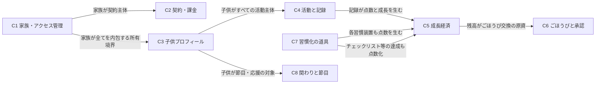
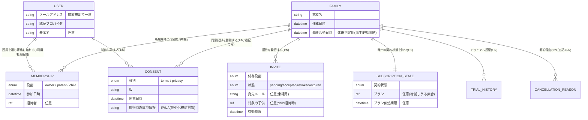
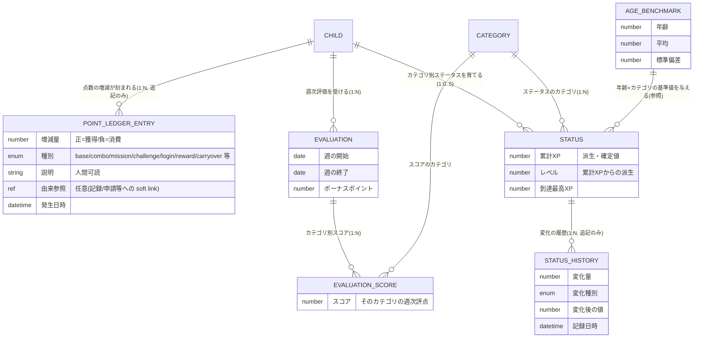

# M1 概念データモデル（Conceptual Data Model / ANSI-SPARC 概念層）— がんばりクエスト

> **状態**: M1 成果物（データアーキ ground-up 導出、M1 レビュー board 評価待ち）。関連: EPIC #3424（DSQL 移管）/ ADR-0055（per-child 主軸 + 限定 family master）。
>
> **層の位置づけ（ANSI-SPARC）**: 本書は **概念層（conceptual schema）** に限定する。ここでは「業務ドメインに何が存在し、それらがどう関係し、どんな不変条件を満たすか」だけを述べる。**格納・物理表現（識別子の物理形式・索引・正規形の次数・格納フォーマット・トランザクション機構・分散配置）は一切扱わない**。それらは後続 M3（物理設計）の責務であり、既存の物理設計草稿 `docs/design/dsql-data-model.md`（§3 集約 / §11 確定スキーマ）が M3 の入力である。
>
> **導出方針（最重要）**: 概念は **製品ドメインから ground-up で導出**する。既存の型定義・スキーマ（`src/lib/server/db/types/index.ts` / `interfaces/*.interface.ts` / `auth/entities.ts` / `dsql-data-model.md`）は「**現状の振る舞いを理解するための参照**」であって anchor ではない。**DynamoDB single-table 時代に混入した歪み（単一代理識別子の強制・非正規な埋め込み・派生値の二重保持・暗黙のテナント導出）は概念モデルに持ち込まず、指摘して削ぐ**（§6 対照表）。

---

## §1 ドメイン概要と境界づけられたコンテキスト

### §1.1 プロダクトの中核業務概念（`docs/design/01-企画書.md` / `docs/DESIGN.md` §1/§8 / ゲーミフィケーション設計書より）

がんばりクエストは「**家庭内で、子供の日々の活動を RPG 風のゲーミフィケーションで動機づける**」プロダクトである。ドメインの背骨は次の因果連鎖にある:

1. **家族（テナント）** が閉じた単位で、その中に **子供** と **保護者** が居る。
2. 子供が **活動（あるいはチェックリスト・チャレンジ・バトル・ログインなど）** を **記録** する。
3. 記録は **ポイント（点数経済）** を生み、同時に **ステータス（カテゴリ別の成長度）** を育てる。
4. たまったポイントを **ごほうび** と交換し、成長は **証書・称号的マイルストーン** で可視化される。
5. 家族は子供を **応援**（メッセージ・スタンプ）し、成長を **見守り**、いずれ **卒業** する。

この連鎖のうち **「記録 → ポイント + ステータス」** が最頻・最重要のトランザクション単位であり（`dsql-data-model.md` §3.5.1 の hot path）、概念設計上の整合の核となる。

### §1.2 境界づけられたコンテキスト（Bounded Context）一覧

ドメインを、言語（ユビキタス言語）と整合の単位が変わる境界で 8 コンテキストに分ける。各コンテキストは §3 の集約群を内包する。

| # | コンテキスト | 業務上の関心事 | 主要概念 |
|---|---|---|---|
| **C1** | **家族・アクセス管理**（Identity & Access） | 誰が家族に属し、どの役割で、何に同意したか | 家族、利用者、所属、招待、同意 |
| **C2** | **契約・課金**（Subscription & Billing） | 家族が今どのプランで、どんな契約状態か、トライアル履歴 | 契約状態、プラン、トライアル履歴、解約理由 |
| **C3** | **子供プロフィール**（Child Profile） | 子供は誰で、何歳で、どの年齢帯モード・見た目か | 子供、年齢帯、テーマ、アバター、休養日 |
| **C4** | **活動と記録**（Activity & Recording） | 子供が何をして、いつ記録したか | 子供の活動、活動記録、習熟度、ピン留め、今日のミッション、カテゴリ |
| **C5** | **成長経済**（Growth Economy） | 記録がどう点数・成長・評価に変換されるか | ポイント台帳、ポイント残高（派生）、ステータス、ステータス履歴、基準値、週次評価 |
| **C6** | **ごほうびと承認**（Rewards） | 子供が何と交換でき、保護者がどう承認するか | ごほうび、交換申請 |
| **C7** | **習慣化の道具**（Habit Instruments） | 反復・継続を支える仕組み | チェックリスト（家族マスタ＋配信＋進捗）、チャレンジ、スタンプカード、ログインボーナス、バトル |
| **C8** | **家族の関わりと節目**（Engagement & Milestones） | 家族間の応援・見守り・節目の祝福・通知 | 保護者メッセージ、きょうだい応援、証書、誕生日ふりかえり、卒業同意、閲覧リンク、通知、メディア |

> **境界の根拠**: C1/C2 は「家族という 1 個の主体」の内側で語られるが、**言語が異なる**（C1=同意・役割・招待は法務/認可の語彙、C2=プラン・請求は課金の語彙）ため分ける。C4 と C5 は「記録という 1 イベントが両方を同時に動かす」ため整合上の結合が最も強い（§4 不変条件 I-REC）。C7 は個々の習慣化装置が独立した記録源であり、いずれも C5 の点数経済に合流する。

### §1.3 コンテキスト間の関係（Context Map）



**関係の性質**: **家族（C1）が最上位の所有境界**であり、C2〜C8 のあらゆる概念は「ある 1 つの家族に属する」。この所有は概念的に **無条件・全域**（あらゆる子供スコープ概念は、その子供を通じて必ず 1 つの家族に属する）であり、後述の DynamoDB 遺産「テナント識別子の暗黙導出」は概念的には **明示的で例外なき所有関係** に置き換える（§6 対照表 L-01）。

---

## §2 導出の前提（読み替え規則）

既存参照を概念へ持ち上げる際に一貫適用した読み替え。**物理語 → 概念語**の対応であり、以降のモデルはすべて右列の語彙のみで記述する。

| 既存（物理・参照） | 概念モデルでの扱い |
|---|---|
| 代理整数識別子 + 採番カウンタ + 辞書順パディング | 概念的 **識別（identity）**。自然な識別が存在する概念（ステータス = 子供×カテゴリ 等）は **その自然識別**で語る。存在しない概念のみ「その概念固有の識別を持つ」とだけ言う（物理形式は M3） |
| テナント識別子列の有無・暗黙導出 | すべての概念は **所属する家族**を持つ（例外なし）。導出経路は概念では不問 |
| 埋め込み文書（items/scores/config 等） | **構成要素を独立概念 or 値オブジェクト**に展開。検索・集計の対象になる要素は概念関係、原子的に読み書きされる不透明値のみ **値オブジェクト**（§5） |
| 残高の二重保持（合計値の別保持 vs 都度合算） | **残高は派生量**（point 台帳の意味論的総和）。独立した事実として持たない（§4 I-BAL） |
| 派生集計の read-model（日次サマリ） | ドメイン概念ではない。**派生プロジェクション**として概念モデルから除外（§6 L-07） |
| 楽観版数・更新機構 | 整合の**実現手段**。概念では不変条件（§4）だけを述べ、機構は M3 |
| 役割の二重書き（隣接文書） | **単一の所属関係**（利用者×家族に役割属性が 1 つ付く） |
| 年齢の格納列 | **生年月日からの派生量**。独立事実として持たない（§4 I-AGE） |

---

## §3 ER モデル（概念）

> 記法: mermaid `erDiagram`。属性は**業務的に意味のある主要属性のみ**（物理型・識別子形式は書かない）。関係のラベルは業務語で、多重度と参加制約（必須 = 実線的「必ず」/ 任意 = 「任意」）を注記で補う。読みやすさのためコンテキスト別に分割する。

### §3.1 C1 家族・アクセス管理 / C2 契約・課金



- **役割の多重度**: 1 家族に **owner はちょうど 1 名**（§4 I-OWN）。parent/child は 0..N。1 利用者は現行ドメインでは **1 家族に所属**（`Membership` は「1ユーザー=1テナント」の注記）。将来の複数家族所属は §7 論点 Q-07。
- **招待の対象子供**: child 役割の招待のみ「対象の子供」を持つ（その子供のアカウントを紐づける）。任意参加。
- **契約状態を独立概念にするか**は §7 論点 Q-01。ここでは C2 の言語独立性を尊重し 1:1 の別概念として描くが、集約上は Family に内包しうる。

### §3.2 C3 子供プロフィール / C4 活動と記録

```mermaid
erDiagram
  FAMILY ||--o{ CHILD : "子供を擁する(1:N)"
  CHILD  ||--o{ CHILD_ACTIVITY : "自分の活動を所有する(1:N, per-child)"
  CATEGORY ||--o{ CHILD_ACTIVITY : "活動が属するカテゴリ(1:N)"
  CHILD_ACTIVITY ||--o{ ACTIVITY_LOG : "記録される(1:N)"
  CHILD  ||--o{ ACTIVITY_LOG : "記録の主体(1:N)"
  CHILD_ACTIVITY ||--o| ACTIVITY_MASTERY : "習熟度が育つ(1:0..1)"
  CHILD_ACTIVITY ||--o| ACTIVITY_PREFERENCE : "ピン留め設定(1:0..1)"
  CHILD  ||--o{ DAILY_MISSION : "今日のミッション(1:N/日)"
  CHILD_ACTIVITY ||--o{ DAILY_MISSION : "ミッション対象の活動(1:N)"
  CHILD  ||--o{ REST_DAY : "休養日(1:N)"

  CHILD {
    string ニックネーム
    date 生年月日 "任意だが年齢/年齢帯導出の源"
    enum 年齢帯モード "baby/preschool/elementary/junior/senior(派生 or 手動上書き)"
    bool 年齢帯を手動固定したか
    string テーマ
    ref アバター画像参照 "任意(バイトはドメイン外)"
    valueobject 表示構成 "個別の意味ある属性へ展開"
    ref 紐づく利用者 "任意(招待child)"
    number 誕生日ボーナス倍率
    bool アーカイブ済か
  }
  CHILD_ACTIVITY {
    string 名称
    string アイコン
    number 基礎ポイント
    enum 優先度 "must(今日のおやくそく)/optional"
    number 1日あたり上限 "任意"
    bool メインクエストか
    bool 表示するか
    ref 取込元テンプレート "任意(帰属記録)"
  }
  ACTIVITY_LOG {
    date 記録日
    datetime 記録日時
    number 付与ポイント
    number 連続日数 "派生・確定値"
    number 連続ボーナス "派生・確定値"
    bool 取消済か
  }
  ACTIVITY_MASTERY {
    number 累計回数
    number 習熟レベル "累計回数からの派生"
  }
  CATEGORY {
    string コード "自然識別(運動/勉強/生活/交流/創造の5軸)"
    string 名称
  }
```

- **per-child instance の徹底**（ADR-0055 / PO 判断 2026-06-29）: 活動は **子供ごとに 1 行所有**する。家族マスタ 1 つを編集して全子供へ波及させる要件は**無い**（波及は事故であって機能ではない、と PO 確定）。兄弟共通化は**コピー（重複は上書き）**で行う。→ 旧「家族共有の活動マスタ + 年齢フィルタ」は概念から削ぐ（§6 L-02）。
- **カテゴリ**は家族に依存しない**グローバルな参照概念**（5 軸固定）。子供の活動が属する分類軸。
- **記録（ActivityLog）と活動（ChildActivity）**: 記録は必ずある活動に紐づく（§4 I-LOG）。取消は物理的な消去ではなく**取消フラグ**（監査可能な履歴を残す業務要件）。
- **習熟度・ピン留め**は活動に対し 0..1（まだ記録がなければ習熟度は無い）。
- **今日のミッション**は「その日、その子供に提示された挑戦対象の活動」。日付×子供×活動で 1 つ。

### §3.3 C5 成長経済



- **ポイント残高は概念モデルに独立概念として存在しない**。残高は「その子供の全 ledger エントリの増減量の意味論的総和」という**派生量**である（§4 I-BAL）。DynamoDB の「残高を別に保持し手動加算」は削ぐ（§6 L-03）。
- **ステータス**は子供×カテゴリで 1 つ（最大 5 軸）。累計 XP・レベル・最高到達は成長の**派生的到達点**。基準値（AGE_BENCHMARK）は年齢×カテゴリの相対評価に使う**グローバル参照**。
- **週次評価（Evaluation）**はカテゴリ別スコアの束を持つ。旧「スコアの埋め込み文書」を**カテゴリ別スコアの独立要素**に展開（§5 / §6 L-04）。
- **retention（履歴の間引き）**: 古いポイント明細を消しても**残高は不変でなければならない**（#729 契約）→ 消去分は「繰越（carryover）」種別のエントリに畳み込む（§4 I-BAL の帰結、意味論で表現）。

### §3.4 C6 ごほうびと承認 / C7 習慣化の道具

```mermaid
erDiagram
  CHILD ||--o{ SPECIAL_REWARD : "自分のごほうびを持つ(1:N, per-child)"
  CHILD ||--o{ REDEMPTION_REQUEST : "交換を申請する(1:N)"
  SPECIAL_REWARD ||--o{ REDEMPTION_REQUEST : "申請対象のごほうび(1:N, 申請時に内容を捕捉)"

  FAMILY ||--o{ CHECKLIST_TEMPLATE : "家族マスタとして所有(1:N)"
  CHECKLIST_TEMPLATE ||--o{ CHECKLIST_ITEM : "項目を含む(1:N)"
  CHECKLIST_TEMPLATE }o--o{ CHILD : "配信される(M:N, 配信=assignment)"
  CHILD ||--o{ CHECKLIST_LOG : "日次の達成記録(1:N)"
  CHECKLIST_TEMPLATE ||--o{ CHECKLIST_LOG : "どのテンプレの達成か"
  CHECKLIST_LOG ||--o{ CHECKLIST_ITEM_RESULT : "項目別チェック結果(1:N)"
  CHILD ||--o{ CHECKLIST_OVERRIDE : "その日だけの項目増減(1:N)"

  CHILD ||--o{ CHILD_CHALLENGE : "自分のチャレンジ(1:N, per-child)"

  CHILD ||--o{ STAMP_CARD : "週次スタンプカード(1:N)"
  STAMP_CARD ||--o{ STAMP_ENTRY : "押印(1:N, 枠ごと)"
  STAMP_MASTER ||--o{ STAMP_ENTRY : "押されたスタンプ種別(参照, 任意=おみくじ)"
  CHILD ||--o{ LOGIN_BONUS : "日次ログインボーナス(1:N)"

  CHILD ||--o{ DAILY_BATTLE : "日次バトル(1:N)"
  CHILD ||--o{ ENEMY_COLLECTION : "討伐図鑑(1:N)"

  SPECIAL_REWARD {
    string 名称
    string 説明 "任意"
    number 必要ポイント
    enum 陳列系統 "physical/money/privilege"
    ref 付与者 "任意"
  }
  REDEMPTION_REQUEST {
    enum 状態 "申請中/承認/却下/失効"
    string 申請時のごほうび名称 "捕捉した歴史的値"
    number 申請時の必要ポイント "捕捉した歴史的値"
    datetime 申請日時
    string 保護者メモ "任意"
  }
  CHECKLIST_TEMPLATE {
    string 名称
    number 項目あたりポイント
    number 全完了ボーナス
    enum 時間帯
  }
  CHECKLIST_ITEM { string 名称; enum 頻度; enum 方向 }
  CHECKLIST_LOG { date 対象日; bool 全完了か; number 付与ポイント }
  CHECKLIST_ITEM_RESULT { ref 対象項目; bool チェック済か }
  CHILD_CHALLENGE {
    string 題名
    enum 期間種別 "weekly 等"
    date 開始日
    date 終了日
    valueobject 目標条件 "指標/対象カテゴリ/目標値へ展開"
    valueobject ごほうび条件 "点数/メッセージへ展開"
    number 現在値
    number 目標値 "年齢調整済"
    bool 達成済か
    bool ごほうび受領済か
    ref 連動グループキー "任意(きょうだい表示用)"
  }
  STAMP_CARD { date 週の開始; date 週の終了; enum 状態; number 交換ポイント }
  STAMP_ENTRY { number 枠番号; date 押印日; enum おみくじ結果 "任意" }
  LOGIN_BONUS { date ログイン日; enum ランク; number 付与ポイント; number 連続日数 }
  DAILY_BATTLE {
    number 敵ID; date 日付; enum 状態 "pending/completed";
    enum 勝敗 "任意"; number 報酬ポイント; valueobject 戦闘時ステータス "展開検討"
  }
  ENEMY_COLLECTION { number 敵ID; datetime 初討伐日時; number 討伐回数 }
```

- **ごほうびの申請捕捉（snapshot）**: 交換申請は「申請時点のごほうび名称・必要ポイント」を**歴史的値として捕捉**する。これは非正規化ではなく、**申請という業務イベントの不変な記録**（後でごほうび定義が変わっても申請の事実は変わらない）。概念的に正当なので維持（§6 L-05）。
- **チェックリストのみ family master + 配信 + 進捗の 3 層**（ADR-0055 の唯一の family master 例外）。テンプレは家族が所有し、**配信（assignment）で子供へ M:N**、進捗（log）は子供に閉じる。項目別チェック結果は旧「項目の埋め込み文書」を展開（§5 / §6 L-04）。
- **チャレンジは per-child instance**（#3195 でアプリ週次自動生成に一本化、親手動作成・兄弟コピー・競争モードは撤去）。「きょうだいで頑張る」表現は**連動グループキー**で束ねた表示上の工夫であり、データ構造上は各子供に独立したチャレンジ（§6 L-06）。
- **スタンプカードは子供×週で 1 枚**（現行の強い制約）。押印はログイン起点で枠を埋める。カード内のスタンプ種別はグローバル参照（おみくじ枠のみ種別が任意）。カード復活（季節イベント）の可能性は §7 論点 Q-05。
- **バトル**は日次で敵と戦い、討伐図鑑に討伐履歴が積まれる。戦闘時ステータスの展開粒度は §7 論点 Q-06。

### §3.5 C8 家族の関わりと節目

```mermaid
erDiagram
  CHILD ||--o{ PARENT_MESSAGE : "保護者からのメッセージ(1:N)"
  CHILD ||--o{ SIBLING_CHEER : "きょうだいからの応援(受け手, 1:N)"
  CHILD ||--o{ CERTIFICATE : "証書を授与される(1:N)"
  CHILD ||--o{ BIRTHDAY_REVIEW : "誕生日ふりかえり(1:N/年)"
  FAMILY ||--o{ GRADUATION_CONSENT : "卒業同意(1:N)"
  CHILD ||--o{ CHARACTER_IMAGE : "生成キャラ画像(1:N, バイトはドメイン外)"
  CHILD ||--o{ CUSTOM_VOICE : "カスタム音声(1:N, バイトはドメイン外)"
  FAMILY ||--o{ PUSH_SUBSCRIPTION : "通知購読(1:N, 保護者のみ)"
  FAMILY ||--o{ NOTIFICATION_LOG : "通知送信ログ(1:N, 追記のみ)"
  FAMILY ||--o{ VIEWER_TOKEN : "閲覧専用リンク(1:N)"
  FAMILY ||--o{ CLOUD_EXPORT : "クラウド共有エクスポート(1:N)"
  FAMILY ||--o{ USAGE_LOG : "利用ログ(1:N, 追記のみ)"

  PARENT_MESSAGE {
    enum 種別 "stamp/text/reward_notice"
    string 本文 "任意"; string スタンプコード "任意"
    number ボーナス点 "任意(応援付与)"; datetime 送信日時; datetime 既読提示日時 "任意"
  }
  SIBLING_CHEER { ref 送り手の子供; string スタンプコード; datetime 送信日時 }
  CERTIFICATE { enum 種別; string 題名; string 説明 "任意"; datetime 授与日時; valueobject 付帯情報 "不透明・発行後不変" }
  BIRTHDAY_REVIEW {
    number 対象年; number ふりかえり時年齢; valueobject 健康チェック;
    string 抱負 "任意"; valueobject 抱負カテゴリ; number 合計ポイント
  }
  GRADUATION_CONSENT { ref 対象の子供; bool 事例公開同意; datetime 同意日時 }
  VIEWER_TOKEN { string ラベル "任意"; datetime 有効期限 "任意"; datetime 失効日時 "任意" }
  CLOUD_EXPORT {
    enum 種別 "template/full"; string 受渡PIN; enum 状態 "pending/building/ready/failed";
    datetime 有効期限; number ダウンロード回数; number 最大回数
  }
```

- **メディア（キャラ画像・カスタム音声・アバター）**: ドメインが持つのは「**参照とメタ情報**」のみ。実バイトは**ドメイン外のテナント分離ストレージ**に置く（§6 L-08 / `dsql-data-model.md` §9.4）。概念上は「子供がメディア参照を所有する」関係だけを描く。
- **通知購読は保護者のみ**（child は購読不可、COPPA + Anti-engagement）。概念上「購読者役割 = parent/owner」を属性に持つ。
- **閲覧専用リンク・クラウドエクスポート・利用ログ**は家族運用の周辺概念。追記のみ or ライフサイクル状態を持つ。

---

## §4 DDD 集約マップ

> **集約 = トランザクション整合の単位**（1 回の整合操作で不変条件を守り切る境界）。集約ルートを通じてのみ内部が変更される。**集約をまたぐ整合は結果整合 + 冪等**とし、1 つの整合操作で複数集約を跨がない。

### §4.1 集約一覧と境界の根拠

| 集約ルート | 内包する子概念 | 境界（この単位で整合させる）の根拠 |
|---|---|---|
| **家族（Family）** | 利用者所属、招待、同意、契約状態、トライアル履歴、解約理由、閲覧リンク、通知購読、通知ログ、クラウドエクスポート、利用ログ、卒業同意 | **アクセス・契約・家族運用の不変条件**（owner ちょうど 1 名／同意は追記のみ／契約状態は 1 つ）は家族単位で守る。認証ドメインが初めて正式にリレーショナル概念化される（従来 KV 由来）。**利用者（User）は家族に閉じない**（メールが家族横断で一意）ため、**利用者は独立した参照概念**とし、家族との関係は「所属（Membership）」で表す |
| **子供（Child）** | 子供の活動、活動記録、習熟度、ピン留め、今日のミッション、休養日、ポイント台帳、ステータス、ステータス履歴、週次評価、ごほうび、交換申請、証書、誕生日ふりかえり、保護者メッセージ、キャラ画像、カスタム音声、チェックリスト進捗・当日上書き、チャレンジ、スタンプカード・押印、ログインボーナス、バトル・討伐図鑑、利用ログ | **「記録という 1 イベントが、その子供の記録・点数・成長を同時に整合させる」**のが最強シグナル（§4.2 I-REC）。子供の削除が配下概念を一括で消すのも同じ境界を示す。**子供が最大の集約**であり、per-child 主軸（ADR-0055）と一致 |
| **スタンプカード（StampCard）**（子供のサブ集約） | 押印（枠） | カード単位で押印を扱う（週の枠が埋まると交換状態へ）。子供集約内の**局所整合単位** |
| **チェックリストテンプレート（ChecklistTemplate）**（家族マスタ） | 項目、配信（子供への割当） | **家族が所有するマスタ**で、進捗（子供側）とは整合単位が別。テンプレ編集と進捗記録を別トランザクションに分ける（ADR-0055 の唯一の family master） |
| **グローバル参照（家族非依存）** | カテゴリ、スタンプ種別、年齢基準値、（課金イベント整合の観測点） | 家族に属さない**共有参照**。整合は個別、テナント境界を持たない |

> **利用者（User）を家族集約に含めない理由**: 利用者はメールで家族横断に一意で、招待により別家族へも所属しうる（将来）。家族に内包すると「1 利用者を複数家族が所有」する矛盾が生じる。→ **利用者は独立参照、所属（Membership）が家族×利用者の関係を担う**。この分離は DynamoDB の「役割二重書き（家族側と利用者側の両方に role を書く）」を解消する（§6 L-09）。

### §4.2 集約内で守る整合（記録トランザクション I-REC）

**子供集約の中核不変条件**: 「活動を 1 回記録する」操作は、以下を**同時に成り立たせる**必要がある（部分的にしか成立しない状態を作らない）:

- 活動記録が 1 件生まれる。
- その記録に対応するポイント（基礎点）が台帳に 1 件刻まれ、残高（派生量）が意味論的に整合する。
- 対応するカテゴリのステータス（累計 XP・レベル）が更新され、その変化が履歴に残る。
- 活動の習熟度（累計回数・レベル）が更新される。

この 4 者は**必ず一致していなければならない**（点数だけ入って成長が入らない、等の中間状態は不変条件違反）。→ これが「子供 = 集約」の境界を決める最重要根拠。**連鎖ボーナス（combo）・ミッション達成・チャレンジ進捗・証書発行・通知**などの**追加的（additive）効果は、中核整合に不要**であり、集約整合の外（結果整合・冪等・欠落許容）に置く（§7 論点 Q-08 で欠落許容の是非を明示）。

> 現行実装は記録の複数副作用を**整合単位なしに逐次実行し例外を握り潰す**（`dsql-data-model.md` §8）。概念的にはこれは**不変条件違反を許す設計**であり、M1 では「中核 4 者の同時整合」を集約不変条件として明示する。実現機構は M3。

---

## §5 ドメイン不変条件一覧（意味論で記述）

> 各不変条件は「**業務的に何が真でなければならないか**」だけを述べる。実装手段（版数・ロック・索引・制約種別）は含めない。

| # | 不変条件（意味論） | 由来・根拠 |
|---|---|---|
| **I-OWN** | 1 つの家族には、owner 役割の利用者が**ちょうど 1 名**存在する。parent/child は 0 名以上 | 認可の単一責任者。`dsql-data-model.md` §6.6 |
| **I-MEM** | 利用者が家族に所属するとき、その所属は**単一の役割**を持つ（役割の二重定義は存在しない） | DynamoDB 役割二重書きの解消（§6 L-09） |
| **I-CONS** | 同意記録は**追記のみ**（変更・削除されない）。ある家族・利用者・種別の「現在の同意」は最新の同意日時のエントリで定まる。ただし**アカウント完全削除時のみ**、法的消去要件により物理消去される（唯一の例外） | GDPR Art.7 / COPPA。`dsql-data-model.md` §9.2 |
| **I-SUB** | 1 家族は同時に**唯一の契約状態**を持つ。プランは増減しうる集合の 1 値（無ければトライアル/無料相当） | C2。課金の一貫性 |
| **I-CHILD-FAM** | すべての子供スコープ概念（記録・点数・ステータス・ごほうび・チェックリスト進捗・…）は、**その子供を通じて必ずちょうど 1 つの家族に属する**（家族に属さない子供スコープ概念は存在しない） | テナント所有の全域性。§6 L-01 |
| **I-LOG** | 活動記録は**必ず 1 つの活動に紐づく**（宙に浮いた記録は存在しない）。記録の主体の子供と、活動の所有者の子供は**同一**でなければならない | 記録の参照整合。per-child instance |
| **I-BAL** | ある子供のポイント**残高は、その子供の全ポイント台帳エントリの増減量の総和に意味論的に等しい**。残高は独立した事実として保持されず派生する。**古い明細を間引いても残高は不変**（消去分は繰越として畳み込まれ、総和は保存される） | 残高二重保持の解消（§6 L-03）。#729 retention 契約 |
| **I-STATUS** | ある子供の 1 カテゴリのステータスは**高々 1 つ**（子供×カテゴリで一意）。累計 XP・レベル・最高到達は、そのカテゴリへの成長イベントの総和／関数として整合する | §3.3。カテゴリ 5 軸 |
| **I-REC** | 活動 1 記録の中核効果（記録・基礎点・ステータス・習熟度）は**すべて成立するか、すべて成立しないか**のいずれか（部分成立は不変条件違反） | §4.2。集約整合の核 |
| **I-AGE** | 子供の年齢は**生年月日と現在時刻からの派生量**であり、独立して保持されない。年齢帯モードは、**手動固定されていない限り**、その派生年齢から導かれる（誕生日をまたぐと自動で適切な帯へ移る） | 年齢格納列の解消（§6 L-10）。`dsql-data-model.md` §11.1 |
| **I-CHECK-1WK** | （現行の強い制約）1 人の子供は 1 週間について**高々 1 枚のスタンプカード**を持つ | §3.4。ただし季節カード復活で反転しうる（論点 Q-05） |
| **I-STAMP-1DAY** | スタンプカードの押印は**1 日 1 押印**（同一日に複数枠は埋めない） | ログイン起点の日次性 |
| **I-LOGIN-1DAY** | ログインボーナスは 1 人の子供につき**1 日 1 回**（連続日数はその系列から定まる） | Anti-engagement（ADR-0012、連続損失プレッシャーを煽らない） |
| **I-BATTLE-1DAY** | 日次バトルは 1 人の子供につき**1 日 1 戦**（勝敗確定は 1 回） | ADR-0012 anti-engagement |
| **I-MISSION** | 今日のミッションは（子供・日付・活動）で一意。完了は additive（達成でボーナス、未達で罰はない） | §3.2 |
| **I-CHECKLIST** | チェックリストの進捗（log）は（子供・テンプレ・対象日）で一意。**配信されていないテンプレに対する子供の進捗は存在しない**（進捗は配信を前提とする） | §3.4。family master + assignment |
| **I-REDEEM** | 交換申請は申請時点のごほうび内容（名称・必要ポイント）を**不変に捕捉**する。ごほうび定義の後日の変更は、既存申請の捕捉値を変えない | 申請イベントの歴史性（§6 L-05） |
| **I-CERT-IMMUT** | 証書は授与後、内容（題名・付帯情報）が**変わらない**（発行済みの事実の不変性） | §3.5 |
| **I-CHEER** | きょうだい応援は、送り手と受け手が**同一家族内の別の子供**である（家族をまたぐ応援は存在しない） | intra-tenant 信頼境界 |
| **I-MEDIA-EXT** | メディア（キャラ画像・音声・アバター）の実体はドメイン外に置かれ、ドメインは**参照とメタ情報のみ**を保持する。参照は所有する子供の家族境界に閉じる | §6 L-08 |
| **I-PUSH-ROLE** | 通知購読は**保護者役割（parent/owner）に限る**（child は購読しない） | COPPA + ADR-0012 |
| **I-ADD** | 記録の追加的効果（combo/mission/challenge/証書/通知）は結果整合で、**冪等かつ加算的**（二重適用しても最終状態が壊れない）。可視な進捗（ミッション完了・チャレンジ進捗）は**確定した事実から再導出可能**でなければならない（推定先出しをしない） | ADR-0012 演出契約。`dsql-data-model.md` §8 |

---

## §6 概念 domain class スケッチ（格納非依存）

> 型・振る舞いの**概念**を TypeScript 風で示す。ただし**永続化・格納・索引・トランザクション機構の語は使わない**。ここでの「識別」は概念的同一性であって物理識別子ではない。値オブジェクト（`ValueObject`）は同一性を持たず値そのもので等価判定される。

```ts
// ── C1/C2 家族・アクセス・契約 ─────────────────────────────
type Role = 'owner' | 'parent' | 'child';

class Family {                       // 集約ルート
  readonly name: string;
  memberships: Membership[];         // I-OWN: role==='owner' はちょうど1
  invites: Invite[];
  consents: ConsentRecord[];         // I-CONS: 追記のみ
  subscription: SubscriptionState;   // I-SUB: 唯一
  // 振る舞い（意味論）
  inviteMember(role: Role, targetChild?: Child): Invite;
  acceptInvite(code: string, byUser: User): Membership;   // 期限内 & 宛先email束縛を満たすときのみ
  transferOwnership(to: User): void; // I-OWN を保ちつつ owner を移す（旧 owner は parent へ）
  recordConsent(user: User, type: ConsentType, version: string): void; // 追記のみ
}

class User {                         // 独立参照（家族に内包しない）
  readonly email: string;            // 家族横断で一意
  readonly provider: 'cognito';
  displayName?: string;
}

class Membership {                   // 家族×利用者の関係（役割は1つ）
  readonly family: Family; readonly user: User; readonly role: Role;
}

class SubscriptionState {            // C2（Family 内包 or 独立は論点 Q-01）
  status: SubscriptionStatus; plan?: Plan; planExpiresAt?: Date;
  isEntitledTo(feature: Feature): boolean;  // 権利は状態から算出、別保持しない
}

// ── C3 子供 ───────────────────────────────────────────────
class Child {                        // 集約ルート（最大の集約）
  nickname: string;
  birthDate?: Date;
  get age(): number | undefined;     // I-AGE: 生年月日から派生（保持しない）
  get ageTier(): AgeTier;            // 手動固定でなければ age から導出（誕生日跨ぎで自動遷移）
  ageTierManuallyPinned: boolean;
  theme: string;
  displayConfig: DisplayConfig;      // ValueObject（意味ある個別属性へ展開）
  avatar?: MediaRef;                 // I-MEDIA-EXT: 参照のみ
  archived: boolean;
  // 中核の振る舞い（I-REC を守る）
  recordActivity(activity: ChildActivity, at: Date): RecordingOutcome;
}

// ── C4/C5 記録と成長経済（Child 集約内）────────────────────
class ChildActivity {                // per-child instance（ADR-0055）
  name: string; category: Category; basePoints: number;
  priority: 'must' | 'optional'; dailyLimit?: number; isMainQuest: boolean;
  sourceTemplateRef?: MarketplaceItemRef;  // 帰属記録（取込元）
}

class ActivityLog {                  // I-LOG: 必ず活動に紐づく
  readonly activity: ChildActivity; readonly recordedOn: Date;
  points: number; streakDays: number; cancelled: boolean;
}

class PointLedger {                  // 追記のみ。残高は派生（I-BAL）
  private entries: PointLedgerEntry[];
  get balance(): number;             // = Σ entries.amount（別保持しない）
  post(amount: number, kind: LedgerKind, ref?: DomainRef): void;
  compactBefore(date: Date): void;   // 間引き時、消去分を carryover に畳み残高保存
}

class Status {                       // I-STATUS: 子供×カテゴリで一意
  readonly category: Category;
  get level(): number;               // 累計XPから派生
  totalXp: number; peakXp: number;
  history: StatusHistoryEntry[];     // 追記のみ
}

class Evaluation {                   // 週次評価
  weekStart: Date; weekEnd: Date;
  scores: EvaluationScore[];         // カテゴリ別（旧埋め込み文書を展開）
  bonusPoints: number;
}

// ── C6/C7 ごほうび・習慣装置 ───────────────────────────────
class SpecialReward { name: string; requiredPoints: number; shopCategory: ShopCategory; }
class RedemptionRequest {            // I-REDEEM: 申請時内容を不変捕捉
  readonly capturedName: string; readonly capturedPoints: number;
  status: 'pending' | 'approved' | 'rejected' | 'expired';
  approve(byParent: User): void;
}

class ChecklistTemplate {            // 家族マスタ（唯一の family master）
  name: string; items: ChecklistItem[];
  assignedTo: Child[];               // M:N 配信
  assignTo(children: Child[]): void;
}
class ChecklistProgress {            // 子供側（I-CHECKLIST: 配信前提）
  readonly template: ChecklistTemplate; readonly onDate: Date;
  results: ItemResult[]; completedAll: boolean;
}

class ChildChallenge {               // per-child instance（#3195 週次自動生成）
  title: string; target: ChallengeTarget;   // ValueObject（指標/カテゴリ/目標値）
  reward: ChallengeReward;                   // ValueObject
  currentValue: number; targetValue: number; completed: boolean;
  siblingGroupKey?: string;          // 表示上のきょうだい連動のみ
}

class StampCard {                    // 子供のサブ集約（I-CHECK-1WK / I-STAMP-1DAY）
  weekStart: Date; entries: StampEntry[]; status: CardStatus;
  stamp(on: Date, master?: StampMaster): void;  // 1日1押印
}
```

**設計上の注記**:
- `PointLedger.balance` を getter（派生）にしているのは I-BAL の直接表現。`compactBefore` が「間引いても残高不変」を carryover で保証する。
- `Child.age` / `ageTier` を getter にしているのは I-AGE の直接表現（保持しない）。
- 埋め込み文書（`displayConfig` / `target` / `reward` / 戦闘時ステータス）は**値オブジェクト**として展開。ただし「検索・集計対象になる要素」は値オブジェクトでなく独立概念に昇格させる（例: チェックリストの項目別結果、週次評価のカテゴリ別スコア）。この線引きは §7 論点 Q-04。

---

## §7 継承 vs 変更 対照表（既存 → 概念モデル + DynamoDB 遺産の指摘）

> 「既存構造（参照）」→「概念モデル」を並べ、**維持 / 変更**と理由を記す。DynamoDB 由来の歪みは「削ぐ」と明記。L 番号は §1.3 / 各節で参照。

| 既存構造（参照のみ） | 概念モデル | 維持/変更 | 理由（DynamoDB 遺産の指摘を含む） |
|---|---|---|---|
| **L-01** テナント識別子が一部概念にのみ存在し、子供スコープは childId から暗黙導出 | すべての子供スコープ概念は子供を通じ**必ず 1 家族に属する**（例外なき所有、I-CHILD-FAM） | **変更** | DynamoDB single-table では所有が暗黙・不揃いだった。概念では**全域の明示所有**に正す。物理での所有の担保方法は M3 |
| **L-02** 家族共有の活動マスタ + 年齢フィルタ（旧 `activities`、write 停止済 dead） | **per-child instance の活動**のみ（家族マスタ活動は存在しない） | **変更（削ぐ）** | 家族マスタ活動は「1 編集で全子に波及」を招く二重実装。PO 判断で波及要件は無い（事故であって機能でない）。ADR-0055 と一致。兄弟共通化はコピー（上書き） |
| **L-03** ポイント残高の二重保持（合計値の別保持 vs 都度合算）+ 手動加算 | 残高は**派生量**（台帳総和、I-BAL）。独立事実として持たない | **変更（削ぐ）** | 二重保持は乖離事故の温床（監査で実証）。概念では残高は台帳から一意に定まる。retention の間引きは carryover で総和保存 |
| **L-04** 埋め込み文書（チェックリスト項目 / 週次スコア / チャレンジ設定 / 表示構成 / 戦闘ステータス） | 検索・集計対象は**独立概念に展開**（項目別結果・カテゴリ別スコア・目標条件の各要素）、不透明原子値のみ**値オブジェクト** | **変更（展開）** | 埋め込みは DynamoDB の JOIN 回避策。概念では「個々に意味を持ち参照・集計される要素」を一級の概念にする。展開 vs 値オブジェクトの線引きは Q-04 |
| **L-05** ごほうび申請への内容コピー（名称・必要点） | 申請イベントの**歴史的捕捉**（I-REDEEM） | **維持** | これは非正規化の悪ではなく**業務イベントの不変性**（申請後にごほうび定義が変わっても申請事実は不変）。概念的に正当 |
| **L-06** きょうだいチャレンジ（家族横断 + 進捗配列） | **per-child instance** + 表示上の連動グループキー | **変更** | 家族横断チャレンジ・競争モードは撤去済（#2296/#3195、ADR-0012）。「みんなで頑張る」は表示上の束ねに退避。データは各子独立 |
| **L-07** 日次サマリの派生集計 read-model | ドメイン概念から**除外**（派生プロジェクション） | **変更（削ぐ）** | DynamoDB の GSI 回避で持たざるを得なかった read-model。書込未配線で実質空。概念上の事実ではない。集計は元概念から都度導出 |
| **L-08** メディアの実体保持 | ドメインは**参照とメタのみ**、実体はドメイン外テナント分離ストレージ（I-MEDIA-EXT） | **維持（明文化）** | 既に実装済の正しい分離。概念でも「バイトはドメインの持ち物でない」を明示 |
| **L-09** 役割の二重書き（家族側・利用者側の両方に role） | **単一の所属関係**（Membership に role 1 つ、I-MEM） | **変更（削ぐ）** | DynamoDB 隣接リストの産物。片方成功で role 不整合が起きる。概念では 1 関係 = 1 役割 |
| **L-10** 年齢の格納 | 生年月日からの**派生**（I-AGE） | **変更（削ぐ）** | 格納年齢は誕生日で日次に陳腐化する。概念では派生量。年齢帯は手動固定時のみ独立事実 |
| **L-11** 実績・称号（achievements / child_achievements / title） | 概念から**除外** | **変更（削ぐ）** | 実績システムは製品として廃止済（#322）・データ不在。新概念に作らない |
| **L-12** 単一代理識別子の一律強制 + 採番カウンタ + 辞書順パディング | 概念は**自然な同一性**で語る（ステータス=子供×カテゴリ、習熟度=子供×活動、ログインボーナス=子供×日 等） | **変更** | 「すべてに単一 opaque id」は index-organized KV の都合。概念では自然識別が存在する所はそれで同一性を語る（物理識別子形式は M3 の判断） |
| **L-13** 季節イベント（TenantEvent 等）/ 月替わりプレゼント | 概念に**存在しない** | **維持（不在の確認）** | ADR-0012/0013 二重違反で撤去済。概念に復活させない |

**参照に留め、継承しなかったことの確認**: 上表の「変更（削ぐ）」10 項目（L-01〜L-04, L-06, L-07, L-09〜L-11, L-13 の削ぎ）は、既存スキーマ／型を**現状理解のためだけに参照**し、概念には持ち込まなかった。特に **単一 opaque 識別子の一律強制・非正規な埋め込み・派生値の二重保持・暗黙のテナント導出・役割二重書き**という DynamoDB single-table の 5 大歪みを概念モデルから排した。維持したのは、**業務的に正当な概念**（申請の歴史的捕捉 L-05、メディア外部化 L-08、per-child 主軸 ADR-0055）のみである。

---

## §8 未決論点（M1 レビュー board 評価対象）

> 迷った判断は「決定」せず論点として明示する。各論点に候補と根拠を添える。**決定は board の仕事**。

| # | 論点 | 候補と根拠 |
|---|---|---|
| **Q-01** | 契約状態（Subscription）は独立概念か、家族の属性か | **A: 家族の属性**（1:1、契約状態は家族に内包）— 根拠: 常に家族と 1:1、独立ライフサイクルを持たない。/ **B: 独立概念（Billing コンテキスト）**— 根拠: 課金の言語（プラン・請求・Webhook 冪等）が家族の言語と異なり、将来 Stripe 連携が肥大化する。M1 board が「課金の将来複雑度」を見て決定。現物理草稿は A（families 属性）寄り |
| **Q-02** | 利用者（User）は本当に独立参照か、家族に内包か | **A: 独立参照**（採用寄り）— 根拠: メールが家族横断で一意、将来の複数家族所属に耐える。/ **B: 家族内包**— 根拠: 現行は「1 利用者 = 1 家族」で単純。board が「複数家族所属を将来要件とみなすか」で決定 |
| **Q-03** | 週次評価（Evaluation）と誕生日ふりかえり（BirthdayReview）は同一概念族か | **A: 別概念**（現状）— 週次 vs 年次で周期・目的が異なる。/ **B: 「ふりかえり」抽象の下の 2 種**— 根拠: どちらも「期間の成長をスコア化し点数を与える」。統合すると概念数が減る。実利益が薄ければ A |
| **Q-04** | 埋め込み文書の「独立概念へ展開」vs「値オブジェクト」の線引き基準 | 提案基準: **その要素が単独で参照・検索・集計されるなら独立概念、原子的に丸ごと読み書きされ検索されないなら値オブジェクト**。確定候補: 項目別結果=展開／週次スコア=展開／チャレンジ目標条件=展開／表示構成=展開（将来サーバ側で扱う蓋然性、PO 判断）／証書付帯情報=値オブジェクト（発行後不変・不検索）／戦闘時ステータス=Q-06 で別途。board が各要素を確認 |
| **Q-05** | 「子供×週で高々 1 枚のスタンプカード」不変条件（I-CHECK-1WK）の強度 | **A: 恒久不変条件**— 現行仕様。/ **B: 現行の既定にすぎない（季節・イベントカード復活で反転しうる）**— 根拠: PO 決裁（物理草稿 §11.2）で「復活があり得る」。→ M1 では **I-CHECK-1WK を「現時点の制約」と明記し恒久不変条件に格上げしない**ことを提案。board 確認 |
| **Q-06** | 戦闘時ステータス（バトルの player stats）の概念粒度 | **A: 値オブジェクト（不透明スナップショット）**— 戦闘の 1 局面の記録で検索されない。/ **B: 独立概念に展開**— 将来バトル分析要件が立つなら。現状は分析要件不明 → A 寄り。board 確認 |
| **Q-07** | 1 利用者の複数家族所属を概念で許すか | **A: 現行どおり単一所属**— 単純。/ **B: 複数所属を許す（Membership が M:N）**— 根拠: 離婚・再婚・祖父母参加など家族形態の多様性。Pre-PMF では A で十分だが、Membership を M:N として描いておけば将来無痛。board が product 方針を決定 |
| **Q-08** | 記録の追加的効果（combo/mission/challenge）の**欠落許容**を概念不変条件とするか | **A: 欠落許容（I-ADD、結果整合・冪等）**— 中核整合に不要な additive 効果。現行と同等で退行なし。/ **B: 追加効果も中核整合に含める**— 根拠: 「取れたはずのボーナスが無い」UX 不信。ただし物理草稿 §8 は技術制約（部分巻戻し不可）から A を採る。M1 board が「product として欠落を許すか」を明示決定（物理草稿 §10-8 でも PO 確認事項として残置） |
| **Q-09** | 同意記録（Consent）の環境情報（IP/UA）を概念に保持するか | **A: 保持**（現状）— 法的証跡。/ **B: 最小化（同意日時+版+本人で足りる）**— 根拠: データ最小化原則、IP/UA は PII。物理草稿 §9.4 も「必要性再評価」。board が法務と確認 |
| **Q-10** | カテゴリ（5 軸）を「グローバル固定参照」とするか「家族が拡張しうる概念」とするか | **A: グローバル固定（5 軸）**— 現行、ステータス軸と一体。/ **B: 家族拡張可**— 将来のカスタム軸要件。現状要件なし → A。board 確認 |

---

## §9 M1 → M3 への引き渡し（本書の scope 境界の明示）

本書（M1 概念層）が**意図的に扱わなかった**もの（すべて M3 論理・物理設計の責務、`dsql-data-model.md` が該当）:

- 識別子の物理形式（自然複合 or 代理、生成方式）、索引、covering、正規形の次数。
- トランザクション機構・楽観制御・整合の実現手段（不変条件 I-* の**実現方法**）。
- 分散配置・テナント物理共置・格納フォーマット（原子値の格納形式）・メディアストレージの具体。
- 2 バックエンド（クラウド / ローカル）の方言差、マイグレーション手順、fitness function。

M3 は本書の **§4 集約境界・§5 不変条件・§7 対照表の「削ぐ」判断** を入力とし、それらを物理へ写像する。**§8 の未決論点が M1 board で解決されるまで、対応する物理判断（Q-01→契約の表配置、Q-05→スタンプカードの識別、Q-06→戦闘ステータスの格納 等）は暫定扱い**とする。

---

## 関連

- `docs/design/dsql-data-model.md` — M3 物理設計草稿（本書の概念を物理へ写す先。§3 集約 / §11 確定スキーマ）
- `docs/decisions/0055-per-child-primary-data-model-pattern.md` — per-child 主軸原則（§4/§6 の上流）
- `docs/design/data-model-resource-scope.md` — 6 type scope SSOT（C4/C6/C7 の scope 根拠）
- `docs/design/01-企画書.md` / `docs/DESIGN.md` §1/§6/§8 — プロダクト概念・用語・年齢帯
