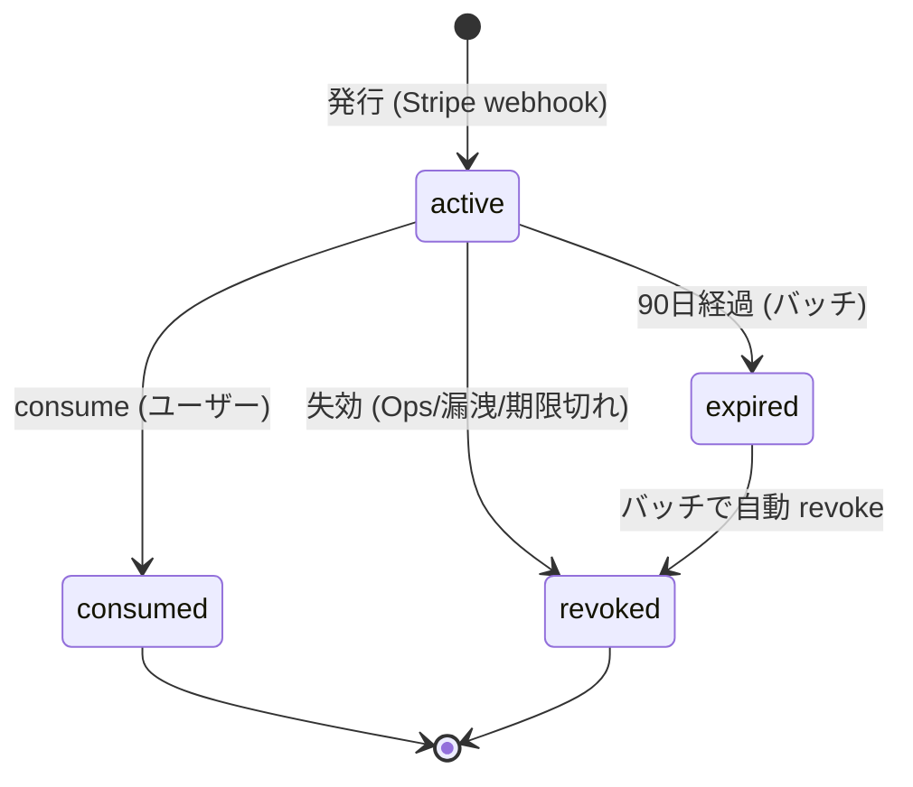
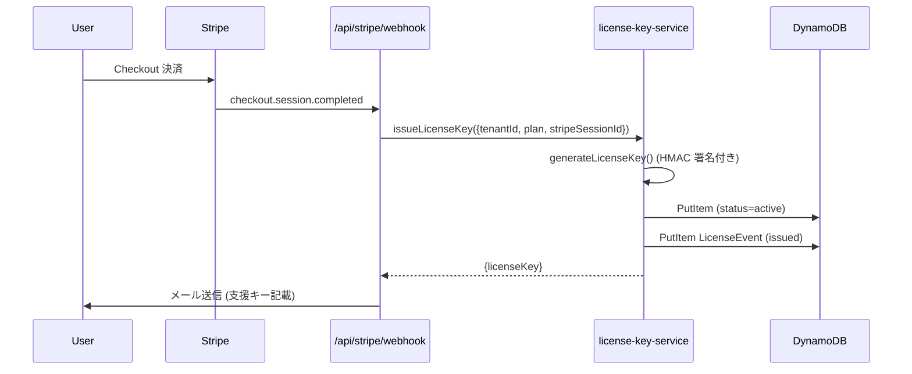
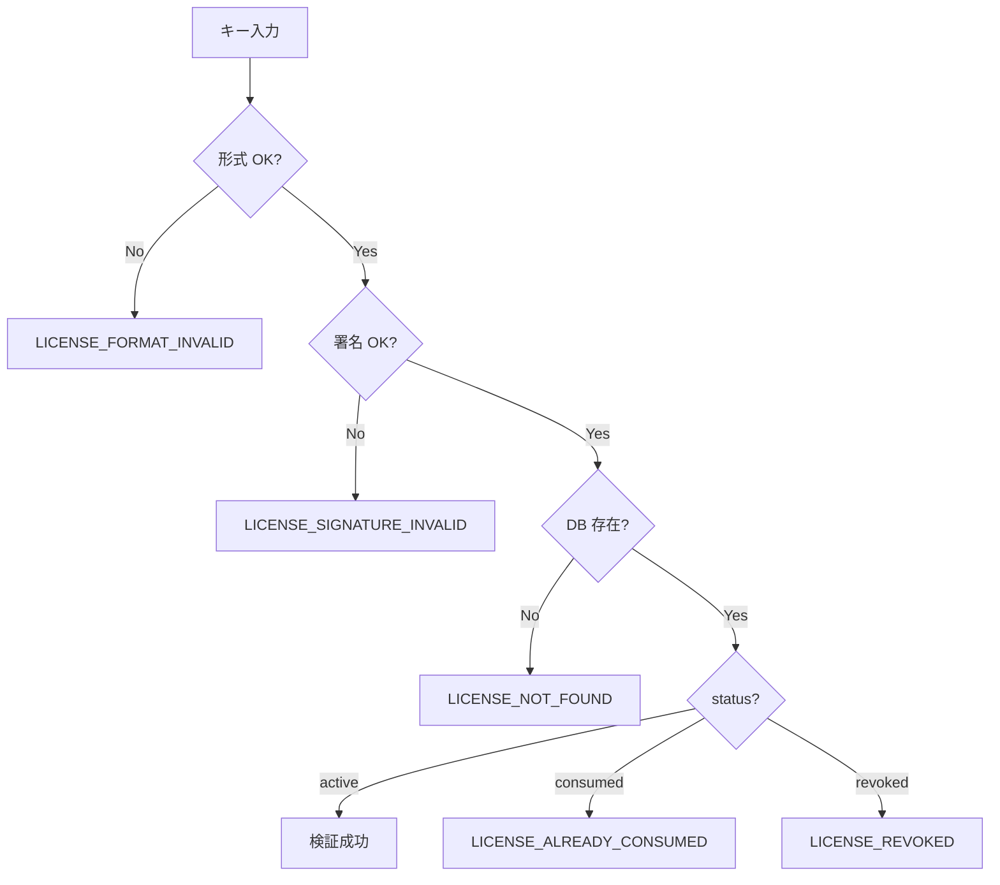
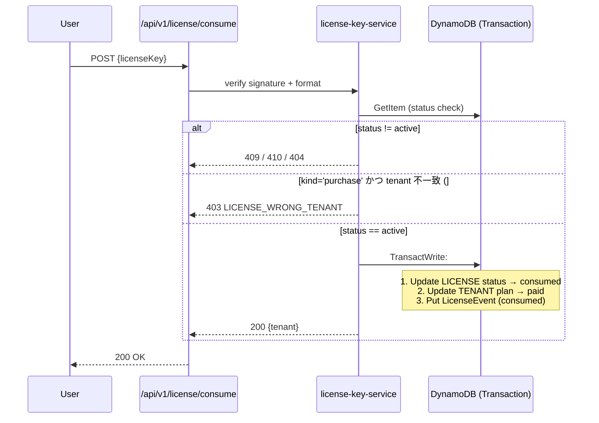

# ライセンスキー ライフサイクル設計書

| 項目 | 内容 |
|------|------|
| ステータス | accepted |
| 最終更新 | 2026-04-11 |
| 関連 Issue | #808 |
| 上位 ADR | ADR-0026 (#809) |
| 上位要件 | [license-key-requirements.md](./license-key-requirements.md) (#812) |
| 因果関係マップ | [license-subscription-causality.md](./license-subscription-causality.md) (#824) |
| 競合分析 | [license-key-competitor-analysis.md](./license-key-competitor-analysis.md) (#811) |
| 運用手順 | [../operations/license-key-secrets.md](../operations/license-key-secrets.md) (#807) |

---

## 0. 本書の位置づけ

ライセンスキーの**全ライフサイクル（発行→配布→検証→消費→失効→監査）**を網羅する設計書。他の設計書 (07/08/19/24) からの参照先として機能する SSOT。

> **本書は「ライフサイクル」のみを扱う。上位要件は #812、決済との因果関係は #824、競合比較は #811、シークレット運用は #807 を参照。**

---

## 1. 全体ライフサイクル図



| 状態 | 説明 | DB `status` 値 |
|------|------|--------------|
| **active** | 発行済み・未消費 | `'active'` |
| **consumed** | ユーザーが consume 済み | `'consumed'` |
| **revoked** | Ops 手動 / 漏洩 / 期限切れで失効 | `'revoked'` |
| **expired** (論理状態) | 90 日経過だがバッチ未実行 | `'active'` + `createdAt + 90d < now()` |

---

## 2. キー形式

### 2.1 フォーマット

```
GQ-XXXX-XXXX-XXXX-YYYYY
│  │    │    │    └── HMAC-SHA256 署名 (5文字)
│  └────┴────┴─────── ランダムペイロード (4文字×3 = 12文字)
└──────────────────── プレフィックス (固定)
```

- **全長**: 22 文字 (`GQ-` + 4 + `-` + 4 + `-` + 4 + `-` + 5)
- **文字セット**: `KEY_CHARS = 'ABCDEFGHJKLMNPQRSTUVWXYZ23456789'` (32 文字、0/O/1/I 除外)
- **ペイロード**: `randomBytes(12)` を `KEY_CHARS[b % 32]` で変換
- **署名**: `HMAC-SHA256(payload, AWS_LICENSE_SECRET)` の先頭 5 バイトを `KEY_CHARS` で変換

### 2.2 LEGACY vs SIGNED

| 形式 | 正規表現 | 説明 | 廃止時期 |
|------|---------|------|---------|
| LEGACY | `^GQ-[A-Z0-9]{4}-[A-Z0-9]{4}-[A-Z0-9]{4}$` | HMAC 署名なし (旧実装) | #806 対応後に廃止 |
| SIGNED | `^GQ-[A-Z0-9]{4}-[A-Z0-9]{4}-[A-Z0-9]{4}-[A-Z0-9]{5}$` | HMAC-SHA256 付き (現行) | — |

> 現状 `AWS_LICENSE_SECRET` が **optional** (#806 bug) のため、dev 環境では LEGACY で発行される場合がある。#806 解消後は SIGNED 必須。

### 2.3 実装リファレンス

- `src/lib/server/services/license-key-service.ts`:
  - `KEY_CHARS`, `CHECKSUM_LENGTH`, `LEGACY_FORMAT`, `SIGNED_FORMAT`
  - `createHmacChecksum(payload, secret)` — 署名生成
  - `verifyKeySignature(key, secret)` — 署名検証
  - `generateLicenseKey()` — 発行
  - `issueLicenseKey(params)` — DB 保存
  - `consumeLicenseKey(key, tenantId)` — 消費

---

## 3. DB スキーマ

### 3.1 LicenseRecord (DynamoDB 単一テーブル)

| フィールド | 型 | 必須 | 説明 |
|-----------|---|------|------|
| `PK` | string | ○ | `LICENSE#<licenseKey>` |
| `SK` | string | ○ | `LICENSE#<licenseKey>` (同一値) |
| `licenseKey` | string | ○ | `GQ-XXXX-XXXX-XXXX-YYYYY` |
| `tenantId` | string | ○ | 発行先テナント ID（purchase の場合は buyer tenant にロック） |
| `plan` | enum | ○ | `'monthly' \| 'yearly' \| 'family-monthly' \| 'family-yearly' \| 'lifetime'` |
| `kind` | enum | △ | **#801**: `'purchase' \| 'gift' \| 'campaign'`。未設定（legacy）は `'purchase'` として扱う |
| `issuedBy` | string | △ | **#801**: 発行 actor。`kind='gift' \| 'campaign'` では必須（監査要件）。`purchase` では `stripe:<sessionId>` |
| `stripeSessionId` | string | — | Stripe Checkout Session ID (発行元) |
| `status` | enum | ○ | `'active' \| 'consumed' \| 'revoked'` |
| `consumedBy` | string | — | 消費したユーザー ID (consume 後) |
| `consumedAt` | string (ISO8601) | — | 消費日時 |
| `revokedReason` | string | — | 失効理由 (`expired` / `leaked` / `ops-manual` / `refund`) |
| `revokedAt` | string (ISO8601) | — | 失効日時 |
| `revokedBy` | string | — | **#797**: 失効実行者 (`ops:<uid>` / `system` / `stripe:<eventId>`)。監査要件 |
| `expiresAt` | string (ISO8601) | △ | **#797**: 有効期限。未設定 (legacy) は期限なし扱い。新規発行は `createdAt + 90 日` をデフォルト |
| `createdAt` | string (ISO8601) | ○ | 発行日時 |

#### 3.1.1 キー種別 (`kind`) と consume 権限 — #801

`kind` は consume 時の **tenant 制約**を決定する。返金後に buyer が他 tenant にキーを流用する家族プラン悪用を防ぐ目的で導入。

| `kind` | 発行元 | `issuedBy` | consume 権限 | 用途 |
|--------|-------|-----------|-------------|------|
| `purchase` | Stripe webhook | `stripe:<sessionId>` | **`record.tenantId === consumedByTenantId` のみ可** | 通常の決済フロー |
| `gift` | Ops 画面 (#816) | `ops:<uid>` 必須 | 任意の tenant 可 | サポート対応・補填 |
| `campaign` | Ops 画面 (#816) | `ops:<uid>` または `system:<batchId>` 必須 | 任意の tenant 可 | キャンペーン配布 |

**後方互換**: `kind` フィールドを持たない legacy レコードは `'purchase'` として解決される（`getRecordKind()` ヘルパー）。すべての legacy レコードは Stripe webhook 経由で発行されているため、最も厳格な `purchase` 扱いが安全。

**実装ポイント**:
- `issueLicenseKey()` は `kind='gift' | 'campaign'` で `issuedBy` 未指定の場合に例外を投げる（監査要件を型ではなくランタイムで強制）
- `consumeLicenseKey()` は status チェック後に `getRecordKind(record) === 'purchase' && record.tenantId !== consumedByTenantId` をチェックし、不一致なら `LICENSE_WRONG_TENANT` 相当のエラーメッセージを返す
- `gift` / `campaign` の cross-tenant consume は LicenseEvent (#815) に actor として記録され、監査ログで追跡可能

### 3.2 GSI (tenant 検索用)

| GSI | PK | SK | 用途 |
|-----|-----|-----|------|
| `GSI1` | `TENANT#<tenantId>` | `LICENSE#<createdAt>` | テナント別キー一覧 (Ops 画面) |

### 3.3 LicenseEvent (監査ログ)

ライセンスキーの全状態変更を記録する append-only ログ。

| フィールド | 型 | 説明 |
|-----------|---|------|
| `PK` | string | `LICENSE_EVENT#<licenseKey>` |
| `SK` | string | `EVENT#<timestamp>#<ulid>` |
| `eventType` | enum | `'issued' \| 'consumed' \| 'revoked' \| 'rotated' \| 'verify_failed' \| 'ops_manual'` |
| `licenseKey` | string | 対象キー |
| `tenantId` | string | 対象テナント |
| `actor` | string | 実行者 (`system` / `user:<uid>` / `ops:<uid>` / `stripe:<eventId>`) |
| `metadata` | map | イベント固有の追加情報 |
| `timestamp` | string | ISO8601 |
| `ttl` | number | Unix timestamp (発行から 7 年後、会計法対応) |

**保持期間**: 7 年 (日本の会計書類保存期間。DynamoDB TTL で自動削除)

---

## 4. API エンドポイント一覧

| メソッド | パス | 説明 | 権限 | 関連 Issue |
|---------|------|------|------|-----------|
| POST | `/api/v1/license/verify` | キー検証 (署名 + DB 照合) | 認証済みユーザー | #812 US-02 |
| POST | `/api/v1/license/consume` | キー消費 → 有料プラン昇格 | 認証済みユーザー | #812 US-02 |
| GET | `/api/v1/ops/license-keys` | Ops 用一覧 (フィルタ対応) | Ops ロール | #812 US-04, #816 |
| POST | `/api/v1/ops/license-keys` | Ops 手動発行 | Ops ロール | #812 US-05, #816 |
| POST | `/api/v1/ops/license-keys/:key/revoke` | Ops 失効 | Ops ロール | #812 US-06, #816 |
| POST | `/api/stripe/webhook` | Stripe webhook 受信 → 発行 | Stripe 署名検証 | #824 |

### 4.1 レスポンス例

#### POST /api/v1/license/verify

```json
// 200 OK
{
  "valid": true,
  "plan": "family-monthly",
  "status": "active",
  "expiresAt": "2026-07-10T00:00:00Z"
}

// 400 Bad Request (形式不正)
{ "error": { "code": "LICENSE_FORMAT_INVALID", "message": "キー形式が不正です" } }

// 404 Not Found (DB 未登録)
{ "error": { "code": "LICENSE_NOT_FOUND", "message": "キーが存在しません" } }

// 410 Gone (失効)
{ "error": { "code": "LICENSE_REVOKED", "message": "キーは失効しています" } }
```

#### POST /api/v1/license/consume

```json
// 200 OK
{
  "tenant": {
    "tenantId": "tenant_123",
    "plan": "family-monthly",
    "status": "active",
    "currentPeriodEnd": "2026-05-11T00:00:00Z"
  }
}

// 409 Conflict (既に消費済み)
{ "error": { "code": "LICENSE_ALREADY_CONSUMED", "message": "既に使用されたキーです" } }
```

> エラーコード一覧は [07-API設計書.md §4](./07-API設計書.md#4-エラーレスポンス仕様) に追記。

---

## 5. 状態遷移詳細

### 5.1 発行 (issue)



**ポイント**:
- 発行は **Stripe webhook からのみ** (手動発行は Ops 経由の例外)
- `stripe_webhook_events` テーブルで冪等性を担保 (#824)
- 発行時にはまだテナントはキーを消費していない (`active` 状態)

### 5.2 配布 (deliver)

- **通常ルート**: 決済完了メールに本文で記載 (`GQ-XXXX-XXXX-XXXX-YYYYY`)
- **再送**: `/admin/plan` からユーザーが自分で再取得可能
- **Ops 対応**: `/ops/license-keys` からサポート担当者が特定ユーザーに再送信
- **贈答/キャンペーン**: Stripe のクーポン (100% OFF) 経由で通常発行フローを流用 (独自の贈答発行 API は作らない)

### 5.3 検証 (verify)



**レート制限**: IP: 10 req/min、email: 20 req/hour。超過時は HTTP 429 + Discord 通知 (#813)

### 5.4 消費 (consume)



**ポイント**:
- **TransactWrite で原子性担保**: ライセンス消費とテナント昇格は同一トランザクション
- **#801 クロステナント拒否**: `kind='purchase'` は buyer tenant にロック。返金後の家族プラン悪用を防止（legacy レコードは purchase 扱い）
- consumed 状態は**不可逆** (再利用不可)
- consume 後 `current_period_end` は Stripe subscription の値を参照 (#824)

### 5.5 失効 (revoke)

| トリガ | `revokedReason` | 実施者 (`revokedBy`) |
|-------|---------------|-------|
| 90 日経過バッチ | `'expired'` | `system` |
| HMAC シークレット漏洩 | `'leaked'` | `ops:<uid>` |
| Ops 手動失効 | `'ops-manual'` | `ops:<uid>` |
| Stripe 返金 | `'refund'` | `stripe:<eventId>` (webhook) |

**#797 実装ポイント**:
- `revokeLicenseKey(params)` サービスが `IAuthRepo.revokeLicenseKey()` を呼ぶ。`status='revoked'` + `revokedAt` + `revokedReason` + `revokedBy` を**一括更新**する（部分更新で `reason` が欠落するのを防ぐ）
- `active` 以外のキー (consumed / revoked) は revoke 不可。**冪等**なので既に revoked なキーへの呼び出しはエラー応答のみで副作用なし
- revoke 後の `validateLicenseKey` / `consumeLicenseKey` は `reason: 'このライセンスキーは無効化されています'` を返す
- 期限切れ (`expiresAt < now`) は `status='active'` でも `validate` / `consume` で拒否される（バッチ未実行でも安全）

### 5.6 期限切れバッチ

- **実行頻度**: 1 日 1 回 (EventBridge cron)
- **対象**: `status='active'` かつ `createdAt + 90日 < now()`
- **処理**: `status='revoked'`, `revokedReason='expired'` に更新 + LicenseEvent 記録
- **通知**: 期限切れ 7 日前にメール通知 (#818)

---

## 6. 権限ロール

| ロール | 実行可能操作 |
|--------|------------|
| **user (テナント管理者)** | 自テナントのキー consume / 再送要求 |
| **user (一般メンバー)** | キー consume (招待されたテナント内で) |
| **ops (サポート)** | 全キー閲覧・手動発行・手動失効・CSV export |
| **ops (admin)** | + シークレットローテーション |
| **system** | 発行 / 期限切れバッチ / 監査ログ記録 |

---

## 7. Stripe Webhook との関係

詳細は [license-subscription-causality.md](./license-subscription-causality.md) 参照。要点のみ:

| Stripe イベント | License への影響 | Tenant への影響 |
|----------------|----------------|----------------|
| `checkout.session.completed` | `issued` (新規発行) | — (この時点ではまだ free) |
| ユーザーによる consume API 呼び出し | `consumed` | `plan='paid'`, `status='active'` |
| `invoice.paid` | — | `currentPeriodEnd` 更新 |
| `invoice.payment_failed` | — | `status='grace_period'` |
| `customer.subscription.deleted` | — | `status='expired_retention'` |
| 返金処理 | `revoked` (`reason='refund'`) | `status='expired_free'` |

---

## 8. セキュリティ考慮

| 項目 | 対策 | 関連 |
|------|-----|------|
| 偽造防止 | HMAC-SHA256 署名 (5 文字チェックサム) | ADR-0026 §A |
| 総当たり攻撃 | レート制限 (IP: 10 req/min + email: 20 req/hour, Discord incident 通知付き) | #813 |
| シークレット漏洩 | `AWS_LICENSE_SECRET_PREVIOUS` で grace period 検証 | #807, #810 |
| 監査トレイル | LicenseEvent に 7 年保持 | §3.3 |
| CS なりすまし | Ops 操作は 2FA 必須 | #820 |

---

## 9. 設計書間の参照マップ

本書は他の設計書から参照される SSOT として位置付ける。

| 参照元 | 参照セクション | 内容 |
|-------|-------------|------|
| `07-API設計書.md` | §2.9 ライセンスキー | §4 API エンドポイント一覧 |
| `08-データベース設計書.md` | §3.X LicenseRecord / LicenseEvent | §3 DB スキーマ |
| `19-プライシング戦略書.md` | §X ライセンスキー運用 | §5 状態遷移 |
| `24-ソフトウェアアーキテクチャ設計書.md` | license-service | §1-2 形式・状態 |
| `14-セキュリティ設計書.md` | ライセンスキーセキュリティ | §8 セキュリティ考慮 |

---

## 10. 未解決項目 (Gap)

以下は現状の実装と本書の乖離ポイント。各 Issue で対応中:

| # | 項目 | 現状 | 目標 | Issue |
|---|------|------|------|-------|
| 1 | `AWS_LICENSE_SECRET` optional | optional で LEGACY 形式が発行される場合あり | required 化 | #806 |
| 2 | HMAC 鍵 grace period | 未実装 | `AWS_LICENSE_SECRET_PREVIOUS` フォールバック | #810 |
| 3 | LicenseEvent テーブル | 未作成 | DynamoDB に追加 | #815 |
| 4 | `/ops/license-keys` | 未実装 | Ops 画面作成 | #816 |
| 5 | レート制限 | 実装済み（IP: 10 req/min, email: 20 req/hour, Discord 通知） | consume エンドポイントに導入 | #813 |
| 6 | 期限切れバッチ | 未実装 | EventBridge cron | #817 |
| 7 | 期限切れ通知メール | 未実装 | 7 日前通知 | #818 |

---

## 11. 更新履歴

| 日付 | 更新内容 | 更新者 |
|------|---------|--------|
| 2026-04-11 | 初版作成 (#808) | Claude Code |
| 2026-04-11 | §3.1 に `kind` / `issuedBy` フィールド追加、§5.4 に cross-tenant 拒否フロー追記 (#801) | Claude Code |
| 2026-04-11 | §3.1 に `expiresAt` / `revokedBy` フィールド追加、§5.5 に revokeLicenseKey 実装ポイント追記 (#797) | Claude Code |
| 2026-04-13 | §5.3 レート制限仕様値を実装に合わせて更新（IP: 10 req/min, email: 20 req/hour）、§8 セキュリティ考慮を更新、§10 Gap 表 #813 を実装済みに変更 (#813) | Claude Code |
