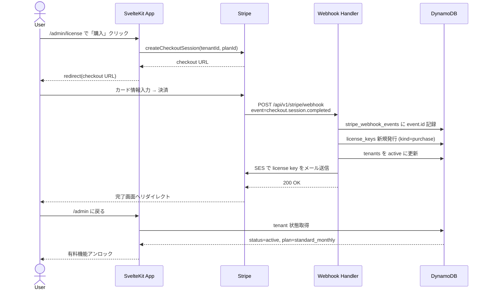
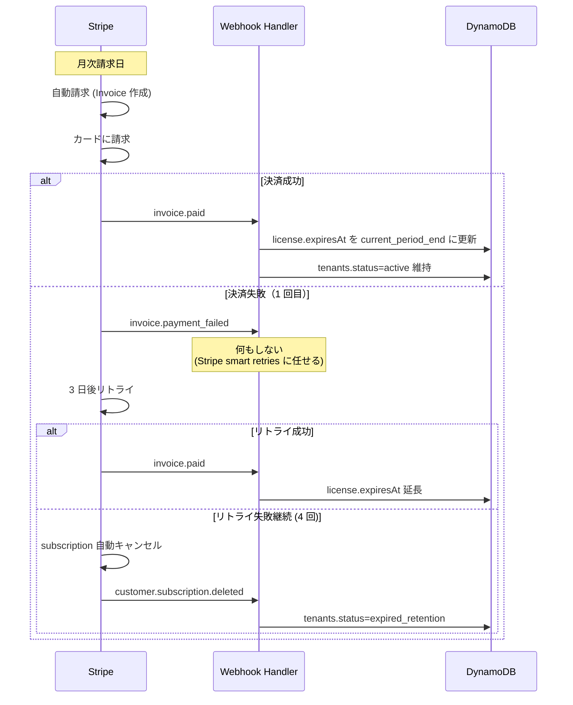
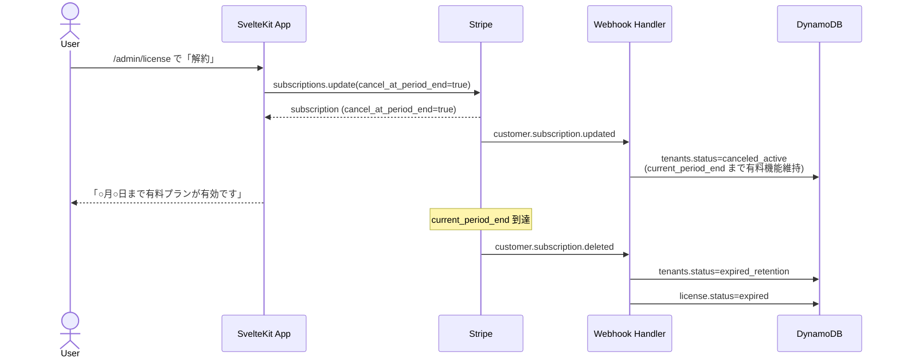
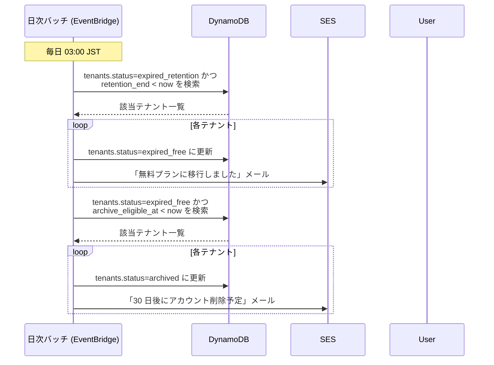
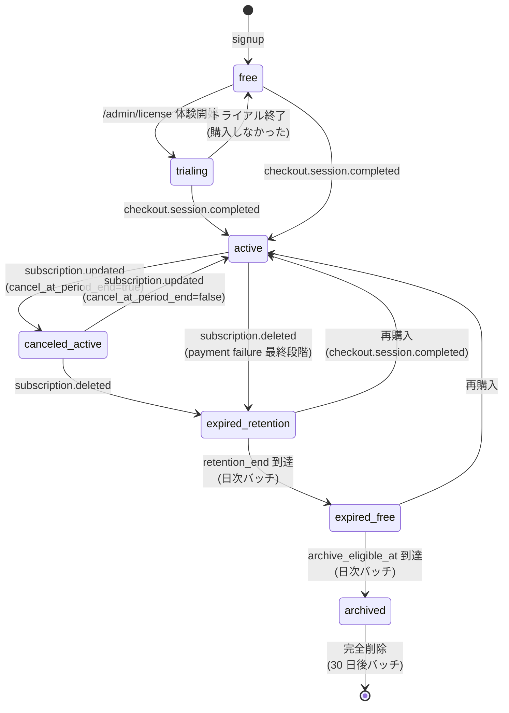

# License ↔ Stripe Subscription 因果関係マップ

| 項目 | 値 |
|------|-----|
| 版数 | 1.0 |
| 作成日 | 2026-04-11 |
| 関連 Issue | #824 |
| 関連 ADR | ADR-0003（設計書 SSOT）, ADR-0024（プラン解決責務分離） |
| 参照設計書 | `07-API設計書.md`, `08-データベース設計書.md`, `19-プライシング戦略書.md` |
| 実装状態 | 部分実装（本書と現行実装に差分あり — §8 参照） |

---

## 0. この文書の位置付け

本書は **License Key と Stripe Subscription のライフサイクルの Single Source of Truth**。
以下の実装はこの因果関係マップを根拠に実装・改修すること:

- `src/lib/server/services/stripe-service.ts`（Webhook handler）
- `src/lib/server/services/license-service.ts`（License key 発行・検証・更新）
- `src/routes/api/v1/stripe/webhook/+server.ts`（Webhook エンドポイント）
- `/ops/license`（手動発行・revoke）
- Phase 2 自動化基盤（#820, #821）

本書と実装が矛盾した場合、**本書が正**。実装を本書に合わせる。

---

## 1. 設計原則

### 1.1 Stripe = Source of Truth（B-3）

すべての plan 状態は Stripe webhook を起点として決定される。
自アプリ DB（`tenants` / `license_keys` テーブル）は「Stripe の状態をキャッシュしているもの」と位置付ける。

**理由**:
- Stripe の subscription 状態と自アプリ DB の不整合は致命的なユーザー体験劣化を招く
- 両方で状態を持つと同期ロジックが複雑化し、必ずバグる（#725 / #728 の教訓）
- 決済ドメインは Stripe に任せ、自アプリはキャッシュとして扱うのが最も安全

### 1.2 契約期間の扱い（C-1）

- **Stripe subscription の `current_period_end` = license key の `expiresAt`**
- 月額（`standard_monthly` / `family_monthly`）なら次の更新日
- 年額（`standard_yearly` / `family_yearly`）なら次の年次更新日
- 更新成功（`invoice.paid` webhook）で `expiresAt` が自動延長される

### 1.3 dunning 期間（C-2）

Stripe に**完全一任**する。自アプリ側で猶予期間ロジックを持たない。

- `invoice.payment_failed` webhook を受信しても **license を revoke しない**
- Stripe の smart retries（4 回まで自動リトライ）に任せる
- `customer.subscription.deleted` webhook で初めて反応する
- それまでは license は active 維持

**理由**:
- 決済リトライロジックは Stripe のほうが遥かに高品質（カード会社連携、AI ベースの最適タイミング）
- 自アプリで grace_period を持つと「Stripe 側は解決済みなのに自アプリ側が revoke」などの矛盾が発生

### 1.4 gift / campaign の扱い（C-3）

100% OFF Stripe クーポン + promotion code で Subscription を作成する。

- 通常購入と同じ webhook 経路を通る（実装の重複がない）
- license の `kind: 'campaign'` で区別（#801）
- 運営チームが /ops からクーポン + promo code 発行 → URL 配布（Phase 3）
- 分析 KPI（LTV / 転換率）に反映（Phase 4）

---

## 2. 因果関係マップ（Canonical）

### 2.1 発行（subscription 新規作成）

| 起点 Event | 条件 | 結果（license） | 結果（tenant plan state） |
|---|---|---|---|
| `checkout.session.completed` | `mode='subscription'`, クーポン未適用 or 100% 未満 | `kind='purchase'`, `status='active'`, `expiresAt=subscription.current_period_end`, `licenseKey` 発行 | `status='active'`, `plan=metadata.planId`, `stripeCustomerId` / `stripeSubscriptionId` 紐付け |
| `checkout.session.completed` | 100% OFF クーポン適用 | `kind='campaign'`, 上と同じ | 上と同じ |
| `/ops/license` 手動発行（gift） | 運営が管理画面から発行 | `kind='gift'`, `status='unassigned'`, tenant 未紐付け | （変更なし）後から `consume` API でテナントに紐付け |

### 2.2 更新（継続課金成功）

| 起点 Event | 結果（license） | 結果（tenant plan state） |
|---|---|---|
| `invoice.paid` | `expiresAt` を新 `subscription.current_period_end` に更新 | `status='active'`（念のため）, `plan` は変更しない |
| `customer.subscription.updated`（plan 変更 standard↔family） | `plan` フィールドを新 plan に更新 | `plan` を新 plan に更新 |
| `customer.subscription.updated`（trialing → active） | `status='active'` | `status='active'` |

**重要**: `invoice.paid` の唯一の責務は `expiresAt` の延長。plan 種別や customer 情報は触らない。

### 2.3 失敗（支払い失敗 → dunning）

| 起点 Event | 結果（license） | 結果（tenant plan state） |
|---|---|---|
| `invoice.payment_failed` | **何もしない** | **何もしない** |

**理由**: §1.3 参照。Stripe の smart retries に完全に任せる。

### 2.4 解約（ユーザー起点）

| 起点 Event | 結果（license） | 結果（tenant plan state） |
|---|---|---|
| `customer.subscription.updated`（`cancel_at_period_end=true`） | 変更なし | `status='canceled_active'`（`current_period_end` まで有料機能利用可） |
| `customer.subscription.deleted` | `status='expired'`（`current_period_end` 経過後の自動通知） | `status='expired_retention'`（データ保持期間へ） |

### 2.5 失効（時間経過）

| 起点 | 条件 | 結果（license） | 結果（tenant plan state） |
|---|---|---|---|
| 日次バッチ（Phase 2 #821） | `license.expiresAt < now` | `status='expired'` | `status='expired_retention'`（retention window 開始） |
| 日次バッチ | `tenant.status='expired_retention'` かつ `retention_end < now` | （変更なし） | `status='expired_free'`（無料プラン相当にダウングレード） |
| 日次バッチ | `tenant.status='expired_free'` かつ `archive_eligible_at < now` | （変更なし） | `status='archived'`（アカウントアーカイブ、30 日後削除予告通知） |

### 2.6 手動介入（運営）

| 起点 | 結果（license） | 結果（tenant plan state） | 監査ログ |
|---|---|---|---|
| `/ops/license` 手動 revoke | `status='revoked'`, `revokedAt=now`, `revokedReason` 記録 | 現状維持（次回整合性チェックで検出・通知） | 必須（運営 ID, 理由） |
| `/ops/tenants` 手動 plan 変更 | **原則禁止** | やむを得ない場合のみ | 必須（運営 ID, 理由, 承認者） |
| `/ops/license` 手動 extend（expiresAt 延長） | `expiresAt` を手動指定値に更新 | 影響なし | 必須 |

**原則**: 運営による手動介入は、Stripe との整合性を崩す可能性があるため、必ず監査ログを残す。
後続の日次整合性チェックバッチで「Stripe = 正、自アプリ DB = 従属」の差分検知を行う。

---

## 3. シーケンス図

### 3.1 通常購入フロー



### 3.2 月次継続課金フロー



### 3.3 ユーザー解約フロー



### 3.4 失効・アーカイブフロー（日次バッチ）



---

## 4. Tenant Plan State Machine

### 4.1 状態一覧

| state | 意味 | 有料機能 | データ読み | データ書き |
|-------|------|---------|---------|---------|
| `free` | 無料プラン（新規作成直後） | ❌ | ✅ | ✅ |
| `trialing` | トライアル中 | ✅ | ✅ | ✅ |
| `active` | 有料プラン active | ✅ | ✅ | ✅ |
| `canceled_active` | 解約予約中（`current_period_end` まで） | ✅ | ✅ | ✅ |
| `expired_retention` | 有料期間終了、データ保持期間中（30 日） | ❌ | ✅ | ✅（新規作成は制限） |
| `expired_free` | 保持期間終了、無料プランと同等制限 | ❌ | ✅ | ✅（無料プラン上限まで） |
| `archived` | アーカイブ（削除予告、30 日後完全削除） | ❌ | ❌ | ❌ |

### 4.2 状態遷移図



---

## 5. License Key 状態

| status | 意味 | tenant への影響 |
|--------|------|---------------|
| `unassigned` | 発行済み、未使用 | なし（gift / campaign 専用） |
| `active` | tenant に紐付け済み、有効期限内 | tenant.plan を有料プラン相当に |
| `expired` | 有効期限切れ | tenant.status が `expired_*` 系に遷移 |
| `revoked` | 運営が手動 revoke | 整合性チェックバッチで検知 |

---

## 6. Idempotency 設計

### 6.1 Stripe Webhook の at-least-once 保証

Stripe は webhook の at-least-once 配信を保証するが、**exactly-once ではない**。
同一 event が複数回配信される可能性があるため、全ての webhook handler は idempotent でなければならない。

### 6.2 実装方針

```
1. Webhook 受信
2. DB トランザクション開始
3. stripe_webhook_events テーブルに event.id を PutItem（条件式: attribute_not_exists）
   - 既に存在 → 既処理としてスキップ、200 OK を返す
   - 新規 → 次のステップへ
4. Event 種別に応じた handler を実行（license 発行・更新・削除等）
5. stripe_webhook_events.processed_at = now を更新
6. トランザクション commit
7. 200 OK を返す
```

### 6.3 DB スキーマ（追加対象）

```
stripe_webhook_events (新規テーブル)
  PK: EVENT#{event.id}
  SK: META
  attributes:
    eventId: string
    eventType: string
    receivedAt: ISO8601
    processedAt: ISO8601 | null
    status: 'received' | 'processing' | 'processed' | 'failed'
    tenantId: string | null
    rawPayload: JSON (監査用)
  TTL: 90 日（監査ログ保持期間）
```

### 6.4 失敗時の再配信

- `status='failed'` で記録された event は Stripe Dashboard から手動で再配信
- handler はリトライ可能になるよう純粋関数化する（副作用の順序に依存しない）

---

## 7. エラー形式統一（ADR-0024 参照）

プラン制限・ライセンス起因のエラーは以下の統一形式で返す:

```typescript
type PlanLimitError = {
  code: 'PLAN_LIMIT_EXCEEDED' | 'LICENSE_EXPIRED' | 'LICENSE_REVOKED' | 'LICENSE_NOT_FOUND';
  currentTier: PlanTier;
  requiredTier?: 'standard' | 'family';
  reason: string;
  upgradeUrl: '/admin/license';
};
```

`fail(400)` や生の `error(403, '...')` ではなく、この形式で返す。

---

## 8. 現行実装との差分（TODO）

本書は PO 方針の正仕様を定義しており、現行実装（`src/lib/server/services/stripe-service.ts`）には以下の差分がある。

| # | 現行実装 | 本書 Canonical | 影響 | 対応 Issue |
|---|---------|---------------|------|----------|
| 1 | `handleInvoicePaid`: plan を更新し、`expiresAt` を更新しない | `expiresAt=current_period_end` に更新必須 | 契約期間が延長されない | #820 / #821 |
| 2 | `handlePaymentFailed`: `status='grace_period'` + `planExpiresAt` 設定 | **何もしない** | dunning の二重管理、revoke 誤動作 | 要修正 |
| 3 | `handleSubscriptionDeleted`: `status='suspended'` | `status='expired_retention'` | retention window が機能しない | 要修正 |
| 4 | `cancel_at_period_end=true` の handling なし | `status='canceled_active'` に遷移 | 解約予約が DB に反映されない | #784 / #741 |
| 5 | `stripe_webhook_events` テーブル未実装 | idempotency 保証のため必須 | 同一 event 二重処理の危険 | #821 |
| 6 | 日次失効バッチ未実装 | `expired_retention` → `expired_free` → `archived` の自動遷移 | retention / archive が手動対応 | #821 |

これらの差分は **Phase 2 自動化基盤（#820 / #821）で解消する**。
本書の Canonical 定義を根拠に実装・レビューを行うこと。

---

## 9. 参照

- `07-API設計書.md` — Webhook エンドポイント仕様
- `08-データベース設計書.md` — tenants / license_keys / stripe_webhook_events テーブル
- `19-プライシング戦略書.md` §2 プラン一覧
- ADR-0024 — プラン解決責務分離パターン
- Stripe 公式: [Smart Retries](https://stripe.com/docs/billing/revenue-recovery/smart-retries)
- Stripe 公式: [Webhook Signatures](https://stripe.com/docs/webhooks/signatures)

---

## 改訂履歴

| 版 | 日付 | 変更内容 |
|----|------|---------|
| 1.0 | 2026-04-11 | 初版。PO 方針（B-3 / C-1 / C-2 / C-3）確定に基づき canonical 定義。#824 |
