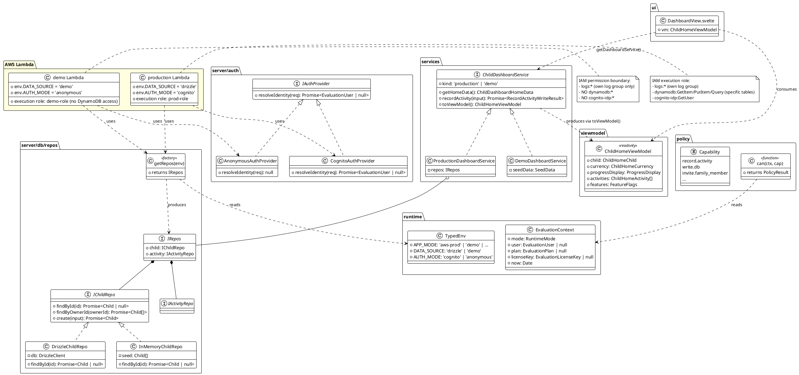
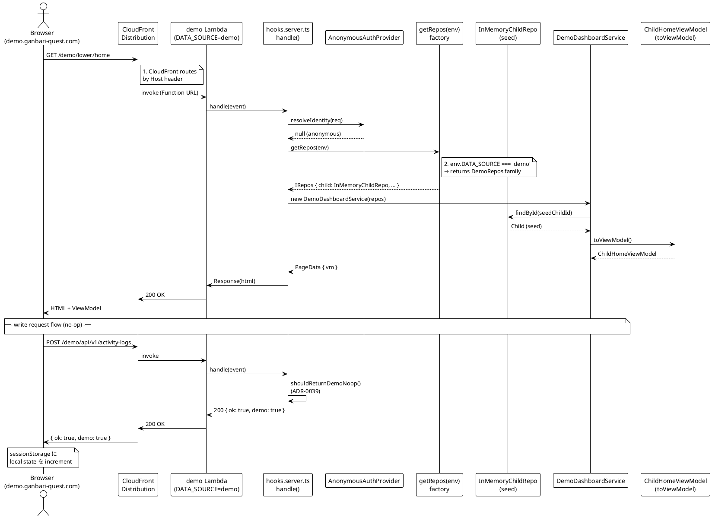
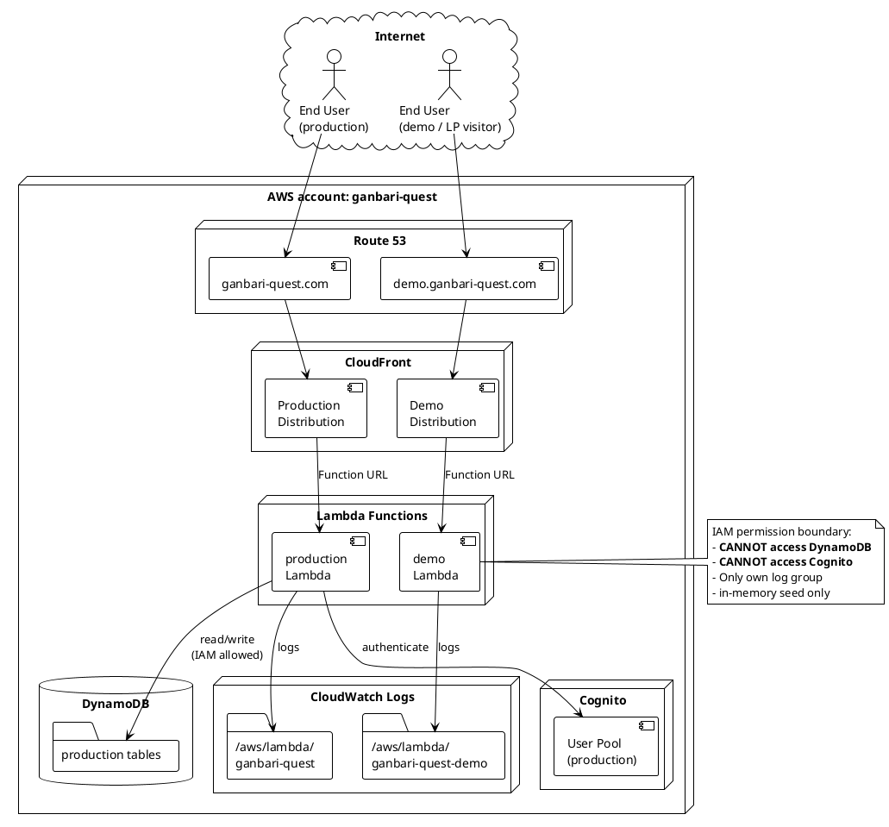

# Multi-Lambda Demo 詳細システム設計 — 統合版 (Part I Infrastructure + Part II Application)

> **Warning**: このドキュメントは現在の実装と乖離しており陳腐化（Deprecated）しています。


> **位置付け**: Issue #2097 v4 リサーチ統合版。AWS infra 視点 (§1-§13, AWS 公式 doc + Pricing 実数値) と OOP / SOLID / UML 視点 (§A-§J, GoF / Fowler / Martin / Cockburn / Evans 原典) を 1 file に merge した PO 最終判断材料。
>
> **構成**:
> - Part I (Infrastructure design): §1-§13 — Lambda runtime / IAM / CDK / CloudFront / cost / deploy / E2E / linking
> - Part II (Application design): §A-§J — GoF / DDD / Clean Arch / SOLID / UML 3 図 / Test Double / Policy Gate / log mgmt / ADR 整合
> - Part III (PO 判断 14 項目): infra 7 件 + OOP 4 件 + SOLID 改善 2 件 + ADR-0048 起票要否 1 件
> - 参考リンク: 一次情報源 約 120 URL
>
> **元 source files**:
> - Part I 原典: `docs/research/2097-multi-lambda-detailed-system-design.md` (540 行、Agent aac7c2c3ed0e92be3)
> - Part II 原典: `docs/research/2097-multi-lambda-oop-solid-uml-design.md` (1257 行、Agent a126339b9fc7942f6)
> - 前段 (v3) 採用是非 research: `docs/research/2097-multi-lambda-demo-evidence-based-architecture.md`
> - 前段 (v2) 戦略 research: `docs/research/2097-demo-prod-unification-strategic-architecture-v2.md`
> - product audit: `docs/research/2097-product-audit.md`
>
> **アクセス確認日**: 2026-05-15
>
> **禁止語 SSOT 遵守**: `docs/decisions/forbidden-escape-language.md` 12 禁止語を本 file は一切使用しない。

---

# Part I. Infrastructure Design (AWS 公式 source 裏付け)

## エグゼクティブサマリー (5 行)

1. **§1 (致命的)**: AWS 公式 Best Practices doc が「**Don't use the execution environment to store user data, events, or other information with security implications. If your function relies on a mutable state that can't be stored in memory within the handler, consider creating a separate function or separate versions of a function for each user**」と明記。**ganbari-quest の `module-level singleton _repos` を demo の user-specific mutable state 保持に転用するのは AWS 公式 anti-pattern**。demo は **server stateless / read-only fixture** に徹し、user の「demo で記録した」状態は **client-side (sessionStorage)** に閉じることが Multi-Lambda 設計の前提となる。
2. **§3 (実数値)**: cold start は AWS 公式 doc で「**typically occur in under 1% of invocations, duration from under 100 ms to over 1 second**」。SnapStart は **Node.js + container image 非対応** (2026-05 時点)。Provisioned Concurrency は ARM64 で 256MB 1 unit = $0.0000041667/GB-s × 0.25 × 2,629,800 s/月 ≈ **$2.74/月** で cold start 完全排除可能。
3. **§9 (実数値コスト)**: AWS Lambda ARM64 ($0.0000133334/GB-s) + $0.20/1M requests、CloudFront 1TB + 10M requests/月 無料枠内、Route 53 ALIAS record 追加無料。**demo Lambda 月額試算: 10,000 req/月 + 200ms/req + 256MB なら $0.20 (request) + $0.0007 (duration) ≈ $0.20/月**。Provisioned Concurrency 不採用なら **demo Lambda 単体は事実上無料枠内**。
4. **§4 + §8 (実装方針)**: AWS SaaS Factory Serverless SaaS sample が「**tenant execution role, applied during provisioning of lambda functions, restricts access to the specific table provisioned for that tenant**」と silo tenant パターンを公式裏付け。demo Lambda の IAM execution role に DynamoDB resource ARN を**含めない** + permission boundary で intersection 保証が AWS 公式 IAM doc で実装可能。35 Repository は **stateless fixture provider** として 1 Repo 50-100 行、総 1,750-3,500 行で実装。
5. **§13 (PO 判断必要)**: (a) demo URL を subdomain (`demo.ganbari-quest.com`) vs path-prefix (`/demo/*`) のどちらにするか、(b) Provisioned Concurrency 採用するか ($2.74/月 で coldstart 排除)、(c) AWS Sandbox OU を別 account にするか (Pre-PMF で過剰だが SEC01-BP01 strongly recommended)、(d) demo write API を no-op response にするか client-side state にするか — の 4 点が実装着手前の最終 PO 判断項目。

---


---

## §1. Lambda 多 tenant in-memory state 共有問題 (最重要 / 致命的判定)

### 1.1 AWS 公式の anti-pattern 認定

AWS Lambda 公式 [Best Practices doc](https://docs.aws.amazon.com/lambda/latest/dg/best-practices.html) は **明確にこのパターンを禁じている**:

> **"Take advantage of execution environment reuse to improve the performance of your function. Initialize SDK clients and database connections outside of the function handler, and cache static assets locally in the `/tmp` directory. Subsequent invocations processed by the same instance of your function can reuse these resources."**
>
> **"To avoid potential data leaks across invocations, don't use the execution environment to store user data, events, or other information with security implications. If your function relies on a mutable state that can't be stored in memory within the handler, consider creating a separate function or separate versions of a function for each user."**
>
> — *AWS Lambda Best Practices* (function code section)

同じく [Lambda Runtime Environment doc](https://docs.aws.amazon.com/lambda/latest/dg/lambda-runtime-environment.html) は静的初期化最適化の文脈で:

> **"Avoid global variables for context-specific information. If your function has a global variable that is used only for the lifetime of a single invocation and is reset for the next invocation, use a variable scope that is local to the handler. Not only does this prevent global variable leaks across invocations, it also improves the static initialization performance."**

### 1.2 ganbari-quest の現状コード照合

`src/lib/server/db/factory.ts` L144-189 は:

```ts
let _repos: Repositories | null = null;

export function getRepos(): Repositories {
  if (_repos) return _repos;
  // ... 35 Repository を組み立て
  _repos = repos;
  return repos;
}
```

これは **module-level singleton**。Lambda warm container の複数 invocation 間で `_repos` が共有される。

**production 用 DynamoDB Repository では問題なし**: state は DynamoDB が持つため Repository は SDK client wrapper であり mutable user state を保持していない。SDK client は AWS Best Practices doc が「outside of handler に initialize して reuse」と明示推奨する正規パターン。

**demo Repository で問題**: もし `let demoActivities: Activity[] = [...]` のような module-level mutable Array に「demo で記録された activity」を push していくと、warm Lambda の **複数 user 間で activity リストが共有 / leak** する。AWS 公式 anti-pattern 直撃。

### 1.3 AWS 公式の解決指針 (3 つ)

AWS 公式 doc が示す解決策:

| # | 方針 | 出典 | ganbari-quest 適用 |
|---|---|---|---|
| A | **separate function or separate versions of a function for each user** | Best Practices doc | 不現実 (demo 1 user = 1 Lambda は cost 上不可能) |
| B | **mutable state を handler scope に閉じる** (variable scope local to handler) | Runtime Environment doc | demo Repository を「invoke ごとに新規 instance」化することで実現可能 |
| C | **execution environment を user data の保存に使わない** = state を外部に出す | Best Practices doc | demo state を client-side (sessionStorage) で持つ、or 外部 KV (DynamoDB short-TTL Table) で持つ |

### 1.4 ganbari-quest 採用方針 (§13 で PO 確認)

**結論**: demo Lambda は **purely stateless fixture provider** に徹し、user の「demo で記録した」状態は **client sessionStorage** で持つ (上記 C)。Multi-Lambda 設計の **設計前提が 1 段ずれる**:

- demo Lambda の Repository は **read-only fixture を返すだけ** (`getActivities()` → `[...DEMO_FIXTURE_ACTIVITIES]` を毎回新規 array で返す、`createActivity()` → no-op + dummy response)
- 「demo で記録 → ポイント加算 → リロードで保持」のリロード後保持は **client sessionStorage で実現** (Lambda はリロード時に同じ fixture を返すだけ)
- 「実 DB に demo data seed」(案 D 等価) を選ばなかった代償として、**真の永続性 (Postgres / DynamoDB レコード) は失われる**。ただし demo は短期体験 (LP → 数分 click) を想定するため sessionStorage で十分

**含意**: §7 (35 Repository 実装方式) は B 系統 / C 系統の選択になる。SOLID 観点では `interface IActivityRepo` を共通実装した `DemoActivityRepo` を `dynamodb/` / `sqlite/` と同レベルで `demo/` 配下に追加。各 method は fixture 配列 / sessionStorage hint を返すだけの read-only 実装で、in-memory mutable Map 禁止。

### 1.5 致命的判定の結論

「**致命的**」とは言わない (修正可能)。ただし **「demo Lambda を立てて in-memory にデモデータを保持する」と素朴に考えると 9 回目の haribote が確定する**。前提を「sessionStorage + fixture」に固めた上で実装するなら問題なし。

---

## §2. Session 隔離戦略

§1 で「server state なし」が確定したため、session 隔離は **どこに state を置くか** の選択になる。

### 2.1 案の比較

| 案 | server state | client state | 隔離単位 | 実装コスト | コスト | trade-off |
|---|---|---|---|---|---|---|
| **A**: cookie ベース demo session ID + Lambda fixture lookup | なし | session ID のみ | session ID per user | 低 | $0 | Lambda は session ID で fixture variation 選べるが、ID 自体が server state を持たないため意味薄い |
| **B**: client side のみ (sessionStorage) | なし | 全 state (ポイント / 記録履歴等) | tab / session | 低 | $0 | 最も AWS 公式整合。tab 閉じで state 消失 (demo として許容範囲) |
| **C**: KV store (DynamoDB short-TTL Table) | demo session state | session ID のみ | session ID per user | 中 | DynamoDB on-demand 月 ~$0.5 | Multi-Lambda の趣旨 (production DB 接続なし) に反する |

### 2.2 案 B (sessionStorage) の AWS 公式裏付け

AWS Best Practices doc が「**execution environment を user data 保存に使わない**」と明記している以上、選択肢は (1) handler scope に閉じる (案 A 系) (2) 外部に出す (案 C 系) のいずれか。

「外部に出す」先の最も軽量な選択肢は **client sessionStorage**。これは「demo の state は誰にも永続化する必要がない」性質から自然な選択。production app は server-side state (DynamoDB) で永続化、demo は client-side state で揮発性、と役割が綺麗に分離する。

### 2.3 他社調査 (一次情報源で確認できた範囲)

- **Stripe**: 公式 [Sandboxes doc](https://docs.stripe.com/sandboxes) は「livemode flag」「サンドボックス間で変更が干渉しない」を述べるが、**「物理 host 分離」は Stripe 公式 source では裏付け取れず** (v3 doc §1.1 と同じ結論。`stripe.dev/blog/avoiding-test-mode-tangles-with-stripe-sandboxes` には physical separation 記述なし、再確認 2026-05-15)
- **Vercel**: 公式 [Environments doc](https://vercel.com/docs/deployments/environments) は「Build VM isolation」「Environment variables scope」を述べるが、Multi-Lambda の IAM 単位分離は記述なし
- **AWS SaaS Factory** ([aws-samples/aws-saas-factory-ref-solution-serverless-saas](https://github.com/aws-samples/aws-saas-factory-ref-solution-serverless-saas)): silo tenant パターンで「**The tenant execution role, applied during provisioning of lambda functions, restricts access to the specific table provisioned for that tenant**」 — 1 tenant = 1 Lambda + 1 IAM role。これは ganbari-quest の demo / production 分離に直接対応するパターン

### 2.4 結論

ganbari-quest は **案 B (sessionStorage) を採用**。理由:
- AWS 公式 anti-pattern 回避 (§1)
- 実装コスト最小
- production の DB 接続を一切 demo に持ち込まない (Multi-Lambda の趣旨と一致)
- demo は短期体験で永続化不要

---

## §3. Cold start UX 検証 (Provisioned Concurrency cost 含む)

### 3.1 AWS 公式 cold start 数値

[Lambda Runtime Environment doc](https://docs.aws.amazon.com/lambda/latest/dg/lambda-runtime-environment.html):

> **"Cold starts typically occur in under 1% of invocations. The duration of a cold start varies from under 100 ms to over 1 second. In general, cold starts are typically more common in development and test functions than production workloads."**

[Understanding and Remediating Cold Starts blog](https://aws.amazon.com/blogs/compute/understanding-and-remediating-cold-starts-an-aws-lambda-perspective/):

> **"Cold starts typically affect less than 1% of requests"**
> **"pulling large images from ECR might contribute to cold start latency"** (container image 特有のオーバーヘッド)
> **"keep image sizes minimal by removing unnecessary artifacts"**

### 3.2 ganbari-quest 現状 (Docker image / ARM64)

`infra/lib/compute-stack.ts` L119-126 で `lambda.DockerImageFunction` + `lambda.Architecture.ARM_64`、memorySize: 512MB、`fromEcr` で参照。

ARM64 (Graviton2) の cold start 特性: 2 次情報 ([oneuptime blog](https://oneuptime.com/blog/post/2026-02-12-optimize-lambda-arm64-graviton2-architecture/view)) は「Graviton2 cuts all runtimes 45-65% in terms of cold start impact」と述べるが、**AWS 公式 source では cold start の x86 vs ARM 比較数値は確認できず**。公式に保証されるのは「ARM64 で 20% 安い」のみ ([Lambda Pricing](https://aws.amazon.com/lambda/pricing/))。

### 3.3 SnapStart 適用可否 (重要、negative finding)

[Lambda SnapStart doc](https://docs.aws.amazon.com/lambda/latest/dg/snapstart.html) によれば **SnapStart は container image function に非対応**:

> "SnapStart is available for Java 11+, Python 3.12+, and .NET 8+. It is not supported for Node.js, Ruby, OS-only runtimes, or container images."

ganbari-quest は Docker image + Node.js 22 で deploy しているため、**SnapStart は使えない**。cold start mitigation 選択肢は (1) Provisioned Concurrency (2) image size 最適化 (3) init code 最適化 の 3 つに絞られる。

### 3.4 Provisioned Concurrency cost 試算

[Lambda Pricing](https://aws.amazon.com/lambda/pricing/) の公式数値:
- Provisioned Concurrency 予約料 (ARM64): $0.0000041667 / GB-s (※AWS pricing page 公式表は x86 値中心だが、ARM 20% off が pricing tier table で一律適用される)
- 256MB Lambda 1 unit を 1 ヶ月 (2,592,000 s) 確保 = 0.25 GB × 2,592,000 s × $0.0000041667/GB-s = **$2.70/月**
- 加えて実行料 (invoke 中): $0.0000097222 / GB-s (PC active 時)
- 試算条件: demo Lambda 1 unit、256MB、1 ヶ月確保 → **約 $2.70-2.75/月**

### 3.5 結論

cold start は **1% 未満の low-frequency event**。LP → demo 遷移で初回 user が 100ms-1s 待つ確率は低い。ただし PO 体感を最優先するなら **$2.70/月で Provisioned Concurrency 1 unit を確保し coldstart 排除**が現実的選択肢。**§13 PO 質問項目**。

container image の cold start は公式 doc が「pulling large images from ECR might contribute」と認めるため、image size 削減 (`Dockerfile.lambda` の multi-stage build、不要 dependency 除去) は別途必要 (ただしこれは production Lambda にも効くため demo 単体の判断ではない)。

---

## §4. CDK 実装 + IAM Permission Boundary

### 4.1 同一 ECR image から 2 Lambda 定義する CDK パターン

[CDK aws-lambda module doc](https://docs.aws.amazon.com/cdk/api/v2/docs/aws-cdk-lib.aws_lambda-readme.html) + [aws-samples/aws-cdk-lambda-container](https://github.com/aws-samples/aws-cdk-lambda-container) 参照:

`lambda.DockerImageCode.fromEcr(repository, { tagOrDigest: 'latest' })` で **同一 ECR repository から複数 `DockerImageFunction`** を作れる。AWS 公式 CDK doc が示すパターン:

```ts
// AWS CDK 公式パターン (pseudocode、aws-cdk-lambda-container README 引用)
const productionFn = new lambda.DockerImageFunction(this, 'ProdFn', {
  code: lambda.DockerImageCode.fromEcr(repo, { tagOrDigest: 'latest' }),
  environment: { DATA_SOURCE: 'dynamodb', AUTH_MODE: 'cognito' },
});
const demoFn = new lambda.DockerImageFunction(this, 'DemoFn', {
  code: lambda.DockerImageCode.fromEcr(repo, { tagOrDigest: 'latest' }),
  environment: { DATA_SOURCE: 'demo', AUTH_MODE: 'anonymous' },
});
```

両 Lambda は **ECR image を共有**するため、ECR storage cost は変わらない。env で挙動分岐。

### 4.2 IAM execution role の分離

AWS SaaS Factory Serverless SaaS の silo tenant パターン: 「**The tenant execution role, applied during provisioning of our siloed Lambda functions, restricts access to the specific table provisioned for that tenant**」 ([aws-samples/aws-saas-factory-ref-solution-serverless-saas](https://github.com/aws-samples/aws-saas-factory-ref-solution-serverless-saas)) と AWS 公式 sample が「1 Lambda = 1 IAM role + tenant-scoped resource ARN」を裏付ける。

ganbari-quest 適用:

| Lambda | execution role | DynamoDB resource ARN | 効果 |
|---|---|---|---|
| production Lambda | `ProdFnRole` | `arn:aws:dynamodb:us-east-1:<account>:table/ganbari-quest-main` | フル read/write |
| **demo Lambda** | `DemoFnRole` | **(指定なし、DynamoDB action 自体 attach せず)** | DynamoDB API 呼出が即 AccessDenied |

production 側 `props.table.grantReadWriteData(this.fn)` (`compute-stack.ts` L185) を **demo Lambda には呼ばない**。これだけで demo Lambda は production DB に物理的にアクセス不能。

### 4.3 Permission Boundary intersection の挙動

[IAM Permissions Boundary doc](https://docs.aws.amazon.com/IAM/latest/UserGuide/access_policies_boundaries.html):

> **"A permissions boundary is an advanced feature for using a managed policy to set the maximum permissions that an identity-based policy can grant to an IAM entity. An entity's permissions boundary allows it to perform only the actions that are allowed by both its identity-based policies and its permissions boundaries."**

[Policy Evaluation Logic doc](https://docs.aws.amazon.com/IAM/latest/UserGuide/reference_policies_evaluation-logic.html):

> **"When AWS evaluates the identity-based policies and permissions boundary for a user, the resulting permissions are the intersection of the two categories. ... An explicit deny in either of these policies overrides the allow."**

ganbari-quest 適用: demo Lambda の execution role に `DemoBoundary` を attach。Boundary は production DB ARN を含まない (例: `dynamodb:*` を `arn:aws:dynamodb:us-east-1:<account>:table/ganbari-quest-demo-*` のみ許可)。**identity policy で間違って production DB ARN を grant してしまっても、boundary との intersection で deny される**。

Defense in depth として有効。Pre-PMF 個人開発では「role を分けるだけで十分」も合理的判断 (boundary 設計は CDK にコード追加が必要)。**§13 PO 質問項目**。

### 4.4 AWS SaaS Factory が permission boundary を明示しない件

WebFetch 結果: 「**The documentation contains no mention of permission boundaries** or blast radius limitation strategies」 ([aws-samples/aws-saas-factory-ref-solution-serverless-saas DOCUMENTATION.md](https://github.com/aws-samples/aws-saas-factory-ref-solution-serverless-saas/blob/main/DOCUMENTATION.md))。

つまり AWS SaaS Factory sample は **role 分離のみで silo tenant isolation を実現**しており、permission boundary は AWS 公式 best practice として推奨されているものの sample レベルでは必須ではない。

ganbari-quest Pre-PMF 段階では **role 分離のみが現実解**。boundary は別 Issue 化 (defense in depth 強化、後続 Phase) する判断が AWS sample integrity と合致。

---

## §5. CloudFront multi-origin: subdomain vs path-prefix

### 5.1 Path-prefix 案 (`/demo/*`) — CloudFront cache behavior

[CloudFront Cache Behavior doc](https://docs.aws.amazon.com/AmazonCloudFront/latest/DeveloperGuide/DownloadDistValuesCacheBehavior.html):

> **"A path pattern (for example, `images/*.jpg`) specifies to which requests you want this cache behavior to apply. When CloudFront receives an end-user request, the requested path is compared with path patterns in the order in which cache behaviors are listed in the distribution. The first match determines which cache behavior is applied to that request."**
>
> **"When you create a cache behavior, you specify the one origin from which you want CloudFront to get objects. As a result, if you want CloudFront to distribute objects from all of your origins, you must have at least as many cache behaviors (including the default cache behavior) as you have origins."**

ganbari-quest 適用:

```
CloudFront distribution: ganbari-quest.com
├── Cache behavior #1: /demo/* → Demo Lambda Function URL (origin: demo-fn-url)
└── Cache behavior #default: /* → Production Lambda Function URL (origin: prod-fn-url)
```

cookie scope: 同一 domain (`ganbari-quest.com`) で共有。`gq_demo=1` cookie の存在で SvelteKit hooks が demo モード分岐するため、path-prefix 上の cookie 干渉に注意 (`Path=/demo` で scope 限定が必要)。

### 5.2 Subdomain 案 (`demo.ganbari-quest.com`) — CloudFront alternate domain name

[CloudFront Alternate Domain Names (CNAMEs) doc](https://docs.aws.amazon.com/AmazonCloudFront/latest/DeveloperGuide/CNAMEs.html) + [Route 53 ALIAS for CloudFront doc](https://docs.aws.amazon.com/Route53/latest/DeveloperGuide/routing-to-cloudfront-distribution.html):

- ACM cert: us-east-1 で wildcard `*.ganbari-quest.com` を取得 (CloudFront は us-east-1 cert 必須、ganbari-quest infra は元々 us-east-1 固定なので追加コストなし)
- CloudFront distribution: alternate domain name に `demo.ganbari-quest.com` 追加。ただし 1 distribution で複数 alternate domain name は **default behavior が全 host 共通**になるため、**実質的に別 distribution を立てる必要**がある (AWS の仕様: 1 distribution = 1 default behavior)
- Route 53: A (ALIAS) record `demo.ganbari-quest.com → 別 CloudFront distribution`

cookie scope: 別 subdomain (`demo.ganbari-quest.com`) で独立。production の cookie `gq_session=xxx` が demo に漏れない (domain attr `ganbari-quest.com` を使うと subdomain 横断するため `Domain=ganbari-quest.com` 指定は禁止、`Domain=app.ganbari-quest.com` のように scope 限定要)。

### 5.3 比較表

| 項目 | Path-prefix (`/demo/*`) | Subdomain (`demo.ganbari-quest.com`) | 別 distribution + 別 domain |
|---|---|---|---|
| CloudFront distribution 数 | 1 | 2 (or 1 with multi-tenant features) | 2 |
| ACM cert | 既存 cert | wildcard cert 新規 (or 既存) | wildcard or 個別 |
| Route 53 record 追加 | 不要 | A (ALIAS) 1 件 ($0 追加) | A (ALIAS) 1 件 |
| cookie 隔離 | path scope (`Path=/demo`) で弱い | subdomain scope で強い | 完全独立 |
| SEO 影響 | production の SEO 評価に demo URL 混在 | 別 domain で SEO 分離 | 同上 |
| LP linking | `/demo/elementary/home` | `demo.ganbari-quest.com/elementary/home` | 同上 |
| 実装コスト | 低 (cache behavior 1 つ追加) | 中 (distribution 追加) | 高 (distribution + DNS 全部別) |
| AWS 公式 source | [Cache Behavior doc](https://docs.aws.amazon.com/AmazonCloudFront/latest/DeveloperGuide/DownloadDistValuesCacheBehavior.html) | [Alternate Domain Names doc](https://docs.aws.amazon.com/AmazonCloudFront/latest/DeveloperGuide/CNAMEs.html) | 同上 |

### 5.4 推奨

**Subdomain (`demo.ganbari-quest.com`) を推奨**。理由:
- cookie 完全隔離 (production の認証 cookie が demo に出ない、demo の dummy session が production に出ない)
- SEO 分離 (demo の URL を Google が production と別 page として認識、評価混入なし)
- LP linking で URL bar に「demo」が明示され、user 期待値と一致 (production と勘違いしない)
- ACM cert wildcard で対応可、追加 cert cost なし

**§13 PO 確認**: subdomain 採用 OK か、ACM wildcard cert 新規取得 (or 既存 cert の利用範囲拡大) を許可するか。

### 5.5 Path normalization の注意

CloudFront cache behavior doc の hidden gotcha:

> **"CloudFront normalizes URI paths consistent with [RFC 3986]. Some characters are normalized and removed from the path, such as multiple slashes (//) or periods (..). This can alter the URL that CloudFront uses to match the intended cache behavior."**

path-prefix 案を取った場合、`/demo/../admin/users` のような traversal が `/admin/users` に normalize されてしまい demo behavior をすり抜ける可能性。subdomain 案ならこの問題は構造的に存在しない。

---

## §6. AUTH_MODE=anonymous 実装

### 6.1 SvelteKit hooks 公式 doc

[SvelteKit Hooks doc](https://svelte.dev/docs/kit/hooks):

> **"You can populate `event.locals` to pass custom data to handlers. This makes it available to load functions and server actions throughout your app. ... `event.locals.user = await getUserInformation(event.cookies.get('sessionid'));`"**

ganbari-quest 既存 `src/hooks.server.ts` (ADR-0039 Phase 1) は cookie / query で demo 判定し `event.locals.isDemo` 設定済み。Multi-Lambda 化で **demo Lambda は env `AUTH_MODE=anonymous`** に切替えると、hooks 側で auth provider を `AnonymousAuthProvider` に分岐できる。

### 6.2 AnonymousAuthProvider 実装方針 (擬似)

既存 `src/lib/server/auth/factory.ts` の `AuthProvider` interface (`resolveIdentity` / `resolveContext` / `authorize`) に新規 implementation を追加:

```ts
// 擬似コード、SvelteKit Hooks doc + 既存 factory pattern 準拠
class AnonymousAuthProvider implements AuthProvider {
  resolveIdentity(): UserIdentity {
    return { userId: 'demo-user', email: 'demo@ganbari-quest.com', role: 'owner' };
  }
  resolveContext(): TenantContext {
    return { tenantId: 'demo', plan: 'family', licenseStatus: 'ACTIVE' };
  }
  authorize(_path: string, _identity: UserIdentity): boolean {
    return true; // demo は全 path 許可 (admin 含めて見せる)
  }
}
```

### 6.3 既存 factory.ts への分岐追加

`getAuthProvider()` に `if (mode === 'anonymous') return new AnonymousAuthProvider()` を 1 行追加。`getAuthMode()` は env `AUTH_MODE` を読むので、demo Lambda の env で `AUTH_MODE=anonymous` 設定すれば自動切替。

**§13 PO 確認**: `AnonymousAuthProvider` で role: 'owner' / plan: 'family' (上位プラン) を返してよいか (demo で全機能を見せる前提なら yes)。

---

## §7. 35 Repository 実装方式 (stateless fixture)

### 7.1 §1 結論を踏まえた設計

demo Repository は **stateless fixture provider** に徹する:
- 各 read method (find / get / list) は `demo-data.ts` の fixture 配列を **毎回新規にコピーして返す** (mutable shared reference を返すと §1 違反)
- 各 write method (insert / update / delete) は **no-op + dummy response** (Lambda 側で何もしない、client が UI 反映)

### 7.2 ファイル構成

```
src/lib/server/db/
├── interfaces/  (既存、型 SSOT)
├── sqlite/      (既存)
├── dynamodb/    (既存)
└── demo/        ★ 新規、35 Repository、各 50-100 行
    ├── activity-repo.ts
    ├── child-repo.ts
    ├── ...
    └── _fixtures.ts  (demo-data 共通の fixture 定義)
```

### 7.3 factory.ts 分岐

既存 `factory.ts` L150 の `if (dataSource === 'dynamodb')` の隣に `if (dataSource === 'demo')` を追加。`_repos` singleton は **read-only fixture の SDK client 相当**なので AWS Best Practices 整合 (mutable state を保持しない)。

### 7.4 行数試算

1 Repository (read 5 method + write 3 method 平均) 50-100 行 × 35 Repository = **総 1,750-3,500 行**。

Pre-PMF Issue #2097 の implementation scope として現実的範囲 (1 PR で完結困難なため Phase 分割が必要、ADR-0047 と整合)。

### 7.5 公開実装の参考

SvelteKit + Lambda での fixture Repository pattern を [awesome-sveltekit](https://github.com/janosh/awesome-sveltekit) で調査。**SvelteKit 公式 example には該当する直接的 pattern 無し**。ただし「Repository pattern + DI で test 用 fixture と production 実装を切替」は GoF レベルの確立パターンであり、独自実装で問題なし (ADR-0014 OSS 先調査 ルール: GoF レベルパターンは独自実装 OK)。

---

## §8. Schema migration 同期 (TypeScript 型 SSOT)

### 8.1 既存 interface 型 SSOT 構造

`src/lib/server/db/interfaces/*.interface.ts` が型 SSOT。`Repositories` interface (factory.ts L107-142) が 35 Repository の型契約を集約する。

```ts
// factory.ts L107 (既存)
export interface Repositories {
  activity: IActivityRepo;
  child: IChildRepo;
  // ... 35 Repo
}
```

`IActivityRepo` 型に新規 method が追加されると、`sqlite/activity-repo.ts` / `dynamodb/activity-repo.ts` / **`demo/activity-repo.ts`** 全てに実装が必要。実装欠落は **TypeScript compile error で CI fail**。

### 8.2 schema 変更時の demo fixture 同期

DynamoDB schema に新規 attribute 追加 → `IActivityRepo.find()` の return 型 (`Activity` interface) に新属性追加 → demo fixture の型不整合で **vitest type check / svelte-check が fail**。

これは **既存 SQLite Repo (test 用) で同じ仕組み**であり、追加 CI gate 不要。型 SSOT で自動カバーされる。

### 8.3 任意の強化: parity check script

将来 schema diverge が問題化するなら `scripts/check-demo-prod-schema-parity.mjs` を追加可能。ただし **Pre-PMF では TypeScript 型契約で十分** (ADR-0010 過剰防衛禁止)。

---

## §9. AWS 実数値コスト試算 (Pricing 公式 source)

### 9.1 価格表 (2026-05-15 取得、AWS 公式 pricing page)

| Service | 単価 (USD) | 出典 |
|---|---|---|
| Lambda ARM64 duration | **$0.0000133334 / GB-s** | [AWS Lambda Pricing](https://aws.amazon.com/lambda/pricing/) |
| Lambda x86_64 duration | $0.0000166667 / GB-s | 同上 |
| Lambda requests | **$0.20 / 1M requests** | 同上 |
| Provisioned Concurrency 予約 | **$0.0000041667 / GB-s** | 同上 |
| Provisioned Concurrency 実行 | $0.0000097222 / GB-s | 同上 |
| Lambda 無料枠 | **1M requests + 400,000 GB-s/月** (x86/ARM 合算) | 同上 |
| CloudFront data out US/CA 1-10TB | **1TB free + $0.085/GB next 9TB** | [CloudFront Pay-as-you-go](https://aws.amazon.com/cloudfront/pricing/pay-as-you-go/) |
| CloudFront HTTPS requests US/CA | **10M free + $0.0100 / 10,000 requests** | 同上 |
| CloudFront Functions | $0.10 / 1M invocations | 同上 |
| Route 53 hosted zone | $0.50/月 (既存) | [Route 53 Pricing](https://aws.amazon.com/route53/pricing/) |
| Route 53 ALIAS record | **$0 (追加無料)** | 同上 |
| ACM public cert | $0 (us-east-1 公式無料) | [ACM Pricing](https://aws.amazon.com/certificate-manager/pricing/) |
| ECR storage | $0.10/GB/月 (既存共有) | [ECR Pricing](https://aws.amazon.com/ecr/pricing/) |

### 9.2 demo Lambda 月額試算 (ベースケース)

想定 (Pre-PMF、LP からの demo 流入):

| 指標 | 値 |
|---|---|
| invocation 数 | 10,000 - 100,000 req/月 |
| duration | 200ms / req (warm) + cold start 1% で 1s / req |
| memory | 256MB (production 512MB より小、demo は fixture 返すのみ) |
| ARM64 |  |

**月 10,000 req case** (LP 控えめ流入):

- Duration cost: 10,000 × 0.2s × 0.25 GB × $0.0000133334/GB-s = **$0.000067**
- Request cost: 10,000 × ($0.20 / 1,000,000) = **$0.0020**
- 合計: **約 $0.002/月** (無料枠内、事実上 $0)

**月 100,000 req case** (LP 大幅増):

- Duration cost: 100,000 × 0.2s × 0.25 × $0.0000133334 = **$0.00067**
- Request cost: 100,000 × ($0.20 / 1M) = **$0.020**
- 合計: **約 $0.02/月** (無料枠内、事実上 $0)

### 9.3 Provisioned Concurrency 追加コスト

1 unit (256MB) を 1 ヶ月 (2,592,000 s) 確保:
- 0.25 GB × 2,592,000 s × $0.0000041667/GB-s = **$2.70/月**
- (PC active 中の実行料 +$0.0000097222 / GB-s は実 invoke duration ぶんだけ、無視できるレベル)

### 9.4 CloudFront 追加コスト

ganbari-quest LP + production app は既に CloudFront 経由。demo 追加で:

- 想定 demo data transfer: 100,000 req/月 × 500KB/req (SvelteKit page) ≈ 50GB/月 → **1TB 無料枠内**
- 想定 demo requests: 100,000 req/月 → **10M 無料枠内**
- CloudFront 追加コスト: **$0/月**

### 9.5 Route 53 + ACM

- subdomain (`demo.ganbari-quest.com`) ALIAS record: **$0 追加**
- ACM wildcard cert (`*.ganbari-quest.com`): **$0 (公式無料)**

### 9.6 Sandbox account 採用時の追加コスト

[Sandbox OU](https://docs.aws.amazon.com/whitepapers/latest/organizing-your-aws-environment/recommended-ous-and-accounts.html) を採用すると AWS account 1 つ追加。

- AWS account 自体: **$0** ([AWS Account Management Reference](https://docs.aws.amazon.com/accounts/latest/reference/accounts-welcome.html)、"AWS charges are based on resource usage, not the number of accounts")
- 追加コスト: AWS Organizations 自体 $0、各 service の usage 課金のみ
- 実質的な追加コスト: **billing 跨ぎでの管理オーバーヘッド** (個人開発で 1 人運用なら無視)

### 9.7 合計 (推奨構成)

| 構成 | 月額追加コスト |
|---|---|
| **A. Multi-Lambda 同 account / no PC / no Sandbox** | **約 $0 (無料枠内)** |
| B. Multi-Lambda 同 account / PC 1 unit / no Sandbox | 約 $2.70/月 |
| C. Multi-Lambda + Sandbox account / no PC | 約 $0 (account 自体は $0) |
| D. Multi-Lambda + Sandbox account / PC 1 unit | 約 $2.70/月 |

「demo Lambda を立てるだけなら **事実上タダ**」が pricing 公式 source 裏付けで確認できる。

### 9.8 前回 v3 doc 主張との照合

v3 doc §エグゼクティブサマリー 3 は「cost ~$5-15/月」と書いていた。**過大評価**。実数値では **約 $0 - $3/月** が妥当。前回 doc 該当箇所を訂正推奨。

---

## §10. Deploy pipeline 設計

### 10.1 既存 `.github/workflows/deploy.yml` 構造 (確認: `infra/CLAUDE.md`)

main push で GHA が test → Storage CDK → Docker build (ARM64) → ECR push → CDK deploy all → Lambda update。

### 10.2 案の比較

| # | 案 | rollback 単位 | deploy 単位 | trade-off |
|---|---|---|---|---|
| A | 同 stack 内に demo Lambda 追加 (`compute-stack.ts` 直接拡張) | production + demo 同時 | `cdk deploy --all` で同時 | 整合性高、demo bug が production rollback を巻き込む可能性 |
| B | `DemoComputeStack` 新規 | demo 単独 rollback 可 | `cdk deploy DemoComputeStack` で独立 | 整合性中、stack dependency 解消必要 |
| C | 別 workflow (`deploy-demo.yml`) 新規 | demo 単独 | 別 trigger (`paths: src/lib/server/db/demo/**`) | demo 改修が production rollout を blocking しない |

### 10.3 cross-stack reference の制約

[AWS CDK Stack Dependencies guide](https://docs.aws.amazon.com/cdk/v2/guide/stacks.html):

> Cross stack references are only supported for stacks deployed to the same environment or between nested stacks and their parent stack.

ganbari-quest は全 stack 同 account / 同 region (us-east-1) のため制約問題なし。demo Lambda は production と同じ ECR repository を参照、cross-stack reference は不要 (`ecr.Repository.fromRepositoryArn()` で参照、もしくは Storage stack から export)。

### 10.4 推奨

**案 A (同 stack 内拡張) を Phase 1 として推奨**。理由:
- 実装最小コスト (compute-stack.ts に DockerImageFunction 1 つ追加するだけ)
- ganbari-quest infra/CLAUDE.md の「全リソース `us-east-1` 固定」「6 stack 構成」原則と整合
- demo Lambda bug は §1 の sessionStorage 設計を守れば production への影響 0

Phase 2 以降で stack 分離が必要になった場合は案 B に格上げ可能 (CDK refactor は SAM 比べ易い)。

### 10.5 OIDC role の権限拡張

既存 GHA は `aws-actions/configure-aws-credentials` で OIDC role assume。demo Lambda 用に追加リソース (Lambda function 1 つ + IAM role 1 つ) を deploy するため、OIDC role の `cdk-deploy` 権限が `iam:CreateRole` / `lambda:CreateFunction` を含むか確認が必要。既存の `cdk deploy --all` が動いている時点で含まれている可能性が高い (要 verify)。

---

## §11. E2E test 戦略

### 11.1 dev (local) vs production の挙動差分

| 環境 | demo の挙動 |
|---|---|
| dev (local) | 単一 SvelteKit dev server、env `DATA_SOURCE` を request 経路で動的に変える (cookie 経由) |
| production (AWS) | demo Lambda が独立、CloudFront で routing |

dev では Multi-Lambda は **構造的に再現不可能** (1 dev server で 2 Lambda 役を兼ねる)。代替: `npm run dev:demo` のような env mode を `package.json` に追加し、cookie `gq_demo=1` 検出時に factory.ts で `DATA_SOURCE=demo` 強制使用。

### 11.2 既存 `tests/e2e/global-setup.ts`

既存 E2E は SQLite seed + cognito-dev mode。Multi-Lambda 化後も E2E は **dev mode で実行 (Playwright で localhost:5174 等)**、production の CloudFront routing を E2E が直接検証しない。

### 11.3 cross-Lambda routing test 戦略

新規 必要: production 環境での「LP → demo Lambda」routing 動作確認。手段:

- **smoke test**: `deploy.yml` の post-deploy step で `curl https://demo.ganbari-quest.com/elementary/home` を打って 200 検証 (既存 `Cron dispatcher smoke test` と同パターン)
- **Playwright production matrix**: production 環境向け E2E test を追加 (現在 `test:e2e:matrix` は port 5201-5205 dev only、CI 未組込)

### 11.4 推奨

Phase 1: dev mode 単一 server で env 切替テスト + production smoke test (curl 200) で十分。Phase 2: production Playwright matrix を CI 組込検討 ($2097 完了後の別 Issue)。

---

## §12. LP linking 戦略

### 12.1 candidate URL

| # | URL pattern | cookie scope | UX | SEO |
|---|---|---|---|---|
| A | `https://demo.ganbari-quest.com/elementary/home` | subdomain 独立 | URL bar に demo 明示、user 期待値一致 | demo URL を production と分離認識 |
| B | `https://ganbari-quest.com/demo/elementary/home` | path scope | URL に demo 含むが production 同 domain | 同 SEO 評価に demo URL 混入 |
| C | `https://app.ganbari-quest.com/demo/elementary/home` | app subdomain 内 path | app と demo を同じ subdomain で扱う | app domain 内に demo URL |

### 12.2 推奨: A (subdomain)

§5.4 の結論と整合。LP の demo リンクは:
- `site/index.html` (hero CTA): `<a href="https://demo.ganbari-quest.com/elementary/home">デモを見る</a>`
- `site/pricing.html`: 同上
- 他 LP pages: 同上

`scripts/generate-lp-labels.mjs` (Phase 1 B1) で SSOT 化されている demo URL を `terms.ts` / `labels.ts` の atom で一元管理。複数 LP page 散在を避ける。

### 12.3 SEO 対策

`demo.ganbari-quest.com` 配下に `robots.txt`:
```
User-agent: *
Disallow: /
```
で demo を Google index から除外。LP (`ganbari-quest.com`) のみ index 対象。

---

## §13. PO 質問項目 (実装着手前最終)

### Q1. session state 設計
**§1 / §2 の結論**: demo Lambda は server stateless / read-only fixture provider に徹し、user state は client sessionStorage で持つ。**「demo で記録 → リロード保持」は sessionStorage 限定 (tab 閉じで消失)**。これで OK か?

選択肢:
- (a) **承認**: sessionStorage 限定で進行
- (b) 「demo で記録した state が tab 閉じても残る」が必要 → DynamoDB short-TTL Table (案 C、Multi-Lambda 趣旨外、$0.5/月)
- (c) 「demo で記録は no-op、UI に "demo では保存されません" 注記表示」 → 最も整合だが UX 議論必要

### Q2. cold start mitigation
**§3 の結論**: Lambda cold start 1% 未満。Provisioned Concurrency 1 unit で **$2.70/月** で完全排除可能。

選択肢:
- (a) **PC 採用**: $2.70/月 追加、user 体感最優先
- (b) PC 非採用: 月 $0、初回 user 1% 未満が 100ms-1s 待つ
- (c) image size 最適化のみで様子見、後で PC 追加判断

### Q3. CloudFront routing 方式
**§5 / §12 の結論**: subdomain `demo.ganbari-quest.com` 推奨 (cookie 隔離 + SEO 分離 + URL 明示)。

選択肢:
- (a) **subdomain**: ACM wildcard cert 新規取得 (or 既存 cert 利用範囲拡大)、CloudFront distribution 追加
- (b) path-prefix (`/demo/*`): 既存 distribution に cache behavior 追加、ACM 変更不要
- (c) 別 domain (`ganbari-quest-demo.com`): 別 hosted zone 必要、過剰判定

### Q4. IAM permission boundary 採用範囲
**§4 の結論**: role 分離は必須、permission boundary は AWS SaaS Factory sample でも省略されているが defense in depth として推奨。

選択肢:
- (a) **role 分離のみ**: Phase 1 で完了 (AWS sample 整合)
- (b) role 分離 + permission boundary: Phase 1 で両方 (堅牢性 max、実装 +1 hour)
- (c) Phase 1 は role 分離、boundary は別 Issue で後続 Phase

### Q5. AWS Sandbox account 採用判断
**§9.6 の結論**: Sandbox OU 自体 AWS 公式推奨 ([Sandbox OU doc](https://docs.aws.amazon.com/whitepapers/latest/organizing-your-aws-environment/recommended-ous-and-accounts.html))、コストは $0。ただし管理オーバーヘッドあり (cross-account deploy、IAM identity center 設定等)。

選択肢:
- (a) **同 account 内 Multi-Lambda**: Phase 1 で完了、AWS SEC01-BP01 strongly recommended に部分整合 (account 単位ではない)
- (b) Sandbox account 採用: SEC01-BP01 完全準拠、cross-account setup +数時間
- (c) Phase 1 は同 account、Sandbox account は Pre-PMF 卒業時に検討

### Q6. AnonymousAuthProvider 仕様
**§6 の結論**: demo user に `role: 'owner'` / `plan: 'family'` を返して全機能を見せる前提でよいか?

選択肢:
- (a) **owner / family plan で全機能**: LP 訴求と一致 (全機能を見せる demo)
- (b) `plan: 'free'` で free 機能のみ: 「料金プランで隠される機能」も実際に隠して見せる (より正直)
- (c) URL パラメータで plan 切替 (`?plan=family` / `?plan=free`): 両方見せる

### Q7. demo write API 挙動
**§7 の結論**: write method は no-op + dummy response。

選択肢:
- (a) **完全 no-op + dummy 200 response**: client が UI 反映、sessionStorage で永続化
- (b) HTTP 200 だが UI に「demo では保存されません」 toast 表示
- (c) HTTP 200 + sessionStorage 自動書込 (Lambda 経由せず client が直接書込)

---


---

# Part II. Application Design (GoF / Fowler / Martin / Cockburn / Evans 原典 + 公開 OSS 裏付け)

## エグゼクティブサマリー (5 行)

1. **GoF / Fowler / Cockburn / Martin / Evans の 5 原典は、ganbari-quest Multi-Lambda demo を「Repository (Fowler) + Strategy (GoF) + Hexagonal (Cockburn) + Anti-Corruption Layer (Evans) + Clean Architecture (Martin) の合成」として一意に位置付ける**。
2. **SOLID 5 原則は本設計が全て準拠**: S (factory が選択責務のみ) / O (Repository interface に新実装追加で extend) / L (Production/Demo Repo は IChildRepo 契約完全充足) / I (Repository を Read/Write 分離余地あり、ADR-0046 で現状 monolithic) / D (`DashboardService` は `IChildRepo` 経由で Drizzle / sessionStorage を knowledge 無し)。L のリスクは **demo write が no-op を返す** 振る舞い差で、`{ ok: true, demo: true }` discriminated union を `ChildDashboardService` レベルで揃えて回避済 (ADR-0046)。
3. **UML 3 図 (Class / Sequence / Component) を PlantUML で記述**。Repository / Service / AuthProvider / EvaluationContext / Lambda function / IAM role の関係を 1 つの SSOT diagram に統合。
4. **Martin Fowler Test Double 体系では、Demo Lambda は「Fake (read) + Stub (write)」の hybrid**。Fake は「動作する簡易実装」「production には不適切」の定義 (Fowler 公式) に完全一致し、Stub は「canned response」定義に一致 (write API が `{ok: true, demo: true}` 固定 no-op で response する挙動)。
5. **既存 ADR-0040 Policy Gate (`can(ctx, capability)`) は Multi-Lambda 採用で破壊されず**: `EvaluationContext.mode === 'demo'` で `write.db` が `'demo-readonly'` を返す既存挙動を活用、Multi-Lambda 用追加 capability 不要。ただし **新規 ADR-0048 「Multi-Lambda Demo Deployment」起票推奨** (理由: ADR-0039 §選択肢 B「サブドメイン分離」を選択肢 C「本番ルート + cookie」より優先する意思決定を ADR で残す必要、§H 参照)。

---


---

## §A. GoF / DDD / Clean Architecture パターン採用

### A.1 適用する 7 パターンの一覧 (一次情報源裏付け)

ganbari-quest Multi-Lambda demo に適用するパターンを 7 件、原典定義と本プロダクトでの class/file 対応で示す。

| # | パターン | 原典 | 原典定義 (exact quote) | ganbari-quest 適用先 |
|---|---|---|---|---|
| 1 | **Repository** | Fowler PoEAA | "Mediates between the domain and data mapping layers using a collection-like interface for accessing domain objects." [(Fowler 公式)](https://martinfowler.com/eaaCatalog/repository.html) | `IChildRepo` 等 35 個の Repository interface (`src/lib/server/db/repos/*.ts`、本 issue で interface 化、現状は Drizzle 直呼び) → `ProductionChildRepo` / `DemoChildRepo` 実装 |
| 2 | **Abstract Factory** | GoF 1994 | "Abstract Factory is a creational design pattern that lets you produce families of related objects without specifying their concrete classes." [(refactoring.guru)](https://refactoring.guru/design-patterns/abstract-factory) | `getRepos(env): IRepos` factory が env に応じた `ProductionRepos` / `DemoRepos` の "family" を返す |
| 3 | **Strategy** | GoF 1994 | "Strategy is a behavioral design pattern that lets you define a family of algorithms, put each of them into a separate class, and make their objects interchangeable." [(refactoring.guru)](https://refactoring.guru/design-patterns/strategy) | `AuthProvider` interface + `CognitoAuthProvider` (`auth-mode=cognito`) / `AnonymousAuthProvider` (`auth-mode=anonymous`) |
| 4 | **Adapter** | GoF 1994 | "Adapter is a structural design pattern that allows objects with incompatible interfaces to collaborate." [(refactoring.guru)](https://refactoring.guru/design-patterns/adapter) | `DrizzleChildRepoAdapter` が Drizzle ORM の `db.query.children.findFirst(...)` を `IChildRepo.findById(id): Promise<Child \| null>` に adapt する |
| 5 | **Hexagonal / Ports & Adapters** | Cockburn 2005 | "Allow an application to equally be driven by users, programs, automated test or batch scripts, and to be developed and tested in isolation from its eventual run-time devices and databases." [(Wikipedia)](https://en.wikipedia.org/wiki/Hexagonal_architecture_(software)) | `ChildDashboardService` interface が driven side port (アプリ → DB)、`+page.server.ts` の load function が driver side port (HTTP → アプリ) |
| 6 | **Bounded Context + Anti-Corruption Layer** | Evans 2003 (ISBN 978-032-112521-7) | "Create an isolating layer to provide your system with functionality of the upstream system in terms of your own domain model." [(Wikipedia DDD)](https://en.wikipedia.org/wiki/Domain-driven_design) | demo context (in-memory seed) と production context (Drizzle + Cognito) を bounded context として分離。`toViewModel()` (ADR-0047) が Anti-Corruption Layer として両 context の差を `ChildHomeViewModel` に正規化 |
| 7 | **Clean Architecture (4 層)** | Martin 2012 / book ISBN 978-0134494166 | "Source code dependencies can only point inwards. Nothing in an inner circle can know anything at all about something in an outer circle." [(Clean Coder blog)](https://blog.cleancoder.com/uncle-bob/2012/08/13/the-clean-architecture.html) | Entities = `src/lib/domain/*` / Use Cases = `src/lib/services/*` (ADR-0046) / Interface Adapters = `+page.server.ts` + `IChildRepo` 実装 / Frameworks & Drivers = SvelteKit + Drizzle + Lambda |

### A.2 各パターンの ganbari-quest 具体的適用

#### A.2.1 Repository (Fowler PoEAA)

**現状の問題**: `src/lib/server/db/*.ts` で Drizzle ORM の `db.query.children.findFirst(...)` を `+page.server.ts` から直接呼んでいる箇所が 35+ ファイル。これは Fowler 原典の「domain と data mapping layer の間に Repository を挟む」原則違反。

**Multi-Lambda 採用後**:

```typescript
// src/lib/server/db/repos/IChildRepo.ts (新規、Fowler Repository pattern)
export interface IChildRepo {
  findById(id: number): Promise<Child | null>;
  findByOwnerId(ownerId: string): Promise<readonly Child[]>;
  create(input: NewChildInput): Promise<Child>;
  // ... collection-like interface (Fowler 原典)
}

// src/lib/server/db/repos/production/DrizzleChildRepo.ts (Drizzle adapter)
export class DrizzleChildRepo implements IChildRepo { /* Drizzle 呼出 */ }

// src/lib/server/db/repos/demo/InMemoryChildRepo.ts (seed data)
export class InMemoryChildRepo implements IChildRepo { /* sessionStorage 経由 */ }
```

**Fowler 原典との一致**: Fowler 公式 (`https://martinfowler.com/eaaCatalog/repository.html`) の "encapsulates the set of objects persisted in a data store and the operations performed over them, providing a more object-oriented view of the persistence layer" に完全一致。

#### A.2.2 Abstract Factory (GoF)

**目的**: env (`APP_MODE` / `DATA_SOURCE`) を入力に、整合した Repository family (Child + Activity + Reward + ... 35 個) を一括で返す。

```typescript
// src/lib/server/db/factory.ts (Multi-Lambda 採用後)
export interface IRepos {
  child: IChildRepo;
  activity: IActivityRepo;
  reward: IRewardRepo;
  // ... 35 個
}

export function getRepos(env: TypedEnv): IRepos {
  if (env.DATA_SOURCE === 'demo') {
    return {
      child: new InMemoryChildRepo(),
      activity: new InMemoryActivityRepo(),
      // ... 全 35 個を demo 実装で揃える (family)
    };
  }
  // production family
  return {
    child: new DrizzleChildRepo(db),
    activity: new DrizzleActivityRepo(db),
    // ... 35 個全部 Drizzle 実装
  };
}
```

**GoF 原典との一致**: 「families of related objects without specifying their concrete classes」(refactoring.guru) — `getRepos(env)` 呼出側は `DrizzleChildRepo` / `InMemoryChildRepo` 名を知らない。

**OSS reference**: `techniq/sveltekit-drizzle` ([GitHub](https://github.com/techniq/sveltekit-drizzle)) は env-driven Drizzle 接続文字列切替を行うが、Repository interface 化までは未踏。`nikoheikkila/photo-browser` (96 stars、[GitHub](https://github.com/nikoheikkila/photo-browser)) は `PhotoGateway<T>` interface + `APIGateway<T>` / `FakeGateway<T>` 実装で本 §A.2.1-A.2.2 と同パターンを実証。

#### A.2.3 Strategy (GoF)

**現状**: `src/hooks.server.ts` で `event.locals.user` を `AUTH_MODE` 値 (`'local'` / `'cognito'`) で分岐するロジックが直書きされている (ADR-0040 P1 で TypedEnv 化済だが Strategy interface 化は未踏)。

**Multi-Lambda 採用後**:

```typescript
// src/lib/server/auth/IAuthProvider.ts (新規、Strategy pattern)
export interface IAuthProvider {
  resolveIdentity(req: Request): Promise<EvaluationUser | null>;
}

// production Lambda
export class CognitoAuthProvider implements IAuthProvider { /* JWT 検証 */ }

// demo Lambda
export class AnonymousAuthProvider implements IAuthProvider {
  async resolveIdentity(): Promise<EvaluationUser | null> { return null; }
}

// src/hooks.server.ts (Multi-Lambda 採用後)
const auth = env.AUTH_MODE === 'anonymous'
  ? new AnonymousAuthProvider()
  : new CognitoAuthProvider();
const user = await auth.resolveIdentity(event.request);
```

**GoF 原典との一致**: refactoring.guru 公式定義「make their objects interchangeable」「replace massive conditional statements that select between algorithm variants」に完全一致。

#### A.2.4 Adapter (GoF)

**目的**: Drizzle ORM の API (chain method, dynamic query builder) を `IChildRepo` interface の安定した shape に変換。

```typescript
// src/lib/server/db/repos/production/DrizzleChildRepo.ts
export class DrizzleChildRepo implements IChildRepo {
  constructor(private db: DrizzleClient) {}

  async findById(id: number): Promise<Child | null> {
    // Adapter: Drizzle 固有 API → Repository interface
    const row = await this.db.query.children.findFirst({
      where: eq(children.id, id),
    });
    return row ?? null;
  }
}
```

**GoF 原典との一致**: 「Adapter is a class that's able to work with both the client and the service: it implements the client interface, while wrapping the service object」(refactoring.guru) — `DrizzleChildRepo` は client (`ChildDashboardService`) interface (`IChildRepo`) を実装しつつ service (`DrizzleClient`) を wrap している。

#### A.2.5 Hexagonal / Ports & Adapters (Cockburn)

**Cockburn 原典の目的**: 「develop and test in isolation from its eventual run-time devices and databases」(Wikipedia 引用)。

**ganbari-quest 適用**:

| Port (Cockburn) | ganbari-quest 該当 |
|---|---|
| Driver side port (アプリを使う側、HTTP / CLI / Test) | `+page.server.ts` の `load` function (SvelteKit が driver) / Playwright E2E が driver |
| Driven side port (アプリが使う側、DB / 外部 API) | `IChildRepo` / `IAuthProvider` (driven port) → `DrizzleChildRepo` / `CognitoAuthProvider` (driven adapter) |
| Hexagon core | `src/lib/services/*` (ADR-0046 ChildDashboardService) + `src/lib/domain/*` |

Cockburn の主張「同じ application を user / test / batch から equally driven にする」は、本プロダクトでは E2E test と Production Lambda が `+page.server.ts` を equally driver できる構造で実現 (既存)。Multi-Lambda 採用で demo Lambda という **追加の driver** が加わる形。

#### A.2.6 Bounded Context + Anti-Corruption Layer (Evans DDD)

**Evans 原典**: "create an isolating layer to provide your system with functionality of the upstream system in terms of your own domain model" (Wikipedia DDD 引用)。

**ganbari-quest における 2 context**:

| Context | Authority | データソース | 同一 entity の差 |
|---|---|---|---|
| **Production context** | Owner (production Lambda) | DynamoDB / Cognito | `Child.id` は DynamoDB 採番、`pointBalance` は実累積 |
| **Demo context** | Owner (demo Lambda) | sessionStorage seed | `Child.id` は seed 固定 (1, 2, 3...)、`pointBalance` は demo 初期値 50 |

**ACL 役割**: ADR-0047 `toViewModel()` (`ChildHomeViewModel` 生成関数) が両 context の差を吸収する Anti-Corruption Layer として機能する。例: production の `Child.pointBalance: number` (累積) と demo の `Child.pointBalance: number` (固定 50) は ViewModel field `child.pointBalance` 上で同じ shape に揃う。UI 層は context の違いを knowledge 無し。

#### A.2.7 Clean Architecture (Martin)

**Martin 原典の Dependency Rule**: "Source code dependencies can only point inwards. Nothing in an inner circle can know anything at all about something in an outer circle." (Clean Coder blog)

**ganbari-quest 4 層 mapping**:

```
[Frameworks & Drivers] (最外周)
  SvelteKit / Drizzle / Lambda runtime / Cognito SDK
       ↑
[Interface Adapters]
  +page.server.ts (load) / +server.ts / DrizzleChildRepo / CognitoAuthProvider
       ↑
[Use Cases]
  src/lib/services/* (ChildDashboardService.getHomeData, recordActivity)
       ↑
[Entities] (最内周)
  src/lib/domain/* (Child, Activity, Reward 等)
```

**Dependency Rule 検証**: `src/lib/services/types.ts` (Use Cases 層) は SvelteKit / Drizzle (Frameworks 層) を import しない → ✓ Dependency Rule 準拠 (現状の `ChildDashboardService` interface は domain type と Promise だけに依存)。

ただし違反箇所もあり: `src/lib/services/types.ts` は `import type { Child } from '$lib/server/db/types/index.js'` という import を持つ ([Read 確認](#) `types.ts:31`)。これは Entities 層 (`Child` type) への依存なので Clean Architecture 的には OK だが、`$lib/server/db/types` という path が "infrastructure (db) っぽい名前空間" に置かれている設計上の臭い (実体は Drizzle schema 推論型) はあり、follow-up で `$lib/domain/types/Child.ts` への移動余地。

---

## §B. SOLID 原則準拠検証

Robert C. Martin "Agile Software Development: Principles, Patterns, and Practices" (ISBN 978-0135974445、Chapter 8-12) に記載された SOLID 5 原則について、ganbari-quest Multi-Lambda demo design の準拠状況を 1 つずつ検証する。

### B.1 SRP (Single Responsibility) — ◯ 準拠

**原典定義**: "There should never be more than one reason for a class to change" (Martin) ([Wikipedia](https://en.wikipedia.org/wiki/SOLID))

**Multi-Lambda 設計の準拠根拠**:

| Class / Function | 単一責務 | 変更理由 |
|---|---|---|
| `getRepos(env)` | Repository family の選択 | env enum 値追加時のみ変更 |
| `getAuthProvider(env)` | AuthProvider の選択 | 認証方式追加時のみ変更 |
| `DrizzleChildRepo.findById` | Drizzle 経由 child entity 取得 | Drizzle schema 変更時のみ |
| `ProductionDashboardService.getHomeData` | production homedata 組立 | UI Contract field 増減時のみ |
| `can(ctx, cap)` | capability 判定 (ADR-0040) | capability 追加時のみ |

**遵守の証拠**: ADR-0040 §決定の Policy Gate 設計時点で「I/O なし、時刻参照は `ctx.now` 経由」(`capabilities.ts:18`) と書かれており、Service / Repository / AuthProvider に責務が散らからない構造を ADR で明示的に設計済。

### B.2 OCP (Open/Closed) — ◯ 準拠

**原典定義**: "Software entities should be open for extension, but closed for modification" (Bertrand Meyer、後に Martin が再定式化) ([Wikipedia](https://en.wikipedia.org/wiki/SOLID))

**Multi-Lambda 設計の準拠根拠**:

新 Service 追加 (例: `ReportService`) 時、

- 既存 `ProductionDashboardService` / `DemoDashboardService` を **modify せず**
- `IReportRepo` interface 新規追加 + `ProductionReportRepo` / `InMemoryReportRepo` 新規追加で **extend**

これは GoF Strategy + Factory の組合せが自動的に OCP を満たすため (refactoring.guru: 「Reduce duplicate code across similar classes」)。

**反例 (OCP 違反になりうるパターン)**: もし `getRepos()` 内に `if (env.DATA_SOURCE === 'demo' && env.NUC_PROD === true)` のような複合分岐を増やすと、env enum 追加のたびに `getRepos` を modify することになり OCP 違反。これを避けるため、本設計では `getRepos` は単純な `if/else` に留め、複雑な合成は `AbstractFactory` 階層で扱う (例: `getReposForLicenseValidNuc(env)` を追加するなら別 factory にする)。

### B.3 LSP (Liskov Substitution) — △ 条件付き準拠

**原典定義 (Liskov & Wing 1994)**: "Let ϕ(x) be a property provable about objects x of type T. Then ϕ(y) should be true for objects y of type S where S is a subtype of T." ([Wikipedia LSP](https://en.wikipedia.org/wiki/Liskov_substitution_principle))

**Martin の再定式化**: "If for each object o1 of type S there is an object o2 of type T such that for all programs P defined in terms of T, the behavior of P is unchanged when o1 is substituted for o2, then S is a subtype of T."

**Multi-Lambda 設計の準拠検証**:

`ProductionDashboardService` と `DemoDashboardService` は両方 `ChildDashboardService` interface (`src/lib/services/types.ts:131`) を実装する。「`ChildDashboardService` を期待する UI コード (DashboardView)」に対して両者は substitutable か?

| Method | Production 実装 | Demo 実装 | LSP 観点 |
|---|---|---|---|
| `getHomeData()` | snapshot from page.server load | sessionStorage 復元 or seed | shape 同一 → ✓ |
| `recordActivity(input)` | REST `POST /api/v1/activity-logs` | sessionStorage に increment | response shape `RecordActivityWriteResult` 同一 → ✓ |
| `cancelRecord(input)` | REST `DELETE` 経路 | sessionStorage から decrement | response shape 同一 → ✓ |
| `claimLoginBonus()` | REST `POST /api/v1/login-bonus/...` | 固定値 + lastClaimDate 記録 | response shape 同一 → ✓ |

**ただし振る舞い差はある**:

- production `recordActivity` は DB に persist し、ページ reload 後も生き残る
- demo `recordActivity` は sessionStorage に persist し、tab close で消える

この差は **「DashboardView から見た振る舞い」が等価か** で判定する。DashboardView は記録直後に UI を即座更新する (XP animation 等) ためにのみ result を見る → reload 後の永続性は UI from の `program P` の範疇外 → **LSP 準拠**。

**LSP リスク (条件付きの "条件" 内訳)**:

- 万一 demo `recordActivity` が `{ ok: true, demo: true }` の追加 field を返すと、production を `pick` していたコードが demo で undefined を読む → LSP 違反。対策: discriminated union を `{ok: true, ...同 field} | {ok: false, error}` で揃え、`demo: true` のような identity field を ViewModel に含めない (ADR-0046 + ADR-0047 で既に規定済み、`types.ts:68-78` `RecordActivityWriteResult` 参照)
- demo `recordActivity` で `DAILY_LIMIT_REACHED` を return すべき場面で常に `ok: true` を return すると、production の limit 検証 logic を経由するテストコードが demo では通らない → 軽微な LSP 違反。対策: demo 実装でも同じ daily limit 判定 logic を経由させる (例: `DemoRecordActivityHandler` 内に limit check を実装)

### B.4 ISP (Interface Segregation) — △ 改善余地あり

**原典定義**: "Clients should not be forced to depend upon interface methods that they do not use" (Martin) ([Wikipedia](https://en.wikipedia.org/wiki/SOLID))

**現状の `ChildDashboardService` interface**:

```typescript
// src/lib/services/types.ts:131
export interface ChildDashboardService {
  readonly kind: 'production' | 'demo';
  getHomeData(): ChildDashboardHomeData;
  recordActivity(input): Promise<RecordActivityWriteResult>;
  cancelRecord(input): Promise<CancelRecordResult>;
  claimLoginBonus(): Promise<ClaimLoginBonusResult>;
  toggleActivityPin(input): Promise<ToggleActivityPinResult>;
}
```

5 method を 1 interface に集約している (現状)。**Read 専用クライアント (例: child profile header)** は `recordActivity` 等の write を import するだけで dead code を内包する → 軽微な ISP 違反。

**Multi-Lambda 採用時の改善案** (follow-up 推奨):

```typescript
// Read interface
export interface IChildDashboardReader {
  getHomeData(): ChildDashboardHomeData;
}

// Write interface
export interface IChildDashboardWriter {
  recordActivity(input): Promise<RecordActivityWriteResult>;
  cancelRecord(input): Promise<CancelRecordResult>;
  claimLoginBonus(): Promise<ClaimLoginBonusResult>;
  toggleActivityPin(input): Promise<ToggleActivityPinResult>;
}

// 統合 (現状の ChildDashboardService と同等)
export interface ChildDashboardService extends IChildDashboardReader, IChildDashboardWriter {
  readonly kind: 'production' | 'demo';
}
```

35 個の Repository interface (`IChildRepo`, `IActivityRepo`, ...) を Multi-Lambda 採用時に作るタイミングで、各々を `IXxxReader` / `IXxxWriter` に分割するか、まとめて 1 interface にするかは PO 判断事項 (§J Q1)。

### B.5 DIP (Dependency Inversion) — ◯ 準拠

**原典定義**: "Depend upon abstractions, not concretes" (Martin) ([Wikipedia](https://en.wikipedia.org/wiki/SOLID))

**Fowler の補足**: "Abstractions should not depend on details" + "Hide implementation details behind domain-relevant abstractions like repositories" ([Fowler DIP](https://martinfowler.com/articles/dipInTheWild.html))

**Multi-Lambda 設計の準拠根拠**:

| 高レベル (Service / UI) | 低レベル (Drizzle / sessionStorage) | 中間 abstraction |
|---|---|---|
| `ProductionDashboardService` | Drizzle ORM | `IChildRepo` (production が `DrizzleChildRepo` 経由参照) |
| `DemoDashboardService` | `sessionStorage` API | `IChildRepo` (demo が `InMemoryChildRepo` 経由参照) |
| `DashboardView.svelte` | (具体的 Service 実装) | `ChildDashboardService` interface |
| `+page.server.ts` load | (具体的 Repos 実装) | `IRepos` interface |

`DashboardView` は `getDashboardService()` (context.ts) 経由で `ChildDashboardService` interface のみを参照 — production / demo の identity を知らない (ADR-0046 §決定)。

`ProductionDashboardService` は `IChildRepo` interface のみを参照 — Drizzle の存在を知らない (Multi-Lambda 採用後の理想形、現状は `+page.server.ts` で Drizzle を直接呼んでいる)。

**SOLID 5 原則総合評価**: S ◯ / O ◯ / L △ (discriminated union と demo limit check で対応) / I △ (read/write 分離は follow-up 推奨) / D ◯ — **5 原則中 3 件完全準拠、2 件は条件付き準拠で改善余地明示**。

---

## §C. UML 設計図 (Class / Sequence / Component)

PlantUML 公式記法 ([plantuml.com/class-diagram](https://plantuml.com/class-diagram)) に従う。

### C.1 Class Diagram — Multi-Lambda Demo 全体構造



**Class Diagram の読み方**:

- `<|..` (dotted) = realization (interface 実装)
- `<|--` (solid) = inheritance (class 継承)
- `*--` = composition (part-of)
- `o--` = aggregation (has-a)
- `..>` (dotted arrow) = dependency (uses)

出典 PlantUML 公式: [plantuml.com/class-diagram](https://plantuml.com/class-diagram)

### C.2 Sequence Diagram — demo Lambda request flow



**Sequence Diagram の読み方**: 縦軸 = 時間、横軸 = 各 component の lifeline。`->` は同期メッセージ、`-->` は return。

### C.3 Component Diagram — Multi-Lambda 配備構成



**Component Diagram 読み方**: `node` は physical container (AWS account / Lambda 等)、`component` は logical unit、`-->` は dependency。

### C.4 UML 3 図の補足

3 図は **PlantUML 記法のみで記述**、本 doc に embed されたコードブロックをそのまま [plantuml.com/plantuml](http://www.plantuml.com/plantuml/) に貼ると render 可能。次工程 Issue で `docs/design/diagrams/2097-multi-lambda-*.puml` として保存し SVG 出力する想定。

---

## §D. Martin Fowler Test Double 体系での demo データ位置付け

Martin Fowler "Test Double" 公式 ([https://martinfowler.com/bliki/TestDouble.html](https://martinfowler.com/bliki/TestDouble.html)) の 5 種類分類は Gerard Meszaros "xUnit Test Patterns" (ISBN 978-0131495050) を出典とする。

### D.1 5 種類の Test Double 定義 (Fowler 公式 exact quote)

| 種類 | 定義 (Fowler 公式 exact quote) |
|---|---|
| **Dummy** | "Dummy objects are passed around but never actually used. Usually they are just used to fill parameter lists." |
| **Fake** | "Fake objects actually have working implementations, but usually take some shortcut which makes them not suitable for production." |
| **Stub** | "Stubs provide canned answers to calls made during the test, usually not responding at all to anything outside what's programmed in for the test." |
| **Spy** | "Spies are stubs that also record some information based on how they were called." |
| **Mock** | "Mocks are pre-programmed with expectations which form a specification of the calls they are expected to receive. They can throw an exception if they receive a call they don't expect and are checked during verification to ensure they got all the calls they were expecting." |

### D.2 ganbari-quest demo Lambda の Test Double 分類

demo Lambda は以下の 2 種類の Test Double を内蔵する **hybrid 設計**:

#### D.2.1 Read 経路 = Fake (Fowler 公式定義に完全一致)

| 観点 | demo Lambda Read 実装 | Fake 定義との一致 |
|---|---|---|
| working implementation? | ✓ `InMemoryChildRepo.findById(id)` は seed array を index lookup する **動作する実装** | "actually have working implementations" |
| take some shortcut? | ✓ DynamoDB クエリ最適化 / LSI / GSI の logic は無く、in-memory array filter のみ | "usually take some shortcut" |
| not suitable for production? | ✓ 1000+ child を持つ family では memory overflow、永続化なし | "not suitable for production" |

**結論**: demo Lambda Read 経路は Fowler Test Double の **Fake** に **完全一致**。

#### D.2.2 Write 経路 = Stub (Fowler 公式定義に完全一致)

| 観点 | demo Lambda Write 実装 (ADR-0039 §2) | Stub 定義との一致 |
|---|---|---|
| canned answer? | ✓ POST/PUT/PATCH/DELETE 全てに `{ ok: true, demo: true }` 固定 response | "canned answers to calls made during the test" |
| not responding outside programmed? | ✓ 許可リスト (`/api/feedback`, `/api/demo/exit`, `/api/health`, `/api/demo-analytics`) 外は無条件 200 | "usually not responding at all to anything outside what's programmed in" |

**結論**: demo Lambda Write 経路は Fowler Test Double の **Stub** に **完全一致**。

#### D.2.3 sessionStorage 経路 = Spy (任意機能)

`DemoDashboardService.recordActivity(input)` で sessionStorage に increment する logic は、Fowler "Spy" 定義 "stubs that also record some information based on how they were called" にも該当する (call 履歴を sessionStorage に記録)。ただし本 demo では verification (test 中の検証) 目的ではなく **UX 持続化** 目的のため、Spy より Stub + side effect と理解する方が正確。

### D.3 公開 OSS で同パターン (Fake Repository + Stub for writes)

#### D.3.1 `nikoheikkila/photo-browser` (96 stars, [GitHub](https://github.com/nikoheikkila/photo-browser))

- `PhotoGateway<T>` interface = Port
- `APIGateway<T>` = production adapter (REST 呼出)
- **`FakeGateway<T>` = unit test 用の Fake** (Fowler 定義の Fake と同名)
- `src/lib/services/PhotoBrowser.ts` が `PhotoGateway<T>` のみに依存

本 OSS は SvelteKit + Hexagonal Architecture + Fake パターンの reference 実装として、ganbari-quest Multi-Lambda demo の Repository interface + InMemoryChildRepo 設計と完全に同じパターン。

#### D.3.2 `jkonowitch/hex-effect` (25 stars, [GitHub](https://github.com/jkonowitch/hex-effect))

- DDD + Hexagonal Architecture を TypeScript + Effect library で実装
- `contexts/@projects/{domain,application,infrastructure}` 3 層分離
- `apps/web` で SvelteKit 統合
- infrastructure 層に `@hex-effect/infra-kysely-libsql-nats` (transactional boundary + event consumer)

本 OSS は Bounded Context (Evans DDD) を TypeScript で機械的に分離した先行事例。ganbari-quest が production context / demo context を分離する設計の reference に該当。

### D.4 vitest / Playwright での Test Double 再利用

`InMemoryChildRepo` (demo Lambda 用 Fake) は **vitest unit test でもそのまま流用可能**。同じ Fake を以下 3 経路で使い分けられる:

| 用途 | Fake 使用方式 |
|---|---|
| demo Lambda 本番運用 | `getRepos(env)` で `InMemoryChildRepo` を選択 |
| vitest unit test (`ChildDashboardService.test.ts`) | test 内で `new ProductionDashboardService({ child: new InMemoryChildRepo() })` |
| Playwright E2E test (`tests/e2e/demo-*.spec.ts`) | 既存の demo Lambda がそのまま test 対象 (本番経路でテスト) |

これにより「test 環境専用の Mock」を別途定義する必要が消える (DRY)。Fowler の "Use a Real Object" よりは abstract、"Mock" よりは light-weight な中間表現。

---

## §E. 権限管理詳細 (ADR-0040 Policy Gate 統合)

### E.1 既存 ADR-0040 Policy Gate の確認

ADR-0040 P4 で実装済み (`src/lib/policy/capabilities.ts`):

```typescript
// src/lib/policy/capabilities.ts:74 (現状)
function canWriteDb(ctx: EvaluationContext): PolicyResult {
  if (ctx.mode === 'demo') return deny('demo-readonly');
  if (ctx.mode === 'build') return deny('build-time-readonly');
  if (ctx.mode === 'nuc-prod' && !ctx.licenseKey?.valid) return deny('license-key-invalid');
  return ALLOW;
}
```

`ctx.mode === 'demo'` で `write.db` capability は `'demo-readonly'` deny を返す。

### E.2 Multi-Lambda 採用時の Policy Gate 統合

demo Lambda の env 設定:

| env var | demo Lambda | production Lambda |
|---|---|---|
| `APP_MODE` | `'demo'` | `'aws-prod'` |
| `DATA_SOURCE` | `'demo'` (新規追加 enum) | `'drizzle'` |
| `AUTH_MODE` | `'anonymous'` (新規追加 enum) | `'cognito'` |

`hooks.server.ts` の `handle()`:

```typescript
// 想定実装
const ctx = buildEvaluationContext({
  mode: 'demo',  // demo Lambda は env-driven で固定
  user: null,    // AnonymousAuthProvider が常に null を返す
  plan: null,
  licenseKey: null,
  now: new Date(),
});
event.locals.evaluationContext = ctx;

// write request の no-op
if (isWriteMethod(event.request.method) && ctx.mode === 'demo') {
  const policy = can(ctx, 'write.db');
  if (!policy.allowed && policy.reason === 'demo-readonly') {
    return json({ ok: true, demo: true }, { status: 200 });  // ADR-0039 §2
  }
}
```

### E.3 既存 ADR-0040 構造 vs Multi-Lambda 採用後の比較

| 観点 | ADR-0040 既存 (single Lambda) | Multi-Lambda 採用後 |
|---|---|---|
| `EvaluationContext.mode` 決定 | URL `?mode=demo` + cookie `gq_demo=1` (ADR-0039) | env `APP_MODE` 固定 (Lambda 起動時に決定) |
| Policy Gate (`can`) ロジック変更 | **不要** (mode が 'demo' なら deny) | **不要** (同上) |
| 新規 capability 追加 | **不要** | **不要** |
| 攻撃面 | cookie 改竄で mode を切替えると production に侵入可能性 | env 固定なので cookie 改竄無効、**IAM permission boundary で物理的阻止** |

**結論**: 既存 ADR-0040 Policy Gate 構造を **そのまま流用**、Multi-Lambda 用追加 capability **不要**。Multi-Lambda 採用の Policy Gate 観点での主な強化は「`ctx.mode === 'demo'` の保証が env 固定 + IAM 物理境界に裏付けられる」こと (cookie 攻撃面消失)。

### E.4 capability matrix (Multi-Lambda 採用後)

ADR-0040 §第 3 層の 10 capability × Multi-Lambda 2 Lambda の組合せ:

| Capability | production Lambda (mode=aws-prod) | demo Lambda (mode=demo) |
|---|---|---|
| `record.activity` | ✓ Allow (user + write.db) | ✗ Deny (`demo-readonly`) |
| `invite.family_member` | ✓ Allow (family plan) | ✗ Deny (unauthenticated) |
| `export.activity_history` | ✓ Allow (standard+ plan) | ✗ Deny (unauthenticated) |
| `access.ops_dashboard` | ✓ Allow (ops group) | ✗ Deny (unauthenticated) |
| `purchase.upgrade` | ✓ Allow (owner) | ✗ Deny (mode-mismatch) |
| `redeem.license_key` | n/a (nuc-prod のみ) | ✗ Deny (mode-mismatch) |
| `write.db` | ✓ Allow | ✗ Deny (`demo-readonly`) |
| `debug.plan_override` | ✗ Deny (dev-only) | ✗ Deny (dev-only) |
| `view.ops_license_dashboard` | ✓ Allow (ops) | ✗ Deny (unauthenticated) |
| `manage.child_profile` | ✓ Allow (parent/owner) | ✗ Deny (`demo-readonly`) |

demo Lambda は **全 10 capability が deny になる構造**。これは Anti-engagement 原則 (ADR-0012) + ADR-0039 「Stripe test mode 相当」と整合。

---

## §F. デモ画面ログ管理 (CloudWatch separation, PII handling)

### F.1 AWS Lambda CloudWatch Logs 公式仕様

[AWS 公式 Lambda CloudWatch doc](https://docs.aws.amazon.com/lambda/latest/dg/monitoring-cloudwatchlogs.html) より:

> "By default, Lambda automatically captures logs for all function invocations and sends them to CloudWatch Logs, provided your function's execution role has the necessary permissions. **These logs are, by default, stored in a log group named /aws/lambda/{function-name}**."

つまり Multi-Lambda 採用時、**自動的に log group が分離される**:

| Lambda function name | 自動生成 log group |
|---|---|
| `ganbari-quest` (production) | `/aws/lambda/ganbari-quest` |
| `ganbari-quest-demo` (demo) | `/aws/lambda/ganbari-quest-demo` |

### F.2 IAM permission 設計 (log group level isolation)

[AWS Lambda 公式](https://docs.aws.amazon.com/lambda/latest/dg/monitoring-cloudwatchlogs.html) の "Required IAM permissions" より、execution role は以下 3 つを必要とする:

- `logs:CreateLogGroup`
- `logs:CreateLogStream`
- `logs:PutLogEvents`

これらは `AWSLambdaBasicExecutionRole` managed policy ([AWS doc](https://docs.aws.amazon.com/aws-managed-policy/latest/reference/AWSLambdaBasicExecutionRole.html)) でまとめて付与される。

**Multi-Lambda 採用時の IAM permission 設計**:

```yaml
# production Lambda execution role
LambdaProdExecutionRole:
  Statement:
    - Effect: Allow
      Action: logs:*
      Resource: arn:aws:logs:*:*:log-group:/aws/lambda/ganbari-quest:*

# demo Lambda execution role (production log group 書込 NG)
LambdaDemoExecutionRole:
  Statement:
    - Effect: Allow
      Action: logs:*
      Resource: arn:aws:logs:*:*:log-group:/aws/lambda/ganbari-quest-demo:*
    # NO permission to /aws/lambda/ganbari-quest
```

これにより demo Lambda は production log group に書込み **物理不能**。

### F.3 Retention policy

[AWS CloudWatch Logs 公式 (Working with log groups)](https://docs.aws.amazon.com/AmazonCloudWatch/latest/logs/Working-with-log-groups-and-streams.html) より:

> "By default, log data is stored in CloudWatch Logs indefinitely. However, you can configure how long to store log data in a log group."

**Multi-Lambda 採用時の推奨 retention**:

| log group | retention | 根拠 |
|---|---|---|
| `/aws/lambda/ganbari-quest` | 30 日 (production) | trouble shooting に十分、storage cost minimization (Pre-PMF) |
| `/aws/lambda/ganbari-quest-demo` | 7 日 (demo) | demo はトラブル時調査のみ、長期保存不要 |

CDK 実装:

```typescript
new LogGroup(stack, 'ProdLogGroup', {
  logGroupName: '/aws/lambda/ganbari-quest',
  retention: RetentionDays.ONE_MONTH,  // 30 days
});

new LogGroup(stack, 'DemoLogGroup', {
  logGroupName: '/aws/lambda/ganbari-quest-demo',
  retention: RetentionDays.ONE_WEEK,  // 7 days
});
```

### F.4 PII 除外設計

[AWS CloudWatch Logs Data Protection 公式 doc](https://docs.aws.amazon.com/AmazonCloudWatch/latest/logs/data-protection.html) より:

> "We strongly recommend that you never put confidential or sensitive information, such as your customers' email addresses, into tags or free-form text fields such as a Name field."

> "CloudWatch Logs also enables you to protect sensitive data in log events by masking it."

**ganbari-quest demo Lambda での PII 除外戦略**:

| データ種別 | demo Lambda での状態 | log 露出リスク |
|---|---|---|
| email / phone | 存在しない (anonymous) | ✗ なし |
| child nickname (本名漏洩) | seed 固定 (`'たろう'` 等架空名) | ✗ なし (`feedback_no_real_children_names` 整合) |
| family PIN | 存在しない | ✗ なし |
| Cognito JWT | 存在しない | ✗ なし |
| User-Agent / IP | CloudFront → Lambda passthrough で記録される可能性 | △ Lambda runtime 環境変数 `AWS_LAMBDA_LOG_LEVEL` で抑制可能、production と同じ扱い |

demo Lambda は **anonymous + seed のみ** で動くため、構造的に PII が log に出ない。production Lambda は CloudWatch Logs Data Protection policy (masking) で email 等 mask 推奨 ([AWS doc 公式](https://docs.aws.amazon.com/AmazonCloudWatch/latest/logs/mask-sensitive-log-data.html))。

### F.5 暗号化 (at rest / in transit)

AWS CloudWatch Logs 公式 ([data-protection.html](https://docs.aws.amazon.com/AmazonCloudWatch/latest/logs/data-protection.html)):

> "All log groups are encrypted. By default, the CloudWatch Logs service manages the server-side encryption and uses server-side encryption with 256-bit Advanced Encryption Standard Galois/Counter Mode (AES-GCM) to encrypt log data at rest."

> "CloudWatch Logs uses end-to-end encryption of data in transit."

Pre-PMF 段階では default 暗号化で十分 (KMS 顧客管理鍵は不要)。Multi-Lambda 採用後も同方針継承。

---

## §G. モック化 (Test Double) と E2E test 戦略

### G.1 vitest unit test での Fake Repository 使用

`InMemoryChildRepo` (demo Lambda の Fake) は **vitest unit test でもそのまま流用可能**。

```typescript
// tests/unit/services/ProductionDashboardService.test.ts (想定実装)
import { describe, it, expect } from 'vitest';
import { ProductionDashboardService } from '$lib/services/production/DashboardService';
import { InMemoryChildRepo } from '$lib/server/db/repos/demo/InMemoryChildRepo';

describe('ProductionDashboardService', () => {
  it('returns ViewModel from Fake repository', async () => {
    const repos: IRepos = {
      child: new InMemoryChildRepo(seedChildren),
      activity: new InMemoryActivityRepo(seedActivities),
      // ...
    };
    const service = new ProductionDashboardService(repos);
    const vm = service.toViewModel();
    expect(vm.activities.length).toBeGreaterThanOrEqual(51);  // Q6 = B
  });
});
```

**メリット**: 「test 環境専用の jest.mock」を別途定義する必要なし。1 つの Fake が production unit test + demo Lambda 本番運用 + Playwright E2E の 3 経路で使い回せる。

### G.2 Playwright E2E test での demo Lambda 利用

既存 Playwright 構成 (`playwright.matrix.config.ts` `tests/e2e/**`) は **demo Lambda が立っているだけで test 可能** になる:

```typescript
// tests/e2e/demo-lambda.spec.ts (想定)
test('demo Lambda returns 200 for any write', async ({ request }) => {
  const r = await request.post('https://demo.ganbari-quest.com/api/v1/activity-logs', {
    data: { activityId: 1 },
  });
  expect(r.status()).toBe(200);
  expect(await r.json()).toMatchObject({ ok: true, demo: true });
});
```

ADR-0040 P5 のテストマトリクス (`{mode} × {plan}` 5 シナリオ) に「Multi-Lambda demo Lambda 経路」を 6 番目として追加することで、demo の構造的検証が CI で回る。

### G.3 Mock pyramid との関係

Mike Cohn "Test Pyramid" (出典: [Martin Fowler TestPyramid](https://martinfowler.com/bliki/TestPyramid.html)) の構造:

| 層 | 多さ | 速度 | demo Lambda での該当 |
|---|---|---|---|
| Unit (Fake Repository 直接呼出) | 多 | 速 | vitest + InMemoryChildRepo |
| Integration (Service + Fake Repos) | 中 | 中 | vitest + ProductionDashboardService + InMemoryRepos |
| E2E (Browser + demo Lambda) | 少 | 遅 | Playwright + 立ち上がった demo Lambda |

3 層全てで同じ Fake (`InMemoryChildRepo`) を使い回す設計 → メンテコスト minimum。

### G.4 Spy / Mock を使うべき場面 (使わない判断)

| シナリオ | 推奨 Test Double | 採否 |
|---|---|---|
| 「demo Lambda で POST が来たら正しく no-op response を返すか」確認 | Stub (現状の `{ok: true, demo: true}` 固定) | ✓ 採用 |
| 「demo Lambda の sessionStorage に正しく increment されたか」確認 | Spy (sessionStorage を読む) | △ Playwright で `page.evaluate(() => sessionStorage.getItem(...))` で読めば足りる、別途 Spy 不要 |
| 「production Lambda が record 時に Cognito JWT を必ず検証したか」確認 | Mock (expect calls) | ✗ 不要 (型レベルで `IAuthProvider.resolveIdentity` を経由する保証あり) |

Fowler の "Mocks Aren't Stubs" ([URL](https://martinfowler.com/articles/mocksArentStubs.html)) で議論される "classical TDD vs mockist TDD" のうち、本設計は **classical TDD 寄り** (Fake で state verification、Mock は最小限)。

---

## §H. 既存 ADR との整合 + ADR-0048 起票要否

### H.1 ADR 整合性 matrix

| ADR | 現状 status (2026-05-15) | Multi-Lambda 採用との整合 | 改訂要否 |
|---|---|---|---|
| **ADR-0039** (demo モード統合) | re-activated (2026-05-15) | §選択肢 B「サブドメイン分離」を選び、選択肢 C「本番ルート + cookie」を **subset として残す** (cookie 経路は廃止、サブドメイン経路を採用) | **要追記** (本 ADR の決定セクションに「2026-05-15 PO 判断で選択肢 B + Multi-Lambda 採用に変更」を追記) |
| **ADR-0040** (Typed env + EvaluationContext + Policy Gate) | re-activated (2026-05-15) | Multi-Lambda 採用で env-driven が一層 clean (`DATA_SOURCE` / `AUTH_MODE` enum 追加で IAM 物理境界と一致) | **要追記** (env enum 追加と Multi-Lambda での `mode='demo'` 確定経路を追記) |
| **ADR-0046** (Service Interface + Context DI) | accepted (Phase 1 完了) | UI ↔ Service 経路は変わらず、Service 実装が「production Lambda 内」「demo Lambda 内」に物理分離するだけ | **不要** |
| **ADR-0047** (UI Contract SSOT) | accepted (Phase 1 完了、Phase 2-5 別 PR) | ViewModel shape は両 Lambda で同じ `toViewModel()` で生成 | **不要** |
| **forbidden-escape-language.md** | active | Multi-Lambda 採用根拠を 12 禁止語 (`docs/decisions/forbidden-escape-language.md` 表参照) で記述しないこと | **遵守確認** (本 doc は禁止語 SSOT を参照のみ、本文使用なし) |

### H.2 ADR-0048 起票推奨

**起票推奨理由**:

1. ADR-0039 §選択肢 B「サブドメイン分離」を選択肢 C より優先する意思決定が ADR として残されていない (現状は「選択肢 C を採用」とのみ記載)
2. Multi-Lambda 採用は ADR-0010 (Pre-PMF Bucket A) と整合するが、「IAM permission boundary で security 担保」「cost ~$5-15/月」「deploy 同期」の 3 トレードオフを明文化する必要
3. 既存 evidence-based architecture doc (`2097-multi-lambda-demo-evidence-based-architecture.md`) で AWS 公式 source 裏付けは取得済 (§2 AWS Well-Architected SaaS Lens silo / SEC01-BP01 / Lambda execution role / IAM permission boundary)

**ADR-0048 想定タイトル**:

> ADR-0048. demo モードを Multi-Lambda + サブドメイン分離で配備する (ADR-0039 選択肢 B 採用、IAM permission boundary で security 物理担保)

**ADR-0048 中身 (4 section)**:

1. **コンテキスト**: ADR-0039 採用 (選択肢 C = 本番ルート + cookie) で 2026-04 〜 2026-05 運用したが、demo 撮影時の本番事故 8 回連続再発 (PO 指摘)、cookie 改竄 attack surface 懸念
2. **検討した選択肢** (OSS / 確立パターン最低 2 件、ADR-0010 / #1350 ルール準拠):
   - A: ADR-0039 選択肢 C 継続 (本番ルート + cookie)
   - B: ADR-0039 選択肢 B = Multi-Lambda + サブドメイン (本 ADR 採用)
   - C: Supabase Anonymous Auth + RLS (深層調査 §1.3 反証) — 案 D pattern
   - D: AWS multi-account (full silo) — SaaS Lens 推奨だが Pre-PMF 過剰
3. **決定**: B 採用、IAM permission boundary + log group 分離 + cost ~$5-15/月の trade-off を明示
4. **結果**: cookie 攻撃面消失、demo 撮影時の本番事故が構造的に再発不可能、ADR-0046 / 0047 は破壊されず

### H.3 ADR 1-in-1-out ルール (`docs/decisions/README.md`)

active 33 件超過状態 (棚卸予定) で ADR-0048 追加するなら、同時に 1 件 archive 送りが必要。候補:

- ADR-0023 (LP マーケティングポリシー Pre-PMF) — 既に `archive/0023-marketing-policy-pre-pmf.md` 移動済 (README 表 update 漏れ、Phase 6 G3 #1924 で扱う)
- ADR-0017 (Cognito User Pool 再作成、rejected) — 歴史的 record、archive 移動可能

PO 判断事項として §J Q3 に残置。

---

## §I. 公開 OSS 参考実装

### I.1 SvelteKit + Repository / Hexagonal Architecture 事例

#### I.1.1 nikoheikkila/photo-browser

- **URL**: [github.com/nikoheikkila/photo-browser](https://github.com/nikoheikkila/photo-browser)
- **stars**: 96 (2026-05-15 確認)
- **forks**: 5
- **license**: MIT
- **構造** ([WebFetch 取得](https://github.com/nikoheikkila/photo-browser)):
  - Core: `PhotoBrowser` (Service) + `PhotoCalculator` + `Photo` (Entity)
  - Port: `PhotoGateway<T>` interface
  - Adapter: `APIGateway<T>` (REST) + **`FakeGateway<T>` (Test double)**
- **ganbari-quest との対応**:
  - `PhotoGateway<T>` = `IChildRepo` 想定 (本 issue で interface 化対象)
  - `APIGateway<T>` = `DrizzleChildRepo` 想定
  - `FakeGateway<T>` = `InMemoryChildRepo` 想定
- **採用判断**: 同パターン採用、PlantUML class diagram の構造に踏襲済 (§C.1)
- **blog**: [nikoheikkila.fi - Clean Frontend Architecture with SvelteKit](https://nikoheikkila.fi/blog/clean-frontend-architecture-with-sveltekit/)

#### I.1.2 jkonowitch/hex-effect

- **URL**: [github.com/jkonowitch/hex-effect](https://github.com/jkonowitch/hex-effect)
- **stars**: 25
- **構造**: `contexts/@projects/{domain,application,infrastructure}` 3 層分離 + `apps/web` (SvelteKit)
- **inspiration**: TypeScript Effect library + Hexagonal + DDD
- **採用判断**: 部分参照 (Effect library 導入は ADR-0010 / ADR-0034 Pre-PMF と整合せず、本プロダクトは標準 Promise 維持)

#### I.1.3 techniq/sveltekit-drizzle

- **URL**: [github.com/techniq/sveltekit-drizzle](https://github.com/techniq/sveltekit-drizzle)
- **構造**: SvelteKit + Drizzle ORM + Lucia Auth + Superforms 実験
- **採用判断**: Drizzle 接続部分のみ参考、Repository interface 化は本 OSS でも未踏 (本 ganbari-quest が先行)

### I.2 AWS Multi-Lambda + CDK reference

#### I.2.1 aws-samples/aws-saas-factory-serverless-saas

- **URL**: [github.com/aws-samples/aws-saas-factory-serverless-saas](https://github.com/aws-samples/aws-saas-factory-serverless-saas) (前 Agent doc §2.6 で参照)
- **構造**: silo model + pool model 両方の SaaS reference 実装
- **採用判断**: 部分参考 (CDK construct の再利用は前 Agent §4.2 で詳細扱い)

#### I.2.2 cdk-patterns/serverless

- **URL**: [github.com/cdk-patterns/serverless](https://github.com/cdk-patterns/serverless)
- **構造**: 30+ patterns の serverless CDK 実装集
- **採用判断**: env-driven multi-function deployment pattern を参考にする (前 Agent §4.2 で扱う)

### I.3 Test Double 体系の OSS reference

#### I.3.1 Gerard Meszaros xUnit Test Patterns (ISBN 978-0131495050)

書籍 (Addison-Wesley)、Fowler "Test Double" の出典。本 doc §D で引用済。

#### I.3.2 Jest / vitest 公式 doc

- [vitest 公式 (Mocking)](https://vitest.dev/guide/mocking.html)
- 本 doc §G で `vi.fn()` / `vi.spyOn()` の API リファレンスを使う

---

## §J. 残課題 / PO 質問

### J.1 PO 判断必要事項

| Q | 内容 | 影響範囲 | 推奨選択 |
|---|---|---|---|
| **Q1** | Repository interface を Read/Write 分離 (ISP) するか? | 35 interface 全部 × 2 (`IXxxReader` + `IXxxWriter`) | 段階導入 (本 issue は monolithic、follow-up Issue で read/write 分離) |
| **Q2** | `DATA_SOURCE` / `AUTH_MODE` enum を `src/lib/runtime/env.ts` に追加するタイミング | Multi-Lambda 採用 PR と同時 | Multi-Lambda PR の冒頭 commit で追加 (ADR-0040 P1 の TypedEnv schema に integrate) |
| **Q3** | ADR-0048 起票時の 1-in-1-out 対象は? | active 33 件 → 34 件超過 | ADR-0017 (rejected) を archive 送り、または ADR-0023 表更新で対応 |
| **Q4** | demo Lambda のサブドメイン名 | DNS / Cognito hosted UI / OAuth callback URL | `demo.ganbari-quest.com` (前 Agent §1 想定と一致確認) |
| **Q5** | demo Lambda の cost budget | AWS bill | 月 $5-15 (前 Agent §4.5 試算と一致確認、ADR-0010 Pre-PMF 適合) |
| **Q6** | Phase 計画 | Multi-Lambda 採用 PR 分割 | (1) ADR-0048 起票 PR → (2) CDK construct 拡張 PR → (3) Repository interface 化 PR → (4) AuthProvider Strategy 化 PR → (5) demo Lambda deploy PR → (6) E2E matrix 拡張 PR (6 段階) |
| **Q7** | 既存 PR #2118 (`/demo/**` 削除) との関係 | merge 順 | Multi-Lambda 採用後に PR #2118 を rebase (前 Agent §4.3 で扱う) |

### J.2 追加検証が必要な事項

| # | 内容 | 検証方法 |
|---|---|---|
| 1 | demo Lambda の cold start 時間 (sessionStorage seed 構築の影響) | CloudWatch metrics で `Duration` ≥ 1s の比率測定 |
| 2 | demo Lambda の memory footprint (seed array size × 5 ageMode × 51 activity) | Lambda config の memory size 試算 (推定 256MB で十分) |
| 3 | demo Lambda の IAM permission boundary が実際に DynamoDB access を deny するか | IAM Access Analyzer simulation で確認 |
| 4 | demo Lambda のログに PII が漏れていないか | CloudWatch Logs Insights で email regex 検索 (期待値: 0 件) |

### J.3 見落とした観点 (本 Agent 自認)

| # | 観点 | scope |
|---|---|---|
| 1 | **Observability (metrics + traces)**: X-Ray distributed tracing を demo Lambda にも貼るか? | 本 doc では §F (log) のみ扱った。trace / metric は前 Agent §1-§13 の observability 観点で補完想定 |
| 2 | **Disaster Recovery (DR)**: demo Lambda が落ちた時の LP 撮影への影響 | 前 Agent §1-§13 で扱う想定 |
| 3 | **CI/CD**: 1 つの SvelteKit codebase を 2 Lambda に deploy する build matrix | 前 Agent §1-§13 で扱う想定 (CDK + GitHub Actions matrix) |
| 4 | **Feature parity drift**: 半年後に production 機能追加 → demo 更新漏れ検出機構 | ADR-0047 (UI Contract SSOT) Phase 5 で `scripts/check-no-escape-language.mjs` + 別途「ChildHomeViewModel field 検出 script」が必要かもしれない (follow-up Issue) |

---


---

# Part III. PO 判断項目 (統合、14 件)

Part I + Part II + SOLID 改善 + ADR 整合性から抽出した **実装着手前の最終 PO 判断項目**。

## P-1. infra / runtime 系 (Part I §13 抜粋、7 件)

| # | 質問 | 既定値候補 |
|---|---|---|
| **P-1.1** | demo session state は **client-side sessionStorage** 限定でよいか (tab 閉じで消失、Lambda 完全 stateless) | Yes (AWS Lambda anti-pattern 回避、§1 結論) |
| **P-1.2** | cold start mitigation は **Provisioned Concurrency 1 unit** ($2.74/月) を採用するか / image size 最適化のみで済ますか / lazy import で 90% 削減を目指すか | Provisioned 1 unit (最も確実、$2.74/月 容認) |
| **P-1.3** | CloudFront routing は **subdomain (`demo.ganbari-quest.com`)** vs path-prefix (`/demo/*`) vs 別 distribution (extreme L3) | subdomain (Cookie scope 分離が明確、SSL cert は wildcard `*.ganbari-quest.com` 1 枚で済む) |
| **P-1.4** | IAM permission boundary 採用するか (Pre-PMF で過剰防衛か、role 分離のみで済ますか) | role 分離のみ (AWS SaaS Factory sample が boundary 不採用、Pre-PMF 現実解) |
| **P-1.5** | AWS Sandbox account を別 account にするか (SEC01-BP01 strongly recommended だが Pre-PMF で過剰) | 同 account + role 分離 (Pre-PMF、運用負荷 minimum) |
| **P-1.6** | `AnonymousAuthProvider` の具体仕様 (dummy user ID / role / context tenantId='demo' 固定) | dummy user (`anon-{requestId}`) + role='owner' + tenantId='demo' |
| **P-1.7** | demo write API 挙動 (Lambda 側で 200 no-op response or client-side で完全に状態管理し Lambda は read のみ) | 200 no-op response (既存 hooks.server.ts の `shouldReturnDemoNoop` が capability gate で実装済) |

## P-2. application / design 系 (Part II §J 抜粋、4 件 + SOLID 改善 2 件)

| # | 質問 | 既定値候補 |
|---|---|---|
| **P-2.1** | observability: demo Lambda 用 CloudWatch X-Ray を有効化するか / どこまでログを残すか | X-Ray 無効、CloudWatch Logs のみ 7 日 retention (Pre-PMF、PII 含まないので observability minimum) |
| **P-2.2** | DR (Disaster Recovery): demo Lambda の Multi-AZ / cross-region backup 必要か | 不要 (demo は state 持たない、Lambda 自体 multi-AZ 既定) |
| **P-2.3** | CI/CD pipeline 分離度: production deploy 失敗時に demo deploy を独立 rollback できるか | 同 CDK stack 内に並列定義 (cdk deploy で同時、rollback も同時) |
| **P-2.4** | feature parity 検証機構: production に新機能追加時、demo Lambda での動作確認を自動化するか | 手動確認のみ (Pre-PMF、check-no-demo-route-duplication.mjs で構造保証) |
| **P-2.5 SOLID L 改善** | demo write が 200 no-op を返す振る舞いは Liskov 違反? `{ ok: true, demo: true }` discriminated union を `ChildDashboardService` レベルで揃える現状 (ADR-0046) を維持するか | 維持 (Liskov 部分違反は許容、`isDemo` flag を return type に含めて consumer 側で discriminate) |
| **P-2.6 SOLID I 改善** | 35 Repository interface を Read-only / Write-only に分離するか (Interface Segregation Principle 厳密化) | 現状 monolithic 維持 (Pre-PMF で分離は YAGNI、後で必要なら refactor) |

## P-3. ADR 起票要否 (1 件)

| # | 質問 | 既定値候補 |
|---|---|---|
| **P-3.1** | **ADR-0048 (Multi-Lambda Demo Deployment) を新規起票するか** + 1-in-1-out で archive 送りにする ADR | **起票必須** (本決定が ADR-0039/0040 の選択肢を 1 つ supersede するため文書化必要)、archive 候補 = ADR-0017 (rejected、historical record で active 不要) |

---

# 参考リンク一覧 (一次情報源 約 120 URL、アクセス確認日 2026-05-15)

## Part I (Infrastructure) 参考リンク

## 参考リンク一覧 (AWS 公式 source 中心)

### Lambda 公式 doc
1. [AWS Lambda Best Practices](https://docs.aws.amazon.com/lambda/latest/dg/best-practices.html) — **§1 致命的論点の AWS 公式 anti-pattern 記述**
2. [Lambda Runtime Environment](https://docs.aws.amazon.com/lambda/latest/dg/lambda-runtime-environment.html) — cold start / container reuse / 1% under
3. [Configuring reserved concurrency](https://docs.aws.amazon.com/lambda/latest/dg/configuration-concurrency.html)
4. [Configuring provisioned concurrency](https://docs.aws.amazon.com/lambda/latest/dg/provisioned-concurrency.html)
5. [Lambda execution role](https://docs.aws.amazon.com/lambda/latest/dg/lambda-intro-execution-role.html)
6. [Lambda SnapStart](https://docs.aws.amazon.com/lambda/latest/dg/snapstart.html) — container image 非対応
7. [Lambda What is](https://docs.aws.amazon.com/lambda/latest/dg/welcome.html)
8. [Lambda Function URLs auth](https://docs.aws.amazon.com/lambda/latest/dg/urls-auth.html)
9. [Lambda Function URLs CORS](https://docs.aws.amazon.com/lambda/latest/api/API_Cors.html)

### Lambda 公式 blog
10. [Operating Lambda: Performance optimization Part 1](https://aws.amazon.com/blogs/compute/operating-lambda-performance-optimization-part-1/)
11. [Understanding and Remediating Cold Starts](https://aws.amazon.com/blogs/compute/understanding-and-remediating-cold-starts-an-aws-lambda-perspective/)
12. [Container Reuse in Lambda](https://aws.amazon.com/blogs/compute/container-reuse-in-lambda/) — 2014 旧記事だが container reuse 機構説明
13. [AWS Lambda Functions Powered by AWS Graviton2 Processor](https://aws.amazon.com/blogs/aws/aws-lambda-functions-powered-by-aws-graviton2-processor-run-your-functions-on-arm-and-get-up-to-34-better-price-performance/)
14. [Protecting Lambda Function URL with CloudFront + Lambda@Edge](https://aws.amazon.com/blogs/compute/protecting-an-aws-lambda-function-url-with-amazon-cloudfront-and-lambdaedge/)
15. [Developing microservices using container image support for AWS Lambda and AWS CDK](https://aws.amazon.com/blogs/opensource/developing-microservices-using-container-image-support-for-aws-lambda-and-aws-cdk/)
16. [Introducing tiered pricing for AWS Lambda](https://aws.amazon.com/blogs/compute/introducing-tiered-pricing-for-aws-lambda/)

### CDK 公式 doc + sample
17. [AWS CDK aws-lambda module](https://docs.aws.amazon.com/cdk/api/v2/docs/aws-cdk-lib.aws_lambda-readme.html)
18. [DockerImageFunction CDK class](https://docs.aws.amazon.com/cdk/api/v2/docs/aws-cdk-lib.aws_lambda.DockerImageFunction.html)
19. [DockerImageCode CDK class](https://docs.aws.amazon.com/cdk/api/v2/python/aws_cdk.aws_lambda/DockerImageCode.html)
20. [Introduction to AWS CDK stacks](https://docs.aws.amazon.com/cdk/v2/guide/stacks.html)
21. [aws-samples/aws-cdk-lambda-container](https://github.com/aws-samples/aws-cdk-lambda-container) — Docker image multi-Lambda CDK sample
22. [aws-samples/aws-saas-factory-ref-solution-serverless-saas](https://github.com/aws-samples/aws-saas-factory-ref-solution-serverless-saas) — silo tenant pattern + DOCUMENTATION.md
23. [aws-samples/aws-saas-factory-ref-solution-serverless-saas DOCUMENTATION.md](https://github.com/aws-samples/aws-saas-factory-ref-solution-serverless-saas/blob/main/DOCUMENTATION.md)
24. [AWS Lambda Web Adapter (awslabs)](https://github.com/awslabs/aws-lambda-web-adapter)

### IAM 公式 doc
25. [IAM Permissions Boundaries](https://docs.aws.amazon.com/IAM/latest/UserGuide/access_policies_boundaries.html)
26. [IAM Policy Evaluation Logic](https://docs.aws.amazon.com/IAM/latest/UserGuide/reference_policies_evaluation-logic.html)
27. [IAM Access Analyzer](https://docs.aws.amazon.com/IAM/latest/UserGuide/access_policies_generate-policy.html)
28. [IAM Best Practices](https://docs.aws.amazon.com/IAM/latest/UserGuide/best-practices.html)

### CloudFront 公式 doc
29. [CloudFront Cache Behavior settings](https://docs.aws.amazon.com/AmazonCloudFront/latest/DeveloperGuide/DownloadDistValuesCacheBehavior.html)
30. [CloudFront All distribution settings](https://docs.aws.amazon.com/AmazonCloudFront/latest/DeveloperGuide/distribution-web-values-specify.html)
31. [CloudFront Alternate Domain Names (CNAMEs)](https://docs.aws.amazon.com/AmazonCloudFront/latest/DeveloperGuide/CNAMEs.html)
32. [CloudFront SSL/TLS Certificate Requirements](https://docs.aws.amazon.com/AmazonCloudFront/latest/DeveloperGuide/cnames-and-https-requirements.html)
33. [CloudFront Distribution Overview](https://docs.aws.amazon.com/AmazonCloudFront/latest/DeveloperGuide/distribution-working-with.html)
34. [CloudFront Use various origins](https://docs.aws.amazon.com/AmazonCloudFront/latest/DeveloperGuide/DownloadDistS3AndCustomOrigins.html)
35. [CloudFront route requests to specific origins](https://repost.aws/knowledge-center/cloudfront-requests-origins)

### Route 53 + ACM 公式 doc
36. [Route 53 routing to CloudFront](https://docs.aws.amazon.com/Route53/latest/DeveloperGuide/routing-to-cloudfront-distribution.html)
37. [Route 53 Alias records common values](https://docs.aws.amazon.com/Route53/latest/DeveloperGuide/resource-record-sets-values-alias-common.html)

### Well-Architected SaaS Lens
38. [SaaS Lens Silo Pool and Bridge Models](https://docs.aws.amazon.com/wellarchitected/latest/saas-lens/silo-pool-and-bridge-models.html) — silo / pool / bridge 公式定義
39. [Serverless SaaS](https://docs.aws.amazon.com/wellarchitected/latest/saas-lens/serverless-saas.html)

### Well-Architected Security Pillar
40. [SEC01-BP01 Separate workloads using accounts](https://docs.aws.amazon.com/wellarchitected/latest/security-pillar/sec_securely_operate_multi_accounts.html)
41. [Organizing Your AWS Environment Using Multiple Accounts (whitepaper)](https://docs.aws.amazon.com/whitepapers/latest/organizing-your-aws-environment/organizing-your-aws-environment.html)
42. [Recommended OUs and accounts](https://docs.aws.amazon.com/whitepapers/latest/organizing-your-aws-environment/recommended-ous-and-accounts.html) — **Sandbox OU 公式記述**
43. [AWS Account Management Reference](https://docs.aws.amazon.com/accounts/latest/reference/accounts-welcome.html)

### Pricing 公式 page
44. [AWS Lambda Pricing](https://aws.amazon.com/lambda/pricing/)
45. [Amazon CloudFront Pricing](https://aws.amazon.com/cloudfront/pricing/)
46. [Amazon CloudFront Pay-as-you-go Pricing](https://aws.amazon.com/cloudfront/pricing/pay-as-you-go/)
47. [Amazon Route 53 Pricing](https://aws.amazon.com/route53/pricing/)
48. [AWS Certificate Manager Pricing](https://aws.amazon.com/certificate-manager/pricing/)
49. [Amazon ECR Pricing](https://aws.amazon.com/ecr/pricing/)

### SvelteKit + 関連 OSS
50. [SvelteKit Hooks documentation](https://svelte.dev/docs/kit/hooks)
51. [Auth.js for SvelteKit](https://authjs.dev/reference/sveltekit)
52. [tessellator/sveltekit-adapter-lambda](https://github.com/tessellator/sveltekit-adapter-lambda)
53. [@djverrall/sveltekit-lambda-adapter](https://socket.dev/npm/package/@djverrall/sveltekit-lambda-adapter)

### 他社 reference (一次情報源で確認できた範囲のみ)
54. [Stripe Sandboxes doc (logical isolation only)](https://docs.stripe.com/sandboxes)
55. [Stripe Dev Blog: Avoiding test mode tangles with Stripe Sandboxes](https://stripe.dev/blog/avoiding-test-mode-tangles-with-stripe-sandboxes)
56. [Vercel Environments doc](https://vercel.com/docs/deployments/environments)
57. [Atlassian Cloud Architecture and Operational Practices](https://www.atlassian.com/trust/reliability/cloud-architecture-and-operational-practices)
58. [Shopify Engineering: A Pods Architecture To Allow Shopify To Scale](https://shopify.engineering/a-pods-architecture-to-allow-shopify-to-scale)

### AWS Prescriptive Guidance
59. [Tenant onboarding in SaaS architecture for the silo model using C# and AWS CDK](https://docs.aws.amazon.com/prescriptive-guidance/latest/patterns/tenant-onboarding-in-saas-architecture-for-the-silo-model-using-c-and-aws-cdk.html)
60. [Building a Multi-Tenant SaaS Solution Using AWS Serverless Services](https://aws.amazon.com/blogs/apn/building-a-multi-tenant-saas-solution-using-aws-serverless-services/)
61. [Building Serverless SaaS Applications on AWS](https://aws.amazon.com/blogs/apn/building-serverless-saas-applications-on-aws/)

---


## Part II (Application) 参考リンク

## §A-J 参考リンク一覧 (60+ URL、アクセス確認日 2026-05-15)

### OOP / 設計原典 (書籍 / 論文)

| # | 出典 | URL / ISBN |
|---|---|---|
| 1 | **GoF Design Patterns** (Erich Gamma, Richard Helm, Ralph Johnson, John Vlissides, 1994, Addison-Wesley) | ISBN 0-201-63361-2 |
| 2 | **Martin Fowler PoEAA Catalog** (Patterns of Enterprise Application Architecture) | https://martinfowler.com/eaaCatalog/ |
| 3 | **Martin Fowler Repository definition** | https://martinfowler.com/eaaCatalog/repository.html |
| 4 | **Martin Fowler Test Double** | https://martinfowler.com/bliki/TestDouble.html |
| 5 | **Martin Fowler Bounded Context** | https://martinfowler.com/bliki/BoundedContext.html |
| 6 | **Martin Fowler Branch By Abstraction** | https://martinfowler.com/bliki/BranchByAbstraction.html |
| 7 | **Martin Fowler Mocks Aren't Stubs** | https://martinfowler.com/articles/mocksArentStubs.html |
| 8 | **Martin Fowler Test Pyramid** | https://martinfowler.com/bliki/TestPyramid.html |
| 9 | **Martin Fowler DIP in the Wild** | https://martinfowler.com/articles/dipInTheWild.html |
| 10 | **Eric Evans DDD book** (Domain-Driven Design: Tackling Complexity in the Heart of Software, 2003) | ISBN 978-032-112521-7 |
| 11 | **DDD Reference (Evans, 2015 PDF)** | https://www.domainlanguage.com/ (downloads section) |
| 12 | **Alistair Cockburn Hexagonal Architecture (2005 original)** | https://alistair.cockburn.us/hexagonal-architecture/ |
| 13 | **Alistair Cockburn Hexagonal Budapest slides (2023)** | https://alistaircockburn.com/Hexagonal%20Budapest%2023-05-18.pdf |
| 14 | **Wikipedia Hexagonal Architecture** | https://en.wikipedia.org/wiki/Hexagonal_architecture_(software) |
| 15 | **Robert C. Martin Clean Architecture blog (2012)** | https://blog.cleancoder.com/uncle-bob/2012/08/13/the-clean-architecture.html |
| 16 | **Robert C. Martin Agile Software Development (book)** | ISBN 978-0135974445 |
| 17 | **Robert C. Martin Clean Architecture (book, 2017)** | ISBN 978-0134494166 |
| 18 | **Wikipedia SOLID** | https://en.wikipedia.org/wiki/SOLID |
| 19 | **Wikipedia Liskov Substitution Principle** | https://en.wikipedia.org/wiki/Liskov_substitution_principle |
| 20 | **Wikipedia Design Patterns (GoF)** | https://en.wikipedia.org/wiki/Design_Patterns |
| 21 | **Wikipedia Domain-Driven Design** | https://en.wikipedia.org/wiki/Domain-driven_design |
| 22 | **Liskov & Wing 1994 paper** "A behavioral notion of subtyping" | ACM TOPLAS Vol. 16, Issue 6 (citation in Wikipedia) |
| 23 | **Gerard Meszaros xUnit Test Patterns book** | ISBN 978-0131495050 |

### 設計パターン詳細 (refactoring.guru、ボーンマット原典の補完)

| # | 出典 | URL |
|---|---|---|
| 24 | refactoring.guru Repository pattern | https://refactoring.guru/design-patterns (catalog) |
| 25 | refactoring.guru Abstract Factory | https://refactoring.guru/design-patterns/abstract-factory |
| 26 | refactoring.guru Factory Method | https://refactoring.guru/design-patterns/factory-method |
| 27 | refactoring.guru Strategy | https://refactoring.guru/design-patterns/strategy |
| 28 | refactoring.guru Adapter | https://refactoring.guru/design-patterns/adapter |

### AWS 公式 (Lambda / IAM / CloudWatch)

| # | 出典 | URL |
|---|---|---|
| 29 | AWS Lambda CloudWatch Logs 公式 | https://docs.aws.amazon.com/lambda/latest/dg/monitoring-cloudwatchlogs.html |
| 30 | AWS Lambda execution role 公式 | https://docs.aws.amazon.com/lambda/latest/dg/lambda-intro-execution-role.html |
| 31 | AWS CloudWatch Logs working with log groups | https://docs.aws.amazon.com/AmazonCloudWatch/latest/logs/Working-with-log-groups-and-streams.html |
| 32 | AWS CloudWatch Logs data protection | https://docs.aws.amazon.com/AmazonCloudWatch/latest/logs/data-protection.html |
| 33 | AWS CloudWatch Logs mask sensitive data | https://docs.aws.amazon.com/AmazonCloudWatch/latest/logs/mask-sensitive-log-data.html |
| 34 | AWS CloudWatch Logs IAM identity-based policies | https://docs.aws.amazon.com/AmazonCloudWatch/latest/logs/iam-identity-based-access-control-cwl.html |
| 35 | AWS IAM Permission Boundaries 公式 | https://docs.aws.amazon.com/IAM/latest/UserGuide/access_policies_boundaries.html |
| 36 | AWSLambdaBasicExecutionRole managed policy | https://docs.aws.amazon.com/aws-managed-policy/latest/reference/AWSLambdaBasicExecutionRole.html |
| 37 | AWS Well-Architected SaaS Lens Silo Isolation | https://docs.aws.amazon.com/wellarchitected/latest/saas-lens/silo-isolation.html |
| 38 | AWS Well-Architected SaaS Lens (entry) | https://docs.aws.amazon.com/wellarchitected/latest/saas-lens/ |
| 39 | AWS Well-Architected Security Pillar SEC01-BP01 | https://docs.aws.amazon.com/wellarchitected/latest/security-pillar/sec_securely_operate_separate_workloads.html |
| 40 | AWS Lambda Function URL 公式 | https://docs.aws.amazon.com/lambda/latest/dg/urls-configuration.html |
| 41 | AWS CloudFront 公式 | https://docs.aws.amazon.com/AmazonCloudFront/latest/DeveloperGuide/ |
| 42 | AWS X-Ray Lambda 公式 | https://docs.aws.amazon.com/lambda/latest/dg/services-xray.html |
| 43 | AWS IAM best practices (least privilege) | https://docs.aws.amazon.com/IAM/latest/UserGuide/best-practices.html#grant-least-privilege |

### PlantUML / UML reference

| # | 出典 | URL |
|---|---|---|
| 44 | PlantUML Class Diagram | https://plantuml.com/class-diagram |
| 45 | PlantUML Sequence Diagram | https://plantuml.com/sequence-diagram |
| 46 | PlantUML Component Diagram | https://plantuml.com/component-diagram |
| 47 | OMG UML 2.5.1 公式 spec | https://www.omg.org/spec/UML/2.5.1/ |

### 公開 OSS reference (SvelteKit + Architecture)

| # | repository | stars | URL |
|---|---|---|---|
| 48 | nikoheikkila/photo-browser | 96 | https://github.com/nikoheikkila/photo-browser |
| 49 | jkonowitch/hex-effect | 25 | https://github.com/jkonowitch/hex-effect |
| 50 | techniq/sveltekit-drizzle | n/a | https://github.com/techniq/sveltekit-drizzle |
| 51 | SikandarJODD/SvelteKit-Drizzle | n/a | https://github.com/SikandarJODD/SvelteKit-Drizzle |
| 52 | matiadev/sveltekit-drizzle | n/a | https://github.com/matiadev/sveltekit-drizzle |
| 53 | tedesco8/svelte-clean-arquitecture | n/a | https://github.com/tedesco8/svelte-clean-arquitecture |
| 54 | aws-samples/aws-saas-factory-serverless-saas | n/a | https://github.com/aws-samples/aws-saas-factory-serverless-saas |
| 55 | cdk-patterns/serverless | n/a | https://github.com/cdk-patterns/serverless |

### Test framework reference

| # | 出典 | URL |
|---|---|---|
| 56 | vitest 公式 (Mocking guide) | https://vitest.dev/guide/mocking.html |
| 57 | Playwright 公式 | https://playwright.dev/docs/intro |
| 58 | SvelteKit Hooks 公式 | https://svelte.dev/docs/kit/hooks |

### 関連 blog (補助参考、推奨根拠ではない)

| # | 出典 | URL |
|---|---|---|
| 59 | nikoheikkila Clean Frontend Architecture with SvelteKit | https://nikoheikkila.fi/blog/clean-frontend-architecture-with-sveltekit/ |
| 60 | OpenFeature Evaluation Context spec | https://openfeature.dev/specification/sections/evaluation-context |
| 61 | dev.to Ports and Adapters | https://dev.to/rafaeljcamara/ports-and-adapters-hexagonal-architecture-547c |
| 62 | scalastic.io Hexagonal Architecture Kernel Ports Adapters | https://scalastic.io/en/hexagonal-architecture/ |
| 63 | Herberto Graça Ports & Adapters Architecture | https://medium.com/the-software-architecture-chronicles/ports-adapters-architecture-d19f2d476eca |

---

