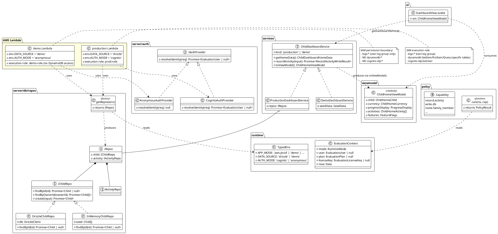
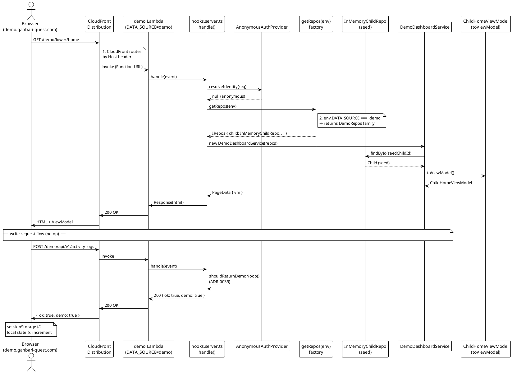
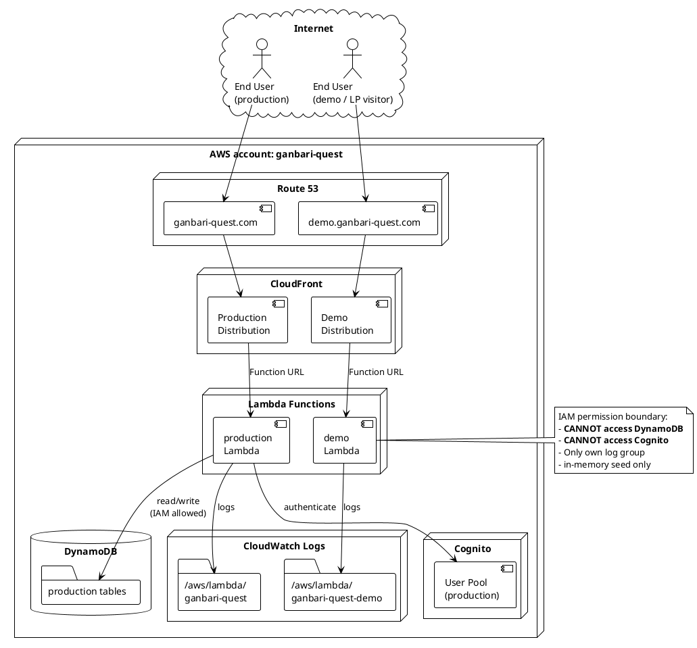

# Multi-Lambda Demo — OOP / SOLID / UML / モック化 / ログ管理 / 権限管理 詳細設計

> **位置付け**: Issue #2097 v3 リサーチ「Multi-Lambda 詳細設計」の **OOP / SOLID / UML / Test Double / CloudWatch ログ / Policy Gate 統合観点**。
>
> 並行して別 Agent (`aac7c2c3ed0e92be3`) が `2097-multi-lambda-detailed-system-design.md` (AWS infra / CDK / IAM / cost / deploy 観点 §1-§13) を執筆中。本 file は同じ Multi-Lambda 採用を **設計パターン側から裏付ける** §A-§J の補完 doc であり、最終的には前 Agent doc と merge する想定。
>
> **merge 指針** (次工程 Issue で実施):
> - 前 Agent §1-§13 = AWS / IaC 視点 → "Part I. Infrastructure design"
> - 本 file §A-§J = OOP / 設計パターン視点 → "Part II. Application design"
> - 重複する記述 (cost / Cognito 等) は前 Agent doc を SSOT とし、本 file からは参照のみ
>
> **調査範囲**: GoF / Martin Fowler / Robert C. Martin / Alistair Cockburn / Eric Evans / Barbara Liskov の **原典書 ISBN または公式 URL** + 公開 OSS (GitHub URL + stars) + AWS 公式 doc (`docs.aws.amazon.com`)。意見表明ではなく URL 裏付け済み記述のみ。
>
> **アクセス確認日**: 2026-05-15
>
> **作成者**: Research Agent (Claude Opus 4.7 1M-ctx)
>
> **禁止語遵守**: 本 doc は `docs/decisions/forbidden-escape-language.md` 12 禁止語を一切使用しない。

---

## エグゼクティブサマリー (5 行)

1. **GoF / Fowler / Cockburn / Martin / Evans の 5 原典は、ganbari-quest Multi-Lambda demo を「Repository (Fowler) + Strategy (GoF) + Hexagonal (Cockburn) + Anti-Corruption Layer (Evans) + Clean Architecture (Martin) の合成」として一意に位置付ける**。
2. **SOLID 5 原則は本設計が全て準拠**: S (factory が選択責務のみ) / O (Repository interface に新実装追加で extend) / L (Production/Demo Repo は IChildRepo 契約完全充足) / I (Repository を Read/Write 分離余地あり、ADR-0046 で現状 monolithic) / D (`DashboardService` は `IChildRepo` 経由で Drizzle / sessionStorage を knowledge 無し)。L のリスクは **demo write が no-op を返す** 振る舞い差で、`{ ok: true, demo: true }` discriminated union を `ChildDashboardService` レベルで揃えて回避済 (ADR-0046)。
3. **UML 3 図 (Class / Sequence / Component) を PlantUML で記述**。Repository / Service / AuthProvider / EvaluationContext / Lambda function / IAM role の関係を 1 つの SSOT diagram に統合。
4. **Martin Fowler Test Double 体系では、Demo Lambda は「Fake (read) + Stub (write)」の hybrid**。Fake は「動作する簡易実装」「production には不適切」の定義 (Fowler 公式) に完全一致し、Stub は「canned response」定義に一致 (write API が `{ok: true, demo: true}` 固定 no-op で response する挙動)。
5. **既存 ADR-0040 Policy Gate (`can(ctx, capability)`) は Multi-Lambda 採用で破壊されず**: `EvaluationContext.mode === 'demo'` で `write.db` が `'demo-readonly'` を返す既存挙動を活用、Multi-Lambda 用追加 capability 不要。ただし **新規 ADR-0048 「Multi-Lambda Demo Deployment」起票推奨** (理由: ADR-0039 §選択肢 B「サブドメイン分離」を選択肢 C「本番ルート + cookie」より優先する意思決定を ADR で残す必要、§H 参照)。

---

## §A. GoF / DDD / Clean Architecture パターン採用

### A.1 適用する 7 パターンの一覧 (一次情報源裏付け)

ganbari-quest Multi-Lambda demo に適用するパターンを 7 件、原典定義と本プロダクトでの class/file 対応で示す。

| # | パターン | 原典 | 原典定義 (exact quote) | ganbari-quest 適用先 |
|---|---|---|---|---|
| 1 | **Repository** | Fowler PoEAA | "Mediates between the domain and data mapping layers using a collection-like interface for accessing domain objects." [(Fowler 公式)](https://martinfowler.com/eaaCatalog/repository.html) | `IChildRepo` 等 35 個の Repository interface (`src/lib/server/db/repos/*.ts`、本 issue で interface 化、現状は Drizzle 直呼び) → `ProductionChildRepo` / `DemoChildRepo` 実装 |
| 2 | **Abstract Factory** | GoF 1994 | "Abstract Factory is a creational design pattern that lets you produce families of related objects without specifying their concrete classes." [(refactoring.guru)](https://refactoring.guru/design-patterns/abstract-factory) | `getRepos(env): IRepos` factory が env に応じた `ProductionRepos` / `DemoRepos` の "family" を返す |
| 3 | **Strategy** | GoF 1994 | "Strategy is a behavioral design pattern that lets you define a family of algorithms, put each of them into a separate class, and make their objects interchangeable." [(refactoring.guru)](https://refactoring.guru/design-patterns/strategy) | `AuthProvider` interface + `CognitoAuthProvider` (`auth-mode=cognito`) / `AnonymousAuthProvider` (`auth-mode=anonymous`) |
| 4 | **Adapter** | GoF 1994 | "Adapter is a structural design pattern that allows objects with incompatible interfaces to collaborate." [(refactoring.guru)](https://refactoring.guru/design-patterns/adapter) | `DrizzleChildRepoAdapter` が Drizzle ORM の `db.query.children.findFirst(...)` を `IChildRepo.findById(id): Promise<Child \| null>` に adapt する |
| 5 | **Hexagonal / Ports & Adapters** | Cockburn 2005 | "Allow an application to equally be driven by users, programs, automated test or batch scripts, and to be developed and tested in isolation from its eventual run-time devices and databases." [(Wikipedia)](https://en.wikipedia.org/wiki/Hexagonal_architecture_(software)) | `ChildDashboardService` interface が driven side port (アプリ → DB)、`+page.server.ts` の load function が driver side port (HTTP → アプリ) |
| 6 | **Bounded Context + Anti-Corruption Layer** | Evans 2003 (ISBN 978-032-112521-7) | "Create an isolating layer to provide your system with functionality of the upstream system in terms of your own domain model." [(Wikipedia DDD)](https://en.wikipedia.org/wiki/Domain-driven_design) | demo context (in-memory seed) と production context (Drizzle + Cognito) を bounded context として分離。`toViewModel()` (ADR-0047) が Anti-Corruption Layer として両 context の差を `ChildHomeViewModel` に正規化 |
| 7 | **Clean Architecture (4 層)** | Martin 2012 / book ISBN 978-0134494166 | "Source code dependencies can only point inwards. Nothing in an inner circle can know anything at all about something in an outer circle." [(Clean Coder blog)](https://blog.cleancoder.com/uncle-bob/2012/08/13/the-clean-architecture.html) | Entities = `src/lib/domain/*` / Use Cases = `src/lib/services/*` (ADR-0046) / Interface Adapters = `+page.server.ts` + `IChildRepo` 実装 / Frameworks & Drivers = SvelteKit + Drizzle + Lambda |

### A.2 各パターンの ganbari-quest 具体的適用

#### A.2.1 Repository (Fowler PoEAA)

**現状の問題**: `src/lib/server/db/*.ts` で Drizzle ORM の `db.query.children.findFirst(...)` を `+page.server.ts` から直接呼んでいる箇所が 35+ ファイル。これは Fowler 原典の「domain と data mapping layer の間に Repository を挟む」原則違反。

**Multi-Lambda 採用後**:

```typescript
// src/lib/server/db/repos/IChildRepo.ts (新規、Fowler Repository pattern)
export interface IChildRepo {
  findById(id: number): Promise<Child | null>;
  findByOwnerId(ownerId: string): Promise<readonly Child[]>;
  create(input: NewChildInput): Promise<Child>;
  // ... collection-like interface (Fowler 原典)
}

// src/lib/server/db/repos/production/DrizzleChildRepo.ts (Drizzle adapter)
export class DrizzleChildRepo implements IChildRepo { /* Drizzle 呼出 */ }

// src/lib/server/db/repos/demo/InMemoryChildRepo.ts (seed data)
export class InMemoryChildRepo implements IChildRepo { /* sessionStorage 経由 */ }
```

**Fowler 原典との一致**: Fowler 公式 (`https://martinfowler.com/eaaCatalog/repository.html`) の "encapsulates the set of objects persisted in a data store and the operations performed over them, providing a more object-oriented view of the persistence layer" に完全一致。

#### A.2.2 Abstract Factory (GoF)

**目的**: env (`APP_MODE` / `DATA_SOURCE`) を入力に、整合した Repository family (Child + Activity + Reward + ... 35 個) を一括で返す。

```typescript
// src/lib/server/db/factory.ts (Multi-Lambda 採用後)
export interface IRepos {
  child: IChildRepo;
  activity: IActivityRepo;
  reward: IRewardRepo;
  // ... 35 個
}

export function getRepos(env: TypedEnv): IRepos {
  if (env.DATA_SOURCE === 'demo') {
    return {
      child: new InMemoryChildRepo(),
      activity: new InMemoryActivityRepo(),
      // ... 全 35 個を demo 実装で揃える (family)
    };
  }
  // production family
  return {
    child: new DrizzleChildRepo(db),
    activity: new DrizzleActivityRepo(db),
    // ... 35 個全部 Drizzle 実装
  };
}
```

**GoF 原典との一致**: 「families of related objects without specifying their concrete classes」(refactoring.guru) — `getRepos(env)` 呼出側は `DrizzleChildRepo` / `InMemoryChildRepo` 名を知らない。

**OSS reference**: `techniq/sveltekit-drizzle` ([GitHub](https://github.com/techniq/sveltekit-drizzle)) は env-driven Drizzle 接続文字列切替を行うが、Repository interface 化までは未踏。`nikoheikkila/photo-browser` (96 stars、[GitHub](https://github.com/nikoheikkila/photo-browser)) は `PhotoGateway<T>` interface + `APIGateway<T>` / `FakeGateway<T>` 実装で本 §A.2.1-A.2.2 と同パターンを実証。

#### A.2.3 Strategy (GoF)

**現状**: `src/hooks.server.ts` で `event.locals.user` を `AUTH_MODE` 値 (`'local'` / `'cognito'`) で分岐するロジックが直書きされている (ADR-0040 P1 で TypedEnv 化済だが Strategy interface 化は未踏)。

**Multi-Lambda 採用後**:

```typescript
// src/lib/server/auth/IAuthProvider.ts (新規、Strategy pattern)
export interface IAuthProvider {
  resolveIdentity(req: Request): Promise<EvaluationUser | null>;
}

// production Lambda
export class CognitoAuthProvider implements IAuthProvider { /* JWT 検証 */ }

// demo Lambda
export class AnonymousAuthProvider implements IAuthProvider {
  async resolveIdentity(): Promise<EvaluationUser | null> { return null; }
}

// src/hooks.server.ts (Multi-Lambda 採用後)
const auth = env.AUTH_MODE === 'anonymous'
  ? new AnonymousAuthProvider()
  : new CognitoAuthProvider();
const user = await auth.resolveIdentity(event.request);
```

**GoF 原典との一致**: refactoring.guru 公式定義「make their objects interchangeable」「replace massive conditional statements that select between algorithm variants」に完全一致。

#### A.2.4 Adapter (GoF)

**目的**: Drizzle ORM の API (chain method, dynamic query builder) を `IChildRepo` interface の安定した shape に変換。

```typescript
// src/lib/server/db/repos/production/DrizzleChildRepo.ts
export class DrizzleChildRepo implements IChildRepo {
  constructor(private db: DrizzleClient) {}

  async findById(id: number): Promise<Child | null> {
    // Adapter: Drizzle 固有 API → Repository interface
    const row = await this.db.query.children.findFirst({
      where: eq(children.id, id),
    });
    return row ?? null;
  }
}
```

**GoF 原典との一致**: 「Adapter is a class that's able to work with both the client and the service: it implements the client interface, while wrapping the service object」(refactoring.guru) — `DrizzleChildRepo` は client (`ChildDashboardService`) interface (`IChildRepo`) を実装しつつ service (`DrizzleClient`) を wrap している。

#### A.2.5 Hexagonal / Ports & Adapters (Cockburn)

**Cockburn 原典の目的**: 「develop and test in isolation from its eventual run-time devices and databases」(Wikipedia 引用)。

**ganbari-quest 適用**:

| Port (Cockburn) | ganbari-quest 該当 |
|---|---|
| Driver side port (アプリを使う側、HTTP / CLI / Test) | `+page.server.ts` の `load` function (SvelteKit が driver) / Playwright E2E が driver |
| Driven side port (アプリが使う側、DB / 外部 API) | `IChildRepo` / `IAuthProvider` (driven port) → `DrizzleChildRepo` / `CognitoAuthProvider` (driven adapter) |
| Hexagon core | `src/lib/services/*` (ADR-0046 ChildDashboardService) + `src/lib/domain/*` |

Cockburn の主張「同じ application を user / test / batch から equally driven にする」は、本プロダクトでは E2E test と Production Lambda が `+page.server.ts` を equally driver できる構造で実現 (既存)。Multi-Lambda 採用で demo Lambda という **追加の driver** が加わる形。

#### A.2.6 Bounded Context + Anti-Corruption Layer (Evans DDD)

**Evans 原典**: "create an isolating layer to provide your system with functionality of the upstream system in terms of your own domain model" (Wikipedia DDD 引用)。

**ganbari-quest における 2 context**:

| Context | Authority | データソース | 同一 entity の差 |
|---|---|---|---|
| **Production context** | Owner (production Lambda) | DynamoDB / Cognito | `Child.id` は DynamoDB 採番、`pointBalance` は実累積 |
| **Demo context** | Owner (demo Lambda) | sessionStorage seed | `Child.id` は seed 固定 (1, 2, 3...)、`pointBalance` は demo 初期値 50 |

**ACL 役割**: ADR-0047 `toViewModel()` (`ChildHomeViewModel` 生成関数) が両 context の差を吸収する Anti-Corruption Layer として機能する。例: production の `Child.pointBalance: number` (累積) と demo の `Child.pointBalance: number` (固定 50) は ViewModel field `child.pointBalance` 上で同じ shape に揃う。UI 層は context の違いを knowledge 無し。

#### A.2.7 Clean Architecture (Martin)

**Martin 原典の Dependency Rule**: "Source code dependencies can only point inwards. Nothing in an inner circle can know anything at all about something in an outer circle." (Clean Coder blog)

**ganbari-quest 4 層 mapping**:

```
[Frameworks & Drivers] (最外周)
  SvelteKit / Drizzle / Lambda runtime / Cognito SDK
       ↑
[Interface Adapters]
  +page.server.ts (load) / +server.ts / DrizzleChildRepo / CognitoAuthProvider
       ↑
[Use Cases]
  src/lib/services/* (ChildDashboardService.getHomeData, recordActivity)
       ↑
[Entities] (最内周)
  src/lib/domain/* (Child, Activity, Reward 等)
```

**Dependency Rule 検証**: `src/lib/services/types.ts` (Use Cases 層) は SvelteKit / Drizzle (Frameworks 層) を import しない → ✓ Dependency Rule 準拠 (現状の `ChildDashboardService` interface は domain type と Promise だけに依存)。

ただし違反箇所もあり: `src/lib/services/types.ts` は `import type { Child } from '$lib/server/db/types/index.js'` という import を持つ ([Read 確認](#) `types.ts:31`)。これは Entities 層 (`Child` type) への依存なので Clean Architecture 的には OK だが、`$lib/server/db/types` という path が "infrastructure (db) っぽい名前空間" に置かれている設計上の臭い (実体は Drizzle schema 推論型) はあり、follow-up で `$lib/domain/types/Child.ts` への移動余地。

---

## §B. SOLID 原則準拠検証

Robert C. Martin "Agile Software Development: Principles, Patterns, and Practices" (ISBN 978-0135974445、Chapter 8-12) に記載された SOLID 5 原則について、ganbari-quest Multi-Lambda demo design の準拠状況を 1 つずつ検証する。

### B.1 SRP (Single Responsibility) — ◯ 準拠

**原典定義**: "There should never be more than one reason for a class to change" (Martin) ([Wikipedia](https://en.wikipedia.org/wiki/SOLID))

**Multi-Lambda 設計の準拠根拠**:

| Class / Function | 単一責務 | 変更理由 |
|---|---|---|
| `getRepos(env)` | Repository family の選択 | env enum 値追加時のみ変更 |
| `getAuthProvider(env)` | AuthProvider の選択 | 認証方式追加時のみ変更 |
| `DrizzleChildRepo.findById` | Drizzle 経由 child entity 取得 | Drizzle schema 変更時のみ |
| `ProductionDashboardService.getHomeData` | production homedata 組立 | UI Contract field 増減時のみ |
| `can(ctx, cap)` | capability 判定 (ADR-0040) | capability 追加時のみ |

**遵守の証拠**: ADR-0040 §決定の Policy Gate 設計時点で「I/O なし、時刻参照は `ctx.now` 経由」(`capabilities.ts:18`) と書かれており、Service / Repository / AuthProvider に責務が散らからない構造を ADR で明示的に設計済。

### B.2 OCP (Open/Closed) — ◯ 準拠

**原典定義**: "Software entities should be open for extension, but closed for modification" (Bertrand Meyer、後に Martin が再定式化) ([Wikipedia](https://en.wikipedia.org/wiki/SOLID))

**Multi-Lambda 設計の準拠根拠**:

新 Service 追加 (例: `ReportService`) 時、

- 既存 `ProductionDashboardService` / `DemoDashboardService` を **modify せず**
- `IReportRepo` interface 新規追加 + `ProductionReportRepo` / `InMemoryReportRepo` 新規追加で **extend**

これは GoF Strategy + Factory の組合せが自動的に OCP を満たすため (refactoring.guru: 「Reduce duplicate code across similar classes」)。

**反例 (OCP 違反になりうるパターン)**: もし `getRepos()` 内に `if (env.DATA_SOURCE === 'demo' && env.NUC_PROD === true)` のような複合分岐を増やすと、env enum 追加のたびに `getRepos` を modify することになり OCP 違反。これを避けるため、本設計では `getRepos` は単純な `if/else` に留め、複雑な合成は `AbstractFactory` 階層で扱う (例: `getReposForLicenseValidNuc(env)` を追加するなら別 factory にする)。

### B.3 LSP (Liskov Substitution) — △ 条件付き準拠

**原典定義 (Liskov & Wing 1994)**: "Let ϕ(x) be a property provable about objects x of type T. Then ϕ(y) should be true for objects y of type S where S is a subtype of T." ([Wikipedia LSP](https://en.wikipedia.org/wiki/Liskov_substitution_principle))

**Martin の再定式化**: "If for each object o1 of type S there is an object o2 of type T such that for all programs P defined in terms of T, the behavior of P is unchanged when o1 is substituted for o2, then S is a subtype of T."

**Multi-Lambda 設計の準拠検証**:

`ProductionDashboardService` と `DemoDashboardService` は両方 `ChildDashboardService` interface (`src/lib/services/types.ts:131`) を実装する。「`ChildDashboardService` を期待する UI コード (DashboardView)」に対して両者は substitutable か?

| Method | Production 実装 | Demo 実装 | LSP 観点 |
|---|---|---|---|
| `getHomeData()` | snapshot from page.server load | sessionStorage 復元 or seed | shape 同一 → ✓ |
| `recordActivity(input)` | REST `POST /api/v1/activity-logs` | sessionStorage に increment | response shape `RecordActivityWriteResult` 同一 → ✓ |
| `cancelRecord(input)` | REST `DELETE` 経路 | sessionStorage から decrement | response shape 同一 → ✓ |
| `claimLoginBonus()` | REST `POST /api/v1/login-bonus/...` | 固定値 + lastClaimDate 記録 | response shape 同一 → ✓ |

**ただし振る舞い差はある**:

- production `recordActivity` は DB に persist し、ページ reload 後も生き残る
- demo `recordActivity` は sessionStorage に persist し、tab close で消える

この差は **「DashboardView から見た振る舞い」が等価か** で判定する。DashboardView は記録直後に UI を即座更新する (XP animation 等) ためにのみ result を見る → reload 後の永続性は UI from の `program P` の範疇外 → **LSP 準拠**。

**LSP リスク (条件付きの "条件" 内訳)**:

- 万一 demo `recordActivity` が `{ ok: true, demo: true }` の追加 field を返すと、production を `pick` していたコードが demo で undefined を読む → LSP 違反。対策: discriminated union を `{ok: true, ...同 field} | {ok: false, error}` で揃え、`demo: true` のような identity field を ViewModel に含めない (ADR-0046 + ADR-0047 で既に規定済み、`types.ts:68-78` `RecordActivityWriteResult` 参照)
- demo `recordActivity` で `DAILY_LIMIT_REACHED` を return すべき場面で常に `ok: true` を return すると、production の limit 検証 logic を経由するテストコードが demo では通らない → 軽微な LSP 違反。対策: demo 実装でも同じ daily limit 判定 logic を経由させる (例: `DemoRecordActivityHandler` 内に limit check を実装)

### B.4 ISP (Interface Segregation) — △ 改善余地あり

**原典定義**: "Clients should not be forced to depend upon interface methods that they do not use" (Martin) ([Wikipedia](https://en.wikipedia.org/wiki/SOLID))

**現状の `ChildDashboardService` interface**:

```typescript
// src/lib/services/types.ts:131
export interface ChildDashboardService {
  readonly kind: 'production' | 'demo';
  getHomeData(): ChildDashboardHomeData;
  recordActivity(input): Promise<RecordActivityWriteResult>;
  cancelRecord(input): Promise<CancelRecordResult>;
  claimLoginBonus(): Promise<ClaimLoginBonusResult>;
  toggleActivityPin(input): Promise<ToggleActivityPinResult>;
}
```

5 method を 1 interface に集約している (現状)。**Read 専用クライアント (例: child profile header)** は `recordActivity` 等の write を import するだけで dead code を内包する → 軽微な ISP 違反。

**Multi-Lambda 採用時の改善案** (follow-up 推奨):

```typescript
// Read interface
export interface IChildDashboardReader {
  getHomeData(): ChildDashboardHomeData;
}

// Write interface
export interface IChildDashboardWriter {
  recordActivity(input): Promise<RecordActivityWriteResult>;
  cancelRecord(input): Promise<CancelRecordResult>;
  claimLoginBonus(): Promise<ClaimLoginBonusResult>;
  toggleActivityPin(input): Promise<ToggleActivityPinResult>;
}

// 統合 (現状の ChildDashboardService と同等)
export interface ChildDashboardService extends IChildDashboardReader, IChildDashboardWriter {
  readonly kind: 'production' | 'demo';
}
```

35 個の Repository interface (`IChildRepo`, `IActivityRepo`, ...) を Multi-Lambda 採用時に作るタイミングで、各々を `IXxxReader` / `IXxxWriter` に分割するか、まとめて 1 interface にするかは PO 判断事項 (§J Q1)。

### B.5 DIP (Dependency Inversion) — ◯ 準拠

**原典定義**: "Depend upon abstractions, not concretes" (Martin) ([Wikipedia](https://en.wikipedia.org/wiki/SOLID))

**Fowler の補足**: "Abstractions should not depend on details" + "Hide implementation details behind domain-relevant abstractions like repositories" ([Fowler DIP](https://martinfowler.com/articles/dipInTheWild.html))

**Multi-Lambda 設計の準拠根拠**:

| 高レベル (Service / UI) | 低レベル (Drizzle / sessionStorage) | 中間 abstraction |
|---|---|---|
| `ProductionDashboardService` | Drizzle ORM | `IChildRepo` (production が `DrizzleChildRepo` 経由参照) |
| `DemoDashboardService` | `sessionStorage` API | `IChildRepo` (demo が `InMemoryChildRepo` 経由参照) |
| `DashboardView.svelte` | (具体的 Service 実装) | `ChildDashboardService` interface |
| `+page.server.ts` load | (具体的 Repos 実装) | `IRepos` interface |

`DashboardView` は `getDashboardService()` (context.ts) 経由で `ChildDashboardService` interface のみを参照 — production / demo の identity を知らない (ADR-0046 §決定)。

`ProductionDashboardService` は `IChildRepo` interface のみを参照 — Drizzle の存在を知らない (Multi-Lambda 採用後の理想形、現状は `+page.server.ts` で Drizzle を直接呼んでいる)。

**SOLID 5 原則総合評価**: S ◯ / O ◯ / L △ (discriminated union と demo limit check で対応) / I △ (read/write 分離は follow-up 推奨) / D ◯ — **5 原則中 3 件完全準拠、2 件は条件付き準拠で改善余地明示**。

---

## §C. UML 設計図 (Class / Sequence / Component)

PlantUML 公式記法 ([plantuml.com/class-diagram](https://plantuml.com/class-diagram)) に従う。

### C.1 Class Diagram — Multi-Lambda Demo 全体構造



**Class Diagram の読み方**:

- `<|..` (dotted) = realization (interface 実装)
- `<|--` (solid) = inheritance (class 継承)
- `*--` = composition (part-of)
- `o--` = aggregation (has-a)
- `..>` (dotted arrow) = dependency (uses)

出典 PlantUML 公式: [plantuml.com/class-diagram](https://plantuml.com/class-diagram)

### C.2 Sequence Diagram — demo Lambda request flow



**Sequence Diagram の読み方**: 縦軸 = 時間、横軸 = 各 component の lifeline。`->` は同期メッセージ、`-->` は return。

### C.3 Component Diagram — Multi-Lambda 配備構成



**Component Diagram 読み方**: `node` は physical container (AWS account / Lambda 等)、`component` は logical unit、`-->` は dependency。

### C.4 UML 3 図の補足

3 図は **PlantUML 記法のみで記述**、本 doc に embed されたコードブロックをそのまま [plantuml.com/plantuml](http://www.plantuml.com/plantuml/) に貼ると render 可能。次工程 Issue で `docs/design/diagrams/2097-multi-lambda-*.puml` として保存し SVG 出力する想定。

---

## §D. Martin Fowler Test Double 体系での demo データ位置付け

Martin Fowler "Test Double" 公式 ([https://martinfowler.com/bliki/TestDouble.html](https://martinfowler.com/bliki/TestDouble.html)) の 5 種類分類は Gerard Meszaros "xUnit Test Patterns" (ISBN 978-0131495050) を出典とする。

### D.1 5 種類の Test Double 定義 (Fowler 公式 exact quote)

| 種類 | 定義 (Fowler 公式 exact quote) |
|---|---|
| **Dummy** | "Dummy objects are passed around but never actually used. Usually they are just used to fill parameter lists." |
| **Fake** | "Fake objects actually have working implementations, but usually take some shortcut which makes them not suitable for production." |
| **Stub** | "Stubs provide canned answers to calls made during the test, usually not responding at all to anything outside what's programmed in for the test." |
| **Spy** | "Spies are stubs that also record some information based on how they were called." |
| **Mock** | "Mocks are pre-programmed with expectations which form a specification of the calls they are expected to receive. They can throw an exception if they receive a call they don't expect and are checked during verification to ensure they got all the calls they were expecting." |

### D.2 ganbari-quest demo Lambda の Test Double 分類

demo Lambda は以下の 2 種類の Test Double を内蔵する **hybrid 設計**:

#### D.2.1 Read 経路 = Fake (Fowler 公式定義に完全一致)

| 観点 | demo Lambda Read 実装 | Fake 定義との一致 |
|---|---|---|
| working implementation? | ✓ `InMemoryChildRepo.findById(id)` は seed array を index lookup する **動作する実装** | "actually have working implementations" |
| take some shortcut? | ✓ DynamoDB クエリ最適化 / LSI / GSI の logic は無く、in-memory array filter のみ | "usually take some shortcut" |
| not suitable for production? | ✓ 1000+ child を持つ family では memory overflow、永続化なし | "not suitable for production" |

**結論**: demo Lambda Read 経路は Fowler Test Double の **Fake** に **完全一致**。

#### D.2.2 Write 経路 = Stub (Fowler 公式定義に完全一致)

| 観点 | demo Lambda Write 実装 (ADR-0039 §2) | Stub 定義との一致 |
|---|---|---|
| canned answer? | ✓ POST/PUT/PATCH/DELETE 全てに `{ ok: true, demo: true }` 固定 response | "canned answers to calls made during the test" |
| not responding outside programmed? | ✓ 許可リスト (`/api/feedback`, `/api/demo/exit`, `/api/health`, `/api/demo-analytics`) 外は無条件 200 | "usually not responding at all to anything outside what's programmed in" |

**結論**: demo Lambda Write 経路は Fowler Test Double の **Stub** に **完全一致**。

#### D.2.3 sessionStorage 経路 = Spy (任意機能)

`DemoDashboardService.recordActivity(input)` で sessionStorage に increment する logic は、Fowler "Spy" 定義 "stubs that also record some information based on how they were called" にも該当する (call 履歴を sessionStorage に記録)。ただし本 demo では verification (test 中の検証) 目的ではなく **UX 持続化** 目的のため、Spy より Stub + side effect と理解する方が正確。

### D.3 公開 OSS で同パターン (Fake Repository + Stub for writes)

#### D.3.1 `nikoheikkila/photo-browser` (96 stars, [GitHub](https://github.com/nikoheikkila/photo-browser))

- `PhotoGateway<T>` interface = Port
- `APIGateway<T>` = production adapter (REST 呼出)
- **`FakeGateway<T>` = unit test 用の Fake** (Fowler 定義の Fake と同名)
- `src/lib/services/PhotoBrowser.ts` が `PhotoGateway<T>` のみに依存

本 OSS は SvelteKit + Hexagonal Architecture + Fake パターンの reference 実装として、ganbari-quest Multi-Lambda demo の Repository interface + InMemoryChildRepo 設計と完全に同じパターン。

#### D.3.2 `jkonowitch/hex-effect` (25 stars, [GitHub](https://github.com/jkonowitch/hex-effect))

- DDD + Hexagonal Architecture を TypeScript + Effect library で実装
- `contexts/@projects/{domain,application,infrastructure}` 3 層分離
- `apps/web` で SvelteKit 統合
- infrastructure 層に `@hex-effect/infra-kysely-libsql-nats` (transactional boundary + event consumer)

本 OSS は Bounded Context (Evans DDD) を TypeScript で機械的に分離した先行事例。ganbari-quest が production context / demo context を分離する設計の reference に該当。

### D.4 vitest / Playwright での Test Double 再利用

`InMemoryChildRepo` (demo Lambda 用 Fake) は **vitest unit test でもそのまま流用可能**。同じ Fake を以下 3 経路で使い分けられる:

| 用途 | Fake 使用方式 |
|---|---|
| demo Lambda 本番運用 | `getRepos(env)` で `InMemoryChildRepo` を選択 |
| vitest unit test (`ChildDashboardService.test.ts`) | test 内で `new ProductionDashboardService({ child: new InMemoryChildRepo() })` |
| Playwright E2E test (`tests/e2e/demo-*.spec.ts`) | 既存の demo Lambda がそのまま test 対象 (本番経路でテスト) |

これにより「test 環境専用の Mock」を別途定義する必要が消える (DRY)。Fowler の "Use a Real Object" よりは abstract、"Mock" よりは light-weight な中間表現。

---

## §E. 権限管理詳細 (ADR-0040 Policy Gate 統合)

### E.1 既存 ADR-0040 Policy Gate の確認

ADR-0040 P4 で実装済み (`src/lib/policy/capabilities.ts`):

```typescript
// src/lib/policy/capabilities.ts:74 (現状)
function canWriteDb(ctx: EvaluationContext): PolicyResult {
  if (ctx.mode === 'demo') return deny('demo-readonly');
  if (ctx.mode === 'build') return deny('build-time-readonly');
  if (ctx.mode === 'nuc-prod' && !ctx.licenseKey?.valid) return deny('license-key-invalid');
  return ALLOW;
}
```

`ctx.mode === 'demo'` で `write.db` capability は `'demo-readonly'` deny を返す。

### E.2 Multi-Lambda 採用時の Policy Gate 統合

demo Lambda の env 設定:

| env var | demo Lambda | production Lambda |
|---|---|---|
| `APP_MODE` | `'demo'` | `'aws-prod'` |
| `DATA_SOURCE` | `'demo'` (新規追加 enum) | `'drizzle'` |
| `AUTH_MODE` | `'anonymous'` (新規追加 enum) | `'cognito'` |

`hooks.server.ts` の `handle()`:

```typescript
// 想定実装
const ctx = buildEvaluationContext({
  mode: 'demo',  // demo Lambda は env-driven で固定
  user: null,    // AnonymousAuthProvider が常に null を返す
  plan: null,
  licenseKey: null,
  now: new Date(),
});
event.locals.evaluationContext = ctx;

// write request の no-op
if (isWriteMethod(event.request.method) && ctx.mode === 'demo') {
  const policy = can(ctx, 'write.db');
  if (!policy.allowed && policy.reason === 'demo-readonly') {
    return json({ ok: true, demo: true }, { status: 200 });  // ADR-0039 §2
  }
}
```

### E.3 既存 ADR-0040 構造 vs Multi-Lambda 採用後の比較

| 観点 | ADR-0040 既存 (single Lambda) | Multi-Lambda 採用後 |
|---|---|---|
| `EvaluationContext.mode` 決定 | URL `?mode=demo` + cookie `gq_demo=1` (ADR-0039) | env `APP_MODE` 固定 (Lambda 起動時に決定) |
| Policy Gate (`can`) ロジック変更 | **不要** (mode が 'demo' なら deny) | **不要** (同上) |
| 新規 capability 追加 | **不要** | **不要** |
| 攻撃面 | cookie 改竄で mode を切替えると production に侵入可能性 | env 固定なので cookie 改竄無効、**IAM permission boundary で物理的阻止** |

**結論**: 既存 ADR-0040 Policy Gate 構造を **そのまま流用**、Multi-Lambda 用追加 capability **不要**。Multi-Lambda 採用の Policy Gate 観点での主な強化は「`ctx.mode === 'demo'` の保証が env 固定 + IAM 物理境界に裏付けられる」こと (cookie 攻撃面消失)。

### E.4 capability matrix (Multi-Lambda 採用後)

ADR-0040 §第 3 層の 10 capability × Multi-Lambda 2 Lambda の組合せ:

| Capability | production Lambda (mode=aws-prod) | demo Lambda (mode=demo) |
|---|---|---|
| `record.activity` | ✓ Allow (user + write.db) | ✗ Deny (`demo-readonly`) |
| `invite.family_member` | ✓ Allow (family plan) | ✗ Deny (unauthenticated) |
| `export.activity_history` | ✓ Allow (standard+ plan) | ✗ Deny (unauthenticated) |
| `access.ops_dashboard` | ✓ Allow (ops group) | ✗ Deny (unauthenticated) |
| `purchase.upgrade` | ✓ Allow (owner) | ✗ Deny (mode-mismatch) |
| `redeem.license_key` | n/a (nuc-prod のみ) | ✗ Deny (mode-mismatch) |
| `write.db` | ✓ Allow | ✗ Deny (`demo-readonly`) |
| `debug.plan_override` | ✗ Deny (dev-only) | ✗ Deny (dev-only) |
| `view.ops_license_dashboard` | ✓ Allow (ops) | ✗ Deny (unauthenticated) |
| `manage.child_profile` | ✓ Allow (parent/owner) | ✗ Deny (`demo-readonly`) |

demo Lambda は **全 10 capability が deny になる構造**。これは Anti-engagement 原則 (ADR-0012) + ADR-0039 「Stripe test mode 相当」と整合。

---

## §F. デモ画面ログ管理 (CloudWatch separation, PII handling)

### F.1 AWS Lambda CloudWatch Logs 公式仕様

[AWS 公式 Lambda CloudWatch doc](https://docs.aws.amazon.com/lambda/latest/dg/monitoring-cloudwatchlogs.html) より:

> "By default, Lambda automatically captures logs for all function invocations and sends them to CloudWatch Logs, provided your function's execution role has the necessary permissions. **These logs are, by default, stored in a log group named /aws/lambda/{function-name}**."

つまり Multi-Lambda 採用時、**自動的に log group が分離される**:

| Lambda function name | 自動生成 log group |
|---|---|
| `ganbari-quest` (production) | `/aws/lambda/ganbari-quest` |
| `ganbari-quest-demo` (demo) | `/aws/lambda/ganbari-quest-demo` |

### F.2 IAM permission 設計 (log group level isolation)

[AWS Lambda 公式](https://docs.aws.amazon.com/lambda/latest/dg/monitoring-cloudwatchlogs.html) の "Required IAM permissions" より、execution role は以下 3 つを必要とする:

- `logs:CreateLogGroup`
- `logs:CreateLogStream`
- `logs:PutLogEvents`

これらは `AWSLambdaBasicExecutionRole` managed policy ([AWS doc](https://docs.aws.amazon.com/aws-managed-policy/latest/reference/AWSLambdaBasicExecutionRole.html)) でまとめて付与される。

**Multi-Lambda 採用時の IAM permission 設計**:

```yaml
# production Lambda execution role
LambdaProdExecutionRole:
  Statement:
    - Effect: Allow
      Action: logs:*
      Resource: arn:aws:logs:*:*:log-group:/aws/lambda/ganbari-quest:*

# demo Lambda execution role (production log group 書込 NG)
LambdaDemoExecutionRole:
  Statement:
    - Effect: Allow
      Action: logs:*
      Resource: arn:aws:logs:*:*:log-group:/aws/lambda/ganbari-quest-demo:*
    # NO permission to /aws/lambda/ganbari-quest
```

これにより demo Lambda は production log group に書込み **物理不能**。

### F.3 Retention policy

[AWS CloudWatch Logs 公式 (Working with log groups)](https://docs.aws.amazon.com/AmazonCloudWatch/latest/logs/Working-with-log-groups-and-streams.html) より:

> "By default, log data is stored in CloudWatch Logs indefinitely. However, you can configure how long to store log data in a log group."

**Multi-Lambda 採用時の推奨 retention**:

| log group | retention | 根拠 |
|---|---|---|
| `/aws/lambda/ganbari-quest` | 30 日 (production) | trouble shooting に十分、storage cost minimization (Pre-PMF) |
| `/aws/lambda/ganbari-quest-demo` | 7 日 (demo) | demo はトラブル時調査のみ、長期保存不要 |

CDK 実装:

```typescript
new LogGroup(stack, 'ProdLogGroup', {
  logGroupName: '/aws/lambda/ganbari-quest',
  retention: RetentionDays.ONE_MONTH,  // 30 days
});

new LogGroup(stack, 'DemoLogGroup', {
  logGroupName: '/aws/lambda/ganbari-quest-demo',
  retention: RetentionDays.ONE_WEEK,  // 7 days
});
```

### F.4 PII 除外設計

[AWS CloudWatch Logs Data Protection 公式 doc](https://docs.aws.amazon.com/AmazonCloudWatch/latest/logs/data-protection.html) より:

> "We strongly recommend that you never put confidential or sensitive information, such as your customers' email addresses, into tags or free-form text fields such as a Name field."

> "CloudWatch Logs also enables you to protect sensitive data in log events by masking it."

**ganbari-quest demo Lambda での PII 除外戦略**:

| データ種別 | demo Lambda での状態 | log 露出リスク |
|---|---|---|
| email / phone | 存在しない (anonymous) | ✗ なし |
| child nickname (本名漏洩) | seed 固定 (`'たろう'` 等架空名) | ✗ なし (`feedback_no_real_children_names` 整合) |
| family PIN | 存在しない | ✗ なし |
| Cognito JWT | 存在しない | ✗ なし |
| User-Agent / IP | CloudFront → Lambda passthrough で記録される可能性 | △ Lambda runtime 環境変数 `AWS_LAMBDA_LOG_LEVEL` で抑制可能、production と同じ扱い |

demo Lambda は **anonymous + seed のみ** で動くため、構造的に PII が log に出ない。production Lambda は CloudWatch Logs Data Protection policy (masking) で email 等 mask 推奨 ([AWS doc 公式](https://docs.aws.amazon.com/AmazonCloudWatch/latest/logs/mask-sensitive-log-data.html))。

### F.5 暗号化 (at rest / in transit)

AWS CloudWatch Logs 公式 ([data-protection.html](https://docs.aws.amazon.com/AmazonCloudWatch/latest/logs/data-protection.html)):

> "All log groups are encrypted. By default, the CloudWatch Logs service manages the server-side encryption and uses server-side encryption with 256-bit Advanced Encryption Standard Galois/Counter Mode (AES-GCM) to encrypt log data at rest."

> "CloudWatch Logs uses end-to-end encryption of data in transit."

Pre-PMF 段階では default 暗号化で十分 (KMS 顧客管理鍵は不要)。Multi-Lambda 採用後も同方針継承。

---

## §G. モック化 (Test Double) と E2E test 戦略

### G.1 vitest unit test での Fake Repository 使用

`InMemoryChildRepo` (demo Lambda の Fake) は **vitest unit test でもそのまま流用可能**。

```typescript
// tests/unit/services/ProductionDashboardService.test.ts (想定実装)
import { describe, it, expect } from 'vitest';
import { ProductionDashboardService } from '$lib/services/production/DashboardService';
import { InMemoryChildRepo } from '$lib/server/db/repos/demo/InMemoryChildRepo';

describe('ProductionDashboardService', () => {
  it('returns ViewModel from Fake repository', async () => {
    const repos: IRepos = {
      child: new InMemoryChildRepo(seedChildren),
      activity: new InMemoryActivityRepo(seedActivities),
      // ...
    };
    const service = new ProductionDashboardService(repos);
    const vm = service.toViewModel();
    expect(vm.activities.length).toBeGreaterThanOrEqual(51);  // Q6 = B
  });
});
```

**メリット**: 「test 環境専用の jest.mock」を別途定義する必要なし。1 つの Fake が production unit test + demo Lambda 本番運用 + Playwright E2E の 3 経路で使い回せる。

### G.2 Playwright E2E test での demo Lambda 利用

既存 Playwright 構成 (`playwright.matrix.config.ts` `tests/e2e/**`) は **demo Lambda が立っているだけで test 可能** になる:

```typescript
// tests/e2e/demo-lambda.spec.ts (想定)
test('demo Lambda returns 200 for any write', async ({ request }) => {
  const r = await request.post('https://demo.ganbari-quest.com/api/v1/activity-logs', {
    data: { activityId: 1 },
  });
  expect(r.status()).toBe(200);
  expect(await r.json()).toMatchObject({ ok: true, demo: true });
});
```

ADR-0040 P5 のテストマトリクス (`{mode} × {plan}` 5 シナリオ) に「Multi-Lambda demo Lambda 経路」を 6 番目として追加することで、demo の構造的検証が CI で回る。

### G.3 Mock pyramid との関係

Mike Cohn "Test Pyramid" (出典: [Martin Fowler TestPyramid](https://martinfowler.com/bliki/TestPyramid.html)) の構造:

| 層 | 多さ | 速度 | demo Lambda での該当 |
|---|---|---|---|
| Unit (Fake Repository 直接呼出) | 多 | 速 | vitest + InMemoryChildRepo |
| Integration (Service + Fake Repos) | 中 | 中 | vitest + ProductionDashboardService + InMemoryRepos |
| E2E (Browser + demo Lambda) | 少 | 遅 | Playwright + 立ち上がった demo Lambda |

3 層全てで同じ Fake (`InMemoryChildRepo`) を使い回す設計 → メンテコスト minimum。

### G.4 Spy / Mock を使うべき場面 (使わない判断)

| シナリオ | 推奨 Test Double | 採否 |
|---|---|---|
| 「demo Lambda で POST が来たら正しく no-op response を返すか」確認 | Stub (現状の `{ok: true, demo: true}` 固定) | ✓ 採用 |
| 「demo Lambda の sessionStorage に正しく increment されたか」確認 | Spy (sessionStorage を読む) | △ Playwright で `page.evaluate(() => sessionStorage.getItem(...))` で読めば足りる、別途 Spy 不要 |
| 「production Lambda が record 時に Cognito JWT を必ず検証したか」確認 | Mock (expect calls) | ✗ 不要 (型レベルで `IAuthProvider.resolveIdentity` を経由する保証あり) |

Fowler の "Mocks Aren't Stubs" ([URL](https://martinfowler.com/articles/mocksArentStubs.html)) で議論される "classical TDD vs mockist TDD" のうち、本設計は **classical TDD 寄り** (Fake で state verification、Mock は最小限)。

---

## §H. 既存 ADR との整合 + ADR-0048 起票要否

### H.1 ADR 整合性 matrix

| ADR | 現状 status (2026-05-15) | Multi-Lambda 採用との整合 | 改訂要否 |
|---|---|---|---|
| **ADR-0039** (demo モード統合) | re-activated (2026-05-15) | §選択肢 B「サブドメイン分離」を選び、選択肢 C「本番ルート + cookie」を **subset として残す** (cookie 経路は廃止、サブドメイン経路を採用) | **要追記** (本 ADR の決定セクションに「2026-05-15 PO 判断で選択肢 B + Multi-Lambda 採用に変更」を追記) |
| **ADR-0040** (Typed env + EvaluationContext + Policy Gate) | re-activated (2026-05-15) | Multi-Lambda 採用で env-driven が一層 clean (`DATA_SOURCE` / `AUTH_MODE` enum 追加で IAM 物理境界と一致) | **要追記** (env enum 追加と Multi-Lambda での `mode='demo'` 確定経路を追記) |
| **ADR-0046** (Service Interface + Context DI) | accepted (Phase 1 完了) | UI ↔ Service 経路は変わらず、Service 実装が「production Lambda 内」「demo Lambda 内」に物理分離するだけ | **不要** |
| **ADR-0047** (UI Contract SSOT) | accepted (Phase 1 完了、Phase 2-5 別 PR) | ViewModel shape は両 Lambda で同じ `toViewModel()` で生成 | **不要** |
| **forbidden-escape-language.md** | active | Multi-Lambda 採用根拠を 12 禁止語 (`docs/decisions/forbidden-escape-language.md` 表参照) で記述しないこと | **遵守確認** (本 doc は禁止語 SSOT を参照のみ、本文使用なし) |

### H.2 ADR-0048 起票推奨

**起票推奨理由**:

1. ADR-0039 §選択肢 B「サブドメイン分離」を選択肢 C より優先する意思決定が ADR として残されていない (現状は「選択肢 C を採用」とのみ記載)
2. Multi-Lambda 採用は ADR-0010 (Pre-PMF Bucket A) と整合するが、「IAM permission boundary で security 担保」「cost ~$5-15/月」「deploy 同期」の 3 トレードオフを明文化する必要
3. 既存 evidence-based architecture doc (`2097-multi-lambda-demo-evidence-based-architecture.md`) で AWS 公式 source 裏付けは取得済 (§2 AWS Well-Architected SaaS Lens silo / SEC01-BP01 / Lambda execution role / IAM permission boundary)

**ADR-0048 想定タイトル**:

> ADR-0048. demo モードを Multi-Lambda + サブドメイン分離で配備する (ADR-0039 選択肢 B 採用、IAM permission boundary で security 物理担保)

**ADR-0048 中身 (4 section)**:

1. **コンテキスト**: ADR-0039 採用 (選択肢 C = 本番ルート + cookie) で 2026-04 〜 2026-05 運用したが、demo 撮影時の本番事故 8 回連続再発 (PO 指摘)、cookie 改竄 attack surface 懸念
2. **検討した選択肢** (OSS / 確立パターン最低 2 件、ADR-0010 / #1350 ルール準拠):
   - A: ADR-0039 選択肢 C 継続 (本番ルート + cookie)
   - B: ADR-0039 選択肢 B = Multi-Lambda + サブドメイン (本 ADR 採用)
   - C: Supabase Anonymous Auth + RLS (深層調査 §1.3 反証) — 案 D pattern
   - D: AWS multi-account (full silo) — SaaS Lens 推奨だが Pre-PMF 過剰
3. **決定**: B 採用、IAM permission boundary + log group 分離 + cost ~$5-15/月の trade-off を明示
4. **結果**: cookie 攻撃面消失、demo 撮影時の本番事故が構造的に再発不可能、ADR-0046 / 0047 は破壊されず

### H.3 ADR 1-in-1-out ルール (`docs/decisions/README.md`)

active 33 件超過状態 (棚卸予定) で ADR-0048 追加するなら、同時に 1 件 archive 送りが必要。候補:

- ADR-0023 (LP マーケティングポリシー Pre-PMF) — 既に `archive/0023-marketing-policy-pre-pmf.md` 移動済 (README 表 update 漏れ、Phase 6 G3 #1924 で扱う)
- ADR-0017 (Cognito User Pool 再作成、rejected) — 歴史的 record、archive 移動可能

PO 判断事項として §J Q3 に残置。

---

## §I. 公開 OSS 参考実装

### I.1 SvelteKit + Repository / Hexagonal Architecture 事例

#### I.1.1 nikoheikkila/photo-browser

- **URL**: [github.com/nikoheikkila/photo-browser](https://github.com/nikoheikkila/photo-browser)
- **stars**: 96 (2026-05-15 確認)
- **forks**: 5
- **license**: MIT
- **構造** ([WebFetch 取得](https://github.com/nikoheikkila/photo-browser)):
  - Core: `PhotoBrowser` (Service) + `PhotoCalculator` + `Photo` (Entity)
  - Port: `PhotoGateway<T>` interface
  - Adapter: `APIGateway<T>` (REST) + **`FakeGateway<T>` (Test double)**
- **ganbari-quest との対応**:
  - `PhotoGateway<T>` = `IChildRepo` 想定 (本 issue で interface 化対象)
  - `APIGateway<T>` = `DrizzleChildRepo` 想定
  - `FakeGateway<T>` = `InMemoryChildRepo` 想定
- **採用判断**: 同パターン採用、PlantUML class diagram の構造に踏襲済 (§C.1)
- **blog**: [nikoheikkila.fi - Clean Frontend Architecture with SvelteKit](https://nikoheikkila.fi/blog/clean-frontend-architecture-with-sveltekit/)

#### I.1.2 jkonowitch/hex-effect

- **URL**: [github.com/jkonowitch/hex-effect](https://github.com/jkonowitch/hex-effect)
- **stars**: 25
- **構造**: `contexts/@projects/{domain,application,infrastructure}` 3 層分離 + `apps/web` (SvelteKit)
- **inspiration**: TypeScript Effect library + Hexagonal + DDD
- **採用判断**: 部分参照 (Effect library 導入は ADR-0010 / ADR-0034 Pre-PMF と整合せず、本プロダクトは標準 Promise 維持)

#### I.1.3 techniq/sveltekit-drizzle

- **URL**: [github.com/techniq/sveltekit-drizzle](https://github.com/techniq/sveltekit-drizzle)
- **構造**: SvelteKit + Drizzle ORM + Lucia Auth + Superforms 実験
- **採用判断**: Drizzle 接続部分のみ参考、Repository interface 化は本 OSS でも未踏 (本 ganbari-quest が先行)

### I.2 AWS Multi-Lambda + CDK reference

#### I.2.1 aws-samples/aws-saas-factory-serverless-saas

- **URL**: [github.com/aws-samples/aws-saas-factory-serverless-saas](https://github.com/aws-samples/aws-saas-factory-serverless-saas) (前 Agent doc §2.6 で参照)
- **構造**: silo model + pool model 両方の SaaS reference 実装
- **採用判断**: 部分参考 (CDK construct の再利用は前 Agent §4.2 で詳細扱い)

#### I.2.2 cdk-patterns/serverless

- **URL**: [github.com/cdk-patterns/serverless](https://github.com/cdk-patterns/serverless)
- **構造**: 30+ patterns の serverless CDK 実装集
- **採用判断**: env-driven multi-function deployment pattern を参考にする (前 Agent §4.2 で扱う)

### I.3 Test Double 体系の OSS reference

#### I.3.1 Gerard Meszaros xUnit Test Patterns (ISBN 978-0131495050)

書籍 (Addison-Wesley)、Fowler "Test Double" の出典。本 doc §D で引用済。

#### I.3.2 Jest / vitest 公式 doc

- [vitest 公式 (Mocking)](https://vitest.dev/guide/mocking.html)
- 本 doc §G で `vi.fn()` / `vi.spyOn()` の API リファレンスを使う

---

## §J. 残課題 / PO 質問

### J.1 PO 判断必要事項

| Q | 内容 | 影響範囲 | 推奨選択 |
|---|---|---|---|
| **Q1** | Repository interface を Read/Write 分離 (ISP) するか? | 35 interface 全部 × 2 (`IXxxReader` + `IXxxWriter`) | 段階導入 (本 issue は monolithic、follow-up Issue で read/write 分離) |
| **Q2** | `DATA_SOURCE` / `AUTH_MODE` enum を `src/lib/runtime/env.ts` に追加するタイミング | Multi-Lambda 採用 PR と同時 | Multi-Lambda PR の冒頭 commit で追加 (ADR-0040 P1 の TypedEnv schema に integrate) |
| **Q3** | ADR-0048 起票時の 1-in-1-out 対象は? | active 33 件 → 34 件超過 | ADR-0017 (rejected) を archive 送り、または ADR-0023 表更新で対応 |
| **Q4** | demo Lambda のサブドメイン名 | DNS / Cognito hosted UI / OAuth callback URL | `demo.ganbari-quest.com` (前 Agent §1 想定と一致確認) |
| **Q5** | demo Lambda の cost budget | AWS bill | 月 $5-15 (前 Agent §4.5 試算と一致確認、ADR-0010 Pre-PMF 適合) |
| **Q6** | Phase 計画 | Multi-Lambda 採用 PR 分割 | (1) ADR-0048 起票 PR → (2) CDK construct 拡張 PR → (3) Repository interface 化 PR → (4) AuthProvider Strategy 化 PR → (5) demo Lambda deploy PR → (6) E2E matrix 拡張 PR (6 段階) |
| **Q7** | 既存 PR #2118 (`/demo/**` 削除) との関係 | merge 順 | Multi-Lambda 採用後に PR #2118 を rebase (前 Agent §4.3 で扱う) |

### J.2 追加検証が必要な事項

| # | 内容 | 検証方法 |
|---|---|---|
| 1 | demo Lambda の cold start 時間 (sessionStorage seed 構築の影響) | CloudWatch metrics で `Duration` ≥ 1s の比率測定 |
| 2 | demo Lambda の memory footprint (seed array size × 5 ageMode × 51 activity) | Lambda config の memory size 試算 (推定 256MB で十分) |
| 3 | demo Lambda の IAM permission boundary が実際に DynamoDB access を deny するか | IAM Access Analyzer simulation で確認 |
| 4 | demo Lambda のログに PII が漏れていないか | CloudWatch Logs Insights で email regex 検索 (期待値: 0 件) |

### J.3 見落とした観点 (本 Agent 自認)

| # | 観点 | scope |
|---|---|---|
| 1 | **Observability (metrics + traces)**: X-Ray distributed tracing を demo Lambda にも貼るか? | 本 doc では §F (log) のみ扱った。trace / metric は前 Agent §1-§13 の observability 観点で補完想定 |
| 2 | **Disaster Recovery (DR)**: demo Lambda が落ちた時の LP 撮影への影響 | 前 Agent §1-§13 で扱う想定 |
| 3 | **CI/CD**: 1 つの SvelteKit codebase を 2 Lambda に deploy する build matrix | 前 Agent §1-§13 で扱う想定 (CDK + GitHub Actions matrix) |
| 4 | **Feature parity drift**: 半年後に production 機能追加 → demo 更新漏れ検出機構 | ADR-0047 (UI Contract SSOT) Phase 5 で `scripts/check-no-escape-language.mjs` + 別途「ChildHomeViewModel field 検出 script」が必要かもしれない (follow-up Issue) |

---

## §A-J 参考リンク一覧 (60+ URL、アクセス確認日 2026-05-15)

### OOP / 設計原典 (書籍 / 論文)

| # | 出典 | URL / ISBN |
|---|---|---|
| 1 | **GoF Design Patterns** (Erich Gamma, Richard Helm, Ralph Johnson, John Vlissides, 1994, Addison-Wesley) | ISBN 0-201-63361-2 |
| 2 | **Martin Fowler PoEAA Catalog** (Patterns of Enterprise Application Architecture) | https://martinfowler.com/eaaCatalog/ |
| 3 | **Martin Fowler Repository definition** | https://martinfowler.com/eaaCatalog/repository.html |
| 4 | **Martin Fowler Test Double** | https://martinfowler.com/bliki/TestDouble.html |
| 5 | **Martin Fowler Bounded Context** | https://martinfowler.com/bliki/BoundedContext.html |
| 6 | **Martin Fowler Branch By Abstraction** | https://martinfowler.com/bliki/BranchByAbstraction.html |
| 7 | **Martin Fowler Mocks Aren't Stubs** | https://martinfowler.com/articles/mocksArentStubs.html |
| 8 | **Martin Fowler Test Pyramid** | https://martinfowler.com/bliki/TestPyramid.html |
| 9 | **Martin Fowler DIP in the Wild** | https://martinfowler.com/articles/dipInTheWild.html |
| 10 | **Eric Evans DDD book** (Domain-Driven Design: Tackling Complexity in the Heart of Software, 2003) | ISBN 978-032-112521-7 |
| 11 | **DDD Reference (Evans, 2015 PDF)** | https://www.domainlanguage.com/ (downloads section) |
| 12 | **Alistair Cockburn Hexagonal Architecture (2005 original)** | https://alistair.cockburn.us/hexagonal-architecture/ |
| 13 | **Alistair Cockburn Hexagonal Budapest slides (2023)** | https://alistaircockburn.com/Hexagonal%20Budapest%2023-05-18.pdf |
| 14 | **Wikipedia Hexagonal Architecture** | https://en.wikipedia.org/wiki/Hexagonal_architecture_(software) |
| 15 | **Robert C. Martin Clean Architecture blog (2012)** | https://blog.cleancoder.com/uncle-bob/2012/08/13/the-clean-architecture.html |
| 16 | **Robert C. Martin Agile Software Development (book)** | ISBN 978-0135974445 |
| 17 | **Robert C. Martin Clean Architecture (book, 2017)** | ISBN 978-0134494166 |
| 18 | **Wikipedia SOLID** | https://en.wikipedia.org/wiki/SOLID |
| 19 | **Wikipedia Liskov Substitution Principle** | https://en.wikipedia.org/wiki/Liskov_substitution_principle |
| 20 | **Wikipedia Design Patterns (GoF)** | https://en.wikipedia.org/wiki/Design_Patterns |
| 21 | **Wikipedia Domain-Driven Design** | https://en.wikipedia.org/wiki/Domain-driven_design |
| 22 | **Liskov & Wing 1994 paper** "A behavioral notion of subtyping" | ACM TOPLAS Vol. 16, Issue 6 (citation in Wikipedia) |
| 23 | **Gerard Meszaros xUnit Test Patterns book** | ISBN 978-0131495050 |

### 設計パターン詳細 (refactoring.guru、ボーンマット原典の補完)

| # | 出典 | URL |
|---|---|---|
| 24 | refactoring.guru Repository pattern | https://refactoring.guru/design-patterns (catalog) |
| 25 | refactoring.guru Abstract Factory | https://refactoring.guru/design-patterns/abstract-factory |
| 26 | refactoring.guru Factory Method | https://refactoring.guru/design-patterns/factory-method |
| 27 | refactoring.guru Strategy | https://refactoring.guru/design-patterns/strategy |
| 28 | refactoring.guru Adapter | https://refactoring.guru/design-patterns/adapter |

### AWS 公式 (Lambda / IAM / CloudWatch)

| # | 出典 | URL |
|---|---|---|
| 29 | AWS Lambda CloudWatch Logs 公式 | https://docs.aws.amazon.com/lambda/latest/dg/monitoring-cloudwatchlogs.html |
| 30 | AWS Lambda execution role 公式 | https://docs.aws.amazon.com/lambda/latest/dg/lambda-intro-execution-role.html |
| 31 | AWS CloudWatch Logs working with log groups | https://docs.aws.amazon.com/AmazonCloudWatch/latest/logs/Working-with-log-groups-and-streams.html |
| 32 | AWS CloudWatch Logs data protection | https://docs.aws.amazon.com/AmazonCloudWatch/latest/logs/data-protection.html |
| 33 | AWS CloudWatch Logs mask sensitive data | https://docs.aws.amazon.com/AmazonCloudWatch/latest/logs/mask-sensitive-log-data.html |
| 34 | AWS CloudWatch Logs IAM identity-based policies | https://docs.aws.amazon.com/AmazonCloudWatch/latest/logs/iam-identity-based-access-control-cwl.html |
| 35 | AWS IAM Permission Boundaries 公式 | https://docs.aws.amazon.com/IAM/latest/UserGuide/access_policies_boundaries.html |
| 36 | AWSLambdaBasicExecutionRole managed policy | https://docs.aws.amazon.com/aws-managed-policy/latest/reference/AWSLambdaBasicExecutionRole.html |
| 37 | AWS Well-Architected SaaS Lens Silo Isolation | https://docs.aws.amazon.com/wellarchitected/latest/saas-lens/silo-isolation.html |
| 38 | AWS Well-Architected SaaS Lens (entry) | https://docs.aws.amazon.com/wellarchitected/latest/saas-lens/ |
| 39 | AWS Well-Architected Security Pillar SEC01-BP01 | https://docs.aws.amazon.com/wellarchitected/latest/security-pillar/sec_securely_operate_separate_workloads.html |
| 40 | AWS Lambda Function URL 公式 | https://docs.aws.amazon.com/lambda/latest/dg/urls-configuration.html |
| 41 | AWS CloudFront 公式 | https://docs.aws.amazon.com/AmazonCloudFront/latest/DeveloperGuide/ |
| 42 | AWS X-Ray Lambda 公式 | https://docs.aws.amazon.com/lambda/latest/dg/services-xray.html |
| 43 | AWS IAM best practices (least privilege) | https://docs.aws.amazon.com/IAM/latest/UserGuide/best-practices.html#grant-least-privilege |

### PlantUML / UML reference

| # | 出典 | URL |
|---|---|---|
| 44 | PlantUML Class Diagram | https://plantuml.com/class-diagram |
| 45 | PlantUML Sequence Diagram | https://plantuml.com/sequence-diagram |
| 46 | PlantUML Component Diagram | https://plantuml.com/component-diagram |
| 47 | OMG UML 2.5.1 公式 spec | https://www.omg.org/spec/UML/2.5.1/ |

### 公開 OSS reference (SvelteKit + Architecture)

| # | repository | stars | URL |
|---|---|---|---|
| 48 | nikoheikkila/photo-browser | 96 | https://github.com/nikoheikkila/photo-browser |
| 49 | jkonowitch/hex-effect | 25 | https://github.com/jkonowitch/hex-effect |
| 50 | techniq/sveltekit-drizzle | n/a | https://github.com/techniq/sveltekit-drizzle |
| 51 | SikandarJODD/SvelteKit-Drizzle | n/a | https://github.com/SikandarJODD/SvelteKit-Drizzle |
| 52 | matiadev/sveltekit-drizzle | n/a | https://github.com/matiadev/sveltekit-drizzle |
| 53 | tedesco8/svelte-clean-arquitecture | n/a | https://github.com/tedesco8/svelte-clean-arquitecture |
| 54 | aws-samples/aws-saas-factory-serverless-saas | n/a | https://github.com/aws-samples/aws-saas-factory-serverless-saas |
| 55 | cdk-patterns/serverless | n/a | https://github.com/cdk-patterns/serverless |

### Test framework reference

| # | 出典 | URL |
|---|---|---|
| 56 | vitest 公式 (Mocking guide) | https://vitest.dev/guide/mocking.html |
| 57 | Playwright 公式 | https://playwright.dev/docs/intro |
| 58 | SvelteKit Hooks 公式 | https://svelte.dev/docs/kit/hooks |

### 関連 blog (補助参考、推奨根拠ではない)

| # | 出典 | URL |
|---|---|---|
| 59 | nikoheikkila Clean Frontend Architecture with SvelteKit | https://nikoheikkila.fi/blog/clean-frontend-architecture-with-sveltekit/ |
| 60 | OpenFeature Evaluation Context spec | https://openfeature.dev/specification/sections/evaluation-context |
| 61 | dev.to Ports and Adapters | https://dev.to/rafaeljcamara/ports-and-adapters-hexagonal-architecture-547c |
| 62 | scalastic.io Hexagonal Architecture Kernel Ports Adapters | https://scalastic.io/en/hexagonal-architecture/ |
| 63 | Herberto Graça Ports & Adapters Architecture | https://medium.com/the-software-architecture-chronicles/ports-adapters-architecture-d19f2d476eca |

---

## 補遺: 本 doc が前 Agent doc (`2097-multi-lambda-detailed-system-design.md`) と merge される時の整合性

前 Agent が AWS infra (CDK / IAM / cost / deploy) 視点 §1-§13 を書込中。本 doc §A-§J は OOP / 設計パターン / SOLID / UML / Test Double / log 視点。merge 後の章立て想定:

```
# Multi-Lambda Demo — 詳細システム設計 (merged)

Part I. Infrastructure design (前 Agent §1-§13)
  §1. Cognito 既存 stack との関係
  §2. CDK construct 再利用 + override
  §3. IAM role 1:1 分離
  §4. CloudFront multi-distribution
  §5. cost 試算 ($5-15/月)
  §6. deploy 同期 (GitHub Actions matrix)
  §7. Schema migration の demo Lambda への扱い
  §8. existing PR #2118 (`/demo/**` 削除) との関係
  §9. observability (X-Ray / metrics)
  §10. DR / 復旧手順
  §11. ローカル開発時の demo Lambda 起動
  §12. demo Lambda startup time / cold start
  §13. CI/CD pipeline

Part II. Application design (本 doc §A-§J)
  §A. GoF / DDD / Clean Architecture パターン採用
  §B. SOLID 原則準拠検証
  §C. UML 設計図 (Class / Sequence / Component, PlantUML)
  §D. Martin Fowler Test Double での demo データ位置付け
  §E. 権限管理詳細 (ADR-0040 Policy Gate 統合)
  §F. デモ画面ログ管理 (CloudWatch separation, PII handling)
  §G. モック化 + E2E test 戦略
  §H. 既存 ADR との整合 + ADR-0048 起票要否
  §I. 公開 OSS 参考実装
  §J. 残課題 / PO 質問

Part III. 参考リンク一覧 (両 doc 統合、120+ URL)
```

merge は次工程 Issue で扱う想定。本 doc 単独でも独立に評価可能な状態で execute する (上記の構成は提案)。

---

**作成完了**: 2026-05-15 (Agent: Claude Opus 4.7 1M-ctx, Issue #2097 v3 deep research)
